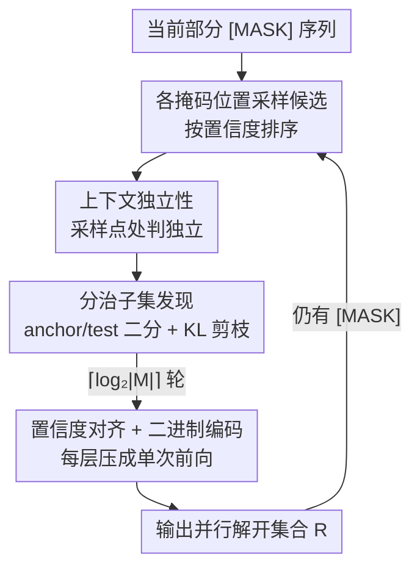

# Parallel Sampling from Masked Diffusion Models via Conditional Independence Testing

**会议**: ICLR 2026  
**OpenReview**: [https://openreview.net/forum?id=XjcHRIu0iF](https://openreview.net/forum?id=XjcHRIu0iF)  
**代码**: 待确认  
**领域**: LLM效率 / 离散扩散 / 并行解码  
**关键词**: 掩码扩散模型, 并行采样, 条件独立性, 训练无关采样器, 推理加速

## 一句话总结
PUNT 是一个训练无关、模型无关的掩码扩散模型（MDM）采样器：它在每一步用「上下文独立性」检验+分治剪枝，只花 $O(\log |M|)$ 次前向就挑出一批互不干扰、且高置信度的 token 同时解码，在长文本对齐基准上以更少的前向次数取得更高质量（IFEval 上比基线高出多达 16%）。

## 研究背景与动机
**领域现状**：自回归语言模型（ARM）逐 token 左到右生成，推理速度被串行性卡死。掩码扩散模型（MDM，如 LLaDA、Dream）提供了非自回归替代方案——从全 [MASK] 序列出发，每一步并行预测多个被掩码位置并解开其中一部分，理论上能大幅加速。

**现有痛点**：到底「一步解开哪些 token」决定了质量与速度的取舍。现有训练无关策略各有缺陷：基于置信度/熵的方法（如 EB-Sampler）只挑高置信 token，却完全忽略 token 之间的相互依赖；结构化/空隙调度器（Dilated、Halton）按固定几何强行隔开并行位置，与具体序列的真实依赖无关；remasking、蒸馏类方法要么增加额外前向开销、要么需要昂贵重训。它们的共同盲点是——**从不显式检验并行解码的 token 之间是否真的互不干扰**。

**核心矛盾**：高质量并行解码同时要满足两个互相冲突的条件：(i) 同一步更新的 token 必须条件独立（否则联合分布无法分解，引入误差）；(ii) 应优先解开高置信度预测。但高置信度的 token 往往扎堆、彼此强相关，恰恰是最不该被同时解开的位置。

**本文目标**：在不重训模型的前提下，每一步高效地找出一个「既条件独立、又高置信度」的位置子集来并行解开，并把找这个子集的成本压到远低于逐位置串行检验的 $O(|M|)$。

**切入角度**：作者放弃了严格的条件独立（要对整个指数级输出空间 $V^R$ 求积分，计算不可行），转而提出只在**当前采样点**判定独立性的「上下文独立性」——这正是决定本步并行采样是否等价于串行采样的充要性质，既比完全独立宽松、又比纯置信度启发式严格。

**核心 idea**：用「在采样点处的条件独立性检验」替代「对所有可能输出的条件独立性」，并用分治+二进制编码把检验成本从 $O(|M|)$ 降到 $O(\log|M|)$。

## 方法详解

### 整体框架
PUNT（Parallel Unmasking with Non-influence Tests）是嵌在 MDM 标准迭代解码循环里的「子集挑选器」。每个去噪步的输入是当前部分掩码序列 $x$，PUNT 要输出一个**上下文独立、且高置信度**的掩码位置集合 $R$，模型把这些位置同时解开，循环直到全部解开。

它做三件事：先对所有掩码位置采样候选并按置信度排序；再用「上下文独立性」作为判据，通过**分治式的 anchor/test 二分 + KL 剪枝**把彼此干扰的低置信 token 逐层剔除；最后借助置信度排序与二进制编码，把整棵递归树的每一层压成**单次前向**完成，使每步只需 $\lceil\log_2|M|\rceil$ 次模型调用。

### 关键设计

**1. 上下文独立性：只在采样点判独立，绕开指数级求和**

真正的条件独立要求联合分布对所有输出分解 $p_R(\cdot\mid x_{-M})=\prod_{i\in R}p_i(\cdot\mid x_{-M})$，验证它要遍历 $V^R$ 这个随 $|R|$ 指数膨胀的空间，计算上不可行。作者定义**上下文独立**（Def 3.1/3.2）：随机变量 $X$ 在点 $y$ 处相对 $Y$ 上下文独立，当且仅当 $p_{X\mid Y}(\cdot\mid Y=y)=p_X(\cdot)$。对序列而言，目标是给定候选向量 $y_M$，找一个有序集合 $R=\{r_1,\dots,r_{|R|}\}$，使每个位置在给定其前序采样结果后分布不变：

$$p_{r_i}(\cdot\mid x_{-M},\,y_{R_{<i}})=p_{r_i}(\cdot\mid x_{-M}).$$

这个判据的关键在于「只看当前已采样的那一个结果」而非所有可能结果——它恰好刻画了「并行采样 = 串行采样」的等价条件：满足它时，把 $(x_1,\dots,x_\ell)$ 顺序采样与并行采样得到同一分布。相比纯置信度启发式（忽略依赖）和完全统计独立（过严），它精准命中了「当前这一步真正需要的那部分独立性」。

**2. 分治剪枝的子集发现：$O(\log|M|)$ 次前向取代 $O(|M|)$ 串行**

最朴素的做法是逐个掩码位置串行检验、满足 (2) 就加入 $R$，但这需要 $O(|M|)$ 次串行前向，等于抵消了并行的意义。PUNT 改用递归分治：对一个按置信度排序的候选集 $S$，(1) **Divide** 切成均衡两半——前半「anchor」$S_0$ 与后半「test」$S_1$；(2) **Prune** 用 KL 散度度量 test 中每个位置受 anchor 候选 $y_{S_0}$ 的影响，

$$\varepsilon_i := D_{KL}\!\big(p_i(\cdot\mid x_{-M})\,\big\|\,p_i(\cdot\mid x_{-M},\,y_{S_0})\big),$$

只保留 $\varepsilon_i<\varepsilon$ 的位置得到 $S_1'$；(3) **Recurse** 对 $S_0$ 与 $S_1'$ 各自并行递归；(4) **Combine** 取两者输出之并。取 $p=\lfloor|S|/2\rfloor$ 保证递归深度 $O(\log|M|)$。

它的正确性依赖**独立稳定性假设**（Assumption 3.3）：若位置 $i$ 在给定 $y_U$ 时分布不变，则对任意子集 $W\subset U$ 也不变。作者指出这其实是 Transformer 注意力机制的直接推论——token 间影响由注意力权重决定，若 $i$ 到集合 $R$ 的累积注意力可忽略，则到任意子集 $U\subset R$ 的注意力（非负，故更小）也可忽略。正因如此，递归任一层做出的独立性判定，在后续层依然成立，分治才合法。

**3. 置信度对齐 + 二进制编码：保质量并把每层压成单次前向**

光有独立性还不够，还要保证「优先解高置信度」。PUNT 把候选集按置信度降序排列 $\phi_{s_1}>\phi_{s_2}>\cdots$ 后再分治，于是 anchor $S_0$ 总含至少中位数级别的高置信 token，被从 $S_1$ 剪掉的必然是更低置信度的——而且全局最高置信度的 token 永不会被剪，必定进入最终的 $R$，从而把置信度排序自然嵌进了独立性筛选。

为把递归变成可并行的迭代，作者给每个位置按其在置信度序中的位次赋一个 $\lceil\log_2|M|\rceil$ 位的二进制码 $\mathrm{bin}(i)$，递归树的每条路径对应一个二进制前缀。第 $b$ 层用第 $b$ 位定义全局划分 $B_b$，把所有 anchor 子集**并起来一次性测试**所有 test token（Remark 3.4 的保守批量检验：通过对全体 anchor 并集的检验，必然通过对各自递归子集的检验）。于是第 $b$ 轮只需：$S_0=R\cap B_b$、$S_1=R\setminus B_b$，单次前向算出所有 $d_j=D_{KL}(p_j(\cdot|x_{-M})\,\|\,p_j(\cdot|x_{-M},y_{S_0}))$，移除 $d_j>\varepsilon$ 的位置。跑完 $\lceil\log_2|M|\rceil$ 轮，$R$ 即为高置信、上下文独立的可并行解码集合。

### 一个完整示例
以 Figure 1 的 4 个掩码 token 为例（"The __ requires __ __ recipe __"，候选 mince/egg/the/garlic 等），$\log_2 4=2$ 轮：按置信度给 token 编号 1–4，第 1 轮把高置信的 {requires, the} 当 anchor，测 {mince, egg}——"mince" 对 {requires, the} 独立（蓝，保留），"egg" 依赖（红，剔除）；第 2 轮继续细分检验。每个 token 必须通过它经历的**所有**独立性检验才被接受。最终集合 {requires, the, mince} 满足上下文独立：$p(\text{requires, the, mince}\mid x_{\text{unmasked}})=p(\text{requires})\,p(\text{the})\,p(\text{mince})$，三者被同一步并行解开，而 "egg" 留到后续步骤。这正展示了候选如何在两轮内从 4 个收缩到一个安全可并行的子集。

### 损失函数 / 训练策略
PUNT 是**训练无关**的纯推理期采样器，不改动模型权重、不蒸馏、不微调，直接套在已训练好的 MDM（Dream 7B、LLaDA 1.5）上。唯一超参是探索率/独立性阈值 $\varepsilon$，实验显示对其取值不敏感（详见关键发现）。

## 实验关键数据

### 主实验
在 Dream 7B、LLaDA 1.5 两个开源 MDM 上评测，对比三个强训练无关基线：top-k 采样、EB-Sampler、Dilated-Sampler。

| 任务类型 | 基准 | 模型 | 结论 |
|--------|------|------|------|
| 长文本对齐 | IFEval | Dream 7B | 比基线（含逐 token 串行）准确率最高 +16%，且前向次数更少 |
| 长文本对齐 | MTBench | Dream 7B | 两项指标（inst-level loose acc / mean score）全面超基线 |
| 蛋白质生成 | de novo 膜蛋白 (MemDLM) | — | 在结构化生物域无条件生成上优于基线 |
| 数学/代码（短答） | GSM8K / HumanEval / MBPP | LLaDA | 按 NFE 计与 EB 接近，按去噪步数计反超 |

PUNT 的优势集中在**低–中 NFE 区间的长文本生成**：每轮独立性检验需 $\lceil\log_2|M|\rceil$ 次前向（如 1024 token 约 10 次），在 NFE 预算足够检验、又仍有加速空间时收益最大；在极高 NFE（如 MT-Bench NFE≥400）下，固定几何调度器（Dilated）能负担很多去噪步，曲线可能收敛或交叉。

### 消融实验

| 配置 / 维度 | 关键指标 | 说明 |
|------|---------|------|
| 不同 $\varepsilon\in\{0.01,\dots,0.32\}$ | IFEval/MTBench 得分 | 跨超参增益稳定，免去脆弱调参 |
| 并行采样误差 $\delta_{KL}$ vs 已揭示 token 数 | $\delta_{KL}$ 中位数 + (Q5,Q95) | Q5 在所有位置 $<10^{-3}$，误差稳健低于 $\varepsilon$ 阈值 |
| 短答 vs 长文 | NFE / 去噪步数 | 短答上下文少需多次前向，PUNT 不占优；长文优势明显 |

并行采样误差定义为对在同一步并行解开的 $r_i$ 位置：

$$\delta^{r_i}_{KL}=D_{KL}\!\big(p^{r_i}_\theta(\cdot\mid x_{-M})\,\big\|\,p^{r_i}_\theta(\cdot\mid x_{-M},\,y_{R_{<i}})\big),$$

衡量「假设 $r_i$ 与同步其他 token 独立」所损失的信息——实测它稳健地低于 $\varepsilon$，且与该步已揭示 token 数无关。

### 关键发现
- **超参鲁棒**：跨 $\varepsilon$ 取值增益稳定，避免了同类方法对脆弱超参调优的依赖——这是相对 EB/Dilated 的一大实用优势。
- **涌现的层次化生成**：PUNT 会先建立段落/标题等高层结构（Fig.2 第 9 步已生成主副标题），再填充细节（第 18 步）。作者假设这源于高层结构 token 与细粒度细节之间的条件独立——细节对结构影响极小，故结构 token 早早通过独立性检验被先解开，且一旦揭示便充当「上下文锚点」把文本切成条件独立的小节，让不同小节并行解码，呈现类「规划」的生成过程。
- **场景偏好明确**：长文本/对齐任务收益最大；短上下文短答任务因需多次前向而不占优（作者提出仅在生成后半段用 PUNT 作为可能修复，留待未来）。

## 亮点与洞察
- **「上下文独立」是点睛之笔**：用「采样点处独立」替代「对全输出空间独立」，把一个指数级不可行的检验降成可计算的判据，且恰是「并行=串行」的等价条件，理论与实用都站得住。
- **分治 + 二进制编码把 $O(|M|)$ 砍到 $O(\log|M|)$**：用置信度序的二进制前缀预先定下所有划分，再把每层所有检验并到一次前向里，是把递归算法工程化为并行迭代的漂亮一招，可迁移到其它「逐元素筛选」的并行加速场景。
- **把独立稳定性假设落到注意力上**：用「注意力权重非负 + 子集注意力更小」论证假设对 Transformer 成立，给了一个可解释、可经验验证的依据，而非凭空假设。
- **层次化规划是免费副产品**：没有显式规划模块，纯靠独立性检验就涌现出「先骨架后细节」的生成顺序，对理解 MDM 的生成机制很有启发。

## 局限与展望
- **作者承认**：短答/短上下文任务无优势（按 NFE 计），因每步独立性检验的 $\log|M|$ 次前向摊不开；极高 NFE 预算下相对固定几何调度器的开销变得不划算。
- **保守的批量检验**：把 test token 对「全体 anchor 并集」检验比对各自递归子集更严，会拒掉一些其实安全的 token（更保守），换取完全并行；这是质量–并行度的折中。
- **假设近似成立**：独立稳定性假设与「注意力≈影响」只是近似（且 EOS padding token 是例外），层次化生成现象也只给了假设性解释，缺正式证明。
- **改进思路**：作者提出对阈值 $\varepsilon$ 做自适应/课程式调度（早期多探索、后期重精度）、把 PUNT 蒸馏成单次前向预测独立集合的学生模型、与 KV-caching 等正交优化叠加。

## 相关工作与启发
- **vs EB-Sampler（置信度/熵门控）**：EB 动态解开聚合熵低于阈值 $\gamma$ 的可变大小集合，但只看置信度、忽略 token 间依赖，且偏保守只解小子集；PUNT 显式检验依赖，能更激进地并行更多真正独立的 token。
- **vs Dilated / Halton（空隙调度器）**：它们用固定几何强行隔开并行位置，与序列真实依赖无关；PUNT 按内容自适应，依赖结构变就改并行集合，长文本上 Pareto 前沿更稳。
- **vs ReMDM / P2 / DDPD（remasking 与规划-去噪分离）**：这些通过额外的重掩码/修正轮纠错，会增加 NFE；PUNT 在解开前就筛掉会互相干扰的 token，从源头减少误差而非事后修。
- **vs 自回归加速（speculative decoding）**：投机解码本质仍串行；PUNT 利用 MDM 的任意序、非串行生成能力直接减少 NFE，KV-caching 等正交优化对两者都适用。

## 评分
- 新颖性: ⭐⭐⭐⭐⭐ 「上下文独立性 + 分治 $O(\log m)$ 检验」是对 MDM 并行解码取舍的全新、有理论支撑的解法。
- 实验充分度: ⭐⭐⭐⭐ 覆盖两模型、多基线、长文/短答/蛋白质多域并有误差分析，但短答场景偏弱、部分依赖附录。
- 写作质量: ⭐⭐⭐⭐⭐ 动机、判据定义、算法到工程实现层层递进，图示清晰。
- 价值: ⭐⭐⭐⭐⭐ 训练无关、模型无关、超参鲁棒，对加速扩散式 LLM 推理有直接实用价值。

<!-- RELATED:START -->

## 相关论文

- [\[ICLR 2026\] Learning to Parallel: Accelerating Diffusion Large Language Models via Learnable Parallel Decoding](learning_to_parallel_accelerating_diffusion_large_language_models_via_learnable_.md)
- [\[ICLR 2026\] NI Sampling: Accelerating Discrete Diffusion Sampling by Token Order Optimization](ni_sampling_accelerating_discrete_diffusion_sampling_by_token_order_optimization.md)
- [\[ICLR 2026\] ReFusion: A Diffusion Large Language Model with Parallel Autoregressive Decoding](refusion_a_diffusion_large_language_model_with_parallel_autoregressive_decoding.md)
- [\[ICLR 2026\] Hierarchy Decoding: A Training-free Parallel Decoding Strategy for Diffusion Large Language Models](hierarchy_decoding_a_training-free_parallel_decoding_strategy_for_diffusion_larg.md)
- [\[ICLR 2026\] Diffusion Language Models Know the Answer Before Decoding](diffusion_language_model_knows_the_answer_before_it_decodes.md)

<!-- RELATED:END -->
