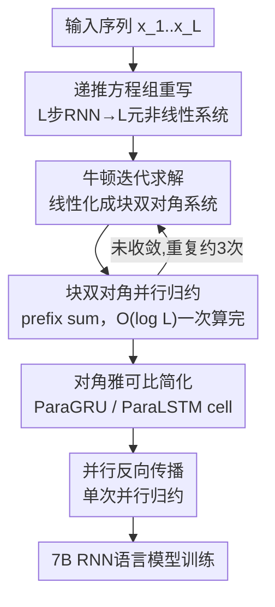

# ParaRNN: Unlocking Parallel Training of Nonlinear RNNs for Large Language Models

**会议**: ICLR 2026  
**OpenReview**: [https://openreview.net/forum?id=mX8b64iUaa](https://openreview.net/forum?id=mX8b64iUaa)  
**代码**: https://github.com/apple/ml-pararnn/  
**领域**: LLM效率 / 序列建模架构  
**关键词**: 非线性RNN, 序列并行, 牛顿迭代, 并行归约, 语言模型

## 一句话总结
把整条非线性 RNN 的逐步递推改写成一个 $L$ 元非线性方程组，用牛顿迭代 + 块双对角并行归约一次性求解，从而第一次让经典非线性 RNN（GRU/LSTM）也能像 Transformer/Mamba 一样沿序列长度并行训练——最高比朴素顺序应用快 665×，并据此训出 7B 规模、困惑度可与同尺寸 Transformer/Mamba2 比肩的 RNN 语言模型。

## 研究背景与动机
**领域现状**：Transformer 因为注意力可以沿序列长度并行计算，训练效率高，迅速取代了 GRU/LSTM 等经典 RNN。近两年状态空间模型（SSM，如 Mamba/Mamba2）又凭借更省显存、推理更快重新流行，它们能并行训练的关键在于把 RNN 的递推步**强行约束成对隐状态线性**，从而利用结合律 + 并行扫描（prefix sum）一次算完整段序列。

**现有痛点**：线性是为了能并行而做出的妥协，而非真实需要。多篇理论工作指出，纯线性递推的表达力存在硬上限，无法建模复杂的、跨步非线性的序列依赖（比如状态追踪类任务）。换句话说，整个领域为了训练效率，把"非线性递推"这条路给堵死了。

**核心矛盾**：RNN 的递推 $h_l = f(h_{l-1}, x_l)$ 天生是顺序的，必须沿序列展开，无法并行；而要并行就得让 $f$ 对 $h$ 线性，可线性又牺牲表达力。表达力与可并行性之间存在直接冲突。

**本文目标**：在**不牺牲非线性表达力**的前提下，让任意（马尔可夫）非线性 RNN 也能沿序列长度并行训练，并把这套方法推到 LLM（7B）规模，验证它真能训练出有竞争力的语言模型。

**切入角度**：作者借鉴了"时间并行求解常微分方程（ODE）"的思路——既然顺序求解是因为后一步依赖前一步，那就别一步步算，而是把所有步骤的耦合写成**一个大方程组**，用迭代法整体逼近解。把 RNN 的 $L$ 步递推视作一个含 $L$ 个未知隐状态的非线性方程组，用牛顿法求解。

**核心 idea**：用"牛顿迭代 + 并行归约求解块双对角线性系统"替代"逐步顺序展开"，把非线性 RNN 的前向应用从 $O(L)$ 的串行变成 $O(\log L)$ 的并行。

## 方法详解

### 整体框架
ParaRNN 解决的是"非线性 RNN 没法并行训练"这一根本障碍。它的整体思路是：不再把序列 $[x_l]_{l=1}^L$ 一步步喂进 cell，而是把所有 $L$ 步递推关系**整体收集成一个非线性方程组**，再用牛顿法迭代求解；牛顿法每一轮要解的线性化系统因为 RNN 的马尔可夫性质恰好是**块双对角结构**，正好能用并行归约（prefix sum）一次性算完。整个前向 = 外层牛顿迭代套内层并行归约；反向传播则更简单，本身就是线性的，单次并行归约即可。为了让这套机器真正高效，作者还把 GRU/LSTM 的雅可比简化成对角结构，并提供了三档 PyTorch+CUDA 实现。

### 关键设计

**1. 把顺序递推重写成方程组，用牛顿迭代整体求解**

这一步直接针对"RNN 必须沿序列顺序展开"的痛点。把 $h_l = f(h_{l-1}, x_l),\ l=1\dots L$ 这 $L$ 条递推关系拼成一个以 $[h_l]_{l=1}^L$ 为未知量的非线性方程组 $h_l - f(h_{l-1}, x_l) = 0$。求解用牛顿法：给定第 $k$ 轮近似解，求解其线性化系统得到增量 $\delta h_l^k$，更新 $h_l^{k+1} = h_l^k + \delta h_l^k$，直到收敛。线性化系统的系数矩阵是单位阵主对角 + 次对角放雅可比 $-J_f|_{h_l^k}$ 的形式：

$$\delta h_l^k = J_f|_{h_l^k}\,\delta h_{l-1}^k + \big(f(h_{l-1}^k, x_l) - h_l^k\big)$$

关键在于：理论上牛顿法要 $L$ 步才保证收敛，那样比顺序应用还慢、毫无意义；但作者在实践中发现，对本文采用的 RNN cell，**3 次牛顿迭代在所有情形下都已足够**，于是迭代次数被压成常数 $O(1)$，并行才有意义。这是整套方法可行的前提，也是引入新 cell 时必须重新验证的一点。

**2. 块双对角线性系统的并行归约求解**

光把问题写成方程组还不够——上面那个线性系统若用前向代入逐步解，本质又退化回 $O(L)$ 顺序展开，并行就白做了。作者注意到，增量递推式 $\delta h_l = J_f|_{h_l}\delta h_{l-1} + r_l$（其中残差 $r_l = f(h_{l-1}^k, x_l) - h_l^k$）**本身就是一个线性 RNN**：雅可比 $J_f$ 充当状态转移矩阵，残差 $r_l$ 充当输入。线性递推满足结合律，展开后

$$\delta h_l^k = \sum_{s=1}^{l}\Big(\prod_{r=0}^{l-s-1} J_f|_{h_{l-r}^k}\Big) r_s$$

不同 $l$ 之间的乘积项存在大量重复，正是 prefix sum / 并行归约能利用的冗余，于是整段 $[\delta h_l^k]_{l=1}^L$ 可在 $O(\log_2 L)$ 步内并行算出，而非 $O(L)$ 串行。这是把"看似只能顺序解"的系统真正变并行的核心算法。值得一提的是，该框架天然涵盖线性 SSM：当 $f$ 线性时雅可比退化为状态转移矩阵本身，牛顿一步即收敛，整套流程退回到普通 SSM 扫描——说明 ParaRNN 是 Mamba 这类方法的严格超集。

**3. 对角雅可比简化与适配的 ParaGRU / ParaLSTM cell**

并行归约的瓶颈在于要反复连乘雅可比 $\prod J_f|_{h_l}$。若 RNN 用稠密雅可比，显存要 $O(L d_h^2)$、每次配对相乘要 $O(d_h^3)$，规模一上来就不可行。作者没有像前人那样去**近似**雅可比（那会污染反向、影响训练动态），而是反过来**直接修改 cell 定义让雅可比天生简单**：把 GRU/LSTM 中所有状态矩阵 $A_*$、peephole 矩阵 $C_\star$ 都约束成对角矩阵 $A_* = \mathrm{diag}(a_*),\ C_\star = \mathrm{diag}(c_\star)$。这样 ParaGRU 的雅可比退化为对角阵、ParaLSTM（隐状态拆成 $[c_l, h_l]$，雅可比是 $2\times2$ 块结构）退化为对角块，显存降到 $O(L d_h)$、每次相乘只要 $O(d_h)$，且对隐状态各维完全可并行。代价是这等于把一个 $d_h$ 维 cell 拆成 $d_h$ 个独立的一维 cell，抑制了状态维度间的混合、损失部分表达力（实验里体现在 A5 这类难任务上）；但作者强调对角只是为了"对齐 Mamba、控制工作量"的选择，框架本身支持任何能高效并行归约的雅可比结构。

**4. 单次并行归约的反向传播**

前向因为非线性要靠牛顿迭代，但反向传播本身是**线性**操作，不需要牛顿迭代，可直接一次并行归约搞定。给定损失对各隐状态的偏导 $[\partial_{h_l}\mathcal{L}]$，全梯度的反向递推为

$$\nabla_{h_{l-1}}\mathcal{L} = J_f|_{h_{l-1}}^\top \nabla_{h_l}\mathcal{L} + \partial_{h_{l-1}}\mathcal{L},\quad l = L,\dots,1$$

它和前向的式子结构完全一致，只是把雅可比换成转置、并向后展开，因此能复用同一套并行归约算法，仅需极小改动。这让前向反向都享受 $O(\log L)$ 并行，训练全程不退回串行。

### 损失函数 / 训练策略
标准语言建模（下一 token 预测）训练，无额外损失项。作者把 DCLM Transformer 主干里的注意力替换成自家 RNN cell，并保留 Mamba 的因果卷积与门控残差层；训练数据为去掉 Books3 split 的 SlimPajama，按 Chinchilla-optimal 设定在 400M / 1B / 2.9B / 7B 四档规模上训练，与 Transformer、Mamba2 同条件对比。

## 实验关键数据

### 主实验（7B 语言模型）

| 模型 | 参数量 | PPL↓ | HSwag(0) | PiQA(10) | WinoG(0) | MMLU(0) |
|------|--------|------|----------|----------|----------|---------|
| Mamba2 | 6.96B | **8.62** | 69.68 | 76.66 | 63.77 | **26.61** |
| ParaGRU | 6.76B | 9.19 | 65.75 | 76.66 | 59.83 | 25.29 |
| ParaLSTM | 6.76B | 9.16 | 62.85 | 75.19 | 59.12 | 25.31 |
| Transformer (DCLM) | 6.89B | 9.55 | 62.20 | 74.97 | 60.85 | 23.12 |

排序一致：Mamba2 最强，ParaGRU/ParaLSTM 居中，DCLM Transformer 垫底。作者明确表示目标不是提出更强的 RNN，而是证明经典非线性 RNN 训到 7B 后能与现代架构掰手腕。

### 速度与并行性

| 对比项 | 结果 |
|--------|------|
| RNN cell 应用 vs 朴素顺序（$L=2^9$） | 最高 **665×** 加速（ParaLSTM），ParaGRU >447× |
| 全融合 CUDA 前向 vs Mamba（$L=2^9$） | ParaGRU **2.6×**、ParaLSTM **1.5×** 加速 |
| 推理吞吐 | ParaGRU ~38 tkn/s、ParaLSTM ~37 tkn/s，Mamba2 ~28；且不随序列长度增长 |
| 并行归约复杂度 | $O(\log L)$（PyTorch 实现可见对数增长，接近 GPU 容量后才退化为线性） |

### 表达力消融（单层合成任务，Tab.1）

| 模型 | Cycle Nav | Mod Arithm | A5 |
|------|-----------|-----------|-----|
| 原版 LSTM/GRU（稠密雅可比） | 100% | 100% | 100% |
| ParaLSTM（对角） | 95% | 94% | 38% |
| ParaGRU（对角） | 90% | 63% | 40% |
| Mamba2（线性） | 57% | 44% | 36% |

### 关键发现
- **非线性是关键**：ParaGRU/ParaLSTM 在几乎所有合成任务上一致超过线性的 Mamba2，证明非线性递推确实带来线性 SSM 缺乏的表达力。
- **对角约束是表达力短板**：ParaGRU/ParaLSTM 在 A5、Modular Arithmetic 上明显掉点，而保留稠密雅可比的原版 LSTM/GRU 满分——说明掉点来自"对角化"而非"RNN 本身"，未来换更丰富的雅可比结构有提升空间。
- **块对角比对角慢**：ParaLSTM 的 $2\times2$ 块对角归约比 ParaGRU 的纯对角更耗内存与算力（$L=2^9$ 时相对 Mamba ~0.84× 慢），符合预期。

## 亮点与洞察
- **把"序列并行"问题转译成"解非线性方程组"**：这是最漂亮的一步——一旦视角从"逐步展开"切换到"整体求解"，牛顿法 + 并行归约这套数值代数工具就全部可用，且天然兼容线性 SSM（退化为单步牛顿）。
- **改 cell 而非近似雅可比**：前人为可行性去近似雅可比，会连带近似反向、扰动训练；本文反其道而行，直接把雅可比"设计成"对角，从而前向反向都精确，训练稳定可扩展。这个"动结构而非动近似"的思路可迁移到其它想并行化的顺序算子。
- **3 次牛顿迭代足够**：把理论上 $O(L)$ 的收敛在实践中压到 $O(1)$，是整套并行有意义的现实前提，也是一个干净的工程洞察。
- **开源即贡献**：ParaRNN 作为 PyTorch+CUDA 库，用户只需写出 cell 的递推公式，框架用 autograd 自动组装雅可比并并行求解，提供纯 PyTorch / CUDA 加速 / 全融合三档实现，降低了探索新非线性 RNN 的门槛。

## 局限与展望
- **对角雅可比损表达力**：为可并行性付出的代价是抑制隐状态维度间混合，导致 A5 等状态追踪难任务掉点；作者承认这非框架固有限制，换 Householder 等结构可缓解。
- **牛顿收敛需逐 cell 验证**：3 次迭代足够只是对本文 cell 的经验结论，新定义的 RNN 必须重新确认收敛步数，否则并行优势会被吞掉。
- **块对角开销**：ParaLSTM 这类块结构归约比纯对角更慢、更耗显存，是计算-并行权衡的体现。
- **性能仍略逊 Mamba2**：7B 困惑度 9.16/9.19 vs Mamba2 的 8.62，作者定位为"达到竞争力的第一步"而非超越，进一步缩小差距留待后续。

## 相关工作与启发
- **vs Mamba/SSM**：SSM 靠把递推约束成线性来换并行，本文用牛顿+并行归约移除了这条线性约束，是 SSM 的严格超集（线性时一步牛顿即退回 SSM），但代价是每步要迭代牛顿与组装雅可比。
- **vs minGRU/minLSTM、xLSTM**：minGRU/minLSTM 核心仍是线性递推（非线性不触及状态）；xLSTM 的 mLSTM 虽非线性但只能顺序应用、且受隐状态尺寸限制。本文是真正把非线性递推沿序列并行化。
- **vs Gonzalez et al. (2024)**：前者对 GRU 用拟牛顿 + 对角雅可比近似来做时间序列，但近似了反向、可能影响训练动态；本文直接改 cell 定义得到精确对角雅可比，训练更稳，并扩展到此前未测过的更复杂 cell 与 7B 规模。
- **思想来源**：借鉴时间并行求解 ODE 的方法（Gander 2015）以及 Danieli et al. (2023) 用牛顿+并行归约并行化 ResNet/扩散模型的思路，本文首次把它落到 LLM 规模的语言建模。

## 评分
- 新颖性: ⭐⭐⭐⭐⭐ 首次把非线性 RNN 沿序列并行训练推到 7B 规模，视角转译干净漂亮
- 实验充分度: ⭐⭐⭐⭐ 4 档规模 + 合成任务 + 速度/推理全覆盖，但与 Mamba2 仍有可见差距
- 写作质量: ⭐⭐⭐⭐⭐ 方法推导清晰，伪代码与雅可比公式完整，结论诚实不夸大
- 价值: ⭐⭐⭐⭐⭐ 重新打开"非线性 RNN"这条被封死的路，并开源易用框架，潜在影响大

<!-- RELATED:START -->

## 相关论文

- [\[ICLR 2026\] Unlocking Full Efficiency of Token Filtering in Large Language Model Training](unlocking_full_efficiency_of_token_filtering_in_large_language_model_training.md)
- [\[ICLR 2026\] Hierarchy Decoding: A Training-free Parallel Decoding Strategy for Diffusion Large Language Models](hierarchy_decoding_a_training-free_parallel_decoding_strategy_for_diffusion_larg.md)
- [\[ICLR 2026\] Learning to Parallel: Accelerating Diffusion Large Language Models via Learnable Parallel Decoding](learning_to_parallel_accelerating_diffusion_large_language_models_via_learnable_.md)
- [\[ICLR 2026\] AutoSP: Unlocking Long-Context LLM Training Via Compiler-Based Sequence Parallelism](autosp_unlocking_long-context_llm_training_via_compiler-based_sequence_paralleli.md)
- [\[ICLR 2026\] ReFusion: A Diffusion Large Language Model with Parallel Autoregressive Decoding](refusion_a_diffusion_large_language_model_with_parallel_autoregressive_decoding.md)

<!-- RELATED:END -->
