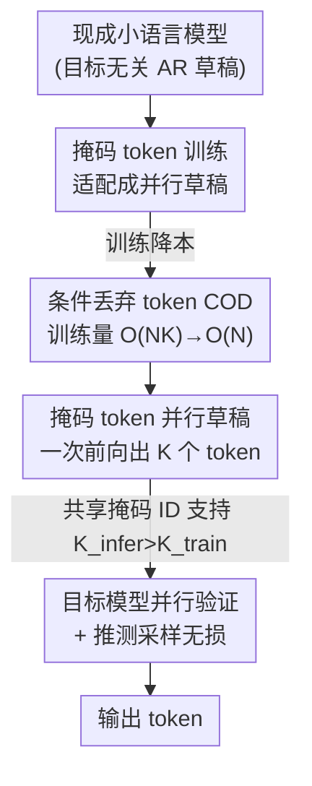

# PARD: Accelerating LLM Inference with Low-Cost Parallel Draft Model Adaptation

**会议**: ICLR 2026  
**OpenReview**: [https://openreview.net/forum?id=XbOyv7iVGL](https://openreview.net/forum?id=XbOyv7iVGL)  
**代码**: https://github.com/AMD-AGI/PARD  
**领域**: LLM效率 / 推测解码  
**关键词**: 推测解码、并行草稿、目标无关、掩码 token、训练加速  

## 一句话总结
PARD 把一个现成的小语言模型改造成「一次前向就并行吐 $K$ 个 token」的目标无关草稿模型，再用条件丢弃 token（COD）把这种改造的训练成本砍到 $O(N)$，在 vLLM 上让 LLaMA3.1-8B 达到 264.88 tokens/s，比自回归快 $3.67\times$、比 EAGLE-3 快 $1.15\times$。

## 研究背景与动机
**领域现状**：推测解码（Speculative Decoding, SD）是当下给 LLM 推理提速的主流路线——用一个轻量草稿模型先猜出若干候选 token，再让大目标模型一次前向并行验证，从而绕开自回归「一次前向只出一个 token」的内存带宽瓶颈，且通过推测采样保证输出分布无损。其中 EAGLE 系列把目标模型的中间特征喂给草稿头，取得了很强的加速比，是事实上的 SOTA。

**现有痛点**：EAGLE、Medusa、LayerSkip、Kangaroo 这类高精度方法都属于**目标相关（target-dependent）**——草稿模型要么吃目标模型的输出特征，要么复用目标模型的若干层，于是草稿与目标被死死绑在一起。每换一个目标模型（哪怕同一家族的 8B→70B→405B），都得重新训练一个专属草稿头，适配和部署成本巨大；而 EAGLE-3 训练一次的算力开销尤其高。

**核心矛盾**：高精度依赖「贴着目标模型训练」，但贴得越紧、迁移成本越高。另一条路——vanilla SD 用一个独立小模型（如 LLaMA3.2-1B）当草稿，是**目标无关**的、迁移成本几乎为零，而且实测首 token 接受率比 EAGLE 头还高；可它的草稿阶段要自回归地跑 $K$ 次前向，草稿本身就拖慢了整体，速度反而可能输给 EAGLE。

**本文目标**：彻底跳出「目标相关」范式，做一个**目标无关、又快又准、且适配成本低**的草稿方案。要同时解决两个子问题：(1) 怎么让独立小草稿模型在一次前向里就并行产出 $K$ 个 token，消掉它的草稿延迟；(2) 怎么以低成本把一个标准自回归小模型「教会」并行预测。

**切入角度**：既然 vanilla SD 的草稿精度本来就够高，缺的只是「草稿太慢」，那就把它从自回归改成并行——借鉴 Mask-Predict，用掩码 token 当占位符切断 token 间依赖，让 $K$ 个未来 token 在同一前向里被同时预测。

**核心 idea**：用掩码 token 把现成小 LLM 改造成「单次前向并行出 $K$ 个 token」的目标无关草稿模型（PARD），并用条件丢弃 token（COD）把这种改造的训练 token 量从 $O(N\cdot K)$ 压回 $O(N)$。

## 方法详解

### 整体框架
PARD 的出发点是一个**现成的、目标无关的**小语言模型（如 LLaMA3.2-1B、Qwen2.5-0.5B），它本身就是高精度的自回归（AR）模型，可以给整个目标家族当草稿。问题在于 AR 草稿要跑 $K$ 次前向，每轮草稿耗时 $T_{\text{ARdraft}} = K\cdot T_D + T_T$。PARD 做两件事把它变好用：推理侧引入掩码 token 让草稿**一次前向并行出 $K$ 个 token**，把草稿时间压到 $T_{\text{PARD}} = T_D + T_T$（草稿耗时降到原来的 $1/K$）；训练侧用掩码 token 训练把 AR 草稿适配成并行草稿，再叠加 COD 把训练成本降下来。改造完的草稿照常接进标准 SD 流程——草稿出候选、目标模型并行验证、推测采样保证无损。

### 关键设计

**1. 目标无关草稿：一个草稿模型加速整个目标家族**

针对「EAGLE 每换目标就要重训一个草稿头」的高适配成本，PARD 直接拿一个**独立的现成小 LLM** 当草稿，不读目标模型的任何特征或中间层。这样同一个草稿模型可以无差别地加速 LLaMA3-8B / 70B / 405B 整条家族（实验里一个 PARD 草稿同时服务三个 LLaMA3 目标和三个 Qwen 目标），部署门槛大幅降低。这条路之所以可行，是因为作者先验证了独立小模型的草稿精度并不输——LLaMA3.2-1B 对 LLaMA3.1-8B 的首 token 接受率（0.944/0.895）显著高于 EAGLE 头；唯一的代价是草稿要自回归多跑几次前向，而这正是接下来两个设计要消掉的。

**2. 掩码 token 并行草稿：一次前向并行预测 $K$ 个 token**

AR 草稿慢的根因是 token 之间有依赖、必须串行生成。PARD 借 Mask-Predict 的思路，引入一个特殊占位符 $m_k$ 替换掉那些会制造依赖的位置，把联合分布改写成

$$P(x_n,\dots,x_{n+K-1}\mid x_0,\dots,x_{n-1};\theta_{\text{PARD}}) = P(x_n\mid x_{<n})\prod_{k=1}^{K-1}P(x_{n+k}\mid x_{<n}, m_0,\dots,m_{k-1}).$$

每一步的预测只依赖真实前缀和掩码占位符、彼此互不依赖，于是 $K$ 个 token 能在**同一前向**里全部算出来，草稿所需前向次数从 $K$ 降到 $1$。配合精心设计的注意力掩码（让 query 看到正确的前缀 KV），训练与推理保持一致。直接收益就是草稿耗时从 $K\cdot T_D+T_T$ 变成 $T_D+T_T$，把「独立草稿精度高但太慢」的短板补上。

**3. 条件丢弃 token（COD）：把并行训练成本从 $O(NK)$ 压回 $O(N)$**

掩码 token 训练把单条样本拆成 $K$ 个子任务（分别预测 +1、+2、…、+$K$ 位置），训练 token 量随之从 $N$ 暴涨到 $K\times N$，训练变得很贵。COD 的洞察是：**靠前的子任务更关键，靠后的子任务可以选择性丢弃**。它对第 $i$ 个子任务按几何衰减保留 token，保留数 $N_i = N\cdot r^{i-1}$，总训练 token 量

$$N_{\text{COD}}=\sum_{i=1}^{K}N\cdot r^{i-1}=N\frac{1-r^{K}}{1-r}<\frac{N}{1-r},$$

例如 $r=0.5$ 时总量被压到约 $2N$。关键在「条件」二字——丢弃不是随机的，而是保证每个被保留的 token 在算注意力时**前缀 KV 仍然完整**（prefix key-value 完整性），所以丢了 token 也不丢上下文表征。为防止靠后子任务被丢得太狠，再加一个最低保留率 $r_{\min}$，得 $N_i'=N\cdot\max(r^{i-1}, r_{\min})$。整体把训练复杂度从 $O(N\cdot K)$ 降到 $O(N)$，实测训练效率比传统掩码预测训练高 $3\times$、比 EAGLE 高 $7\times$、比 EAGLE-3 高 $10\times$，而精度基本不掉。

**4. 共享掩码 token ID 与外推能力：$K_{\text{infer}}$ 可以大于 $K_{\text{train}}$**

所有预测位置共用同一个掩码 token id（$m_0=m_1=\dots=m_{K-1}$），而不是给每个位置分配不同 id。这个看似细枝末节的选择不仅吞吐更高（221.97 vs 218.05 tokens/s），更带来「外推能力」：因为掩码位置不再绑定具体序号，推理时可以用比训练更大的草稿长度 $K_{\text{infer}}>K_{\text{train}}$。实验里 $K_{\text{train}}\geq 8$ 后性能就稳定，而 $K_{\text{infer}}=12$ 时最优——于是只需训到 $K_{\text{train}}=8$，推理时再放大草稿长度白赚一截速度。

### 损失函数 / 训练策略
每个子任务用交叉熵独立训练，第 $k$ 个子任务的损失为

$$L_k=\begin{cases}-\dfrac{1}{N}\sum_{i=1}^{N}\log P(x_i\mid x_0,\dots,x_{i-1};\theta_{\text{PARD}}), & k=1,\\[2mm]-\dfrac{1}{N-k+1}\sum_{i=k}^{N}\log P(x_i\mid x_0,\dots,x_{i-k}, m_0,\dots,m_{k-2};\theta_{\text{PARD}}), & k>1.\end{cases}$$

训练在 8×MI250X 上用 TRL 框架跑 4 个 epoch，超参 $k=8$、$r=0.7$、$r_{\min}=0.2$。每个模型系列选最小变体做草稿，并用各自匹配的指令数据集（LLaMA3 用 Magpie-Llama-3.1-Pro + Evol-CodeAlpaca，Qwen2.5 用对应 Magpie，DeepSeek-R1-Qwen 用 OpenR1-Math 等）训练，LLaMA3/Qwen 还重新生成答案以提升精度。

## 实验关键数据

### 主实验
评测全部在工业级 vLLM 框架、A100-40GB 上进行，指标为 Tokens/s 与相对 AR 的加速比。

| 目标模型 | 方法 | HumanEval TPS | HumanEval 加速 | 平均加速 |
|--------|------|------|------|------|
| LLaMA3.1-8B | AR | 73.07 | 1.00× | 1.00× |
| LLaMA3.1-8B | VSD | 155.47 | 2.13× | 1.84× |
| LLaMA3.1-8B | EAGLE | 136.05 | 1.86× | 1.58× |
| LLaMA3.1-8B | EAGLE-3 | 233.43 | 3.19× | 2.65× |
| LLaMA3.1-8B | **PARD** | **264.88** | **3.63×** | **3.00×** |
| Qwen2.5-7B | PARD | 285.82 | 3.76× | 3.18× |
| Qwen2.5-14B | PARD | 181.19 | 4.44× | 3.71× |

代码任务上 PARD 加速 $3.20\times\sim4.44\times$、平均 $2.65\times\sim3.71\times$；LLaMA3.1-8B 上比 EAGLE 快约 $1.9\times$、比 EAGLE-3 快 $1.15\times$。结论里报的 $3.67\times$ 即相对 AR 的整体加速。

### 消融实验

| 配置 | 关键指标 | 说明 |
|------|---------|------|
| 接受率（PARD vs EAGLE-3） | 1-α 0.93 / 4-α 0.90 vs 0.87 / 0.85（HumanEval） | PARD 接受率更高 |
| 草稿阶段带宽（k=8） | 2.48 GB vs EAGLE 11.88 GB | PARD 带宽随 $k$ 不变 |
| COD 保留率 $r$/$r_{\min}$ | $r{=}0.7, r_{\min}{=}0.2$ 速度-精度最佳平衡 | 训练快 3× 且精度不掉 |
| 共享 vs 独立掩码 id | 221.97 vs 218.05 tokens/s | 共享 id 更优且能外推 |
| $K_{\text{train}}$ / $K_{\text{infer}}$ | $K_{\text{train}}{\geq}8$ 稳定，$K_{\text{infer}}{=}12$ 最优 | 推理草稿长度可超训练值 |

### 关键发现
- **PARD 同时赢在两端**：接受率比 EAGLE 系列高，草稿阶段带宽却恒定（2.48 GB，不随 $k$ 增长），二者叠加才换来更高的实际加速——这印证了「高接受率 + 低带宽 = 高加速」的判断。
- **COD 是低成本适配的关键**：随机丢弃会破坏前缀 KV 完整性导致精度崩，而 COD 在保证 KV 完整的前提下按几何衰减丢，才做到「训练快 3× 而精度不掉」。
- **外推能力是免费午餐**：共享掩码 id 让 $K_{\text{infer}}$ 能超过 $K_{\text{train}}$，只训到 8、推理放大到 12 就拿到额外加速。
- **批量增大时优势收窄**：batch size 1→16 时瓶颈从访存转向算力，PARD 加速降到 $1.33\times\sim3.63\times$，说明它的收益主要来自缓解内存带宽瓶颈。

## 亮点与洞察
- **「换草稿底座而非贴目标」的范式转换**：别人都在想办法让草稿更贴近目标模型，PARD 反其道而行，直接用现成高精度小模型当草稿，把适配成本从「每个目标重训」降到「一个草稿全家族通用」——这是工程落地上极有价值的解耦。
- **COD 把「并行训练贵」这个老问题用几何级数干净化解**：$N(1-r^K)/(1-r)<N/(1-r)$，一个简单求和就把 $O(NK)$ 收敛到 $O(N)$，且「条件」保 KV 完整这一点是精度不掉的真正原因，可迁移到任何掩码并行训练场景。
- **共享掩码 id → 外推**：一个 id 共享的小决定换来「训短推长」的能力，这个 trick 对其他多 token 并行预测方法同样适用。
- **认真对齐工业框架**：所有结论都在 vLLM 上测（而非 Transformers），并指出 Transformers 低效会虚高相对加速比，这种诚实度让数字更可信。

## 局限与展望
- **依赖存在高质量小模型**：PARD 建立在「目标家族里有现成高精度小 LLM」之上；若某家族没有合适的小模型，目标无关的前提就不成立。
- **大 batch 下收益缩水**：当推理转为 compute-bound，加速降到 $1.33\times$ 左右，对高并发服务场景的吸引力下降。
- **草稿精度仍受小模型天花板限制**：接受率虽高于 EAGLE，但草稿模型与目标模型完全解耦，无法利用目标模型特征，长尾/分布偏移场景下接受率能否保持有待更广验证。
- **可改进方向**：把 COD 的几何衰减做成自适应（按子任务难度调 $r$），或探索目标无关草稿 + 轻量目标特征注入的折中，进一步抬高接受率。

## 相关工作与启发
- **vs EAGLE / EAGLE-3**：EAGLE 把目标特征喂给草稿头、精度高但目标相关，每个目标都要重训且训练算力大；PARD 用独立小模型草稿，目标无关、训练效率高 $7\sim10\times$，接受率反而更高（0.93 vs 0.87），代价是放弃了目标特征。
- **vs vanilla SD（VSD）**：二者都目标无关、草稿精度高，但 VSD 草稿要自回归跑 $K$ 次前向、整体慢；PARD 用掩码 token 把草稿压成一次前向，在 LLaMA3.1-8B 上比 VSD 快约 $1.72\times$。
- **vs PaSS / BiTA / ParallelSpec**：这几者也用掩码 token 做并行解码，但仍依赖目标模型信息、本质目标相关；PARD 的并行草稿建在独立小模型上，保持目标无关。
- **vs Medusa**：Medusa 在目标模型上加多解码头，目标相关；PARD 用外置草稿、单模型通用全家族。

## 评分
- 新颖性: ⭐⭐⭐⭐ 「目标无关并行草稿 + COD 降本」组合清晰且实用，单点创新不算颠覆但工程价值高。
- 实验充分度: ⭐⭐⭐⭐ 覆盖 LLaMA3/Qwen/DeepSeek 多家族、多任务、多 batch，且统一在 vLLM 上测。
- 写作质量: ⭐⭐⭐⭐ 动机推导清楚、图表到位，COD 推导简洁。
- 价值: ⭐⭐⭐⭐⭐ 把推测解码的适配成本大幅降低，对工业部署极有吸引力。

<!-- RELATED:START -->

## 相关论文

- [\[ICLR 2026\] SpareTrain: Fault-Tolerant LLM Training via Low-Cost Dual Modular Redundancy](sparetrain_fault-tolerant_llm_training_via_low-cost_dual_modular_redundancy.md)
- [\[ICLR 2026\] Universal Model Routing for Efficient LLM Inference](universal_model_routing_for_efficient_llm_inference.md)
- [\[ICLR 2026\] RepSpec: Structural Re-parameterized Draft Model Training for Speculative Decoding](repspec_structural_re-parameterized_draft_model_training_for_speculative_decodin.md)
- [\[ICLR 2026\] FlashDLM: Accelerating Diffusion Language Model Inference via Efficient KV Caching and Guided Diffusion](flashdlm_accelerating_diffusion_language_model_inference_via_efficient_kv_cachin.md)
- [\[ICLR 2026\] LoRA-S: An Efficient Low Rank Adaptation scheme via Sylvester equation](lora-s_an_efficient_low_rank_adaptation_scheme_via_sylvester_equation.md)

<!-- RELATED:END -->
