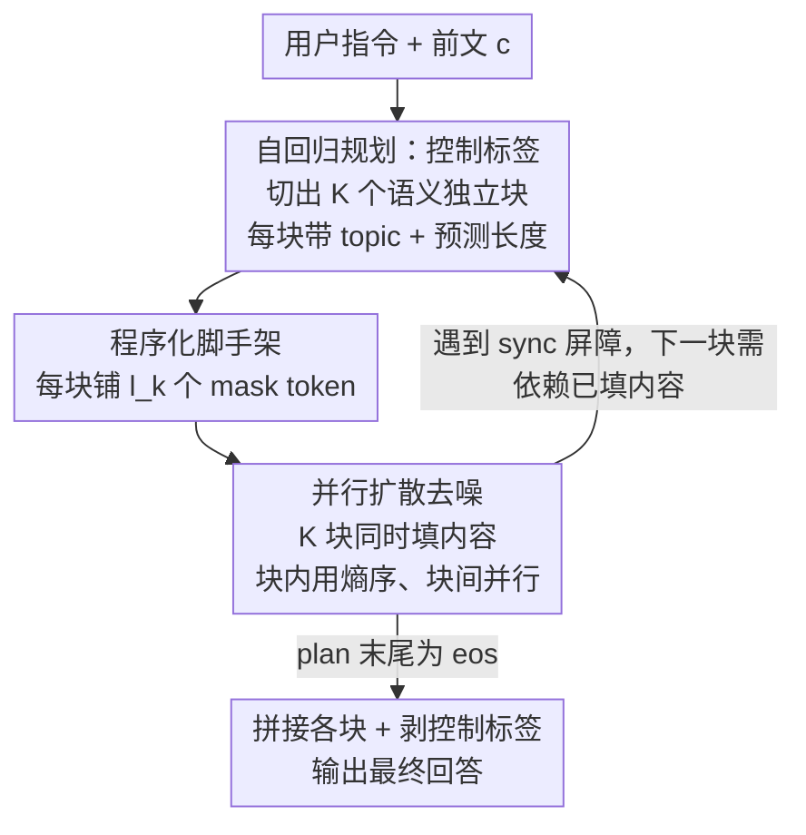

# Planned Diffusion

**会议**: ICLR 2026  
**OpenReview**: [https://openreview.net/forum?id=wZN8debH4W](https://openreview.net/forum?id=wZN8debH4W)  
**代码**: 待确认  
**领域**: LLM效率 / 文本生成 / 扩散模型  
**关键词**: 离散扩散语言模型, 并行生成, 去噪顺序, 语义并行, 质量-延迟权衡  

## 一句话总结
让同一个模型先用自回归方式生成一份"规划"把回答切成若干语义独立的块、再对所有块并行扩散去噪，从而由模型自己决定去噪顺序，在 AlpacaEval 上相对自回归取得 1.27×～1.81× 加速、胜率仅掉 0.87%～5.4%，刷新了离散扩散并行生成的质量-延迟帕累托前沿。

## 研究背景与动机
**领域现状**：当前主流大模型都是自回归（AR）的——一次解一个 token，第 $i$ 个 token 必须等前面所有 token 都解出来才能生成。这种逐 token 的串行依赖是推理延迟的根本瓶颈。离散扩散语言模型（dLLM）走了另一条路：每步可以并行解多个被 mask 的 token，理论上能大幅缩短串行步数。

**现有痛点**：但从扩散模型采样需要一个"去噪顺序"（denoising order），即每步决定先解哪些位置。一个好的去噪顺序很难确定，现有做法只能用启发式——随机顺序、或按置信度阈值贪心解码（如 Fast-dLLM）。这些启发式在质量和延迟之间形成陡峭的 trade-off：想快就得激进地一次解很多位置、质量崩；想保质量就得一步步来、退化成接近串行。

**核心矛盾**：去噪顺序的好坏直接决定了"哪些 token 真的能并行解而不互相干扰"。启发式顺序对内容一无所知，无法识别"哪些 token 是语义独立、可以放心并行"的。而典型的回答里其实天然存在语义独立的块——比如一个分点列表里每个 bullet 彼此独立，完全可以并行生成。现有扩散只在 token 级并行，从没学会利用这种"块级"的语义独立性。

**本文目标**：让模型自己学会确定去噪顺序，具体拆成：① 怎么让模型识别出回答里哪些块语义独立；② 怎么让同一个模型既能规划又能并行去噪；③ 怎么在推理时提供可调的质量-延迟旋钮。

**切入角度**：作者的关键观察是——既然"决定去噪顺序"本身是个需要全局语义理解的串行决策，那就用 AR 来做这件最适合 AR 的事（生成一份结构化的 plan），再把"填内容"这件可并行的事交给扩散。于是一个模型在两种生成范式间切换。

**核心 idea**：用"自回归先规划、扩散再并行填充"代替"靠启发式猜去噪顺序"——让模型把回答切成语义独立的块（plan 就是去噪顺序），再对所有块同时扩散去噪。

## 方法详解

### 整体框架
Planned diffusion 用**一个模型**在自回归与扩散两种模式间交替。每一轮迭代由"一个规划阶段 + 一个扩散阶段"组成，后面的迭代可以条件于前面迭代的输出。给定前文 $c$：第一阶段模型**自回归地**吐出一份 plan $z$，这份 plan 由结构化的控制标签组成，把回答切成 $K$ 个语义独立的块，每块带一个语义描述和预测长度 $l_1,\dots,l_K$；第二阶段把 plan 翻译成一个"脚手架"——给每个块铺上对应数量的 mask token，然后模型对所有块**并行扩散去噪**，同时把每段内容填出来。所有块填完后拼接、把控制标签从最终输出里剥掉。

之所以这么转：plan 是 AR 生成的，所以模型可以纵观全局、用结构化标签**自己定义去噪顺序**；而内容是扩散填的，所以不同块之间可以真正并行。这套"单模型混合"相比投机解码（speculative decoding）的好处是不需要单独的 draft 模型——同一个模型既当规划者又当生成者。

### 关键设计

**1. 控制标签：用一套结构化语言让模型把"去噪顺序"显式写出来**

要让模型自己定义并行结构，就得有一套能被模型生成、又能被运行时解析的语言。作者设计了三类控制标签：`<topic>...</topic>` 在规划阶段成对出现，里面写这一块的简短语义描述（如 "definition"）和预测长度（如 30 token）；`<async>...</async>` 在扩散阶段包住每个块的真实 token，标记"这块可以和别的 async 块并行去噪"，其开标签带两个属性 `topic`（≤3 词的标签）和 `tokens`（粗粒度长度，如 10 的倍数）；`<sync/>` 是同步屏障，表示它后面的 token 可能依赖前面 async 块产出的细节，所以采样算法必须等那些块填完、内容可用后才继续往下规划。所有控制标签都加进模型词表参与训练和推理，最后后处理时剥掉。这套标签的本质是：把"哪些块能并行、哪些必须串行等"这一去噪顺序，变成模型可生成的离散符号，而不是靠外部启发式去猜。

**2. 复合去噪顺序：把块间并行序与块内去噪序解耦组合**

plan $z$ 一旦确定，就把 $[L]$ 切成 $K$ 段连续下标 $s_1,\dots,s_K$。每个块内部还可以有自己的内层去噪顺序 $\sigma^{(k)}=(\sigma^{(k)}_1,\dots,\sigma^{(k)}_{T_k})$。Planned diffusion 把"块间外层序"和"块内内层序"**解耦再组合**：第 $t$ 步同时揭示所有满足 $T_k\ge t$ 的块的第 $t$ 个内层子集，
$$\sigma^{\text{Plan}}_t(z)=\bigcup_{\{k:\,T_k\ge t\}}\sigma^{(k)}_t,\quad t=1,\dots,\max_k T_k$$
于是整体联合分布写成"规划 × 扩散"两段：
$$p_{PD}(z,x\mid c;\sigma^{\text{Plan}}(z))=\underbrace{p_{AR}(z\mid c)}_{\text{规划}}\cdot\underbrace{p_D\big(x\mid z,c;\sigma^{\text{Plan}}(z)\big)}_{\text{扩散}}$$
因为扩散目标对位置可分解、接受任意合法的有序划分（式 4 的因子化），这个解耦是"免费"的：实验里每个块内层就用熵序 $\sigma^{\text{Ent}}$（每步选预测熵最低的位置），但块与块之间完全并行。这正是它比纯扩散快的根源——串行步数从整段长度 $n$ 降到最长块长度 $l_{\max}$，去噪步数 $s$ 缩小约 $l_{\max}/n$ 倍。

**3. 双目标训练 + 分模式注意力掩码：让一个模型同时学会 AR 规划和扩散填充**

训练要在同一份带标签数据上同时优化"规划 token 的自回归似然"和"内容 token 的扩散似然"。把一条干净样本 $Y$ 拆成规划 token 集 $Z$ 和内容 token 集 $X$，内容按噪声 $t$ 被随机 mask 成 $X_t$，总目标是两项交叉熵之和：
$$\mathcal{L}(\theta)=\mathbb{E}_{Y,t}\frac{1}{|Y|}\sum_{y_i\in Y}\Big[\underbrace{\mathbf{1}(y_i\in Z)\,\text{CE}(f_\theta(y_{<i},i),y_i)}_{\text{自回归}}+\underbrace{\tfrac{1}{t}\mathbf{1}(y_i\in X)\,\text{CE}(f_\theta(M_i(X_t\cup Z),i),y_i)}_{\text{扩散}}\Big]$$
关键是用**注意力掩码** $M_i$ 区分两种模式：规划 token（控制标签及其属性）走**因果注意力**，扩散 token 走**双向注意力**（并行去噪所必需）。作者还提出一个变体 PDSA（planned diffusion sparse attention），用块稀疏注意力把双向注意力限制在每个块内部、强制块间完全独立——这能借稀疏注意力实现提升计算效率，但牺牲了模型表达力和 GPU 利用率，换来更高的加速比。

**4. 可变长度去噪 + step ratio：给质量-延迟一个连续可调的旋钮**

普通扩散通常固定去噪步数，但 planned diffusion 各块长度由 plan 预测、并不固定。作者引入步数比 $r$：去噪步数 $s=r\cdot\max_k l_k$（只看最长块，因为块间并行）。$r$ 越大质量越高、速度越慢；$r$ 越小越快但质量降。训练时还在每个 `<async>` 块里插入 0–10 个随机 padding，让扩散模型能生成比 mask 输入更短的可变长度。推理时 $r$ 配合 Fast-dLLM 的置信度阈值 $\tau$（top-token 概率 ≥ $\tau$ 才解开该位置），两个旋钮一起扫就能得到一条平滑的质量-延迟曲线，让用户按需在速度和质量间取舍。

### 一个完整示例
以 "What is Aurora Borealis? Please be concise." 为例：① **规划**——模型自回归吐出 plan：`<topic="definition" len=30> <topic="description" len=30> <topic="location" len=10> <eos>`，把回答切成"定义/描述/位置"三个语义独立块。② **脚手架**——运行时把 plan 翻译成 mask 序列：A 段 30 个 `[M]`、B 段 30 个、C 段 10 个。③ **并行扩散**——三段同时去噪，A 填出 "Aurora Borealis ... triggered by solar activity."、B 填出 "It appears as moving curtains ..."、C 填出 "It is most common near the Arctic Circle."。三段彼此独立、并行完成，最后拼成完整回答。整段的串行步数只由最长块（30）决定，而不是总长度 70。

### 损失函数 / 训练策略
微调 Dream-7B-Base（先 AR 预训练、再扩散目标继续预训练的底座），AdamW、峰值学习率 $5\times10^{-5}$ 线性衰减、bf16、per-GPU batch 1 / global batch 4，在 4×H200 上训练。数据用 Gemini 给 SlimOrca 指令微调集自动标注控制标签（≤3 词 topic、10 的倍数粗长度，强制每个非控制 token 恰好落在一个 `<async>` 块内、无嵌套无重叠，校验良构性、丢弃畸形样本）。因为 AR 和扩散最优 epoch 数不同，对 {2,4,8,16} epoch 做扫描。

## 实验关键数据

### 主实验
在 AlpacaEval（805 条指令跟随 prompt）上以**长度受控胜率（LCWR）**衡量质量、以平均响应墙钟时间衡量延迟，LCWR 参考固定为最佳自回归基线（16-epoch AR，50.0%）。

| 方法 | LC 胜率 | 相对 AR 加速 | 说明 |
|------|---------|--------------|------|
| Autoregressive (AR) | 50.0% | 1× | 自回归参考 |
| Diffusion | 52.6% | 0.04×（25× 延迟） | 质量最高但极慢 |
| Fast-dLLM | 40.2% | —（PD 比它快 22.4×） | 置信度阈值启发式 |
| **Planned Diffusion (PD)** | **49.2%** | **1.27×** | 本文主方法 |
| **PD-Sparse Attention (PDSA)** | **43.7%** | **1.81×** | 块稀疏注意力变体 |
| Skeleton-of-Thought | 更低 | 略快 | 质量显著下降 |
| Pasta-SFT | 更差 | 更慢 | 无 RL 时学不会标签语义 |

PD 相对 Fast-dLLM 同时做到 22.4× 加速且质量更高（44.6% vs 40.2%）；PD 和 PDSA 在质量-延迟平面上稳稳压住其他语义并行方法，形成新帕累托前沿。

### 消融实验

| 配置（4 epoch） | LC 胜率 | 延迟 | 说明 |
|------|---------|------|------|
| 完整 PD | 46.65% | 3.23 s | 基准 |
| w/o `topic` 属性 | 23.33% | 3.54 s | 质量崩塌，topic 对质量至关重要 |
| w/o `<sync/>` 标签 | 42.96% | 5.81 s | 质量略降、延迟反而变大 |

关键路径分析：AR 平均关键路径 367.3 步，PD 仅 160.0 步（2.3×）、PDSA 155.2 步（2.8×）；实际加速（1.85×）小于关键路径缩减，因为每个扩散步做的活更重（KV-cache 复用低、单步算力大）。

### 关键发现
- **topic 描述是质量命脉**：去掉 topic 属性后 LCWR 从 46.65% 暴跌到 23.33%——模型靠这个简短语义标签来组织块内内容，没有它就乱。
- **`<sync/>` 是质量与速度的权衡点**：删掉同步屏障质量小降（46.65→42.96%），但延迟不降反升（3.23→5.81 s），说明它在本设置下并不带来加速好处、却保障了依赖正确性。
- **长度预测很准**：把预测长度乘以 {0.5,1.0,1.5,2.0,2.5} 扫描，质量在 1.0 处达峰、±50% 都掉点，且加更多去噪步并不提质，说明模型的长度预测无系统性偏差。
- **扩散范式更吃训练算力**：AR 在 2→16 epoch 间 LCWR 死守 50.0% 完全不涨；PD 涨 4.3 个点（44.9→49.2%）、纯 Diffusion 涨 11.5 个点（41.1→52.6%）最终反超 AR——并行/扩散范式随算力持续受益。

## 亮点与洞察
- **把"决定去噪顺序"这件难事交给最擅长它的范式**：AR 适合做需要全局语义理解的串行决策（规划），扩散适合做可并行的填充，二者在一个模型里分工——这个"按任务性质分配生成范式"的思路非常干净，可迁移到任何需要"先定结构再并行填"的生成任务。
- **首个用纯文本模型同时训练扩散和自回归两个目标**的工作，且不需要独立 draft 模型就实现了类似投机解码的加速收益。
- **去噪顺序的内外解耦**很优雅：块间序和块内序正交可组合，使得任何现成的扩散采样策略（熵序、Fast-dLLM 等）都能即插即用到块内，加速效果叠加。
- **可调旋钮的工程友好性**：step ratio $r$ + 置信度阈值 $\tau$ 给出连续平滑的质量-延迟曲线，落地时能按算力预算精确取舍，而不是离散地换方法。

## 局限与展望
- **依赖标注质量**：控制标签靠 Gemini 自动标注 SlimOrca，plan 的切块质量上限受标注器影响；topic 一旦标得差，质量会显著退化（消融已证明 topic 极敏感）。
- **加速被单步重计算稀释**：实际加速（1.85×）远小于关键路径缩减（2.8×），因为扩散步 KV-cache 复用低、单步更重——纯靠减少串行步数并不能线性兑换成墙钟加速。
- **块独立假设的边界**：方法吃"回答里存在大量语义独立块"这一红利，对强依赖、逐步推理（如长链数学/代码）这类块间高度耦合的任务，可并行空间可能很小，论文主要在指令跟随（AlpacaEval）上验证。
- **PDSA 的取舍**：稀疏注意力变体加速更高（1.81×）但质量更低（43.7%），强制块间完全独立牺牲了表达力——如何在保独立性的同时不丢质量值得继续探。

## 相关工作与启发
- **vs Fast-dLLM / 普通扩散**: 它们靠置信度阈值等**启发式**猜去噪顺序，质量-延迟陡峭权衡；本文让模型**自己生成 plan** 来定义去噪顺序，并能把任意扩散采样策略并入块内，故能在更低延迟下保住质量。
- **vs Pasta-SFT / Skeleton-of-Thought（语义并行）**: 这些方法同样切语义独立块，但块内仍是**自回归**解码；planned diffusion 是首个把每个块改成**扩散并行去噪**的，块内也并行，故串行步数更短。
- **vs 投机解码（speculative decoding）**: 投机解码需要单独的 draft 模型来起草、再验证；planned diffusion 用**一个模型**同时承担 AR 规划和扩散生成，无需额外 draft 模型。
- **vs block diffusion / planned denoising**: block diffusion 在块上强加自回归结构、planned denoising 学自适应去噪调度，但二者都不针对**语义并行**，而语义并行正是本文的目标。

## 评分
- 新颖性: ⭐⭐⭐⭐⭐ 首个让单一文本模型同时持有扩散与自回归目标、用 AR plan 自定义扩散去噪顺序的混合范式
- 实验充分度: ⭐⭐⭐⭐ AlpacaEval 上对比 7 种解码、含 plan 消融/长度/step ratio 扫描，但仅指令跟随单一 benchmark
- 写作质量: ⭐⭐⭐⭐⭐ 形式化定义清晰、图 1 实例直观、控制标签与去噪顺序解耦讲得透
- 价值: ⭐⭐⭐⭐ 给离散扩散并行生成定了新帕累托前沿且提供可调旋钮，工程落地友好

<!-- RELATED:START -->

## 相关论文

- [\[ICLR 2026\] FlashDLM: Accelerating Diffusion Language Model Inference via Efficient KV Caching and Guided Diffusion](flashdlm_accelerating_diffusion_language_model_inference_via_efficient_kv_cachin.md)
- [\[ICLR 2026\] Diffusion LLMs Can Do Faster-Than-AR Inference via Discrete Diffusion Forcing](diffusion_llms_can_do_faster-than-ar_inference_via_discrete_diffusion_forcing.md)
- [\[ICLR 2026\] Fast-dLLM v2: Efficient Block-Diffusion LLM](fast-dllm_v2_efficient_block-diffusion_llm.md)
- [\[ICLR 2026\] Diffusion Language Models Know the Answer Before Decoding](diffusion_language_model_knows_the_answer_before_it_decodes.md)
- [\[ICLR 2026\] Parallel Sampling from Masked Diffusion Models via Conditional Independence Testing](parallel_sampling_from_masked_diffusion_models_via_conditional_independence_test.md)

<!-- RELATED:END -->
