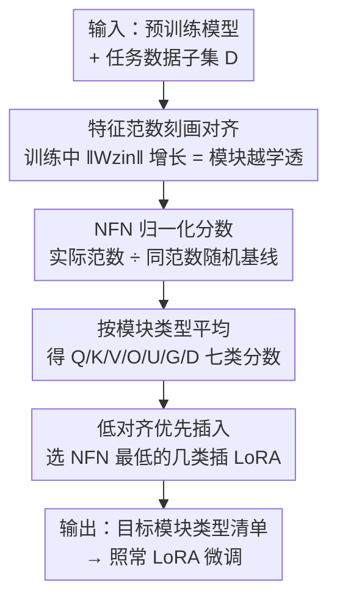

# PLoP: Precise LoRA Placement for Efficient Finetuning of Large Models

**会议**: ICLR 2026  
**OpenReview**: [https://openreview.net/forum?id=3lGkVgNZ5a](https://openreview.net/forum?id=3lGkVgNZ5a)  
**代码**: 待确认  
**领域**: LLM效率 / 参数高效微调  
**关键词**: LoRA, 适配器放置, 参数高效微调, 模块-数据对齐, 特征范数

## 一句话总结
PLoP 用一个免梯度、几乎零额外开销的「特征范数对齐分数」（NFN）来自动判断在哪些模块类型上插 LoRA，规则是把适配器放到与任务对齐度最低的模块上，在 SFT 与 RL 两类后训练场景里都稳定优于（最差也持平）「只插注意力」「只插 MLP」等常用经验法则。

## 研究背景与动机

**领域现状**：LoRA 是大模型最常用的参数高效微调（PEFT）方法——冻结预训练权重，只在部分模块里插入低秩矩阵 $W + BA$ 训练，显存和计算开销只有全量微调的零头。围绕 LoRA 的改进很多：调学习率、调秩、改初始化、归一化更新等等。但有一个被反复提及却始终没结论的旋钮——**适配器到底该插在哪些模块上**。

**现有痛点**：实践中大家不是逐个模块选，而是按「模块类型」选（如 `q_proj`、`v_proj`）。原始 LoRA 论文建议插在注意力模块（Q/K/V），He et al. (2021) 却发现某些模型插在 MLP 上更好，原作者后来也承认「最优放置取决于预训练模型和下游任务」。结果就是从业者要么盲从某条经验、要么干脆把所有模块都插上 LoRA——后者把微调成本又抬了回去，违背了用 LoRA 的初衷。

**核心矛盾**：理想的「该插哪」是任务相关、模型相关的，但任何**靠梯度打分**的重要性选择方法（先算全模型梯度再挑高分模块）都需要对全部权重求梯度、存梯度，这恰恰是 LoRA 想避免的开销。换句话说，存在一个「选得准 ↔ 选得便宜」的张力：准的方法贵，便宜的方法（拍脑袋经验）不准。

**本文目标**：给定一个模型和一个任务，用**可接受的极低成本**选出该插 LoRA 的模块类型。作者把「实用」量化成三条硬约束：(i) 不能对全模型参数求梯度；(ii) 不能跑多次不同配置的前向；(iii) 不能存大量中间量或维护跨模块的状态。

**切入角度**：作者从一个理论观察出发——训练时模块的**特征范数**（feature norm）$\|Wz_{in}\|$ 会随训练增长，而增长的幅度反映了模块权重 $W$ 与其输入特征 $z_{in}$ 的「对齐程度」。对齐越强，这个模块已经被预训练「学透」了，可塑空间越小；对齐越弱，越有适配潜力。

**核心 idea**：用一个归一化的特征范数比值（NFN）当作免梯度的「模块-任务对齐度」探针，**把 LoRA 插到对齐度最低、最有适配潜力的模块类型上**。

## 方法详解

### 整体框架

PLoP 的输入是一个预训练模型 + 一小撮任务数据，输出是「该插 LoRA 的模块类型清单」。整条流水线只跑几次前向、不算梯度：先对模型里每个模块 $W$ 在任务数据上算实际特征范数 $\|Wz_{in}\|$，并和一个「同范数随机向量」基线 $\|W\tilde z_{in}\|$ 相除得到 NFN 分数；再把同类型模块（所有 Query、所有 Gate……）的分数平均，得到 7 类模块（Q/K/V/O/U/G/D）各自的对齐度；最后**挑分数最低的几类**插入适配器。整个选择过程的计算量约等于对 200 条输入做一次批量 prefill，可以直接并进 LoRA 微调的第一步，几乎零额外成本。

### 关键设计

**1. 特征范数刻画对齐：把「模块学没学透」变成可观测的量**

PLoP 的理论底座是这样一条链：对单个被训模块 $z_{out}=Wz_{in}$，损失对权重的梯度是 $dW = dz_{out}\otimes z_{in}$。在 µP 参数化、用无动量版 Adam（即 SignSGD）更新时，一步更新可写成 $W_{t+1}z_{in} = W_t z_{in} - \alpha\,\|z_{in}\|_1\,S(dz_{out}^t)$，其中 $S(\cdot)$ 是符号函数。展开特征范数的平方得到

$$n^{-1}\|W_{t+1}z_{in}\|_2^2 = n^{-1}\|W_t z_{in}\|_2^2 + \eta^2 n^{-2}\|z_{in}\|_1^2 - 2\eta n^{-1}\|z_{in}\|_1\cdot n^{-1}\langle W_t z_{in}, S(dz_{out}^t)\rangle.$$

关键是中间那个交叉项 $n^{-1}\langle W_t z_{in}, S(dz_{out})\rangle$——它度量特征 $W_t z_{in}$ 和「带符号梯度」的相关性。训练早期两者不相关时，这一项约为 $O(n^{1/2})$，可以忽略，于是 $\eta^2 n^{-2}\|z_{in}\|_1^2$ 这个不随宽度消失的正项主导，**特征范数会随训练单调增长**。作者用三层线性网做了对照：真实输入的特征范数确实涨，而把输入换成同范数的随机高斯向量 $\tilde z_{in}$，范数几乎不动（图 2 虚线）。这就坐实了「特征范数增长 = 权重与输入对齐增强」，且**不同层/不同任务对齐程度不同**——给后面用它当探针打下了基础。

**2. NFN 归一化分数：用随机基线把对齐度变成尺度无关的比值**

直接比 $\|Wz_{in}\|$ 的绝对大小没意义，因为不同模块的权重尺度、输入尺度都不一样。设计 1 里那个「同范数随机向量几乎不增长」的现象正好提供了天然分母。作者据此定义 **Normalized Feature Norm（NFN）**：

$$\mathrm{NFN}(W,x) = \frac{\|Wz_{in}(x)\|}{\|W\tilde z_{in}(x)\|},$$

其中 $\tilde z_{in}(x)$ 是与 $z_{in}(x)$ **同维、同欧氏范数**、坐标 i.i.d. 高斯的随机向量。直觉很干净：当 $W$ 与输入显著对齐时 NFN $>1$，不对齐时 NFN $\approx 1$。作者还证明在宽度足够大时 NFN 可近似为 $\|Wz_{in}\|/(\|W\|_F\|z_{in}\|)$，也就是除以随机基线本质上等价于同时归一化 $W$ 和 $z_{in}$；但论文偏好定义 1 的形式，因为它更直观。NFN 把抽象的「对齐」落成一个**可在几次前向内算出、尺度无关、跨模型尺寸还稳定**的标量。

**3. 低对齐优先插入：把 LoRA 放到最有适配潜力的模块类型上**

有了 NFN，PLoP 的选择规则只有两步：Step 1 对 7 类模块 $T\in\{Q,K,V,O,G,U,D\}$ 各自在任务数据上平均 NFN；Step 2 **挑分数最低的几类插 LoRA**。背后假设是「对齐度最低的模块还没被预训练学透，可塑性最大，最该拿来适配」。为验证这不是瞎挑，作者特意设计了反向版 **PLoP$^{-1}$**——挑 NFN 最高的模块——作为消融对照：如果 PLoP 真在捕捉有效信号，PLoP$^{-1}$ 就该明显更差。实验里 PLoP 选出的常是 V-O-D 或 V-O-U 这类组合（多偏 MLP/投影），而 PLoP$^{-1}$ 总挑到 Q-K-G，性能一致垫底，反向证明了对齐分数确实有判别力。这个规则同时满足前面三条「实用」硬约束：无梯度、单次前向、不存中间态；NFN 还对采样子集大小不敏感（batch $m\ge 64$ 时不同子集选出的模块 Kendall $\tau$ 接近 1），样本高效。

## 实验关键数据

覆盖三类后训练场景：SFT 分类（ANLI）、SFT 文本生成（MetaMathQA→GSM8K、AYA 多语言、CommonsenseQA）、以及 GRPO 强化学习做数学推理。模型横跨 Llama、Qwen、Gemma 多个尺寸。对比基线：Attn（只插注意力）、MLP（只插 MLP）、ALL（全插）、Random、以及反向 PLoP$^{-1}$，公平比较时统一对齐可训练参数量。

### 主实验

| 场景 / 模型 | 指标 | PLoP | MLP | Attn | PLoP$^{-1}$ |
|------|------|------|------|------|------|
| SFT 数学 Qwen3-0.6B (r=64) | GSM8K Acc | **62.0%** | 63.3% | 58.6% | 60.6% |
| SFT 数学 Qwen3-1.7B (r=64) | GSM8K Acc | **75.2%** | 75.0% | 69.5% | 74.6% |
| SFT 多语言 Llama-3.2-3B (阿拉伯语) | Test NLL↓ | **0.843** | 0.955 | 2.05 | 2.13 |
| SFT CommonsenseQA Qwen2.5-7B | Test Acc | **88.6%** | 87.3% | 86.0% | 86.7% |
| GRPO 数学 Qwen3-1.7B (r=16) | GSM8K Pass@1 | **74.52%** | 73.61% | 71.49% | 71.41% |

注：Qwen3-0.6B 上 MLP 略高于 PLoP，但 MLP 用了 22.0M 参数、PLoP 只用 18.4M；在 1.7B、多语言、CommonsenseQA、GRPO 上 PLoP 都在等参或更少参数下领先。GRPO 里 PLoP(V-O-D, r=16, 6.88M) 甚至超过 Attn(r=25, 7.17M) 与 MLP(r=16, 11.01M)。

### 消融实验

| 配置 | 含义 | 结论 |
|------|------|------|
| PLoP（选最低 NFN） | 完整方法 | 多数场景最优，最差持平 MLP |
| PLoP$^{-1}$（选最高 NFN） | 反向 sanity check | 一致显著变差，证明 NFN 有判别信号 |
| Attn（只插 Q-K-V） | 经验法则一 | 在数学等难任务上明显次优 |
| ALL（全模块插） | 上界但贵 | 用 1.5–1.8× 参数，反被 PLoP/MLP 反超 |
| 子集大小 $m$ 敏感性 | $m\in\{8,...,1024\}$ | $m\ge 64$ 时 Kendall $\tau\approx 1$，样本高效 |

### 关键发现
- **对齐度低 ≠ 注意力**：在 Llama-3.2 上 Q/K 的 NFN 高达基线的 2–3 倍，V/G/D/U 才贴近 1，所以 PLoP 把适配推向 MLP/投影模块——与 He et al. (2021) 一致、与原始 LoRA 论文「插注意力」相悖，等于用一个统一探针自动解释了这场长期争论。
- **NFN 跨尺寸稳定、随专精化升高**：同族不同大小模型（Llama-3.2 1B/3B）的模块类型排序基本一致；Qwen2.5 的 math/code 专精版比通用版 NFN 整体更高，印证「在领域数据上训练会提升模块-数据对齐」。
- **几乎零成本**：选择阶段约等于对 200 条输入做一次 prefill，可并进微调第一步，比任何梯度打分法都便宜得多。

## 亮点与洞察
- 把一个理论副产品（µP 下特征范数随对齐增长）反过来用作**工程探针**，且只用一次前向就能算——理论直觉直接落地成省钱的选模块工具，思路很漂亮。
- 用「同范数随机向量」当归一化基线是点睛之笔：它天然把权重和输入的尺度都消掉，得到尺度无关、可跨模型比较的分数，而不需要额外训练或标定。
- 反向 PLoP$^{-1}$ 作为内置对照，既是消融也是对「分数有意义」的证伪测试——这种自带 sanity check 的实验设计值得借鉴。
- 「低对齐 = 高可塑」的直觉可迁移到其他 PEFT 选择问题（如选哪些层做 prompt tuning、prefix tuning），NFN 几乎可以即插即用地当通用对齐探针。

## 局限与展望
- 理论推导建立在 µP 参数化 + 无动量 Adam（SignSGD）、单模块训练、宽度极大等简化假设上，真实训练带动量、多模块联动，理论与实践之间有 gap（作者用线性网验证，未在大模型上严格证明）。
- 对某些模型（Qwen3、Gemma3）的 Value 模块出现「负对齐」（NFN≈0.75）现象，作者明确表示**暂无解释**，说明 NFN 的语义还未完全说清。
- 选择粒度停在「模块类型」而非单个模块，且默认选「最低的 3 类」，到底选几类、阈值怎么定缺乏自适应机制。
- 评测多在中小模型（≤32B）和有限任务上，更大规模、更多模态下 NFN 排序是否仍稳定有待验证。

## 相关工作与启发
- **vs 原始 LoRA (Hu et al. 2022)**: 它经验性地建议插注意力模块；PLoP 用 NFN 表明这恰恰常是对齐度最高、最不该插的地方，给出了任务自适应的反例。
- **vs He et al. (2021) 的 MLP 放置**: 它经验性地发现 MLP 更好；PLoP 不是又提一条新经验，而是用统一探针解释了「何时 MLP 好、何时不好」，并在等参下小幅超越 MLP。
- **vs 梯度打分选参 (Zhang et al. 2024 / He et al. 2023)**: 它们靠全模型梯度排重要性，准但要算/存全梯度，违背 LoRA 省显存的初衷；PLoP 免梯度、单次前向，成本低一个量级。
- **vs 对齐度量 (CTK alignment, Baratin et al. 2021)**: 同样想刻画层-任务对齐，但 PLoP 提出的是基于特征范数的新度量，计算更轻、可直接用于模块选择。

## 评分
- 新颖性: ⭐⭐⭐⭐ 把特征范数对齐理论转成免梯度选模块探针，角度新且解决了长期争论。
- 实验充分度: ⭐⭐⭐⭐ 覆盖 SFT/RL 三场景、多模型多尺寸、配等参对比与反向消融，较扎实。
- 写作质量: ⭐⭐⭐⭐ 理论直觉到方法到实验链条清晰，NFN 定义与动机讲得透。
- 价值: ⭐⭐⭐⭐ 几乎零成本、即插即用的 LoRA 放置工具，对 PEFT 从业者实用性强。

<!-- RELATED:START -->

## 相关论文

- [\[ICLR 2026\] Meta-UCF: Unified Task-Conditioned LoRA Generation for Continual Learning in Large Language Models](meta-ucf_unified_task-conditioned_lora_generation_for_continual_learning_in_larg.md)
- [\[ICLR 2026\] MiSS: Revisiting the Trade-off in LoRA with an Efficient Shard-Sharing Structure](miss_revisiting_the_trade-off_in_lora_with_an_efficient_shard-sharing_structure.md)
- [\[ICLR 2026\] BA-LoRA: Bias-Alleviating Low-Rank Adaptation to Mitigate Catastrophic Inheritance in Large Language Models](ba-lora_bias-alleviating_low-rank_adaptation_to_mitigate_catastrophic_inheritanc.md)
- [\[ICLR 2026\] LoRA-S: An Efficient Low Rank Adaptation scheme via Sylvester equation](lora-s_an_efficient_low_rank_adaptation_scheme_via_sylvester_equation.md)
- [\[ICLR 2026\] On-the-Fly Adaptation to Quantization: Configuration-Aware LoRA for Efficient Fine-Tuning of Quantized LLMs](on-the-fly_adaptation_to_quantization_configuration-aware_lora_for_efficient_fin.md)

<!-- RELATED:END -->
