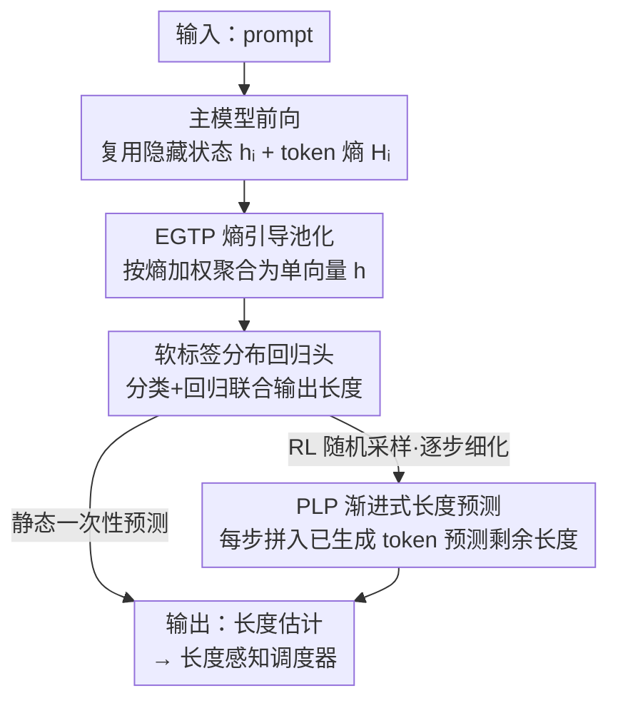

# Predicting LLM Output Length via Entropy-Guided Representations

**会议**: ICLR 2026  
**OpenReview**: [https://openreview.net/forum?id=3loQDtveWI](https://openreview.net/forum?id=3loQDtveWI)  
**代码**: 待确认  
**领域**: LLM效率  
**关键词**: 输出长度预测, 推理调度, token 熵, 软标签回归, RL 采样

## 一句话总结
本文不再训练独立的辅助模型来预测 LLM 输出长度，而是直接复用主模型自身的隐藏状态，用 token 熵加权池化（EGTP）做静态预测、用逐步细化（PLP）应对 RL 采样这类"一对多"的随机生成，并发布了首个含长序列/CoT/RL 数据的长度预测基准 ForeLen，在其上把最强基线的 MAE 平均再降 29.16%，端到端吞吐显著提升。

## 研究背景与动机
**领域现状**：在 LLM 服务和强化学习采样中，吞吐主要靠批处理（batching）拉上去——把多个请求并行执行，摊薄调度和访存开销。但同一个 batch 里不同请求的生成长度差异极大，由于张量形状必须对齐，短序列要被 padding 到最长的那条，形成明显的"木桶效应"：大量算力浪费在无效的 padding 上。如果能在推理前或推理早期估出每个请求的输出长度，就能做"长度感知调度"，把长度接近的请求拼成更均匀的 batch，直接削掉这部分浪费。

**现有痛点**：已有的长度预测方法基本都是挂一个微调过的轻量辅助模型（如 DistilBERT、OPT），只看 prompt 来预测长度。这套设计有三个硬伤：（i）**随机"一对多"场景失效**——在 GRPO 这类 RL 采样里，同一个 prompt 反复采样会得到长度差异巨大的多个候选，任何只依赖 prompt 的静态估计都不可靠；（ii）**精度与泛化差**——这些预测器通常在 LMSYS 这种少长序列、少复杂推理的数据上训练，到真实的长文本/推理场景就崩；（iii）**额外开销**——每个请求都要单独跑一个预测模型，而没有复用主模型早已算出来的丰富隐藏状态。

**核心矛盾**：长度信号其实已经"藏在"主模型内部——既然 LLM 自己能决定何时吐出 `<eos>`，那么与最终长度相关的信号必然隐式编码在它的内部激活里。但现有做法绕开主模型、另起炉灶，既贵又不准。

**本文目标**：（1）零额外大模型、复用主模型激活做高精度静态长度预测；（2）能在随机采样下逐步给出可靠估计；（3）补齐一个真正有挑战性的评测基准。

**核心 idea**：用主模型自身的隐藏状态 + token 熵做长度预测——静态用熵加权池化（EGTP），动态用逐解码步细化（PLP），而不是再训一个外挂预测器。

## 方法详解

### 整体框架
方法的目标是：给定一个 prompt（以及随机采样时已生成的部分 token），尽可能准地估计 LLM 还要生成多长，从而喂给长度感知调度器。整条 pipeline 完全寄生在主模型的前向计算上：主模型前向时，每个输入 token 既留下隐藏状态 $h_i$，又能从下一 token 分布算出熵 $H_i$；**EGTP** 用熵作为注意力权重，把这串隐藏状态加权聚合成一个向量 $h$；这个 $h$ 送进一个**软标签分布回归头**，同时输出分类分布与回归值，给出静态长度估计。对于 RL 采样这种"同一 prompt 长度乱飞"的随机场景，**PLP** 在每个解码步把已生成 token 的隐藏状态也拼进来，反复刷新对"剩余长度"的预测。三个贡献模块串成一条静态/动态双路：静态路一次性预测，动态路逐步细化。

### 关键设计

**1. EGTP 熵引导 token 池化：用"模型最犹豫"的 token 决定长度**

要把一串隐藏状态 $\{h_1,\dots,h_n\}$ 压成一个能预测长度的向量，传统的 mean / max 池化会稀释或丢掉关键信息。作者的观察是：**高熵 token——也就是模型对"下一步生成什么"最不确定的位置——恰恰是预测输出长度最关键的信号**。他们用基于梯度的归因验证了这一点：把某 token 隐藏状态对 MSE 损失的梯度 L2 范数 $I_t=\lVert\nabla_{h_t}\mathcal{L}_{\text{MSE}}\rVert_2$ 当作重要性，发现 token 熵与重要性显著正相关（Pearson $r=0.451$）。

基于此，EGTP 不再均匀对待所有 token：先对每个输入 token 从其下一 token 分布算熵 $H_i=-\sum_{v\in V}P(v\mid x_{<i})\log P(v\mid x_{<i})$，再用 softmax 把熵转成权重 $w_i=\dfrac{\exp(H_i)}{\sum_{j=1}^n\exp(H_j)}$（文中提到可用温度 $\alpha$ 调节分布锐度，⚠️ 公式以原文为准），最后加权求和 $h=\sum_{i=1}^n w_i h_i$。这样聚合出的表示自适应地聚焦在 prompt 里最"信息量大"的部分，比 mean/max 给出质量更高的长度特征，且几乎零额外开销——熵和隐藏状态都是主模型前向的副产品。

**2. 软标签分布回归头：既像分类抗离群、又像回归懂距离**

长度预测本质是回归任务，但长度分布是重尾的，标准 MSE 对离群点极敏感；而退化成"长度分桶分类"又丢掉了"预测值和真值差多远"这个关键的距离概念。本文设计的预测头同时拿到两者的好处。

做法是把连续长度目标 $y$ 转成**软概率分布**当监督信号：先把长度空间离散成 $K$ 个桶，真值落在第 $i$ 桶时不用 one-hot，而是让第 $j$ 桶的概率随它到第 $i$ 桶的距离指数衰减，$p_j=\dfrac{\exp(-\lvert j-i\rvert)}{\sum_{k=1}^K\exp(-\lvert k-i\rvert)}$。模型在特征 $h$ 上并行产出两个输出：一个是 $K$ 维分类分布 $\hat p$（softmax 得到），一个是把分布求期望得到的回归值 $\hat y=\sum_{i=1}^K\hat p_i\cdot c_i$（$c_i$ 为第 $i$ 桶中心）。训练用联合损失 $\mathcal{L}=\lambda\mathcal{L}_{\text{CE}}(p,\hat p)+(1-\lambda)\mathcal{L}_{\text{MSE}}(y,\hat y)$，文中取 $K=20$、$\lambda=0.95$。CE 项让预测分布对齐软标签、提供稳定且梯度友好的监督，MSE 项直接压最终连续预测的误差、保证回归精度——两者互补让头部对重尾长度更鲁棒。

**3. PLP 渐进式长度预测：让随机采样也能被调度**

静态预测在 RL 采样里天然失效——同一 prompt 采样出的多个候选长度差异巨大，开生成前的单次预测注定不准。PLP 利用 LLM 的自回归本性，把"一次预测"改成"每步预测"：在第 $t$ 个解码步，它的目标不是预测总长，而是预测**剩余还要生成多少 token** $y^{(t)}_{\text{rem}}$。

具体地，PLP 把 prompt 特征 $h$ 与已生成 token 的隐藏状态 $\{h'_1,\dots,h'_t\}$ 拼接成动态输入 $z_t=\text{Aggregate}(h,\{h'_1,\dots,h'_t\})$（Aggregate 就是简单 concat），再过同一个软标签回归头得到剩余长度 $\hat y^{(t)}_{\text{rem}}$。训练时对所有时间步求平均损失 $\mathcal{L}_{\text{PLP}}=\frac{1}{T}\sum_{t=1}^T\mathcal{L}(y^{(t)}_{\text{rem}},\hat y^{(t)}_{\text{rem}})$，其中 $\mathcal{L}$ 就是设计 2 的联合损失。随着生成推进，已生成 token 越来越多、信息越充分，预测也越来越准，从而让调度策略可以在生成过程中动态调整资源分配——这是此前静态方法根本做不到的能力。

**4. ForeLen 基准：第一个面向"难场景"的长度预测评测**

现有预测器之所以"看起来还行"，部分是因为只在 LMSYS 这种长度短、推理简单的数据上评测。作者构建并发布 ForeLen，专门覆盖三类挑战性场景：长序列（取自 LongBench / ZeroSCROLLS / IFEval，用 Qwen2.5 与 Llama3.2 系列生成）、复杂推理 CoT（Qwen2.5 与 DeepSeek-R1-Distill 生成），以及动态 RL 采样（从真实 GRPO 训练管线收集，prompt 取自 GSM8K / MATH / MBPP / LiveCodeBench / CRUXEval / MMLU-STEM 六个数学与代码数据集，每个 prompt 分组采样 $K=4$ 记录候选及长度）。数据严格沿用各源数据集官方 train/val/test 划分，保证验证/测试 prompt 在训练期不可见。ForeLen 的长度分布比 LMSYS 更宽、尾更长（图 1a），正是在这种分布上各类静态基线才暴露出泛化短板。

### 损失函数 / 训练策略
统一用设计 2 的联合损失 $\mathcal{L}=\lambda\mathcal{L}_{\text{CE}}+(1-\lambda)\mathcal{L}_{\text{MSE}}$（$\lambda=0.95$，$K=20$ 桶）。优化器 AdamW、学习率 2e-5、最多 10 个 epoch、batch size 16、随机种子 42。实验在单张 V100 上完成。

## 实验关键数据

### 主实验
评测指标为平均绝对误差 MAE（越低越好），在 LMSYS 与 ForeLen 两套基准上对比 SSJF-Reg/MC、S3、PiA、TPV、TRAIL、LTR-C 等基线。

| 基准 / 场景 | 指标 | EGTP(本文) | 最强基线 | 提升 |
|--------|------|------|----------|------|
| LMSYS · GPT-4 | MAE | 87.32 | 96.03 (S3) | 9.1% |
| LMSYS · Claude-2 | MAE | 68.33 | 77.03 (LTR-C) | 11.3% |
| ForeLen · Qwen2.5-3B 平均 | MAE | 110.75 | 146.42 (TRAIL) | 24.4% |
| ForeLen · Qwen2.5-7B 平均 | MAE | 103.47 | 137.96 (TRAIL) | 25.0% |
| ForeLen · Llama3.2-1B 平均 | MAE | 105.08 | 151.80 (TRAIL) | 30.8% |
| ForeLen · Llama3.2-3B 平均 | MAE | 101.53 | 157.88 (TRAIL) | 35.7% |

跨所有模型平均，EGTP 比最强基线降 MAE 29.16%、比常用的 SSJF-Reg 降 55.09%。

### 端到端系统性能
把各预测器接入 vLLM 后端 + Shortest Job First 调度器：

| 场景 | 方法 | 吞吐 ↑ | 平均 JCT ↓ | Padding 比 ↓ |
|------|------|--------|-----------|-------------|
| Long Sequence | EGTP | 131.05 | 4.20 | 0.18 |
| Long Sequence | TRAIL(次优) | 129.58 | 9.45 | 0.51 |
| Reasoning | EGTP | 194.21 | 8.21 | 0.09 |
| Reasoning | LTR-C(次优) | 150.57 | 9.30 | 0.14 |

EGTP 在长序列场景把 padding 比从 0.51 砍到 0.18（近 3 倍降低）、JCT 减半还多；推理场景 padding 比仅 0.09。

### 消融实验

| 池化方式 | Reasoning | Long Seq | RL | 平均 MAE |
|------|---------|------|------|------|
| EGTP(本文) | 133.57 | 81.60 | 95.24 | 103.47 |
| Max Pooling | 137.88 | 122.74 | 98.46 | 119.69 |
| Last Token | 139.09 | 135.44 | 105.39 | 126.64 |
| Average Pooling | 142.40 | 173.85 | 149.92 | 155.39 |

### 关键发现
- **熵引导池化是核心收益来源**：EGTP 平均 MAE 103.47，显著优于次优的 Max Pooling（119.69），且在长序列任务上优势最大（81.60 vs 122.74），印证高熵 token 确实承载了最关键的长度信号。
- **PLP 在 RL 场景增益最大**：随着观测步数从 0 增到 32，RL 任务 MAE 从 95.24 一路降到 80.86，长序列从 81.60 降到 67.11；都呈"前几步快速下降后趋稳"的收敛模式，说明已生成 token 能有效细化预测。
- **预测精度直接转化为系统收益**：更准的长度估计让调度器拼出更均匀的 batch，padding 浪费大幅下降，吞吐与 JCT 随之改善。

## 亮点与洞察
- **"长度信号已在隐藏态里"这一假设很干净**：既然模型自己知道何时停，长度信息必然内蕴于激活，于是预测无需外挂模型、近乎零成本——这是把"重用主模型副产物"用到极致的范例。
- **熵当注意力权重的 trick 可迁移**：把 token 熵（不确定性）作为聚合权重的思路，可用于任何"需要从变长序列里挑关键 token 聚合成单向量"的任务，不止长度预测。
- **软标签回归头兼顾抗离群与距离感知**：距离衰减软标签 + 分类/回归双头 + 联合损失，是处理重尾连续目标的实用配方，可复用到价格/时长等重尾回归。
- **把"静态预测"改成"逐步剩余量预测"**是应对随机采样的关键转变，专门补上了 RL"一对多"采样这块此前没人正经评测的空白。

## 局限与展望
- 实验主要在 V100 单卡、Qwen2.5 / Llama3.2 等中小模型（≤7B）上完成，更大规模模型与多卡并行下的收益与开销尚待验证。
- EGTP 依赖能拿到 next-token 分布算熵，对只给隐藏态、不暴露 logits 的封闭部署可能受限。
- PLP 每步都要过一次预测头，虽轻量但在超长生成上累计开销与"何时停更新"的取舍仍需权衡；横向比较时不同任务难度/长度分布不可直接比 MAE 大小。
- 温度 $\alpha$、桶数 $K$、$\lambda$ 等超参的跨模型稳健性，正文只给了固定值，泛化性有待更系统的敏感性分析。

## 相关工作与启发
- **vs SSJF-Reg / S3 / TRAIL 等外挂预测器**：它们另训一个 DistilBERT/OPT 级别的辅助模型、只看 prompt 做静态预测；本文复用主模型激活、零额外大模型，且在 ForeLen 上 MAE 普遍低一截，RL 场景更是它们的盲区。
- **vs PagedAttention / continuous batching 等服务优化**：那些工作减的是请求间空闲与显存碎片，解决不了运行中 batch 内 padding 浪费；本文与之正交——预测长度让调度器拼更均匀的 batch，直接削 padding，是对现有服务架构的补充。
- **vs 把长度预测当纯回归或纯分类**：纯 MSE 对重尾敏感、纯分桶丢距离；本文软标签分布头同时拿下抗离群与距离感知。

## 评分
- 新颖性: ⭐⭐⭐⭐ 复用主模型激活 + 熵引导池化 + 逐步剩余预测的组合切入角度新颖，尤其补上 RL 采样这块空白
- 实验充分度: ⭐⭐⭐⭐ 覆盖多模型/多场景 + 端到端系统 + 消融，自建 ForeLen 基准；但模型规模偏中小
- 写作质量: ⭐⭐⭐⭐ 动机—假设—方法链条清晰，公式与图表配套
- 价值: ⭐⭐⭐⭐ 直接服务于 LLM 高效推理与 RL 采样调度，落地性强且基准可复用

<!-- RELATED:START -->

## 相关论文

- [\[ICLR 2026\] Cartridges: Lightweight and General-Purpose Long Context Representations via Self-Study](cartridges_lightweight_and_general-purpose_long_context_representations_via_self.md)
- [\[ICLR 2026\] LouisKV: Efficient KV Cache Retrieval for Long Input-Output Sequences](louiskv_efficient_kv_cache_retrieval_for_long_input-output_sequences.md)
- [\[ICLR 2026\] Understanding and Improving Length Generalization in Hierarchical Sparse Attention Models](understanding_and_improving_length_generalization_in_hierarchical_sparse_attenti.md)
- [\[ICLR 2026\] KnowProxy: Adapting Large Language Models by Knowledge-guided Proxy](knowproxy_adapting_large_language_models_by_knowledge-guided_proxy.md)
- [\[ICLR 2026\] ReST-KV: Robust KV Cache Eviction with Layer-wise Output Reconstruction and Spatial-Temporal Smoothing](rest-kv_robust_kv_cache_eviction_with_layer-wise_output_reconstruction_and_spati.md)

<!-- RELATED:END -->
