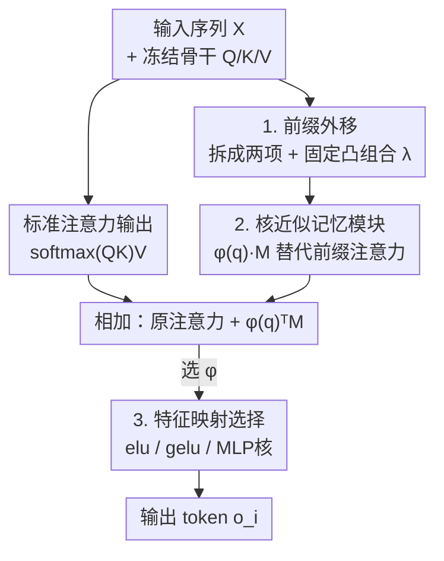

# PrefixMemory-Tuning: Modernizing Prefix-Tuning by Decoupling the Prefix from Attention

**会议**: ICLR 2026  
**OpenReview**: [https://openreview.net/forum?id=LvUMpZE44r](https://openreview.net/forum?id=LvUMpZE44r)  
**领域**: LLM效率 / 参数高效微调  
**关键词**: 前缀微调, PEFT, 线性注意力, 外部记忆, 大模型适配

## 一句话总结
本文先实证指出 Prefix-Tuning 在现代大模型上失效的真正原因是「前缀与输入在注意力 softmax 里此消彼长的权重 trade-off」，进而提出 PrefixMemory-Tuning（PMT）：把前缀模块从注意力头里搬出来、用一个可训练记忆矩阵 $M$ 加核特征映射 $\phi(\cdot)$ 近似，使前缀贡献不再被序列长度稀释，在少样本分类、偏好对齐、数学推理上一致超过 Prefix-Tuning 并与 LoRA 持平甚至领先。

## 研究背景与动机
**领域现状**：在大模型时代，全参数微调成本高昂，参数高效微调（PEFT）成为主流。Prefix-Tuning（PT）是最早的一类「上下文型」PEFT——给每一层注意力的 KV 前面拼接一段可训练的连续向量（前缀），冻结骨干权重只训这段前缀，计算和显存开销都极低，在早期的低数据/少样本生成任务上能逼近全量微调。

**现有痛点**：然而随着 LLM 越做越深、序列越来越长，PT 的效果明显退化，逐渐被 LoRA、GaLore 等权重型方法取代。问题是 PT 本身具备权重型方法没有的优点——可解释性、与「记忆」概念天然相关、可做测试时检索式适配——但因为性能拉胯，这些优点根本没机会被发掘。

**核心矛盾**：以往主流解释（Petrov et al., 2023）把 PT 的失效归因于「前缀无法改变注意力头内的注意力分布」。本文重新审视后发现：这个结论只在浅层 transformer 成立，在现代深层 LLM 上 PT 其实能显著改变注意力 pattern（见附录 B.2），所以「改不动注意力」不是真正病根。真正的病根是：前缀 $[s_1,\dots,s_p]$ 被塞进了注意力头的 softmax 归一化分母里，于是前缀贡献和输入贡献会互相争夺权重——前缀相对输入越长，模型越被前缀主导、丢失对具体输入的特异性；输入相对前缀越长（比如长 CoT 推理），前缀的影响又被极度稀释。两头不讨好。

**本文目标**：在不丢掉 PT「外部上下文/记忆」这套优良性质的前提下，消除这个 softmax 内的 trade-off。

**切入角度**：既然 trade-off 来自「前缀被关在注意力头的 softmax 算子里」，那就把前缀信息**搬到注意力头外面**去算，让它不再参与 softmax 归一化竞争。

**核心 idea**：用「固定凸组合 + 线性注意力核近似 + 可训练记忆矩阵 $M$」把前缀重写成一个挂在注意力输出旁边的外部模块 $\phi(q_i)^\top M$，从而把记忆容量与序列长度解绑、并提升表达力。

## 方法详解

### 整体框架
PMT 的推导是「一步步把前缀从注意力头里剥出来」。出发点是标准 PT 的注意力输出（式 2）：前缀项 $\sum_{j\le p}\mathrm{sim}(q_i,W_Ks_j)(W_Vs_j)^\top$ 和输入项共享同一个 softmax 分母，这正是 trade-off 的来源。PMT 做三步改造：① 把式 2 拆成「输入注意力」和「前缀注意力」两个**各自独立归一化**的项，再用一个固定常数 $\lambda$ 做凸组合（式 4），从而把「随输入/前缀长度变化的 softmax 竞争」换成「固定权重的线性组合」；② 用核特征映射 $\phi(\cdot)$ 近似相似度 $\mathrm{sim}(\cdot,\cdot)\approx\phi(\cdot)^\top\phi(\cdot)$，把前缀项线性化（式 5），此时前缀信息浓缩成偏置 $b_1=\sum_{j\le p}\phi(W_Ks_j)(W_Vs_j)^\top$；③ 把这个由前缀算出来的偏置 $b_1$ 直接**替换成一个可训练矩阵** $M$（式 6），$\lambda$ 和归一化项 $\phi(q_i)^\top N$ 因为可被训练权重和 LayerNorm 吸收而省去，最终得到极简形式（式 7）：

$$o^{PMT\top}_i=\frac{\sum_{j\le i}\mathrm{sim}(q_i,k_j)v_j^\top}{\sum_{j\le i}\mathrm{sim}(q_i,k_j)}+\phi(q_i)^\top M.$$

也就是：原始注意力输出原封不动，旁边并联加上一个 $\phi(q_i)^\top M$ 的「外挂记忆读取」。

### 关键设计

**1. 前缀外移：用固定凸组合替换 softmax 内的长度竞争**

这一步针对的就是动机里的核心矛盾——前缀与输入在同一个 softmax 分母里争权重。PMT 把式 2 拆成输入项和前缀项**各自独立归一化**，再用常数 $\lambda\in[0,1]$ 线性组合（式 4）：$o_i^\top=\lambda\cdot(\text{输入注意力})+(1-\lambda)\cdot(\text{前缀注意力})$。区别在于：标准 PT 里前缀的权重 $\alpha_i=\sum_{j\le p}\alpha_{ij}$ 是随输入长度和前缀长度动态变化的（式 3），输入一长前缀就被淹没；而 $\lambda$ 是固定的，前缀贡献不再被序列长度稀释。这是整套方法消除 trade-off 的根基，思路与 Infini-attention、记忆增强 transformer 等「固定门控混合」工作一脉相承。

**2. 核近似记忆模块：把前缀塌缩成可训练矩阵 $M$**

光做凸组合还不够表达力。PMT 借助线性注意力的核技巧，把相似度写成 $\mathrm{sim}(\cdot,\cdot)\approx\phi(\cdot)^\top\phi(\cdot)$，于是前缀项里关于 key/value 的求和被提成一个与 query 无关的偏置 $b_1=\sum_{j\le p}\phi(W_Ks_j)(W_Vs_j)^\top$（Chen et al., 2024 证明该偏置能捕获上下文/前缀信息）。本文的关键一跃是：不再由前缀向量算出 $b_1$，而是直接把它换成一个**自由可训练的矩阵** $M\in\mathbb{R}^{d_\phi\times d}$，得到 $\phi(q_i)^\top M$（式 7）。这样做有两层好处：一是表达力更强——作者把 PT 和 PMT 都看成「给 transformer 加 query 相关的 $d$ 维偏置」，计算偏置协方差矩阵的特征值衰减（图 3）发现 PMT 的顶部特征值大且衰减慢，说明它的偏置张成了一个更高维、更分散的子空间，而 PT 的偏置塌缩在少数几个轴上；二是从「记忆」视角看（Remark 2），$M$ 就是一块显式的内部记忆，记忆容量由 $M$ 的维度决定、**与前缀长度/序列长度彻底解耦**，比靠堆 KV 前缀或外接深层 MLP 记忆都更直接、更省参数。

**3. 特征映射 $\phi(\cdot)$ 的选择：表达力与成本的折中旋钮**

$\phi$ 决定了核近似的质量，是 PMT 里唯一需要调的结构性选择。作者出于实现简单，主要试了 $\phi(x)=\mathrm{elu}(x)$ 和 $\phi(x)=\mathrm{gelu}(x)$，并指出若取 $\phi_W(x)=\mathrm{ReLU}(Wx+b)$，则 $\phi_W(q_i)M$ 等价于一个单层 MLP，理论上可获得极强表达力（Remark 1）。实验（表 2）显示即便只在 elu 和 gelu 之间切换，性能也有可观差异——GELU 在多数任务上带来小而稳定的增益，证明 $\phi$ 确实重要。但更重的参数化（如完整 MLP 核）会破坏 PEFT 的参数高效初衷且需精细调初始化/稳定性，本文留作未来工作。这三步合起来构成作者强调的「上下文型方法统一设计视角」：决策一是「是否把前缀移出注意力头」，决策二是「用什么近似前缀相似度」。

## 实验关键数据

### 主实验
在 BigBench / GoEmotions / DBpedia 三个生成式分类基准、LLaMA2-7B-Chat（MHA）与 Qwen2.5-3B-Instruct（GQA）两个模型上做少样本（每类 1 样本）适配，五次独立试验取平均：

| 数据集 | 模型 | PMT | Full | LoRA | Prefix-Tuning |
|--------|------|-----|------|------|---------------|
| BigBench | LLaMA2-7B-Chat | **71.2** | 38.8 | 67.4 | 21.3 |
| BigBench | Qwen2.5-3B | **76.6** | 67.4 | 61.4 | 52.0 |
| DBpedia | LLaMA2-7B-Chat | **92.7** | 92.6 | 90.1 | 61.3 |
| DBpedia | Qwen2.5-3B | **96.9** | 94.4 | 89.5 | 82.0 |
| GoEmotions | LLaMA2-7B-Chat | **45.2** | 32.7 | 36.2 | 5.6 |

PMT 在六个设置上相对 LoRA 平均绝对提升 8.1%、相对 Prefix-Tuning 提升 29.4%。在数学推理（CFT，Qwen2.5-Math-7B）上随数据规模增大优势扩大：50K 训练样本时 Minerva-Math 达 62.5% vs LoRA 23.9%、AMC23 60.0% vs 47.5%。偏好对齐（AlpacaEval 2 win-rate delta，10K 样本）上 PMT 也全面超 LoRA：SFT +0.76 vs +0.49、DPO +4.66 vs +3.52、SimPO +1.74 vs +1.24。

### 消融实验

| 配置 | GoEmotions | DBpedia | BigBench | 说明 |
|------|-----------|---------|----------|------|
| PMT (ELU) | 45.2 / 37.3 | 92.7 / 96.9 | 71.2 / 76.6 | 默认特征映射（LLaMA2 / Qwen2.5）|
| PMT (GELU) | 47.0 / 38.7 | 93.2 / 96.4 | 72.0 / 76.2 | GELU 多数任务小幅更优 |
| PMT (MLP Kernel) | 43.6 / 35.7 | 95.0 / 95.0 | 64.5 / 77.1 | 更强但不稳定、参数更多 |

### 关键发现
- **核心机制验证**：图 3 的特征值衰减分析直接支撑了「$M$ 比前缀偏置更有表达力」——PMT 偏置张成高维子空间，PT 偏置塌缩在少数主成分上，这是 PMT 涨点的根本原因。
- **$\phi$ 的选择确实有意义**：elu→gelu 仅换激活就带来稳定差异，证明特征映射是有效的调节旋钮；但 MLP 核虽更强却不稳定，印证作者「留作未来工作」的谨慎。
- **GQA 下增益最大**：PMT 在 Qwen2.5-3B（分组查询注意力）上提升尤其明显，说明它对现代主流注意力架构友好、且随数据量平滑增长，适配规模化部署。
- **IID/OOD 双赢**：以 BigBench 为 IID、Banking77 为 OOD 的 Pareto 图显示 PMT 稳在帕累托前沿，不像很多方法那样为提 IID 牺牲 OOD 鲁棒性。
- **几乎不增成本**：显存与 LoRA 相当（16.7 vs 16.5 GB），训练吞吐反而更高（LLaMA2-7B：9.70 vs LoRA 8.22 vs PT 6.28 iter/s），72B 上推理延迟略低于 PT。

## 亮点与洞察
- **重新诊断了一个「被放弃」的方法**：作者没有盲从「PT 改不动注意力」的旧解释，而是实证推翻它、定位到 softmax 归一化里的长度依赖 trade-off，这种「先把病因搞对再开方」的研究姿态本身很有价值。
- **把前缀重写成外挂记忆是优雅的统一**：式 2→4→5→6→7 一路化简，最终落到 $o_i+\phi(q_i)^\top M$ 这个极简形式，同时打通了「Prefix-Tuning ↔ 线性注意力 ↔ KV 记忆 ↔ 单层 MLP」四套视角，可解释性强。
- **记忆容量与序列长度解耦**这个观点可迁移：任何「靠堆上下文 token 承载任务信息」的方法（prompt-tuning、ICL、检索增强）都可考虑用一个可训练矩阵把容量从序列长度里解放出来。
- **特征值衰减做机制证据**：用偏置协方差的谱衰减来量化「表达力/子空间维度」，是个干净利落、可复用的诊断手段。

## 局限与展望
- 作者明确把方法定位为 proof-of-concept / pilot attempt：固定凸组合替换 softmax 归一化「相当 naive」，$\phi$ 只试了 elu/gelu，MLP 核的初始化与训练稳定性、$\lambda$ 的处理都没深入。
- 评测集中在生成式分类、偏好对齐、数学推理，模型规模到 7B（延迟测到 72B），更大规模、更长上下文（长 CoT）下的表现仍待验证——而长输入恰恰是动机里 PT 失效的极端场景，PMT 在该场景的实测证据偏少。
- $M$ 作为「记忆」缺乏对其存储内容的解释/可视化，记忆是否真的承载了可解释的 token 交互模式只是直觉论证。
- 改进方向：设计更强但仍参数高效的可训练 $\phi$；让 $\lambda$/记忆容量自适应；把「外移前缀+外部记忆」推广到多层间共享或跨任务复用的记忆库。

## 相关工作与启发
- **vs Prefix-Tuning（Li & Liang, 2021）**：PT 把前缀拼进 KV、困在注意力头的 softmax 里，受长度 trade-off 限制；PMT 把前缀外移成 $\phi(q)^\top M$，消除竞争、记忆容量与序列长度解耦，是对 PT 的「现代化」泛化。
- **vs LoRA / LoRA+（Hu et al., 2021; Hayou et al., 2024）**：LoRA 是权重型 PEFT，给线性层加低秩更新、只隐式影响注意力；PMT 是上下文型，显式改注意力输出且保留可解释/记忆性质，少样本下平均比 LoRA 高 8.1%。
- **vs DePT / ADePT（Shi & Lipani, 2023; Tang et al., 2025）**：它们仍在「软提示」框架内拆分前缀+低秩/FFN 分量；PMT 直接把前缀塌缩成自由矩阵 $M$，跳出了「容量绑定前缀长度」的约束。
- **vs FFN-as-memory 一系（Geva et al., 2021/2022; Dai et al., 2022）**：那条线把 transformer 的 FFN 解读成 KV 记忆；PMT 借此视角把 $M$ 当成可读写的外部记忆接口，但比 MLP 记忆模块更直接、不需深层结构改动。

## 评分
- 新颖性: ⭐⭐⭐⭐⭐ 重新诊断 PT 病因 + 把前缀外移成可训练记忆，视角统一且有理论直觉
- 实验充分度: ⭐⭐⭐⭐ 覆盖分类/对齐/推理三类任务与两种注意力架构，但规模与长上下文证据偏少
- 写作质量: ⭐⭐⭐⭐⭐ 推导清晰、诊断与方法环环相扣，统一设计视角讲得明白
- 价值: ⭐⭐⭐⭐ 让被放弃的 Prefix-Tuning 重回竞争行列，为上下文型 PEFT 指了一条可延展的路

<!-- RELATED:START -->

## 相关论文

- [\[ICLR 2026\] CPQS-Tuning: A Model Self-Perception-Based Data Filtering Algorithm for Efficient Instruction Fine-Tuning](cpqs-tuning_a_model_self-perception-based_data_filtering_algorithm_for_efficient.md)
- [\[ICLR 2026\] Neuron-Aware Data Selection in Instruction Tuning for Large Language Models](neuron-aware_data_selection_in_instruction_tuning_for_large_language_models.md)
- [\[ICLR 2026\] Explainable Token-level Noise Filtering for LLM Fine-tuning Datasets](explainable_token-level_noise_filtering_for_llm_fine-tuning_datasets.md)
- [\[ICLR 2026\] Developmental Federated Tuning: A Cognitive-Inspired Paradigm for Efficient LLM Adaptation](developmental_federated_tuning_a_cognitive-inspired_paradigm_for_efficient_llm_a.md)
- [\[ICLR 2026\] Difficulty–Diversity Collaborative Filtering for Data-Efficient LLM Fine-Tuning](difficultydiversity_collaborative_filtering_for_data-efficient_llm_fine-tuning.md)

<!-- RELATED:END -->
