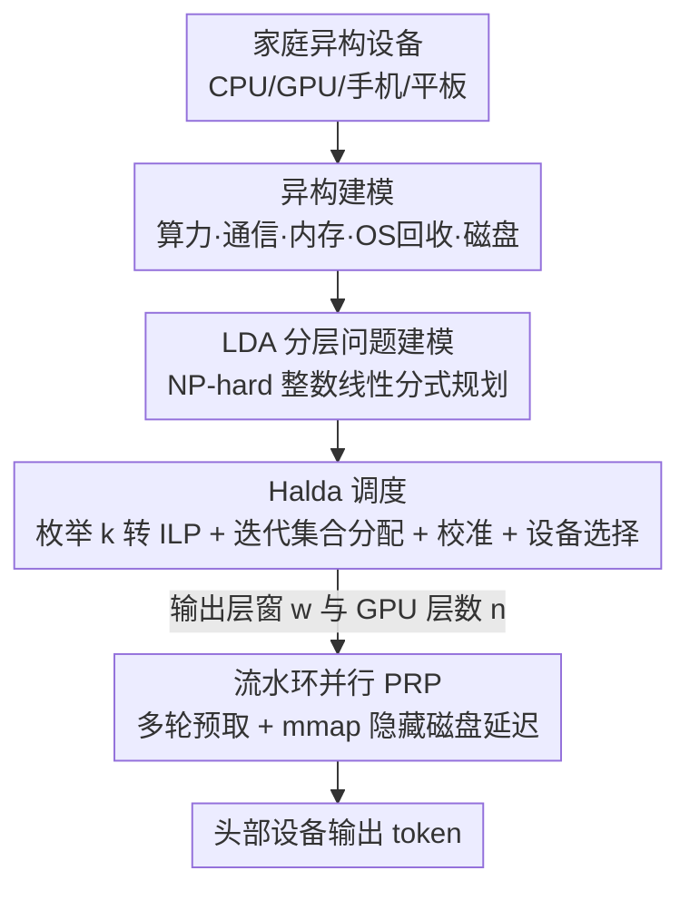

# Prima.cpp: Fast 30-70B LLM Inference on Heterogeneous and Low-Resource Home Clusters

**会议**: ICLR 2026  
**OpenReview**: [https://openreview.net/forum?id=h0LjpOG1jq](https://openreview.net/forum?id=h0LjpOG1jq)  
**代码**: https://gitee.com/zonghang-li/prima.cpp  
**领域**: LLM效率 / 分布式推理系统  
**关键词**: 设备端推理, 流水环并行, 磁盘卸载, 异构调度, 整数线性规划

## 一句话总结
prima.cpp 把家里的笔记本、台式机、手机、平板拼成一个异构低端集群，用「流水环并行 + 预取」把磁盘加载延迟藏进计算里，再用 Halda 调度器按设备真实算力/内存/磁盘求解最优分层方案，让一台普通家庭集群在内存严重不足的情况下也能跑 30-70B 模型，70B 达到 674 ms/token、内存压力 <6%，相比 llama.cpp 把 TPOT 降低 5-17×。

## 研究背景与动机
**领域现状**：具身智能（家庭监控、常驻语音助手、陪伴机器人）出于隐私、断网可用、长期成本的考虑，正从云端往设备端迁移。但消费级芯片和小内存只能勉强跑 8B 以下模型，而可靠的长程规划和工具调用需要 32B 甚至更大。要在小设备上塞下大模型，只能靠磁盘卸载（disk offloading）扩容量，代价是速度——例如 Qwen2.5-14B Q4K 在 8 GiB 的 Mac M1 上用 llama.cpp 要 10 s/token，完全不可用。

**现有痛点**：分布式推理是同时提升「模型规模 + 速度」又不改变输出的几乎唯一出路，但现有家用分布式系统有四个硬伤：(a) 都假设**聚合内存足够装下整个模型**（exo、Galaxy、dllama 等），推高硬件成本、限制模型规模；(b) 一旦需要磁盘卸载，推理就掉到几十秒每 token；(c) 分层策略建立在「内存够」的强假设上，忽略了 OS 级内存回收和磁盘访问的异构性；(d) 默认所有设备都必须参与，即便剔掉慢设备反而更快。

**核心矛盾**：家庭场景里「设备异构 + 内存不足 + 慢盘 + Wi-Fi 高延迟 + 跨 OS」这五个约束同时成立。张量并行（TP）需要频繁 all-reduce，在 Wi-Fi 上通信延迟爆炸；纯流水并行（PP）通信少但单请求场景流水气泡大，且内存不够时仍要磁盘卸载；而磁盘延迟又因 OS 内存回收策略、磁盘读吞吐差异极难量化，使得「该把多少层放哪个设备、放 GPU 还是 CPU」无法用启发式拍脑袋。

**本文目标**：分解成两个子问题。(Q1) 怎么放松内存约束跑更大模型？如果必须磁盘卸载，怎么把磁盘延迟藏起来？(Q2) 在 Q1 基础上，怎么做异构感知的分层、并识别出该剔除的瓶颈设备？

**切入角度**：作者观察到，单请求低频场景下 PP 的气泡其实可以被「多设备各自预取不同层段」填满——只要每轮只加载一个很小的层窗（layer window），就能让预取的层不被后续加载挤出页缓存。这把磁盘 I/O 变成可与计算/通信重叠的后台操作。

**核心 idea**：用「流水环并行（PRP）+ 预取」隐藏磁盘延迟扩展模型规模，再用异构感知调度器 Halda 把分层问题建成整数线性规划自动求最优解。

## 方法详解

### 整体框架
prima.cpp 基于 llama.cpp 用 20K 行代码实现，目标是在「混合 CPU/GPU、内存不足、慢盘、Wi-Fi、跨 OS」的家庭集群上把 30-70B 模型跑到实用速度。整条流水分三步：先对每个设备的算力、通信、内存、以及 OS 相关的内存回收/磁盘优化做异构建模，把「哪层放哪个设备、放 GPU 还是 CPU」形式化成「层到设备分配（LDA）」问题；再由 Halda 调度器求出每个设备的层窗大小 $w_m$ 与 GPU 层数 $n_m$，并顺手剔掉拖后腿的弱设备；运行时设备首尾相连成环，按 PRP 多轮预测一个 token，每轮各设备预取不同层段、用 mmap 按需从磁盘载入，让磁盘延迟与计算/通信重叠。输入和输出都在头部设备（head device）处理，进一步保护交互隐私。

### 关键设计

**1. 流水环并行 PRP + 预取：把磁盘加载塞进计算/通信的空隙**

要放松内存约束，最朴素的做法是在 llama.cpp 上扩展 mmap：计算需要某层时按需从外存载入，OS 在内存压力下又能把它换出，这样小内存集群也能跑大模型，再配预取提前载入下一段。但这个朴素设计会撞上**预取-释放冲突（prefetch-release conflict）**：如果磁盘读得快，后载入的层会把先前预取好的层从页缓存里挤出去，等真正计算时需要的层又不在缓存里，触发缺页和重新加载，预取等于白做，气泡照旧。

PRP 的解法是把所有设备首尾相连成一个环，**多轮**预测一个 token：每轮每个设备只预取一个很小的层段（其大小就是层窗 $w$），这一段的加载与其他设备正在进行的计算、通信、磁盘加载相互重叠。由于每轮只载入一小段，既不会内存溢出，预取的层也不容易被挤出页缓存，从根上缓解了冲突。如图 1 的例子，6 个设备处理 36 层模型、层窗为 2，模型被切成 18 段按环序分配，每个设备 3 轮预测一个 token。实测对大模型 PRP 把 PP 的 TPOT 砍掉约 50%（PP 等价于 $k=1$ 的 PRP），对小模型则收敛回 PP。注意在异构设备上统一层窗仍会留气泡，理应给更强的设备分更大的层窗——但「谁更强、窗口该多大」恰恰是下面要解决的难题。

**2. 层到设备分配（LDA）问题建模：把异构性写进一个可优化的目标**

一个层窗内，部分层驻留 VRAM 在 GPU 上跑，其余卸到 RAM 在 CPU 上跑，若 CPU 那部分超出可用 RAM，溢出再经 mmap 卸到外存。设有 $M$ 个设备，$w_m$ 是设备 $m$ 的层窗大小、$n_m$ 是其中的 GPU 层数，决策变量为向量 $w$ 和 $n$，目标是最小化 TPOT：

$$\min_{w,n}\ \frac{L\cdot a^\top w + b^\top n + e^\top c}{e^\top w} + \kappa$$

其中 $L$ 是模型层数，$a,b,c$ 是由计算延迟、内存访问延迟、磁盘加载延迟、通信延迟决定的系数向量，$\kappa$ 是常数延迟偏置，分母 $e^\top w$ 关系到一个 token 需要的轮数 $k$（满足 $L = k\,e^\top w$）。约束（2）限制层数不越界，约束（4）（5）保证 RAM/VRAM 用量不超限。难点在于：磁盘加载严重受 OS 内存回收和磁盘读吞吐影响——有的 PC 有独立 VRAM，有的 Mac M 系列是统一内存（UMA）回收更激进，有的是没 GPU 的 NUMA，甚至同一设备开不开 Metal 回收行为都不同，量化方式也会同时影响计算/访存/磁盘/内存约束。作者据此把设备分成四类集合 M1-M4（macOS 关 Metal 内存不足 / macOS 开 Metal 内存不足 / Linux 与 Android 内存不足 / 内存充足或慢盘），分别构造系数。这个问题是 **NP-hard 的整数线性分式规划（ILFP）**，而且更棘手的是：一个设备属于哪个集合取决于 $w,n$ 的解，但不定集合又解不出来——形成循环依赖。

**3. Halda：枚举 k 转标准 ILP + 迭代求集合 + 校准 + 设备选择**

Halda 用两个核心思路破局。其一，**枚举 k**：LLM 层数 $L$ 通常 <100，能整除 $L$ 的因子至多 11 个，于是对每个有效 $k$ 把 $k$ 和 $W=e^\top w$ 当常数，分式目标就退化成线性目标，整个问题变成标准 ILP，可直接喂给 HiGHS 这类求解器求最优 $w,n$。其二，**迭代优化集合分配**破循环依赖：先按可用内存把 $w$ 成比例初始化、$n=0$，得到设备到 M1-M4 的初始划分，解 ILP 更新 $w,n$ 后重新分集合，迭代到集合收敛（算法 1）。但这还有缺陷——若某设备被初始化进 {M1,M2,M3} 却分到 30 层，受内存约束可能只给 GPU 10 层、CPU 20 层，浪费了本能放 20 层的 GPU。于是加一步**校准**：当某 GPU 未用满（VRAM 没满）而另一设备过载时，把 {M1,M2,M3} 中磁盘最慢的设备强制移入 $M_4^{force}$ 再求解，保证收敛到最优集合分配。复杂度上主循环 $T=O(M)$ 次、每次解 $O(\log L)$ 个小而稀疏的 ILP，实测 4-32 设备全局调度延迟仅 10-12 ms。最后是**设备选择**：只分到一层的弱设备直接剔除（Halda 表明排除它们反而更快）；小模型时 Halda 会把所有层堆到最强单设备，prima.cpp 自动退化成 llama.cpp；若剔除某设备会断开通信环，则保留它当中继但不分配负载。这让用户无需手动选设备——只管多接入设备，Halda 自动选最优子集。

### 一个例子：8B 模型为何只用一台设备
以 Llama3-8B（Q4K，需 5.3 GiB VRAM）在测试床 D1-D4 上为例：D3 的 2080TI 有 11 GiB VRAM，整模型完全能塞进 D3-GPU。Halda 求解后发现把所有层都给 D3 最快，于是剔除 D1/D2/D4，prima.cpp 退化为单设备 llama.cpp，二者 TPOT/TTFT 完全相同（15 ms/18 ms）。反观 exo 按内存比例分层，给 D1（8 GiB RAM，Apple Silicon GPU）、D2（8 GiB VRAM）、D3（11 GiB VRAM）分别分 9、10、13 层，结果 D1 的 Apple Silicon 效率远低于 2080TI 成为瓶颈，TPOT 高达 263 ms——这具象地说明「设备多不一定快，聚合内存也不必正好等于模型需求」。

## 实验关键数据

实现 20K 行代码，测试床为 6 台真实低端家用设备（Mac M1、Intel 笔记本/台式、Mate40Pro 手机、Honor 平板、Mac Air），经本地 Wi-Fi 路由器互联，带宽 320-610 Mbps、链路延迟 3-7 ms。默认用 D1-D4（聚合 RAM+VRAM 仅 37 GiB，不足以装下 Q4K 的 70B）。基线为 llama.cpp、exo、dllama。

### 主实验
Llama 8-70B（Q4K）的 TPOT（ms/token）与内存压力对比：

| 模型规模 | llama.cpp TPOT | exo TPOT | dllama TPOT | prima.cpp TPOT | prima.cpp 内存压力(D4) |
|--------|------|------|------|------|------|
| 8B | 15 | 263 | 1150 | 15 | ≤1.0% |
| 30B | 202 | - | - | 72 | ≤1.0% |
| 45B | 328 | - | 6235 | 233 | ≤1.0% |
| 60B | 7965 | - | - | 468 | ≤1.0% |
| 70B | 10120 | OOM | OOM | 674 | ≤1.0% |

70B 上 prima.cpp 把 llama.cpp 的 TPOT 从 10120 降到 674 ms/token（约 15×），TTFT 降低最多 8×；相比 exo/dllama 至少低 18× TPOT、42× TTFT，且全程无 OOM。配上推测解码（speculative decoding），32B 达 26 tokens/s、70B 达 442 ms/token。内存压力方面（表 5），所有规模下各设备压力都极低（多数 ≤6%，慢盘设备 D4 始终 ≤1%），而 exo 在 45B 上各设备已飙到 61%-74%、dllama 直接 OOM。

### 消融实验

| 配置 | 70B TPOT | 说明 |
|------|---------|------|
| prima.cpp (full) | 674 | 完整模型 |
| w/o prefetch | ~ +9~17% | 去掉预取，大模型缺页重载频繁，TPOT 升 9-17% |
| w/o halda | 20848 | 换成 exo 式按内存比例分层，最高慢 31× |

### 关键发现
- **Halda 贡献最大**：去掉 Halda（退化成 exo 式启发式分层）在 70B 上 TPOT 从 674 暴涨到 20848 ms/token，最高慢 31×——异构感知的分层是大模型能否实用的决定性因素。
- **预取只对大模型有用**：小模型能全部装进 RAM/VRAM 时预取几乎无影响；只有大模型被频繁换出、缺页重载时，提前预取并重叠延迟才把 TPOT 压下 9-17%。
- **llama.cpp 的崩点在 60B**：45B 时 mmap 只重载少量页、损失轻微；到 60B 高内存压力使活跃页提前被换出，TPOT 从 328 暴涨到 7965，说明单机磁盘卸载完全不适合消费级设备跑大模型。
- 在 Qwen2.5、QwQ、DeepSeek-R1 上以及更大异构测试床（4-32 设备）上的实验进一步验证了泛化性。

## 亮点与洞察
- **把「磁盘延迟」从瓶颈变成可重叠的后台操作**：PRP 用「环 + 小层窗 + 多轮」让各设备的预取互相藏进别人的计算/通信里，正面化解了 mmap 预取-释放冲突，这个洞察对任何内存受限的流水推理都可迁移。
- **把启发式分层升级成可证最优的 ILP**：识别出层数 $L<100$、因子至多 11 个这个关键事实，把 NP-hard 的 ILFP 通过枚举 $k$ 干净地转成一组小 ILP，再用迭代集合分配破循环依赖——既严谨又快（10-12 ms）。
- **设备选择「做减法」反而更快**：剔除只能分到一层的弱设备、断环时保留为纯中继，这个反直觉设计把「凑设备」变成「选设备」，让系统对家庭里参差不齐的硬件鲁棒。
- **隐私友好**：输入输出都只在头部设备处理，原始交互不出本地，天然契合具身智能的隐私诉求。

## 局限与展望
- 当前面向**单请求**低频场景设计，未做 mini-batch；作者提到可经动态批处理扩展到批量（附录 A.11），但未充分验证多用户高并发下的表现。
- 异构建模依赖把设备人工归到 M1-M4 四类并构造对应系数，新增 OS / 硬件形态需扩展集合定义，迁移到完全陌生的平台时这套系数表的可维护性存疑。
- 性能高度依赖 Halda 对各设备延迟系数 $a,b,c$ 的准确刻画；这些系数来自性能分析与预实验，环境漂移（如后台应用抢占、磁盘老化）下是否需要重新标定、标定成本多大，文中未深入。
- 评测集中在 Llama/Qwen 等密集模型，明确排除了稀疏（NPU/MoE）推理系统，适用范围限定在「任意开放权重密集模型 ≤70B」。

## 相关工作与启发
- **vs llama.cpp（单机 mmap 卸载）**: 同样用 mmap 按需载层，但 llama.cpp 单机一旦内存压力大就频繁缺页重载、60B 直接崩到 8 s/token；prima.cpp 用 PRP 把加载分散到多设备并预取重叠，70B 仍 sub-second。
- **vs exo（PP 按内存比例分层）**: exo 假设聚合内存够装整模、按内存比例拍脑袋分层，弱 GPU 易成瓶颈且高内存压力；prima.cpp 用 Halda 按真实算力/磁盘求最优分层，并支持磁盘卸载，无 OOM。
- **vs dllama（张量并行）**: dllama 靠 TP 切张量，但单 8B 模型就需 64 次 all-reduce，在高延迟 Wi-Fi 上通信延迟主导，70B 估算每 token 多加 24 s；prima.cpp 选 PRP 这种少通信的流水范式更契合 Wi-Fi 家庭网络。
- **vs TPI-LLM**: 同样按需载层 + 预取让 4 GiB 设备跑 70B，但它停在 30 s/token 不实用；prima.cpp 的环式多轮 + 异构调度把同等场景压到 sub-second。

## 评分
- 新颖性: ⭐⭐⭐⭐⭐ PRP 化解预取-释放冲突 + 把异构分层严谨建成可解 ILP，两个核心创新都扎实且少见。
- 实验充分度: ⭐⭐⭐⭐⭐ 真实 6 设备异构测试床、3 个强基线、8-70B 全规模、含 Halda/预取消融与多模型泛化。
- 写作质量: ⭐⭐⭐⭐ 问题拆解（Q1/Q2）清晰、动机具体，但大量关键证据塞在附录，正文略依赖附录。
- 价值: ⭐⭐⭐⭐⭐ 让普通家庭用现有设备免费跑 30-70B，对具身智能/隐私本地推理有直接落地意义。

<!-- RELATED:START -->

## 相关论文

- [\[ICLR 2026\] PARD: Accelerating LLM Inference with Low-Cost Parallel Draft Model Adaptation](pard_accelerating_llm_inference_with_lowcost_parallel_draft_model_adaptation.md)
- [\[ICLR 2026\] Fast-dLLM v2: Efficient Block-Diffusion LLM](fast-dllm_v2_efficient_block-diffusion_llm.md)
- [\[ICML 2026\] Fast-dLLM++: Fréchet Profile Decoding for Faster Diffusion LLM Inference](../../ICML2026/llm_efficiency/fast-dllm_fréchet_profile_decoding_for_faster_diffusion_llm_inference.md)
- [\[ICLR 2026\] SpareTrain: Fault-Tolerant LLM Training via Low-Cost Dual Modular Redundancy](sparetrain_fault-tolerant_llm_training_via_low-cost_dual_modular_redundancy.md)
- [\[ICLR 2026\] Universal Model Routing for Efficient LLM Inference](universal_model_routing_for_efficient_llm_inference.md)

<!-- RELATED:END -->
