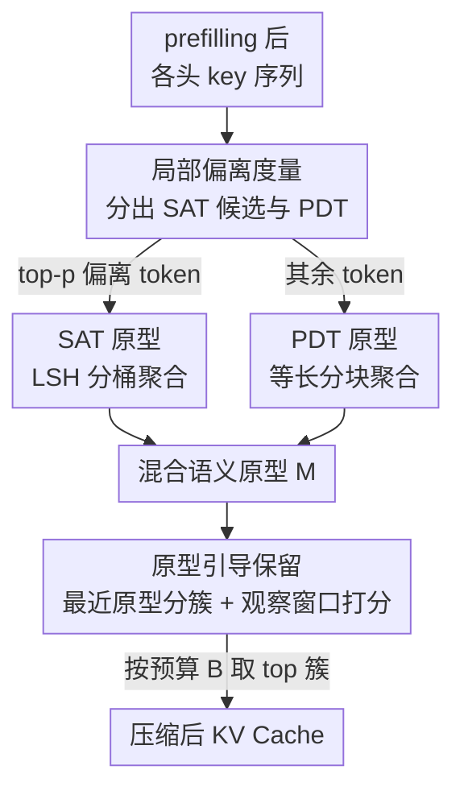

# ProtoKV：长上下文的知识在你查询之前就已组织好了

**会议**: ICLR 2026  
**OpenReview**: [https://openreview.net/forum?id=kXhPkDaFbJ](https://openreview.net/forum?id=kXhPkDaFbJ)  
**代码**: https://github.com/yyy0959/ProtoKV  
**领域**: LLM效率 / KV Cache 压缩  
**关键词**: KV Cache 压缩, 语义锚点, 局部偏离, 语义原型, 长上下文推理

## 一句话总结
ProtoKV 发现 LLM 在 prefilling 阶段就已自发把 token 分成「位置决定型」和「语义锚点型」两类，并据此分别构造语义原型、按原型把 token 聚成簇再整簇保留/丢弃，从而在相同显存预算下把 LongBench 平均精度比 SOTA 提高 2.11%，同时计算开销与 SnapKV 相当。

## 研究背景与动机

**领域现状**：LLM 处理长文本受限于注意力的二次复杂度，而 KV Cache 又让显存随序列长度线性膨胀（$O(b\cdot n)$）。主流的缓解手段是 KV Cache 保留（retention/eviction）策略：在 prefilling 阶段对每个注意力头只保留「重要」的 KV 对，其余丢弃。重要性通常由先验（如 attention sink）或累计注意力分数等指标衡量。

**现有痛点**：早期方法（如 H2O）孤立地给每个 token 打分再保留，破坏了压缩表示的语义完整性。为此 SnapKV、ChunkKV 等转向「语义级压缩」：把连续 token 切成 chunk、整块保留或丢弃，以维持上下文连贯。但它们隐含假设「位置相邻即语义相似」，而自然语言里并非如此——某些标点、ICL 中的 label word 等会吸收一段序列的语义、扮演「锚点」角色，它们彼此功能等价却在序列里分散分布，chunk 方法无法把它们当成一个语义单元统一处理。基于 K-means 的聚类方法虽能跨位置抓住语义相似 token，却要多轮迭代、效率低且对初始化敏感（图 7 中 Squeeze Attention 需 20+ 轮才超过 baseline）。

**核心矛盾**：长上下文压缩需要同时照顾两种信息——锚点 token 聚合的高阶语义、以及普通 token 承载的局部细粒度知识；而现有方法要么只顾局部连续性（chunk），要么为了抓全局语义付出高昂的迭代聚类代价（cluster）。语义完整性与计算效率难以兼得。

**切入角度**：作者去观察 prefilling 后的 key embedding 分布，发现一个普遍现象——绝大多数 token 与其上下文邻居的 key 高度相似（称 **Position-Determined Tokens, PDT**），而极少数 token 明显违背这种局部相似性、表现出「局部偏离」（称 **Semantic-Anchored Tokens, SAT**）。关键在于：这些 SAT 虽少，却会在 key 空间里自发聚成一两个紧凑的簇，并在生成时持续吸收注意力。也就是说，**LLM 在被查询之前，就已经在 prefilling 阶段把这些锚点 token 识别并组织好了**——这正是标题的含义。

**核心 idea**：与其孤立打分或硬切 chunk，不如顺着模型「已经组织好」的结构，把 SAT 和 PDT 分开处理、各自构造语义原型，再用原型把全部 token 聚成簇作为压缩的基本单位，从而一次性兼顾语义完整性与效率。

## 方法详解

### 整体框架

ProtoKV 在 prefilling 阶段对每个注意力头的 key 序列做处理，目标是在预算 $B$ 下选出最该保留的 KV 簇。整体分三步走：先用「局部偏离度」把 token 分成 SAT 候选与 PDT；再对两类分别构造「语义原型」（SAT 走 LSH 分桶、PDT 走等长分块）；最后把每个 token 指派到最近的原型形成簇，用观察窗口打分给每个簇算重要性、按预算整簇保留。

这里有个关键设计取舍：作者先试过「直接按局部偏离度降序保留」的朴素版（称 SATKV），发现它反而打不过 SnapKV（表 1）。原因有二：一是它忽略了 PDT，而 PDT 仍占约 40% 的注意力，预算超过 SAT 容量时必须同时保留 PDT；二是它和 H2O 一样孤立评估单个 token，丢了语义连贯性。这两点直接催生了「双类分治 + 原型聚簇」的完整框架。

### 关键设计

**1. 局部偏离性质：用 outlier degree 把 token 量化分成 SAT 与 PDT**

这一步解决「锚点 token 多样、难以系统识别」的痛点。作者先定义 token $i$ 的 $\kappa$-邻域相似度——它与前后各 $\kappa$ 个邻居 key 的平均余弦相似度（默认 $\kappa=5$）：

$$S^{(h)}_\kappa(i)=\frac{1}{2\kappa+1}\sum_{j=i-\kappa}^{i+\kappa}\cos\!\big(k^{(h)}_i,k^{(h)}_j\big)$$

再做标准化得到**局部偏离度（outlier degree）**：$\Theta^{(h)}(i)=\big(S^{(h)}_\kappa(i)-\mathbb{E}[S^{(h)}_\kappa]\big)/\sqrt{\mathbb{V}[S^{(h)}_\kappa]}$，其中均值方差跨全部输入 token 统计。偏离度高的就是 SAT，低的是 PDT。作者用两条性质坐实了这一区分的意义：其一，**SAT 会聚簇**——把 $\Theta(i)>\beta$ 的 token 取出来看簇内/簇间相似度之比 $\Gamma(C)=S_\text{intra}/S_\text{inter}$，$\beta$ 越大簇越紧凑，且超过临界阈值后聚集度陡增；其二，**SAT 对生成至关重要**——按偏离度分十组统计「推理阶段累计注意力」，深层里 top 10% 偏离 token 吃掉了 60%+ 的累计注意力；而按偏离度删 SAT 会让长文推理性能急剧下降（与按累计注意力删几乎等效），随机删则没影响。值得强调的是，作者把 SAT 视作比 attention sink 更广的概念——即便排除掉开头的 sink token，剩下的 SAT 仍不可或缺。

**2. 混合语义原型构建：SAT 走 LSH 分桶、PDT 走等长分块，各取所长**

既然硬给单个 token 贴 SAT/PDT 标签边界模糊，ProtoKV 干脆不分类单点，而是整体地为两种 pattern 各抽一组**语义原型**。对 SAT：取偏离度 top-$p$ 的候选 token $O=\{k_j\}$，用带高斯核近似的 Random Fourier Features 把 key 投影到低维 $\phi(k_j)=\sqrt{2/r}\cos(Wk_j+b)$，再二值化成 $r$-bit 码并解释为整数做 LSH 分桶 $H(k_j)=\big(\sum_i 2^{r-i}h^{(i)}_j\big)\bmod u$（取 $u=2^r$）。这种二值-十进制转换保持了 Hamming 距离，能优雅应对 SAT「松散聚集」或「多簇」的情形，比强行假设单一簇更稳。对 PDT：直接把 $T\setminus O$ 切成 $v$ 个等长连续 chunk。最后两类各自做归一化求和得到原型：$c^{(\text{SATs})}_s=\frac{\sum_{k_j\in B_s}k_j}{\|\cdot\|_2}$、$c^{(\text{PDTs})}_m=\frac{\sum_{k_t\in C_m}k_t}{\|\cdot\|_2}$，合并成混合原型集 $M=\{c^{(\text{PDTs})}_m\}\cup\{c^{(\text{SATs})}_s\}$。这样 SAT 原型封装跨位置的高阶锚点语义，PDT 原型保留局部细粒度信息，两者互补。

**3. 原型引导的 KV 保留：最近原型分簇 + 观察窗口打分 + 按预算整簇保留**

有了原型，ProtoKV 用它们当现成的高质量聚类中心，避开 K-means 的迭代。每个 token $k_t$ 被指派给与它余弦相似度最高的原型 $c(k_t)=\arg\max_{c\in M}\frac{k_t^\top c}{\|k_t\|\|c\|}$，于是全部 token 被切成 $u+v$ 个簇。每个簇的重要性用 SnapKV 式的**观察窗口机制**打分：取序列末尾长度 $L_\text{obs}$ 的观察窗口里的 query 去和簇内 key 算内积求和，$\psi^{(h)}(C_j)=\sum_{i\in C_j}\sum_{m=L_\text{prefix}+1}^{L_\text{prompt}}q_m^\top k_i$。最后按 $\psi$ 排序，在预算 $B$ 内整簇保留 top 簇、整簇丢弃其余，用二值 mask 取出压缩后的 KV。由于簇中心直接来自 SAT/PDT 的天然结构，复杂度从迭代聚类的 $O(e\,n\,t)$ 降到 $O(n\,t)$（$e$ 为迭代轮数、$t$ 为簇数），效率与 chunk 方法持平却保住了跨位置语义。

### 一个完整示例

以 SQuAD 里一段关于 "Super Bowl 50" 的长文为例：prefilling 后，绝大多数叙述性 token（球队名、时间、地点描述）与邻居 key 高度相似，被判为 PDT，按位置切成等长 chunk 形成局部原型；而像引号、特定标点、以及承载话题转折的「锚点」token 偏离度高，被选为 SAT 候选，经 LSH 分桶聚成一两个 SAT 原型。当 query "Which NFL team represented the AFC at Super Bowl 50?" 到来时，观察窗口打分让那些与问题相关的语义簇（含锚点和对应细节）拿到高 $\psi$ 被整簇保留，无关的 haystack 簇被丢弃。在 8K 上下文的 Needle In A Haystack 里，即便只保留 1.6% 的 KV，ProtoKV 仍能取回 97.3% 的针，正因为针文本本身偏离度高、天然落进被保留的语义簇。

## 实验关键数据

### 主实验

| 基准 / 设置 | 指标 | ProtoKV | 对比 | 说明 |
|--------|------|------|----------|------|
| LongBench（16 任务平均，64–512 预算） | Avg Score | SOTA | 比 SOTA baseline 高 0.35%–4.27% | 平均提升 **2.11%** |
| RULER（Llama3-8B，预算 128/512，NIAH） | Acc | 98.2 / 99.6 | SnapKV 97.2 / 99.6 | 持续最优或次优 |
| RULER（QA 子集，128/512） | Acc | 42.8 / 43.6 | SnapKV 42.0 / 43.8 | 与最强持平 |
| Needle In A Haystack（128 预算，≈1.6% 保留） | 检索准确率 | **97.3%** | SnapKV 94.2 / H2O 54.8 / SLM 31.1 | 远超 eviction 类方法 |
| LongBench（Llama3-8B，512 预算，prefilling 配置） | Score | 40.76 | ClusterKV 40.45 / SqueezeAtt 40.42 / SentenceKV 40.21 | 优于 cluster 类方法 |

朴素版 SATKV（只按偏离度保留）在 Llama3-8B、256 预算下普遍打不过 SnapKV（如 NrtvQA 21.12 vs 23.32），印证「只保 SAT、丢 PDT 且孤立打分」不可行——这正是 ProtoKV 双类分治的出发点。

### 消融实验

| 配置 | 关键指标 | 说明 |
|------|---------|------|
| ProtoKV（完整） | 最优 | SAT 走 LSH + PDT 走 chunk |
| Chunk-Clustering | 下降 | 只用分块聚合得原型，丢了跨位置 SAT |
| LSH-Clustering | 下降更多 | 全部 token 都走 LSH，丢了局部细粒度 |
| ProtoKV + LA./HA. | 进一步提升 | 叠加层/头级预算分配，6 类任务普遍再涨 1%–4% |

### 关键发现
- **两类原型缺一不可**：去掉 SAT 处理（Chunk-Clustering）或去掉 PDT 处理（LSH-Clustering）都掉点，且 LSH-Clustering 掉得更狠——说明 PDT 承载的局部细粒度信息不能丢，单靠锚点不够。
- **超参很省**：最优总原型数约 500，其中 SAT 原型只需 2–4 个；SAT 候选 token 取 20–40 个即可，多了反而引入 PDT 噪声损害聚类；邻域窗口 $\kappa$ 对结果几乎无影响，方法鲁棒。
- **效率优势明显**：评估簇重要性 $\psi$ 的耗时与 SnapKV 相当，而 cluster-based 方法要付出最高 3.9× 的时间开销；ProtoKV 总耗时在不同原型数下也基本稳定。
- **正交可叠加**：与层级/头级 KV 预算分配方法兼容，叠加后稳定再提升。

## 亮点与洞察
- **「模型已经替你组织好了」这个视角很巧**：不是去发明一种新的聚类，而是发现 LLM 在 prefilling 阶段自发把锚点 token 聚到了 key 空间的几个簇里，方法只是顺势取用这些天然簇中心，从根上绕开了 K-means 的迭代和初始化敏感问题。
- **outlier degree 是个干净可迁移的探针**：用标准化后的邻域相似度衡量「局部偏离」，既能定位 attention sink、ICL label word 这些已知锚点，又能发现更广的 SAT，可以迁移去做注意力机制分析、检索头识别等。
- **LSH 处理 SAT、chunk 处理 PDT 的「分治」是动机驱动的**：SAT 跨位置且可能多簇，所以用保 Hamming 距离的 LSH；PDT 位置局部，所以直接分块——两种结构特性对应两种工具，而非一刀切。

## 局限与展望
- 方法建立在「SAT 在 key 空间聚成一两个紧凑簇」的经验观察上，作者也承认初始层 SAT 尚未显现、低连贯文本（多文档）会出现多簇等情形；虽然实验证明「假设单一紧凑簇」仍有效，但对极端不连贯文本的鲁棒性边界未充分量化。
- 实验集中在 ≤32K 上下文、Llama/Mistral 7–8B 量级模型与 LongBench/RULER，对更长上下文、更大模型或非英文场景的泛化是开放问题。
- outlier degree 的统计依赖整段 prefilling 后的 key 分布，属于 prefilling 后一次性压缩；与流式/在线增量场景的结合（动态更新原型）值得探索。
- 原型数、SAT 候选数等超参虽不敏感，但仍需按任务调，缺少自适应确定原型数的机制。

## 相关工作与启发
- **vs SnapKV / ChunkKV（chunk-based）**：它们假设「位置相邻即语义相似」、按连续 chunk 整块保留，无法把分散的功能等价锚点当一个语义单元；ProtoKV 用 SAT 原型显式捕获跨位置锚点，语义完整性更强。
- **vs H2O / SATKV（孤立打分）**：H2O 按累计注意力孤立打分、SATKV 按偏离度孤立保留，都丢语义连贯且忽视另一类 token；ProtoKV 以「簇」为原子单位保留，兼顾 SAT 与 PDT。
- **vs ClusterKV / Squeeze Attention（K-means cluster-based）**：它们能跨位置抓语义相似 token，但要多轮迭代（20+ 轮才超 baseline）、对初始化敏感、簇大小易失衡；ProtoKV 直接用 SAT/PDT 天然结构当簇中心，复杂度从 $O(ent)$ 降到 $O(nt)$，效率高一个量级。

## 评分
- 新颖性: ⭐⭐⭐⭐⭐ 「SAT/PDT 二分 + 原型即天然簇中心」的观察与方法都新颖且自洽
- 实验充分度: ⭐⭐⭐⭐ LongBench/RULER/NIAH + 多模型 + 消融与超参分析较完整，但上下文长度与模型规模偏中小
- 写作质量: ⭐⭐⭐⭐ 现象-分析-方法的叙事清晰，公式与图表支撑到位
- 价值: ⭐⭐⭐⭐⭐ 相同显存下精度提升且开销与 SnapKV 持平，对长上下文部署实用性高

<!-- RELATED:START -->

## 相关论文

- [\[ICLR 2026\] Reconstructing KV Caches with Cross-Layer Fusion for Enhanced Transformers](reconstructing_kv_caches_with_cross-layer_fusion_for_enhanced_transformers.md)
- [\[ICLR 2026\] Equilibrium Language Models](equilibrium_language_models.md)
- [\[ICLR 2026\] QuoKA: Query-Oriented KV Selection for Efficient LLM Prefill](quoka_query-oriented_kv_selection_for_efficient_llm_prefill.md)
- [\[ICLR 2026\] LycheeDecode: Accelerating Long-Context LLM Inference via Hybrid-Head Sparse Decoding](lycheedecode_accelerating_long-context_llm_inference_via_hybrid-head_sparse_deco.md)
- [\[ICLR 2026\] Retrospective Sparse Attention for Efficient Long-Context Generation](retrospective_sparse_attention_for_efficient_long-context_generation.md)

<!-- RELATED:END -->
