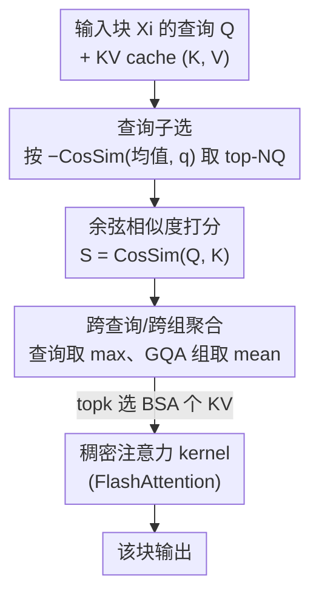

# QuoKA: Query-Oriented KV Selection for Efficient LLM Prefill

**会议**: ICLR 2026  
**OpenReview**: [https://openreview.net/forum?id=YS4N1YxXSM](https://openreview.net/forum?id=YS4N1YxXSM)  
**代码**: 待确认  
**领域**: LLM效率  
**关键词**: 稀疏注意力, 分块预填充, KV 选择, 查询子选, 长上下文推理

## 一句话总结
QuoKA 提出一个免训练、不依赖定制 kernel 的稀疏注意力方法，在分块预填充（chunked prefill）阶段先用「离均值查询越远越重要」的几何观察挑出少量代表性查询，再用余弦相似度为这些查询选关键 KV，从而在长上下文任务上几乎不掉点的前提下，把注意力计算量降到亚二次、实现 3× 的首 token 延迟下降和最高约 7× 的注意力加速。

## 研究背景与动机
**领域现状**：LLM 推理的预填充（prefill）阶段要一次性处理整段输入 prompt 来初始化 KV cache，其注意力是 $O(T^2)$ 复杂度，长 prompt 下预填充可占总运行时间 70% 以上，在 CPU、消费级 GPU、边缘加速器上尤其致命。为缓解调度和显存压力，主流部署越来越多采用 chunked prefill：把输入切成固定大小 $B_{CP}$ 的块顺序处理。而要真正打破二次复杂度，就得靠稀疏注意力，只为每个查询挑选最相关的少量 KV 参与计算。

**现有痛点**：稀疏注意力分两派。一派是 pattern-based（block / strided / banded 固定稀疏模式），靠 kernel 级优化提速，但在 chunked prefill 下受动态计算图和 KV cache 带宽拖累，收益有限，且依赖定制 CUDA kernel，跨硬件移植性差。另一派是 query-dependent（直接在 KV cache 上自适应挑选），移植性好、能同时省算力和访存，但它们几乎都是为**生成阶段**设计的——生成时只有单个查询，判断哪些 KV 相关很直接；可一旦进入预填充，要为一**整块查询**同时选 KV，简单地对多个查询的打分做平均会显著掉点，而在 chunked prefill 里同一批重要 KV 被反复为多个查询子选，退化更严重。

**核心矛盾**：单查询场景下「哪些 KV 重要」好判断，但多查询并行场景下，不同查询对键的几何关系差异很大，用一个聚合分数（尤其是均值）抹平这些差异，就会丢掉那些「少数但关键」的查询-键交互。

**切入角度**：作者不去改 kernel，而是观察查询本身的几何结构。他们发现：**与均值查询余弦相似度越低（角度越远）的查询，反而会广泛地对大多数键产生强交互，对最终注意力 logits 贡献最大**；而靠近均值的查询只集中在一小撮共享键上，信息冗余。Figure 2 的实证显示，离均值远的查询在 PCA 投影里更贴近键簇，且与 $\max_k(A)$ 的相关系数高达 0.737。

**核心 idea**：先按「离均值查询的角度」挑出少量最有信息量的代表性查询，再用余弦相似度为这些查询选关键 KV——用「查询几何」这把尺子，把多查询预填充的 KV 选择问题做对、做快。

## 方法详解

### 整体框架
QuoKA 要解决的是：在 chunked prefill 下，如何为每个输入块挑出一小撮真正重要的 KV，使得「只用这些 KV 的稀疏注意力」尽量逼近「用全部 KV 的稠密注意力」。整体流程是：输入序列被切成块 $\{X_0, X_1, \dots\}$ 顺序处理；对每个新块 $X_i$，QuoKA 在它的查询和「当前块 + 此前所有块」的 KV cache 之间做三步子选——查询子选 → 余弦相似度打分 → 跨查询/跨 GQA 组聚合，得到一个收缩后的 KV 子集 $(K^\star, V^\star)$，再把它喂进一个标准稠密注意力 kernel（如 FlashAttention）算出该块的输出。由于每块只在 $B_{SA}$ 个 KV 上算注意力，整体复杂度从 $O(T^2)$ 降到亚二次。整个流程只用标准线性代数算子（归一化、矩阵乘、topk、gather），不依赖任何定制 kernel，因此硬件无关、即插即用。

### 关键设计

**1. 查询子选：用「离均值越远越重要」的几何先验砍掉冗余查询**

这一步直接针对「多查询预填充里把所有查询都拿来选 KV 既冗余又昂贵」的痛点。QuoKA 不平等对待块内所有查询，而是先算出均值查询 $M_Q = \text{mean}(Q)$，再按每个查询与均值的**负余弦相似度**打分 $S_q = -\text{CosSim}(M_Q, q)$，保留 top-$N_Q$ 个（实验里常取 16 个）。直觉是：若查询 $q$ 强烈作用于某个键 $k$，则它与 $k$ 的余弦相似度大、而 $k$ 与均值查询的相似度小，连锁推得 $q$ 离均值远（$S_q$ 大）。论文用 Theorem 1 把这个几何关系形式化：给定固定查询 $q_0$ 和键 $k$，若 $\text{CosSim}(k, q_0)=\beta_q>0$、$\text{CosSim}(M_Q, k)=\alpha_q<0$，则 $\text{CosSim}(M_Q, q^*) \le 1 + \alpha_q\beta_q - 0.5\alpha_q^2 - 0.5\beta_q^2$。因此挑 $S_q$ 大的查询，等于挑那些「对注意力分布贡献最大」的查询，用极少的查询就能近似后 softmax 注意力矩阵 $A$。这和靠近均值就直接丢的「按相似选」相反，是 QuoKA 反直觉的关键点。

**2. 余弦相似度打分：用有界、几何感知的代理替代不稳定的点积**

挑出代表性查询后，要评估它们和键的交互强弱。现有方法多用原始点积 $QK^\top$，但点积是尺度相关的，跨查询聚合时数值不稳定、容易被某些维度的大幅值主导。QuoKA 改用余弦相似度 $S = \text{CosSim}(Q, K)$，先把查询和键都归一化到单位长度，得到一个**有界**（落在 $[-1,1]$）、几何感知的 softmax 注意力权重代理。归一化注意力本身也被近期工作证明能近似 softmax 行为。这一步不是锦上添花：RULER 上的消融（Table 9）显示，相比点积，余弦相似度把子选质量提升了 10% 以上。

**3. 跨查询/跨组聚合：查询轴取 max 保住长尾、GQA 轴取 mean 并预聚合提效**

打完分后要沿两个轴聚合：跨查询、跨 GQA 头组。两个轴用不同策略，背后各有道理。**查询轴用 max 而非 mean**：均值会把「罕见但重要」的查询-键交互抹平，而 Figure 3 显示注意力分数偏离均值的分布是重尾的，所以取最大值 $\hat S = \max_q S$ 才能保住这些离群的强交互，RULER 上（Table 10）也印证 max 更优。**GQA 头组轴用 mean**：不同头的重要性是相关的，均值在这里既准又稳。更妙的是，由于先对 $K, Q$ 做了归一化，利用均值的线性性和 $QK^\top$ 外积结构，可以把「先算分再按组平均」等价改写成「先把归一化查询按 KV 组平均、再算分」的**预聚合**形式（Algorithm 1 第 8 行 $\bar Q = \text{mean}(\cdot)$）。预聚合把计算和显存开销直接砍掉一个「KV 组数」的因子（现代模型这个因子很大），从而原生兼容 GQA，并进一步提速。

> 三步对应 Algorithm 1：查询子选（topk 取 $N_Q$）→ 归一化后预聚合算分 $S=\bar Q K^\top$ → 沿查询取 max 得 $\hat S$、topk 选 $B_{SA}$ 个 KV 并 gather 出 $K^\star, V^\star$。

## 实验关键数据

### 主实验
模型横跨 Llama3.2-3B、Qwen2.5-3B、Qwen3-4B、Qwen3-30B-A3B（MoE）、Smollm3、GPT-OSS-20B，覆盖 RoPE/NoPE、MoE 等多种结构；统一用 chunked prefill（$B_{CP}=128$），主用 A100。基线包括 SampleAttention、LessIsMore、SparQ、Loki、SnapKV、KeyDiff 等稀疏注意力方法。

RULER（$B_{SA}=1024$，分数越高越好，节选 32k 长度列）：

| 模型 (32k) | SampleAttn | SparQ | Loki | LessIsMore | QuoKA |
|--------|------|------|------|------|------|
| Llama3.2-3B | 31.73 | 31.14 | 8.05 | 19.16 | **57.01** |
| Qwen2.5-3B | 36.17 | 36.74 | 34.12 | 10.12 | **59.37** |
| Qwen3-4B | 40.72 | 35.20 | 39.31 | 14.87 | **74.83** |
| Smollm3 | 45.98 | 18.69 | 22.66 | 24.21 | **61.37** |
| GPT-OSS-20B | 30.42 | 15.20 | 39.92 | 20.11 | **57.79** |

QuoKA 在所有模型、所有长度上一致领先，整体比最强基线高出 10–20 分；在 LongBench 上（归一化到稠密 baseline=1.0），$B_{SA}=512$ 的小预算下 QuoKA 多在 0.87–1.0 区间，而基线掉到 0.4–0.75，差距同样 10–20%。

### 消融实验

| 配置 / 设置 | 关键结果 | 说明 |
|------|---------|------|
| 余弦相似度 vs 点积 (RULER, Table 9) | 子选质量 +10%↑ | 验证设计 2：有界代理优于点积 |
| 查询轴 max vs mean (RULER, Table 10) | max 更优 | 验证设计 3：保住重尾强交互 |
| $B_{SA}$ 扫描 (LongBench/RULER) | <12% token，掉点 <3% | 精度随稀疏度**渐变**而非崩塌 |
| $N_Q = \tfrac{1}{16}B_{CP}$ (Table 12) | 仅掉 ~3% | 极少代表性查询即可逼近全注意力 |
| 变 $B_{CP}$ (Table 11) | 性能稳定 | 对分块大小鲁棒 |

### 关键发现
- **核心红利来自「查询几何」**：把代表性查询数压到 $N_Q = \frac{1}{16}B_{CP}$ 仅掉约 3%，说明少数离均值远的查询确实承载了绝大部分注意力贡献——这是整个方法成立的实证基石。
- **精度对稀疏度/超参渐变而非崩塌**：用不到 12% 的 token 掉点不到 3%，且换 $B_{CP}$、换模型族都稳，便于按硬件约束自由调参部署。
- **生成阶段也能用**：虽主打预填充，QuoKA 在 Math500 上（此时单查询、无需查询子选）也胜过专为生成设计的稀疏方法，部分情形甚至超过稠密注意力。
- **速度**：30k token 上注意力模块 5× 加速、50k token 上 TTFT 3× 提升；Intel Xeon CPU 和 RTX 2080 消费级 GPU 上长上下文也有 5–6× 加速，整体省下 88% 的 KV 对。

## 亮点与洞察
- **反直觉的「离均值越远越重要」**：通常稀疏化会保留「相似/集中」的东西，QuoKA 偏偏保留与均值查询**最不相似**的查询，且用 Theorem 1 给了几何证明——这个观察本身就是最值钱的部分，可迁移到其他需要「从一批向量里挑代表」的稀疏化场景。
- **预聚合把 GQA 兼容做成免费午餐**：靠归一化 + 均值线性性，把「算分再按组平均」等价改写成「先平均查询再算分」，顺手砍掉一个 KV 组数的开销，是个干净的代数 trick。
- **彻底不碰 kernel**：全程标准线性代数算子，能直接复用 FlashAttention 等硬件调优 kernel，因而 CPU/消费 GPU/边缘都能跑——可移植性这点在一众依赖定制 CUDA kernel 的稀疏方法里非常稀缺。

## 局限与展望
- 方法成立的前提是「低余弦相似度查询主导注意力」这一几何观察，论文主要在 decoder-only LLM 的若干层/头上验证（如 Figure 2 取 Llama3.2-3B layer 0 head 11），是否在所有层、所有架构（如非 RoPE、超长上下文、检索增强场景）都成立未必有保证。
- 查询子选预算 $N_Q$、KV 预算 $B_{SA}$、块大小 $B_{CP}$ 需按硬件调；虽然论文证明鲁棒，但最优配置仍需针对部署环境搜索。
- 主要收益在长 prompt 的预填充阶段；短 prompt 或生成主导、KV cache 还没成为瓶颈的场景，加速空间相对有限。
- 评测集中在合成/长上下文检索与数学推理 benchmark，更复杂的真实多轮对话、agent 场景下的精度保持还有待验证。

## 相关工作与启发
- **vs SampleAttention**：同样面向预填充，但 SampleAttention 把块内多查询**同质化处理**（均匀采样查询算分），忽略查询间几何差异；QuoKA 先按余弦不相似度选代表性查询、再按余弦相似度选键，能在同等精度下做到更高稀疏度。
- **vs SparQ / Loki**：它们沿**通道维**做近似（SparQ 在通道维子选、Loki 下投影 K/Q 到低维），本质是给单查询打分；QuoKA 改在**查询维**做几何子选，针对的是多查询预填充这个 SparQ/Loki 没专门处理的设定。
- **vs LessIsMore**：LessIsMore 只在指定层算稀疏分；QuoKA 是逐块、逐查询几何驱动的选择，长上下文 RULER 上领先幅度明显（如 Llama3.2-3B 32k：57.01 vs 19.16）。
- **vs pattern-based 稀疏注意力**：固定模式方法靠定制 kernel 提速但移植性差、在 chunked prefill 下受带宽拖累；QuoKA 用标准算子换来跨硬件部署能力。

## 评分
- 新颖性: ⭐⭐⭐⭐⭐ 「离均值查询越远越重要」是个反直觉且有理论支撑的全新几何观察
- 实验充分度: ⭐⭐⭐⭐⭐ 6 个模型族、4 个 benchmark、CPU/GPU 多硬件、含查询/键聚合策略的针对性消融
- 写作质量: ⭐⭐⭐⭐ 观察—理论—算法—实验链条清晰，图表丰富，少数符号（如预聚合维度）需对照算法细读
- 价值: ⭐⭐⭐⭐⭐ 免训练、硬件无关、即插即用，对边缘/消费级长上下文推理落地价值高

<!-- RELATED:START -->

## 相关论文

- [\[ICLR 2026\] Randomization Boosts KV Caching, Learning Balances Query Load: A Joint Perspective](randomization_boosts_kv_caching_learning_balances_query_load_a_joint_perspective.md)
- [\[ICLR 2026\] IceCache: Memory-Efficient KV-cache Management for Long-Sequence LLMs](icecache_memory-efficient_kv-cache_management_for_long-sequence_llms.md)
- [\[ICLR 2026\] DefensiveKV: Taming the Fragility of KV Cache Eviction in LLM Inference](defensivekv_taming_the_fragility_of_kv_cache_eviction_in_llm_inference.md)
- [\[ICLR 2026\] Influence-Preserving Proxies for Gradient-Based Data Selection in LLM Fine-Tuning](influence-preserving_proxies_for_gradient-based_data_selection_in_llm_finetuning.md)
- [\[ICML 2026\] OBCache: Optimal Brain KV Cache Pruning for Efficient Long-Context LLM Inference](../../ICML2026/llm_efficiency/obcache_optimal_brain_kv_cache_pruning_for_efficient_long-context_llm_inference.md)

<!-- RELATED:END -->
