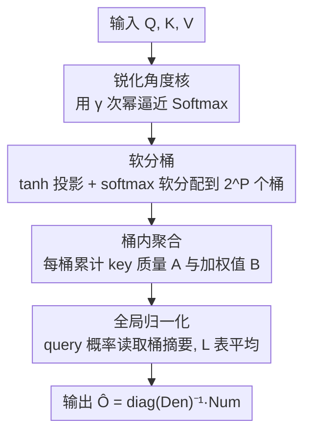

# RACE Attention: A Strictly Linear-Time Attention Layer for Training on Outrageously Large Contexts

**会议**: ICLR 2026  
**OpenReview**: [https://openreview.net/forum?id=RR8Lh8RHgA](https://openreview.net/forum?id=RR8Lh8RHgA)  
**代码**: https://github.com/sahiljoshi515/RACE_Attention  
**领域**: LLM效率  
**关键词**: 线性注意力, 局部敏感哈希, RACE草图, 长上下文, 角度核

## 一句话总结
本文用一个"锐化角度核 + 可微 LSH 草图（RACE）"替换 Softmax 注意力，把注意力做成在序列长度和嵌入维度上都**严格线性**的算子，从而在单层注意力上把单次前反向能处理的上下文从 FlashAttention 的约 400 万 token 推到 GPU 上 1200 万、CPU 上 7500 万 token，且在 64K 以内的真实任务上精度与强基线持平甚至更好。

## 研究背景与动机
**领域现状**：Transformer 是现代序列建模的骨架，而它的核心原语——Softmax 注意力——在序列长度 $N$ 上是二次复杂度 $O(N^2 d)$。即便是高度优化的精确实现 FlashAttention-2/3，靠 tiling 把注意力矩阵的显存降下来，但仍要算完所有 query-key 交互，时间上依旧是二次的。

**现有痛点**：作者给出一个很具体的"天花板"：在一块 96GB 的 NVIDIA GH200 上，对单层注意力（1 batch、4 头、嵌入维 128）做一次前向+反向，一旦上下文超过约 400 万 token，FlashAttention-2/3 就跑不完。要触达"离谱长上下文"（目标是上亿 token），靠工业界的大规模分布式硬件能缓解，但绝大多数研究者负担不起，必须从注意力机制本身重新设计。

**核心矛盾**：现有的线性/低秩近似（Linear Attention、Performer、Linformer、Nyströmformer 等）虽然把复杂度降下来了，却普遍存在三个问题——要么精度明显下降（如 Linear Attention 用 $\phi(x)=\text{elu}(x)+1$ 这类正特征映射，实验里精度掉得厉害），要么在嵌入维 $d$ 上引入二次开销（Performer 的随机傅里叶特征需要很高维才准），要么不支持自回归（因果）任务（Linformer / Nyströmformer 的长度维投影/landmark 无法做因果掩码），且大多缺乏一个把"效率旋钮↔精度"联系起来的严格理论框架，导致超参选择往往凭经验、跨任务不稳定。这也是为什么尽管近似方法层出不穷，Softmax 注意力仍是最被信任的选择。

**切入角度**：作者注意到，Softmax 之所以好用，关键在于指数把相似度做了**强非线性放大**，让注意力权重非负且归一化。那么只要找到一个同样"高度非线性、归一、且可被线性时间精确估计"的相似度核，就能替代 Softmax。他们选中了经典的**角度核**（只依赖 $Q_i$ 与 $K_j$ 的夹角、对范数不变），它天然是 LSH-able 的，可以用 RACE 草图做线性时间的核密度估计。

**核心 idea**：用"锐化角度核"近似 Softmax，并用**可微的软 LSH 桶**（soft RACE 草图）在不构造完整 $N\times N$ 注意力矩阵的前提下，直接估计注意力输出所需的充分统计量，得到一个在 $N$ 和 $d$ 上都线性、且支持端到端训练与因果建模的 drop-in 注意力层。

## 方法详解

### 整体框架
RACE Attention 是 Softmax 注意力的**即插即用替换**。它的核心转变是：不再为每个 query 显式计算它与全部 $N$ 个 key 的相似度，而是把所有 query/key 软分配到固定数量的 LSH 桶里，让每个 query 只与一个**固定规模的桶摘要库**（$S = LR$ 个桶统计量）交互，从而避免任何 $N^2$ 级别的中间量。

第一步，把 Softmax 的指数核换成**锐化角度核**：原始角度相似度 $\text{sim}(Q_i,K_j)=1-\cos^{-1}\!\big(\tfrac{Q_i^\top K_j}{\|Q_i\|\|K_j\|}\big)/\pi$ 在高相似区比较"平"，区分度不够，于是对它取 $\gamma$ 次幂来锐化：

$$\text{sim}(Q_i,K_j)=\Big(1-\cos^{-1}\big(\tfrac{Q_i^\top K_j}{\|Q_i\|\|K_j\|}\big)/\pi\Big)^{\gamma}$$

作者证明（图 2、图 3）只要 $\gamma$ 适中（如 $\gamma=8$），这个高次单项式就几乎与 Softmax 核无异（Frobenius 误差随 $\gamma$ 急剧下降）。但直接算这个核仍是二次的——它真正的价值在于：**任意整数次幂的角度核都属于可被 RACE 草图高效估计的核族**。

第二步，用 **soft RACE 草图**把这个核估计成线性时间。整个算子（Algorithm 1）分三个阶段串起来：软分桶 → 桶内聚合 → 全局归一化，并在 $L$ 张独立哈希表上取平均来降方差。下面这张图给出自上而下的数据流：

由于全程不物化 $N\times N$ 矩阵，工作集始终很小、激活显存大幅下降，这正是它能把上下文拉到千万/亿级的根本原因。

### 关键设计

**1. 锐化角度核：找一个能被线性估计、又像 Softmax 的相似度**

现有线性核（如 elu+1）之所以掉精度，是因为它们丢掉了 Softmax 那种"强非线性放大"。作者不去近似指数本身，而是换一个等效但"可哈希"的相似度：角度核。它只依赖夹角、对向量范数不变，且属于 LSH 的碰撞概率族。原始角度核在高相似区太平，于是对它取 $\gamma$ 次幂锐化（$x^{12}$ 这类高次单项式的形状已接近指数），用 $\gamma$ 这个旋钮就能逼近 Softmax 的锐度。关键在于：**$P$ 次幂的角度核恰好等于"用 $P$ 个随机超平面做 SimHash、两向量发生碰撞的概率"**，即 $\Pr[h(Q_i)=h(K_j)]=\text{sim}(Q_i,K_j)$，这把"算核"变成了"数碰撞"，为下一步的草图估计铺平道路。

**2. soft RACE 草图：用桶统计量代替完整注意力矩阵**

经典 RACE（Coleman & Shrivastava）的思路是：把数据点按 LSH 哈希进若干计数器（ACE 数组），query 来了只读它命中的那个桶，就能**无偏估计** $\sum_x k(x,q)^p$ 这类核密度和；在 $L$ 行独立哈希上平均可降方差。RACE Attention 把这一思路搬到注意力上：注意力输出 $O_i=\frac{\sum_j \text{sim}(Q_i,K_j)V_j}{\sum_j \text{sim}(Q_i,K_j)}$ 的分子分母都是核密度和，可以用桶统计量直接估计——为每张表维护质量向量 $A^{(\ell)}=(\Phi_K^{(\ell)})^\top \mathbf{1}_N\in\mathbb{R}^R$（每桶累计的 key 软质量）和值和矩阵 $B^{(\ell)}=(\Phi_K^{(\ell)})^\top V\in\mathbb{R}^{R\times d}$（每桶累计的加权值），然后用 query 的桶概率去读这些摘要：$\text{Num}=\frac1L\sum_\ell \Phi_Q^{(\ell)}B^{(\ell)}$、$\text{Den}=\frac1L\sum_\ell \Phi_Q^{(\ell)}A^{(\ell)}$，最终 $\hat O=\text{diag}(\text{Den})^{-1}\text{Num}$。因为每个 query 只和 $R$ 个桶交互、never 物化全矩阵，单表复杂度被压到 $O(NRd)$、显存 $O(NR+Rd)$，$L$ 表合计 $O(LNRd)$ 时间、$O(L(NR+Rd))$ 空间，而 $R,L\ll N$ 且 $R,L\ll d$。

**3. 可微软分桶：把离散哈希变成能反传梯度的软分配**

经典 RACE 用硬哈希 $h(x)=\text{sign}(W^{(\ell)}x)$，碰撞是离散事件，不可微，没法端到端训练（YOSO 就因此要靠额外 Bernoulli 采样做替代梯度，且在 $d$ 上退化成二次）。本文的破解是：保留几何结构、但把硬 sign 换成**软 sign**——先算 $\tanh(W^{(\ell)}x)$，再用一个温度为 $\beta$ 的 softmax 衡量它与 $R=2^P$ 个超立方体角点 $v_r\in\{\pm1\}^P$ 的对齐程度，得到桶分配分布：

$$[\phi^{(\ell)}(x)]_r=\frac{\exp\{\beta\,(\tanh(W^{(\ell)}x))^\top v_r\}}{\sum_{r'}\exp\{\beta\,(\tanh(W^{(\ell)}x))^\top v_{r'}\}}$$

这样离散碰撞事件就变成可微的连续量，同时保留了角度依赖性——夹角小的向量仍把大部分质量分到同一桶，模拟 $P$ 次幂角度核的行为。于是 $\phi^{(\ell)}(Q_i)^\top\phi^{(\ell)}(K_j)$ 成了 $P$ 次幂角度相似度的光滑近似，整条链路可端到端训练，且在 $d$ 上保持线性（与 YOSO 形成对比）。

**4. 单流前缀因果核：让线性注意力支持自回归**

低秩/landmark 类近似普遍不支持自回归任务，而 RACE 的桶聚合天然适合做**前缀累加**。作者用自定义 OpenMP/CUDA 核（Algorithm 2），把因果场景下"只聚合 $j\le i$ 的 key"实现成单次流式 pass 的前缀操作，从而在 CPU 和 GPU 上都能做线性时间、显存高效的因果（自回归）和双向（掩码）预训练。这一步是把"理论上的线性注意力"落成"真能训练 LM"的工程闭环。

### 损失函数 / 训练策略
方法本身是注意力层的替换，不改变外层训练目标；可微草图让标准交叉熵损失能直接反传到投影矩阵 $W^{(\ell)}$。训练时把温度 $\beta$ 设为**可学习参数**。理论上（Theorem 2，仅覆盖非因果设定）估计误差分解为偏差项 $O(P/\beta)$ 与方差项 $O(\sqrt{\log(N/\delta)/L})$：增大 $\beta$ 降偏差、增大 $L$ 降方差，且 $\beta$ 应随 $P$ 同步增大以抑制软分桶引入的额外偏差；取 $L=\Theta(\log N)$ 即可防止方差爆炸。因果设定的严格分析作者列为开放问题。

## 实验关键数据

### 主实验
在 A100 上的 Arxiv 长文档分类（per-epoch 训练/测试秒数 + 准确率）显示，RACE 在 64K 长度上既快又准：

| 方法 (64K) | 训练↓ | 测试↓ | 准确率↑ |
|--------|------|------|--------|
| RACE (P=3,L=3) | 584s | 22.5s | **97.92%** |
| RACE (P=2,L=2) | 561s | 22s | 97.14% |
| Linear | 591s | 22.8s | 96.35% |
| Performer-256 | 952s | 35s | 96.61% |
| FlashAttention2 | 1645s | 47s | 97.0% |

在 64K 上 RACE 训练耗时约为 FlashAttention2 的三分之一，精度还略高。跨任务对比（CIFAR-10@1024 / QNLI@2048 / Tiny Stories@1024 PPL）中 RACE (P=4,L=4) 拿到 65.9% / 61.1% / 2.6，与 FlashAttention2（61.4% / 61.1% / 2.7）持平或更好；自回归 LM 上 WikiText-103@1024 的 RACE (P=4,L=4) 达到 PPL 20.9，与 FlashAttention2 相同，PTB 上还更优。

### 极端长度缩放（核心卖点）

| 硬件 | RACE 上限 | FlashAttn 上限 | 加速比 |
|------|----------|---------------|--------|
| GH200 GPU (96GB) | **12M token** | ~4M token | 4M 时 ~5500× |
| Xeon 5220R CPU | **75M token** | ~2M 后极慢 | 33M 时 >10000× |

在 GH200 上 4M token 时 RACE 仅需约 0.1s，FlashAttention2 约 550s；CPU 上 RACE 跑 33M token 用时不到 10s（FlashAttention 约 105s）。甚至"CPU 上的 RACE vs GPU 上的 FlashAttention"——在 4M token 处 CPU-RACE 比 GPU-FlashAttention2 还快约 40×，印证了作者那句"算法对了，能赢过硬件加速"。

### 关键发现
- **桶参数 $(P,L)$ 控制精度-效率权衡**：$P$ 决定桶数 $R=2^P$（核的锐度），$L$ 是哈希表数（降方差）。多数任务 $P,L\in\{2,3,4\}$ 就够，且全程用与精度实验相同的超参做缩放测试，说明不是为缩放专门调参。
- **与 YOSO 的对比最能说明可微设计的价值**：YOSO 用硬 LSH + 替代梯度，在 $d$ 上二次、端到端训练扩展性差，其 CUDA 核在 32K token 后就因显存爆掉，而 RACE 能继续缩放到千万级。
- **线性注意力基线不仅不准还更慢**：Linear/Performer 因隐藏常数大，比 RACE 慢约一个数量级，并在约 33M token 时 OOM；Linformer 在 Food-101@16K 上准确率只有 20.2%，远低于 RACE。

## 亮点与洞察
- **"换核而非近似指数"是关键转念**：不去硬逼近 Softmax 的指数，而是换一个数学性质更友好（LSH-able）、锐化后又足够像 Softmax 的角度核——这让"线性时间精确估计"从不可能变可能，且带来可量化的近似误差界。
- **把注意力重写成核密度估计**：注意力输出分子分母都是核密度和，于是整个 $N^2$ 问题被转成"读固定数量桶摘要"，这是它在 $N$ 和 $d$ 上同时线性、并把激活显存压到 $O(L(NR+Rd))$ 的根本。
- **软分桶（tanh+softmax over corners）是一个可复用 trick**：任何需要把"离散 LSH 碰撞/路由"塞进可微网络的场景（MoE 路由、近似检索、稀疏注意力）都能借鉴这种"软 sign + 角点对齐 softmax"的可微松弛。
- **"算法 > 硬件"的实证**：CPU-RACE 在长上下文区间击败 GPU-FlashAttention，是对"长上下文瓶颈是算法的二次复杂度、而非硬件算力"这一论断的有力佐证。

## 局限与展望
- **理论只覆盖非因果**：Theorem 2 的偏差-方差界只对双向设定成立；因果版本（前缀累加与随机特征构造的相互作用）的严格分析作者明确列为开放问题，而 LM 实验用的恰恰是因果核。
- **缩放实验多为单层注意力**：千万/亿级 token 的极端缩放是在**单个注意力层**上做的前反向，端到端多层深网在同等长度上的真实训练表现仍需更多验证。
- **超参与近似带来的稳健性问题**：$P,L,\beta$ 三者联合决定精度-效率权衡，虽然作者给了理论指导（$\beta$ 随 $P$ 增、$L=\Theta(\log N)$），但软分桶的偏差在不同任务上是否一致可控仍是实践风险。
- **与结构稀疏正交但未融合**：作者把稀疏注意力视为互补方向，本文未做结合，二者联合可能进一步提升可扩展性。

## 相关工作与启发
- **vs YOSO**：两者用同一个角度核，但 YOSO 用硬 LSH 生成 Bernoulli 碰撞指示子、做事后 $\ell_2$ 归一（非标准注意力归一），不可微，靠替代梯度训练，导致在 $d$ 上二次、扩展性差且 32K 后 OOM；RACE 用可微软草图、标准注意力归一，在 $d$ 上线性、可端到端训练并支持因果，是对 YOSO 两大缺陷（无理论保证、不支持因果）的直接修补。
- **vs Linear Attention**：它用 $\phi(x)=\text{elu}(x)+1$ 把 softmax 换成正核做结合律重排实现线性，但丢了非线性放大、精度差；RACE 保留了角度核的强非线性锐度，精度更高。
- **vs Performer**：用随机傅里叶特征近似指数内积，但在嵌入维 $d$ 上二次、需要高维特征才准、扩展性差；RACE 在 $d$ 上严格线性。
- **vs Linformer / Nyströmformer**：用长度维投影或 landmark 做低秩近似，把 $O(N^2d)$ 降到 $O(Nkd)$，但需调大 $k$ 保精度、且**不支持自回归**；RACE 既准（在更少参数下超过多 13% 参数的 Linformer）又原生支持因果。
- **vs FlashAttention-2/3**：精确实现，靠 tiling 降显存但仍算全部 QK 交互、时间二次、激活显存 $O(BHNd)$ 在大 $N$ 时超出显存；RACE 把 Q/K 压成桶摘要、显存 $O(BHL(NR+Rd))$，支持比 FlashAttention 长约 3.5× 的上下文。

## 评分
- 新颖性: ⭐⭐⭐⭐⭐ 把可微 RACE 草图引入注意力，同时解决线性化、可微训练、因果支持、理论保证四件事，组合很新。
- 实验充分度: ⭐⭐⭐⭐ 覆盖分类/MLM/自回归 + 极端缩放且与 6 个强基线同台，但极端缩放多为单层、因果端到端验证偏少。
- 写作质量: ⭐⭐⭐⭐⭐ 从 Softmax 痛点到角度核到 RACE 草图的推导链条清晰，图 1 直观对比 $o_5$ 的计算差异。
- 价值: ⭐⭐⭐⭐⭐ 在普通硬件上把可训练上下文推到千万/亿级，对长上下文训练有很实际的工程意义。

<!-- RELATED:START -->

## 相关论文

- [\[ICLR 2026\] Log-Linear Attention](log-linear_attention.md)
- [\[ICLR 2026\] Local Linear Attention: An Optimal Interpolation of Linear and Softmax Attention for Test-Time Regression](local_linear_attention_an_optimal_interpolation_of_linear_and_softmax_attention_.md)
- [\[ICML 2026\] Dynamic Linear Attention](../../ICML2026/llm_efficiency/dynamic_linear_attention.md)
- [\[ICLR 2026\] FlexLinearAttention: Compiling a Unified Abstraction into Scalable Kernels for Linear Attention](flexlinearattention_compiling_a_unified_abstraction_into_scalable_kernels_for_li.md)
- [\[ICLR 2026\] Test-Time Training Done Right](test-time_training_done_right.md)

<!-- RELATED:END -->
