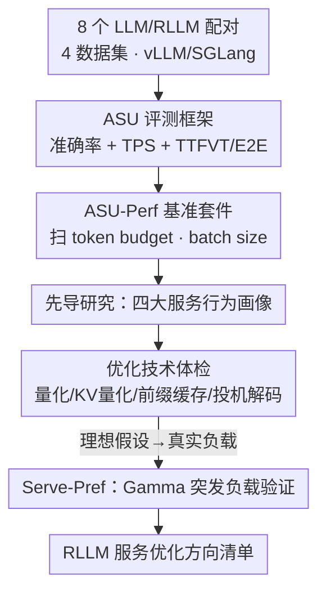

# Reasoning Language Model Inference Serving Unveiled: An Empirical Study

**会议**: ICLR 2026  
**OpenReview**: [https://openreview.net/forum?id=6CGjZYp6ft](https://openreview.net/forum?id=6CGjZYp6ft)  
**代码**: https://github.com/lqinfdim/RLMServing  
**领域**: LLM效率 / 推理服务 / 系统  
**关键词**: 推理大模型, 推理服务, KV Cache, 量化, 投机解码

## 一句话总结
这是第一篇系统刻画"推理大模型（RLLM）线上推理服务"行为的实证研究：作者提出 ASU 评测框架与 ASU-Perf 基准套件，发现 RLLM 相比普通 LLM 在服务侧存在四个显著差异（显存剧烈波动、掉队请求、运行时随难度自适应、领域偏好），并逐一检验了量化、KV Cache 量化、前缀缓存、投机解码这些为传统 LLM 设计的优化技术对 RLLM 还灵不灵。

## 研究背景与动机
**领域现状**：以 OpenAI o1、DeepSeek-R1、Qwen-3 为代表的推理大模型（RLLM）通过"长思维链 + test-time scaling"在数学、代码等 System-2 任务上大幅超越普通 LLM，甚至 1.5B 的开源 RLLM 在数学上能压过 GPT-4o。这让"小机构用有限 GPU 私有化部署一个中小 RLLM 当助手"变得现实可行。

**现有痛点**：但现有的推理服务引擎——vLLM、LMDeploy、TensorRT-LLM——都是为传统 LLM 设计的。RLLM 会在回答前生成大量"思考 token"，其服务侧行为是否与普通 LLM 不同、现有针对 LLM 的优化技术拿到 RLLM 上还有没有效，几乎没人系统研究过。直接照搬可能带来次优甚至反效果的服务表现。

**核心矛盾**：RLLM 的"长思维链"是它强的根源，却也是服务系统的负担——它把推理的计算/显存特征从 LLM 的"prefill 重、decode 轻、输出短"彻底改写成"decode 重、输出长且长度随难度剧烈变化"。现有引擎的批处理、KV Cache 管理、调度假设都建立在旧特征上。

**本文目标**：分解为三个子问题——(1) RLLM 和 LLM 的服务行为到底有没有本质差异？(2) 为传统 LLM 设计的推理优化技术（权重量化、KV Cache 量化、前缀缓存、投机解码）对 RLLM 还有效吗？(3) 这些发现在真实的、突发式的线上负载下是否依然成立？

**切入角度**：作者不发明新引擎，而是先建立一个能同时衡量"准确率 + 服务方指标 + 用户方指标"的评测框架，再用一套统一基准把 8 个不同规模的 LLM/RLLM 配对（如 Qwen-2.5-Math-7B ↔ DeepSeek-R1-Distill-Qwen-7B）放到 vLLM/SGLang 上跑大量对照实验，用运行 trace 反推现象成因。

**核心 idea**：用一个"准确率-服务端-用户端（ASU）"三位一体的评测框架 + 配对对照实验，第一次把 RLLM 的服务行为画像出来，并给出一份"哪些 LLM 优化技术能直接迁移、哪些会翻车"的实证清单。

## 方法详解
本文是实证研究（empirical study），没有提出新算法，"方法"指的是一整套评测方法论：评测框架（ASU）、基准套件（ASU-Perf / Serve-Pref）、配对对照的实验设计，以及由运行 trace 推导现象成因的分析方法。

### 整体框架
整体管线分三个阶段串行推进。第一阶段是**先导研究**：在统一的 ASU-Perf 基准下，把同规模的 LLM 与 RLLM 配成对照组（7B/14B/32B/70B 四个尺度），在 vLLM/SGLang 两种引擎上扫不同 token budget 与 batch size，记录运行 trace，提炼出 RLLM 区别于 LLM 的四大服务行为。第二阶段是**优化技术体检**：在"必须基本保住准确率"的前提下，逐一检验四类经典 LLM 优化（权重量化、KV Cache 量化、前缀缓存、投机解码）搬到 RLLM 上的得失。第三阶段是**真实负载验证**：把"请求成批同时到达"的理想假设换成用 Gamma 分布建模的突发式流式负载，看先导研究的发现是否依旧成立。三个阶段共享同一套 ASU 指标，保证结论可比。

### 关键设计

**1. ASU 三位一体评测框架：把"值不值得部署"拆成准确率、服务端、用户端一起看**

RLLM 的价值在于"产出的价值能否盖过它高昂的推理成本"，单看吞吐或单看准确率都会误导。作者提出 ASU（Accuracy, Service-end, User-end）框架，强制三类指标同时成立才算"好服务"。准确率用各数据集自带的评测指标；服务方关心吞吐，用 TPS（每秒输出 token 数）；用户方关心响应速度，这里有个关键改动——用 **TTFVT（time to first visible token，首个可见 token 时间）** 替代传统的 TTFT，因为像 o1 那样商用 RLLM 的"思考 token"对用户不可见，用户真正等待的是思考结束后第一个答案 token，再配合 E2E 端到端运行时一起衡量。这个框架的意义在于：很多优化技术（如投机解码）会改善某个指标却恶化另一个，只有三端并看才能暴露 trade-off，而不会被单一数字骗到。

**2. ASU-Perf / Serve-Pref 基准套件 + 配对对照实验设计：让"RLLM vs LLM 差异"可被干净归因**

要回答"差异是否本质"，关键是排除"模型本身不同"这个混淆变量。作者的设计是**配对（tuned counterpart）对照**：每个 RLLM 都取自对应 LLM 的长思维链微调版本（如 Qwen-2.5-Math-7B 配 DeepSeek-R1-Distill-Qwen-7B），同尺度、同引擎、同 batch size、同 token budget 下直接对比，差异就只能归到"推理范式"上。基准侧用自研的 ASU-Perf 套件统一驱动 vLLM/SGLang，系统扫描 token budget（0.25K~20K）和 batch size 两个维度；数据集按难度铺开——GSM8K（易）、MATH-500（中）、AIME-2024（最难）覆盖数学难度梯度，再加 GPQA 区分"数学推理 vs 知识推理"。第三阶段的 **Serve-Pref** 套件仿照 BurstGPT-Perf，用 Gamma 分布生成流式、随机、突发的请求，把理想批处理换成真实负载。这套设计的价值是：现象不是个例，而是在多尺度、多数据集、多引擎、两种负载模型下交叉验证过的。

**3. 由运行 trace 反推成因的分析方法：把"四大现象"落到引擎机制上**

光报告"RLLM 显存抖、有掉队请求"还不够，作者进一步分析推理引擎的运行日志与 trace，把现象与引擎机制对上号，给出可操作的解释。**显存波动**：RLLM 输出 token 远多于 LLM，KV Cache 占用快速攀升，极端情况下在 3%~70% 间剧烈摆动（LLM 通常低于 3%），而现有引擎在请求完成后立刻丢弃 KV Cache，导致占用骤降——抖动的根因是"超长思维链 + 完成即释放"的管理策略。**掉队请求（straggler）**：一批请求里难题少数、易题多数，作者假设"一批全部完成才发下一批"，于是易题早早答完、少数难题继续占着引擎，整批运行时被拖长，期间只剩少量请求在跑，系统吞吐和硬件利用率明显下滑。**自适应运行时**：RLLM 的思维链长度随题目难度变化，运行时与难度强相关；而 LLM 运行时基本只随样本数线性增长、对难度不敏感。**领域偏好**：RLLM 在数学推理上显著强于同规模 LLM，但在知识密集型（GPQA）上只是持平。这套"现象→机制"的归因，正是后面给出优化方向（更细粒度的 KV 生命周期管理、难度感知调度、非对称 prefill-decode 资源分配、KV 访问优化的软硬件协同）的依据。

### 一个例子：一批 MATH-500 请求在引擎里发生了什么
以 7B 模型处理一批 MATH-500 请求为例（Figure 2 的 trace）。请求成批同时到达，易题先在几秒内答完并释放 KV Cache，于是 KV 占用先冲高、再随易题完成骤降，曲线剧烈起伏；与此同时少数难题继续生成长思维链，成为掉队请求，把整批 E2E 时间从十几秒拖到二十多秒，这段时间引擎里只剩三五个请求在跑，吞吐被拉低。同一批换成同尺度 LLM，则 KV 占用平稳在 3% 以下、各请求运行时接近、几乎没有长尾。这个例子把"显存波动 + 掉队请求 + 自适应运行时"三个现象在一次 trace 里同时具象化了。

## 实验关键数据

### 先导研究：RLLM vs LLM 的四大差异

| 维度 | LLM 行为 | RLLM 行为 |
|------|----------|-----------|
| KV Cache 占用 | 通常 < 3%，平稳 | 3%~70% 剧烈波动；真实负载下可长期接近 100% |
| 请求运行时分布 | 同批内差异小 | 长尾，少数难题成 straggler 拖长整批 |
| 运行时 vs 难度 | 基本只随样本数线性增长 | 与题目难度强相关（思维链越长越久） |
| 领域表现 | 数学弱、知识持平 | 数学显著更强、知识（GPQA）持平 |

token budget 实验还发现：多数数据集 4096~8192 budget 已足够好；但 budget 继续加大时，GPQA 和 AIME24 的准确率反而下降，疑似"overthinking"。增大 batch size 不影响准确率、能缩短总处理时间并提升 TPS，但代价是平均 TTFVT 升高。

### 优化技术体检（保准确率前提下）

| 技术 | 对 RLLM 服务的净效果 | 关键 caveat |
|------|----------------------|-------------|
| 权重量化 MWQ | GPTQ-Int4 / FP8 基本保性能（约 ±3%）且省显存、服务指标持平或更好 | GPTQ 在 AIME24 等难题掉 15~25%；AWQ / Linear-4bit 保性能却让 E2E 近乎翻倍、吞吐减半 |
| KV Cache 量化（FP8-E5M2/E4M3） | 14B/32B 上提速且基本保性能，TTFVT、TPS 也改善 | 7B 上性能几乎崩溃，疑为模型架构与引擎兼容性问题 |
| 前缀缓存 PC | ≥14B 的 RLLM 显著提速、不掉性能 | < 8B 小模型（LLM/RLLM 都）反而增大延迟；单轮对话无前缀复用，hash 计算成净开销 |
| 投机解码 SD（n-gram） | 各尺度运行时都缩短、不掉准确率 | 显著降低 TPS、恶化 TTFVT |

### 真实负载验证（Gamma 分布）
- 真实突发负载下，RLLM 的平均 KV Cache 占用远高于 LLM，且可长期接近 100%，逼得新请求在等待队列排队，严重拉长请求周转时间——作者归因于大量 straggler 在系统里堆积。
- 引擎内同时运行的请求数，RLLM 也明显多于 LLM；上述现象在不同数据集上一致成立，验证了先导研究发现的普适性。

### 关键发现
- 很多 LLM 优化技术能"无缝直接迁移"到 RLLM，但同一技术在小模型（尤其 7B）上常出现相反效果（KV 量化崩、前缀缓存反增延迟）——小模型是 RLLM 服务优化的高危区。
- 几乎每个优化都是"按下葫芦浮起瓢"：投机解码换来运行时却牺牲吞吐和首 token 时间，这正是 ASU 三端并看的价值所在。

## 亮点与洞察
- **TTFVT 这个指标改得巧**：把"思考 token 不可见"这一商用 RLLM 的真实交互形态写进评测，避免了用传统 TTFT 高估用户体验——一个小改动却让指标真正贴合 RLLM 的用户感受。
- **配对对照是干净归因的关键**：用同一 LLM 的长思维链微调版本作 RLLM，把"差异来自推理范式"和"差异来自模型不同"彻底分开，这个实验设计思路可复用到任何"范式 A vs 范式 B"的系统对照研究。
- **"现象→引擎机制→优化方向"的闭环**：从 trace 反推出显存抖动来自"完成即释放 KV"、掉队来自"整批同步发车"，再顺势给出难度感知调度、非对称 prefill-decode 分配等方向，给做 RLLM 专用引擎的人一份现成的需求清单。

## 局限与展望
- 作者承认：小模型上优化技术翻车（如 7B 的 KV 量化崩溃）的根因（架构-引擎兼容性）只是假设，未深入定位，留作 future work。
- 先导研究的"整批同步发车"是理想假设；虽然第六节用 Gamma 负载补了真实场景，但优化技术体检（第五节）大多仍在理想批处理下做，真实负载下这些技术的得失边界还需补全。
- 评测局限在数学为主的推理任务 + 少量知识推理（GPQA），代码、长程规划等 RLLM 强项未覆盖；模型也集中在 DeepSeek-R1-Distill 系列，对其他 RLLM 家族的泛化性待验证。
- 本文只诊断不修复——给出了优化方向却没实现 RLLM 专用引擎，把"难度感知调度 / 自适应 KV 生命周期管理 / 非对称资源分配"落地是最自然的后续。

## 相关工作与启发
- **vs vLLM / DistServe 等 LLM 服务引擎**: 它们为传统 LLM 优化 KV 管理（PagedAttention）和 prefill-decode 分离；本文不造引擎，而是揭示这些为 LLM 调好的机制在 RLLM 长思维链负载下会失配，给出"哪些能直接用、哪些会翻车"的实证地图。
- **vs LLM 服务基准（如 Etalon / BurstGPT-Perf）**: 它们面向通用 LLM 服务评测；本文的 ASU-Perf/Serve-Pref 专为 RLLM 设计，引入 TTFVT 等贴合"不可见思考 token"的指标，并把数据集按难度梯度铺开以暴露自适应运行时与掉队现象。
- **vs overthinking / test-time scaling 研究**: 那些工作从算法侧研究"该不该多想"；本文从服务侧补上"多想在系统里的代价"——token budget 加大反而掉点、显存与吞吐如何被长思维链拖垮，是对同一现象的系统视角补充。

## 评分
- 新颖性: ⭐⭐⭐⭐ 第一篇系统刻画 RLLM 服务行为并体检优化技术的实证研究，问题切口新但不含新算法。
- 实验充分度: ⭐⭐⭐⭐⭐ 4 尺度 × 8 模型 × 4 数据集 × 2 引擎 × 理想/真实两种负载，覆盖面扎实。
- 写作质量: ⭐⭐⭐⭐ 结构清晰、findings 与成因对应工整，少量笔误。
- 价值: ⭐⭐⭐⭐⭐ 给做 RLLM 推理引擎和私有化部署的人一份可直接照用的行为画像与优化清单。

<!-- RELATED:START -->

## 相关论文

- [\[ICLR 2026\] FlashDLM: Accelerating Diffusion Language Model Inference via Efficient KV Caching and Guided Diffusion](flashdlm_accelerating_diffusion_language_model_inference_via_efficient_kv_cachin.md)
- [\[ICLR 2026\] Inference-Cost-Aware Dynamic Tree Construction for Efficient Inference in Large Language Models](inference-cost-aware_dynamic_tree_construction_for_efficient_inference_in_large_.md)
- [\[ICLR 2026\] DiffAdapt: Difficulty-Adaptive Reasoning for Token-Efficient LLM Inference](diffadapt_difficulty-adaptive_reasoning_for_token-efficient_llm_inference.md)
- [\[ICLR 2026\] Universal Model Routing for Efficient LLM Inference](universal_model_routing_for_efficient_llm_inference.md)
- [\[ICLR 2026\] Cartridges: Lightweight and General-Purpose Long Context Representations via Self-Study](cartridges_lightweight_and_general-purpose_long_context_representations_via_self.md)

<!-- RELATED:END -->
