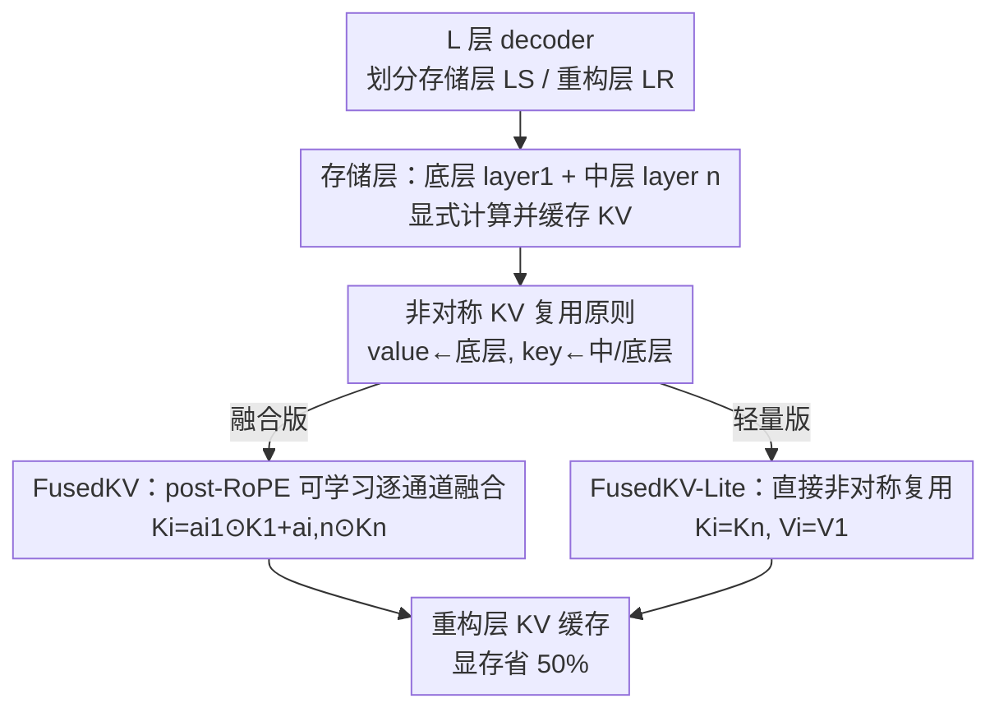

# Reconstructing KV Caches with Cross-Layer Fusion for Enhanced Transformers

**会议**: ICLR 2026  
**OpenReview**: [https://openreview.net/forum?id=4pivvEJiCl](https://openreview.net/forum?id=4pivvEJiCl)  
**代码**: https://github.com/LivingFutureLab/FusedKV  
**领域**: LLM效率  
**关键词**: KV Cache、跨层共享、键值非对称、RoPE 兼容、长上下文推理

## 一句话总结
针对跨层 KV cache 共享（如 YOCO、CLA）一直打不过层内方法（GQA）的问题，本文发现了"键值非对称"现象——顶层的 value 主要来自底层、key 主要来自底层和中层，据此提出 FusedKV（在 post-RoPE key 上做可学习逐通道融合）及其轻量版 FusedKV-Lite（直接非对称复用），在 332M–4B 模型上把 KV cache 显存砍掉 50%，同时困惑度还低于满缓存的标准 Transformer。

## 研究背景与动机

**领域现状**：自回归生成中，KV cache 的显存随序列长度线性增长，是长上下文推理的主要瓶颈。压缩思路分两类：层内（within-layer）如 GQA/MQA 让多个 query head 共享一组 KV head、MLA 用低秩压缩；跨层（cross-layer）如 CLA 在相邻层间共享 KV、YOCO 让上半部分层复用中间层的 cache。

**现有痛点**：跨层共享在显存上很诱人（直接省掉一半层的 KV），但实际效果一直**稳定地差于层内方法**。也就是说，把上半层的 KV 直接挪用下半层的，模型性能会掉，这让跨层共享方向看起来"省了显存但不划算"。

**核心矛盾**：现有跨层方法（YOCO、CLA）本质都是**直接整块复用**单一源层的 KV——重构层 $i$ 的 $(K_i, V_i)$ 直接等于某个源层 $(K_{\phi(i)}, V_{\phi(i)})$。这种粗暴复用既没区分 key 和 value 各自需要什么信息，也容易导致共享层"表征坍塌"，丢掉了层特异性的贡献。

**切入角度**：作者做了一个"密集融合"探针实验——在一个 16 层、1B 的模型上，让顶部 8 层的 cache 用一个可学习标量去融合**所有**底层 cache，结果训练损失反而低于 vanilla，说明顶层 KV 确实能被早期层有效重构。更关键的是，画出融合权重后发现一个清晰的**非对称**：value 的重构权重几乎集中在最底层（0–1 层），而 key 的权重更分散、集中在中间层（6–7 层）。

**核心 idea**：既然 key 和 value 对源层的偏好不同，就别再用对称的整块复用，而是**按非对称原则、逐通道加权地从底层和中层融合出顶层 KV**——value 偏底层、key 偏中层。

## 方法详解

### 整体框架
FusedKV 把 $L$ 层 decoder 划成两个不相交子集：**存储层**（$\mathcal{L}_S$，KV 真正算出来并缓存）和**重构层**（$\mathcal{L}_R$，KV 不存、推理时按需重构）。对任意重构层 $i \in \mathcal{L}_R$，其 $K_i, V_i \in \mathbb{R}^{s \times d}$ 由一个参数化重构函数 $\mathcal{F}_i$ 从若干源存储层的 cache 生成：

$$(K_i, V_i) = \mathcal{F}_i\big(\{(K_j, V_j) \mid j \in \Phi(i)\}; \theta_i\big)$$

其中 $\Phi(i)$ 是**源层映射函数**，指定哪些存储层为重构层 $i$ 供料。YOCO/CLA 是这个框架下 $\mathcal{F}$ 取"直接选择器"（$|\Phi(i)|=1$）的特例；本文则让 $\mathcal{F}$ 取"逐通道加权融合"，并据非对称原则配置 $\Phi(i)$——存储层固定为底层（layer 1）和中层（layer n），重构层为上半部分（$i > n$）。整条管线只在前向时为重构层做一次轻量重构，就把这些层的 KV 显存省掉。

### 关键设计

**1. 非对称键值复用原则：value 偏底层、key 偏中层**

这是全文的地基观察，针对"跨层共享为什么打不过层内方法"这个痛点。作者在密集融合探针里画出顶层（10–15 层）重构 cache 时对各源层的融合权重，发现 value 与 key 的偏好截然不同：**value 的权重几乎全压在最底层 0–1**，而 **key 的权重更弥散、但集中在中间层 6–7**。直觉解释是，value 携带的是更基础、词级别的内容信息（底层就已编码好），而 key 决定注意力的"匹配模式"，需要更抽象、上下文化的中层表征。

正因为这种非对称，本文的所有重构都不再"key、value 一起从同一源层整块搬"，而是让 value 取底层（layer 1）、key 取中层（layer n）。消融里的反向版 FusedKV-Lite-Rev（$K_i = K_1, V_i = V_8$）验证了方向不能反：反着配会让验证损失明显升高、下游精度同步下降。这条原则是后面两个具体方法的共同前提。

**2. FusedKV：在 post-RoPE key 上做可学习逐通道融合**

直接整块复用（YOCO/CLA）会让共享层表征坍塌，限制各层的独立贡献。FusedKV 改用更具表达力的**逐通道加权融合**：对重构层 $i > n$，从底层和中层两个高信息源做 Hadamard 加权组合

$$K_i = a_{i,1} \odot K_1 + a_{i,n} \odot K_n, \qquad V_i = b_{i,1} \odot V_1 + b_{i,n} \odot V_n$$

权重 $a_{ij}, b_{ij}$ 是可学习向量，按通道对每个源层的特征做"门控"再聚合，让每个重构层能自适应地把底层的基础特征和中层的上下文特征按需混合，而不是一刀切地照搬某一层。

这里的难点是 **RoPE 兼容性**：如果直接在已经施加了旋转位置编码的 key 上做带权融合，会不会破坏 RoPE 的相对位置性质？作者对加了权重向量 $w_j = [w_{2j}, w_{2j+1}]^T$ 后的注意力分数做分解，发现当 $w_{2j} \neq w_{2j+1}$ 时，分数会变成相对位置项（依赖 $m-n$）和绝对位置项（依赖 $m+n$）的混合，污染相对位置编码。解决办法是**强制每个 2D 通道对内权重相等**（$w_{2j} = w_{2j+1}$，即 2D 对角约束）；在此约束下，多个 post-RoPE key 的加权融合 $\tilde{q}_m^T \tilde{k}_s = \sum_i \tilde{q}_m^T (w_n^i \odot \tilde{k}_n^i)$ 每一项都只依赖内容和相对位置 $m-n$，线性组合后仍然只依赖相对位置。这意味着存储层可以**保留原始的 post-RoPE KV**，推理时无需重新施加 RoPE，省掉重算开销。

**3. FusedKV-Lite：直接非对称复用，几乎零融合 I/O**

FusedKV 的融合需要同时读底层和中层两份 cache，带来额外的访存（I/O）成本，在访存受限场景下不划算。FusedKV-Lite 把融合退化成最省的**单源直接复用**——按非对称原则，key 直接复用中层、value 直接复用底层：

$$K_i = K_n, \qquad V_i = V_1, \qquad i > n$$

因为每个重构层只读一份 key、一份 value，不做加权聚合，FusedKV-Lite 的 cache I/O 与 vanilla 几乎持平，对访存受限的解码尤其友好。代价是表达力比 FusedKV 弱一点、困惑度略高，是一个"显存与精度都接近 vanilla、但 I/O 开销最小"的折中档。消融里的 FusedKV-Lite-Learnable（给单源复用再加一个逐通道可学习缩放 $K_i = a_{i8} \odot K_8, V_i = b_{i1} \odot V_1$）进一步表明，哪怕只是轻量地让通道权重可学，也能在 WikiText/LAMBADA/HellaSwag 上稳定优于固定权重的 Lite 版。

### 损失函数 / 训练策略
方法不引入额外损失项，直接按标准语言建模目标端到端预训练。实验用 Qwen3 架构的稠密模型（332M/650M/1.5B/4B），词表 128k、上下文 8192、16 个注意力头，在 FineWeb-Edu 上训练；AdamW（$\beta_1=0.9, \beta_2=0.95$），余弦学习率（warmup 2000 步，峰值 $3\times10^{-4}$ 衰减到 $3\times10^{-5}$）。作者还为 FusedKV 算子实现了 Triton kernel 以落地实际加速。

## 实验关键数据

### 主实验
1.5B 模型上各 KV 压缩方法对比（cache 显存均为满缓存的 1/2，下游为 7 项五样本任务均值）：

| 方法 | Cache Mem ↓ | Valid Loss ↓ | WikiText PPL ↓ | Avg Acc ↑ |
|------|------|------|------|------|
| Vanilla（满缓存） | 1 | 2.241 | 13.67 | 54.55 |
| CLA | 1/2 | 2.258 | 14.19 | 53.91 |
| YOCO | 1/2 | 2.244 | 13.65 | 54.19 |
| GQA | 1/2 | 2.245 | 13.74 | 54.58 |
| **FusedKV-Lite** | 1/2 | 2.225 | 13.45 | 55.30 |
| **FusedKV** | 1/2 | **2.221** | **13.33** | **55.82** |

要点：FusedKV 在仅用一半 cache 的情况下，验证损失、WikiText 困惑度、下游平均精度全面优于**满缓存**的 vanilla，也优于同样省一半的 YOCO/GQA/CLA。4B 模型上同样成立：FusedKV 验证损失 1.978 vs vanilla 2.002、下游均值 60.01 vs 59.07。Figure 1 还显示 FusedKV 收敛比 vanilla 快约 1.26×。

效率（相对 MHA 归一化）：

| 指标 | FusedKV | FusedKV-Lite |
|------|---------|--------------|
| 注意力吞吐 | 比 MHA 低约 28.4%（多一份融合 I/O） | 与 MHA 持平 |
| TTFT（8k+ 预填充） | 约降 50% | 约降 50% |
| TPOT（访存受限） | 约 1.5× vanilla | 与 baseline 持平 |
| TPOT（计算受限 GQA 128q/2kv） | 与 baseline 持平 | 与 baseline 持平 |

复杂度上 FusedKV-Lite 的 cache 显存和 I/O 都与 YOCO 同级（$L S H_{kv} D$ 显存、$2 L S H_{kv} D$ I/O）；FusedKV 显存相同，但因融合多一份读取，I/O 升到 $3 L S H_{kv} D$。

### 消融实验

| 配置 | 关键结论 | 说明 |
|------|---------|------|
| FusedKV-Lite | 基准 | $K_i=K_8, V_i=V_1$（key 取中层、value 取底层） |
| FusedKV-Lite-Rev | 验证损失明显升高、下游精度同步下降 | 反向配（$K_i=K_1, V_i=V_8$）→ 证明非对称方向不能反 |
| FusedKV-Lite-Learnable | 优于固定权重 Lite（WikiText/LAMBADA/HellaSwag） | 给单源复用加逐通道可学习缩放 |

### 关键发现
- **方向性是关键**：把"key 取中层、value 取底层"反过来配，性能大幅退化，直接坐实了非对称原则的核心论断——后层的 Key 与前层的 Value 才是重构顶层 cache 最有用的信息。
- **可学习权重稳定加分**：从固定复用 → 逐通道可学习缩放 → 双源加权融合，表达力递增，下游精度也递增。
- **梯度视角解释了"为什么更好"**：FusedKV/Lite 在浅层（如第 1、5 层）的梯度 L2 范数显著大于 baseline，意味着早期层被更充分地训练；跨层融合相当于给底层提供了更强的梯度信号，加速了基础表征的学习。
- **正交可组合**：FusedKV/Lite 与 MLA、GQA、MoE、SWA 基本正交，常能叠加出协同收益（如 FusedKV+GQA 实现 4× cache 压缩并显著提速）。

## 亮点与洞察
- **"先做探针、再据现象设计"的范式很干净**：不是拍脑袋设计融合结构，而是先用密集融合实验把"哪层的信息有用"画出来，发现 key/value 非对称这个被忽视的现象，再据此精确配置源层。结论可解释、可复现。
- **post-RoPE 融合 + 对称权重约束**很巧妙：直接在旋转后的 key 上融合本会破坏相对位置编码，作者用一条简单的 $w_{2j}=w_{2j+1}$ 约束就保住了相对位置性质，从而避免推理时重算 RoPE，是性能与正确性兼得的细节。
- **同一框架下给出两档**：FusedKV（精度优先、I/O 略高）与 FusedKV-Lite（I/O 优先、与 vanilla 同级），让使用者按访存/计算受限场景选档，工程落地性强（还配了 Triton kernel）。
- 可迁移思路：跨层/跨模块复用时，**区分不同张量（key vs value、甚至 query/gate）对源的偏好**，而非对称整块共享，可能是个普适的省显存方向。

## 局限与展望
- FusedKV 的注意力吞吐比 MHA 低约 28.4%、访存受限下 TPOT 约 1.5×，融合带来的额外 I/O 在纯访存受限场景仍是真实代价；想完全避开就得退到 Lite 版、牺牲一点精度。
- 非对称的"底层 value / 中层 key"结论来自特定规模与 Qwen3 风格架构的观测，源层位置（哪一层算"中层 n"）如何随深度/任务自适应选取，论文未深入；不同架构下最优源层是否漂移值得验证。
- 在 332M/650M 小模型上，MMLU、ARC-C 等难任务的绝对精度仍接近随机水平，方法的相对优势在更大模型（1.5B/4B）上才更明显，小模型上的结论解释力有限。
- 主要在稠密预训练 + 五样本评测下验证，超长上下文（128k/256k）虽有附录结果，但对检索类长程依赖任务的影响仍可进一步压力测试。

## 相关工作与启发
- **vs YOCO / CLA（直接复用）**: 二者都是 $|\Phi(i)|=1$ 的整块单源复用，key 和 value 不加区分。本文指出这正是跨层共享掉点的根因，改用非对称 + 逐通道加权融合，从而在同样 50% 显存下反超满缓存 vanilla。
- **vs GQA / MQA / MLA（层内压缩）**: 它们在层内让 head 共享或低秩压缩 KV。本文是正交的跨层方向，且实验表明可与 GQA/MLA 组合叠加（如 FusedKV+GQA 实现 4× 压缩），不是替代而是互补。
- **vs 密集融合探针**: 探针证明顶层 cache 可被全部底层融合重构，但代价高；FusedKV 是其"稀疏化 + 非对称化"的实用版，只取底层和中层两个最有信息量的源。

## 评分
- 新颖性: ⭐⭐⭐⭐ 揭示并利用了被忽视的键值非对称现象，post-RoPE 融合的对称约束也有巧思
- 实验充分度: ⭐⭐⭐⭐⭐ 332M–4B 四个规模 + 多基线 + 复杂度/吞吐/TTFT/TPOT/梯度/可组合性全覆盖
- 写作质量: ⭐⭐⭐⭐ 现象→设计→验证逻辑清晰，公式与图示充分
- 价值: ⭐⭐⭐⭐ 在不掉点甚至涨点的前提下省 50% KV 显存，且工程可落地、可与现有压缩正交叠加

<!-- RELATED:START -->

## 相关论文

- [\[ICLR 2026\] ReST-KV: Robust KV Cache Eviction with Layer-wise Output Reconstruction and Spatial-Temporal Smoothing](rest-kv_robust_kv_cache_eviction_with_layer-wise_output_reconstruction_and_spati.md)
- [\[ICLR 2026\] CR-Net: Scaling Parameter-Efficient Training with Cross-Layer Low-Rank Structure](cr-net_scaling_parameter-efficient_training_with_cross-layer_low-rank_structure.md)
- [\[ICLR 2026\] STEM: Scaling Transformers with Embedding Modules](stem_scaling_transformers_with_embedding_modules.md)
- [\[ICLR 2026\] QuoKA: Query-Oriented KV Selection for Efficient LLM Prefill](quoka_query-oriented_kv_selection_for_efficient_llm_prefill.md)
- [\[ICLR 2026\] FlashDLM: Accelerating Diffusion Language Model Inference via Efficient KV Caching and Guided Diffusion](flashdlm_accelerating_diffusion_language_model_inference_via_efficient_kv_cachin.md)

<!-- RELATED:END -->
