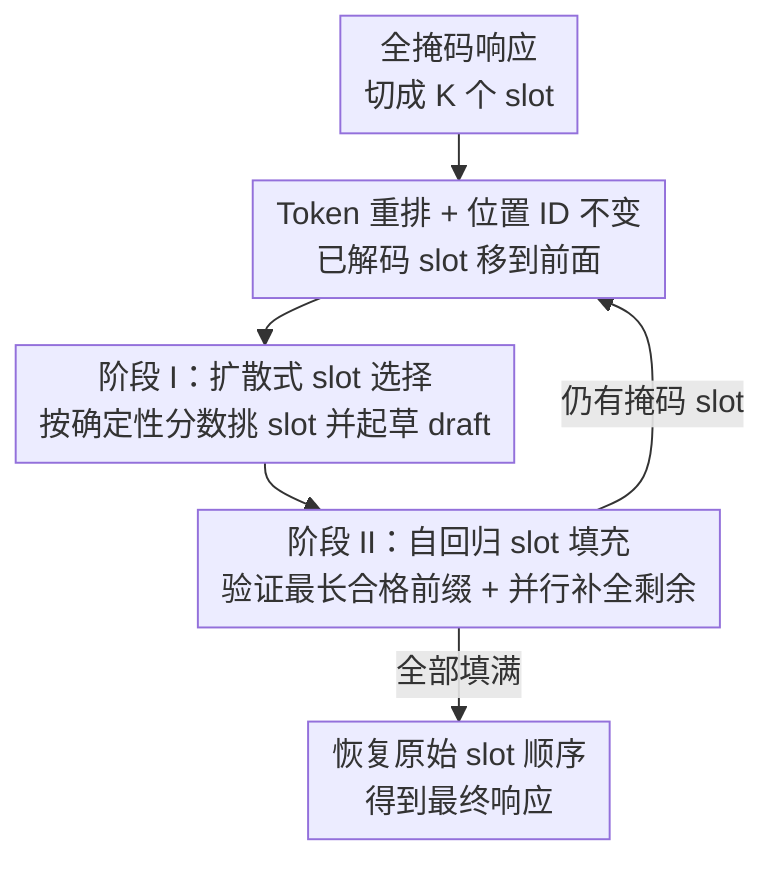

# ReFusion: A Diffusion Large Language Model with Parallel Autoregressive Decoding

**会议**: ICLR 2026  
**OpenReview**: [https://openreview.net/forum?id=LBtWaUc7FE](https://openreview.net/forum?id=LBtWaUc7FE)  
**代码**: https://github.com/ML-GSAI/ReFusion  
**模型**: https://huggingface.co/GSAI-ML/ReFusion  
**领域**: LLM效率 / 扩散语言模型  
**关键词**: 掩码扩散模型, 并行解码, KV缓存复用, 序列重组, 自回归填充

## 一句话总结
ReFusion 把掩码扩散语言模型的并行解码从 token 级抬升到 slot（多 token 片段）级——slot 之间用扩散方式并行挑选、slot 内部用自回归串行填充，并在每步把已生成 slot 重排到掩码 slot 前面，从而同时拿到完整 KV 缓存复用和可控的学习复杂度，相比此前扩散模型平均提升 34% 性能、加速 18×，还在保持 2.33× 速度优势的同时逼近甚至超过强自回归模型。

## 研究背景与动机
**领域现状**：自回归模型（ARM，如 Llama-3、Qwen3）靠严格的左到右逐 token 解码取得了广泛成功，但推理吞吐被这种串行过程死死卡住，生成长度越长延迟越高。掩码扩散模型（MDM，如 LLaDA、Dream）则用「加掩码—去噪」的迭代方式生成，没有固定生成顺序，理论上能并行解码、还可能发现比左到右更优的生成轨迹，被视为有希望的替代路线。

**现有痛点**：MDM 的两个理论优势在实践中都被架构和训练问题抵消了。其一是**架构瓶颈吃掉了并行收益**：灵活的生成顺序要求双向注意力，而双向注意力和 ARM 赖以提速的 KV 缓存天然不兼容，导致每步解码都要重算整段上下文的 KV 状态，单步开销极大，结果 MDM 反而比 ARM 更慢。其二是**学习复杂度过高导致并行生成不连贯**：MDM 默认同时解码多个边际概率高的 token，并假设它们条件独立，但这个假设对邻近 token 经常失效——比如上下文里「at once」和「right now」都成立时，独立采样可能拼出「right once」这种边际概率高、联合概率低的错误输出。

**核心矛盾**：要建模一个指数级 token 组合空间上的数据分布，远比 ARM 的固定序列依赖困难，于是现有 MDM 长期欠训练，难以可靠地识别哪些 token 真正条件独立；而要换回因果注意力拿 KV 缓存，又会陷入 token 级排列这个同样棘手的学习目标（如 Eso-LMs），性能大幅下滑。

**本文目标**：在不牺牲全局生成灵活性的前提下，同时做到①完整 KV 缓存复用；②把学习目标压回到可处理的复杂度。

**切入角度**：作者的关键观察是「条件独立假设在邻近 token 处崩得最厉害，且依赖强度随相对距离快速衰减」。既然近距离 token 强依赖、远距离 token 才近似独立，那就不该在 token 级别做并行，而应该把相邻 token 打包成一个单元串行处理，只在单元之间做并行。

**核心 idea**：用「slot（定长连续子序列）」替换「token」作为并行粒度——slot 间用扩散方式并行选择、slot 内用自回归串行填充，再配合把已生成 slot 重排到前面的序列重组，既复用 KV 缓存，又把指数级 token 组合空间换成可控的 slot 排列空间。

## 方法详解

### 整体框架
ReFusion 的骨架是一个标准因果注意力的 Transformer（从 Qwen3-8B 初始化），推理时却像 MDM 一样做全局位置灵活的解码。它把响应切成 $K$ 个长度为 $k$ 的连续 slot，从全掩码序列出发，反复执行一个 slot 级的「选择—填充」循环：**阶段 I 用扩散方式挑出当前最该解码的若干 slot 并起草（draft）**，**阶段 II 用自回归方式验证并补全这些 slot**，每轮结束后把新生成的 slot 重排到剩余掩码 slot 前面，使已解码 token 始终连续排在序列开头，从而每步都能复用完整 KV 缓存。训练则镜像这套推理动态：随机掩码若干 slot、打乱干净 slot、按「干净 slot 在前、掩码 slot 在后」重排输入，用一个同时监督选择能力（自回归损失）和填充能力（去噪损失）的混合目标优化。整套设计的两个核心收益是**完整 KV 缓存复用**与**学习复杂度从 token 组合空间降到 slot 排列空间**。

### 关键设计

**1. Token 重排 + 位置不变注意力：用因果注意力拿到完整 KV 缓存**

这一设计针对「双向注意力和 KV 缓存不兼容」这个架构瓶颈。ReFusion 采用和 ARM 一样的标准因果注意力，但每步解码后把新解码的 token 移到剩余掩码 token 之前、并保持它们彼此的相对内部顺序，于是任意时刻已解码 token 都连续排在序列开头，后面才是掩码位置——这种布局让因果注意力天然能在每一步复用完整 KV 缓存。问题是重排会让 token 在输入里的位置和它在正确序列中的原始位置错位，干扰注意力和语义建模。作者的解法是**注意力计算始终用 token 的原始位置 ID**。以 RoPE 为例，query $q_m$（位置 $m$）与 key $k_n$（位置 $n$）的注意力为 $f(q_m,k_n)=(R_m q_m)^\top (R_n k_n)=q_m^\top R_{n-m} k_n$，其中决定相对距离感知的 $R_{n-m}$ 只依赖原始位置差、对输入顺序的重排不变，因此重排不改变注意力分数。这样 ReFusion 既保住了全局灵活的解码顺序，又拿到了 ARM 级别的缓存效率。

**2. Slot 划分 + 内外混合解码：把指数组合空间压成可控排列空间**

这一设计针对「token 级条件独立假设崩溃导致不连贯」与「token 级排列学习目标棘手」。作者把序列划成连续不重叠的 slot，并刻意区别于文献里的「block」：依据「依赖强度随相对距离快速衰减、邻近 token 依赖最强」的实测观察（附录 A.2），**slot 之间用扩散方式全局灵活地并行生成、slot 内部用自回归串行解码以捕捉强局部依赖**。这与 block 方法恰好相反——block 是块间左到右自回归、块内并行扩散。把相邻强依赖 token 串行化后，MDM 典型的条件独立违例被大幅缓解，模型不再需要在指数级 token 组合空间上建模，而只需处理「哪些 slot 先生成」这个可管理的 slot 排列空间。同时这套设计天然支持完整 KV 缓存复用：slot 间重排相当于在 slot 粒度上施加设计 1 的重排，slot 内部直接用标准自回归 KV 缓存。slot 还可嵌套进 block，使 ReFusion 成为更一般的框架。

**3. 两阶段「选择—填充」推理：扩散选 slot、自回归验填 slot**

这一设计把 slot 粒度落到具体推理流程。在时间步 $t$（定义为剩余掩码 slot 的比例），输入序列由已解码 slot $\tilde S_t^{clean}$（按生成顺序）和掩码 slot $\tilde S_t^{masked}$（按原始位置）拼成。**阶段 I（扩散式 slot 选择）**：模型为每个掩码 slot 算一个确定性分数（简单有效的取法是该 slot 首位最可能 token 的概率），分数超过阈值 $\tau_{slot}$ 的 slot 被选中；借鉴投机解码（speculative decoding），还从预测分布里为这些 slot 采一份草稿 $\tilde S_t^{draft}$ 以加速后续填充。**阶段 II（自回归 slot 填充）**：先把草稿 slot 按原始位置拼接，一次前向算出各 token 概率，找出概率都超过 $\tau_{token}$ 的最长连续前缀；若该前缀覆盖一个或多个完整 slot，则整体接受这些 slot，未验证的草稿重新掩码、立即进入下一轮选择。若没有完整 slot 通过，则退回到并行迭代补全：每轮做（i）验证——为每个 slot 独立找最长合格前缀，（ii）预测——保留合格前缀、重掩码剩余后缀、用 MDM 能力并行预测被掩码 token，循环到所有选中 slot 填满。新填好的 slot 移到掩码 slot 前面、KV 缓存直接拼接复用，整个循环直到全部 slot 完成后恢复原始顺序输出。

**4. 镜像推理的训练数据构造 + 混合目标：每个 token 都被监督**

这一设计让训练动态对齐两阶段解码，并提升数据效率。**数据构造**分三步：把响应切成 $K$ 个 slot 后，按掩码比 $t\sim U(0,1)$（1）随机掩码 $\lfloor tK\rfloor$ 个 slot（每个换成 $k$ 个 `[MASK]`），（2）随机打乱未掩码的干净 slot 成 $S_t^{clean}$、掩码 slot 保持原相对位置成 $S_t^{masked}$，（3）按「干净 slot 在前、掩码 slot 在后」拼成训练实例，模拟生成中遇到的任意排列、部分解码状态。**混合目标**对每个 token 都给监督：干净 slot 用标准 ARM 的下一 token 预测损失 $L_{ARM}$ 训练串行生成能力，掩码 slot 用 MDM 去噪损失 $L_{MDM}$ 训练上下文感知的并行重建能力，总目标 $L=L_{ARM}+\lambda L_{MDM}$ 用 $\lambda$ 平衡两者。这与传统 MDM 只从掩码位置学习、干净 token 仅当上下文不提供直接监督形成对比，因而数据效率更高；训练全程所有 token 保留 $r_0$ 中的原始位置索引，保证打乱输入下仍维持序列连贯。

### 损失函数 / 训练策略
干净 slot 的自回归损失对 slot 内第 2 个起的每个 token 算负对数似然：$L_{ARM}=-\mathbb{E}\big[\frac{1}{(k-1)|S_t^{clean}|}\sum_i\sum_{j=2}^{k}\log P_\theta(v_t^{i,j}\mid p_0,S_{t,<(i,j)}^{clean})\big]$；掩码 slot 的去噪损失对 slot 内每个 token 算 $L_{MDM}=-\mathbb{E}\big[\frac{1}{k|S_t^{masked}|}\sum_i\sum_{j=1}^{k}\log P_\theta(v_0^{i,j}\mid p_0,S_t^{clean},S_{t,\leqslant(i,j)}^{masked})\big]$，其中按 token 归一化 $\frac{1}{k\cdot|S_t^{masked}|}$ 因 $|S_t^{masked}|\approx tK$ 已隐含 MDM 常见的 $\frac{1}{t}$ 加权。模型从 Qwen3-8B 初始化，在约 370 万样本（约 12.2 亿 token，覆盖数学、代码、通用指令）上微调 4 个 epoch。

## 实验关键数据

### 主实验
在 7 个基准（MMLU-Pro、ARC-C、GSM8K、MATH、GPQA、HumanEval、MBPP）上零样本评测准确率/pass@1 与吞吐（TPS，单 A100、batch=1）。ReFusion 在 MDM 阵营全面登顶，平均性能与吞吐双双领先，并逼近/超过强 ARM。

| 模型 | 类别 | 平均性能 | 平均 TPS |
|------|------|----------|----------|
| Qwen3-8B | ARM | 73.36 | 32.42 |
| Llama-3-8B-Instruct | ARM | 49.63 | 37.81 |
| LLaDA-8B-Instruct | MDM | 48.51 | 12.41 |
| Dream-7B-Instruct | MDM | 48.25 | 8.84 |
| LLaDA w/ D2F | MDM 加速 | 52.13 | 55.55 |
| Dream w/ D2F | MDM 加速 | 66.22 | 44.72 |
| **ReFusion** | MDM | **72.62** | **72.62** |

相比 LLaDA/Dream，ReFusion 平均性能提升约 34%、吞吐快 18× 以上；相比 Qwen3-8B，在 GSM8K、MBPP 上以 3.68 绝对分胜出且平均快 2.33×。值得注意 ReFusion 在 GPQA（64.11）、HumanEval（103.90 TPS 行）、MBPP 等多项上 TPS 显著高于所有基线。

### 消融实验
**受控对比（同从 Qwen3-8B 初始化、同 120K 子集训练）** 用于排除初始化与数据优势，确认增益来自架构与训练创新：

| 模型 | 平均性能 | 平均 TPS |
|------|----------|----------|
| Qwen3-8B (Retrained) | 65.71 | 30.36 |
| LLaDA (Retrained) | 47.41 | 4.24 |

在同等初始化与训练数据下，传统 MDM（LLaDA Retrained）性能与吞吐均远逊于 Qwen3，反衬出 ReFusion 的 slot 设计与混合目标才是性能/速度双赢的真正来源。论文另在附录给出确定性分数策略消融（C.2）、并行近似影响（C.3）、左到右消融（图 1 中「ReFusion left-to-right」强制串行解码）等分析。

## 亮点与洞察
- **把并行粒度从 token 抬到 slot 是个干净的杠杆**：一个粒度的改变同时解开了两个看似互相牵制的难题——KV 缓存复用（靠因果注意力 + 重排）和学习复杂度（靠 slot 内串行化），而不是在二者间做 trade-off。
- **位置 ID 与输入顺序解耦**是让「重排拿缓存」可行的关键技巧，RoPE 的相对距离不变性使重排在数学上对注意力无害。
- **混合目标监督每个 token**，相比传统 MDM 只学掩码位置，把干净 slot 也变成监督信号，显著提升数据效率（仅约 12 亿 token 微调即超 Qwen3-8B）。
- **slot 与 block 正交且可嵌套**：slot 是「块内并行扩散→块间并行扩散」的对偶，二者可层级组合，使 ReFusion 成为更一般化的框架。

## 局限性 / 可改进方向
- **slot 长度 $k$ 是关键超参**：太短退化为 token 级（依赖违例重现），太长则 slot 内自回归变长、削弱并行收益，论文未充分探讨自适应 slot 长度。
- **并行填充时缺乏 slot 间条件**：阶段 II 把选中 slot 当作近似独立并行生成，作者称影响很小（附录 C.3），但在 slot 间存在强跨距依赖的任务上可能引入误差。
- **阈值依赖**：$\tau_{slot}$、$\tau_{token}$ 等阈值控制选择/接受激进程度，性能-速度权衡对其敏感，需逐任务调参。
- **规模与初始化范围**：实验集中在 8B 量级、且从 Qwen3-8B 初始化，更大规模或从零训练时 slot 设计的收益是否同样成立尚待验证。

## 相关工作与启发
ReFusion 处在「高效 MDM 架构」与「MDM 解码策略」两条线的交汇处。前者已有三类策略：近似 KV 复用同时保留双向注意力（dLLM-Cache、sparse-dLLM）、混合双向与因果注意力做块划分（BD3-LMs、Fast-dLLM、D2F）、以及只用因果注意力换精确缓存（Eso-LMs，但陷入 token 级排列的棘手目标而性能下滑）。ReFusion 属第三类但用 slot 粒度回避了 token 排列的学习难度。后者的解码策略分置信度启发式（top 概率、低熵、概率边际）与外部模型验证（小 ARM 验前缀、奖励模型引导），ReFusion 则在单一架构内统一了「MDM 并行效率」与「ARM 质量保证」，无需额外模型。它与 block 扩散共享分组思想但在动机（降学习复杂度 vs 拿缓存）、操作（slot 间并行/内串行 vs block 间串行/内并行）、特性（保全局灵活 vs 牺牲灵活换左到右）、兼容性（可嵌套进 block）四个维度本质不同，为「自回归 × 扩散」的统一建模提供了一条新路径。

<!-- RELATED:START -->

## 相关论文

- [\[ICLR 2026\] Learning to Parallel: Accelerating Diffusion Large Language Models via Learnable Parallel Decoding](learning_to_parallel_accelerating_diffusion_large_language_models_via_learnable_.md)
- [\[ICLR 2026\] Hierarchy Decoding: A Training-free Parallel Decoding Strategy for Diffusion Large Language Models](hierarchy_decoding_a_training-free_parallel_decoding_strategy_for_diffusion_larg.md)
- [\[ICML 2026\] Diffusion Language Model Parallel Decoding via Product-of-Experts Bridge](../../ICML2026/llm_efficiency/diffusion_language_model_parallel_decoding_via_product-of-experts_bridge.md)
- [\[ACL 2026\] CreditDecoding: Accelerating Parallel Decoding in Diffusion Large Language Models with Trace Credit](../../ACL2026/llm_efficiency/creditdecoding_accelerating_parallel_decoding_in_diffusion_large_language_models.md)
- [\[ICLR 2026\] Parallel Sampling from Masked Diffusion Models via Conditional Independence Testing](parallel_sampling_from_masked_diffusion_models_via_conditional_independence_test.md)

<!-- RELATED:END -->
