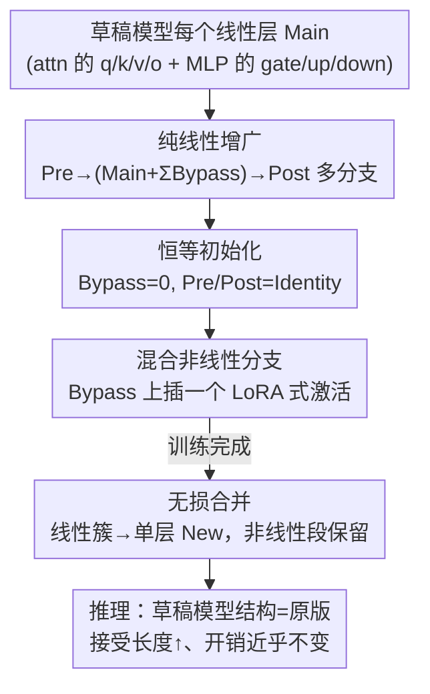

# RepSpec: Structural Re-parameterized Draft Model Training for Speculative Decoding

**会议**: ICLR 2026  
**OpenReview**: [https://openreview.net/forum?id=bqEi97qzzz](https://openreview.net/forum?id=bqEi97qzzz)  
**代码**: 待确认  
**领域**: LLM效率 / 推测解码  
**关键词**: 推测解码, 草稿模型, 结构重参数化, EAGLE, 训练-推理解耦

## 一句话总结
RepSpec 借鉴 RepVGG 的结构重参数化思想，把推测解码草稿模型里的每个线性层在**训练时**拆成多分支冗余结构、**推理时**无损合并回单层，从而在不增加推理开销的前提下提升草稿模型能力；再叠加一个"LoRA 式非线性混合分支"进一步拉长接受序列，把 SOTA 的 EAGLE-3 加速 4%–10%。

## 研究背景与动机

**领域现状**：推测解码（Speculative Decoding, SD）用一个小的草稿模型 $M_d$ 并行生成多个候选 token，再交给大的目标模型 $M_t$ 一次性并行验证，从而把"内存带宽受限"的自回归解码变成"算力受限"的并行验证，主流加速手段。双模型 SD（如 EAGLE 系列、Medusa、Hydra）相比无需训练的自推测解码能得到更长的接受序列，是当前性能上限最高的范式。

**现有痛点**：双模型 SD 的性能**根本上被草稿模型的容量卡住**。以 EAGLE 为例，草稿模型只用目标模型的单个 decoder 层作为起点，参数量极小。直觉上把草稿模型做大就能提升接受长度，但草稿模型每生成一个 token 都要被调用，**直接加层会同步抬高推理成本**，这笔账常常不划算——草稿变强带来的接受长度收益，被草稿本身变慢吃掉了。

**核心矛盾**：草稿模型的**训练容量**和**推理开销**被死死绑在了一起——想要训练时更强，就得在推理时付出代价。

**本文目标**：能不能在**训练阶段临时扩大**草稿模型的参数规模、拿到更好的优化效果，而在**推理阶段不引入任何额外开销**？

**切入角度**：作者注意到 RepVGG/ACNet 这类卷积结构重参数化技术，正好解决"训练-推理结构解耦"：训练时给主干加多条可合并的旁路分支（类似 ResNet 拓扑），靠卷积/线性运算的**可加性**，推理时把所有分支合并回单层，零额外成本。单层 decoder 草稿模型虽然没有 VGG 那种梯度消失问题，但"训练时解耦、推理时重耦"的原则依然适用。

**核心 idea**：把结构重参数化搬进草稿模型训练——训练时用多个冗余线性分支替换每个线性层、推理时无损合并；再结合 SD 场景"草稿耗时只占总解码一小部分"的特点，破例引入一个不可合并但收益大的非线性分支。

## 方法详解

### 整体框架

RepSpec 不改变 SD 的双模型框架，只改造草稿模型**线性层的训练形态**。核心思路一句话：训练时把每个原始线性层 `Main` 包裹进一组"前置层 Pre + 旁路层 Bypass + 后置层 Post"的多分支结构，让优化器在更宽的参数空间里学习；训练结束后利用线性运算的可加性，把整簇分支**无损合并**成一个等价的单一线性层 `New`，推理时草稿模型的结构与开销和原版完全一致。在纯线性方案之上，作者再补一个混合方案：在 Bypass 上插入一个 LoRA 式的非线性瓶颈，它无法被合并、会带来很小的推理代价，但能进一步拉长接受序列——这在 SD 里是划算的。

### 关键设计

**1. 纯线性结构重参数化：训练加宽、推理零成本**

针对"草稿模型一加层推理就变慢"的痛点，RepSpec 让每个线性层在训练时变胖、推理时还原。对一个原始线性层 `Main`，训练时插入 (i) 串在前面的 $n$ 个 `Pre` 层、(ii) 串在后面的 $m$ 个 `Post` 层、(iii) $k$ 条并联的 `Bypass` 旁路，增广映射为

$$\text{Aug} = \text{Post}_{m:1} \circ \Big(\text{Main} + \sum_{l=1}^{k}\text{Bypass}_l\Big) \circ \text{Pre}_{1:n}.$$

由于全程没有非线性，整条多分支结构在数学上严格等价于单个线性变换。记 $W_{\text{pre}}=\prod_{i=n}^{1}W_{\text{pre}_i}$（Post 同理），训练后可把权重无损合并为

$$W_{\text{new}} = W_{\text{post}}\Big(W_{\text{main}} + \sum_l W_{\text{bypass}_l}\Big)W_{\text{pre}},$$

偏置项同样按链式法则合并。作者发现把 attention 的 q/k/v/o 投影和 MLP 的 gate/up/down 投影**全部**重参数化是"必要且充分"的——只重参数化部分模块收益不全，而 embedding 层重参数化虽提升验证集指标，却会损害 OOD 表现，故被排除。关键洞察在于：纯线性多分支不增加模型表达能力（合并后等价于单层），但**改变了训练时的优化地形（optimization landscape）**，让梯度下降找到更好的解——好处全在训练、代价在推理时被抹平。

**2. 恒等初始化：让增广模型起点等价于原模型**

如果新增分支随机初始化，会破坏草稿模型原本的初始状态、拖慢甚至带偏训练。RepSpec 把 `Bypass` 初始化为零、把 `Pre/Post` 初始化为恒等映射，于是在初始时刻增广模型在功能上**完全等价于原始单层模型**。这样训练从一个"已知良好"的起点出发，逐步利用重参数化带来的更优优化地形演化，而不是从混乱状态重新学起，保证了多分支结构带来的是净增益而非扰动。

**3. 混合线性-非线性策略：用一个 LoRA 式非线性换更长接受序列**

纯线性方案的天花板很明显——再多线性分支合并后还是一层，表达力没本质提升（消融显示无限堆叠反而掉点）。作者据此引入**最少量**的非线性来博取最大额外收益。普通结构重参数化从不碰非线性，因为非线性段无法合并、会直接抬高推理成本；但在 SD 场景里草稿模型的推理时间只占总解码时间一小部分，**容忍草稿稍微变慢、换取接受长度显著变长，整体反而更快**。具体做法是只插入**一个**激活函数（实验表明插一个收益最大、再插边际递减），实现为"两个分解线性层中间夹一个激活"的 LoRA 式瓶颈（用 `mid_feature` 控制中间维度以压缩不可合并参数量）。激活插在 Pre/Post 会把系统切成两段不可合并线性层；插在 Bypass 则能把两段分别与 Pre/Post 合并、但首层只能与 Main **拼接**（concat）而非相加，效率略低。综合权衡，最优结构是**把 LoRA 式非线性放在 Bypass 分支**。

### 损失函数 / 训练策略

RepSpec 是一个即插即用的训练框架，不改 SD 原有的草稿模型训练目标（沿用 EAGLE / Medusa / Hydra 各自的损失），只替换线性层的结构形态。最优纯线性配置为：在 attention 的 q/k/v/o 与 MLP 的 gate/up/down 每个投影上各插**一个 Pre + 一个 Bypass**（消融证明再多无益甚至有害）。混合方案在此基础上把单个 ReLU 以 LoRA 式瓶颈插入 Bypass。训练用 8×A100（80GB），推理用 2×A100。

## 实验关键数据

### 主实验（接受长度 τ / 速度 v，越大越好）

| 目标模型 | 草稿 | 模式 | Baseline τ | Linear τ | Hybrid τ |
|----------|------|------|-----------|----------|----------|
| LLaMA-3.1 8B | EAGLE-1 | Chain | 2.54 | 2.70 | 2.82 |
| LLaMA-3.1 8B | EAGLE-3 | Chain | 3.35 | 3.60 | 3.66 |
| LLaMA-3.1 8B | EAGLE-3 | Tree | 5.86 | 5.95 | 6.03 |
| LLaMA-2 13B | EAGLE-1 | Tree | 4.31 | 4.47 | 4.67 |
| Vicuna 7B | Hydra | Tree | 3.59 | 3.60 | 3.70 |

（表中为 6 个基准 MT/GSM8K/Alpaca/HumanEval/QA/Sum 的平均值。）端到端加速：在 LLaMA-3.1 8B 上，Linear 把 EAGLE-1 加速 7%–10%、EAGLE-3 加速 4%–6%；在 LLaMA-2 13B 上 Hybrid 把 EAGLE-1 加速 5%–9%；在 Vicuna 7B 上 Linear 给 Medusa/Hydra 分别带来 5%/8% 加速。

### 消融实验（EAGLE-1 @ LLaMA-3.1 8B, MT-bench, chain, draft=5）

| 配置 | 结论 |
|------|------|
| 模块位置（Fig 2a） | Attn+MLP 是最优重参数化目标；embedding 提升验证集但损害 OOD，被弃 |
| 块组合（Fig 2b） | Pre+Post+Bypass 训练最好，但 **Pre+Bypass** 训练成本更低且基准上更优 |
| 规模（Fig 2c） | 单个 Pre + 单个 Bypass 已是纯线性最优，再加冗余反而掉点 |
| 激活函数（Fig 3a/Tab 3） | GeLU 训练指标最好，但 **ReLU** 速度与简洁性最佳 |
| 插入位置（Fig 3b） | LoRA 式非线性放 **Bypass** 最优 |
| vs Double Layer（Fig 3c） | Hybrid 优于"简单把 decoder 层数翻倍"——后者推理成本翻倍 |

### 关键发现
- **优化地形 > 表达能力**：纯线性多分支合并后表达力不变，纯靠改善训练时的优化地形就能涨接受长度，说明草稿模型训练存在明显的优化瓶颈而非容量瓶颈。
- **大模型更吃 Hybrid**：8B 上 Linear 综合最优（Hybrid 略慢于非线性开销），13B 上 Hybrid 反超——目标模型越大、草稿相对耗时越小，非线性的代价越容易被接受长度收益覆盖。
- **冗余不是越多越好**：纯线性堆叠越多训练成本越高、性能反而可能下降，单 Pre + 单 Bypass 即最优。

## 亮点与洞察
- **跨领域迁移得很漂亮**：把 CV 里 RepVGG 的"训练多分支、推理单层"原则搬到 LLM 草稿模型训练，精准命中 SD "草稿能力受限于参数 vs 推理开销"的核心矛盾，零额外推理成本就能涨点。
- **反套路地破例引入非线性**：传统结构重参数化绝不碰非线性（不可合并），但作者抓住 SD "草稿耗时占比小"这一独特性质，论证了"容忍小代价换大接受长度"在该场景下是净赚——是把通用技术按场景重新打磨的范例。
- **即插即用**：作为训练框架可叠加到 EAGLE-1/3、Medusa、Hydra 等多种基线之上，不改各自损失，工程落地门槛低。

## 局限与展望
- **绝对加速幅度有限**：端到端加速多在 4%–10% 区间，属于在 SOTA 基础上的增量优化，而非数量级提升。
- **训练成本上升**：训练时草稿模型被显著加宽（多分支 + 8×A100），换取的是推理零（纯线性）/小（混合）开销，对训练资源紧张的场景不友好。
- **Hybrid 的非线性段不可合并**：混合方案在小目标模型（如 8B）上会因非线性开销变慢，需按目标模型规模选 Linear 还是 Hybrid，缺乏自动选择机制。
- **均贪心/温度 0**：主实验多在 temperature=0 下，随机采样、长上下文等更复杂场景的收益尚待验证。

## 相关工作与启发
- **vs EAGLE**：EAGLE 改草稿模型的架构与特征对齐方式，RepSpec 不动其推理结构、只改训练形态，二者正交可叠加；RepSpec 把 EAGLE-3 进一步提升正说明它补的是"训练优化"这块短板。
- **vs RepVGG / ACNet（结构重参数化原版）**：原版用于 CNN 缓解深层 VGG 的梯度消失、且严格只用可合并线性分支；RepSpec 用于无梯度消失问题的浅层草稿模型，且**突破性地**引入不可合并非线性分支，动机从"缓解梯度消失"变为"在推理预算宽松的草稿侧博取接受长度"。
- **vs 简单加层（Double Layer）**：直接给 EAGLE 翻倍 decoder 层会让推理成本翻倍，RepSpec 用合并机制把训练容量的收益"偷渡"到推理零成本，消融中明确优于 Double Layer。

## 评分
- 新颖性: ⭐⭐⭐⭐ 把结构重参数化迁到 SD 草稿训练、并按场景破例引入非线性，思路新颖但属已有技术的巧妙组合
- 实验充分度: ⭐⭐⭐⭐ 多目标模型 × 多基线 × 多基准 + 完整消融，但绝对加速有限、缺随机采样场景
- 写作质量: ⭐⭐⭐⭐ 动机推导清晰、合并公式与消融自洽
- 价值: ⭐⭐⭐⭐ 即插即用、零/小推理成本涨点，对推理加速工程有直接实用价值

<!-- RELATED:START -->

## 相关论文

- [\[ICLR 2026\] Flatter Tokens are More Valuable for Speculative Draft Model Training](flatter_tokens_are_more_valuable_for_speculative_draft_model_training.md)
- [\[ICLR 2026\] PARD: Accelerating LLM Inference with Low-Cost Parallel Draft Model Adaptation](pard_accelerating_llm_inference_with_lowcost_parallel_draft_model_adaptation.md)
- [\[ICLR 2026\] Overcoming Joint Intractability with Lossless Hierarchical Speculative Decoding](overcoming_joint_intractability_with_lossless_hierarchical_speculative_decoding.md)
- [\[NeurIPS 2025\] 3-Model Speculative Decoding (PyramidSD)](../../NeurIPS2025/llm_efficiency/3model_speculative_decoding.md)
- [\[ICLR 2026\] Global Resolution: Optimal Multi-Draft Speculative Sampling via Convex Optimization](global_resolution_optimal_multi-draft_speculative_sampling_via_convex_optimizati.md)

<!-- RELATED:END -->
