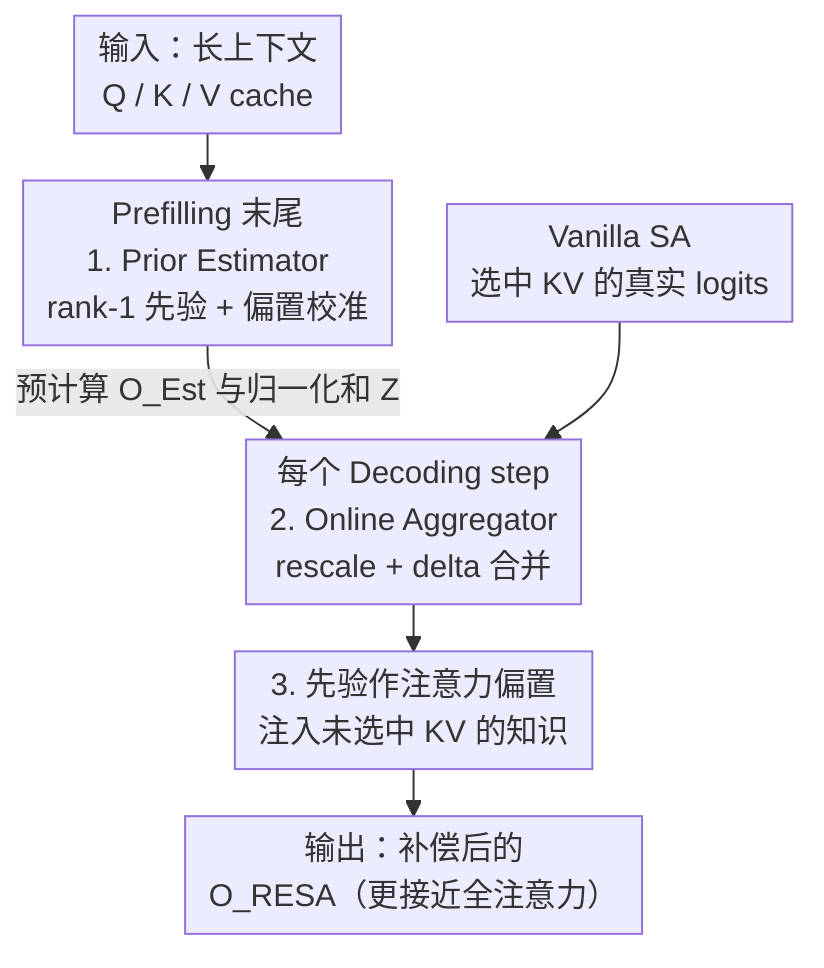

# RESA: Bringing Back What Sparse Attention Ignores with Residual Estimation

**会议**: ICLR 2026  
**OpenReview**: [https://openreview.net/forum?id=ktcq26hMCH](https://openreview.net/forum?id=ktcq26hMCH)  
**领域**: LLM效率  
**关键词**: 稀疏注意力, KV cache, 低秩, 残差估计, 长文本推理

## 一句话总结
针对稀疏注意力（SA）"只算选中的 KV、把其余 KV 当作零贡献"的盲区，RESA 利用注意力 logits 矩阵天然的低秩特性，用一个 rank-1 先验把被忽略 KV 的贡献估计回来，并以与 SA 同阶的开销在线融合，从而在相同 KV 预算下把模型质量最多提升 26%，或在同等质量下把 KV 预算压缩 33.2%、注意力吞吐提升 1.23×。

## 研究背景与动机
**领域现状**：长上下文 LLM 让 KV cache 成为新的内存与带宽瓶颈，稀疏注意力（Sparse Attention, SA）通过只挑选打分最高的若干 KV 参与计算来缓解。现有 SA 工作大体围绕两个问题展开：一是"如何精确找出关键 KV"（用 ANN 近似最近邻提升选择精度），二是"该选多少个 KV"（按 head 的稀疏程度动态分配预算）。

**现有痛点**：当场景没那么稀疏（attention 分数比较平坦）时，上面两条路的唯一出路就是"多选一些 KV"来保住精度，可这样一来 SA 节省开销的优势就被一点点吃掉，尤其在算力受限的设备上。

**核心矛盾**：作者指出这两类做法共享了一个被默认接受、却很可疑的假设——只有被选中的 KV 才对最终 attention 输出有贡献，没被选中的 KV 贡献为零。这个"非选即零"的二值假设正是质量损失的根源。

**本文目标**：不去多选 KV，而是问第三个、与前两者正交的问题——能不能高效且准确地**估计**那些没被选中 KV 的贡献，把它们补回来？作者把这个过程称为残差估计（Residual Estimation）。

**切入角度**：动机来自一个事实——注意力计算里存在大量冗余，因此未选中 KV 的贡献"可以被粗略估计，而不必精确计算"。具体证据是 logits 矩阵 $M=QK^\top/\sqrt{d}$ 的固有低秩性：其有效秩被 head 维度 $d$（如 128）上界住，与序列长度无关。以 Llama-3.1-8B、序列长 8k 为例，$M\in\mathbb{R}^{8k\times 8k}$ 的有效秩只有 128；进一步做 SVD 发现首个奇异值就占了总能量的 40%–50%，且其大小随序列长度近似线性增长——意味着序列越长，logits 越像是被"复制式"放大，冗余越严重。

**核心 idea**：用一个 rank-1 的 logits 先验来估计被 SA 忽略 KV 的贡献，并在解码时以轻量方式融合进 SA 输出——把"稀疏"（捕捉细粒度重要性）和"低秩"（保留全局结构）两个互补视角结合起来。

## 方法详解

### 整体框架
RESA（Residual Estimated for Sparse Attention）是一个**无需训练**的框架，在原始 SA 流程旁挂上一条新的计算分支，专门把被 SA 丢掉的全局贡献补回来。它分两个阶段工作：在 **prefilling 末尾**用一个"典型 query"一次性算出未选中 KV 的先验分布及其输出 $O_{Est}$；在**每个 decoding step** 再把这个先验与当前 SA 的真实结果做轻量缩放与合并，得到更准确的输出 $O_{RESA}$。关键约束是：整条分支的复杂度必须和 vanilla SA 一样（$O(|I|)$，$I$ 是选中 KV 的下标集），不能引入额外阶数的开销。

RESA 由两个子模块构成：**Prior Estimator** 负责确定未选中 KV 的先验 logits 分布并预计算对应输出，**Online Aggregator** 负责在解码时把先验与 SA 结果以 delta 方式融合。注意 RESA 本身不绑定任何特定 SA 算法，是个通用增强器（Quest、ArkVale、Ada-KV、PSA 都能套）。

### 关键设计

**1. Prior Estimator：用一次"典型 query"把 rank-1 先验便宜地算出来**

痛点是：理论上想拿到主奇异分量 $\sigma_1 u_{1,i} v_1^\top$，就得在每个解码步做 SVD，而在线 SVD 的代价高到不可接受。作者的关键观察是——可以**绕过 SVD**，用历史 logits 的均值来逼近这个主分量。具体地，对当前 query $q_i$ 和全部 key 缓存 $K$，估计写成

$$q_i K^\top \approx \mu_Q K^\top + (q_i-\mu_Q)\mu_K^\top,\qquad \delta_i=(q_i-\mu_Q)(K-\mu_K)^\top$$

其中 $\mu_Q,\mu_K$ 是历史 query/key 的均值，$\delta_i$ 是真实与估计 logits 之间的误差。这里的关键项 $\mu_Q K^\top$ 恰好等于 logits 矩阵所有行的均值 $\bar M=\frac{1}{L}\sum_i M_{i,:}$。之所以能用它当先验，是因为作者发现每个 token 的历史 logits 都紧紧围绕其均值小幅波动（即 $M_{i,:}=\bar M+e_i$，$e_i$ 很小），正是这种"行均值集中"造成了 logits 矩阵的 rank-1 尖峰，使行均值 $\mu_Q K^\top$ 与主奇异分量 $\sigma_1 u_1 v_1^\top$ 的余弦相似度接近 1。后面那项偏置 $(q_i-\mu_Q)\mu_K^\top$ 用来把真实 logits 的均值和先验对齐——因为 softmax 对 logits 的相对幅度极其敏感，这个偏置消除全局平移，避免后续融合时产生系统性失真。

更妙的是 $\mu_Q K^\top$ 与 query 下标 $i$ 无关，可以**只算一次**：在 prefilling 末尾对它做 softmax、加权所有 $V$ 得到 $O_{Est}$，等价于给 prefilling 末尾多追加一个 query（上下文长度 $L\to L+1$）。由于 $L$ 本就很大，这点开销可忽略；配合 chunked prefill，实际只让最后一个 chunk 的尺寸 +1。

**2. Online Aggregator：用 rescale + delta merging 把融合压回 SA 同阶复杂度**

最直接的融合是把 SA 在选中位置上算出的真实 logits 直接替换掉先验中对应位置的 logits，但这种 naive 做法要重新对全长 $L$ 做 softmax，复杂度退回 $O(L)$，等于丢掉了 SA 的全部优势。RESA 的做法是把它拆成两步、保持 $O(|I|)$。

第一步 **rescale**：记先验的指数和 $Z=\sum_j \exp(P_j)$（prefilling 时连同先验一并预算好），解码时的新指数和 $Z'$ 与 $Z$ 的唯一区别是把选中位置的 $\sum_{j\in I}\exp(P_j)$ 换成 $\sum_{j\in I}\exp(P^{SA}_{I_j})$，这只需 $O(|I|)$、无任何矩阵乘。于是用两个标量因子把先验分数和 SA 分数对齐到统一分布 $S'$：

$$\alpha=\frac{Z}{Z'},\qquad \beta=\frac{\sum_{j\in I}\exp(P^{SA}_{I_j})}{Z'}$$

未选中位置用 $\alpha\cdot S_j$，选中位置用 $\beta\cdot S^{SA}_{I_j}$。第二步 **delta merging**：把输出改写成相对 $O_{Est}$ 的增量更新，

$$O_{RESA}=\alpha\cdot O_{Est}+\big(\beta\cdot S^{SA}_I-\alpha\cdot S_I\big)V_I$$

这样既复用了预算好的 $O_{Est}$，又只在选中位置上做计算，复杂度严格等于 SA。数值上还用 log-sum-exp 和减最大值的 shifted-logit 技巧防溢出。此外引入一个超参 $\lambda\in[0,1]$ 控制先验权重（用 $\alpha'=\lambda\alpha$ 替换 $\alpha$）：$\lambda=0$ 时 RESA 退化为原始 SA，越大先验影响越强。

**3. 先验即注意力偏置：把"补偿"重新解释为知识注入**

作者进一步给出 RESA 为何有效的机制解释：先验分布本质上是施加在注意力上的一个 **bias**，从两个层面起作用——一是它进入 softmax 的分母，直接改变注意力分数的分布；二是它对 $V$ 的加权和被聚合进最终输出，相当于把未选中 KV 携带的"知识"注入回来。这条视角把 RESA 和训练时的现象打通：例如 GPT-oss 给稀疏注意力层学的、softmax 后被丢弃的 learnable bias，可被理解为模型在训练中学了一个隐式先验，把某些位置标成无关；Sun et al. 引入 learnable K/V 抑制激活离群值，也能解释成学一个把离群影响摊平到各位置的隐式先验。一个有趣的发现是：可视化典型 query $\mu_Q$ 与 key $\mu_K$ 后，高频通道几乎被序列平均抵消（像低通滤波），先验主要由 RoPE 的低频分量构成，而低频分量正是已知的"语义载体"，所以 RESA 的先验可看作一种全局语义偏置。

### 损失函数 / 训练策略
RESA 完全 **training-free**，不改模型权重、不引入新训练目标，只在推理时挂一条估计-融合分支，因此可即插即用地增强任意现成 SA 方法。唯一可调的是先验权重 $\lambda$：检索类任务里精度通常随 $\lambda$ 单调上升（先验帮助排除错误候选、增强检索置信度）；而摘要/理解类任务则先小升后骤降（先验可能干扰模型对上下文的理解，逼它退回参数内知识，典型如 RULER 的 CWE 任务）。

## 实验关键数据

### 主实验
在 RULER 与 LongBench 上，对每个 SA 基线（Quest、ArkVale、Ideal-TopK）都给出"原版 vs +RESA"的对比，模型涵盖 Llama-3.1-8B/3.2-3B、Mistral-7B、LWM-Text-7B，统一用 2.5% 预算、8K 上下文。下表节选 RULER 上提升最显著的几个任务（括号内为 +RESA）：

| 模型 / 方法 | 任务 | SA | +RESA | 提升 |
|------|------|------|------|------|
| Llama-3.1-8B / Quest | MK3 | 24 | 40 | +16 |
| Llama-3.2-3B / Quest | MQ | 83.25 | 93 | +9.75 |
| Mistral-7B / ArkVale | MK3 | 28 | 44 | +16 |
| LWM-7B / ArkVale | MQ | 74.75 | 89.25 | +14.5 |

单任务最高提升在四个模型上分别达 16%/26%/22%/20%（RULER）、5.65%/1.95%/8.22%/6.01%（LongBench）。Ideal-TopK 因为本就贴近全注意力，提升最小，符合预期。

### 效率与开销

| 配置 | 收益 |
|------|------|
| 同质量下 KV 预算压缩（PSA / Ada-KV） | 最多 33.2% / 28.7% |
| 注意力吞吐提升（vs PSA / Ada-KV） | 1.23× / 1.16× |
| 注意力吞吐提升（vs vanilla 全注意力） | 2.64× / 2.49× |
| Prefilling 额外开销（整段，128k） | 仅 0.06% |
| Decoding 每步额外开销（8k→32k） | 3.13%→2.34% |
| SA 与全注意力的分数误差降低 | 55%–70%（最多 77%） |

### 关键发现
- **越长越值**：上下文越长，RESA 提升越大——因为长文本里冗余计算更多，正好被低秩先验高效捕获。
- **开销随长度摊薄**：prefilling 的额外开销只加在最后一个 chunk，上下文越长 chunk 越多，整段相对开销趋于 0（128k 仅 0.06%）；decoding 的 Online Aggregator 全是 element-wise 乘加、无矩阵乘，每步开销 <3.13% 且随长度递减。
- **误差结构有规律**：估计误差 $E=(q_i-\mu_Q)(K-\mu_K)^\top$ 表现出明显的均值回复（mean reversion）特性，ACF 分析显示其带有时间相关性而非白噪声，暗示先验还有进一步用时序建模改进的空间。

## 亮点与洞察
- **把"非选即零"假设拆掉**：现有 SA 默认未选中 KV 贡献为零，RESA 第一次正面把这部分残差估计回来，提出与"选哪些/选多少"正交的第三视角——稀疏与低秩互补而非互斥。
- **用行均值替代 SVD**：最巧的工程化是发现 logits 行均值 $\mu_Q K^\top$ 与主奇异分量余弦≈1，于是用一次廉价均值计算替掉昂贵的在线 SVD，把理论低秩性落到可部署的 rank-1 先验。
- **delta merging 的复杂度守恒**：通过 rescale + 增量更新，把"补偿全局信息"这件听起来必然 $O(L)$ 的事压回 $O(|I|)$，几乎零额外开销，这是它能即插即用的关键。
- **先验=注意力偏置的统一解释**：把训练-free 的推理补偿和训练时的 learnable bias（GPT-oss、离群值抑制）统一到"隐式先验/知识注入"框架下，提供了可迁移的设计视角。

## 局限与展望
- **先验权重需按任务调**：$\lambda$ 在检索类与理解类任务上行为相反，没有自适应机制，需人工或经验设定，摘要类任务设大了反而掉点。
- **只取 rank-1**：为了避开在线 SVD，先验只逼近主奇异分量，更高阶的全局结构没建模；误差的时序结构（ACF 显示非白噪声）目前也只是观察、未利用。
- **依赖低秩/行均值假设成立**：方法有效性建立在"logits 行均值集中 + 首奇异值占 40%–50% 能量"上，对低频被 RoPE 抵消的依赖也意味着在不同位置编码或更难分布的任务上稳健性有待验证。
- **训练时延伸尚停留在 case 分析**：把先验当 attention bias 在训练阶段优化只给了两个解释性案例，未做实际训练实验。

## 相关工作与启发
- **vs Quest / ArkVale（块级 SA）**：它们在"如何精确选关键 KV 页"上下功夫，RESA 不和它们竞争而是叠加——把它们丢弃的 KV 贡献估计回来，实测能给两者都带来稳定增益。
- **vs Ada-KV / PSA（动态预算分配）**：这类方法解决"每个 head 选多少 KV"，RESA 与之正交，在它们之上还能再压 28.7%–33.2% 预算。
- **vs StreamingLLM / H2O / TOVA（丢 token 类）**：它们永久丢弃低分 token，本质仍是"非选即零"；RESA 不丢弃信息而是低秩估计其全局贡献，从根上规避了丢弃带来的退化。

## 评分
- 新颖性: ⭐⭐⭐⭐⭐ 提出与现有两条 SA 路线正交的"残差估计"视角，并用行均值≈主奇异分量绕过在线 SVD，想法干净且有理论+观测支撑。
- 实验充分度: ⭐⭐⭐⭐ 覆盖 4 个模型、2 个长文本基准、多个 SA 基线，质量/预算/吞吐/开销/误差都做了，但主要靠 RULER 合成任务、缺更大规模真实任务。
- 写作质量: ⭐⭐⭐⭐ 动机—观测—方法链条清晰，公式推导（rescale/delta merging）讲得明白，少量记号（$\mu_Q K^\top$ 的维度）需对照原文。
- 价值: ⭐⭐⭐⭐⭐ 训练-free、即插即用、几乎零额外开销就能增强任意 SA，对长上下文推理部署有直接实用价值。

<!-- RELATED:START -->

## 相关论文

- [\[ICLR 2026\] vAttention: Verified Sparse Attention via Sampling](vattention_verified_sparse_attention_via_sampling.md)
- [\[ICLR 2026\] Sparse Attention Adaptation for Long Reasoning](sparse_attention_adaptation_for_long_reasoning.md)
- [\[ICLR 2026\] Tactic: Adaptive Sparse Attention with Clustering and Distribution Fitting for Long-Context LLMs](tactic_adaptive_sparse_attention_with_clustering_and_distribution_fitting_for_lo.md)
- [\[ICLR 2026\] One-Prompt Strikes Back: Sparse Mixture of Experts for Prompt-based Continual Learning](one-prompt_strikes_back_sparse_mixture_of_experts_for_prompt-based_continual_lea.md)
- [\[ICLR 2026\] Understanding and Improving Length Generalization in Hierarchical Sparse Attention Models](understanding_and_improving_length_generalization_in_hierarchical_sparse_attenti.md)

<!-- RELATED:END -->
