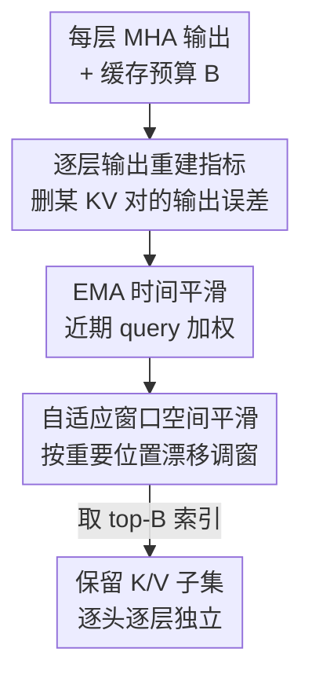

# ReST-KV: Robust KV Cache Eviction with Layer-wise Output Reconstruction and Spatial-Temporal Smoothing

**会议**: ICLR 2026  
**OpenReview**: [https://openreview.net/forum?id=PhEHuo7oMm](https://openreview.net/forum?id=PhEHuo7oMm)  
**代码**: 随附补充材料（论文称便于复现）  
**领域**: LLM效率  
**关键词**: KV Cache、缓存淘汰、长上下文、注意力重分布、推理加速

## 一句话总结
ReST-KV 把 KV cache 淘汰重新定义为「逐层输出重建」问题——以「删掉某个 KV 对会让本层注意力输出增加多少误差」作为重要性指标，从而显式捕捉删除后被忽略的注意力重分布效应，再叠加时间维 EMA 平滑和空间维自适应窗口平滑，使长上下文下的淘汰更鲁棒，在 LongBench 上比 SOTA 高 2.58%、RULER 上高 15.2%，128k 解码延迟降低 10.61×。

## 研究背景与动机
**领域现状**：LLM 上下文越来越长（GPT-4、Claude 3.5、Llama-3.1 都支持 128k+），但 KV cache 随序列长度线性膨胀，长序列下可达几百 GB。在不重训的前提下压缩 KV cache 是提升推理效率与可扩展性的关键，其中「KV cache 淘汰」（识别并丢弃不重要的 KV 对）是最主流的免训练手段。

**现有痛点**：H2O、SnapKV、PyramidKV 等方法几乎都用「注意力权重」来估计 KV 对的重要性——保留 query-key 相似度高的对，丢弃相似度低的对。但这套逻辑有个被普遍忽视的缺口：当你真的删掉一批 KV 对之后，softmax 会把这些被删 token 原本占据的注意力质量**重新分配**给剩下的 token，整个注意力分布会改变。仅看删除前的静态注意力权重，无法预判删除后的实际后果，于是在紧缩缓存预算下经常做出次优的保留决策、性能明显下滑。

**核心矛盾**：重要性 = 删除前的注意力权重 ≠ 删除后对模型输出的真实影响。前者忽略了两件事：一是注意力重分布（删掉一个 token，别人能不能补上它的贡献），二是 KV 重要性随**时间步和空间位置**动态漂移的现象。

**本文目标**：设计一个既能感知注意力重分布、又能跟踪重要性时空漂移的鲁棒淘汰指标，且不依赖重训、与已有的逐层/逐头预算分配策略正交兼容。

**切入角度**：作者把淘汰目标从「保留高注意力的 KV 对」改成「保留每层注意力输出的分布」——直接以输出重建误差度量重要性，这样注意力重分布的影响会被自动吸收进指标里。再辅以可视化观察到的「重要性沿时间波动、沿空间位移」两个现象，加两路平滑。

**核心 idea**：用「删除该 KV 对导致的逐层输出重建误差」替代「原始注意力权重」作为淘汰指标，并对该指标做时空平滑。

## 方法详解

### 整体框架
ReST-KV 在 prefill 阶段为每个注意力头、每一层独立打分并选出 top-B 个 KV 对保留，其余淘汰；它由两块拼成：(a) 逐层输出重建指标（Layer-wise Output Reconstruction, LOR），给出每个 KV 对的基础重要性；(b) 时空平滑，把这个基础指标在时间维（EMA）和空间维（自适应窗口 AWS）上做平滑，得到最终更鲁棒的指标。流程是：对当前层算出原始 MHA 输出 → 对每个 KV 对估计「删了它输出会涨多少误差」当作重要性 → 在最近一段 query 窗口上做 EMA 时间平滑 → 用窗口前后半段的重要位置漂移自适应调窗做空间平滑 → 取 top-B 索引保留对应 K/V。整个过程逐头逐层重复，不同头可以选出不同的 KV 子集。

### 关键设计

**1. 逐层输出重建指标：用删除后的输出误差替代静态注意力权重**

针对「只看注意力权重忽略重分布」这个痛点，作者把单层淘汰形式化为一个带预算约束的优化问题（定义 3.1）：在 $\langle \hat{K}_T, \hat{V}_T\rangle$ 不超过 $B$ 个元素的前提下，最小化压缩前后 MHA 输出的 $\ell_2$ 距离，即 $\arg\min \lVert \text{MHA}(x_t,\langle K_T,V_T\rangle) - \text{MHA}(x_t,\langle \hat{K}_T,\hat{V}_T\rangle)\rVert_2$。直接解这个组合优化太贵，作者改用贪心：对第 $n$ 个 KV 对，定义删掉它后输出误差的增量为它的重要性 $I_t[n]=\lVert \text{MHA}(x_t,\langle K_T,V_T\rangle)-\text{MHA}(x_t,\langle K_{T,\backslash n},V_{T,\backslash n}\rangle)\rVert_2$，误差涨得越多越重要。

关键在于，借助局部线性假设把这个式子化简后得到闭式（Eq. 7）：

$$I_t[n] = \frac{A_t[n]}{1-A_t[n]} \, \lVert \text{MHA}(x_t,\langle K_T,V_T\rangle) - v_n W_O \rVert_2$$

这个表达式把重要性拆成两个机制：第一项 $\frac{A_t[n]}{1-A_t[n]}$ 是一个 $(0,1)$ 上的单调非线性放大器，保留了「注意力权重越高越该留」的传统直觉，但加了曲率，能在高竞争的 KV 对之间拉开更大区分度；第二项 $\lVert \text{MHA}(\cdot)-v_n W_O\rVert_2$ 正是被旧方法漏掉的「重分布敏感度」——它衡量删掉第 $n$ 个对后，其余 KV 对能否补上它的 value 贡献来重建输出；这个差异越小，说明注意力能有效重分布、该对其实没那么重要。把 value 向量 $v_n$ 和重分布显式纳进来，是它区别于纯 attention-weight 指标的根本所在。（⚠️ Eq. 7 的具体推导见原文附录 A，此处以原文为准。）

**2. EMA 时间平滑：抑制单步波动，跟踪重要性的长期趋势**

作者可视化发现（Figure 3 左），同一个 KV 对的重要性 $I_1[n],I_2[n],\dots,I_t[n]$ 沿时间步剧烈波动，单步的瞬时打分不稳，容易误删长期有用的对。借鉴 SnapKV 用最近 query 窗口 $S_w$ 来评估重要性的做法，ReST-KV 对窗口内的重要性序列做指数移动平均：$\hat{I}_t[n]=\text{EMA}(I_{t-S_w:t}[n])$（对最近 $S_w$ 个 token 直接赋一个极大值 $\Omega$ 强制保留）。EMA 递推为 $\text{EMA}(I_{t_1:t_2}[n])=\alpha I_{t_2}[n]+(1-\alpha)\text{EMA}(I_{t_1:t_2-1}[n])$，平滑因子 $\alpha$ 控制当前打分相对历史的权重。这样近期 query 权重更高、早期波动被衰减，淘汰决策更稳。

**3. 自适应窗口空间平滑（AWS）：跟随重要性的空间位移调整窗口**

Figure 3 右显示另一个现象：相似的重要性分布会在**位移后的位置**重现（$I_{t-k}[n-kN],\dots,I_t[n]$ 呈现类似模式），即重要区域随步推进在空间上整体平移。固定窗口的池化会跟丢这种漂移。AWS 的做法是把观测窗口劈成前后两半 $S_w^{front}$、$S_w^{rear}$，各自算出 top-B 重要 KV 对的平均索引 $D^{front}$、$D^{rear}$，用二者之差 $\Delta D=D^{rear}-D^{front}$ 估计重要性的空间位移方向与幅度，再据此自适应地确定窗口大小 $W_s=2\lfloor|D^{rear}-D^{front}|/\beta\rfloor+1$ 和滑动偏移 $\gamma_{shift}$（$\beta$ 是控制步长粒度的缩放因子）。最终指标是在这个自适应窗口内对 $\hat{I}_t$ 做平均：$I_t[n]=\frac{1}{W_s}\sum_{k=-\lfloor W_s/2\rfloor+\gamma_{shift}}^{\lfloor W_s/2\rfloor+\gamma_{shift}}\hat{I}_t[k]$。如此窗口会主动跟着重要区域平移，把空间漂移纳入考量后再选 top-B。

最终保留集 $\hat{K}_T=K_T[D_t,:]$、$\hat{V}_T=V_T[D_t,:]$，其中 $D_t=\arg\max_B(I_t)$ 是最终指标下 top-B 的索引；每个头、每层各自独立执行，不同头可选不同 KV 对。

## 实验关键数据

### 主实验
在五个开源 LLM（Llama2-Chat、Gemma-Instruct 走 MHA；Llama3-Instruct、Mistral-Instruct-v0.3、Qwen2.5-Instruct 走 GQA）上评测，对比 StreamingLLM、H2O、TOVA、SnapKV、LaCache 等。LongBench（16 数据集 / 6 类）平均提升 2.58%，部分场景结果：

| 设置 | 指标 | ReST-KV | SnapKV | Full（不压缩） |
|------|------|---------|--------|------|
| Llama-3.1-8B, B=64L | LongBench Avg. | **33.54** | 31.48 | — |
| Llama-3.1-8B, B=512L | LongBench Avg. | **38.33** | 37.47 | 39.96 |
| Mistral-7B-v0.3, B=64L | LongBench Avg. | **40.05** | 37.53 | — |
| Mistral-7B-v0.3, B=512L | LongBench Avg. | **46.47** | 45.66 | 48.11 |

RULER（Llama3.1-8B，固定预算 B=1024L，4k→128k）平均比 SOTA 高 15.2%，且长上下文下优势更明显：

| 方法 | 4K | 32K | 64K | 128K | Avg. |
|------|----|----|----|----|------|
| Full | 99.34 | 94.89 | 89.85 | 79.32 | 93.46 |
| SnapKV | 83.60 | 66.95 | 57.47 | 47.99 | 67.11 |
| PyramidKV | 81.35 | 69.83 | 57.84 | 48.93 | 66.97 |
| **ReST-KV** | **94.01** | **81.87** | **78.65** | **68.28** | **82.27** |

128k 时缓存保留不到原始 1%，ReST-KV 仍维持有效检索（128K 单点 68.28 vs SnapKV 47.99）。Needle-in-a-Haystack（Mistral-7B，B=1024L）下保住 full cache 98% 的性能。

### 消融实验
LongBench 上以 Llama3.1-8B、B=128L 为默认配置，逐个去掉组件（LOR / EMA / AWS）：

| 配置 | Avg. Acc | 说明 |
|------|---------|------|
| Attention weight Top-k（基线） | 32.98 | 纯注意力权重，忽略重分布与时空动态 |
| ReST-KV（Full） | 35.86 | 完整模型 |
| w/o LOR | 33.95 (−1.91) | 去掉逐层输出重建指标 |
| w/o EMA | 34.02 (−1.84) | 去掉时间平滑 |
| w/o AWS | 33.50 (−2.36) | 去掉空间平滑 |

### 关键发现
- 三个组件都有正贡献，去掉 AWS（空间平滑）掉点最多（−2.36），说明跟踪重要性的空间漂移对长上下文鲁棒性最关键；LOR、EMA 次之。
- 相对纯 attention-weight 基线（32.98），完整 ReST-KV 提到 35.86，验证「输出重建 + 时空平滑」整体范式有效。
- 效率上，集成 FlashAttention-2 后，128k 解码延迟相比 full cache 降低约 10.61×；prefill 端与已有稀疏注意力兼容，TTFT 提速最高约 3.42×（摘要给的是 2.37×，⚠️ 不同集成设置下数值略有差异，以原文为准）；相比 SnapKV，ReST-KV 仅引入约 2% 的额外 prefill 延迟，开销可忽略。
- 与 PyramidKV（逐层）、AdaKV（逐头）等预算分配策略正交，可叠加使用。

## 亮点与洞察
- 最「啊哈」的地方是把「删某 KV 对的输出误差」化简成闭式 Eq. 7，并发现它天然分解成「非线性注意力放大项 + 重分布敏感项」——前者解释了为什么旧方法（只用 $A_t[n]$）是它的退化特例，后者正是旧方法漏掉的、靠 value 向量 $v_n W_O$ 才能捕捉的重分布信号。一个公式同时给出「为什么旧方法不够」和「该补什么」。
- 把淘汰目标从「保留高注意力 token」上移到「保留每层输出分布」，是一种视角迁移：重要性不再是 token 的固有属性，而是「删了它对输出的边际影响」，这个思路可迁移到剪枝、token merging 等其他压缩任务。
- 用窗口前后两半的 top-B 平均索引差 $\Delta D$ 来估计重要性空间漂移、据此自适应调窗，是个轻量又可解释的 trick，比固定窗口池化更贴合 attention 随步平移的实证现象。

## 局限与展望
- 指标依赖「局部线性假设」来化简成 Eq. 7，在注意力高度非线性或极端长程依赖场景下，闭式近似的精度可能下降（作者未深入讨论近似误差边界）。
- EMA 的 $\alpha$、AWS 的 $\beta$ 是需要调的超参；论文称在较宽范围内稳定，但跨模型/任务的默认值是否普适仍需更多验证。
- 方法聚焦 prefill 阶段的 KV 选择，针对的是免训练淘汰；与量化、低秩等其他 KV 压缩路线的组合效果未充分探索。
- 评测集中在文本长上下文 benchmark，未涉及多模态/超长生成等更广场景。

## 相关工作与启发
- **vs H2O / SnapKV**: 它们用累积/窗口平均注意力权重做指标，本文证明这类指标是 Eq. 7 在「忽略重分布项」下的退化形式；ReST-KV 额外引入 value 向量与重分布敏感度，并叠加时空平滑，低预算下更鲁棒。
- **vs PyramidKV / AdaKV**: 这些做的是逐层/逐头**预算分配**，与「用什么指标选 KV」是正交的两件事；ReST-KV 改的是指标，可直接叠在它们的预算策略之上（实验中也验证了兼容）。
- **vs Keyformer / MInference / FlexPrefill**: 同样关注注意力动态与重分布，但多停留在观察结构化模式或做归一化修正；ReST-KV 把重分布与时空漂移显式建模进淘汰指标本身，而非事后校正。

## 评分
- 新颖性: ⭐⭐⭐⭐⭐ 把淘汰重定义为逐层输出重建并化简出可解释闭式，统一了旧指标且补上重分布项，视角新颖。
- 实验充分度: ⭐⭐⭐⭐⭐ 五模型、四 benchmark、低/高两档预算、消融 + 效率 + 兼容性都覆盖。
- 写作质量: ⭐⭐⭐⭐ 公式推导清晰、动机有可视化支撑；部分效率数字（TTFT 2.37×/3.42×）口径略有出入。
- 价值: ⭐⭐⭐⭐⭐ 免训练、与预算策略正交、128k 解码加速 10×，落地性强。

<!-- RELATED:START -->

## 相关论文

- [\[ICML 2026\] CriticalKV: Optimizing KV Cache Eviction from an Output Perturbation Perspective](../../ICML2026/llm_efficiency/criticalkv_optimizing_kv_cache_eviction_from_an_output_perturbation_perspective.md)
- [\[ICLR 2026\] LouisKV: Efficient KV Cache Retrieval for Long Input-Output Sequences](louiskv_efficient_kv_cache_retrieval_for_long_input-output_sequences.md)
- [\[ICLR 2026\] Reconstructing KV Caches with Cross-Layer Fusion for Enhanced Transformers](reconstructing_kv_caches_with_cross-layer_fusion_for_enhanced_transformers.md)
- [\[ICLR 2026\] DefensiveKV: Taming the Fragility of KV Cache Eviction in LLM Inference](defensivekv_taming_the_fragility_of_kv_cache_eviction_in_llm_inference.md)
- [\[ICLR 2026\] FlashDLM: Accelerating Diffusion Language Model Inference via Efficient KV Caching and Guided Diffusion](flashdlm_accelerating_diffusion_language_model_inference_via_efficient_kv_cachin.md)

<!-- RELATED:END -->
