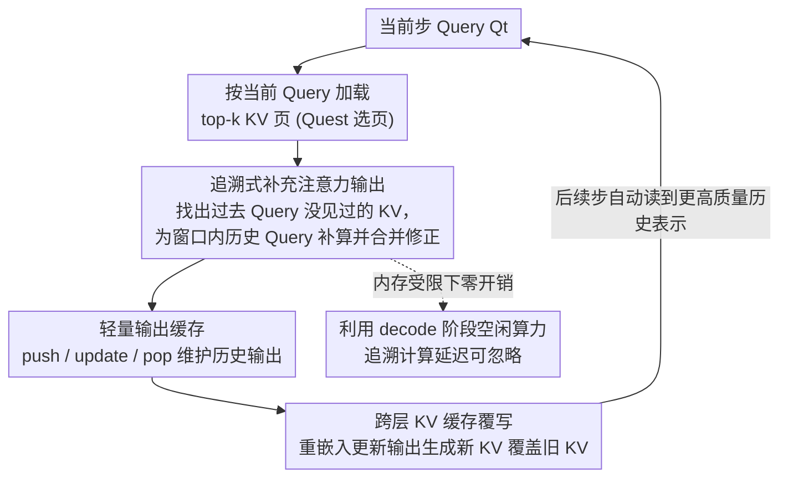

# Retrospective Sparse Attention for Efficient Long-Context Generation

**会议**: ICLR 2026  
**OpenReview**: [https://openreview.net/forum?id=Ql0G1Zsobn](https://openreview.net/forum?id=Ql0G1Zsobn)  
**代码**: https://github.com/csh3695/RetroAttention  
**领域**: LLM效率  
**关键词**: KV Cache 压缩, 稀疏注意力, 长文本生成, 注意力误差累积, 内存受限推理

## 一句话总结
本文提出 RetroAttention，一种"追溯式"稀疏注意力：在后续解码步骤加载到新 KV 时，回头去修正过去 Query 已经算好的注意力输出，从而在不增加 KV 预算的前提下让历史 Query 接触到更多 KV，缓解长生成中误差累积的问题，相比 SOTA 的 Quest 最多提升 21.9% 准确率、有效 KV 暴露量最多扩到 1.6×。

## 研究背景与动机

**领域现状**：LLM 在长推理、代码生成、多轮对话等任务里要处理越来越长的序列，而每步解码都要读一遍 KV cache，KV cache 的显存随序列长度线性增长、往往占几个 GB，成为推理延迟的主要瓶颈。主流缓解手段是 KV cache 压缩——只识别并保留/加载少量重要 token（H2O、SnapKV、Quest 等），其中 Quest 这类"非淘汰式"（被丢弃的 KV 仍可在未来重新检索）是当前 SOTA。

**现有痛点**：这些方法几乎都只盯着"长输入"场景，假设每一步选好当前最相关的 token 就够了，而**对已经解码过的 token 不再回头修改**。但长生成是另一回事：每一步用近似注意力（因为漏掉了某些被驱逐的 KV）产生的误差，会在隐藏状态里**递归累积**。论文在 PG-19 上实测发现，压缩 KV 和全量 KV 的差距在生成初期几乎可以忽略，但随着生成变长会越拉越大。

**核心矛盾**：要修正这种累积误差，最直接的办法是给更多 KV 预算（多加载点 KV），但这恰恰增加了显存和延迟，违背了压缩的初衷——准确率和 KV 预算之间存在 trade-off。作者还量化指出，长输出任务对 KV 预算远比长输入敏感：LONGBENCH（长输入短输出）下 Quest 用 5% 预算就能逼近全量（46.3% vs 47.3%），而 LONGGENBENCH（长输出）下 5% 预算会让 GSM8K 从 60.8% 暴跌到 17.6%，因为缺/补一个 KV 的影响会在成百上千步解码里被反复放大。

**切入角度**：作者的关键观察来自两点统计。其一，相邻 token 语义高度相关——当前 Query 检索到的 KV，约 70–80% 在过去 Query 里也曾进过 top-k，而剩下 15–20% 排在 next-k 区间，说明这些 KV 对过去 Query 其实也很重要，只是当时没被选中。其二，把未来若干步加载的"过去没见过"的 KV 并起来算"有效 KV 预算"，在 $n=1$ 时就涨到 1.17×，到 $n=7$ 涨到 1.60×——这些都是不花额外 KV 预算白捡的。

**核心 idea**：既然当前步加载的 KV 对过去 Query 也有用，那就**回头用它去补算并修正过去 Query 的注意力输出**——打破"注意力输出一旦算完就固定"的范式，让历史输出在后续解码中被持续校正。

## 方法详解

### 整体框架

RetroAttention 沿用 Quest 的 KV cache 页面选择策略（把每个 KV 页抽象成逐元素的 $K_{\min}/K_{\max}$，用 $\text{score}_j(Q)=\sum_i \max(Q_iK^j_{\min,i}, Q_iK^j_{\max,i})$ 估页面重要性并 top-k 选页），但把着眼点从"选哪些 KV"转到"已加载的 KV 还能复用给谁"。整体上它在每个解码步做四件事：先按当前 Query 加载 KV；再借助一个掩码找出"这些 KV 里过去 Query 没见过的部分"；用它们为窗口内的若干历史 Query 补算注意力，并以 FlashAttention 式的线性合并修正历史输出；最后把修正后的输出回写进一个轻量"输出缓存"，并进一步重嵌入去覆写更深层的 KV cache，让误差跨层逐步衰减。整个过程在一个大小为 $w$ 的**追溯窗口**内进行（论文主实验取 $w=2$）。

### 关键设计

**1. 追溯式补充注意力输出：用未来加载的 KV 回补过去 Query 的注意力**

这是方法的核心，针对的就是"历史注意力输出算完即固定、误差只会累积"的痛点。当前步 $t+s$ 不只为当前 Query 算注意力，还会**回头**为窗口内的过去 Query $Q_t$ 补算一份注意力。具体地，当前 Query 用 Quest 稀疏注意力得到 $O_{\text{org},t}$；对过去 Query，则只在"当前加载、但 $Q_t$ 此前没见过"的 KV 页上算一份**补充输出** $O^{t+s}_{\text{sup},t}$：

$$O^{t+s}_{\text{sup},t}=\frac{\sum_{j\in S_{t+s}\setminus\cup_{m=t}^{t+s-1}S_m}\sum_{l\in \text{Page}_j} e^{Q_tK_l^\top/\sqrt{d}}V_l}{\sum_{i\in S_{t+s}\setminus\cup_{m=t}^{t+s-1}S_m}\sum_{l\in \text{Page}_i} e^{Q_tK_l^\top/\sqrt{d}}}$$

其中 $S_t$ 是 $Q_t$ 加载的 top-k 页集合，集合差 $S_{t+s}\setminus\cup S_m$ 正是"过去没见过"的新 KV（靠一个记录每页最近加载步的掩码识别）。借鉴 FlashAttention 对部分注意力结果的聚合，softmax 注意力可以重写成原始输出与补充输出的**线性组合**，从而把 $O_{\text{org},t}$ 增量更新成 $O_{\text{up},t}$，等价于在并集 $\cup_{0\le s<w}S_{t+s}$ 上重算了一遍注意力。效果上，每个历史 Query 都被"喂"了超出其原始 top-k 预算的 KV，却没有产生额外 KV 访存。

**2. 轻量输出缓存：让追溯更新不必重载 KV**

要修正历史输出，就得能拿到它们，但注意力输出通常算完就丢了；若每次都重新加载历史 Query 的 top-k 页来重算，KV 预算会随窗口 $w$ 成倍上涨，得不偿失。本文用一个**注意力输出缓存**来存当前及若干历史步的输出，绕开重载。它的尺寸为 $(w-1, B, L, D)$（追溯窗口、batch、层数、隐藏维），**与生成长度无关**，因此显存开销很小。缓存靠三个动作运转：Push——每步把输出存进缓存；Update——补充输出就绪时，把缓存里的 $O_{\text{org}}$ 或已更新过的 $O_{\text{up}}$ 做加权合并得到新输出（既支持初次更新 $O_{\text{org}}\to O_{\text{up}}$，也支持再更新 $O_{\text{up}}\to O_{\text{up}}$）；Pop——缓存条目超过窗口大小时淘汰最旧的一条。

**3. 跨层 KV 缓存覆写：让修正后的输出真正影响最终生成**

前两个设计只解决了单层内注意力怎么更新，但修正后的输出还得传到更深层、改变最终 logits 才算数。本文让第 $l$ 层的输出缓存把多个嵌入送进第 $l+1$ 层：对最新步 $t_3$，第 $l+1$ 层首次生成 $Q/K/V$ 并把新 KV 追加进 cache；对历史步 $t_{1\text{-}2}$，则用更新后的 $O_{\text{up}}$ **重嵌入**算出新的 $\hat Q,\hat K,\hat V$，并**覆盖**掉之前由旧 $O_{\text{org}}$ 生成、如今已过时的 KV 条目。一旦历史 KV 被覆写，后续所有解码步（$t>t_3$）在读 KV cache 时就自动用上了更高质量的历史表示，深层无需任何特殊逻辑。这条链路让注意力误差**跨层逐步衰减**——越靠后的 Query 读到的历史表示质量越高。

**4. 内存受限下的近零开销：把追溯计算塞进 decode 的空闲算力里**

追溯更新看似多算了很多注意力，会不会拖慢推理？作者用 Arithmetic Intensity（AI，FLOPs 与访存字节之比）论证它仍处在 memory-bound 区间。decode 阶段注意力主要是 GEMV，PE 利用率极低、有大量空闲并行度，正好拿来做追溯计算。注意力层的 AI 化简后约为 $w h_q/h_k$，在中等窗口（如 $w<100$）下远低于现代 GPU 进入 compute-bound 的 200–400 阈值；访存上，本文与 Quest 的内存流量之比中，KV 加载项 $k_{\text{page}}h_k Pd$ 在分子分母都占主导，比值接近 1，所以追溯更新带来的延迟开销可忽略。线性层同理，只要 $wb$ 在几百以内仍是 memory-bound。

### 一个完整示例

以追溯窗口 $w=3$、连续解码步 $t_0,t_1,t_2,t_3$ 为例：$t_1$ 步加载 KV 后，发现其中有 $t_0$ 没见过的页，于是为 $Q_{t_0}$ 补算 $O_{\text{sup}}$ 并把缓存里的 $O_{\text{org},t_0}$ 更新成 $O_{\text{up},t_0}$；$t_2$ 步进来后，新加载的 KV 同时被复用给 $t_0$ 和 $t_1$ 两个历史 Query，于是 $t_0$ 被**二次更新**（$O_{\text{up}}\to O_{\text{up}}$）、$t_1$ 首次更新；$t_3$ 步继续，缓存里超出窗口的最旧条目被 Pop。这样每个历史 Query 在它"存活"的窗口内被反复补充，有效 KV 预算随之累积膨胀（$n=7$ 时达 1.60×），而 KV 访存量几乎不变。

## 实验关键数据

### 主实验

主基准是 LONGGENBENCH（把多个推理题拼成一个长 prompt，$n$ 控制题目数），模型主要用 LLaMA-3.1-8B-Instruct，相对 KV 预算 $b=0.15$、窗口 $w=2$。

| 数据集（mean acc.） | Full | StreamingLLM | TOVA | Quest | RetroAttention | Δ vs Quest |
|--------|------|------|------|------|------|------|
| GSM8K | 61.8 | 0.0 | 0.2 | 52.6 | **56.5** | +3.9 |
| MMLU | 59.4 | 1.9 | 9.3 | 54.8 | **55.3** | +0.5 |
| CSQA | 73.2 | 2.0 | 8.1 | 56.8 | **60.3** | +3.5 |

淘汰式方法（StreamingLLM/TOVA）在顺序问答场景几乎全军覆没——一旦把后面题目要用的 KV 提前驱逐就再也找不回来。在 $n$ 更大（输入输出更长）时，RetroAttention 对 Quest 的增益尤其明显，如 GSM8K 的 $n=45$ 上 +6.8%p、CSQA 的 $n=45$ 上 +6.9%p。更大模型也一致受益：Qwen2.5-14B 上 CSQA 平均 +7.4%，Qwen2.5-32B 上 CSQA +4.3%、GSM8K +4.0%。

推理密集任务（DeepSeek-R1-Distill-Llama-8B，$b=0.15,w=2$）：

| 数据集（Pass@1） | Full | Quest | RetroAttention | Δ vs Quest |
|--------|------|------|------|------|
| AIME24 | 47.1 | 33.8 | **39.2** | +5.4 |
| GPQA-D | 38.9 | 33.6 | 33.6 | 0.0 |
| LiveCodeBench-v5 | 37.6 | 32.7 | **34.1** | +1.4 |

### 消融实验

| 配置 | 关键结果 | 说明 |
|------|---------|------|
| 窗口 $w=2\to4\to8$ | 准确率单调逼近 full cache | $w$ 越大有效 KV 预算越大，但 $w>8$ 后增益饱和 |
| 内存流量开销 | CSQA +3.0% / MMLU +1.6% / GSM8K +2.0% | 同等准确率下访存几乎不增 |
| 端到端延迟（$w=2$） | 比 Quest 每 token <1ms；$w=8$ 约 2ms | 且开销与上下文长度无关，符合 memory-bound 分析 |
| 有效 KV 预算 | $n=1$:1.17× → $n=7$:1.60× | 不增实际预算下的"白捡"暴露量 |

### 关键发现

- **误差累积是长生成的真问题**：Quest 与全量的差距随 $n$ 增大而扩大（CSQA 上 $n=15/30/45$ 分别 -2.6/-20.6/-25.8%p），而 RetroAttention 几乎不随 $n$ 退化——证明"修正历史输出"确实在抑制累积误差。
- **追溯更新的本质是扩有效预算而非加实际预算**：1.60× 有效预算 vs 约 1–3% 的访存增量，trade-off 被重新设计。
- **增益会饱和**：$w>8$ 后提升变小，因为高注意力权重的 KV 先被纳入，后续补进来的 KV 边际重要性递减——这不是本方法特有，扩实际 KV 预算同样会 plateau。
- **不适合长输入短输出**：在 LONGBENCH 上与 Quest 持平，因为这些样本生成长度 <100 token，追溯更新没机会累积收益。

## 亮点与洞察

- **"打破注意力输出固定"这一范式转变很巧**：以往压缩都在"当前步选谁"上做文章，本文换了维度——历史输出可以被未来 KV 持续校正，把单步近似变成了多步逼近，且复用的是本来就要加载的 KV，几乎零边际成本。
- **抓住 decode 的硬件特性**：GEMV 让 PE 大量空闲，作者用 AI 分析把"追溯计算塞进空闲算力 + 输出缓存避免重载"两件事论证成 memory-bound 下的近零开销，是软硬协同的典型思路。
- **跨层覆写设计干净**：只在生成历史 KV 的那一刻覆盖一次，后续层"照常读 cache"即可享受更高质量表示，不需要为深层加任何特判逻辑，可迁移到其它"修正中间表示再回写"的场景。

## 局限与展望

- 作者承认增益在 $w>8$ 后饱和，存在上限；且方法**不为长输入设计**，短生成任务收益甚微。
- 方法强绑定 Quest 的分页非淘汰式选择，对淘汰式/其它选页策略是否同样有效未充分验证；KV 覆写引入的额外重嵌入虽延迟小，但实现复杂度（掩码管理、输出缓存、跨层覆写调度）不低。
- 评测主要在 8B–32B、$b=0.15$ 附近展开，更激进的极低预算（如 5%）下追溯更新能否补足大幅退化、以及超长上下文（>256k）下覆写的稳定性，仍有待观察。

## 相关工作与启发

- **vs Quest**：Quest 强调 KV 的 Query 相关变化、每步重新选页但历史输出不变；本文把同样的"非淘汰可复用"特性用到反方向——复用当前 KV 去修历史输出，专门治长生成的误差累积。
- **vs StreamingLLM / TOVA（淘汰式）**：它们永久驱逐 KV，后面才需要的 token 一旦丢了就不可恢复，在顺序问答里几乎崩溃；本文非淘汰 + 追溯，正好补上这个洞。
- **vs top-k 选择复用（Yang et al., Wu et al.）**：相邻 Query 检索的 top-k 高度相似，这类工作据此复用选页结果；但作者实测把"选页复用"塞进 Quest 反而把 GSM8K 从 52.6% 拉到 25.2%——单纯复用选择无法在长生成里抑制误差累积，必须显式修正历史输出。

## 评分
- 新颖性: ⭐⭐⭐⭐⭐ "追溯修正历史注意力输出"是范式级的视角转换，且几乎零额外 KV 成本。
- 实验充分度: ⭐⭐⭐⭐ 覆盖多模型、多任务、延迟/显存/有效预算分析，但极低预算与超长上下文场景略欠。
- 写作质量: ⭐⭐⭐⭐ 动机统计扎实、AI 开销分析清楚，符号略密。
- 价值: ⭐⭐⭐⭐⭐ 直击长生成 KV 压缩的痛点，与现有非淘汰式方法即插即用，实用性强。

<!-- RELATED:START -->

## 相关论文

- [\[ICLR 2026\] Sparse Attention Adaptation for Long Reasoning](sparse_attention_adaptation_for_long_reasoning.md)
- [\[ICLR 2026\] Tactic: Adaptive Sparse Attention with Clustering and Distribution Fitting for Long-Context LLMs](tactic_adaptive_sparse_attention_with_clustering_and_distribution_fitting_for_lo.md)
- [\[ICLR 2026\] vAttention: Verified Sparse Attention via Sampling](vattention_verified_sparse_attention_via_sampling.md)
- [\[ICLR 2026\] Long-Context Attention Benchmark: From Kernel Efficiency to Distributed Context Parallelism](long-context_attention_benchmark_from_kernel_efficiency_to_distributed_context_p.md)
- [\[ICLR 2026\] LycheeDecode: Accelerating Long-Context LLM Inference via Hybrid-Head Sparse Decoding](lycheedecode_accelerating_long-context_llm_inference_via_hybrid-head_sparse_deco.md)

<!-- RELATED:END -->
