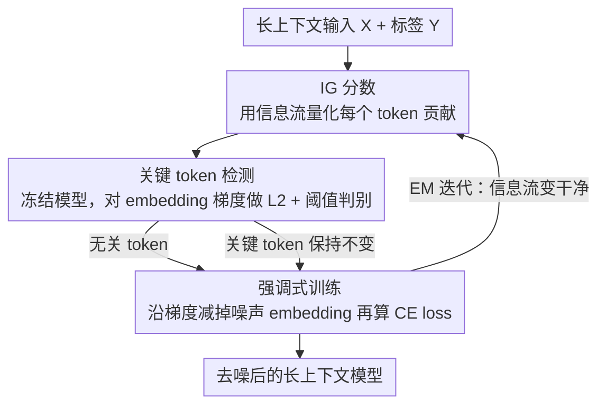

# Revisiting Long-context Modeling from Context Denoising Perspective

**会议**: ICLR 2026  
**OpenReview**: [https://openreview.net/forum?id=xvGyyh6MG7](https://openreview.net/forum?id=xvGyyh6MG7)  
**代码**: https://github.com/LCM-Lab/context-denoising-training  
**领域**: LLM效率  
**关键词**: 长上下文建模, 上下文去噪, 积分梯度, 关键 token 检测, 后训练  

## 一句话总结
本文把长上下文建模看成一个"信号去噪"问题：用积分梯度（IG）分数精确定位上下文里真正影响预测的关键 token，再用一个轻量的去噪训练策略 CDT 在输入端压制无关 token 的影响，让 8B 开源模型在 LongBench-E 上做到 50.92 分、逼近 GPT-4o 的 51.00 分。

## 研究背景与动机
**领域现状**：当前长上下文模型（LCM）能处理上百万 token 的输入，开源社区扩展长上下文能力的主流做法是用大量高质量合成长文本数据去后训练（post-train）模型——要么做上下文窗口扩展（context window scaling），要么做长上下文对齐（long-context alignment）。

**现有痛点**：这类"堆数据"的做法在资源受限时既低效又不一定有效。作者在受控实验里发现，用 Llama3-8B 训练 2B token，Prolong 每多 1B token 才涨 1.8 分，而上下文越长（128K）训练效率越低。根本原因是这些方法用的还是普通语言建模目标——逐 token 均匀的交叉熵监督，它没法在长输入里区分哪些 token 是关键的、哪些是噪声。

**核心矛盾**：LCM 实际上是以"先检索后生成"（retrieval-then-generation）的隐式方式工作的：先在上下文里定位关键信息，再基于这段"被检索到的上下文"继续生成。但关键 token 很容易被海量无关 token（上下文噪声）淹没，而均匀的 CE loss 又无法把监督信号集中到关键 token 上。

**本文目标**：(1) 找到一个能可靠区分关键 token 与噪声 token 的度量；(2) 设计一个能在训练时压制噪声、强化"关键 token → 预测"连接的训练策略，同时兼顾训练效率与显存。

**切入角度**：作者借用数字信号处理里"信号去噪"的视角——既然输入序列里混着噪声，那就在输入端把噪声减掉，让模型注意力自然聚焦到关键部分。关键观察是：传统基于 attention 分布的关键 token 检测会误把大量无关 token 也标成"被关注"，而基于"信息流"的度量能干净地把关键 token 和噪声分开。

**核心 idea**：用积分梯度（IG）分数度量每个 token 对预测的真实贡献来检测关键 token，再在训练输入端"减掉"无关 token 的梯度成分做去噪（Context Denoising Training），用 EM 式的迭代不断增强信息流。

## 方法详解

### 整体框架
CDT（Context Denoising Training）把长上下文后训练拆成两步循环：先**检测关键 token**——冻结模型、只对输入 token embedding 求一次梯度，梯度大的就是关键 token、梯度小的是噪声；再做**强调式训练（Emphasizing Training）**——把无关 token 的 embedding 沿其梯度方向"减掉"一点（去噪），然后解冻模型、用去噪后的 embedding 作为输入正常算 CE loss 反传更新。

这个过程是在线进行的（每步都重新检测、重新去噪），可以理解成一个期望最大化（EM）循环：模型基于当前的信息流检测噪声 → 通过抑制噪声改进训练 → 训练后信息流变得更干净 → 下一步检测更准。分析阶段用的是计算量很大的 IG 分数（最长只能算 12K 序列），训练阶段则用一个理论上与 IG 分数成正比、但显存友好得多的 **token embedding 梯度**来近似它，从而能扩展到 64K/128K 长序列。

### 关键设计

**1. IG 分数：用信息流而非 attention 来定位关键 token**

现有工作几乎都靠 attention 分布找关键 token，但作者用一个合成的多跳推理任务（上下文里混着支撑事实、干扰事实、无关文档、低频词）做精细分析后发现：基于 attention 的 FR 分数（Fact Retrieval score，统计某类 token 落入 top-$k$ attention 的比例）有个致命问题——无论模型答对答错，它都会在大量**无关 token** 上分配可观的注意力，区分度差。

为此作者改用积分梯度（Integrated Gradient）来刻画 token 之间的"信息流"。对第 $l$ 层第 $h$ 个 head，IG 矩阵定义为 attention 矩阵与其对 loss 的梯度的逐元素积：$IG_{h,l}=A_{h,l}^T\odot\left|\frac{\partial L_\theta(Y|X)}{\partial A_{h,l}}\right|$，其中 $IG_{h,l}[i,j]$ 估计的是 token $x_i$ 与生成 token $y_j$ 之间的双向信息流。把某类 token 集合 $T_r$ 对全部输出 $Y$ 的贡献求和、再对所有 head 和层求平均，得到该类 token 的 IG 分数 $IG^{(r)}$。实验显示：不论答对答错，关键 token 的 IG 分数都显著高于无关 token——它能干净地把噪声剥离出来，这是后面所有去噪操作的基础。

**2. 手动上下文去噪：在输入端"减梯度"就能放大关键 token 的注意力**

直接在 attention 里压制噪声很难，作者转而从输入端动手。先用 IG 分数挑出低于阈值的 token 当作噪声，再把这些 token 对应的梯度从它们的输入 embedding 里减掉。动机很具体：模型在这些噪声 token 上基本已经收敛，梯度敏感度低，减掉它们的梯度成分相当于"擦掉"输入里的噪声分量。结果很惊人——手动去噪后，关键 token 上的 attention 分数**直接放大约 ×10 倍**，无关 token 的注意力则略有下降。这一步验证了"输入端去噪 = 数字信号处理里的去噪"这个类比是真能 work 的，也为把它做成训练策略提供了直接证据。

**3. 用 embedding 梯度近似 IG 分数：让去噪能扩展到长序列**

IG 分数虽好，但算它要存下每一层全序列的 attention 梯度和权重，即便 8×92GB 的 H20 也只能算到 12K，长序列上根本不可行。作者从理论上推导出 **token embedding 梯度与 IG 分数成正比**（附录 C），于是改用 embedding 梯度做关键 token 判别器：冻结模型参数、只保留输入 embedding 的梯度，算一次 CE loss 反传得到每个 token 的 embedding 梯度，再把它的 L2 范数与全序列平均梯度比较——
$$I(x_i)=\begin{cases}1,& \|\nabla_{E_\phi(x_i)}L_{CE}(x_i)\|_2 < t\\ 0,& \|\nabla_{E_\phi(x_i)}L_{CE}(x_i)\|_2 \ge t\end{cases},\quad t=\frac{1}{n}\sum_{i=1}^{n}\|\nabla_{E_\phi(x_i)}L_{CE}(x_i)\|_2$$
$I(x_i)=1$ 表示该 token 是无关噪声（梯度小、已收敛），否则是关键 token。选 embedding 梯度有三个好处：易获取、梯度直接与 token 绑定、显存远小于 attention 梯度。

**4. 强调式训练：去噪输入 + 在线 EM，把监督信号压到关键 token 上**

定位到噪声后，CDT 只动无关 token 的 embedding、关键 token 保持不变：$E_\phi(x_i)'=E_\phi(x_i)-I(x_i)\nabla_{E_\phi(x_i)}\times lr\times\beta$，其中 $lr$ 是学习率、$\beta$ 控制去噪强度。然后解冻模型、用去噪后的 embedding 当输入继续训练，损失就是普通 CE：$L_{CDT}(X,Y)=L_{CE}(f_\theta(E_\phi(X)'),Y)$。整个检测—去噪在训练时**在线**进行（不是离线预计算），因此构成一个 EM 循环：每步先根据信息流识别关键 token，再通过抑制噪声改进训练，从而反过来增强信息流。代价上，它比标准 SFT 只多了一次轻量反传（绝大多数参数被冻结）和一次前向，wall-clock 开销很小——这正是它相比堆数据方法更"高效"的来源。

### 损失函数 / 训练策略
训练目标是去噪后输入上的交叉熵 $L_{CDT}=L_{CE}(f_\theta(E_\phi(X)'),Y)$。关键超参是去噪强度 $\beta$ 与学习率 $lr$，二者实际以乘积 $lr\times\beta$ 起作用：主实验取 $lr=1\text{e-}5$、$\beta=5$（即 $lr\times\beta=5\text{e-}5$）。学习率越大去噪越强、关键 token 注意力提升越明显，但存在饱和点（约 8e-5 后收益趋平）。训练数据上，窗口扩展和 LCM-Base 后训练用 PG-19（每条组织成 64K、共 10000 条），长上下文对齐用 LongMiT + LongAlpaca（8000 条、16K–128K）。CDT 约在 250 步后收敛。

## 实验关键数据

### 主实验
在 LongBench-E（12 个真实世界长上下文子任务，5 大类）上，三种设置（窗口扩展 CWS / 语言建模 LM / SFT）下 CDT 都拿到本组最佳，8B 开源模型逼近 GPT-4o：

| 模型 / 设置 | 类型 | Avg. |
|------|------|------|
| GPT-4o (2024-11-20) | - | 51.00 |
| Llama-3-8B-Base (8K) | - | 25.50 |
| + LongCE | CWS | 34.62 |
| **+ CDT (ours)** | CWS | **39.31** |
| Llama-3.1-8B-Base + LongCE | LM | 36.90 |
| **+ CDT (ours)** | LM | **38.89** |
| Llama-3.1-8B-Instruct | - | 48.61 |
| + LOGO (DPO) | DPO | 49.01 |
| **+ CDT (ours)** | SFT | **50.92** |

在 RULER（13 个合成子任务，32K–128K）、语言建模（LongPPL，越低越好）、BABILong（长程推理，4K–128K）上 CDT 同样领先：

| 模型 | RULER 128K | LongPPL↓ | BABILong Avg. |
|------|------|------|------|
| Llama-3.1-8B-Instruct | 76.71 | 4.05 | 40.67 |
| + LOGO | 77.68 | 4.11 | 42.00 |
| **+ CDT (ours)** | **78.72** | **2.36** | **43.30** |

### 消融实验

| 维度 | 关键发现 | 说明 |
|------|---------|------|
| 关键 token 检测对比 | CDT 检测到的支撑/干扰 token 最多、无关 token 最少 | attention 法误检大量无关 token；LongPPL 又漏检支撑 token |
| 去噪强度 $lr\times\beta$ | 去噪步后关键 token 注意力已显著提升，强调训练后再升一截 | 学习率越大去噪越强，但 8e-5 后饱和 |
| 训练预算 | 每 50 步比 SFT 多约 0.5h（8×A100），但 250 步内持续显著涨点 | 同步数下 DPO 仅小幅涨、SFT 甚至下滑 |

### 关键发现
- IG / embedding 梯度比 attention 更能区分关键 token 与噪声：attention 会在大量无关 token 上"假性聚焦"，而信息流视角下关键 token 的分数一致地远高于噪声。
- 仅在**输入端**减掉噪声 token 的梯度，就能把关键 token 的 attention 放大约 ×10 倍——说明长上下文失效很大程度上是"输入噪声淹没关键信息"，而非模型本身没看到。
- CDT 的提升来自 EM 式的良性循环：信息流和注意力分布随训练步同步变好，约 250 步收敛；额外开销只是一次轻量反传 + 一次前向，性价比远高于堆数据。
- 在 LCM-Base 上用 LM 目标后训练时，CDT 是唯一不会在某些子任务上明显掉分的方法（CE / LongCE 会在 Few-shot 等子任务掉 ~4 分）。

## 亮点与洞察
- **把长上下文建模重述成信号去噪问题**：这个类比不只是修辞，作者真把"减输入梯度=去噪"做成了可训练操作，并用 ×10 注意力提升坐实了它。
- **IG 难算就用 embedding 梯度近似**，并给出二者成正比的理论推导——这是让方法从 12K 上限扩展到 128K 的关键工程取舍，值得迁移到其他需要"信息流 / 显著性"但显存吃紧的场景。
- **在线 EM 视角**很优雅：检测和训练互相促进，而不是离线一次性打标签，天然适配训练中模型能力在变这一事实。
- 去噪只改无关 token、保持关键 token 不变，这种"选择性扰动输入 embedding"的思路可迁移到去偏、抗干扰、数据清洗等任务。

## 局限与展望
- IG 分数本身算不动长序列（12K 上限），实际训练全靠 embedding 梯度近似；近似的准确度依赖"成正比"这一推导成立的前提，极端分布下是否仍成立没有充分压力测试。
- 关键超参以 $lr\times\beta$ 的乘积形式起作用且存在饱和点，主实验靠经验取 $\beta=5$；跨模型/跨任务是否需要重调、对该乘积的敏感性还需更系统的扫描。
- 噪声判别用的是"梯度低于全序列平均"的硬阈值，本质是相对阈值，对 batch 内 token 分布敏感；阈值设计较朴素，可能误伤少数低梯度但语义关键的 token。
- 主要在 Llama-3/3.1-8B 上验证（附录有 Qwen 系列），更大规模、更长（>128K）以及非英文/代码任务上的表现仍待确认。

## 相关工作与启发
- **vs LongCE（token 重加权）**: LongCE 在 loss 端按 token 重要性重加权来逼近一个有限的 trade-off；CDT 则在**输入 embedding 端**直接去噪、再走标准 CE，既改了"模型看到什么"也改了"监督集中在哪"，在 SCM 上比 LongCE 平均高近 4.7 分。
- **vs LOGO / SEALONG（DPO/对齐类）**: 它们靠偏好优化做长上下文对齐，同步数下提升有限（SEALONG 仅 ~0.3 分）；CDT 用 SFT 形式却拿到 +2 分以上，且训练开销更可控。
- **vs FlexPrefill / X-Attention（KV-cache 预填充）**: 这类是推理期稀疏注意力，不改模型权重；CDT 是训练期方法，从根上增强模型对关键 token 的连接，二者正交可叠加。
- **vs RAG / Contriever**: 外接检索把"找关键信息"外包给检索器；CDT 坚持长上下文的隐式"检索-生成"范式，直接在模型内部强化这一能力，避免了工具链复杂度。

## 评分
- 新颖性: ⭐⭐⭐⭐⭐ 把长上下文建模重述为信号去噪、并用 IG/embedding 梯度落地，视角新且自洽
- 实验充分度: ⭐⭐⭐⭐ 覆盖 4 类任务、3 种设置和多基线，但主要集中在 8B 量级
- 写作质量: ⭐⭐⭐⭐ 分析—方法—实验逻辑清晰，EM 视角讲得明白
- 价值: ⭐⭐⭐⭐⭐ 轻量、可叠加、让 8B 逼近 GPT-4o，对资源受限的长上下文后训练实用性强

<!-- RELATED:START -->

## 相关论文

- [\[ICLR 2026\] Frayed RoPE and Long Inputs: A Geometric Perspective](frayed_rope_and_long_inputs_a_geometric_perspective.md)
- [\[ICLR 2026\] Revisiting Parameter Server in LLM Post-Training](revisiting_parameter_server_in_llm_post-training.md)
- [\[ICML 2025\] Long-Short Alignment for Effective Long-Context Modeling in LLMs](../../ICML2025/llm_efficiency/long-short_alignment_for_effective_long-context_modeling_in_llms.md)
- [\[ICLR 2026\] Long-Context Attention Benchmark: From Kernel Efficiency to Distributed Context Parallelism](long-context_attention_benchmark_from_kernel_efficiency_to_distributed_context_p.md)
- [\[ACL 2026\] CoMeT: Collaborative Memory Transformer for Efficient Long Context Modeling](../../ACL2026/llm_efficiency/comet_collaborative_memory_transformer_for_efficient_long_context_modeling.md)

<!-- RELATED:END -->
