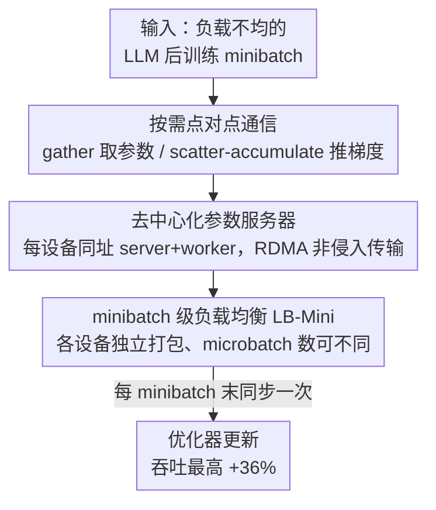

# Revisiting Parameter Server in LLM Post-Training

**会议**: ICLR 2026  
**OpenReview**: [https://openreview.net/forum?id=iIEEgI6WsF](https://openreview.net/forum?id=iIEEgI6WsF)  
**代码**: https://github.com/sail-sg/odc  
**领域**: LLM效率 / 分布式训练 / 后训练系统  
**关键词**: 参数服务器, FSDP, 点对点通信, 负载均衡, 后训练

## 一句话总结
针对 LLM 后训练中序列长度方差极大、设备负载严重不均的场景，本文把经典参数服务器（PS）思想重新引入现代分片数据并行：提出 On-Demand Communication（ODC），用点对点的 gather / scatter-accumulate 替换 FSDP 里逐层的 all-gather / reduce-scatter，把同步粒度从「每层一次」放松到「每个 minibatch 一次」，让快的设备不再被慢设备拖住，端到端最高比标准 FSDP 提速 36%。

## 研究背景与动机

**领域现状**：现代数据并行（DP）训练几乎一边倒地选择集合通信（collective communication）而非参数服务器。Ring-AllReduce、Horovod、NCCL 这套范式在带宽利用和可扩展性上都很优雅，FSDP / ZeRO 更是把它做到极致——通过把参数、梯度、优化器状态都分片到各设备，实现了万亿参数模型的显存友好扩展，成了 LLM 后训练和 RL 流水线的事实标准。

**现有痛点**：集合通信的高效有一个被长期默认、却很少被点破的前提——**负载均衡**。在视觉、语音、早期 NLP 里这个假设基本成立，但 LLM 后训练把它打破了。真实语料的序列长度方差极大（LongAlign 均值 16.5K、SWE-Smith 均值 34.7K），而注意力计算随长度平方增长、激活显存随长度线性增长，导致设备间持续的计算量失衡。FSDP 的问题尤其严重：它在每层前向前用 all-gather 重建参数、每层反向后用 reduce-scatter 聚合梯度，这种**逐层、细粒度的同步**隐含假设各设备步调一致。一旦负载不均，所有设备必须等最慢的那个完成集合通信才能进入下一层——本文实测显示，即便用上 SOTA 的 packing 策略，长序列 SFT 中设备空闲时间仍可高达 50%。

**核心矛盾**：现有研究大多在「找最优 packing / batching 方案」上做文章，但 packing 只能在 microbatch 内部削弱倾斜、无法消除它——尤其在显存约束下 minibatch 必须切成更小的 microbatch 时，packing 的解空间被压窄、同步点反而变多。问题的根本不在 batching，而在**通信模型本身**：逐层同步屏障是集合通信的产物，而非训练算法的要求，因此是「本可避免的」。

**本文目标**：在保留 FSDP 显存效率、去中心化、可扩展、简洁等核心优点的前提下，去掉逐层同步屏障，让负载不均时设备进度能解耦。

**切入角度**：回到数据并行的第一性原理——**每个设备的计算本质上是独立的**。经典 PS 架构正是靠「server 存参数、worker 各自算各自的、算完把梯度推回去」天然容忍 straggler。作者据此重新审视 PS，但不另起炉灶搭一个独立 PS，而是把 PS 的负载容忍能力「移植」进 FSDP。

**核心 idea**：把 FSDP 重新诠释为一个 **server 与 worker 角色同址（colocated）的去中心化参数服务器**，用点对点通信替换逐层集合通信，使同步粒度从层级放松到 minibatch 级。

## 方法详解

### 整体框架

ODC 的目标可以一句话概括：**在不改变训练语义（同步优化、逐 minibatch 更新一致）的前提下，把 FSDP 的逐层同步屏障拆掉**。它保留 FSDP 的显存布局和计算图，只把同步的集合调用换成异步友好的点对点原语。

具体地，ODC 做三件事的转换。第一，把每个 all-gather **拆解**成一串有目标的 gather 请求——某设备只在需要某层参数时，从持有对应分片的 peer 那里取它真正需要的分片；把每个 reduce-scatter 拆解成一串 scatter-accumulate——某设备算完梯度后，直接把梯度推给持有对应梯度分片的设备去累加。第二，把这套点对点收发架构理解为「去中心化 PS」：每个设备**同时**扮演 server（持有并管理一份参数 / 优化器状态分片）和 worker（在本地数据上跑前向反向），既镜像了 FSDP 的分片显存布局，又避开了中心化 PS 的网络瓶颈。第三，因为设备进度被解耦、不再要求各设备 microbatch 数目一致，负载均衡可以从拘谨的 microbatch 级上移到更宽松的 minibatch 级（LB-Mini）。最终把同步从「每层一次」放松到「每个 minibatch 末尾一次」，快设备不再空等慢设备。

### 关键设计

**1. 按需通信 ODC：把逐层集合屏障拆成点对点收发**

这是全文的核心，直击「逐层同步屏障导致快设备空等」这个痛点。FSDP 里 minibatch 运行时间被每层最慢设备决定：$T(P_M)=\sum_{m=1}^{M}\sum_{l=1}^{L}\max_{d} T_{m,d,l}(P_M)$——注意那个逐层、逐 microbatch 的 $\max_d$，正是空闲时间的来源。ODC 把集合调用按设备「分解」：all-gather 变成一组定向 gather（设备只取自己当前层需要的参数分片），reduce-scatter 变成一组 scatter-accumulate（设备把算好的梯度直接推到 owner 设备做累加）。这样每个设备「准备好就动」——需要参数就去拉、算完梯度就去推，不必等所有设备在同一层对齐。一个关键属性是这些传输是**非侵入的**：当设备 A 向设备 B 发起 gather / scatter-accumulate 时，不会打断 B 正在进行的计算。由此同步屏障从「每层一次」直接降到「每个 minibatch 末尾一次」，且优化语义与 FSDP 完全相同（仍是同步、逐 minibatch 一致更新），只是 straggler 效应被大幅削弱。

**2. 去中心化参数服务器：server 与 worker 同址，复用 FSDP 分片布局**

ODC 之所以能既拿到 PS 的负载容忍、又不丢 FSDP 的显存优势，靠的是把 PS「去中心化 + 同址」。经典 PS 用专门的 server 节点存模型状态，容易成为网络瓶颈；ODC 不设专用 server，而是把参数、梯度、优化器状态**均匀分片**到所有设备，让每个设备**既是 server**（拥有并管理一份分片，响应别人的 gather、为别人累加梯度）**又是 worker**（在本地数据上算前向反向）。这套布局与 FSDP 完全一致，所以无需重写显存管理，就把 PS 对异构负载的天然容忍嫁接了过来。实现上，ODC 不用 MPI / NCCL 这类要求收发双方显式有序参与、容易死锁、也不「按需」的消息库，而是直接走 RDMA 接口——节点内用 CUDA IPC、节点间用 NVSHMEM，让数据传输无需目标 server 主动参与（梯度累加由一个轻量 daemon 处理）；通信核基于 Triton-Distributed 实现，直接在 Python Triton kernel 里暴露 RDMA，省去底层 CUDA C。集成进 FSDP 也很轻：只需把集合通信调用换成 ODC 原语，并在 minibatch 末取回累加好的梯度。

**3. minibatch 级负载均衡 LB-Mini：把打包从狭窄的 microbatch 解放到整个 minibatch**

序列长度方差是失衡的根源，主流做法是 sequence packing，但它只能在 microbatch 级生效，有两个硬限制：其一，microbatch 大小被单卡显存卡死，能塞的样本数有限，设备间残余方差仍大，长序列场景尤甚；其二，长度为 $s$ 的样本激活显存约 $O(s)$、运行时约 $O(s^2)$，存在「显存与算力」的根本错配——若一个 microbatch 只装得下一条最长样本，再怎么用短样本打包都无法对齐它的运行时。ODC 解耦了各设备 microbatch 的执行，**取消了「每设备 microbatch 数必须相同」的隐含约束**，于是负载均衡可以上移：先以「总计算量均衡」为唯一目标把全局样本划分到各设备，再让每个设备**只受本地显存约束**地独立把自己的样本打包成 microbatch（数目可彼此不同）。这样既简化了打包算法，又因为是在更大、约束更松的样本集合上操作而获得更好的均衡。LB-Mini 只适用于 ODC（集合通信因要求各设备 microbatch 数一致而无法用它）。

## 实验关键数据

实验在 DeepSeek-R1-Distill-Qwen 系列（1.5B–32B）上、最多 32 张 A100 80G（节点内 NVSwitch、节点间 800 Gbps RoCE RDMA）进行，覆盖 SFT（LongAlign、SWE-Smith）与 RL（verl 上的 GRPO，AIME 提示）。对比维度是「通信方案 × 负载均衡算法」：通信方案有 Collective（基线）和 ODC；负载均衡有 LocalSort（排序不打包）、LB-Micro（microbatch 级打包强基线）、LB-Mini（本文 minibatch 级，仅 ODC 可用）。

### 主实验

| 任务 / 设置 | 对比 | ODC 相对 Collective 提速 | 说明 |
|------|------|------|------|
| SFT（LongAlign / SWE-Smith），打包场景 | ODC vs Collective（均 LB-Micro / LocalSort） | **最高 +36%** | packing 下增益最明显 |
| RL（AIME，GRPO on verl） | ODC vs Collective | 最高 +10% | 增益较小，受 verl「各设备样本数须一致」约束 + 长尾较弱所限 |
| minibatch size = 1 | 各方法 | ≈ 持平 | 此时 ODC 每样本同步一次，退化得与集合通信一致 |
| 长序列 SFT，FSDP 基线 | — | 设备空闲最高 **50%**（Table 6） | 即便用 SOTA packing 仍存在 |

### 参数研究（控制变量，golden 设置：1.5B / LongAlign(Max 64K) / minibatch 4 / 8 卡 / packing ratio 1）

| 变化因子 | 加速比趋势 | 原因 |
|------|---------|------|
| Minibatch size | 中等取值时达峰，再增大回落 | 大 batch 给基线更多打包灵活度 |
| Max length | 随长度单调增大 | 长序列放大平方级算力成本、加剧失衡 |
| Packing ratio | 随之下降 | 更大 packing 提升了基线打包效率 |
| 设备数 | 随之增大 | 设备越多异构性越强，解耦进度收益越大 |

### 关键发现
- **增益来自「消除空等」而非「减少通信量」**：ODC 不增加通信总量，只改变拓扑（点对点 RDMA），收益完全来自把逐层屏障拆掉、让快设备不再 idle。
- **小 minibatch 时 LB-Mini 优于 LB-Micro**，因为它允许各设备处理不同数目的 microbatch；minibatch 增大后 LB-Micro 有更多打包余地，两者差距收窄。
- **ODC 原语的通信带宽：节点内与集合通信相当，跨节点明显更慢**（图 11）——因为放弃了集合通信的层级化拓扑优化。但靠「通信与计算重叠」（每 microbatch 通信量随 $s$ 不变、计算量 $O(s^2)$，长序列下计算能掩盖通信）和「混合分片」（仿 ZeRO++，参数 / 梯度只在节点内分片、优化器状态跨节点分片）可有效缓解，长上下文评测中未见显著拖慢。

## 亮点与洞察
- **「老架构 + 新场景」的漂亮翻案**：参数服务器一度被集合通信淘汰，本文论证它在「负载天然不均」的 LLM 后训练里反而更合适——把一个被默认的前提（负载均衡）点破，是很有说服力的系统洞察。
- **不另起炉灶，而是嫁接**：没有去造一个独立 PS，而是把 PS 的负载容忍能力以「替换通信原语」的最小侵入方式塞进 FSDP，保留了 FSDP 全部显存 / 扩展优势，工程落地成本低（集成只需替换通信调用 + minibatch 末取梯度）。
- **同步粒度是可调旋钮**：把「层级同步 → minibatch 级同步」显式当作设计选择，自然引出后续「能否进一步放松到有界陈旧异步 SGD」的方向，思路可迁移到任何受 straggler 困扰的分布式训练。
- **负载均衡随通信模型一起被解放**：通信解耦后，打包从 microbatch 级上移到 minibatch 级，是「换了通信范式才打开的优化空间」，体现了通信模型与调度策略的耦合关系。

## 局限与展望
- **跨节点通信是短板**：点对点 RDMA 放弃了集合通信的层级化优化，跨节点带宽明显落后；目前靠计算掩盖通信 + 混合分片缓解，但在「每 microbatch token 数过小、无法掩盖通信」时仍需混合分片付出更高的单节点显存代价。
- **RL 增益受框架约束**：verl 要求各设备样本数一致，限制了 LB-Mini 的发挥，使 RL 提速（≤10%）远不如 SFT（≤36%）；作者选择不放松该约束以便集成，是工程权衡而非方法上限。
- **仍是同步语义**：当前刻意保留 minibatch 边界的同步更新以维持与 FSDP 一致的训练语义，尚未探索有界陈旧（bounded-staleness）等异步方案，其对 LLM 训练收敛的影响有待分析。
- **弹性 / 容错未落地**：PS 架构本应天然支持弹性扩缩与容错，但本文尚未把这些能力集成进 ODC，属未来工作。

## 相关工作与启发
- **vs FSDP / ZeRO（集合通信）**：FSDP 逐层 all-gather / reduce-scatter，隐含负载均衡假设、负载不均时空等严重；ODC 复用其分片布局，但换成点对点通信、把同步放松到 minibatch 级，在不均场景下显著更快，代价是跨节点带宽。
- **vs 经典 PS（DistBelief / Li et al. 2014）**：经典 PS 用专用 server 存模型状态、易成网络瓶颈；ODC 去中心化、server/worker 同址，复用 FSDP 显存布局，把 PS 的 straggler 容忍嫁接进现代分片 DP，且与 FSDP 分片机制直接集成是其新颖处。
- **vs sequence packing 系列（Krell et al. 2021 等）**：它们在 microbatch 级削弱倾斜、受单卡显存与「各设备 microbatch 数一致」所限；ODC 把负载均衡解放到 minibatch 级（LB-Mini），在更大、约束更松的样本集合上做均衡，效果更好。
- **vs ZeRO++**：ODC 的混合分片缓解方案借鉴 ZeRO++「参数/梯度节点内分片、优化器状态跨节点分片」的思路，用来消除跨节点 gather/scatter 开销。

## 评分
- 新颖性: ⭐⭐⭐⭐⭐ 把被淘汰的 PS 在 LLM 后训练这一新场景下翻案，并以最小侵入嫁接进 FSDP，视角新颖。
- 实验充分度: ⭐⭐⭐⭐ 覆盖 1.5B–32B、SFT/RL、参数研究与通信基准，较全面；但增益高度依赖场景，跨节点短板未完全解决。
- 写作质量: ⭐⭐⭐⭐⭐ 从第一性原理推导、图示清晰、动机与方法衔接自然。
- 价值: ⭐⭐⭐⭐⭐ 直击 LLM 后训练 / RLHF 基础设施的真实瓶颈，开源、易集成，实用价值高。

<!-- RELATED:START -->

## 相关论文

- [\[ICLR 2026\] CR-Net: Scaling Parameter-Efficient Training with Cross-Layer Low-Rank Structure](cr-net_scaling_parameter-efficient_training_with_cross-layer_low-rank_structure.md)
- [\[ICLR 2026\] MiSS: Revisiting the Trade-off in LoRA with an Efficient Shard-Sharing Structure](miss_revisiting_the_trade-off_in_lora_with_an_efficient_shard-sharing_structure.md)
- [\[ACL 2026\] Small Data, Big Noise: Adversarial Training for Robust Parameter-Efficient Fine-Tuning](../../ACL2026/llm_efficiency/small_data_big_noise_adversarial_training_for_robust_parameter-efficient_fine-tu.md)
- [\[ICLR 2026\] AutoSP: Unlocking Long-Context LLM Training Via Compiler-Based Sequence Parallelism](autosp_unlocking_long-context_llm_training_via_compiler-based_sequence_paralleli.md)
- [\[ICLR 2026\] SpareTrain: Fault-Tolerant LLM Training via Low-Cost Dual Modular Redundancy](sparetrain_fault-tolerant_llm_training_via_low-cost_dual_modular_redundancy.md)

<!-- RELATED:END -->
