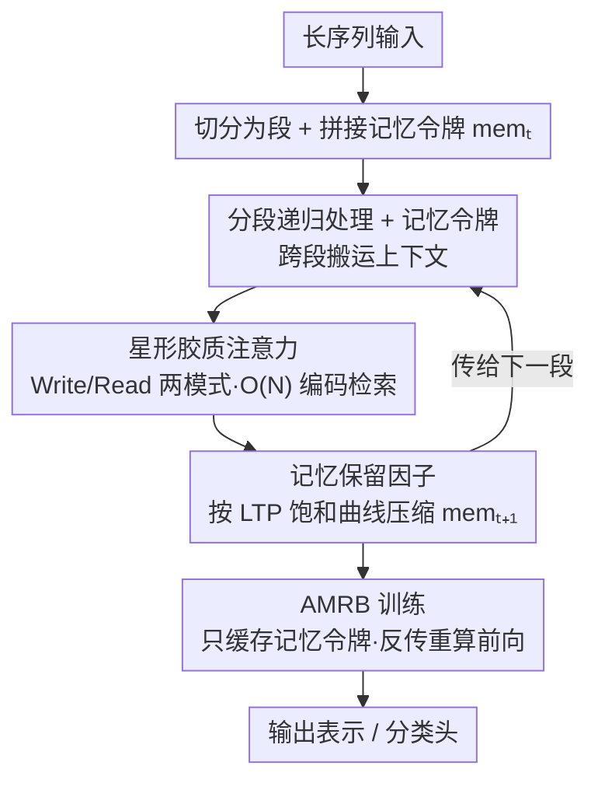

# RMAAT: Astrocyte-Inspired Memory Compression and Replay for Efficient Long-Context Transformers

**会议**: ICLR 2026  
**OpenReview**: [https://openreview.net/forum?id=sTkJdbVxsI](https://openreview.net/forum?id=sTkJdbVxsI)  
**代码**: https://github.com/NeuroCompLab-psu/RMAAT.git  
**领域**: LLM效率 / 长上下文 / 类脑计算  
**关键词**: 长上下文, 线性注意力, 递归记忆, 星形胶质细胞, 记忆压缩

## 一句话总结
RMAAT 把生物学里"星形胶质细胞"调控记忆的两类机制搬进 Transformer：用短时可塑性（STP）启发的线性复杂度注意力替换 $O(N^2)$ 自注意力、用长时可塑性（LTP）饱和曲线导出的"记忆保留因子"对跨段记忆令牌做自适应压缩，再配一套只缓存记忆令牌、反传时重算前向的 AMRB 训练算法，在 Long Range Arena 上把平均准确率从 RMT 的 63.6% 提到 68.0%，峰值显存却只有递归基线的约 1/4。

## 研究背景与动机

**领域现状**：Transformer 的自注意力是序列建模的事实标准，但其计算/显存都随序列长度平方增长（$O(N^2)$），处理长序列时成为硬瓶颈。主流提效路线几乎都在"改架构"上做文章——稀疏注意力（Longformer、BigBird）、线性注意力近似（Linear Transformer、Performer）、状态空间模型（S4、Mamba）、以及各种递归/记忆结构（Transformer-XL、RMT、RetNet、RWKV）。

**现有痛点**：这些方法大多是纯数学或纯结构上的优化。一类递归记忆方法（如 RMT、Memformer）虽然用"记忆令牌"在分段之间搬运上下文，但记忆的更新依赖外挂的、人为设计的机制，缺乏统一的压缩原理；而它们的训练仍走标准 BPTT，需要存下整段序列的激活，显存代价巨大。另一类类脑计算则几乎只盯着"神经元"本身的活动，忽略了大脑里同样参与记忆调控的其他细胞类型。

**核心矛盾**：长程依赖建模要求"把很久之前的信息一直带着"，但带着信息又意味着记忆必须有界、要压缩；同时递归训练要省显存就得少存激活，少存激活又会破坏梯度回传。如何在"记多久 vs 占多少显存"、"省显存 vs 可训练"之间找到一个有原理依据、而不是拍脑袋的折中，是没被解决的问题。

**切入角度**：作者注意到生物学里星形胶质细胞（astrocyte，一类胶质细胞）恰恰在调控突触可塑性、记忆巩固上扮演关键角色，且天然带有两种不同时间尺度的动力学——快尺度的短时可塑性（STP）负责快速调制与空间上下文，慢尺度的长时可塑性（LTP）负责把活动随时间积分、逐渐饱和地巩固成长期记忆。这种"快慢分工 + 自然饱和压缩"的结构，正好对应到序列模型里"段内注意力 + 跨段记忆压缩"的需求。

**核心 idea**：把 STP 蒸馏成段内的线性复杂度"星形胶质注意力"，把 LTP 的饱和动力学蒸馏成一条跨段的"记忆保留因子"压缩日程表，并据此设计只缓存压缩记忆、反传时重放（重算）前向的 AMRB 训练算法——用神经-胶质原理统一回答了上面三个折中。

## 方法详解

### 整体框架

RMAAT 是一个**分段递归**的 Transformer：长序列先被切成若干不重叠的连续段（每段长度 $N_{seg}$ 可控），核心层按段顺序处理，而不是一次性吞下整条序列。每段内部除了真正的输入 token，还拼上一组 $M$ 个**记忆令牌（memory tokens）** $\text{mem}_t$，它们像一条贯穿全程的"记忆带"：段 $t$ 处理完后，对应记忆令牌的输出就成为下一段 $t+1$ 的输入记忆，递归地把上下文往后传。

整套流程有三个互相咬合的部件：① 段内用 **Astromorphic Attention**（STP 启发）做线性复杂度的上下文编码与检索，替换掉昂贵的 $O(N^2)$ 自注意力；② 记忆令牌跨段传递时，用从 LTP 饱和曲线导出的 **记忆保留因子** 对其缩放，实现自适应压缩；③ 训练时用 **AMRB** 算法，前向只缓存各段之间的记忆令牌、反传时逐段重算前向，绕开标准 BPTT 存全序列激活的显存爆炸。三者并非各自独立：压缩让记忆变成一小撮令牌，正是 AMRB 能只缓存这一小撮、放弃逐 token 回传的前提。

### 关键设计

**1. 分段递归处理与记忆令牌：把长序列拆成段、用一条记忆带跨段传上下文**

这是绕开 $O(N^2)$ 的第一步：与其在整条长序列上算注意力，不如把序列切成若干段长为 $N_{seg}$ 的小段逐段处理，平方复杂度就被限制在段内。但分段会切断长程依赖，于是 RMAAT 在每段里额外引入 $M$ 个持久的记忆令牌：段 $t$ 起始时记忆状态记作 $\text{mem}_t$，它和该段输入 token $x_t$ 一起进入段内注意力被联合处理，处理完得到的记忆令牌输出就是 $\text{mem}_{t+1}$，再喂给段 $t+1$。这样上下文就以"记忆令牌"为载体在段间递归流动。

它和 RMT、Memformer 的区别在于记忆**怎么更新**：那些方法靠外挂的、独立于主体计算的机制管理记忆槽，而 RMAAT 的记忆更新被内在地绑定到后面那套源自计算宏模型的动力学（保留因子）上，是一套更统一、计算上更自洽的记忆管理方式，而非额外拼上去的模块。

**2. Astromorphic Attention：用 STP 启发的 Write/Read 两模式做 $O(N)$ 注意力**

段内若还用标准 softmax 注意力，分段就白分了。RMAAT 把它换成线性复杂度的星形胶质注意力，灵感来自三方突触（tripartite synapse）的 STP 动力学，整套被建模成一个两层神经元-星形胶质网络，分 Write 和 Read 两个连续模式。输入 $X\in\mathbb{R}^{N\times d}$（$N=N_{seq}+M$）先线性投影出 $K=XW_K$、$Q=XW_Q$、$V=XW_V$，并经非线性 $\phi$（如 $\phi(x)=\text{elu}(x)+1$）激活。

Write 模式把整段上下文先"聚合"成与 $N$ 无关的小矩阵：神经元 Hebbian 权重 $H_{neuron}=\frac{1}{m}\phi(K)^T V$ 捕捉键-值直接相关，星形胶质调制 Hebbian 权重 $H_{astro}=\frac{1}{m}\phi(R)^T V$ 通过相对位置编码 $\phi(R)$ 注入空间上下文，再算一个突触前状态 $g=\big(\sum_{t=1}^{N}\phi(k_t)\big)^{\alpha}$ 抽象星形胶质对累积键活动的钙响应。Read 模式再用查询去检索：先算交互强度 $C=\phi(Q)g^T$，由此得到反馈因子 $P=1/C$（突触前可塑性反馈），用它对合并权重 $H=H_{neuron}+H_{astro}$ 做 Hadamard 调制，最后

$$L=\phi(Q)(H\odot P)+X$$

得到段内更新表示。关键在于 $H$、$g$ 这些中间聚合量每段只算一次且维度与 $N$ 无关，最后只剩 $\phi(Q)$ 与之做线性规模的矩阵-向量运算，因而整体是 $O(N)$，避免了平方代价。其中 $R$ 用基于距离的指数衰减 $r_{ij}=\exp(-\lVert pos_i-pos_j\rVert\times scale)$ 构造相对位置编码，作者把这种空间衰减与仿真里星形胶质过程"近活动中心响应更强"的现象做了对应，给位置编码补了一层生物学动机。

**3. 记忆保留因子：把 LTP 饱和曲线变成一张跨段自适应压缩表**

记忆令牌若每段原样累加会无界膨胀。作者从详细的神经-星形胶质计算模型出发（贡献 1 的"计算宏模型"），仿真发现 LTP 相关状态 $p^l_{ij}$ 随一轮轮 STP 周期**逐渐积分、持续累加、最终饱和**，于是把这条饱和曲线蒸馏成一个与具体架构无关的宏模型；再据此（贡献 2）导出一个把饱和曲线落地成具体压缩日程的"记忆保留因子"。把宏模型饱和时的总记忆容量归一化为 1，则对总段数为 $T$ 的序列，第 $t$ 段的保留因子为

$$\text{RetentionFactor}(t,T)=\frac{\Delta p^l_t}{\sum_{i=1}^{T}\Delta p^l_i}$$

其中 $\Delta p^l_t=p^l(t\cdot\tau_{cycle})-p^l((t-1)\cdot\tau_{cycle})$ 是该段内 LTP 状态的增量。这个因子随段序号递增而递减、随总序列变长而整体下移，所以更新记忆时做 $\text{mem}_{t+1}=\text{RetentionFactor}(t,T)\times \text{mem}'_{t+1}$，相当于让越靠后/越长的上下文被压得越狠，记忆始终有界。与 RMT 那种固定大小、靠标准机制更新的外置记忆槽相比，这里的压缩节奏是由 LTP 动力学"算出来"的、非学习的，自带生物学依据，也正是它让后面的高效训练成为可能。

**4. AMRB 训练算法：只缓存记忆令牌、反传时重放（重算）前向**

标准 BPTT 在长序列上要存下整段所有激活，显存吃不消。AMRB 利用 RMAAT 记忆已被压缩成一小撮令牌这一点：前向过 $T_{seg}$ 段时，只把段间传递的记忆令牌序列 $(\text{mem}_1,\dots,\text{mem}_{T_{seg}+1})$ 存进一个 replay buffer，不存段内中间激活。反传时逐段进行——要算第 $t$ 段梯度，就从 buffer 取出 $\text{mem}_t$，只对这一段用 $x_t$ 重新跑一遍前向，临时生成局部激活；来自 $t+1$ 段的梯度再沿重算出的第 $t$ 段（含记忆更新路径）回传，逐段往前推。"replay"正指这种用存好的记忆状态做起点、反传时重算前向的过程。由于只缓存 $M$ 个（通常很小）记忆令牌，显存被大幅压低；虽然要重算前向，但在很长序列上省下的显存往往压过重算开销，反而更快。作者强调这条与设计 3 是关键协同：消融里去掉压缩会显著掉点，说明正是"有原理的压缩"让省显存的 AMRB 真正有效。

## 实验关键数据

### 主实验

在 Long Range Arena（LRA）五个任务上从头训练，对比标准 Transformer、各类高效 Transformer，以及三个同架构（iso-architecture）基线：AT（有星形胶质注意力但无递归记忆）、RMT（递归记忆但用标准注意力）、RLT（递归线性注意力但无保留因子/AMRB）。括号内为使用段数，Mem 为峰值显存（GB）。

| 模型 | ListOps(2K) | Text(4K) | Retrieval(8K) | Image(1K) | Pathfinder(1K) | 平均Acc | 峰值显存 |
|------|------|------|------|------|------|------|------|
| Transformer | 36.4 | 64.3 | 57.5 | 42.4 | 71.4 | 54.4 | 4.7–7.8 |
| RMT | 37.4 | 65.0 | 79.3 | 54.6 | 81.5 | 63.6 | 12.7–24 |
| RLT | 18.4 | 64.8 | 78.4 | 55.0 | 74.9 | 58.3 | 12.1–22.6 |
| **RMAAT (本文)** | **38.9** | **65.9** | **83.2** | **64.8** | **87.1** | **68.0** | **3.4–5.3** |

RMAAT 平均准确率 68.0%，比同架构最强基线 RMT 高 4.4 个百分点，长上下文的 Retrieval（83.2%）和 Image（64.8%）提升尤为明显；而峰值显存只有 3.4–5.3 GB，约为 RMT（12.7–24 GB）的四分之一到五分之一。

吞吐方面（相对 RMT 基线），RMAAT 在 Retrieval 上达 1.73× 加速，ListOps/Text 上 1.5×，得益于 $O(N)$ 注意力 + AMRB 的组合；仅 Pathfinder 上为 0.95×。

### 消融实验

主要在 Byte-Level Document Retrieval(8K) 上做。

| 配置 | 关键指标 | 说明 |
|------|---------|------|
| Full RMAAT | Retrieval 83.2% / 3.4 GB | 完整模型 |
| w/o 记忆保留因子 | Retrieval 83.2→80.5%（显存不变） | 压缩缺失，掉 2.7 点；Text 同样 65.9→64.9% |
| AMRB → 标准 BPTT | 精度相近，显存 3.4→15.0 GB（约 4.4×） | Text 5.1→22.0 GB（约 4.3×） |
| RLT + AMRB | Retrieval 79.2% / 3.4 GB | 把保留因子+AMRB 加到 RLT，仍低于 RMAAT 的 83.2% |

### 关键发现
- **压缩与训练算法是协同而非独立**：去掉保留因子掉 2.7 点却不省显存，说明压缩主要贡献精度；把 AMRB 换回 BPTT 精度几乎不变但显存暴涨约 4.4×，说明 AMRB 主要贡献显存——正是压缩把记忆变小，AMRB 才能只缓存它，二者缺一不可。
- **星形胶质注意力组件本身有用**：RLT+AMRB（用了压缩+AMRB 但缺 $H_{astro}$ 和反馈因子 $P$）只有 79.2%，落后完整 RMAAT 的 83.2%，证明 $H_{astro}$/$P$ 等成分有独立增益。
- **模型受益于完整长上下文**：把总段数从 16（8K）降到 8（4K）、4（2K），Retrieval 从 83.2% 跌到 71.5%、65.3%，说明分段策略确实在用满长上下文。

## 亮点与洞察
- **把生物"快慢双尺度"映射成"段内注意力 + 跨段压缩"**：STP→线性注意力、LTP→记忆压缩这套对应关系不是生搬硬套的比喻，而是真的导出了可计算的因子和算法，是难得把神经科学落到可训练模型的范例。
- **保留因子是"算出来的"非学习压缩**：压缩节奏直接来自 LTP 饱和曲线、不靠反传学习，既省了可学参数又自带"越长压越狠"的资源约束直觉，这种"用先验动力学定 schedule"的思路可迁移到其他需要有界记忆的递归结构。
- **压缩-训练的协同设计**：先把记忆压成一小撮令牌，再让训练算法只缓存这一小撮——"为了让省显存的训练成立，先把要存的东西变小"这个因果链很值得借鉴。

## 局限与展望
- **评测仅限 LRA**：作者承认目前主要在 Long Range Arena 上验证，缺更丰富的视觉/多模态、更大模型规模的检验，结论的普适性待考。
- **需要预先知道总序列长度**：保留因子依赖总段数 $T$ 来归一化，难以直接用于真·流式/在线场景（总长未知），作者列为未来工作。
- **缺与 SSM 的正面对比与理论分析**：主表未直接和 Mamba 等状态空间模型同条件比较，也缺乏与相关序列模型形式化的深入理论关联。
- **生物对应偏"启发"**：很多映射（如 $P=1/C$、$g$ 的指数 $\alpha$）是定性抽象，部分实现细节在附录，复现时需以原文/代码为准。

## 相关工作与启发
- **vs RMT**：同为分段递归 + 记忆令牌，但 RMT 用标准 $O(N^2)$ 注意力、外置记忆槽 + 标准 BPTT；RMAAT 换成 $O(N)$ 星形胶质注意力、LTP 导出的自适应压缩 + AMRB，平均精度 +4.4、显存降约 4×。
- **vs AT（Astromorphic Transformer）**：AT 有星形胶质注意力但无递归与记忆，只能处理短上下文；RMAAT 把它扩展到长上下文递归框架并补上记忆机制。
- **vs RLT / Linear Transformer**：RLT 是带记忆令牌的递归线性注意力但缺保留因子、AMRB 与增强位置编码/非线性；消融显示加上这些后（RMAAT）Retrieval 从 78.4% 提到 83.2%。
- **vs 神经调制 Hebbian 可塑性（Miconi 等）**：那类工作在 RNN 里学习调制结构，而 RMAAT 把定性调制结构和时间尺度从神经-星形胶质仿真里固定下来，只学下游架构参数。

## 评分
- 新颖性: ⭐⭐⭐⭐⭐ 把星形胶质 STP/LTP 双尺度系统性地映射成线性注意力+记忆压缩+重放训练，角度新且自洽。
- 实验充分度: ⭐⭐⭐⭐ LRA 五任务 + 同架构消融扎实，但仅限 LRA、缺 SSM 正面对比与大规模验证。
- 写作质量: ⭐⭐⭐⭐ 生物-算法对应讲得清楚，但部分关键实现散在附录、符号偏多。
- 价值: ⭐⭐⭐⭐ 在长上下文上同时拿到精度与显存优势，且压缩-训练协同思路可迁移。

<!-- RELATED:START -->

## 相关论文

- [\[ICLR 2026\] MeSH: Memory-as-State-Highways for Recursive Transformers](mesh_memory-as-state-highways_for_recursive_transformers.md)
- [\[ACL 2026\] CoMeT: Collaborative Memory Transformer for Efficient Long Context Modeling](../../ACL2026/llm_efficiency/comet_collaborative_memory_transformer_for_efficient_long_context_modeling.md)
- [\[ICLR 2026\] MemAgent: Reshaping Long-Context LLM with Multi-Conv RL-based Memory Agent](memagent_reshaping_long-context_llm_with_multi-conv_rl-based_memory_agent.md)
- [\[ICLR 2026\] Developmental Federated Tuning: A Cognitive-Inspired Paradigm for Efficient LLM Adaptation](developmental_federated_tuning_a_cognitive-inspired_paradigm_for_efficient_llm_a.md)
- [\[ICLR 2026\] IceCache: Memory-Efficient KV-cache Management for Long-Sequence LLMs](icecache_memory-efficient_kv-cache_management_for_long-sequence_llms.md)

<!-- RELATED:END -->
