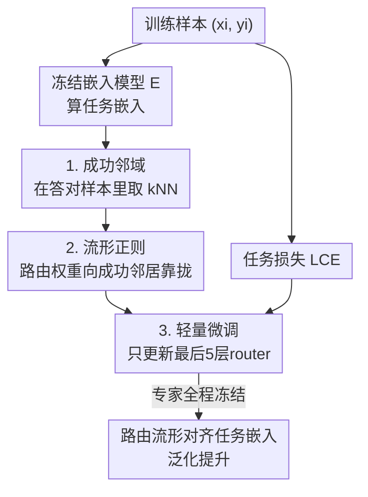

# Routing Manifold Alignment Improves Generalization of Mixture-of-Experts LLMs

**会议**: ICLR 2026  
**OpenReview**: [https://openreview.net/forum?id=3lskwxB653](https://openreview.net/forum?id=3lskwxB653)  
**代码**: 有（论文提供链接）  
**领域**: LLM效率 / Mixture-of-Experts  
**关键词**: MoE路由, 流形对齐, 流形正则, 路由后训练, 泛化

## 一句话总结
本文提出 RoMA（Routing Manifold Alignment），通过在后训练目标里加一个"流形正则项"，只轻量微调 MoE LLM 最后几层路由器，让语义相似样本共享相似的专家选择，在三个 MoE 模型上把准确率提升 7–15%，且不增加推理开销。

## 研究背景与动机

**领域现状**：稀疏 MoE 已成为扩展 LLM 容量的主流架构——它能在不显著增加推理算力的前提下放大模型规模。每层的核心是一个**路由器（router）**，根据 token 的隐藏表示算出一组路由权重，把 token 分派给少数几个专家。路由器参数极少（7B 模型里仅占 0.03%），却是 MoE 能否发挥专家分工的关键。

**现有痛点**：作者在广泛下游任务上评测发现，现有 MoE LLM 的路由器系统性地"路由次优"。他们构造了一个 oracle 上界 $r^*_i$——对每个样本，从预训练路由权重出发、用真实标签做梯度下降直到收敛，得到能让模型答对的最优路由。结果发现预训练路由器与 oracle 之间存在 **10–20% 的准确率鸿沟**，说明现有路由器有大量未被挖掘的潜力。

**核心矛盾**：作者把鸿沟的根源定位到一个几何现象——**任务嵌入流形与路由权重流形的错位**。用 UMAP 可视化 ARC-C 样本可以看到：任务嵌入空间里语义相似的样本聚成清晰的簇（Figure 3a），但预训练路由权重却把同一语义簇的样本打散到路由空间各处（Figure 3b），毫无对应的簇结构。这意味着路由器没有捕捉到任务结构，对语义相关的输入做出了不一致的专家选择，破坏了 MoE "为相关输入复用专家、共享技能"的初衷。而 oracle 路由权重（Figure 3d）恰恰呈现出与任务嵌入一致的簇结构。

**本文目标**：把路由权重流形对齐到任务嵌入流形，让语义相似的样本共享相似的跨层专家选择，从而缩小与 oracle 的鸿沟、提升泛化。

**切入角度**：流形正则（Manifold Regularization）是机器学习里成熟的技术，原本用于在低维表示/输出上保持高维输入的局部邻域结构。作者把它从"作用在最终输出"改造为"作用在跨层路由权重"，并把邻域定义在**任务嵌入空间**而非原始输入上，从而在专家选择与任务理解之间建立绑定。

**核心 idea**：用任务嵌入流形当"老师"，把每个样本的路由权重往它"成功邻居"（答对的语义近邻）的路由权重靠拢——只微调路由器，就能统一"任务理解"（嵌入模型）与"解答生成"（MoE）。

## 方法详解

### 整体框架
RoMA 是一个**路由器后训练**方法：基础 MoE LLM 的全部专家参数冻结，只对路由器做轻量微调。对训练集中每个样本 $(x_i,y_i)$，先用一个冻结的嵌入模型 $E(\cdot)$ 把它的任务描述映射到语义空间；然后在已经被模型答对的"成功样本"集合里、按任务嵌入相似度找出它的 $k$ 近邻（成功邻域）；训练目标在常规任务损失之外，额外加一个**流形正则项**，惩罚当前样本与成功邻居之间的路由权重差异，使语义相似样本的路由权重相互靠拢。梯度只回传更新路由器参数，且实测只调**最后五层**路由器即可。最终路由权重流形被"拉"成与任务嵌入一致的簇结构，逼近 oracle，泛化随之改善。

### 关键设计

**1. 成功邻域：只模仿"答对样本"的路由，避免传播次优策略**

朴素地"让相似样本路由相似"有个陷阱：如果邻居本身就路由错了，对齐反而会把错误扩散。RoMA 先筛出训练集中模型**预测正确**的样本子集 $S=\{j:\,f(x_j,r_j)=y_j\}$，只在 $S$ 里为每个样本 $x_i$ 构造邻域。邻域用任务嵌入空间的相似度定义，可选 $k$-NN 或 $\epsilon$-ball，相似度采用高斯核 $\text{sim}(E(x_i),E(x_j))=\exp\!\big(-\|E(x_i)-E(x_j)\|_2^2/2\sigma^2\big)$。这样每个样本只向"语义相近且确实答对"的邻居学习路由模式，从源头上保证被模仿的是成功的专家选择。消融显示随机选邻居几乎无提升（67.8% vs 基线 67.6%），而 $k=3$ 的 $k$-NN 最稳（76.2%），印证了"成功 + 语义近"这两个约束缺一不可。

**2. 流形正则：把路由权重流形对齐到任务嵌入流形**

这是 RoMA 的核心。先把样本间的归一化邻接权重定义为
$$W_{i,j}\triangleq\frac{\text{sim}(E(x_i),E(x_j))}{\sum_{j\in N(x_i)}\text{sim}(E(x_i),E(x_j))},\quad j\in N(x_i),$$
语义越相似权重越大。然后对样本 $x_i$ 的（跨 $L$ 层拼接而成的）路由权重 $r_i$ 施加流形正则
$$L_{\text{manifold}}(i)\triangleq\sum_{j\in N(x_i)}W_{i,j}\,\|r_i-r_j\|_2^2.$$
它惩罚语义相似样本之间的路由差异 $\|r_i-r_j\|_2$，逼着路由流形去复刻任务嵌入流形的局部邻域结构，等价于把每个样本的路由权重往成功邻居处"搬"。与传统流形正则作用在最终输出不同，这里作用在跨 MoE 层的路由权重上，绑定的是"专家选择 ↔ 任务嵌入"而非"输出 ↔ 原始输入"。为保证对齐后的路由仍能答对，最终目标把它和交叉熵任务损失合在一起，用系数 $\lambda$ 平衡：$L_{\text{RoMA}}(i)=L_{\text{task}}(i)+\lambda\cdot L_{\text{manifold}}(i)$。消融里它把准确率从基线 67.6% 拉到 76.2%，显著超过 L1（68.2%）、L2（71.5%）、熵正则（70.7%），说明"任务嵌入空间的几何对齐"比通用的稀疏/熵约束是更强的归纳偏置。

**3. 轻量微调：冻结专家、只调最后五层路由器**

RoMA 把全部专家参数冻结，只对路由器参数 $\theta_{\text{router}}$ 做梯度下降 $\theta^{(t+1)}_{\text{router}}=\theta^{(t)}_{\text{router}}-\eta\nabla_{\theta_{\text{router}}}L_{\text{RoMA}}$。路由器只占基础模型 **0.0095%** 的参数，且推理时路由计算方式不变，因此**不增加任何推理开销**——这与需要测试时优化、算力 6–7× 的 C3PO 形成鲜明对比。进一步地，作者发现不必微调所有层：层选择消融显示最后五层（L5）达到最高 76.2%，甚至超过全层（75.1%），说明靠后的层对路由质量更关键，选择性正则少数关键层既更有效也更省训练成本。Token 选择上也是"少而精"——只用最后 1 个 token 的路由权重（Last1，76.2%）优于聚合多个 token，因为末位 token 含更丰富的任务相关信息。

## 实验关键数据

### 主实验
在 OLMoE-7B-A1B、DeepSeekMoE-16B-A3B、Qwen3-30B-A3B 三个 MoE 上微调路由器，八个 benchmark 平均（GSM8K 为 OOD）。RoMA 全面超过 ICL、Router/Prefix/Prompt Tuning、Dense BP，与 C3PO 相当或更优但无额外推理成本。

| 模型 / 方法 | MMLU | HellaSwag | ARC-C | 八项平均 |
|------|------|------|------|------|
| OLMoE Base | 57.8 | 77.9 | 51.3 | 67.6 |
| OLMoE + C3PO | 65.5 | 85.3 | 66.3 | 75.7 |
| **OLMoE + RoMA** | **69.0** | **86.7** | **67.2** | **76.2** |
| OLMoE Oracle（上界） | 72.2 | 91.5 | 74.8 | 81.1 |
| DeepSeekMoE Base | 46.2 | 78.0 | 50.3 | 66.6 |
| **DeepSeekMoE + RoMA** | **56.8** | **87.9** | 61.4 | **74.7** |
| Qwen3-30B Base | 74.2 | 68.5 | 56.8 | 74.0 |
| **Qwen3-30B + RoMA** | **78.8** | 74.8 | **65.5** | **79.5** |

MMLU 上 RoMA 把 DeepSeekMoE 提升 +10.6%、OLMoE 提升 +11.2%。更亮眼的是跨规模对比：仅 1B 激活参数的 OLMoE+RoMA（MMLU 69.0、HellaSwag 86.7）超过若干 7–8B 乃至 13B 的稠密模型；3B 激活的 Qwen3+RoMA（MMLU 78.8）超过 27–34B 稠密模型。

### 消融实验（均在 OLMoE，八项平均准确率）

| 维度 | 配置 | 平均准确率 | 说明 |
|------|------|---------|------|
| 基线 | OLMoE Base | 67.6 | — |
| 正则方法 | L1 / L2 / 熵 | 68.2 / 71.5 / 70.7 | 通用约束提升有限 |
| 正则方法 | **流形正则（本文）** | **76.2** | 几何对齐是更强归纳偏置 |
| 层选择 | 单层 / 双层 / 全层 | ~69 / >71 / 75.1 | — |
| 层选择 | **最后五层 L5** | **76.2** | 超过全层 |
| 邻域 | 随机 / ε=0.5 / k=3 | 67.8 / 74.1 / 76.2 | 随机几乎无效 |
| Token | First1 / Middle1 / **Last1** | 71.4 / 69.2 / **76.2** | 末位 token 信息最丰富 |
| 训练数据量 | 10% / 30% / 100% | 68.5 / 70.8 / 76.2 | 30% 已有可观增益 |

### 关键发现
- **流形正则是真正的贡献来源**：换成 L1/L2/熵正则最高只到 71.5%，而流形正则达 76.2%，证明提升来自"任务嵌入几何对齐"而非单纯加约束。
- **"少而精"贯穿全方法**：最后五层 > 全层、Last1 > 多 token、k=3 > k=1/5——选择性、低成本的配置反而最优。
- **数据高效**：仅用 30% 训练数据就把基线 67.6% 提到 70.8%，全量到 76.2%。
- **对嵌入模型不敏感**：从 22M 的 all-MiniLM 到 7.8B 的 Qwen-embedding，提升稳定在 +3.6%~+8.6%。

## 亮点与洞察
- **把"路由优劣"重新表述成"流形错位"**：作者用 oracle 上界量化了 10–20% 的路由鸿沟，又用 UMAP 把根因可视化为任务嵌入簇与路由权重散点的错位，诊断和解法一气呵成，非常有说服力。
- **只模仿成功邻居**这一步看似简单却关键——它把"流形对齐"从可能扩散错误的危险操作变成了只学习正确专家选择，随机选邻居的对照（几乎无提升）反衬出其必要性。
- **0.0095% 参数、零推理开销**换来 7–15% 提升，性价比远超需要 6–7× 推理算力的测试时优化方法 C3PO，这种"训练侧轻改、推理侧不动"的思路很适合工程落地。
- **统一任务理解与解答生成**：用嵌入模型的几何结构去监督 MoE 的专家选择，这个"让理解端引导执行端"的范式可迁移到其他需要路由/选择的稀疏架构。

## 局限与展望
- 流形正则依赖一个外部嵌入模型来定义任务相似度，虽然论文显示对嵌入模型规模不敏感，但额外引入了对预训练嵌入质量的依赖，且需要先跑一遍模型筛选"成功样本"。
- oracle 是通过对每个样本用真实标签梯度下降得到的经验上界，主要用于诊断和动机论证；RoMA 在 OOD 的 GSM8K 上提升相对有限（如 OLMoE 45.5→49.4），跨分布泛化仍有空间。
- 邻域构造（k、ε、相似度核）和 λ 等超参对效果敏感，需要按模型/任务调参；论文主要在三个 MoE、八个 benchmark 上验证，更大规模 MoE 与生成式长任务上的表现待考。
- 改进思路：把成功邻域随训练动态更新（而非固定）、或把流形正则与专家负载均衡联合优化，可能进一步缩小与 oracle 的剩余鸿沟。

## 相关工作与启发
- **vs Dense BP**：Dense BP 为路由器设计更有效的预训练目标、让梯度流过全模型，但没有解决"任务 ↔ 路由权重"的流形错位；RoMA 直接对齐两个流形，主实验上稳定超过 Dense BP（如 OLMoE 71.2 → 76.2）。
- **vs C3PO**：C3PO 是测试时动态重加权专家路径的 SOTA，效果与 RoMA 相当，但需要测试时优化与最近邻搜索，推理成本是基础模型的 6–7×；RoMA 把代价前移到训练侧轻量微调，推理零额外开销，且在更大模型（DeepSeekMoE、Qwen3）上优势更明显。
- **vs 传统流形正则（Belkin 等）**：经典流形正则假设全局平滑、作用在最终输出并以原始输入定义邻域；RoMA 把它作用在跨层路由权重、并以任务嵌入定义邻域，绑定的是专家选择与任务语义。
- **vs PEFT（LoRA/DoRA/MoLE）**：在路由器上套 PEFT 会引入新参数，RoMA 不增任何参数却平均高出 7.5%~8.6%，说明"对齐几何结构"比"增大参数容量"更适合路由优化。

## 评分
- 新颖性: ⭐⭐⭐⭐⭐ 把 MoE 路由次优重新诊断为"流形错位"并用流形正则求解，视角新颖且自洽。
- 实验充分度: ⭐⭐⭐⭐⭐ 三模型八 benchmark + oracle 上界 + 六组消融（层/token/邻域/正则/数据量/嵌入模型），证据链完整。
- 写作质量: ⭐⭐⭐⭐ 动机与可视化讲得清楚，公式规范；部分附录关键指标（CKA/Trustworthiness）只在正文一句带过。
- 价值: ⭐⭐⭐⭐⭐ 0.0095% 参数、零推理开销换 7–15% 提升，且让小激活 MoE 超越大稠密模型，工程价值高。

<!-- RELATED:START -->

## 相关论文

- [\[ICML 2026\] SoftMoE: Soft Differentiable Routing for Mixture-of-Experts in LLMs](../../ICML2026/llm_efficiency/softmoe_soft_differentiable_routing_for_mixture-of-experts_in_llms.md)
- [\[ICLR 2026\] Mixture-of-Experts Can Surpass Dense LLMs Under Strictly Equal Resource](mixture-of-experts_can_surpass_dense_llms_under_strictly_equal_resource.md)
- [\[ICML 2026\] ProbMoE: Differentiable Probabilistic Routing for Mixture-of-Experts](../../ICML2026/llm_efficiency/probmoe_differentiable_probabilistic_routing_for_mixture-of-experts.md)
- [\[ICLR 2026\] DirMoE: Dirichlet-Routed Mixture of Experts](dirmoe_dirichlet-routed_mixture_of_experts.md)
- [\[ICLR 2026\] Understanding the Mixture-of-Experts with Nadaraya-Watson Kernel](understanding_the_mixture-of-experts_with_nadaraya-watson_kernel.md)

<!-- RELATED:END -->
