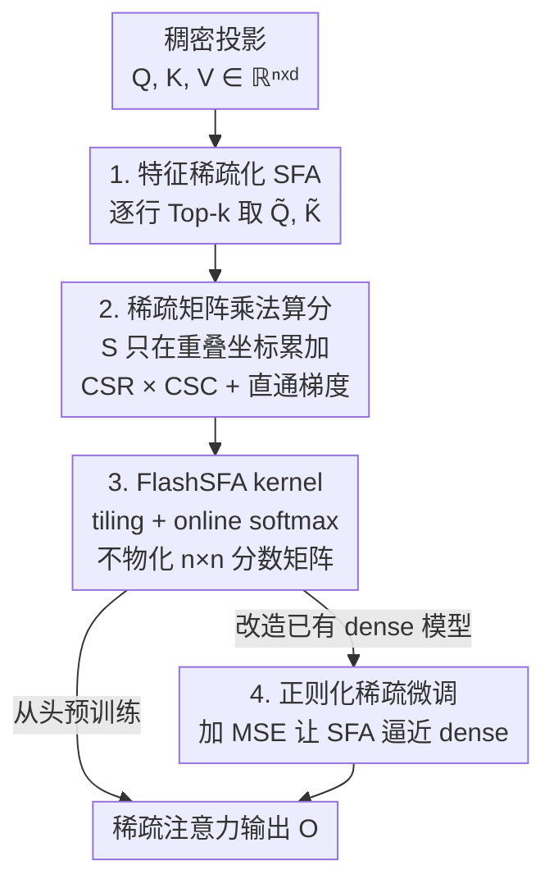

# Scaling Attention via Feature Sparsity

**会议**: ICLR 2026  
**OpenReview**: [https://openreview.net/forum?id=UspMJlGusi](https://openreview.net/forum?id=UspMJlGusi)  
**代码**: https://github.com/YannX1e/Sparse-Feature-Attention  
**领域**: LLM效率  
**关键词**: 高效注意力, 特征稀疏, 长上下文, FlashAttention, KV-cache

## 一句话总结
本文换了一个被忽视的轴来给注意力提速——不再裁剪 token，而是把每个 query/key 的 $d$ 维向量做 Top-$k$ 特征稀疏化，让注意力分数只在 query 和 key 共同激活的少数坐标上精确计算，再配一个 IO-aware 的 FlashSFA kernel 避免物化 $n\times n$ 分数矩阵，使 $QK^\top$ 的算力从 $\Theta(n^2d)$ 降到 $\Theta(n^2k^2/d)$，在 GPT-2 / Qwen3 上做到匹配 dense 精度的同时提速最高 2.5×、FLOPs 与 KV-cache 各省近 50%。

## 研究背景与动机
**领域现状**：把 Transformer 扩到超长上下文，瓶颈是自注意力的 $O(n^2d)$ 开销（$n$ 是序列长度、$d$ 是特征维度）。现有的省钱方法几乎都沿着**序列轴**做文章：局部窗口 / 低秩注意力（Longformer、BigBird、Linformer）把交互限制成线性复杂度，token 级稀疏（H2O、SnapKV、Quest）则挑选哪些 token 参与交互。

**现有痛点**：大规模 benchmark 一再显示，这些近似都会**掉精度**——为了省算力牺牲了表达力，导致在长上下文下 dense 注意力反而仍是最可靠的选择。低秩 / kernel 近似（Performer、Nyströmformer）把信息压进一个 $r\ll d$ 的稠密空间，本质上是在用表达力换速度。

**核心矛盾**：所有主流方法都在「序列轴」上做减法（要么减 token，要么减秩），却默认**每一对保留下来的 token 仍要在全部 $d$ 个特征维度上算分**。这层冗余从没被动过，于是「省算力」和「保表达力」始终是个 trade-off。

**本文目标**：在不裁剪 token、不做低秩近似（即保留高维表达力）的前提下，把单次 query-key 交互的成本降下来，并且让长上下文下的计算与显存同步受益。

**切入角度**：表示学习里的稀疏嵌入研究（SPLADE、CSR 等）表明，高维空间编码了丰富特征，而「选择性激活」少数坐标就能在保表达力的同时换来巨大效率收益。如果把注意力本身看成「在特征坐标上做检索」，那么只激活 query/key 最显著的几个维度，就能在不塌缩表征容量的情况下省算力。

**核心 idea**：开辟一条正交的新轴——**特征稀疏（feature sparsity）**。把 query 和 key 表示成 $k$-sparse 编码，注意力分数只由两者激活坐标的重叠（overlap）决定，从而保留高维表达力又把成本降到 dense 的 $(k/d)^2$。

## 方法详解

### 整体框架
SFA（Sparse Feature Attention）是对标准多头自注意力的一个 drop-in 改动：它**不动 token 集合、也不动 $V$**，只在算分前把每个 query/key 向量沿特征轴做 Top-$k$ 稀疏化。给定稠密投影 $Q,K,V\in\mathbb{R}^{n\times d}$，先逐行取出 $Q,K$ 各自幅值最大的 $k$ 个坐标得到 $\tilde Q=\text{Topk}_k(Q)$、$\tilde K=\text{Topk}_k(K)$；注意力分数 $S=\tilde Q\tilde K^\top$ 只在两个 token 共同激活的坐标上累加，因此可以写成一次稀疏矩阵乘法（$\tilde Q$ 存 CSR、$\tilde K^\top$ 存 CSC），遍历活跃坐标即可只算出非零的注意力边。但天真实现仍要物化 $n\times n$ 分数矩阵才能做 softmax，这会抹掉显存优势，于是本文把 FlashAttention 的 tiling + online softmax 机制搬过来、把稠密 tile 乘法换成稀疏特征求交 kernel，得到 **FlashSFA**，全程不写出完整分数矩阵、结果与精确 softmax 数学等价。最后，针对「想把已经稠密预训练好的模型改成稀疏」的场景，本文还设计了带 MSE 正则的微调目标，缓解稀疏化引入的分布漂移。

### 关键设计

**1. Sparse Feature Attention：把稀疏从 token 轴搬到特征轴**

这是全文的根。痛点很直白——序列轴上的稀疏（裁 token、低秩）都会掉精度，而每对 token 仍在全部 $d$ 维上算分这层冗余从未被动过。SFA 的做法是对 query / key 逐行施加 Top-$k$ 算子：对 $x\in\mathbb{R}^d$，$\text{Topk}_k(x)_u = x_u$ 当 $u\in\arg\text{topk}(|x|)$、否则为 $0$，即只保留幅值最大的 $k$ 个坐标。于是每个 token 只激活 $k$ 个特征，注意力分数

$$s_{ij}=\frac{1}{\sqrt d}\sum_{u\in S_i\cap S_j}\tilde q_{i,u}\tilde k_{j,u}$$

只在 query $i$ 与 key $j$ 的**支撑集交集** $S_i\cap S_j$ 上累加。它之所以不掉表达力，是因为**保留了完整的高维空间**——不像低秩 / 短嵌入把信息压进一个稠密的窄空间，SFA 仍在 $d$ 维里挑坐标，只是每个 token 只点亮一小撮。从效率看，假设支撑集在各维度均衡分布，每个坐标约被 $\deg(u)\approx nk/d$ 个 token 选中，它贡献的 query-key 重叠数是 $\deg(u)^2$，对所有 $d$ 个坐标求和得到总边数 $E\approx d\,(nk/d)^2 = n^2k^2/d$。于是 $QK^\top$ 的算力从 $\Theta(n^2d)$ 降到 $\Theta(n^2k^2/d)$，只剩 dense 的 $k^2/d^2$。以 $d=128,k=16$ 算理论上约省 64×；而 $d$ 越大收益越夸张，$d=1024,k=32$ 时比例是 $1/1024$，意味着同等算力下上下文窗口有望放大一到三个数量级。

**2. 稀疏矩阵乘法算分 + 直通梯度：让前后向都只随非零边伸缩**

光有 Top-$k$ 还不够，得让计算真正落在稀疏结构上。前向时把 $\tilde Q$ 以 CSR、$\tilde K^\top$ 以 CSC 存储，算分等价于一次 SpGEMM（稀疏通用矩阵乘）——它的成本不正比于 $n\times d$，而正比于行列非零模式的结构交集数量，遍历活跃坐标只产出非零的注意力边，存储也从 $O(nd)$ 降到 $O(nk)$。后向同样利用稀疏结构跳过对完整 $Q,K$ 的梯度：用**直通估计器（straight-through estimator）**，梯度只沿被选中的坐标回流，即 $\partial L/\partial q_{i,u}=\partial L/\partial\tilde q_{i,u}$ 当 $u\in S_i$、否则为 $0$，$k$ 同理。这样前向和后向都只随稀疏边集 $E$ 伸缩，训练和推理同时受益，而不是只在前向省钱、后向又被稠密梯度拖回去。

**3. FlashSFA：不物化分数矩阵地把稀疏收益真正兑现**

SFA 把交互数降到了 $n^2k^2/d$，但天真实现仍要先拼出一个 $n\times n$ 分数矩阵才能做 softmax——而长序列下这个 $O(n^2)$ 存储往往才是真瓶颈，物化它等于把显存优势全吐回去。FlashSFA 借 FlashAttention 的思路解决：保留 IO-aware 的 tiling 和 online softmax，但把稠密 tile 乘法换成**稀疏特征求交 kernel**。对一块 query（行 $i\in[i_0,i_0+B_r)$）和 key（列 $j\in[j_0,j_0+B_c)$），kernel 遍历这些 token 的活跃特征、求支撑集交集，再 scatter-add 进一个紧凑的 $B_r\times B_c$ 分数缓冲；缓冲立刻被 online softmax 消费掉，全程不把大分数矩阵写回显存。结果与 $\text{softmax}(\tilde Q\tilde K^\top/\sqrt d)V$ **数学完全等价**（exact，不是近似），却同时拿到 SFA 的算力/显存缩放与 FlashAttention 的 $O(n)$ IO 复杂度。稀疏索引带来的额外开销只有 $O(nk)$，且 $d\le 65535$ 时索引可用 16-bit 整数存。

**4. 正则化稀疏微调：把已经稠密预训练好的模型改造成稀疏**

前三点解决「从头训稀疏模型」，但更现实的诉求是把现成的 dense 大模型改成 SFA。难点在于：对预训练好的稠密特征直接套 Top-$k$ 会引入剧烈的**分布漂移**，几乎把原来的稠密注意力模式重置掉。本文的对策是在标准语言建模损失外加一项 MSE 正则，强行让 SFA 的注意力输出去逼近 dense 的输出（带 stop-gradient）：

$$L = L_{LM} + \lambda\,\frac{1}{H}\sum_{h=1}^{H}\big\|\tilde O_h - \text{stopgrad}(O_h)\big\|_F^2$$

因为 FlashAttention 和 FlashSFA 都不物化完整注意力矩阵，正则在实践中是对每个 head 的输出 $\tilde O_h$ 与 $O_h$ 做近似。此外作者发现：由于 Top-$k$ 几乎重置了原有特征模式，需要先在一个相近的推理数据集（MWP-200k）上恢复模型的语言能力，再去训目标任务（如 GSM-8K）。

### 损失函数 / 训练策略
从头预训练阶段直接用 SFA（式 3、6）替换 dense 的 $QK^\top$ 算分、保持 $V$ 稠密，稀疏预算取 $k\in\{8,16\}$；综合权衡精度与速度后，$k=8$ 被选为最具吸引力的默认设置。微调阶段用上面的正则目标（式 8，$k=16$），在 Llama-Factory 上对 Qwen3-0.6B/4B 训 3 个 epoch，数学/科学 QA 用 16k 上下文、长上下文检索用 32k。

## 实验关键数据

### 主实验
GPT-2 与 Qwen3 从头预训练：SFA 在困惑度（PPL）和零样本准确率上贴近 dense（full）上界，而把隐藏维减半的「短嵌入」baseline（Dense d=X）掉点明显更狠。

| 模型 | 方法 | 128k 延迟↓ | PPL↓ | 平均 Acc↑ |
|------|------|-----------|------|----------|
| GPT2-124M | Dense (full) | 16.86 | 17.29 | 28.28 |
| GPT2-124M | Dense (d=32) 短嵌入 | 7.86 | 20.88 | 24.63 |
| GPT2-124M | **SFA (k=8)** | 9.41 | **18.27** | **27.40** |
| Qwen3-0.6B | Dense (full) | 77.65 | 4.66 | 39.40 |
| Qwen3-0.6B | Dense (d=64) 短嵌入 | 30.84 | 6.03 | 36.68 |
| Qwen3-0.6B | **SFA (k=16)** | 34.20 | **4.81** | **38.94** |

在 Qwen3-0.6B 上 SFA(k=8) 的 PPL 4.81 几乎等于 dense 的 4.66，平均准确率 38.94 vs 39.40，仅边际代价；而短嵌入 PPL 劣化到 6.03。综合图 1 给出的整体画面：相对短嵌入 SFA 提速 259%、性能反升 21.4%，KV-cache 省 41%、FLOPs 省 49%。

### 长上下文与微调
合成 NIAH（大海捞针）压力测试下，SFA 不仅不掉检索精度，长度泛化反而比 dense 更稳；下游微调里 SFA(k=16) 紧贴 dense 微调。

| 配置 | 任务 | Dense 基线 | SFA | 说明 |
|------|------|-----------|-----|------|
| 32k 训练 NIAH | 32k 测试 Acc | 80% (d=64) | **83%** (k=16) | dense 随长度掉到 80%，SFA 反而更稳 |
| Qwen3-8B 微调 | NIAH 32768 | 95% (dense FT) | **97%** (k=16) | 长上下文检索 SFA 略超 dense 微调 |
| Qwen3-0.6B 微调 | GSM-8K | 63.42 (dense FT) | 61.46 (k=16) | 算术推理对剪枝更敏感，SFA 略落后 |

### 关键发现
- **稀疏轴换得值**：短嵌入虽然原始提速最大（窄隐藏维），但精度损失让性价比偏向速度而不实用；SFA 的质量-效率折中明显更优，$k=8$ 是甜点设置。
- **收益随复杂度复利**：图 3 显示单看点积提速有限，但放到整个 Transformer 栈上能拿到 2× 以上的端到端降延迟——稀疏在全网络铺开时 scale 得更好。
- **大维度长上下文最受益**：图 4 表明 4k 短上下文下 SFA 提速温和，但到 65k 上下文 + 256 头维时延迟降一个数量级以上；图 5 进一步显示 8k–16k 以上 SFA 才稳定碾压 dense（短上下文下稀疏 kernel 的查表开销反而不划算），KV-cache 随稀疏度成比例缩减（$k=4$ 省约 40%）。
- **任务敏感度有别**：算术推理（GSM-8K）对剪枝最敏感、SFA 略逊 dense 微调；而文档理解（Arxiv/PubMed）和长上下文检索（NIAH）几乎与 dense 持平，说明稀疏支撑集对局部性是个有效的归纳偏置。

## 亮点与洞察
- **正交新轴**：几乎所有高效注意力都在「序列轴」内卷（裁 token / 低秩），本文指出还有「特征轴」这条没人认真挖过的路，而且它与 token 稀疏、paging 正交，可以叠加相乘——这是最大的 aha。
- **exact 不是 approximate**：和 Performer/Linformer 这类拿表达力换速度的近似不同，SFA + FlashSFA 的输出与精确 softmax 数学等价，省钱不靠牺牲精度，这让它在长上下文下比近似法更可信。
- **稀疏编码思想迁移到注意力**：把「注意力 = 在特征坐标上检索」这个视角和稀疏嵌入（SPLADE/CSR 用倒排索引提效）打通，可复用到任何需要在高维空间做相似度的检索/匹配场景。
- **直通梯度让稀疏贯穿前后向**：很多稀疏方法只在前向省、后向又被稠密梯度拖回去，本文用 straight-through 让训练全程只随非零边伸缩，是个实用 trick。

## 局限与展望
- **短上下文下不划算**：稀疏 kernel 的查表/索引开销使 SFA 在 ≤4k 上下文反而不如 dense，收益要到 8k–16k 以上才显现——它本质是为长上下文/大维度设计的。
- **改造已有模型有代价**：Top-$k$ 几乎重置稠密特征模式，必须靠 MSE 正则 + 先在相近数据集恢复语言能力才能微调成功，迁移并非无痛。
- **算术推理掉点**：GSM-8K 上 SFA 落后 dense 微调，说明对精度要求高、信息不冗余的推理任务，特征剪枝可能伤到关键坐标。
- **$V$ 仍稠密**：本文只稀疏化了 $Q,K$ 的算分，$V$ 聚合保持稠密；理论上 $d=1024,k=32$ 省 1000× 是基于支撑集均衡分布的假设，真实分布是否均衡、能否真撑起 64M/1G 上下文还需更大规模验证。

## 相关工作与启发
- **vs token 级稀疏（Longformer / BigBird / H2O / SnapKV / Quest）**：他们裁的是「哪些 token 参与交互」，本文稀疏的是「给任意保留 token 对算分用的特征坐标」，两者正交——SFA 可以和 token 稀疏、paging 组合，通过压低单次交互成本来放大它们的收益。
- **vs 低秩 / kernel 近似（Linformer / Performer / Nyströmformer）**：他们把信息压进一个 $r\ll d$ 的稠密空间，常以表达力换速度且是近似计算；SFA 保留完整高维空间、每 token 只激活 $k\ll d$ 个学到的坐标，在活跃支撑集的重叠上**精确**算分，不用 kernel 替身。
- **vs 短嵌入 baseline**：直接砍隐藏维虽提速猛，但塌缩了特征多样性、长上下文检索掉得厉害；SFA 用「高维选坐标」而非「降维」拿到更好的质量-效率折中。

## 评分
- 新颖性: ⭐⭐⭐⭐⭐ 提出「特征稀疏」这一与序列轴正交、被长期忽视的高效注意力新轴，并配套 exact kernel。
- 实验充分度: ⭐⭐⭐⭐ GPT-2/Qwen3 预训练 + NIAH + 多尺度微调 + 系统级 latency/显存 benchmark 都有，但缺更大模型/真实长上下文下游任务的端到端验证。
- 写作质量: ⭐⭐⭐⭐⭐ 动机清晰、复杂度推导完整、图 1-5 把效率收益讲得很透。
- 价值: ⭐⭐⭐⭐⭐ 与现有 token 稀疏/paging 正交可叠加、保 exact 精度，对长上下文 LLM 的训练与推理都有直接落地价值。

<!-- RELATED:START -->

## 相关论文

- [\[ICLR 2026\] Understanding and Improving Length Generalization in Hierarchical Sparse Attention Models](understanding_and_improving_length_generalization_in_hierarchical_sparse_attenti.md)
- [\[ICLR 2026\] Mitigating Non-IID Drift in Zeroth-Order Federated LLM Fine-Tuning with Transferable Sparsity](mitigating_non-iid_drift_in_zeroth-order_federated_llm_fine-tuning_with_transfer.md)
- [\[ICLR 2026\] Scaling Up, Speeding Up: A Benchmark of Speculative Decoding for Efficient LLM Test-Time Scaling](scaling_up_speeding_up_a_benchmark_of_speculative_decoding_for_efficient_llm_tes.md)
- [\[ICLR 2026\] FSA: An Alternative Efficient Implementation of Native Sparse Attention Kernel](fsa_an_alternative_efficient_implementation_of_native_sparse_attention_kernel.md)
- [\[ICLR 2026\] STEM: Scaling Transformers with Embedding Modules](stem_scaling_transformers_with_embedding_modules.md)

<!-- RELATED:END -->
