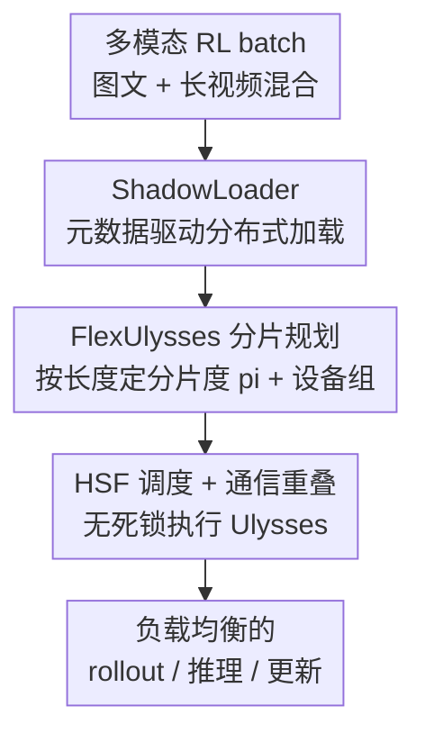

# Scaling Large Vision-Language Model RL Training via Efficient Load Balancing

**会议**: ICLR 2026  
**OpenReview**: [https://openreview.net/forum?id=aa14rlfR6k](https://openreview.net/forum?id=aa14rlfR6k)  
**代码**: 无  
**领域**: LLM效率 / 多模态VLM / RL训练系统  
**关键词**: VLM 强化学习、负载均衡、序列分片、数据加载、训练系统

## 一句话总结
针对 VLM 强化学习训练中"集中式多模态数据加载"和"跨 GPU 序列负载极度不均"两大系统瓶颈，本文提出端到端系统 FlexRL，用 ShadowLoader 把视觉数据的解码/预处理下放到 worker 并只在控制器上传递轻量元数据，用 FlexUlysses 把序列自适应切成细粒度 chunk 做子序列级负载均衡，在 128-GPU 集群上把端到端吞吐最高提升 8.47×。

## 研究背景与动机
**领域现状**：强化学习（RL，尤其 GRPO 这类）已成为对齐 VLM、增强其指令跟随与推理能力的主流手段。一个典型的 VLM RL 流程包含三个阶段：加载多模态数据与 prompt、policy 模型推理生成 rollout、用回报更新参数。

**现有痛点**：把为纯文本模型设计的 RL 框架（如 veRL）直接搬到 VLM 上会暴露两类严重瓶颈。其一是**数据加载瓶颈**：VLM 训练数据混杂文本、高分辨率图像和视频片段，veRL 这类框架把视频解码、抽帧等 CPU/IO 密集操作集中在单一 master 节点上做，再把 materialize 出来的张量分发给 worker；随着 global batch 增大，master 的预处理时间和主机内存随视觉数据量线性膨胀，很快变成 straggler 甚至触发 CPU OOM。论文实测 veRL 中数据加载占了一个 step 时间的 57.1%，比 rollout（18.0%）、推理（15.5%）、更新（9.3%）三者加起来还多。其二是**模型执行不均衡**：同一个 batch 里可能同时有短图文 query、长文本推理任务、几万 token 的视频输入，序列长度和模态的巨大差异让计算/显存负载在 GPU 间高度倾斜——有的卡被打爆、有的卡闲着，整个分布式系统被最慢的卡拖住。

**核心矛盾**：注意力计算随长度二次增长（$O(L^2)$）、激活显存随长度线性增长（$O(L)$），按显存均衡会算力不均、按算力均衡又显存不均；再加上视觉塔的开销由图像/帧数决定、与文本长度几乎不相关，导致"只按长度分桶"的目标根本失效。

**现有方案为何不够**：经典的分桶/打包（bucketing/packing）在固定并行度下按长度排序塞进每卡桶里，但只要 batch 里有一个 32K 的长离群序列，拿到它的那张卡就成为瓶颈，怎么分桶都救不了；更长时还会直接 OOM。而 FlexSP、HotSPa、ByteScale 等异构 DP 方法给不同桶分配不同并行度，但它们依赖大 batch + 梯度累积来腾出调度空间，这恰恰和 RL "小 batch、频繁 rollout-update 交替"的特性冲突，重新分片和同步的代价高得不可接受。

**核心 idea**：与其把数据加载和序列调度当成两个孤立问题打补丁，不如做一个端到端系统——数据侧用"控制器只管元数据、worker 分布式预处理 + 异步 materialize"消除集中式瓶颈，执行侧把 Ulysses 序列并行**重新用作负载均衡原语**，按每条序列长度自适应决定分片度，从而在子序列粒度上抹平极端长度倾斜。

## 方法详解

### 整体框架
FlexRL 构建在 veRL 之上，针对 VLM RL 流程的两个瓶颈各给一个组件，并让二者协同。一个多模态 batch（图文 + 长视频混合）进来后：先经 **ShadowLoader** 完成元数据驱动的分布式数据加载（把重 IO/解码下放到 worker，控制器只调度轻量元数据）；接着 **FlexUlysses** 的分片规划器根据每条序列的长度决定分片度并分配设备组；最后由 **HSF（Highest-Sharding-First）调度 + 通信重叠**无死锁地执行 Ulysses，把负载均衡落到 rollout 推理和模型更新两个阶段。三者串起来后，原本被数据加载和长序列离群拖慢的 step 被显著压缩。

### 关键设计

**1. ShadowLoader：把集中式视觉数据加载拆成"控制器只管元数据 + worker 分布式预处理"**

这一设计直击 master 节点成为 straggler 和 CPU OOM 的痛点。ShadowLoader 由四个部件构成：控制器上的 **Proxy Dataloader** 取代标准 dataloader，对多模态数据**只保留轻量元数据**（视频长度、期望帧数、图像尺寸、分辨率、文件路径），并用 **FakeTensor** 作为视觉数据的占位符——它只带 shape 信息、不含真实像素，还重写了 shard 操作以支持后续 Ulysses 分片决策；worker 侧的 **Local Preprocessor** 独立完成视频解码、抽帧等重活，把 materialize 出来的张量缓存在本地主机内存；**MetaStore** 是一个注册表，维护"样本元数据 → 物理存储位置"的映射；worker 侧的 **Materializer** 在真正需要像素时，凭元数据去 MetaStore 查到目标 preprocessor 并直接拉取张量。

工作流上，Proxy Dataloader 给每个样本分配唯一 ID，用简单的"路由到当前负载最小节点"算法派发预处理任务，控制器则始终用 FakeTensor 来调度整个 RL 训练循环，从而**永不把真实像素装进控制器内存**。在此之上还有两个让数据彻底离开关键路径的优化：**预取 + 异步 materialize**——提前取下一步的元数据、用非阻塞方式 materialize 张量，使 CPU 取数、解码和网络传输完全藏在 GPU 计算背后，消除 step 级气泡；**FlexUlysses-aware 加载**——因为 FakeTensor 占位符携带了"切片感知"的元数据，worker 可以只取自己真正需要的那部分（比如视频的特定帧区间、多图输入里要用的图像张量），把跨节点传输量大幅压下来。

**2. FlexUlysses：把 Ulysses 序列并行重新用作"自适应子序列分片"的负载均衡原语**

针对长度倾斜导致单条长序列拖垮整步的痛点，作者的关键观察是：Ulysses 序列并行本质上是对序列的**等代价划分**——MLP 模块里每张 GPU 拿到等长 shard、计算与显存完全相同，注意力在 head 级别切分、每个 head 计算量一致，因此天然抹平了跨 GPU 的算力与显存，且对任意注意力模式（包括序列打包等价的"拼接因果注意力"）都成立。于是可以把 Ulysses chunk 当作调度单元来均衡每卡负载，即使原始序列长度高度不均。

但"把整个 batch 全打包再做 Ulysses"的暴力解（Strawman）不可行：Ulysses 的并行度被注意力 head 数封顶，且 all-to-all 通信量随总 token 数增长、通信/计算比变高、GPU 空转变多。FlexUlysses 的解法是**自适应分片**：不是把每条序列都切成同样（最大）份数，而是给每条序列 $i$ 按其长度 $h_i$ 选一个分片度 $p_i \in \{1,2,4,\dots,p_{max}\}$，再按分片度分桶。这带来两个好处——大多数序列不需要分片或只需轻度分片就能接近最优均衡，不必为整 batch 付通信代价；不同分片度的序列由不同设备组处理，使各序列的 all-to-all 通信与注意力计算相互独立，从而可以流水化、把通信藏到计算里。此外，**视觉塔单独均衡**：由于视觉编码器按 batch 维堆叠图像、视频帧间注意力相互独立，视觉塔开销近似随图像/帧数线性增长，所以直接把图像和帧**均匀分摊到各 GPU** 即可同时均衡算力与显存。

**3. HSF 调度 + 动态打包与重叠：让多分片度共存时无死锁且不浪费 GPU**

自适应分片引入两个工程难题：搜索空间巨大（给每条序列选分片度是指数级，再把分片序列放进具体 GPU 组是类 NP-hard 的 bin-packing），以及多分片度共存破坏了 SPMD 范式——同一张 GPU 上的 chunk 可能属于不同序列、需要不同的 all-to-all 组，组之间还可能嵌套重叠，执行顺序错了就**死锁**。

作者用**层级化设备组 + 最高分片度优先（HSF）调度**化解。设备组是预先实例化的嵌套层级：对每个分片度 $p$，组之间是 GPU 的一个划分（互不相交且覆盖全体），且高低分片度的组互相嵌套（一个 $p$-组是两个 $p/2$-组的并）——例如 8 卡上 $p=8$ 是 [0-7]、$p=4$ 是 [0-3] 和 [4-7]、$p=2$ 是 [0,1]/[2,3]/[4,5]/[6,7]。这保证任意两组要么不相交、要么一个包含另一个。HSF 则强制所有 rank 按一致的全局顺序执行集合通信：每张 GPU 总是先做大分片度、再做小分片度（如 $p{=}8 \to 4 \to 2$），同 $(p,G)$ 内也保持一致顺序，于是同时既属于 $G_4$ 又属于 $G_2$ 的 rank 必然先进 $G_4$ 的 collective、再进 $G_2$，打破了循环等待。配套的**动态打包**把分到同一设备组的短序列贪心拼成 sequence group（拼到 token 上限 $H_{pack}$ 为止，长序列保持单例），既摊薄 kernel/集合通信的启动开销、又留出足够长的计算窗口去覆盖 all-to-all，同时用上限防止某个 pack 自己变成新 straggler。最后做**计算-通信重叠**：单个 sequence group 内存在 `all2all1 → 注意力计算 → all2all2` 的强依赖，但不同 group 相互独立，于是当 $SG_j$ 进入注意力计算时立即在通信流上发起 $SG_{j+1}$ 的 all2all1，把通信藏到计算背后。

### 损失函数 / 训练策略
本文是训练系统工作，不改训练目标：全程用 GRPO，最大回复长度 1024 token。7B 模型 rollout 用 TP=4、前向/更新用 FSDP=16；32B 模型 rollout 用 TP=16、前向/更新用 FSDP=64；除非特别说明，最大分片预算 $p_{max}$ 取 8。

## 实验关键数据

### 主实验
在两套 128-GPU 集群（H800 / H200，每台 16×8）上评测，模型为 MiMo-VL-7B-RL 和 Qwen2.5-VL-32B，数据集混合图文（Geo3K）、短视频（NExTQA）、长视频（LongVILA-Reason）三类，按 Image-Heavy(5:2:1) / Video-Heavy(1:2:5) / Only-Video 三种采样权重组合。指标为端到端吞吐（tokens/GPU/s），对比 veRL+Bucketing 与固定分片度 Ulysses-SP。

| 设置 | 模型/规模 | 基线 | FlexRL 加速 | 备注 |
|--------|------|------|----------|------|
| Only-Video, 64 GPU (GBS=128) | 7B | veRL Bucketing | **最高 8.47×** | 序列最长最异构，增益最大 |
| Image-Heavy, 128 GPU (GBS=256) | 7B | Ulysses(SP=4) | 最高 7.35× | 基线多处 OOM |
| Video-Heavy, 32 GPU (GBS=64) | 7B | veRL Bucketing | 最高 5.35× | — |
| 32B, 64 GPU (GBS=128) | 32B | veRL Bucketing | 最高 4.33× | 大模型不均衡更严重 |

veRL 基线随视频样本增多会因 ViT 引发的负载不均严重变慢甚至 OOM；Ulysses-SP 虽能均衡注意力，但固定分片度带来大量 all-to-all 通信开销，且增益随 batch 增大而衰减。

### 消融实验
在 128 H800 GPU、MiMo-VL-7B-RL、Image-Heavy 设置下分别评估两个组件（数据来自 Table 1，veRL=1.0×）：

| 配置 | Data Loading | 端到端 step time | 端到端吞吐 | 说明 |
|------|---------|---------|---------|------|
| veRL | 1.00× | 1.00× | 1.00× | 基线，data load 占主导 |
| + ShadowLoader | 96.15× | 5.35× | 4.68× | 主要消除数据瓶颈 |
| + FlexUlysses（单独） | — | — | 1.17× | 数据仍主导时端到端收益有限 |
| FlexRL（两者） | 117.42× | 7.68× | 7.67× | 互补，推理 11.83×、训练 6.47× |

### 关键发现
- **两个组件强互补、顺序很关键**：ShadowLoader 先把工作负载从"数据受限"变成"计算受限"（data-loading 吞吐 84.09×、端到端 4.68×），FlexUlysses 单独上时端到端只有 1.17×（因为数据仍是瓶颈）；只有两者合体，FlexUlysses 的细粒度分片才在推理（11.83×）和训练（6.47×）阶段释放出大收益。
- **FlexUlysses 把 balance ratio 真正打到 1.0**：在 32 GPU、7B、Image-Heavy 上，balance ratio（最大单卡注意力 FLOPs / 平均 FLOPs）从 veRL 的 6.70 降到 1.00，而固定 Ulysses-SP 即便 SP=8 也只到 1.12，且吞吐被 all-to-all 通信吃掉；FlexRL 在达到 ratio=1.0 的同时还把吞吐提升 1.50×。
- **越长越异构、增益越大**：Only-Video 设置下序列最长、长度方差最大，FlexRL 拿到最高 8.47× 的端到端提升；模型越大、视频越多，不均衡越严重，FlexRL 的相对优势越明显。

## 亮点与洞察
- **把 Ulysses 从"并行加速手段"重解为"负载均衡原语"**：作者识别出 Ulysses 等代价划分的本质，用"每序列自适应分片度"替代固定 SP 度，绕开了"长离群序列定 step、固定 SP 通信浪费"两难——这种"换个视角用已有机制"的思路很值得借鉴。
- **元数据驱动 + FakeTensor 占位**：用只带 shape、不带像素的 FakeTensor 在控制器上跑完整调度，把真实数据 materialize 推迟到 worker 真正用时，再配合切片感知加载只取需要的帧——这套"逻辑流先行、物理数据按需 materialize"的设计可迁移到任何重 IO 的分布式数据流水线。
- **层级嵌套设备组 + HSF 的无死锁论证**：把"多通信组共存可能死锁"这个工程坑用"组要么不相交要么嵌套 + 全局一致的最高分片度优先序"系统性消解，是分布式集合通信调度里干净利落的一招。

## 局限与展望
- **强依赖 Ulysses 的适用前提**：FlexUlysses 的并行度被注意力 head 数封顶，对 head 数很少或注意力结构特殊的模型，可分片空间受限。
- **设备组层级是 2 的幂的嵌套划分**：$p \in \{1,2,4,\dots\}$ 的设计简化了死锁证明，但也意味着分片度不能任意取值，极端长度分布下可能并非全局最优分配。
- **未开源 + 评测局限于 GRPO**：实验只用 GRPO 与两个模型，论文未给代码；对其他 RL 算法、PPO 式 critic 流水线或更大集群下的表现需进一步验证。
- 论文未给出动态打包阈值 $h_{pack}$/$H_{pack}$ 与 $p_{max}$ 的敏感性分析，超参如何选取对复现是一个不确定点。

## 相关工作与启发
- **vs veRL + Bucketing**：veRL 集中式加载数据、用固定并行度分桶；本文把加载分布式化、把分桶换成自适应子序列分片，避免 master straggler 与长离群拖步。
- **vs 固定 Ulysses-SP**：Ulysses-SP 给所有序列同一个 SP 度，短序列付出冗余 all-to-all；FlexUlysses 按长度差异化分片度，只在需要处付通信代价，balance ratio 与吞吐都更优。
- **vs FlexSP / HotSPa / ByteScale 等异构 DP**：它们靠大 batch + 梯度累积腾调度空间，在 RL 小 batch、频繁 rollout-update 下重分片代价过高；本文的细粒度分片 + 嵌套组调度更契合 RL 的动态迭代特性。

## 评分
- 新颖性: ⭐⭐⭐⭐ 把 Ulysses 重解为负载均衡原语 + 元数据驱动数据流水线，组合出端到端系统级创新。
- 实验充分度: ⭐⭐⭐⭐ 多模型多规模多数据混合、128-GPU 真集群、组件消融与 balance ratio 都有，但仅限 GRPO。
- 写作质量: ⭐⭐⭐⭐ 瓶颈诊断（57.1% 数据加载）到方案对应清晰，死锁/重叠机制讲得具体。
- 价值: ⭐⭐⭐⭐⭐ 最高 8.47× 端到端提升，直接解决 VLM RL 训练的真实系统瓶颈，工程落地价值高。

<!-- RELATED:START -->

## 相关论文

- [\[ICLR 2026\] Libra: Effective yet Efficient Load Balancing for Large-scale MoE Inference](libra_effective_yet_efficient_load_balancing_for_large-scale_moe_inference.md)
- [\[AAAI 2026\] Scaling and Transferability of Annealing Strategies in Large Language Model Training](../../AAAI2026/llm_efficiency/scaling_and_transferability_of_annealing_strategies_in_large_language_model_trai.md)
- [\[ICLR 2026\] Unlocking Full Efficiency of Token Filtering in Large Language Model Training](unlocking_full_efficiency_of_token_filtering_in_large_language_model_training.md)
- [\[ICLR 2026\] DualMap: Enabling Both Cache Affinity and Load Balancing for Distributed LLM Serving](dualmap_enabling_both_cache_affinity_and_load_balancing_for_distributed_llm_serv.md)
- [\[ICLR 2026\] Scaling Laws Meet Model Architecture: Toward Inference-Efficient LLMs](scaling_laws_meet_model_architecture_toward_inference-efficient_llms.md)

<!-- RELATED:END -->
