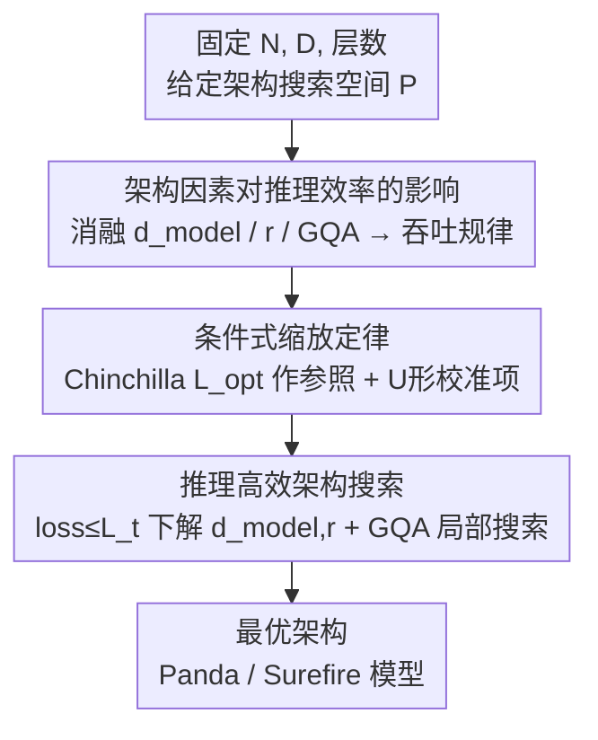

# Scaling Laws Meet Model Architecture: Toward Inference-Efficient LLMs

**会议**: ICLR 2026  
**OpenReview**: [https://openreview.net/forum?id=0TmVqOpBbK](https://openreview.net/forum?id=0TmVqOpBbK)  
**代码**: 无  
**领域**: LLM效率  
**关键词**: 缩放定律, 推理效率, 模型架构, MLP-注意力配比, GQA

## 一句话总结
本文把 Chinchilla 缩放定律扩展成"条件式"版本，显式把隐藏维度 $d_{model}$、MLP-注意力参数配比 $r_{mlp/attn}$、GQA 三个架构因素塞进 loss 预测，并配一套搜索框架，在固定参数/训练 token 预算下找到既准又快的架构；据此训出的 Panda / Surefire 系列模型相比 LLaMA-3.2 最高提升 2.1% 准确率、42% 推理吞吐。

## 研究背景与动机

**领域现状**：以 Kaplan、Chinchilla 为代表的缩放定律研究告诉我们，loss 与参数量 $N$、训练 token 数 $D$ 之间存在幂律关系 $L(N,D)=E+A/N^{\alpha}+B/D^{\beta}$，于是大家把资源都砸在"把模型和数据做大"上。

**现有痛点**：传统缩放定律只盯着**训练**，完全不管**推理成本**——而在真实部署里推理才是反复发生、占大头的开销。更关键的是，它们把模型当成一个只由 $(N,D)$ 决定的黑盒，忽略了**架构本身**对推理快慢和精度的影响。论文用 Figure 2 给了个反直觉的例子：Qwen2.5-1.5B 参数更多，吞吐却比 Qwen3-0.6B 更高——在层数相同的情况下，更大的隐藏维度、GQA 和更高的 MLP 配比让它跑得更快。这说明"参数越少越快"根本站不住脚，架构才是关键变量。

**核心矛盾**：精度和推理效率之间存在 trade-off，但现有缩放定律既没有刻画这个 trade-off，也没法把多个架构因素一起纳入预测。已有的两个尝试都有硬伤：Sardana 等人把训练+推理总 FLOPs 写进定律，但要求估计模型一生生成的总 token 数，不现实；Bian 等人只引入了"宽高比"（hidden size / 层数）单一因素，且砍层会损害微调后的泛化，框架也不通用。

**本文目标**：在**固定层数 $n_{layer}$、固定非嵌入参数 $N_{non\text{-}embed}$ 和训练 token 预算**的前提下，搞清楚 $d_{model}$、$r_{mlp/attn}$、GQA 这三个架构因素分别怎么影响推理效率和精度，并据此自动选出最优架构。

**切入角度**：作者注意到 LLaMA、Qwen、Gemma、Phi 这些参数量相近的开源模型，架构选择却差异巨大——这恰恰说明"在固定参数预算下重新分配架构"有很大的优化空间。于是他们固定层数（因为变层数会同时大幅扰动推理成本和精度），只在剩下三个因素上做文章。

**核心 idea**：把架构信息作为"条件"加进 Chinchilla 定律——先用标准 Chinchilla 拿到最优 loss 当参照点，再用一个关于 $d_{model}/\sqrt{N}$ 和 $r$ 的 U 形校准函数去预测各架构变体的 loss，最后解一个"在 loss 约束下最大化推理效率"的优化问题选架构。

## 方法详解

### 整体框架

整篇方法围绕一个目标：**在固定 $(N, D)$ 预算下，找到既不掉精度、又跑得快的解码器架构**。它分三步走。第一步是**实证刻画**：通过受控消融，搞清 $d_{model}$、$r_{mlp/attn}$、GQA 三个因素各自怎么影响推理吞吐（§3.2）和训练 loss（§3.3）。第二步是把这些规律**固化成一个条件式缩放定律**：用标准 Chinchilla 给出的最优 loss $L_{opt}(N,D)$ 当参照基准，再乘/加上一个刻画架构偏离的校准项，从而能用小模型拟合、外推到大模型。第三步是**搜索**：在"loss 不超过阈值 $L_t$"的约束下，最大化推理效率，连续因素 $(d_{model}, r)$ 靠解析求导得到，离散的 GQA 靠局部枚举搜索。最终产出两类模型——Panda（直接取最小 loss 的最优配置）和 Surefire（在 loss 约束下做帕累托最优、最大化吞吐）。

### 关键设计

**1. 架构因素对推理效率的影响：拆清 $d_{model}$、$r$、GQA 各自怎么提速**

要在固定参数预算下选架构，第一件事是搞清"动哪个旋钮能让推理变快"。作者基于 LLaMA-3.2 / Qwen3 dense 模型构造架构变体，做了三组受控消融：固定 $N_{non\text{-}embed}$、$r$、GQA，只变 $d_{model}$ 和注意力头数 $n_{head}$；固定 $N_{non\text{-}embed}$、$d_{model}$、GQA，只变 $r$ 和中间维度；固定其余只变 GQA。结论一致且清晰：**更大的隐藏维度 $d_{model}$（即更少的注意力头）、更高的 $r_{mlp/attn}$、更大的 GQA，都能提升推理吞吐**。原因有二——更大的 $d_{model}$ 和 $r$ 会减少总推理 FLOPs；同时它们缩小了 KV cache，降低推理时的 I/O 开销。GQA 虽然只是把 key/value 矩阵缩小、对参数量影响不大，但对吞吐影响显著，这一点和 Ainslie 等人的观察吻合。这组消融是后面建模和搜索的事实基础：它告诉我们"为了快，应该把参数往 MLP 和大隐藏维度倾斜"，但单看效率会一路推向极端配置，所以必须再引入精度这一约束。

**2. 条件式缩放定律：用 Chinchilla 当参照、再叠一层 U 形校准**

光追求快会损精度，所以核心难点是预测"架构变体的 loss"。作者先观察到一个稳定规律：固定其他因素时，loss 关于 $d_{model}/\sqrt{N_{non\text{-}embed}}$ 和关于 $r_{mlp/attn}$ 都呈 **U 形曲线**，且不同模型尺寸下最优点几乎一致（Figure 4、5）。归一化用 $\sqrt{N}$ 是因为在固定 $r$ 下注意力参数满足 $4d_{model}^2 \propto N_{attn}=N_{non\text{-}embed}\cdot\frac{1}{r+1}$，所以 $d_{model}$ 大致随 $\sqrt{N}$ 线性增长。这个 U 形也带来一个有意思的结论：近年开源模型把越来越少的参数分给注意力并非普遍最优——注意力配比存在**内部最优点**，往任一方向偏离都掉点。

直接拟合一个统一的 $L(d/\sqrt{N}, r, N, D)$ 不现实，于是作者提出**两步式"参照 + 校准"**框架：第一步对给定 $(N,D)$ 用 Chinchilla 取最优 loss 作参照 $L_{opt}(N,D)=\min\big(E+A/N^{\alpha}+B/D^{\beta}\big)$；第二步用形如 $c_0+c_1\log x+c_2/x$ 的函数（恰好刻画 U 形且 $x$ 增大时增长亚线性）分别校准 $d_{model}/\sqrt{N}$ 和 $r$ 的偏离。具体给出乘性和加性两种校准：

$$L(d/\sqrt{N}, r \mid N, D) = \Big(a_0 + a_1\log\tfrac{d}{\sqrt{N}} + a_2\tfrac{\sqrt{N}}{d}\Big)\cdot\Big(b_0 + b_1\log r + b_2/r\Big)\cdot L_{opt}$$

$$L(d/\sqrt{N}, r \mid N, D) = \Big(a_0 + a_1\log\tfrac{d}{\sqrt{N}} + a_2\tfrac{\sqrt{N}}{d}\Big) + \big(b_1\log r + b_2/r\big) + L_{opt}$$

其中 $a_i, b_i$ 是跨所有 $(N,D)$ 共享的可学习参数，用 Levenberg-Marquardt 最小二乘拟合。两种形式都假设 $d_{model}$ 和 $r$ 对 loss 的影响**可分离**——实验显示这个简化够用，更复杂的联合非可分形式并没有更好。相比"把架构硬塞进一个大公式"，这种"先拿 Chinchilla 定一个锚点，再小幅校准架构偏离"的思路既好拟合，也能稳健外推到更大模型。

**3. 推理高效架构搜索：连续因素求导、GQA 局部枚举**

有了能预测 loss 的条件定律，选架构就转化为一个约束优化（Eq. 4）：

$$\arg\max_{P} I_N(P)\quad \text{s.t.}\quad L(P\mid N,D)\le L_t$$

其中 $I_N(P)$ 是架构 $P$ 的推理效率，$L_t \ge L_{opt}$ 是可接受的最大训练 loss。对连续的 $(d_{model}, r)$，直接解 $\partial L/\partial d_{model}=0$、$\partial L/\partial r=0$ 拿到最优配置。GQA 比较麻烦：它对效率影响大，但和 loss 没有稳定的连续关系、波动很大，难以建模。好在一旦 $N_{non\text{-}embed}$、$d_{model}$、$r$ 固定，GQA 的搜索空间很小（它必须是 $n_{head}$ 的质因子），所以作者做**局部 GQA 搜索**：枚举可行值，一旦性能跌破 GQA=4 的基线就早停。整套流程汇总成 Algorithm 1——若没有现成 $L_{opt}$ 就先训小模型拟合 Chinchilla，再解约束优化定 $(d_{model}, r)$，最后局部搜 GQA，输出最终架构 $\{P, \text{GQA}\}$。由于 $I_N(P)$ 强依赖硬件和推理配置、难以解析，实践中作者改为在 A100+vLLM 上枚举满足 loss 约束的配置、取帕累托最优点，得到 Surefire 模型。

### 损失函数 / 训练策略

所有模型都是 LLaMA-3.2 风格的 decoder-only transformer，$N_{non\text{-}embed} \in \{80\text{M}, 145\text{M}, 297\text{M}, 1\text{B}, 3\text{B}\}$，训练数据采样自 Dolma-v1.7（按 15 个来源的占比采样以保持分布）。每个模型训练 $100\,N_{non\text{-}embed}$ 个 token（约 5× Chinchilla 最优）以确保收敛。每个 $d_{head}$ 在 $\le 1\text{B}$ 时固定为 64、$\ge 3\text{B}$ 时固定为 128，靠调整 $n_{head}$ 而非投影维度来维持 $r$ 恒定。缩放定律拟合采用渐进式：Task 1 用 80M 拟合、评 145M；Task 2 用 80M+145M、评 297M；Task 3 用 80M+145M+297M、评 1B。

## 实验关键数据

### 主实验

在 1B 和 3B 尺度上验证：Panda 取缩放定律预测的最优配置，Surefire 在 loss 约束下取帕累托最优；Avg. 为 9 个下游任务（ARC-E/C、LAMBADA、HellaSwag、OpenBookQA、PIQA、SciQ、WinoGrande、CoQA）的平均零样本准确率。

| 模型 | $d_{model}$ | $r$ | GQA | Loss (↓) | Avg. (↑) | 备注 |
|------|------|------|------|----------|----------|------|
| LLaMA-3.2-1B | 2048 | 4.80 | 4 | 2.803 | 54.9 | 基线 |
| **Panda-1B** | 2560 | 1.07 | 4 | **2.782** | **57.0** | +2.1% 准确率 |
| Surefire-1B | 2560 | 3.60 | 9 | 2.804 | 55.4 | 帕累托最优 |
| LLaMA-3.2-3B | 3072 | 3.0 | 3 | 2.625 | 61.9 | 基线 |
| **Panda-3B** | 4096 | 1.0 | 3 | **2.619** | **62.5** | +0.6% 准确率 |
| Surefire-3B | 4096 | 1.0 | 7 | 2.620 | 62.6 | 帕累托最优 |

吞吐方面，Surefire-1B / 3B 在所有 batch size 下都比 LLaMA-3.2 更快，最高 **42% 更高吞吐**（vLLM + A100）；换用 SGLang + H200 时最高达 47%，说明效率收益可跨服务栈和硬件平台迁移。

### 消融实验

| 配置 | 关键指标 | 说明 |
|------|---------|------|
| 拟合定律预测精度（Task 1-3） | MSE 0.0001-0.0002，Spearman 0.745-0.891 | 跨尺度外推预测 loss 准确、排序一致 |
| 排除 $r$ 异常值（$r\in[0.5,5]$ vs 含 0.1/12.6） | 含异常值 Spearman 明显下降 | 拟合应排除极端配比 |
| 加性 vs 乘性校准 | MSE / Spearman 相近 | 两种简单校准都够用 |
| 拟合数据策略：Panda-3B (80M-297M) vs Panda-3B° (仅 1B) | Loss 2.619 → 2.606 | 用 1B 数据拟合 3B 预测更准，系数随尺度漂移 |

### 关键发现
- **条件定律外推稳健**：用小模型拟合、外推到大模型，MSE 始终很低、Spearman 高，验证了"参照 + 校准"两步法的有效性。
- **校准形式不敏感**：乘性和加性校准效果接近，更复杂的非可分联合形式没有优势——说明把 $d_{model}$ 和 $r$ 的效应当作可分离是合理简化。
- **注意力配比有内部最优**：业界"参数越来越少分给注意力"的趋势并非普遍最优，Panda 系列把 $r$ 从 LLaMA 的 3-4.8 拉回到约 1.0，反而 loss 更低、精度更高。
- **系数随尺度漂移**：80M 这类极小模型不一定能可靠预测 3B 行为，用更接近目标尺度的数据（如 1B）拟合更准，这是该方法外推时需注意的 caveat。

## 亮点与洞察
- **"参照点 + 轻量校准"是化繁为简的关键 trick**：不去硬拟合一个含 $d, r, N, D$ 的统一缩放定律，而是先用成熟的 Chinchilla 锚定 $L_{opt}$，再叠一个小校准项——既好拟合又稳健，这个解耦思路可迁移到任何"想在已有缩放定律上加新维度"的场景。
- **U 形 + $c_0+c_1\log x+c_2/x$ 的函数选择很讲究**：这个形式天然刻画"两边高、中间低"的 U 形且增长亚线性，把经验曲线直接编码进可拟合公式，比纯多项式拟合更有归纳偏置。
- **把推理效率当约束、把精度当目标**的优化范式很实用：因为 $I_N(P)$ 依赖硬件难解析，干脆改成"在 loss 约束下枚举求帕累托最优"，绕开了对效率建模的难点。
- 最"啊哈"的点是反直觉的架构选择——通过定律预测，最优模型应该**降低 MLP 配比、增大隐藏维度**，这与近年大模型的设计趋势相反，却同时拿到了更高精度和更高吞吐。

## 局限与展望
- **固定层数是前提**：方法明确把 $n_{layer}$ 固定（因为变层数会同时大幅扰动效率和精度），所以它回答的是"给定层数下怎么分配剩余架构"，而非完整的架构搜索；深度这一重要维度被排除在外。
- **可分离假设**：乘性/加性校准都假设 $d_{model}$ 和 $r$ 对 loss 的影响可分离，虽然实验上够用，但在更极端配置或更多架构因素（如不同注意力变体）下是否成立未充分检验。
- **系数随尺度漂移**：作者自己发现用 80M 外推 3B 不如用 1B 数据准，说明定律系数并非完全尺度不变，外推到 7B/更大时仍需重新拟合验证。
- **GQA 建模偏经验**：GQA 与 loss 无稳定连续关系，只能局部枚举+早停，缺乏像 $d_{model}/r$ 那样的解析刻画。
- 评测主要在 1B-3B、100B token 上验证，更大规模（论文举例的 7B/14T）只是理论上适用，实际效果待验证。

## 相关工作与启发
- **vs Chinchilla (Hoffmann et al. 2022)**: Chinchilla 只建模 $L(N,D)$、回答"参数与 token 怎么分配"；本文把它当作参照基准 $L_{opt}$，在其上叠加架构条件，回答的是"固定 $(N,D)$ 下架构怎么选"，两者正交互补。
- **vs Sardana et al. (2023)**: 他们把训练+推理总 FLOPs 写进缩放定律，但需估计模型一生的总生成 token 数，部署中不现实；本文不依赖这种全生命周期假设，直接在固定预算下优化架构。
- **vs Bian et al. (2025)**: 同样想把架构塞进缩放定律，但他们只用"宽高比"单一因素、且砍层伤泛化；本文固定层数、纳入 $d_{model}$、$r$、GQA 三因素，并给出通用的"参照+校准+搜索"框架。

## 评分
- 新颖性: ⭐⭐⭐⭐ 把架构因素以"条件校准"方式优雅地接入 Chinchilla，并打通到可执行的架构搜索，角度新且实用。
- 实验充分度: ⭐⭐⭐⭐⭐ 训了 200+ 个 80M-3B 模型、跨 vLLM/SGLang × A100/H200 验证，渐进式拟合 + 多组消融非常扎实。
- 写作质量: ⭐⭐⭐⭐ 逻辑清晰、公式与图表对应到位，个别符号（如表中 $r$ 取值）需对照原文。
- 价值: ⭐⭐⭐⭐⭐ 给出"在固定预算下设计推理高效大模型"的可落地方法论，2.1% 精度 + 42% 吞吐的双赢极具部署价值。

<!-- RELATED:START -->

## 相关论文

- [\[ICLR 2026\] Towards Greater Leverage: Scaling Laws for Efficient Mixture-of-Experts Language Models](towards_greater_leverage_scaling_laws_for_efficient_mixture-of-experts_language_.md)
- [\[ICLR 2026\] Universal Model Routing for Efficient LLM Inference](universal_model_routing_for_efficient_llm_inference.md)
- [\[ICLR 2026\] xLSTM Scaling Laws: Competitive Performance with Linear Time-Complexity](xlstm_scaling_laws_competitive_performance_with_linear_time-complexity.md)
- [\[ICLR 2026\] Scaling Large Vision-Language Model RL Training via Efficient Load Balancing](scaling_large_vision-language_model_rl_training_via_efficient_load_balancing.md)
- [\[ICML 2025\] Ladder Residual: Parallelism-Aware Architecture for Accelerating Large Model Inference](../../ICML2025/llm_efficiency/ladder-residual_parallelism-aware_architecture_for_accelerating_large_model_infe.md)

<!-- RELATED:END -->
