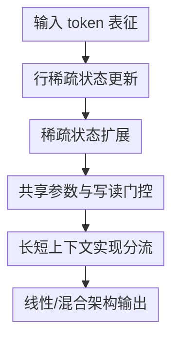

# Scaling Linear Attention Capacity with Sparse State Expansion

**会议**: ICLR2026  
**OpenReview**: [https://openreview.net/forum?id=R6DrJ4tnGV](https://openreview.net/forum?id=R6DrJ4tnGV)  
**代码**: 待确认  
**领域**: LLM效率 / 线性注意力 / 长上下文建模  
**关键词**: 线性注意力, 稀疏状态扩展, 长上下文检索, 混合架构, 小模型推理  

## 一句话总结
这篇论文把线性注意力的状态更新重新解释为“信息分类”，在此基础上提出 Sparse State Expansion（SSE）：用行稀疏写入和分区扩展显著增加固定状态容量，在不明显增加参数量的前提下提升长上下文检索与数学推理能力。

## 研究背景与动机
**领域现状**：Transformer 依靠 softmax attention 保留完整 KV cache，因此在长上下文中有很强的检索和复制能力，但推理阶段显存随上下文长度线性增长，训练阶段的全序列 attention 也有二次复杂度。线性注意力、状态空间模型和各种 RNN-like token mixer 试图把历史上下文压缩进固定大小的状态矩阵，让解码只需要常数级缓存，并把长序列训练做成更接近线性的开销。

**现有痛点**：固定状态是效率来源，也是性能瓶颈。很多线性注意力模型会把历史 token 的信息写进形如 $S_t \in \mathbb{R}^{c \times d}$ 的状态，其中 $c$ 常取 128 这类固定值；当上下文长度远大于 $c$ 时，大量语义、位置和键值关系被迫混在有限行里。语言建模平均指标可能还能维持，但 in-context retrieval、needle retrieval、数学推理这类需要精确取回中间事实的任务会明显落后于 softmax attention。

**核心矛盾**：线性注意力想要“状态小、推理快”，但长上下文任务又需要“状态容量大、信息互不干扰”。直接把状态行数扩大可以增加容量，却可能同步扩大参数、计算和实现复杂度；完全不扩容则会让不同类别的信息互相污染，导致状态行同质化、有效感受野变短。

**本文目标**：作者要解决的不是简单替换一个激活函数，而是让线性注意力的压缩状态更会“分仓存储”。具体来说，模型需要知道新 token 应该写到哪些状态行，哪些历史行不该被无谓衰减，还要能在状态容量扩大后保持参数量和训练吞吐可控。

**切入角度**：论文的关键观察是，线性注意力中的 key feature map 本来就像一个隐式分类器：$k_t = f(x_t, W_k)$ 的不同维度决定信息会被写到哪些状态行。既然状态行可以看作潜在类别，那么更自然的做法不是把每个 token 软软地写进所有行，而是先选出少数相关类别，再只更新这些行。

**核心 idea**：用 top-k 行稀疏更新减少状态行之间的信息干扰，再把状态扩展成多个共享参数的分区，用写读门控选择分区，从而把“状态容量”从“参数规模”中解耦出来。

## 方法详解

### 整体框架
SSE 的整体思路可以分成两层：第一层把线性注意力的状态行视为潜在类别，用 top-k 后 softmax 的方式只更新少数状态行；第二层把状态矩阵扩展成 $N$ 个分区，每个分区仍有 $c$ 行，但 QKV 等注意力参数共享，token 先通过门控选择少数分区，再在分区内部做行选择。这样，模型看起来拥有 $N \times c$ 行状态容量，但不需要给每个分区都复制一套完整注意力参数。

在混合架构 SSE-H 中，作者还保留少量 softmax attention 层，让模型用线性状态承担大部分长序列计算，用少数二次注意力层补足精确交互能力。论文实验主要比较纯 SSE、SSE-GDN 以及混合 SSE-H，覆盖预训练、长上下文扩展、Transformer 转换、蒸馏和强化学习后的数学推理。

### 关键设计
**1. 行稀疏状态更新：把状态行当成潜在类别**

传统线性注意力的外积更新可以写成 $S_t = \Lambda_t S_{t-1} + \phi(k_t)^\top v_t$。如果 $\phi(k_t)$ 在所有维度上都有非零权重，那么每个 token 都会以不同强度写入很多状态行。论文指出，这相当于承认 $k_t$ 在做信息分配，却没有真正利用“类别归属”这个结构，结果是不同类别的信息被混在同一批行里，状态行之间余弦相似度升高，查询时难以区分。

SSE 的前置设计是 top-k-then-softmax：先从 $x_tW_k$ 中选出最大的 $k$ 个行索引，只在这些位置上做 softmax，其余位置直接置零。更新变为 $k_t = \mathrm{softmax}(\mathrm{top}\text{-}k(x_tW_k))$，然后只写入被选中的行。对带门控衰减的 GLA 类模型，非选中行的 gate 也会被同步去掉，避免旧信息被无关 token 无谓衰减。这样做的直觉很清楚：如果状态行是类别，那么“没有被分到这个类别”的 token 就不该往这一行里写，也不该让这一行发生遗忘。

论文给出三个理论侧面的解释。第一，同一行对应的输入在分类函数下会有更大的相似性；第二，行稀疏写入能降低状态行之间的相似度下界，让不同查询更容易读出不同信息；第三，在带指数衰减的线性注意力中，稀疏更新能让重要行跨越更长距离不被连续衰减，从而扩大有效感受野。换句话说，top-k 不是单纯省计算，而是在固定状态中减少“错写”和“误忘”。

**2. 稀疏状态扩展：扩状态而不等比例扩参数**

只做行稀疏还不够，因为 $c=128$ 这类状态行数本身太小。论文提出 Sparse State Expansion，把状态从 $S_t \in \mathbb{R}^{c \times d}$ 扩展为 $N$ 个分区，每个分区有 $c$ 行，总容量变成 $N c \times d$。关键在于，分区并不各自拥有独立 QKV 参数，而是共享同一套注意力投影；token 的差异主要通过分区门控和行选择体现。

这一点解决了一个常见误区：线性注意力的短板未必是参数不够，而是可写入的状态槽位不够。softmax attention 只有固定的投影参数，却能管理随上下文增长的 KV cache；类比到线性注意力，SSE 尝试让状态容量增长，但不把参数量也一起乘上 $N$。论文的参数共享消融很有说服力：600M 模型中，去掉共享参数后非 embedding 参数从 300M 增到 580M，Recall-Avg 反而从 31.16 降到 25.95，说明更多参数并没有自动带来更好的可检索状态。

**3. 共享参数与写读门控：同一个 gate 同时管写入和读取**

SSE 为每个 token 计算一个分区门控 $e_t = \mathrm{softmax}(x_tW_e)$，再取 top-k 分区集合 $T$。被选中的分区更新为 $S_t^i = \Lambda_t S_{t-1}^i + e_t^i \cdot k_t^\top v_t$，未选中分区保持不变；读取时也只从同一批分区中汇总 $o_t = \sum_{i \in T} e_t^i \cdot q_t S_t^i$。因此 $e_t$ 既决定 token 写到哪里，也决定当前查询从哪里读。

这种 write-read gate 比只管写或只管读更稳。若只有写 gate，模型可能把信息写进少数分区，但读取阶段又没有足够约束，输出会混入不相关状态；若只有读 gate，写入时的状态组织仍然松散。论文的 2B 消融显示，完整写读门控的 Recall-Avg 为 56.63，而无 gate、write-only、read-only 分别为 51.87、50.92、53.96。这个结果说明门控不是装饰性的 router，而是让“状态分区”真的成为可学习记忆空间的关键。

论文还加入 always-selected partition 来稳定局部语言建模。因为连续 token 的局部依赖是语言模型很强的先验，完全依赖稀疏分区可能在训练早期不稳定；总有一个分区被选中，可以保留一条密集、稳定的短程通道。作者同时用分区级 auxiliary balance loss 约束样本在分区间不要过度塌缩，形式上类似 MoE 里的负载均衡损失。

**4. 长短上下文实现分流：用 masking 和 varlen 保住并行性**

SSE 的算法价值如果落不到高效 kernel 上，就很难成为实际 LLM 架构。论文为不同长度场景设计了两种实现。短序列或可变长度训练中，作者采用 masking：把 QKV 沿分区维复制，再根据 top-k 分区 mask 掉未选中的部分，最后把分区维合并到 head 维里调用线性注意力算子。这样会做一些冗余计算，但短序列下能保持较好的 GPU 利用率。

长上下文中，冗余复制会变贵，论文改用 varlen 技术：先按 top-k 分区索引重排 QKV，把同一分区的 token 聚在一起，再构造新的 `cu_seqlens`，让每个样本-分区片段作为可变长子序列并行送入线性注意力 kernel。只要选中分区数 $K$ 固定，分区总数 $N$ 变大时运行时间接近常数增长。这个实现解释了 SSE 为什么能在扩展状态容量时仍然维持线性注意力的基本效率特征。

### 一个完整示例
假设模型正在处理一段 32k 长上下文，里面既有普通叙述，也有一个稍后会被问题引用的实体-属性键值对。普通线性注意力会把每个 token 以连续权重写入所有或多数状态行，几十轮更新后，实体信息可能被后续无关 token 的写入和衰减稀释。

在 SSE 中，这个 token 先通过 $e_t$ 被路由到 top-1 或 top-2 分区，例如“事实记忆分区”和 always-selected 局部分区；在被选中的分区里，$\mathrm{softmax}(\mathrm{top}\text{-}k(x_tW_k))$ 又只激活少数状态行。后续无关 token 如果被门控到其他分区，就不会写入这几行，也不会让这些行反复衰减。等到问题 token 出现时，它的读 gate 倾向于选回保存相关事实的分区，再用 query 从对应状态行读出内容。这个过程不等价于完整 KV cache，但比把所有事实混在 128 行固定状态里更接近“分柜存储、按需读取”。

### 损失函数 / 训练策略
SSE 仍然以语言模型 next-token prediction 为主目标训练，并额外加入负载均衡辅助损失，避免少数状态行或分区长期被过度使用。行稀疏版本中，辅助项鼓励样本在状态行上的选择频率更均匀；SSE 中则改成分区级 balance loss，系数在实验里设为 0.01。

模型训练覆盖多个阶段。600M 模型用 15B tokens 做小规模预训练，2B 模型用 100B tokens 做主要比较；更强的 2B SSE-H 还扩展到 2T 预训练 tokens，并用 250B tokens 做 32k 上下文扩展。推理能力部分先用约 80k 数学样本做 5 epoch 监督蒸馏，再用 GRPO 强化学习训练 230 步，每个 prompt 采样 8 个回答，生成上限为 32k tokens。

架构上，论文用 MHA-SwiGLU backbone 控制变量，只替换 attention mixer；混合模型每 5 个线性注意力层后放 1 个 softmax attention 层。2B 设置下总共 18 层，其中 3 层是 softmax attention。这样的设计使实验更接近“同样训练配方下 token mixer 的差异”，而不是不同模型家族的大杂烩比较。

## 实验关键数据

### 主实验
论文的实验覆盖三个层次：小规模预训练后的语言建模与真实检索，2B 规模下的长上下文检索与综合 benchmark，以及蒸馏/RL 后的数学推理。下面挑最能说明 SSE 作用的主结果。

| 模型 | 规模 / 训练 | CommonSense Avg. | Real-world Recall Avg. | 说明 |
|------|-------------|------------------|-------------------------|------|
| Transformer | 600M / 15B tokens | 42.22 | 55.95 | 检索仍最强，但效率成本高 |
| GLA | 600M / 15B tokens | 41.53 | 18.63 | 固定状态检索明显弱 |
| GDN | 600M / 15B tokens | 43.05 | 24.84 | 更强 transition 仍受容量限制 |
| SSE-n4k1 | 600M / 15B tokens | 42.91 | 31.16 | 在同级线性模型中显著提升检索 |
| SSE-GDN-n4k1 | 600M / 15B tokens | 42.95 | 37.84 | 结合 delta-rule 后检索进一步提升 |
| Transformer | 2B / 100B tokens | 53.55 | 73.00 | softmax attention 上限较高 |
| GLA | 2B / 100B tokens | 49.13 | 49.29 | 与 Transformer 有较大 gap |
| SSE-n4k1 | 2B / 100B tokens | 54.57 | 61.46 | 纯线性版本缩小检索差距 |
| SSE-H-n4k1 | 2B / 100B tokens | 54.48 | 70.87 | 混合架构接近 Transformer 检索水平 |

在 RULER Single-NIAH 上，2B SSE 的优势更直观。S-NIAH-2 的 8K 设置中，GLA 只有 23.2，GDN 只有 8.2，而 SSE-n4k1 达到 85.2；S-NIAH-3 的 8K 设置中，GLA/GDN 分别为 16.2/9.0，SSE-n4k1 为 62.2，SSE-H-n4k1 进一步到 97.4。这个任务很依赖精确取回，能直接暴露固定状态容量不足的问题。

长上下文扩展后，2B SSE-H 在 10 个综合 benchmark 上平均 45.6，略高于 Transformer 的 45.1；在 MMLU、MMLU-Pro、C-Eval 上分别为 54.5、26.1、59.7，也高于 Transformer 的 52.6、24.2、55.9。检索任务上并非全胜，例如 SWDE/SQuAD 略低于 Transformer，但整体说明少量 softmax 层配合 SSE 可以成为可训练、可扩展的折中架构。

| 模型 | AIME24 | AIME25 | MATH500 | OlympiadBench | AMC23 | 说明 |
|------|--------|--------|---------|---------------|-------|------|
| Qwen3-1.7B Thinking | 48.3 | 36.8 | 93.4 | - | - | 同量级开源推理模型代表 |
| DeepSeek-R1-Distill-Qwen-1.5B | 28.9 | 23.5 | 83.9 | 43.3 | 62.9 | 蒸馏型小模型 |
| DeepSeek-R1-Distill-Qwen-7B | 55.5 | 39.2 | 92.8 | - | - | 更大参数量参考 |
| Transformer-2B (Ours) | 64.1 | 52.8 | 93.0 | 83.3 | 92.0 | 相同训练管线下 softmax baseline |
| SSE-H-n4k1-2B (Ours) | 64.5 | 50.2 | 92.1 | 85.7 | 91.4 | 小模型推理表现接近 Transformer |

数学推理结果说明，SSE-H 并不只是检索 benchmark 上的工程技巧。在相同蒸馏和 RL pipeline 下，2B SSE-H 的 AIME24 甚至略高于 Transformer-2B，AIME25 略低但仍明显超过公开小模型基线。由于推理过程依赖多步中间状态和长链条上下文，这个结果支持“线性/混合注意力也能承接 test-time scaling”的结论。

### 消融实验
| 配置 | 关键指标 | 说明 |
|------|---------|------|
| SSE-n4k1-k.silu | Recall-Avg 24.23 | 用 SiLU 替代 softmax 行选择，稀疏分类效果弱 |
| SSE-n4k1-k.softmax | Recall-Avg 31.16 | softmax 行选择带来 +6.93 recall 提升 |
| SSE-n4k1 | Recall-Avg 31.16，非 embedding 参数 300M | 共享参数的标准版本 |
| w/o shared-params | Recall-Avg 25.95，非 embedding 参数 580M | 参数几乎翻倍但检索下降 5.21 |
| SSE-n4k1 write-read gate | Recall-Avg 56.63，CSR-Avg 53.63 | 2B / 100B tokens 下最佳门控设置 |
| no gate | Recall-Avg 51.87，CSR-Avg 53.01 | 分区缺少可学习选择机制 |
| write gate only | Recall-Avg 50.92，CSR-Avg 52.82 | 只约束写入不够 |
| read gate only | Recall-Avg 53.96，CSR-Avg 52.91 | 只约束读取弱于写读一致 |

### 关键发现
- 状态容量扩展确实有效：固定稀疏比例 $k/n$ 时，分区数 $n$ 增大，平均 recall 近似线性上升；固定 $n$ 时，提高 $k/n$ 会先改善 recall，但到中等比例后趋于饱和，$k/n=1$ 时退化为更接近普通线性注意力的密集更新。
- softmax 行选择是核心而不是细枝末节。论文测得 GLA 的 $k_t$ 几乎没有行稀疏性，而 SSE 在选中分区内能出现约 5% 到 42% 的稀疏写入比例，说明状态行被更明确地区分。
- SSE 的状态更“多样”。论文用行间余弦相似度和 singular value entropy 分析状态矩阵，发现 SSE 的状态行/分区相似度更低，奇异值熵高于 GLA，意味着信息没有塌缩到少数方向里。
- 效率上存在清晰 trade-off。SSE 在 32k 及更长序列上比 full attention 更快，但慢于 GLA/GDN；例如 attention runtime 在 32k 时 full attention 24ms、GLA 10ms、SSE 26ms，在 128k 时分别为 315ms、36ms、97ms。SSE 的定位不是最便宜的线性注意力，而是用一定开销换更强状态容量。

## 亮点与洞察
- 把 key feature map 解释成“分类函数”很有启发性。很多线性注意力工作把重点放在 transition matrix 或 decay 上，本文则追问新信息到底写进哪些状态行，这让 top-k row selection 从启发式稀疏化变成有机制解释的状态组织方式。
- SSE 的参数共享设计很克制。直接复制分区参数很容易做成 MoE 式大模型，但论文用实验证明线性注意力真正缺的是状态槽位，不是投影参数；这种区分对后续设计高效长上下文模型很重要。
- 写读门控把“写在哪里”和“从哪里读”绑在一起，避免了稀疏路由里常见的读写错位。这个设计可以迁移到其他 recurrent memory、test-time memory 或分块长上下文模型中。
- 论文没有只停留在小 synthetic 任务，而是把 SSE 放进从预训练、长上下文扩展、Transformer conversion 到 RL reasoning 的完整训练链路里验证。对架构论文来说，这比单个 recall benchmark 更能说明可用性。

## 局限与展望
- 纯 SSE 与 Transformer 仍有检索差距。2B 纯 SSE 的 Real-world Recall Avg. 为 61.46，虽然显著高于 GLA 的 49.29，但仍低于 Transformer 的 73.00；真正接近 Transformer 需要混合 softmax 层。
- 效率还不是最优。SSE 的 varlen/reorder 带来 router index sorting、QKV 重排和更多 chunk 边界，训练吞吐在多个长度下约为 GLA 的六成左右。若没有低层 kernel 优化，实际部署时要认真评估 latency 与吞吐。
- 分区数 $N$ 和 top-k $K$ 是新的重要超参。论文采用 n4k1 作为主要设置，但更大状态容量、不同稀疏比例和不同任务之间的 scaling law 还没有完全摸清，搜索成本也不低。
- 当前 gate 主要依赖 token 内容 $x_t$，还没有充分利用位置、历史状态或任务阶段信息。作者也提到更一般的形式可以是 $e_t = g(t, x_t, S_{t-1})$，这可能让分区选择更适合长程依赖和动态记忆。
- delta-rule 版本虽然有补充实验，但主文重点仍是 GLA-style transition。SSE-GDN 看起来很有潜力，尤其 recall 更强，但还需要更系统的规模化和推理实验。

## 相关工作与启发
- **vs Transformer softmax attention**: Transformer 保存完整 KV cache，检索和复制能力强，但长上下文成本高；SSE 用固定但扩展的压缩状态换取更低复杂度，牺牲一部分精确记忆，换来长序列效率和常数级 decoding state。
- **vs GLA / GDN**: GLA 和 GDN 主要改进状态转移与门控衰减，SSE 则强调新信息如何被分类写入状态行。实验显示，强 transition 不能完全解决容量不足，SSE 与 GDN 结合后 recall 又进一步提高。
- **vs Mamba / Mamba2**: Mamba 系列也是高效序列模型，但其状态结构与选择机制不同；本文的优势在于直接从 linear attention 的状态矩阵和行选择出发，更容易与现有 attention/hybrid 架构对接。
- **vs MoM (Mixture-of-Memories)**: MoM 同样通过 mixture/memory 扩展线性序列模型的记忆能力，但 SSE 更强调参数共享、写读一致门控和行级 softmax 稀疏选择。论文中 SSE 在 600M active 对比下 recall 高于 MoM，且参数更少。
- **对后续工作的启发**: 长上下文高效模型可能不只是在“保留多少 token”上做文章，还可以在“压缩状态内部如何分区、分类、路由”上扩展。SSE 提供了一个很清晰的路线：把 recurrent state 当成可学习的结构化记忆，而不是一块被动累加的矩阵。

## 评分
- 新颖性: ⭐⭐⭐⭐⭐ 从信息分类角度重写线性注意力状态更新，并把状态扩展与参数共享结合得很自然。
- 实验充分度: ⭐⭐⭐⭐⭐ 覆盖预训练、检索、长上下文、转换和 RL 推理，主实验与消融都比较完整。
- 写作质量: ⭐⭐⭐⭐ 理论、实现和实验链条扎实，但方法符号与多种架构变体较密，新读者需要反复对照。
- 价值: ⭐⭐⭐⭐⭐ 对 LLM 长上下文效率和 hybrid linear attention 架构都有直接参考价值，尤其适合关注小模型推理和低缓存长上下文的研究。

<!-- RELATED:START -->

## 相关论文

- [\[ICLR 2026\] Log-Linear Attention](log-linear_attention.md)
- [\[ICLR 2026\] xLSTM Scaling Laws: Competitive Performance with Linear Time-Complexity](xlstm_scaling_laws_competitive_performance_with_linear_time-complexity.md)
- [\[ICML 2026\] Dynamic Linear Attention](../../ICML2026/llm_efficiency/dynamic_linear_attention.md)
- [\[ICML 2026\] Kalman Linear Attention: Parallel Bayesian Filtering For Efficient Language Modelling and State Tracking](../../ICML2026/llm_efficiency/kalman_linear_attention_parallel_bayesian_filtering_for_efficient_language_model.md)
- [\[ICLR 2026\] Local Linear Attention: An Optimal Interpolation of Linear and Softmax Attention for Test-Time Regression](local_linear_attention_an_optimal_interpolation_of_linear_and_softmax_attention_.md)

<!-- RELATED:END -->
