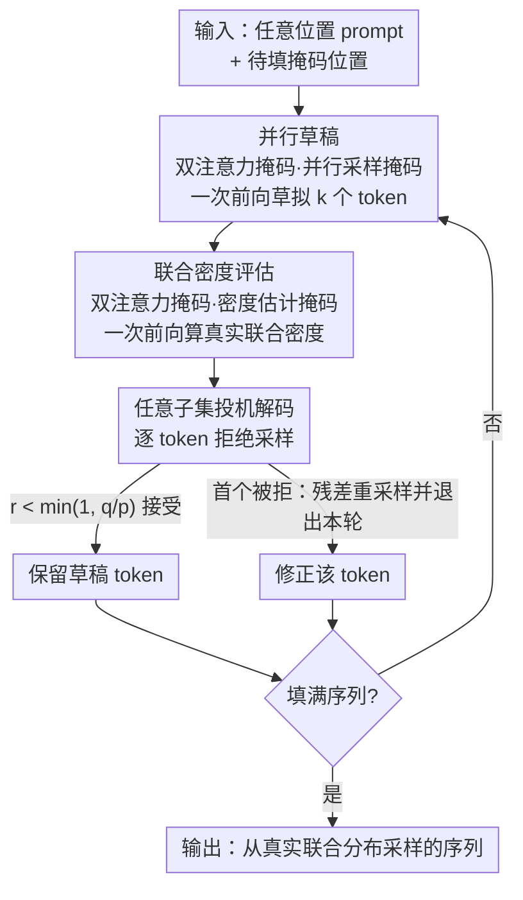

# Self-Speculative Decoding Accelerates Lossless Inference in Any-Order and Any-Subset Autoregressive Models

**会议**: ICLR 2026  
**OpenReview**: [https://openreview.net/forum?id=hZnibTOke7](https://openreview.net/forum?id=hZnibTOke7)  
**代码**: https://github.com/gabeguo/any-order-speculative-decoding （有）  
**领域**: LLM效率 / 投机解码 / 任意顺序自回归  
**关键词**: 任意子集自回归模型、投机解码、并行采样、无损加速、填空生成

## 一句话总结
本文提出 Any-Subset Speculative Decoding（ASSD），让任意子集自回归模型（AS-ARM）用同一个网络既当快速草稿、又当联合密度裁判，通过拒绝采样在**保证从真实联合分布无损采样**的同时并行生成多 token，并从理论上证明神经网络调用次数永远不会超过生成 token 数。

## 研究背景与动机
**领域现状**：当前主流 LLM 几乎全是从左到右的自回归模型（GPT/LLaMA 等）。它们有两个硬伤：必须逐 token 串行生成所以慢；而且天生不支持任意位置的填空（infilling），除非用 FIM 之类的启发式训练把空洞硬塞进序列，但那不保证结构正确。能原生填空的模型主要有两类——离散扩散模型和任意顺序自回归模型（AO-ARM）。

**现有痛点**：离散扩散模型可以一次并行采样多个 token，看似快，但它的并行性建立在「条件独立假设」之上——这个假设只有在时间步无穷小（也就是退化成逐 token）时才成立。一旦真的一次解码多个 token，预测分布就会偏离训练时学到的数据分布，并行越多、保真度越差。形式上，$\sum_{i\in[m,N)}\log p(x_{\sigma(i)}|x_{\sigma(<m)}) \neq \log p(x_{\sigma(\geq m)}|x_{\sigma(<m)})$，等号只在真正独立时才成立。另一边的 AO-ARM 虽然能算联合密度，但几乎没人研究过怎么给它做快速并行采样。

**核心矛盾**：并行采样（快但不保真）和串行采样（保真但慢）之间存在根本 trade-off。扩散模型选了前者牺牲质量，自回归选了后者牺牲速度。能不能在 $O(S)$ 的并行时间复杂度下，仍然恢复出真正服从 $\log p(x_{\sigma(\geq m)}|x_{\sigma(<m)})$ 的样本？

**切入角度**：作者注意到投机解码（speculative decoding）正是这样一个「既快又保真」的范式——用便宜的草稿模型快速生成多 token，再用昂贵的 oracle 模型按拒绝采样接受/拒绝，输出分布可证明等于只用 oracle 采样的结果。投机解码的两个关键要件是：oracle 能做密度估计、有一个快草稿模型。而 AO-ARM 设计上恰好就能估计序列联合密度，又因为架构和训练目标允许任意顺序、并行生成，它**可以充当自己的草稿模型**——这两个要件它一身全占。

**核心 idea**：把投机解码搬到 AS-ARM 上，让同一个网络既当草稿又当 oracle（self-speculative），用拒绝采样把并行草稿纠正回真实联合分布，从而「免费」拿到无损加速。

## 方法详解

### 整体框架
方法分训练和推理两段。训练阶段，把一个现成的 AS-ARM（本文用 110M 的 XLNet）用「教师强制联合损失」微调，让它学会在任意 prompt 位置、任意填空模式下评估序列的联合条件密度。推理阶段就是 ASSD 算法的主循环：给定任意位置散落的 prompt 和一堆待填的掩码位置，模型先用「并行采样掩码」一次性并行草稿出接下来 $k$ 个 token，再用「密度估计掩码」一次前向就把这 $k$ 个 token 的真实联合密度算出来，然后逐个做拒绝采样——接受就保留、第一个被拒就重采样并退出本轮，循环直到填满整条序列。

整个推理是一个「并行草稿 → 一次性联合密度评估 → 拒绝采样校正 → 更新已解码数」的回环，关键是草稿和 oracle 是**同一个网络的两种注意力掩码**，所以草稿的计算可以缓存复用、不额外占显存。下图是推理主循环：

### 关键设计

**1. 双注意力掩码：一个网络同时充当并行草稿和联合密度裁判**

投机解码要求草稿模型「快」、oracle 模型「能算密度」，传统做法是训两个模型，既费显存又费训练成本，而且草稿的计算还不能复用给 oracle。本文的关键观察是：AS-ARM 只要切换注意力掩码，就能用同一套权重同时满足这两个角色。**并行采样掩码**（图 1a）让所有待预测的掩码 token 都只 attend 到 prompt token、互相之间和对自己都不可见，于是无论一次查询多少个位置，它们彼此不影响，可以并行采出条件独立的草稿 $p(x_{\sigma(i)}|x_{\sigma(<m)})$——这就是「免费的草稿模型」。**密度估计掩码**（图 1b）是一个置换后的类因果掩码 $A_{\sigma(i),\sigma(j)} = 1$ 当且仅当 $i>j$，即每个 token 只 attend 到生成顺序里排在它前面的 token，这样**一次前向**就能按 $\log p(x_{\sigma(\geq m)}|x_{\sigma(<m)}) = \sum_{i\geq m}\log p(x_{\sigma(i)}|x_{\sigma(<i)})$ 的因式分解算出整条序列的联合密度（$O(S)$ 时间），充当 oracle。

这一点恰恰是离散扩散模型做不到的：它们用全注意力、靠吸收态 token 表示掩码，无法在一次前向里算出可见 token 的 logits，密度估计要 $O(S\cdot N)$ 而非 $O(S)$，也因此难以套用 KV-cache。AS-ARM 的类因果掩码让「草稿、密度估计、KV 缓存」三件事统一在一个模型里。

**2. 任意子集投机解码（ASSD）：带 NFE 上界保证的无损拒绝采样**

有了并行草稿 $p_{\sigma(i)} = p(\tilde x_{\sigma(i)}|x_{\sigma(<n)})$ 和真实联合密度 $q_{\sigma(i)} = p(\tilde x_{\sigma(i)}|x_{\sigma(<n)}, \tilde x_{\sigma[n:i)})$ 后，ASSD（算法 1）逐 token 做拒绝采样：采 $r\sim U[0,1]$，若 $r < \min(1, q_{\sigma(i)}/p_{\sigma(i)})$ 就接受草稿，否则用残差分布 $(p(\cdot|x_{\sigma(<n)}, \tilde x_{\sigma[n:i)}) - p(\cdot|x_{\sigma(<n)}))_+$ 重采样并立即退出本轮。

它相比 vanilla 投机解码有三个本质优势。其一是**Theorem 1：函数评估次数（草稿+oracle 合计）永远不超过生成的 token 数 $N-m$**——这点 vanilla 投机解码做不到，Leviathan 等人指出当草稿很烂或很贵时 vanilla 反而可能增加 NFE、拖慢运行；而 ASSD 由 Lemma 1（每轮第一个草稿 token 必被接受）保证了下界，从而拿到上界。其二是**Theorem 2：输出可证明服从真实联合分布** $p(x_{\sigma(\geq m)}|x_{\sigma(<m)})$，无损。其三是它天然处理 $O(2^N)$ 种任意子集填空模式，而 vanilla 投机解码只能处理 $O(N)$ 种从左到右的模式。基于 Lemma 1 和 Theorem 1，作者建议每轮草稿 token 数取 $k>2$。

**3. 教师强制联合损失：把 AS-ARM 训练成能评估联合密度的模型**

要让上面的 oracle 角色成立，模型必须真的会算联合条件密度，这就需要一个和扩散模型/MAC 都不同的训练目标。本文最大化联合条件概率的交叉熵 $\max_\theta \mathbb{E}_{m\sim f(\cdot), \sigma\sim s(\cdot|m)}[\log p_\theta(x_{\sigma(\geq m)}|x_{\sigma(<m)})]$，它由三部分构成：联合条件分布、对 token 顺序 $\sigma$ 的期望、对 prompt 长度 $m$ 的期望。作者把生成过程建模成一条吸收态马尔可夫链 $X_t = x_{\sigma(<N-t)}$，逆向求和每一步 $\log p_\theta(x_{\sigma(N-t+1)}|x_{\sigma(<N-t)})$ 累加即得整条联合密度，从数学上论证了这个目标。

与 MAC 和离散扩散用的「条件独立损失」相比，本文的联合损失之所以可行，正是因为类因果注意力掩码——后两者没有这种掩码，架构上根本支持不了联合损失。训练时 $m\sim U[0.01N, 0.10N]$（让模型从近乎空白处生成），$\sigma$ 先从全排列采样再按 Equation 4 的协议把 prompt 段和待生成段各自升序排序，消除路径歧义、把要学的排列从 $N!$ 降到 $2^N$。

### 一个完整示例
以一句 "This is machine learning" 为例，prompt 给定 "This"、"is"（生成序为 0、1），要并行填 "machine"、"learning"。**并行草稿**阶段用并行采样掩码：两个待填位置都只看 "This is"、互不可见，一次前向并行采出草稿 $\tilde x$。**联合密度评估**阶段切到密度估计掩码（强制顺序 is→This→learning→machine，每个 token 只看前面解码过的），一次前向算出每个草稿 token 在真实因式分解下的密度 $q$。**拒绝采样**：第一个草稿 token 由 Lemma 1 必接受；第二个比较 $r$ 与 $\min(1, q/p)$，接受则保留，若被拒就从残差分布重采样并结束本轮。实测并行草稿平均每轮能生成 2.24 个 token（而上下文 n-gram 草稿只有 1.15 个），循环若干轮就填满，且总 NFE 不超过掩码 token 数。

### 损失函数 / 训练策略
训练目标即上面 Equation 7 的教师强制联合交叉熵。实现上从 Huggingface 大小写敏感的 110M XLNet 预训练权重出发微调，数据是 OpenWebText，按 XLNet 的 32000 词表分词、打包切成 512 token 的块，用分隔符标记文档边界。之所以要微调而非直接用预训练权重，是因为原始 XLNet 只训练预测 512 中的 85 个掩码（不到 20%），偏向理解而非生成；要做近乎从零的生成就得在更宽的掩码比例分布上重训。

## 实验关键数据

### 主实验
正确性与速度（WikiText，640 条序列，随机掩 95%，$k=5$）：

| 采样器 | Gen PPL | 熵 | 模型 NFE | 辅助 NFE | 时间(s) |
|--------|---------|-----|----------|----------|---------|
| 串行 | 107.9 | 7.65 | 486.0 | 0.0 | 18.21 |
| ASSD (N-Gram 草稿) | 111.7 | 7.64 | 422.0 | 422.0 | 16.80 |
| ASSD (自起草) | 107.6 | 7.64 | 434.1 | 0.0 | 16.50 |

填空 benchmark（HumanEval 单行代码补全 pass@1 与 ROCStories ROUGE）：

| 模型 | 参数量 | 任务 | 指标 | 备注 |
|------|--------|------|------|------|
| XLNet-Code (本文) | 110M | HumanEval | pass@1 38.59 | 仅 15B 代码 token |
| DiffuLLaMA | 6738M | HumanEval | pass@1 40.68 | 50× 参数、19B+46B token |
| AS-ARM-FT (本文) | 110M | ROCStories Infill 3/5 | ROUGE-1 18.0 | 6 项指标中 4 项最优 |
| DiffuGPT-S | 127M | ROCStories Infill 3/5 | ROUGE-1 16.4 | 262B+130B token |

### 消融实验

| 配置 | 关键现象 | 说明 |
|------|---------|------|
| 自起草 vs 串行 | 时间 16.50 vs 18.21，PPL/熵几乎相同 | 印证 Theorem 2 无损 + Lemma 1 提速 |
| 自起草 vs N-Gram 草稿 | 每轮 2.24 vs 1.15 token | 并行草稿质量更高、接受更多 |
| $2^N$ 因式分解（vs $N!$） | 优化更容易（Figure 3） | 验证 MAC 的二进制格分解 |
| AS-ARM-PT vs AS-ARM-FT | PT 在单句填空（~20% 掩码）最好 | 微调到宽掩码分布会分摊模型容量 |

### 关键发现
- **自起草是最快且 NFE 最少的变体**：并行草稿质量高，平均每轮生成 2.24 个 token；N-Gram 草稿虽便宜但每轮仅 1.15 个，整体略慢。
- **无损得到实证支持**：ASSD（自起草）与串行解码的 Gen PPL（107.6 vs 107.9）和熵（7.64 vs 7.65）统计上一致，符合 Theorem 2。
- **小模型打大模型**：110M 的 AS-ARM 在代码填空上 pass@1 38.59，逼近 50× 大的 DiffuLLaMA（40.68），且微调 token 少得多。
- **掩码比例错配会掉点**：预训练权重在 ~20% 掩码的单句填空上反而比微调版强，说明把容量摊到更宽的掩码分布有代价。

## 亮点与洞察
- **「免费午餐」式的无损加速**：草稿和 oracle 共用一个网络、靠切换注意力掩码区分角色，既不额外训模型也不额外占显存，还能复用草稿的 KV 缓存——这是把投机解码从「需要辅助草稿模型」简化成「自起草」的关键。
- **NFE 上界保证补上了 vanilla 投机解码的短板**：vanilla 在草稿差时可能越投机越慢，ASSD 用 Lemma 1（首 token 必接受）从机制上锁死了「永不增加 NFE」，这个理论保证迁移到任何能做联合密度估计的自回归模型上都有价值。
- **重新发掘被遗忘的 AS-ARM**：作者把「任意顺序自回归 + 类因果掩码」这条老路线（XLNet + MAC）和现代投机解码缝在一起，论证了它在并行无损生成上比离散扩散更有原则性，提示了一条非扩散的并行填空方向。

## 局限与展望
- **模型规模小**：实验止步于 110M（XLNet），作者明确把「扩到十亿参数」列为 future work，大模型上的加速比和质量都还未验证。
- **依赖特定架构**：ASSD 要求架构能在一次前向里对可见和掩码 token 都算 logits（类因果掩码），主流的全注意力离散扩散架构无法直接适配，迁移面受限。
- **预训练细节缺失带来的不确定性**：XLNet-Base 的公开权重未披露完整预训练配方，文中关于「~2T token」的训练量是按 XLNet-Large 假设外推的，横向 token 效率比较需谨慎。
- **加速比尚温和**：WikiText 上时间从 18.21s 降到 16.50s（约 9%），更多体现在 NFE 与理论保证而非数量级提速，实际收益依赖每轮可接受 token 数。

## 相关工作与启发
- **vs 离散扩散（SEDD / MDLM / DiffuLLaMA / LLaDA）**：扩散靠条件独立假设并行采样，token 越并行越偏离联合分布，且全注意力无法做联合密度估计、难上 KV-cache；本文用类因果掩码的 AS-ARM 既能并行又能一次前向算联合密度，从而无损。
- **vs vanilla 投机解码（Leviathan / Chen 等）**：vanilla 只适用从左到右模型、需要辅助草稿、NFE 无上界且只能处理 $O(N)$ 模式；ASSD 自起草、保证 NFE 不超 token 数、处理 $O(2^N)$ 任意子集填空。
- **vs AO-ARM / MAC（Yang 2019 / Shih 2022）**：本文从 XLNet 取「类因果注意力→$O(1)$ 密度估计」，从 MAC 取「二进制格递归分解→把 $N!$ 降到 $2^N$」，再首次把投机解码引入这一族模型实现快速无损并行采样。

## 评分
- 新颖性: ⭐⭐⭐⭐⭐ 首次把投机解码与 AS-ARM 结合，并给出 NFE 上界这一 vanilla 缺失的理论保证。
- 实验充分度: ⭐⭐⭐⭐ 正确性/速度/代码/语言填空都覆盖，但规模限于 <200M、加速比温和。
- 写作质量: ⭐⭐⭐⭐⭐ 动机推导清晰，理论（Lemma/Theorem）与算法、注意力掩码图配合得当。
- 价值: ⭐⭐⭐⭐ 复活了一条非扩散的并行无损填空路线，理论保证可迁移，落地待大模型验证。

<!-- RELATED:START -->

## 相关论文

- [\[ICLR 2026\] Overcoming Joint Intractability with Lossless Hierarchical Speculative Decoding](overcoming_joint_intractability_with_lossless_hierarchical_speculative_decoding.md)
- [\[CVPR 2026\] ParallelVLM: Lossless Video-LLM Acceleration with Visual Alignment Aware Parallel Speculative Decoding](../../CVPR2026/llm_efficiency/parallelvlm_lossless_video-llm_acceleration_with_visual_alignment_aware_parallel.md)
- [\[ICLR 2026\] ReFusion: A Diffusion Large Language Model with Parallel Autoregressive Decoding](refusion_a_diffusion_large_language_model_with_parallel_autoregressive_decoding.md)
- [\[ICLR 2026\] Inference-Cost-Aware Dynamic Tree Construction for Efficient Inference in Large Language Models](inference-cost-aware_dynamic_tree_construction_for_efficient_inference_in_large_.md)
- [\[ICLR 2026\] SpecBranch: Speculative Decoding via Hybrid Drafting and Rollback-Aware Branch Parallelism](specbranch_speculative_decoding_via_hybrid_drafting_and_rollback-aware_branch_pa.md)

<!-- RELATED:END -->
