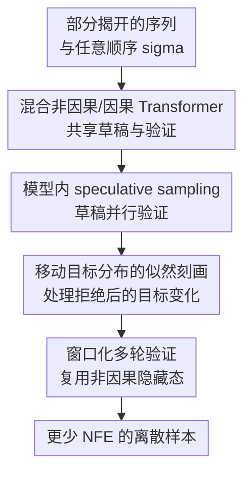

# Self-Speculative Masked Diffusions

**会议**: ICLR2026  
**OpenReview**: [https://openreview.net/forum?id=ogMTEtHO6M](https://openreview.net/forum?id=ogMTEtHO6M)  
**代码**: 无公开代码  
**领域**: LLM效率  
**关键词**: masked diffusion, speculative sampling, self-speculative decoding, 离散生成, 蛋白序列生成  

## 一句话总结
Self-Speculative Masked Diffusions 把 masked diffusion 的非因果并行草稿分布和任意顺序因果目标分布合进同一个 Transformer，用自 speculative sampling 在一次主要前向中验证多个 masked token，从而在文本建模和蛋白序列生成上以接近相同质量减少约 $2\times$ 网络前向次数。

## 研究背景与动机
**领域现状**：离散数据生成里有两条常见路线：自回归语言模型逐 token 从左到右生成，masked diffusion / any-order autoregressive model 则允许在任意顺序下逐步揭开被 mask 的 token。后者对文本以外的序列尤其有吸引力，例如蛋白质序列没有天然的“从左到右才合理”的生成语义，模型可以根据任意已经揭开的残基去补剩余位置。

**现有痛点**：标准 masked diffusion model 每一步用非因果 Transformer 对所有仍被 mask 的位置输出一个因子化预测分布，即把不同 masked 位置近似成条件独立。这个假设让一次前向可以同时采样多个位置，但也带来硬上限：如果一口气揭开太多 token，模型实际上没有建模这些新 token 之间的相关性，样本质量会明显下降。为了保持质量，只能把每一步揭开的 token 数量压小，最终需要很多 neural function evaluations，也就是很多次网络前向。

**核心矛盾**：作者要解决的是“并行揭 token”和“非因子化依赖”之间的矛盾。真正理想的分布应该像自回归模型一样让后面 token 条件依赖前面刚生成的 token，但朴素自回归采样 $k$ 个 token 又要 $k$ 次前向，直接抵消 masked diffusion 的并行优势。

**本文目标**：本文希望保留 masked diffusion 的任意顺序和并行更新，同时让一次更新里新揭开的 token 不再彼此独立。更具体地说，它要在单模型内部构造一个廉价 draft 分布和一个更强 target 分布，用 speculative sampling 只接受 target 认可的 draft token，并把每轮采样需要的完整网络前向次数降下来。

**切入角度**：作者观察到 LLM 推理加速里的 speculative sampling 正好适合这个矛盾：先由便宜分布连续起草多个 token，再由强分布并行验证，只要接受/拒绝规则正确，输出仍服从目标分布。难点在于 masked diffusion 的主干通常是非因果的，而 speculative verification 需要因果目标分布；此外，在 masked diffusion 中每次接受/拒绝会改变非因果层看到的已揭开上下文，目标分布会随轨迹移动。

**核心 idea**：用同一个混合 Transformer 的非因果层生成 masked token 草稿，再把最后一小部分层切成任意顺序因果验证器，通过模型内自 speculative sampling 近似采样非因子化 masked-token 分布。

## 方法详解

### 整体框架
这篇论文把标准 masked diffusion 的一次“并行揭开若干 mask”改造成“先并行起草，再因果验证，再接受一段 token”的循环。给定一个生成顺序 $\sigma$ 和当前已经揭开的前缀 $x_{\sigma(1:i)}$，模型先用非因果层对未来位置产生 draft token，然后用同一网络末端的因果层沿 $\sigma$ 顺序给这些 draft token 打 target 概率，最后按 speculative sampling 的接受率逐个验证，直到全部 token 被揭开。

从读者视角看，这个方法不是再训练一个单独的 draft model，也不是把 masked diffusion 蒸馏成更粗的时间网格。它是在一个 masked diffusion 主干上加少量因果计算，使前面的非因果层继续承担全局上下文建模和草稿生成，最后的因果层只负责把草稿 token 之间的顺序依赖补上。

### 关键设计
**1. 混合非因果/因果 Transformer：共享草稿与验证**

标准 masked diffusion 的非因果层可以看到所有位置的隐藏状态，但输入里未揭开的位置是 mask token，因此它适合输出因子化草稿分布 $\overleftrightarrow{p}_\theta(x_{\sigma(i+1:D)} \mid x_{\sigma(1:i)})$。本文保留这部分结构，让它像普通 MDM 一样对所有未来位置一次性给出 draft logits；这保证了起草阶段便宜且并行。

为了让验证阶段不是另一个外部模型，作者把最后若干 Transformer block 改成沿任意顺序 $\sigma$ 的因果层。因果层采用类似 $\sigma$-GPT 的设置：序列按 $\sigma$ 重排，每个 track 既知道当前位置，也知道下一个要预测的位置，因此第 $j$ 个 track 可以预测 $x_{\sigma(j+1)}$。同时，因果层还接收非因果层中“当前位置”和“下一位置”的隐藏状态，并在输出端把下一位置的非因果隐藏状态 residual 加回去。这个 residual 很关键：它让 target 分布 $\overrightarrow{p}_{\theta,\phi}$ 学的是“在 draft 基础上补依赖”，而不是从零学一个完全不同的模型，所以 draft 和 target 更对齐，speculative sampling 的接受率也更高。

**2. 模型内 speculative sampling：把非因子化依赖压进一次更新**

在一次采样更新中，非因果层先对窗口内所有未知位置采样 draft token $\hat{x}_{\sigma(i+1:D)}$。随后，因果层在这些 draft token 作为未来输入的条件下，并行计算每个 draft token 的目标概率 $\overrightarrow{p}_{\theta,\phi}(\hat{x}_{\sigma(d)} \mid \theta(x_{\sigma(1:i)}), \phi(\hat{x}_{\sigma(i+1:d-1)}))$。验证时从第一个未知位置开始，用接受概率 $\min(1, q(\hat{x}) / p(\hat{x}))$ 决定是否接受，其中 $p$ 是非因果 draft 概率，$q$ 是因果 target 概率；第一次拒绝时，从残差分布 $\tilde{p}(x) \propto \max(0, q(x)-p(x))$ 重新采样该 token，然后结束这一轮内循环。

这样做的效果是，一次主前向不再只是从“所有未来 token 条件独立”的分布里硬采样，而是尽量从一个沿 $\sigma$ 展开的非因子化 target 分布里采样一段 token。被接受的连续 draft 段保留了 speculative sampling 的正确性直觉：如果 draft 和 target 对某个 token 近似一致，就直接省掉 target 自回归重算；如果二者分歧大，就通过拒绝和残差重采样纠正。于是 masked diffusion 可以在质量不崩的情况下每次揭开更多 token。

**3. 移动目标分布的似然刻画：处理 masked diffusion 特有的轨迹依赖**

普通 LLM 的 self-speculative decoding 通常是固定左到右目标分布：一旦前缀确定，后续 target 概率不会因为“这一轮从哪里拒绝”而变成另一个模型计算路径。masked diffusion 不同。若在第 $i$ 个已揭开 token 时开始一轮验证，非因果层看到的是 $x_{\sigma(1:i)}$；如果中途拒绝并揭开到 $j>i$，下一轮非因果层看到的上下文变为 $x_{\sigma(1:j)}$，它输出的隐藏状态和后续 target 分布都会改变。

作者没有把这个变化当成实现细节糊过去，而是给出一个递归分解：对给定顺序 $\sigma$，样本似然可以按“全接受路径”和“某个位置首次拒绝后再全接受”的事件拆开，并用动态规划在 $D$ 次神经网络前向和 $O(D^2)$ 普通运算内计算。这个理论结果说明 Algorithm 2 定义的是一个可分析的生成模型，而不只是一个经验加速技巧；虽然训练时作者没有直接优化这个 ELBO，而是使用更便宜的交叉熵目标，但这个分解解释了为什么拒绝位置会成为模型概率的一部分。

**4. 窗口化多轮验证：复用最贵的非因果计算**

Algorithm 2 的朴素版本是一轮非因果 draft 加一轮因果验证。论文进一步提出窗口化多轮验证：一次非因果前向先产生窗口 $W(i)$ 内的 draft 分布，然后在同一批非因果隐藏态上重复运行若干次因果验证内循环。每次拒绝重采样后，后续 draft token 的值会变化，因此因果概率需要重算；但非因果隐藏态仍然可以复用，因为外层已揭开上下文没有变。

这个设计利用了架构里的计算不对称：实验中大部分层都是非因果层，例如 12 层模型里 11 层非因果、1 层因果，所以多跑几次末端因果层的代价远小于多跑完整网络。窗口函数 $W(i)$ 通常随已揭开 token 数增加而变大，直觉是生成早期上下文稀少，不宜一次接受太多；后期上下文充分，剩余 token 的不确定性更低，可以放宽窗口。作者发现 cosine-shaped window 比线性窗口更好，并用 $\Delta\tau$ 与每次 draft 的验证轮数调节质量和延迟。

### 一个完整示例
假设要按顺序 $\sigma$ 补全一句 6 个 token 的文本，当前只揭开了 “is”“a”“guess”，其余位置仍是 mask。标准 masked diffusion 会让非因果 Transformer 同时预测 “Speculation”“like”“hazarding”，但这三个预测彼此独立：模型可能分别觉得每个词都合理，却没有显式建模 “Speculation is like hazarding a guess” 这种组合顺序。

本文的方法先用非因果层给三个未知位置起草，例如草稿为 “Speculation / like / hazarding”。接着因果层按 $\sigma$ 顺序读取已经揭开的真实 token 和未来 draft token：当它验证 “like” 时，已经可以条件化在前一个 draft “hazarding” 或当前顺序中更早的 token 上；当它验证 “Speculation” 时，也能看到顺序中更早已经接受或起草的内容。若 target 概率与 draft 概率接近，token 直接接受；若某个位置 target 明显不同，就拒绝该 draft 并从 $q-p$ 的正残差分布重采样，然后重新进入下一轮外循环或复用当前非因果隐藏态继续验证。

这个例子里真正省下的是“逐 token 因果前向”。如果三个草稿都被接受，本来需要三次自回归 target 前向的非因子化生成，被压到一次非因果主干前向加少量因果层验证；如果只接受前两个，方法也至少把这两个 token 的依赖验证并行化了。

### 损失函数 / 训练策略
训练时，模型同时优化非因果 draft 分布和因果 target 分布。给定真实序列 $x$、随机顺序 $\sigma$ 和已经揭开的长度 $i$，非因果部分预测所有 masked token，因果部分在完整真实 token 序列按 $\sigma$ 排列后用 causal attention 预测后续 token。总目标可以概括为两项交叉熵之和：

$$
\mathcal{L}=\mathbb{E}\left[\frac{D}{D-i}\left(\log \overleftrightarrow{p}_\theta(x_{\sigma(i+1:D)}\mid \theta(x_{\sigma(1:i)})) + \log \overrightarrow{p}_{\theta,\phi}(x_{\sigma(i+1:D)}\mid \theta(x_{\sigma(1:i)}),\phi)\right)\right].
$$

其中 $\frac{D}{D-i}$ 用来按 masked token 数归一化，第一项等价于 masked diffusion 的常规训练目标，第二项相当于任意顺序的自回归交叉熵。重要的是，两项都能通过混合网络的一次前向得到。论文还展示了两种训练方式：OpenWebText/text8 从头训练 11 个非因果层加 1 个因果层；UniRef50 蛋白实验则冻结已有 30 层 ESM2-based masked diffusion 模型，只额外训练一个因果 block，说明这个方法也可以作为 pretrained MDM 的轻量加速头。

## 实验关键数据

### 主实验
论文用三个层级验证方法：text8 看小规模字符生成，OpenWebText 看 GPT2-scale 文本建模，UniRef50 看非文本的蛋白序列生成。共同结论是，在相近样本质量下，self-speculative masked diffusion 需要的 NFE 明显少于标准 masked diffusion，典型速度收益接近 $2\times$。

| 数据集 | 指标 | 本文 | 对比方法 | 主要结论 |
|--------|------|------|----------|----------|
| text8 | Spelling accuracy vs NFE | 低 NFE 区间以更少 NFE 达到更高拼写准确率 | 标准 Mask Diffusion | 在约 20-50 NFE 区间优势明显，可达到超过 $2\times$ 的 NFE 降低 |
| OpenWebText | GPT2 NLL / token entropy | 32 NFE 时 GPT2 NLL 5.28，64 NFE 时 5.12，128 NFE 时 5.05 | Masked Diffusion：32 NFE 5.50，64 NFE 5.27，128 NFE 5.13 | 约一半 NFE 达到同等 NLL，同时 entropy 基本保持一致 |
| UniRef50 | ESMFold pLDDT vs NFE | 在高 pLDDT 区间约 $2\times$ speed-up | Wang et al. 2024 的非因果 MDM 采样 | 冻结 pretrained 蛋白 MDM、只加一个因果 block 也能改善质量-计算折中 |

OpenWebText 的表格最能说明“不是靠低 entropy 取巧”。SDTT 的 GPT2 NLL 更低，但 unigram entropy 明显更低，说明样本可能更 mode-seeking；本文方法的 entropy 与 MDM 基线接近，因此更像是在保持多样性的同时减少 NFE。

| 方法 | GPT2 NLL @32 NFE | GPT2 NLL @64 NFE | GPT2 NLL @128 NFE | Entropy @64 NFE | 备注 |
|------|------------------|------------------|-------------------|-----------------|------|
| Masked Diffusion | 5.50 | 5.27 | 5.13 | 5.70 | 标准因子化 MDM 采样 |
| Speculative (ours) | 5.28 | 5.12 | 5.05 | 5.70 | 同等 entropy 下 NLL 更好 |
| SDTT | 3.70 | 3.46 | 3.30 | 5.25 | NLL 很低但 entropy 也低，存在 mode-seeking caveat |

### 消融实验
| 配置 | 关键指标 | 说明 |
|------|---------|------|
| Full model: 11 non-causal + 1 causal | OpenWebText 32/64/128/256 NFE 的 GPT2 NLL 为 5.28/5.12/5.05/5.02 | 主模型，draft 足够强，target 用一层补依赖 |
| No output residual | GPT2 NLL 为 5.36/5.16/5.10/5.05 | 去掉输出 residual 后接受率和 target 学习都变差，低 NFE 尤其受影响 |
| 10 non-causal + 2 causal layers | GPT2 NLL 为 5.34/5.16/5.06/5.03 | 增强 target 但削弱 draft，整体质量-计算折中反而不如一层 causal |
| 蛋白 pretrained + 1 causal block | UniRef50 上高 pLDDT 区间约 $2\times$ speed-up | 冻结非因果 ESM2-based MDM，只训练额外因果头仍有效 |

### 关键发现
- 最重要的收益来自“target 非因子化、draft 仍并行”。训练曲线显示 causal loss 在早期跟 non-causal loss 接近，随后显著下降，说明因果层确实利用了额外 draft/真实 token 上下文，而不只是重复非因果预测。
- residual connection 是一个小但关键的工程设计。它让 causal target 从 non-causal hidden state 上修正，而不是另起炉灶，因此 draft/target 更对齐，speculative acceptance 更稳定。
- 并不是因果层越多越好。OpenWebText 上 10nc-2c 不如 11nc-1c，说明在这个设定里草稿质量比更强但更贵的 target 更重要。
- window 和验证轮数控制速度-质量旋钮。text8 附录显示 $\Delta\tau$ 从 0.01 增到 0.083 时，NFE 从 80 降到 21，但 spelling accuracy 从 0.91 降到 0.87；这说明早期揭 token 太激进会损伤质量。
- 额外 FLOPs 很小。OpenWebText 设置下混合架构额外 projection 和 residual 的 FLOPs 约为完整 vanilla Transformer 前向的 0.98%，远小于 NFE 下降带来的收益。

## 亮点与洞察
- 把 speculative sampling 迁移到 masked diffusion 的关键不在“套一个 draft-verify 框架”，而在让 target 变成任意顺序因果分布。这个改动直接针对因子化 MDM 的质量瓶颈，比单纯调噪声日程或跳步更触及根因。
- 混合架构的比例选择很漂亮：绝大多数层保持非因果，最后一层因果化。这样既保留 masked diffusion 的并行和双向上下文优势，又只用很少额外成本引入 token 间依赖。
- 论文没有回避目标分布会随拒绝轨迹移动的问题，而是给出似然递归和 ELBO 解释。这个理论补丁很重要，因为它把方法从“启发式采样 trick”提升成一个定义清楚的生成模型。
- 蛋白序列实验有启发性。虽然本文主要是生成推理加速论文，但 UniRef50 说明任意顺序 masked generation 的收益不局限于自然语言，也适合没有固定生成方向的生物序列。
- 这个思路可以迁移到其他离散 diffusion 场景，例如代码 infilling、图结构离散生成、离散音频 token 生成。只要现有模型是非因果 masked generator，就可以考虑加一个轻量因果验证头来减少采样步数。

## 局限与展望
- 方法收益依赖 draft 和 target 的对齐程度。如果非因果 draft 很弱，speculative sampling 会频繁拒绝，实际 NFE 降幅会变小；如果 target 只加一层又学不出足够强的条件依赖，质量收益也有限。
- 论文主要展示 150M 量级模型。更大模型、更长上下文、更复杂采样策略下，单层 causal head 是否仍是最佳折中，还需要系统验证。
- 采样超参数仍需调节。window 形状、$\Delta\tau$、每次 draft 的验证轮数都会影响质量和延迟，部署时需要根据任务预算重新寻优。
- 理论似然可计算但训练没有直接优化该 ELBO。作者选择便宜的双交叉熵目标是合理的工程取舍，不过这也留下一个问题：直接优化采样算法诱导的似然，是否能进一步提升接受率和样本质量？
- 与 re-masking corrector、confidence-based unmasking、路径规划式 sampling 等 MDM 加速/纠错策略的组合还没有充分探索。论文讨论中也提到，未来可以把本文方法和 compute-intensive inference scaling 结合，在固定计算预算下提高推理能力。

## 相关工作与启发
- **vs 标准 Masked Diffusion / any-order AR diffusion**: 标准方法用非因果 Transformer 对所有 masked 位置做因子化预测，优势是一次前向并行，劣势是新采样 token 之间缺少依赖。本文保留非因果草稿，但通过因果 target 和 speculative acceptance 引入非因子化依赖。
- **vs LLM speculative decoding**: Leviathan et al. 和 Chen et al. 的 speculative sampling 通常用小 draft model 加大 target model，面向固定左到右生成。本文是 self-speculative：draft 和 target 在同一模型内，并且 target 沿任意顺序 $\sigma$ 工作。
- **vs LayerSkip / Kangaroo 等 self-speculative decoding**: 这些方法在纯因果 LLM 里用早退层起草、后续层验证。本文的不同点是大部分网络非因果，最后少量层因果化，目标是加速 masked diffusion 而不是普通左到右解码。
- **vs Medusa**: Medusa 用多头预测未来 token 来加速因果 LLM，本文则用非因果 MDM 作为 draft，并通过任意顺序因果层验证 masked positions，更适合 infilling 和蛋白这类无固定生成方向任务。
- **vs SDTT / distillation-based MDM acceleration**: SDTT 用蒸馏把采样时间网格变粗，速度快但样本 entropy 下降。本文不把模型蒸馏成更 mode-seeking 的学生，而是通过 target 验证减少前向次数，实验中 entropy 更接近原 MDM。

## 评分
- 新颖性: ⭐⭐⭐⭐⭐ 将 self-speculative decoding 改造成 masked diffusion 内部的非因果草稿 + 任意顺序因果验证，问题定义和架构都比较新。
- 实验充分度: ⭐⭐⭐⭐ 覆盖 text8、OpenWebText 和 UniRef50，并有结构消融与超参数分析；但更大模型和更多离散模态仍待验证。
- 写作质量: ⭐⭐⭐⭐ 论文结构清楚，算法和理论解释完整；移动目标分布部分较技术化，读者需要一定 speculative sampling 背景。
- 价值: ⭐⭐⭐⭐⭐ 对 masked diffusion language model 的实际推理效率很有价值，也给蛋白序列等任意顺序离散生成提供了可复用的加速范式。

<!-- RELATED:START -->

## 相关论文

- [\[ICLR 2026\] Parallel Sampling from Masked Diffusion Models via Conditional Independence Testing](parallel_sampling_from_masked_diffusion_models_via_conditional_independence_test.md)
- [\[ICLR 2026\] Self-Speculative Decoding Accelerates Lossless Inference in Any-Order and Any-Subset Autoregressive Models](self-speculative_decoding_accelerates_lossless_inference_in_any-order_and_any-su.md)
- [\[ICML 2026\] KnapSpec: Self-Speculative Decoding via Adaptive Layer Selection as a Knapsack Problem](../../ICML2026/llm_efficiency/knapspec_self-speculative_decoding_via_adaptive_layer_selection_as_a_knapsack_pr.md)
- [\[ACL 2025\] CLaSp: In-Context Layer Skip for Self-Speculative Decoding](../../ACL2025/llm_efficiency/clasp_self_speculative_decoding.md)
- [\[ICLR 2026\] Speculative Speculative Decoding](speculative_speculative_decoding.md)

<!-- RELATED:END -->
