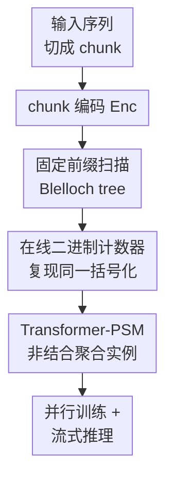

# Sequential Parallel Duality in Prefix Scannable Models

**会议**: ICLR2026  
**OpenReview**: [https://openreview.net/forum?id=tuLF84azND](https://openreview.net/forum?id=tuLF84azND)  
**代码**: 暂未公开（作者承诺接收后公开）  
**领域**: LLM效率 / 高效序列建模  
**关键词**: 前缀扫描, 高效推理, 状态空间模型, 线性注意力, 序列模型理论

## 一句话总结
这篇论文用并行前缀扫描统一刻画了“训练可并行、推理可流式”的高效序列模型，并把这一类模型推广到允许非结合聚合算子的 Prefix-Scannable Models，使 Transformer 风格的 softmax 聚合也能在固定 chunk 下获得近似线性训练和 $O(\log n)$ 记忆的流式推理。

## 研究背景与动机
**领域现状**：现代语言模型和序列模型同时面对两个看似相反的要求：训练时要能沿序列维度并行，否则长序列训练吞吐太低；推理时又要能逐 token 流式生成，否则 KV cache 随上下文线性膨胀，长上下文延迟和显存都会失控。Transformer 解决了训练并行的问题，却把推理端的历史依赖保存在所有过去 key/value 里；Mamba、GLA、RetNet、mLSTM 等新一代线性 RNN / 状态空间模型则试图恢复 RNN 式的流式状态，同时保留 Transformer 式的批量训练。

**现有痛点**：这些高效模型在工程上看起来差别很大：有的来自状态空间模型，有的来自线性注意力，有的来自 fast weight programmer，有的用门控递推，有的用投影更新。它们都声称有“训练并行 + 推理线性”的双重优势，但缺少一个统一语言来说明：哪些模型真正具备这种性质？为什么它们能用 scan 并行训练？能否把 softmax attention 这类非线性、非结合的 token mixing 也放进同一框架？

**核心矛盾**：Transformer 的表达力来自对历史 token 的灵活混合，但这种灵活性通常要付出 $O(n)$ 推理记忆；线性 RNN / SSM 的推理状态很省，却依赖某种可结合或仿射的状态更新，表达空间受到限制。真正的矛盾不是“并行训练 vs 顺序推理”本身，而是“状态聚合必须足够规整才能 scan”与“模型希望使用更一般的上下文聚合”之间的张力。

**本文目标**：作者首先形式化 Sequential-Parallel Duality（SPD）：一个序列模型如果能用近常数深度电路并行算出所有训练位置，同时在线推理时只用小内存更新状态和预测，就满足某种 $\mathrm{SPD}(T(n), m(n))$。随后，论文要回答两个问题：已有高效序列层是否都能看成前缀扫描？如果把 scan 的聚合算子从结合算子放宽到任意二元函数，是否还能得到可训练、可流式的模型族？

**切入角度**：关键观察是 Blelloch prefix scan 本来就把“所有前缀状态”转化为一棵二叉树上的 upsweep / downsweep。对结合算子而言，这棵树与左到右递推给出同一个结果；对非结合算子而言，只要训练和推理都固定同一种二叉树括号化，结果仍然可以一致。也就是说，scan 的价值不只在于“算结合前缀和”，还可以作为一种规定状态聚合顺序的计算骨架。

**核心 idea**：用固定括号化的前缀扫描来定义序列模型状态，把 Mamba/GLA 等仿射递推看作结合 scan 的特例，再用在线二进制计数器把非结合聚合也变成可流式推理的 Prefix-Scannable Model。

## 方法详解

### 整体框架
论文的整体贡献不是提出一个单独的高效层，而是建立一套从理论定义到模型实例的框架：先定义序列模型的顺序视角与并行训练视角，再用 Blelloch scan 解释已有高效层，最后放宽聚合算子得到 PSM，并实例化一个 Transformer-PSM 来验证这种设计空间。输入序列会被切成 chunk，每个 chunk 先编码成状态元素，然后通过固定二叉树 scan 得到每个 chunk 之前的前缀状态，预测头再用“前缀状态 + 当前 chunk”产生当前位置预测。

从计算路径看，训练端使用 static Blelloch scan：所有 chunk 的编码 $x_i=\mathrm{Enc}(C_i)$ 可并行得到，scan 在 $O(\log(n/c))$ 深度内算出每个 chunk 的 exclusive prefix $s_i$，最后每个 chunk 的预测 $\hat{y}_{ic:(i+1)c-1}=\mathrm{Inf}(s_{i-1}, C_i)$ 也可并行。推理端则不保存全部历史 token，而是维护一组按 $2^k$ 大小分桶的子树根；新 chunk 到来时像二进制加一那样不断合并 carry，从而用至多 $O(\log(n/c))$ 个根表示整个历史前缀。

### 关键设计
**1. 顺序-并行对偶：把高效序列模型的目标说成两个可检验条件**

论文先把“高效序列模型”从经验标签变成复杂度定义。一个因果序列模型由状态更新 $U: M\times A\to M$ 和预测模块 $F:M\times A\to \mathbb{R}^{|A|}$ 组成，顺序推理就是反复计算 $s_t=U(s_{t-1}, a_t)$ 与 $\hat{y}_t=F(s_{t-1}, a_t)$。训练端则被定义为一个并行电路族 $C_n$，它要在所有位置同时输出 $F(s_{t-1}, a_t)$。如果训练电路深度是 $\tilde{O}(1)$、总工作量是 $T(n)$，同时推理时每步只需 $m(n)$ 工作记忆，这个模型就满足 $\mathrm{SPD}(T(n), m(n))$。

这个定义的好处是把 Transformer、严格 RNN、SSM/线性注意力放到同一坐标系里。vanilla Transformer 可并行训练，但推理要保存并访问所有过去 KV，因此是近似 $\mathrm{SPD}(n^2,n)$；传统 LSTM/GRU 的状态链有 $\Theta(n)$ 深度，训练端无法在序列维度上做同等意义的并行，所以不属于这里讨论的 SPD 家族；而 Mamba、GLA、RetNet 这类 scan-friendly 层可以达到 $\mathrm{SPD}(n,1)$ 或 $\mathrm{SPD}(n,\log n)$。这一步奠定了后文的判断标准：不是只看“推理快”，而是同时看训练电路、在线状态和二者是否计算同一模型。

**2. 仿射 scan 统一已有线性 RNN / SSM：不同模型共享同一个结合聚合骨架**

对已有高效层，论文指出它们大多可以写成仿射状态更新

$$
s_t = E_t \rhd s_{t-1} + f_t,
$$

其中 $E_t$ 和 $f_t$ 是当前 token 或 chunk 的函数，$\rhd$ 表示某个幺半群对状态空间的作用。只要把每一步表示为二元组 $(E_t, f_t)$，就可以定义一个结合聚合算子

$$
(E_2,f_2)\oplus(E_1,f_1)=(E_2\circ E_1,\; f_2+E_2\rhd f_1),
$$

单位元为 $(I,0)$。连续聚合 $(E_t,f_t)\oplus\cdots\oplus(E_0,f_0)$ 的第二个分量正好就是递推状态 $s_t$，而 $\oplus$ 的结合性保证 Blelloch scan 算出的前缀和左到右递推一致。

这解释了为什么看起来很不一样的 Linear Attention、DeltaNet、RetNet、mLSTM、Gated RFA、S4/S6、Mamba、GLA 能共用并行扫描算法。它们的差别主要体现在 $E_t$ 是恒等、投影、标量门控、对角门控还是输入依赖矩阵，$f_t$ 是 value-key 外积还是状态空间输入项；但一旦升维到 $(E,f)$ 对，训练端都是同一种 affine monoid scan。这个统一视角也指出了边界：如果坚持结合仿射更新，推理状态可以做到常数级，但 token mixing 的形式会受限。

**3. 非结合 PSM：固定括号化比强行结合更重要**

PSM 的关键放宽在于：聚合函数 $\mathrm{Agg}_\theta:M\times M\to M$ 不再要求结合。传统 scan 依赖结合性，是因为人们希望不同括号化都得到同一个结果；但机器学习模型并不一定需要“所有括号化等价”，它只需要训练和推理计算同一个函数。论文因此把 Blelloch tree 本身当作模型定义的一部分：对 $x_0\ \mathrm{Agg}\ x_1\ \cdots\ \mathrm{Agg}\ x_{t-1}$，状态 $s_t$ 就是这棵固定二叉树括号化下的值。

非结合时，训练端的 static scan 自然给出这棵树；推理端的问题是如何在流式输入中复现同一棵树。论文使用在线二进制计数器：维护 `root[k]`，每个槽最多存一个大小为 $2^k$ 的完整子树根。新 chunk 到来时，若 `root[0]` 已满就合并并进位，类似二进制加法；当前前缀输出则按最高有效位到最低有效位折叠所有非空根。这样，每个时刻的根集合恰好把历史前缀划分成若干个 2 的幂大小区间，且内部合并顺序与 static Blelloch scan 一致。

这个设计让非结合聚合也能保持理论上的双端一致性：插入一个 chunk 触碰的槽数等于当前计数末尾连续 1 的个数，均摊只需常数次 $\mathrm{Agg}$；保存的根数最多是 $\lceil\log_2(t+1)\rceil$，因此推理记忆是 $O(\log n)$。代价是状态不再是传统 RNN 那种单个常数向量，而是一组分层 chunk summary；收益是 $\mathrm{Agg}$ 可以是更强的 softmax-like 模块。

**4. Transformer-PSM：把 softmax 注意力变成可流式的 chunk 聚合算子**

为了证明 PSM 不只是抽象定义，作者构造了 Transformer-PSM。它的 Enc 是普通 token embedding；聚合器 $\mathrm{Agg}_\theta$ 是一个带双向注意力 mask 的 GPT-2 风格 Transformer，把两个 chunk state 拼接成 $[x_i\mid x_j]$，经过 Transformer 后取右半部分 $\mathrm{RH}(\cdot)$ 作为合并结果：

$$
\mathrm{Agg}_\theta(x_i,x_j)=\mathrm{RH}(\mathrm{GPT}^{b}_{\theta}([x_i\mid x_j])).
$$

预测模块 $\mathrm{Inf}_\phi$ 则是带 causal mask 的 GPT-2 风格 Transformer，把前缀状态 $s_{t-1}$ 与当前 chunk 编码拼接后，预测当前 chunk 内的 next-token logits：

$$
\mathrm{Inf}_\phi(s_{t-1},x_t)=\mathrm{RH}(\mathrm{GPT}^{c}_{\phi}([s_{t-1}\mid x_t])).
$$

这里的巧妙处在于，softmax attention 聚合显然不是结合算子，直接左到右递推与任意并行树会给出不同结果；但 PSM 不要求它结合，只要求训练和推理都遵守同一 Blelloch 括号化。chunk size $c$ 因而成为一个连续调节旋钮：$c$ 小时更像 SSM，推理状态更省、局部注意力窗口更短；$c$ 大时更像 Transformer，chunk 内 self-attention 捕获更强的局部上下文，但每步计算和缓存增加。附录给出的复杂度也反映了这一点：固定 $c$ 时训练工作量随 $n$ 线性，在线推理的空间主要是 $O(c\log(n/c))$ 的分层 chunk 根。

### 一个完整示例
假设序列被切成 64-token chunk，并且已经处理了 4 个 chunk：$x_0,x_1,x_2,x_3$。训练时，static Blelloch scan 会先在底层合并 $(x_0,x_1)$ 和 $(x_2,x_3)$，再在上层得到 $x_{0:3}$；每个 chunk 的预测都使用它之前的 exclusive prefix，例如预测 $x_3$ 内 token 时使用代表 $x_{0:1}$ 的前缀状态以及 chunk 内 causal attention。

推理时 token 是一个个到来的。模型先把当前 token 放入 buffer，攒满 64 个 token 后得到一个新 chunk $x_t$。如果这是第 1 个 chunk，`root[0]` 为空，直接放入；如果这是第 2 个 chunk，`root[0]` 已有 $x_0$，就合并成 $x_{0:1}$ 并放入 `root[1]`；如果第 3 个 chunk 到来，`root[0]` 为空，所以放入 $x_2$。当需要当前前缀时，模型从最高槽到最低槽聚合非空根，例如 `root[1]=x_{0:1}` 与 `root[0]=x_2` 会按固定顺序组成 $x_{0:2}$。这样它不需要保存所有历史 token，只保存若干棵完整子树的 summary。

这个例子也说明了 Transformer-PSM 与滑窗 Transformer 的差别。滑窗模型只看最近一段 token，超出窗口的内容直接丢失；Transformer-PSM 的历史被压缩成分层前缀状态，虽然不是完整 KV cache，但每个 summary 都是通过 Transformer 聚合得到的历史表达，因此仍能把远处信息带入后续 chunk 的预测。

### 损失函数 / 训练策略
论文没有提出特殊损失，主要使用标准 next-token prediction 或任务交叉熵训练。训练算法是：并行编码所有 chunk，运行 static Blelloch scan 得到每个 chunk 的前缀状态，再并行调用 Inf 预测 chunk 内 token。实验中 Transformer-PSM 的 Agg 和 Inf 都用 GPT-2 风格小型 Transformer，具体层数和维度随任务变化；优化器使用 Adam，并在 S5 实验中报告了 dropout 0.1、weight decay 0.01、学习率 $10^{-4}$ 等配置。

从复杂度看，若序列长度为 $n$、chunk size 为 $c$，训练工作量保持 $O(n)$ 量级（常数中含 chunk 内 attention 的 $c$ 因子），并行深度主要由 $O(\log(n/c))$ 层 scan 决定。在线推理每个 chunk 做一次 Inf 和均摊常数次 Agg，固定 $c$ 时每 token 延迟为常数阶，记忆为 $O(c\log(n/c))$；这正是论文把 PSM 归入 $\mathrm{SPD}(n,\log n)$ 的原因。

## 实验关键数据

### 主实验
论文的实验目标是验证 Transformer-PSM 是否真的兼具 Transformer 的函数能力和 SSM 的推理效率。作者没有追求大模型规模，而是在三个代表性任务上做小而清晰的验证：S5 状态追踪、MQAR 多查询关联回忆、WikiText-103 语言建模与长序列推理延迟。

| 任务 / 数据集 | 指标 | Transformer-PSM | 主要对比 | 结论 |
|--------|------|------|----------|------|
| S5 state tracking | 长度泛化误差率 | 训练长度 4-18，测试到 160+ token 仍保持很低误差 | GPT-2 Transformer、Mamba 误差随长度明显升高 | PSM 在需要精确状态组合的任务上长度泛化更强 |
| MQAR | 键值回忆错误率 | chunk size 64 在分布内长度上接近完美准确 | Mamba 在均匀 query 设定下失败，chunk size 32 的 T-PSM 在 512 长度退化 | 较大 chunk 能保留 Transformer 式 associative recall 能力 |
| WikiText-103 | perplexity | $c=32$ 时 24.12，$c=256$ 时 22.45 | GPT-2 为 22.28，Mamba 为 24.7 | chunk 变大时逐步接近 full-context Transformer |
| 40k token 推理 | 每 token 延迟 | 始终低于约 0.008s | GPT-2 从约 0.002s 增至约 0.04s，Mamba 平均约 0.006s | PSM 延迟随上下文增长更平稳，接近 Mamba 量级 |

S5 任务很适合检验本文的理论主张，因为它本质上要求组合一串置换，属于对状态追踪能力要求很高的算法任务。作者让 GPT-2、370M 参数 Mamba、以及 $c=1$ 的 Transformer-PSM 在长度 4 到 18 的序列上训练，再外推到 180。结果显示，Transformer-PSM 在远超训练长度的测试区间仍能维持低错误率，而 GPT-2 和 Mamba 都明显退化。这说明非结合 PSM 的二叉树状态并不只是“压缩历史”，它在某些组合型任务上可能比常规 Transformer 和线性状态模型更容易学到可外推的计算结构。

WikiText-103 的结果则展示了 chunk size 的 trade-off。$c=32$ 时 perplexity 为 24.12，接近但略好于 Mamba 的 24.7；随着 chunk size 增至 256，perplexity 降到 22.45，已经非常接近从头训练的 GPT-2 base 22.28。也就是说，PSM 没有免费得到 full attention 的全部建模能力，而是提供了一个明确旋钮：愿意多花 chunk 内注意力成本，就能换回更强语言建模能力，同时仍避免 Transformer 推理端随历史长度线性增长的 KV 访问。

### 消融实验
| 配置 | 关键指标 | 说明 |
|------|---------|------|
| Transformer-PSM, MQAR $c=64$ | 分布内长度上接近 0 error | chunk 较大时，局部 Transformer 聚合足以保留键值回忆能力 |
| Transformer-PSM, MQAR $c=32$ | 长度 512 上明显退化 | chunk 太小会限制每次聚合看到的局部信息，远程 recall 更难 |
| Transformer-PSM, WikiText $c=32$ | ppl 24.12 | 更省推理计算，但语言建模能力较弱 |
| Transformer-PSM, WikiText $c=256$ | ppl 22.45 | 更接近 GPT-2 的 22.28，但 chunk 内 attention 成本更高 |
| GPT-2 长序列推理 | 40k token 处约 0.04s/token | KV cache 仍需随上下文访问更多历史，延迟线性增大 |
| Transformer-PSM 长序列推理 | 全程低于约 0.008s/token | 分层 chunk summary 控制历史访问成本 |

### 关键发现
- chunk size 是 Transformer-PSM 最核心的经验旋钮：小 chunk 更接近 SSM 的效率，大 chunk 更接近 Transformer 的建模能力，实验中的 MQAR 和 WikiText 都显示了这一点。
- 非结合聚合并没有破坏训练-推理一致性，因为一致性来自固定 Blelloch 括号化，而不是来自算子本身的结合律。
- 在 S5 状态追踪上，Transformer-PSM 的长度泛化明显强于 GPT-2 和 Mamba，说明二叉树式组合结构对某些算法任务有归纳偏置优势。
- 在推理延迟上，PSM 不是比 Mamba 更快，而是以接近 Mamba 的延迟获得更接近 Transformer 的表达形式；这一定位比“替代 Transformer”更准确。

## 亮点与洞察
- 把“顺序-并行对偶”形式化是这篇论文最有价值的部分。很多高效序列模型过去只是各自证明或经验展示训练并行、推理快，本文给出统一的 $\mathrm{SPD}(T(n),m(n))$ 语言后，可以更清楚地比较 Transformer、严格 RNN、SSM 和线性注意力。
- affine aggregator 的统一很漂亮：把 $s_t=E_t\rhd s_{t-1}+f_t$ 升维成 $(E,f)$ 幺半群后，Linear Attention、Mamba、GLA、RetNet 等模型突然变成同一个 scan 模板的不同参数化。这种抽象有助于读者看清“新架构名”背后的共同计算结构。
- 非结合 PSM 的洞察在于：模型定义可以包含一个固定的括号化策略。只要 static scan 和 online binary-counter scan 复现同一棵树，就不必强迫 softmax attention 变成结合算子，这为设计更强的高效序列层打开了空间。
- Transformer-PSM 的实例说明了一个现实方向：未来高效 LLM 不一定只能在 full attention 和线性 RNN 之间二选一，也可以用 chunk 内强注意力 + chunk 间可扫描 summary 的层次结构来控制推理成本。

## 局限与展望
- 实验规模仍然偏小，主要是 WikiText-103、小型 GPT-2 风格模块和合成任务。论文证明了设计空间有希望，但还没有展示在真实大规模预训练、指令微调或长上下文推理基准上的稳定收益。
- 非结合聚合的固定括号化会引入新的归纳偏置：模型看到的历史组合顺序是平衡二叉树，而不是自然时间顺序。S5 上这可能有利，但在需要精细时间顺序或局部叙事连续性的任务上是否有副作用，还需要更系统的分析。
- $O(\log n)$ memory 相比 Transformer 的 $O(n)$ 很好，但相比 Mamba 这类 $O(1)$ 状态模型仍更复杂；而且每个 root 是 chunk-level Transformer state，实际常数可能不小。工程实现中还要考虑缓存布局、GPU kernel、batching 与动态长度管理。
- Transformer-PSM 依赖 chunk size 选择。不同任务的最佳 $c$ 可能差异很大，且 $c$ 增大时 chunk 内 attention 成本按平方增长，未来需要自适应 chunk、分层 chunk 或可学习合并策略。
- 论文承诺公开代码，但当前笔记写作时尚未见公开仓库。复现实验和验证 latency 结论还需要等待实现细节。

## 相关工作与启发
- **vs vanilla Transformer**: Transformer 训练端天然并行，表达力强，但推理端需要保存和访问全部 KV cache；本文的 PSM 牺牲完整 token-level history，改用分层 chunk summary，从而把长序列推理记忆和延迟压低。
- **vs Mamba / SSM**: Mamba 属于 scan-friendly 的仿射或近似仿射状态更新，推理状态更省；Transformer-PSM 则允许非结合的 softmax-like 聚合，目标是补回一部分 Transformer 式 recall 和 token mixing 能力。
- **vs GLA / RetNet / Linear Attention**: 这些模型可被写入同一个 affine scan monoid，因此是 PSM 的结合特例。本文的贡献不是替它们再造 scan，而是解释为什么它们能 scan，并指出放宽结合律后还有更大模型族。
- **vs Sliding Window Transformer**: 滑窗 Transformer 用固定窗口限制上下文，窗口外信息直接不可见；Transformer-PSM 用可扫描前缀状态压缩历史，理论上能把远处信息通过 summary 传到后续 chunk。
- **启发**: 对长上下文 LLM，可以考虑把层分成局部 full attention 层和跨 chunk PSM 层；前者处理细粒度局部语言结构，后者维护可流式更新的全局摘要。这也可能与 MoE、检索记忆、分层 KV cache 结合，形成更工程友好的长上下文架构。

## 评分
- 新颖性: ⭐⭐⭐⭐⭐ 统一已有高效序列模型并把 scan 推广到非结合聚合，理论视角清晰且有新设计空间。
- 实验充分度: ⭐⭐⭐⭐ 合成任务、语言建模和延迟实验覆盖了核心主张，但规模仍偏验证性，离大规模 LLM 证据还有距离。
- 写作质量: ⭐⭐⭐⭐ 定义和算法链条清楚，附录证明较完整；实验图多为曲线，部分关键数值需要从图和正文合并理解。
- 价值: ⭐⭐⭐⭐⭐ 对研究高效 Transformer、SSM、线性注意力和长上下文推理的人都很有参考价值，尤其适合用作架构设计的理论坐标系。

<!-- RELATED:START -->

## 相关论文

- [\[ICLR 2026\] PrefixMemory-Tuning: Modernizing Prefix-Tuning by Decoupling the Prefix from Attention](prefixmemory-tuning_modernizing_prefix-tuning_by_decoupling_the_prefix_from_atte.md)
- [\[ICLR 2026\] Learning to Parallel: Accelerating Diffusion Large Language Models via Learnable Parallel Decoding](learning_to_parallel_accelerating_diffusion_large_language_models_via_learnable_.md)
- [\[ICLR 2026\] TyphoonMLA: A Mixed Naive-Absorb MLA Kernel For Shared Prefix](typhoonmla_a_mixed_naive-absorb_mla_kernel_for_shared_prefix.md)
- [\[ICLR 2026\] Parallel Sampling from Masked Diffusion Models via Conditional Independence Testing](parallel_sampling_from_masked_diffusion_models_via_conditional_independence_test.md)
- [\[ICLR 2026\] ParaRNN: Unlocking Parallel Training of Nonlinear RNNs for Large Language Models](pararnn_unlocking_parallel_training_of_nonlinear_rnns_for_large_language_models.md)

<!-- RELATED:END -->
