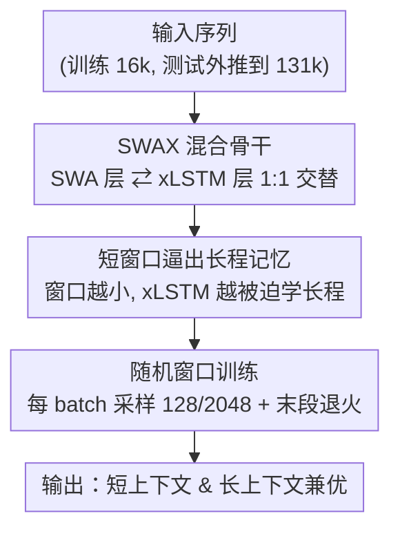

# Short Window Attention Enables Long-Term Memorization

**会议**: ICLR 2026  
**OpenReview**: [https://openreview.net/forum?id=btgVfhudI1](https://openreview.net/forum?id=btgVfhudI1)  
**代码**: 待确认  
**领域**: LLM效率 / 长上下文 / 混合架构  
**关键词**: 滑动窗口注意力, xLSTM, 线性 RNN, 混合架构, 长上下文记忆

## 一句话总结
本文用「滑动窗口注意力 + xLSTM 线性 RNN」交替的混合架构 SWAX 研究短/长程记忆的分工，发现一个反直觉结论——**滑动窗口越短，长上下文检索反而越好**（因为短窗口逼着线性 RNN 去学长程依赖），并据此提出随机窗口训练（每个 batch 随机用 128 或 2048 的窗口），让模型在短上下文和长上下文任务上同时拿到最优。

## 研究背景与动机

**领域现状**：现代 LLM 靠 softmax 注意力的 KV Cache 当工作记忆，长上下文性能很强，但 KV Cache 随序列长度线性膨胀，算力和显存都失控。另一条路是线性 RNN（SSM、线性注意力、xLSTM 等），用一个固定大小的隐状态迭代更新，每个 token 的算力和显存恒定、与序列长度无关，但召回（recall）精度一直比不上 Transformer。近期的主流折中是把两者拼成**混合架构**：大部分层用固定状态大小的组件（滑动窗口注意力 SWA 或线性注意力），少数层保留全局 softmax 注意力。

**现有痛点**：保留全局注意力层的混合架构，仍然带着那少数层 $O(S)$ 的状态和 FLOPs 增长；而纯粹由「固定状态」组件构成的混合架构（如 De et al. 2024 把线性注意力和 SWA 拼起来）虽然算力恒定，却有一个被忽视的问题——**滑动窗口长度怎么选**。已有工作只用验证困惑度（PPL）来挑窗口大小，得出「窗口越长越好，选窗口纯粹是性能 vs 算力的取舍」的结论，但**从没考察过窗口长度对长上下文检索能力的影响**。

**核心矛盾**：在 SWA + 线性 RNN 的混合架构里，两类层的「记忆分工」是隐式形成的。如果 SWA 窗口足够长，训练时绝大多数依赖都落在窗口内，模型会偷懒——优先用更精确的局部 softmax 注意力，而很少训练线性 RNN 去建模长程依赖。结果是：PPL 和短上下文任务看起来都不错，但一旦测试序列超出窗口长度，模型「从没学过靠线性 RNN 做长程检索」，长上下文性能直接崩。

**本文目标**：① 系统刻画滑动窗口长度对短/长上下文任务的真实影响；② 找到一种训练方式，既保住长窗口带来的短上下文精度，又拿到短窗口带来的长上下文外推能力。

**核心 idea**：用**短窗口（甚至随机切换的窗口）当一种「正则」**，逼迫线性 RNN 层接收更多长程依赖的监督信号、专心建模长期记忆，而不是把活全包给局部 softmax 注意力。

## 方法详解

### 整体框架

本文的研究对象是 **SWAX**——一种交替堆叠**滑动窗口注意力（SWA）层**和 **xLSTM（mLSTM 矩阵记忆）层**的混合架构，两类层按 1:1 比例交替。SWA 层是固定窗口 $w$ 的 softmax 注意力，负责高精度建模最近 $w$ 个 token 的局部依赖；xLSTM 层是固定状态大小的线性 RNN，靠一个矩阵记忆 $H_t$ 迭代更新，负责承载无限感受野的长程依赖。两者都是「固定状态、固定每 token 算力」的组件，所以整个模型的算力和显存不随序列长度增长。

围绕这个骨干，本文真正的贡献是**怎么训练它**：先揭示「窗口越短、长上下文越好」这个反直觉规律，再用**随机窗口训练**把短/长窗口的好处合二为一——训练时每个 batch 随机决定用短窗口（128）还是长窗口（2048），并在训练末段退火（停止采样短窗口）以恢复长窗口的短上下文精度；测试时统一用长窗口 2048。

### 关键设计

**1. SWAX 混合骨干：用「局部 softmax + 全局线性记忆」做记忆分工**

针对「纯线性 RNN 召回差、纯 softmax 注意力算力爆炸」的两难，SWAX 把两类**都只有固定状态大小**的组件交替堆叠：SWA 层是窗口为 $w$ 的 softmax 注意力，把每 token 的复杂度从 $O(S)$ 降到 $O(w)$；xLSTM（mLSTM 单元）维护矩阵记忆，读写规则可写成线性注意力的形式——记忆 $H_t = \sum_t \phi(k_t) v_t^\top$ 增量更新，读出 $y_t = \phi(q_t)^\top H_t$，算力恒定 $O(d_{qk}\times d_v)$、与序列长度无关。本文选 xLSTM 是因为它已扩到 7B、有高效 Triton kernel，且在语言任务上 mLSTM 优于 sLSTM。

这个分工之所以有效：大多数预测下一个 token 所需的信息来自局部依赖，纯线性模型不得不把大部分层都耗在建模局部依赖上、留给长程的层很少；而在 SWAX 里，局部依赖被路由给更精确的 SWA 层，于是 xLSTM 层得以**专门化**去建模长程依赖。实验也复现了 De et al. (2024) 的反直觉现象：混合架构虽然全局感受野的层更少，长上下文召回却**优于**纯 SWA 或纯 xLSTM。

**2. 短窗口逼出长程记忆：窗口长度决定线性层收到多少长程监督**

这是本文的核心发现，直指痛点——窗口太长会让 xLSTM 层在训练时「吃不到」长程任务的监督。作者用 $\{128,256,512,1024,2048\}$ 五种固定窗口训练 SWAX，发现一个被以往「窗口越长越好」结论完全掩盖的规律：**用 PPL 和短上下文 reasoning 评估，窗口 2048 确实最好；但一测长上下文检索（RULER NIAH），窗口 2048 反而掉得最狠**。在 131k 序列长度上，短窗口（128/256/512）的 NIAH 召回还有约 30%，而窗口 2048 的召回接近 0%。平均到所有序列长度和 NIAH 子任务，窗口 128 反而是所有窗口里最好的，比 2048 高 16 个准确率点（相对提升 88.9%）。

机理是：窗口为 2048 时，训练里绝大多数依赖都落在窗口内，模型选择用更精确的局部 softmax 而非线性层去建模这些依赖，于是**从没学会靠 xLSTM 做长程检索**，一旦测试序列让依赖跑出窗口就无法外推；反之窗口短时，很多依赖落在窗口外，模型被迫让 xLSTM 去传递信息，长程记忆因此被训练出来。这也纠正了一个常见误解——短窗口**不只是**为了省算力或提硬件利用率，它本身就是让线性层承担长程建模的关键监督来源。

**3. 随机窗口训练 + 末段退火：短长窗口的好处兼得**

短窗口虽利于长上下文，但对短上下文 reasoning 有害——窗口 128 连不少短任务的 prompt 都装不下，短上下文得分明显偏低；而要在测试时用大窗口（拿短上下文精度），又必须在训练时见过大窗口（否则朴素放大窗口会因 RoPE 而灾难性崩溃）。本文用**随机窗口训练**化解这个两难：训练时每个新 batch 以概率 $p$ 把窗口设为 128、否则用默认的 2048（1.4B 用 $p=0.5$，7B 用 $p=0.75$），逼模型既不过度依赖长 SWA 窗口、又保留用大窗口的能力。再加一个**退火**——训练最后 10% 不再采样短窗口、固定用 2048，显著提升短上下文性能而不损害长上下文。测试统一用窗口 2048。

作者把这种「随机降低窗口容量、增强鲁棒性」类比为**对注意力机制做 dropout**。效果上，随机窗口在短上下文上与固定 2048 相当甚至更好，在长上下文上与固定短窗口 128 相当甚至更好，真正做到了「鱼与熊掌兼得」。这也反证了长窗口混合架构长上下文差**不是测试时大窗口的锅，而是训练流程的锅**——只要训练时被迫间歇性用短窗口，线性层就会被调动起来。

## 实验关键数据

实验聚焦语言建模，主力用 1.4B 模型（24 层、维度 2048）、并在 7B（32 层、维度 4096）上验证；全部从头在 16k 序列长度上训练 150B token，不做任何长上下文专门微调。长上下文用 RULER 的 needle-in-a-haystack（NIAH）评测，短上下文用一组 reasoning / commonsense / 代码 benchmark。

### 主实验

不同固定窗口的 1.4B SWAX 在「PPL / 短上下文 / 长上下文」上的对照（节选 Table 1 + Figure 5/6）：

| 配置 | 验证 PPL ↓ | 短上下文均分 ↑ | 长上下文 NIAH（@131k） |
|------|-----------|---------------|----------------------|
| xLSTM（纯线性） | 2.602 | 38.93 | 较弱 |
| SWAX:128 | 2.551 | 39.81 | 约 30%（最佳） |
| SWAX:512 | 2.546 | 40.69 | 较好 |
| SWAX:2048 | **2.523** | **40.88** | 接近 0%（最差） |

可以看到一个清晰的**矛盾**：PPL 和短上下文均分都是窗口越长越好（2048 最优），但长上下文召回完全相反——窗口 128 在 131k 上还有约 30%，窗口 2048 几乎归零，平均 NIAH 上 128 比 2048 高 16 个点。

随机窗口训练把两端拉齐（节选 Table 2）：

| 模型 | 训练窗口 | 测试窗口 | 短上下文均分 ↑ | 长上下文 |
|------|---------|---------|---------------|---------|
| SWAX 1.4B | 128 | 128 | 39.81 | 好 |
| SWAX 1.4B | stochastic | 2048 | 40.81 | 与 128 持平 |
| SWAX 1.4B | 2048 | 2048 | 40.88 | 差 |
| SWAX 7B | stochastic | 2048 | 49.52 | 优于固定 2048 |
| SWAX 7B | 2048 | 2048 | 49.32 | 差 |

随机窗口的验证 PPL（1.4B 为 2.502）甚至低于所有固定窗口，短上下文与固定 2048 相当或更好，长上下文则与固定 128 相当——1.4B 和 7B 上都成立。

### 消融实验

| 配置 | 关键现象 | 说明 |
|------|---------|------|
| 训练窗口 vs 测试窗口（Figure 6） | 测试窗口 > 训练窗口 → 灾难性崩溃 | RoPE 下朴素放大窗口不可行，必须训练时见过大窗口 |
| 退火（末段 10% 固定 2048） | 短上下文显著提升、长上下文不掉 | 让模型学会用大测试窗口 |
| 采样概率 $p$（附录 B） | 1.4B 用 0.5、7B 用 0.75 | 控制短窗口被采样的比例 |
| 换 Gated DeltaNet 当线性层（Table 3） | 同样规律成立 | 结论不绑定 xLSTM |
| local-global（SWA + 全注意力交替，Figure 9） | 短层应小才不拖累长层 | 结论可推广到另一类混合架构 |

### 关键发现
- **窗口长度是「长程监督量」的开关**：窗口越短，越多依赖落在窗口外，xLSTM 被迫学长程，长上下文外推越好；这与 PPL/短上下文给出的「窗口越长越好」完全相反。
- **随机窗口 ≈ 注意力 dropout**：间歇性强制用短窗口防止过度依赖 SWA，等价于随机削减模型容量来提升鲁棒性。
- **结论可迁移**：换成 Gated DeltaNet 线性层、换成 local-global（SWA+全注意力）架构，「短窗口/随机窗口更利于长上下文」的结论都成立。
- 在更真实的 LongBench / LongBench2 / Babilong 上，随机训练多数场景胜出，但个别场景固定 2048 更好——对这么小的模型这些任务整体偏难。

## 亮点与洞察
- **把「窗口大小」从单纯的算力旋钮重新定义为「记忆分工旋钮」**：以前大家以为短窗口只是省算力/提硬件利用率，本文证明它实质上决定了线性层能收到多少长程监督——这是一个观念层面的纠偏。
- **反直觉但机理清晰**：PPL 越好 ≠ 长上下文越好，因为 PPL 测的是局部预测，长程外推靠的是被「逼出来」的线性记忆；这提醒社区别再只用 PPL 挑架构超参。
- **随机窗口 = 一行训练 trick**：不改架构、不加参数、不加测试开销，只在训练时随机切窗口 + 末段退火，就同时拿下短/长上下文，工程上极易复用到任意「SWA + 线性/全局」的混合架构。

## 局限与展望
- 主要在 1.4B / 7B、150B token、16k 训练长度的设定下验证，更大规模、更长训练序列下规律是否依旧需进一步确认。
- 在真实长上下文 benchmark（LongBench/LongBench2/Babilong）上随机训练并非全面占优，部分任务固定长窗口更好，说明合成的 NIAH 与真实长文任务存在 gap。
- 随机窗口的概率 $p$、退火比例、短/长窗口的具体取值（128/2048）都是经验选的，缺少一套自适应或可解释的选择准则。
- 结论建立在「1:1 交替、inter-layer 混合」这一简单设计上，其他混合比例 / intra-layer 混合方式是否同样适用未充分探索。

## 相关工作与启发
- **vs De et al. (2024)**：他们同样混合线性注意力与 SWA，但只用 PPL 挑窗口、得出「窗口越长越好」；本文指出他们漏掉了长上下文这一维度，并给出相反结论——长上下文上短窗口更好。
- **vs 保留全局注意力的混合架构（如 local-global）**：那类架构仍带着全局层 $O(S)$ 的状态/算力增长；SWAX 全部用固定状态组件，每 token 算力恒定，本文还把短窗口结论推广验证到了 local-global 架构。
- **vs Memory Mosaic（Zhang & Bottou, 2025）**：他们也用随机注意力掩码，但作用在长期记忆层上；本文把随机窗口**显式作用在 SWA 层**，目的就是削弱模型对 SWA 做长程召回的过度依赖，动机更对症。

## 评分
- 新颖性: ⭐⭐⭐⭐⭐ 把窗口大小重新诠释为记忆分工旋钮，并给出与主流相反的清晰结论
- 实验充分度: ⭐⭐⭐⭐ 覆盖多窗口、1.4B/7B、多 benchmark 及两类线性层/两类混合架构，但更大规模与真实长文仍有 gap
- 写作质量: ⭐⭐⭐⭐⭐ 机理叙述清楚，反直觉发现层层递进、论证扎实
- 价值: ⭐⭐⭐⭐⭐ 一行训练 trick 即插即用，对长上下文高效架构的设计有直接指导意义

<!-- RELATED:START -->

## 相关论文

- [\[ICLR 2026\] InfLLM-V2: Dense-Sparse Switchable Attention for Seamless Short-to-Long Adaptation](infllm-v2_dense-sparse_switchable_attention_for_seamless_short-to-long_adaptatio.md)
- [\[ICLR 2026\] Sparse Attention Adaptation for Long Reasoning](sparse_attention_adaptation_for_long_reasoning.md)
- [\[ICLR 2026\] Smooth Reading: Bridging the Gap of Recurrent LLM to Self-Attention LLM on Long-Context Understanding](smooth_reading_bridging_the_gap_of_recurrent_llm_to_self-attention_llm_on_long-c.md)
- [\[NeurIPS 2025\] Hardware-aligned Hierarchical Sparse Attention for Efficient Long-term Memory Access](../../NeurIPS2025/llm_efficiency/hardware-aligned_hierarchical_sparse_attention_for_efficient_long-term_memory_ac.md)
- [\[ICLR 2026\] Stacked From One: Multi-Scale Self-Injection for Context Window Extension](stacked_from_one_multi-scale_self-injection_for_context_window_extension.md)

<!-- RELATED:END -->
