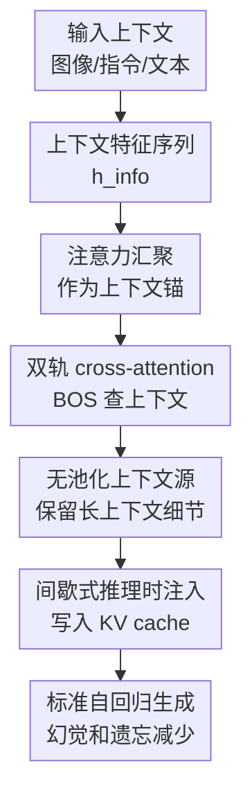

# SinkTrack: Attention Sink based Context Anchoring for Large Language Models

**会议**: ICLR 2026  
**OpenReview**: [https://openreview.net/forum?id=Gg1aPETCL6](https://openreview.net/forum?id=Gg1aPETCL6)  
**代码**: 待确认  
**领域**: LLM效率  
**关键词**: 注意力汇聚, 上下文锚定, 长上下文推理, 推理时干预, 幻觉缓解

## 一句话总结
SinkTrack 把 decoder-only LLM 中天然稳定受关注的 `<BOS>` 注意力汇聚点改造成上下文信息锚，通过训练免费的双轨 cross-attention 在 prefill 阶段向 `<BOS>` 注入输入上下文，从而在几乎不增加解码开销的情况下缓解幻觉和长上下文遗忘。

## 研究背景与动机
**领域现状**：大语言模型和多模态大模型已经能处理问答、视觉推理、多轮对话等复杂任务，但生成过程仍然依赖自回归解码。模型每生成一个新 token，下一步注意力都会同时面对原始输入和已经生成的内容；在长答案、长对话或多模态推理中，后半段生成很容易被最近 token 牵着走。

**现有痛点**：这种“越生成越看近期内容”的偏移会带来两个直接问题。第一是幻觉，模型开始用内部先验补全输入里不存在的对象或事实；第二是上下文遗忘，模型在中途忘掉一开始的格式约束、问题条件或图像细节。论文里举的例子很典型：视觉问答里把道路上的公交车说成飞机，文本推理里虽然开头要求特定答案格式，最后却跑偏。

**核心矛盾**：作者把根因归结为 attention drift：初始输入 token 往往携带最关键的信息，但它们在生成后期获得的注意力持续衰减。与此同时，Transformer 里还有一个相反现象 attention sink：序列第一个 token，也就是 `<BOS>`，虽然语义很稀薄，却在整个生成过程中持续拿到很高注意力。问题就变成：能不能不强行改写模型注意力模式，而是利用这个天然稳定的位置来保存上下文？

**本文目标**：SinkTrack 试图解决三个子问题。首先，要把输入图像、指令或文本上下文里的关键信息送到 `<BOS>`，让它不再只是空占位符。其次，信息注入不能破坏预训练模型原有的计算路径，否则模型会崩。最后，注入过程要足够轻，不能把每一步解码都变成昂贵的额外推理。

**切入角度**：作者的观察很直接：attention drift 让普通初始上下文被遗忘，而 attention sink 让 `<BOS>` 一直被看见。如果把关键上下文写进 `<BOS>` 的表示里，后续 token 即使没有再直接关注原始输入，也会持续通过 `<BOS>` 取到一份浓缩且稳定的上下文线索。

**核心 idea**：用训练免费的双轨 cross-attention，把 `<BOS>` 从被动 attention sink 变成主动 context anchor，让模型在标准自回归生成中持续“看见”初始上下文。

## 方法详解
### 整体框架
SinkTrack 面向 decoder-only LLM/MLLM，不改模型参数，也不额外训练。它在指定的注入层里把注意力计算拆成两条轨道：`<BOS>` 单独作为 query 去 cross-attend 输入上下文特征，其他 token 仍走原始 causal self-attention；两路输出再拼回同一个序列表示，后续生成使用已经写入 KV cache 的锚点表示。

作者不是一上来就提出最终结构，而是先做了两次失败/半成功探索。硬注入直接把 KV cache 里 `<BOS>` 对应的 Value 替换成上下文均值向量，结果模型输出崩溃；软注入把上下文均值向量和 `<BOS>` hidden state 做加权融合，能提升性能，但依赖手调注入强度 `$\alpha$`，而且平均池化会把长上下文压成噪声很大的单向量。最终的 SinkTrack 用自适应 cross-attention 取代静态融合，并保留普通 token 的原始自注意力路径。

### 关键设计
**1. 注意力汇聚作为上下文锚：把 `<BOS>` 从空占位变成高信息入口**

传统上 `<BOS>` 的语义很弱，但它有一个结构优势：后续生成 token 会稳定给它分配高注意力。SinkTrack 把这个现象反过来利用，不去削弱 attention sink，也不去强迫模型重新分配注意力，而是把输入上下文信息写进 `<BOS>` 表示。这样，模型原本就会持续关注的那个位置，现在携带了图像、指令或文本证据。

这个设计针对的是 attention drift 的时间尺度问题。原始输入 token 的注意力会随生成长度变长而下降，但 `<BOS>` 的注意力更像一条稳定通道。只要 `<BOS>` 的 Value/hidden representation 被注入了上下文，后续 token 通过注意力聚合 `$O_t = \sum_{j=1}^{t} \alpha_{t,j} V_j$` 时，即使直接看原始输入的权重变小，也还能从 `$V_{BOS}$` 取到被编码进去的上下文。

**2. 双轨 cross-attention：只改 `<BOS>` 的信息来源，保留其他 token 的原始计算流**

硬替换 KV cache 会让模型崩溃，说明预训练模型对内部计算路径非常敏感。SinkTrack 的核心修正是把注意力拆成两条轨道：第一条轨道只处理 `<BOS>`，令其 hidden state `$H_0^{(l)}` 作为 query，上下文特征 `$h_{info}$` 作为 key/value，执行 cross-attention；第二条轨道处理剩余 token，它们仍然对原始序列做标准 causal self-attention。

用公式看，注入轨道可以写成 `$\bar{H}_0^{(l)} = \mathrm{MHA}(Q=H_0^{(l)}, K=h_{info}, V=h_{info})`。这和软注入的 `$\bar{H}_0^{(l)} = \alpha H_0^{(l)} + (1-\alpha) f_{info}$` 不同：前者让 `<BOS>` 自己根据当前层状态去检索上下文，后者只是把一个静态向量按比例混进去。两轨输出拼接后继续走原模型的输出投影和 FFN，因此普通 token 的位置关系、因果掩码和预训练注意力层级都被保留下来。

**3. 无池化上下文源：避免把长上下文压成单个噪声向量**

早期硬注入和软注入都用了 mean pooling，把图像特征或文本 prompt 压成一个 `$f_{info} \in \mathbb{R}^d$`。这在短输入上可用，但在长对话 QuAC 这类任务上会出现收益递减：上下文越长，单个均值向量越难同时保留局部事实、历史问题、回答链条和当前约束。

SinkTrack 的 cross-attention 不要求 query 和 key/value 长度一致，所以作者去掉了有损池化，直接把完整的上下文特征序列作为 `$K,V$`。这让 `<BOS>` 在不同注入层里可以逐步形成更有针对性的查询：早期层先拿到整体语义，后续层再根据已经增强过的 `<BOS>` 表示选择更相关的上下文片段。这个改动解释了为什么“Pooling SinkTrack”在长上下文里收益会衰减，而完整 SinkTrack 能更稳定地保留增益。

**4. 间歇式推理时注入：把增强限制在 prefill 侧，避免拖慢解码循环**

SinkTrack 的目标不是发明一个需要反复调用外部模块的推理框架，而是做一次轻量内部干预。论文采用每隔 5 层注入一次的间歇策略；实验表明，每层都注入反而更差，可能是过度干扰了模型原本的表示演化。间歇注入给 `<BOS>` 足够多的机会吸收上下文，又不把每层注意力都改成外来机制。

更重要的是，注入发生在生成前的 prefill/上下文编码阶段，增强后的 `<BOS>` 表示会进入 KV cache。之后的自回归生成基本沿用标准解码过程，不需要每生成一个 token 都重新执行复杂模块。附录里的延迟测试也支持这一点：Llama3.1-8B 的 prefill 从 35.90 ms 增至 36.66 ms，Qwen2.5-VL-7B 从 107.13 ms 增至 110.26 ms，额外开销非常小。

### 一个完整示例
以一个带图像的多选问题为例，输入里包含滑雪者、雪地、滑雪板和手杖，问题要求判断活动类型。普通 CoT 在生成前几步可能还看到了图像，但随着解释变长，注意力被“休闲场景”“没有正式比赛结构”等新生成词牵走，最后给出“高山滑雪娱乐”这类偏泛化答案。

使用 SinkTrack 时，图像编码器输出的视觉特征序列先作为 `$h_{info}$`，在若干注入层中被 `<BOS>` cross-attend。`<BOS>` 不只是记住“有雪地”这个全局印象，还能保留“滑雪板和手杖”“没有跳台”“站在较平地面”等具体证据。后续生成解释时，token 仍然按标准 causal decoding 产生，但它们持续关注的 `<BOS>` 已经带着这些视觉证据，因此推理链更容易落在“越野滑雪比赛”而不是模糊的场景联想上。

文本长对话也是类似过程。多轮 QA 的早期问题和回答会被写进 `<BOS>` 锚点；当模型回答后续问题时，即便最近 token 占据了更多注意力，锚点仍然提供一条回到早期上下文的通道。论文的 drift test 显示，在 8k+ 输入后继续生成 1024 个 token 时，模型对 `<BOS>` 的注意力仍约为 0.582，是其他 token 最大注意力的约 14 倍，这说明锚点确实能跨长生成保持可见。

### 损失函数 / 训练策略
SinkTrack 没有训练损失，也不更新模型参数。它是一个 inference-time enhancement：给定原始 hidden states `h_ori` 和外部上下文 hidden states `h_info`，在满足注入条件的层执行 hybrid attention，否则回退到标准 causal attention。

实现上有三个关键超参/规则。第一是注入层位置，论文主实验使用每 5 层注入一次；第二是上下文源，最终版本使用未池化的完整 `$h_{info}$`；第三是注入对象，只对第一个 token 的 query 做 cross-attention，剩余 token 保持原始自注意力。由于不需要 fine-tuning，它避免了灾难性遗忘、训练成本和任务特化风险，但效果会依赖底层模型本身是否具有稳定的 attention sink 模式。

## 实验关键数据
### 主实验
论文在四个多模态数据集和两个文本数据集上评估 SinkTrack。多模态任务覆盖 RealWorldQA、MMStar、M3CoT 和 POPE，文本任务覆盖 QuAC 与 SQuAD2.0；基座模型包括 Qwen2.5-VL、Gemma3、MiniCPM3、Qwen2.5 和 Llama3.1，规模从 3B 到 12B。所有实验用 3 个随机种子报告均值和方差，baseline 主要是 Direct 和 CoT。

| 场景 | 模型 / 数据集 | Direct Acc | CoT Acc | SinkTrack Acc | 关键信息 |
|------|---------------|------------|---------|---------------|----------|
| 多模态平均 | Qwen2.5-VL-3B，4 个多模态集 | 35.68 | 39.05 | 55.37 | 小模型上平均准确率提升最明显，说明锚定不是只服务大模型 |
| 多模态推理 | Qwen2.5-VL-7B，M3CoT | 39.20 | 44.11 | 66.94 | 相比 CoT 提升 22.83 个百分点，复杂多跳视觉推理收益最大 |
| 幻觉检测 | Qwen2.5-VL-7B，POPE | 78.21 | 83.65 | 85.47 | object hallucination 场景中 Acc 和 Macro-F1 都提升 |
| 文本长上下文 | Llama3.1-8B，QuAC | 52.45 | 46.95 | 53.51 | CoT 在长上下文 QA 中反而伤害性能，SinkTrack 保持领先 |
| 不可回答 QA | Llama3.1-8B，SQuAD2.0 | 78.69 | 58.19 | 79.83 | 对应论文摘要中提到的相对 CoT +21.6% |

### 消融实验
| 配置 | 数据集 / 模型 | 关键指标 | 说明 |
|------|--------------|----------|------|
| CoT baseline | M3CoT / Qwen2.5-VL-7B | 43.83 Acc | 仅用“Let's think step by step”提示，不做内部表示干预 |
| Soft Injection: 每层注入 | M3CoT / Qwen2.5-VL-7B | 51.02 Acc | 比 CoT 高，但过度频繁注入会干扰原模型计算流 |
| Soft Injection: 每 5 层注入 | M3CoT / Qwen2.5-VL-7B | 60.04 Acc | 间歇注入明显优于每层注入，说明少量关键层干预更稳 |
| Soft Injection: 递增强度 | M3CoT / Qwen2.5-VL-7B | 59.87 Acc | 后期更强注入没有优势 |
| Soft Injection: 递减强度 | M3CoT / Qwen2.5-VL-7B | 60.69 Acc | 早期更强上下文锚定略好，支持“先建立锚点”的直觉 |
| Pooling SinkTrack | QuAC 分段分析 | 收益随上下文变长而减弱 | mean pooling 压缩长上下文造成信息瓶颈 |
| SinkTrack（无池化） | QuAC 分段分析 | 长上下文收益更稳定 | 完整上下文序列作为 key/value 能缓解信息损失 |

### 关键发现
- SinkTrack 的收益不是单一数据集偶然现象：在多模态和纯文本任务、不同模型家族、3B 到 12B 规模上都能带来正向提升。
- CoT 不总是有益。对于长上下文理解和非推理型 QA，CoT 生成更长解释会加剧 attention drift 和错误累积；SinkTrack 则从内部表示层面补上下文锚点。
- 硬注入会导致模型 collapse，软注入能证明“给 `<BOS>` 放上下文”这个方向有效，但最终必须用更自适应、少手调的机制。
- 机制分析显示 SinkTrack 没有显著改变 `<BOS>` 的层级注意力排序，注入前后 Spearman 相关系数为 `$\rho=0.9985$`，说明它更像是在稳定通道里增加信息含量，而不是破坏注意力结构。
- 计算开销主要出现在 prefill 阶段，Llama3.1-8B 只增加 0.76 ms，Qwen2.5-VL-7B 增加 3.13 ms，和需要每步额外干预的方法相比更接近“免费增强”。

## 亮点与洞察
- SinkTrack 最巧妙的地方是没有把 attention sink 当成一个需要修复的异常，而是把它变成信息通道。很多工作试图校准注意力权重，本文则保持权重模式，让那个本来就会被关注的位置携带更多上下文。
- 方法发展路径很清楚：硬注入失败说明不能粗暴覆盖 KV cache，软注入成功但不够稳，双轨 cross-attention 则把“自适应取上下文”和“保留原始计算流”拆开。这个探索过程让最终设计的动机比较可信。
- 对长上下文推理的启发是，压缩上下文不一定要靠外部检索或摘要，也可以利用模型内部的稳定结构位点。未来的 KV cache 管理、长上下文压缩、视觉 token 压缩都可以考虑“哪些 token 天然会被长期看见”。
- 论文也提醒我们，CoT 的失败有时不是“推理不够多”，而是“生成太长后丢了题”。对这类任务，内部上下文保持机制可能比继续加 prompting 更直接。

## 局限与展望
- SinkTrack 把大量上下文锚到单个 `<BOS>` 表示上，单 token 的固定维度天然存在容量瓶颈。论文自己也指出，极长或极密集上下文可能需要分布式锚点或动态锚点，而不是单一初始 token。
- 论文主要验证公开 QA/VQA/幻觉检测 benchmark，还没有覆盖代码生成、工具调用、多文档检索、长篇写作等更复杂的真实工作流。这些场景里上下文结构更复杂，锚点是否能保存足够细粒度信息还需要验证。
- 方法依赖 decoder-only LLM/MLLM 中稳定的 attention sink。虽然这种现象很常见，但不同架构、不同位置编码、不同推理优化策略下 sink 的强度可能不同，部署前仍需要做模型级诊断。
- 论文说代码可用但缓存文本里没有给出明确仓库 URL，因此复现细节还需要以 OpenReview 后续材料或官方代码为准。
- 未来可以探索多锚点机制，例如选择若干稳定 sink token、句首 token 或任务相关 special token，让不同锚点负责图像细节、格式约束、对话历史和事实证据。

## 相关工作与启发
- **vs Attention Sink / StreamingLLM**: StreamingLLM 等工作利用 attention sink 做长序列缓存和关键 token 保留，核心目标偏向高效推理；SinkTrack 则进一步把 sink token 改造成主动上下文锚，目标是减少幻觉和遗忘。
- **vs attention calibration for LVLM hallucination**: 注意力校准类方法通常直接调节模型对图像 token 或关键 token 的注意力分配；SinkTrack 不主要改注意力权重，而是增强 `<BOS>` 的 value/representation，让原本稳定的注意力通道传递更多信息。
- **vs inference-time intervention / activation steering**: 激活干预方法会在推理时修改 hidden states 来引导输出，但常常需要任务向量、分类方向或多步干预；SinkTrack 的干预目标更结构化，只围绕 `<BOS>` 这个通用 sink 位置，并强调一次性 prefill 开销。
- **vs RAG / external module augmentation**: RAG 通过外部检索补充知识，适合知识缺失；SinkTrack 不引入外部知识，而是帮助模型更好地保留已经给定的上下文。两者可以互补：RAG 负责找证据，SinkTrack 负责在生成过程中不忘证据。

## 评分
- 新颖性: ⭐⭐⭐⭐⭐ 把 attention sink 从被动现象转为上下文锚点，切入角度简洁但很有辨识度。
- 实验充分度: ⭐⭐⭐⭐ 覆盖多模态、文本、不同模型规模和机制分析，但真实长工作流与更多架构验证还可以加强。
- 写作质量: ⭐⭐⭐⭐ 方法探索链条清楚，图和消融能支撑设计选择；部分代码与实现细节仍需依赖附录/仓库。
- 价值: ⭐⭐⭐⭐⭐ 训练免费、低开销、可插拔，对长上下文可靠性和幻觉缓解都有直接工程价值。

<!-- RELATED:START -->

## 相关论文

- [\[ICLR 2026\] UltraLLaDA: Scaling the Context Length to 128K for Diffusion Large Language Models](ultrallada_scaling_the_context_length_to_128k_for_diffusion_large_language_model.md)
- [\[ICLR 2026\] SparseD: Sparse Attention for Diffusion Language Models](sparsed_sparse_attention_for_diffusion_language_models.md)
- [\[ACL 2026\] 阈值差分注意力：无 Sink、超稀疏且非分散的长上下文注意力](../../ACL2026/llm_efficiency/threshold_differential_attention_for_sink-free_ultra-sparse_and_non-dispersive_l.md)
- [\[ICLR 2026\] DND: Boosting Large Language Models with Dynamic Nested Depth](dnd_boosting_large_language_models_with_dynamic_nested_depth.md)
- [\[ICLR 2026\] KnowProxy: Adapting Large Language Models by Knowledge-guided Proxy](knowproxy_adapting_large_language_models_by_knowledge-guided_proxy.md)

<!-- RELATED:END -->
