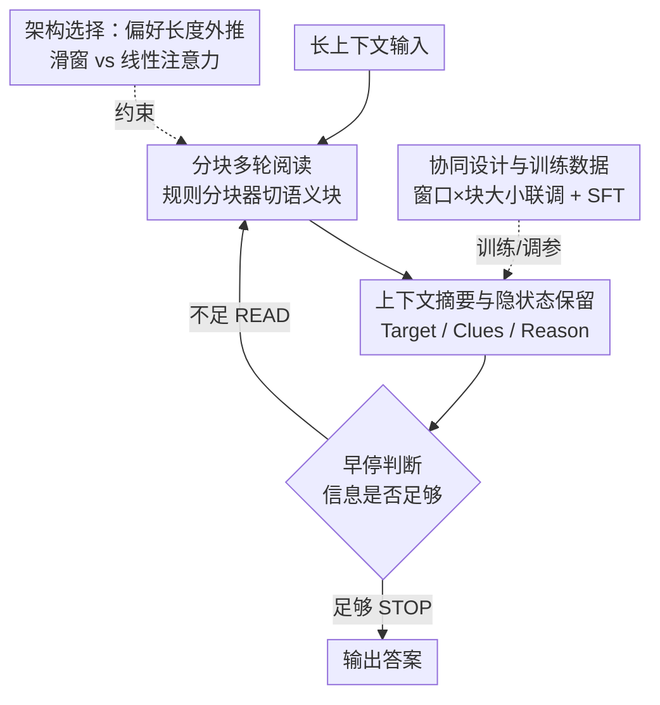

# Smooth Reading: Bridging the Gap of Recurrent LLM to Self-Attention LLM on Long-Context Understanding

**会议**: ICLR 2026  
**OpenReview**: [https://openreview.net/forum?id=GoaWSQWtOE](https://openreview.net/forum?id=GoaWSQWtOE)  
**代码**: 待确认  
**领域**: LLM效率  
**关键词**: 循环LLM, 长上下文, 多轮推理, 架构-推理协同设计, 滑动窗口注意力

## 一句话总结
针对循环 LLM（线性复杂度但固定内存）在长上下文任务上打不过自注意力 LLM 的问题，本文提出 Smooth Reading——把"一口气读完整段上下文"改成"分块多轮、边读边总结、隐状态跨轮累积"的端到端多轮推理（EMR），并配套指出该推理范式更偏爱长度外推强的滑窗架构，最终在 LongBench 上把循环模型从落后自注意力 5.68% 反超 3.61%，同时保持训练 2.5×、推理 2× 的效率优势。

## 研究背景与动机
**领域现状**：自注意力 LLM 凭借对所有历史 token 的全局注意力，在长上下文理解上表现强劲，但其计算量随输入长度 $L$ 呈 $O(L^2)$、显存呈 $O(L)$ 增长，长上下文场景下成本失控。循环 LLM（线性注意力、滑动窗口等）以固定大小的隐状态换来 $O(L)$ 计算和 $O(1)$ 显存，被视为可扩展的替代方案，并已在短上下文对话和长 CoT 推理上追平自注意力。

**现有痛点**：循环 LLM 唯独在"长输入理解"这一类任务上显著落后。本文把 LLM 用例按上下文长度分成三类——短对话、长 CoT 输出、长输入理解——循环模型恰恰在第三类掉队，而这正是阻碍其落地的关键短板。

**核心矛盾**：以往工作几乎都在"改架构、扩内存"上做文章（更强的状态更新规则、更大的状态尺寸），但单靠架构改进始终没能追平自注意力。本文指出根因不在内存大小，而在**架构与推理方式的错配**：传统的一轮推理（One-Round, OR）要求模型在单次前向里把整段上下文全部塞进固定隐状态，这对内存天生受限的循环模型是灾难——内存被瞬间冲垮（memory overwhelm），性能崩塌。

**本文目标**：不再死磕"把内存做大"，而是换个推理范式，让循环模型按自己的节奏"分次消化"长文本，从而把固定内存的劣势规避掉。

**切入角度**：循环模型的隐状态是固定尺寸、可跨步保留与更新的——这恰好天然适配"分块迭代、逐步压缩"的读法。每次只喂一小段、读完压成摘要并更新隐状态，就能把信息收进一个局部工作窗口，避免内存过载；而线性复杂度又保证多轮带来的开销可控。

**核心 idea**：用"分块多轮、边读边总结、隐状态跨轮累积"的端到端多轮推理（EMR）替代"一口气读完"的一轮推理，并把架构选择与推理方式协同设计，让循环 LLM 在长上下文上既快又准。

## 方法详解

### 整体框架
Smooth Reading 是**循环架构 + 推理方法的协同设计**，核心是一套为循环 LLM 量身定做的端到端多轮推理（EMR）。整体在做一件事：把长上下文切成语义连贯的小块，让模型像人类"逐段精读"一样一块一块读——每读完一块就产出一条结构化的上下文摘要、同步更新固定大小的隐状态，并自己判断"信息够不够答题"，够了就停下输出答案。这样每一步只引入少量新信息，避免一次性冲垮固定内存；又因为隐状态被跨轮保留、不断累积，模型不会像"丢隐状态再重喂压缩上下文"那样损失信息。

整个流程是一个带 `<READ>`/`<STOP>` 动作的智能体式循环：输入经分块器切块 → 读取当前块 → 生成上下文摘要并更新隐状态 → 早停判断（继续读则回到读取下一块，信息已足则输出答案）。模型的这套"边读边总结、适时停下"的行为不是靠提示词临时拼凑，而是通过一份 48,856 条的监督微调数据集**训练进模型本身**。

### 关键设计

**1. 分块多轮阅读（EMR）：把"一口气读"换成"逐块精读"**

这是直击"一轮推理冲垮固定内存"痛点的核心。EMR 把长输入切成大小受限、语义连贯的若干块，按顺序逐块处理：每一步模型只发出一个 `<READ>` 动作读入一小块，因此每步只引入少量新信息，既降低溢出风险，又逼模型聚焦当前显著内容。分块用的是一个轻量、规则驱动的层次化分块器：按优先级分隔符列表（依次为 `\n\n\n`、`\n\n`、`\n`、`. `、`.`、`! `、`? `、`, `、`; `、`: `、` – `、空格）逐级切分——先按段落切，相邻单元再合并到不超过最大块尺寸；若某单元超限则用更细粒度的分隔符递归切分后再合并，从而得到既有大小上限、又尽量贴合语义边界的块。为省去真实分词开销，块长用经验近似 $n_{token} \approx \mathrm{Int}(1.5 \times n_{words})$（平均每词约 1.5 个 token）估计。

之所以有效，是因为复杂度被压住了：EMR 下循环模型的计算为 $O(\lambda L)$、显存仍是 $O(1)$（$\lambda>1$ 是多轮带来的有效上下文放大系数），远低于自注意力一轮推理的 $O(L^2)$ 计算与 $O(L)$ 显存。换句话说，多轮带来的额外开销靠循环模型的线性效率消化得起。

**2. 上下文摘要与隐状态保留：用结构化摘要驱动隐状态累积，不丢信息**

光分块还不够——读完一块得把"有用的东西"沉淀下来。每读完一块，模型产出一条**上下文摘要**，既用更少 token 表达关键内容，又借这条摘要更新隐状态，让最近、最相关的信息在循环内存里被优先保留。摘要不是自由文本，而是固定三段式结构：**Target**（任务目标，防止被无关上下文带偏）、**Clues**（与解题相关的显著信息，如 QA 的查询相关事实、摘要任务的累积要点）、**Reason**（本轮更新线索的简短理由）。论文给的例子很直观：第 1 块读到"Leeuwarden 人口 108,249"，先记进 Clues 但判断还答不了，发 `<READ>`；第 2 块读到"Foeke Booy 生于 Leeuwarden"，两条线索一拼即得答案 108,249，发 `<STOP>`。

关键区别在于**隐状态跨轮保留**：自注意力的非端到端多轮（NMR）做法是每步丢弃隐状态、重新喂入压缩后的上下文，这会造成信息损失；而循环 LLM 的固定尺寸隐状态可以在各轮间被保留并增量更新，把近期和长程信息一起累积，且不增加任何额外内存成本。这正是 EMR 优于 NMR 的根本——同样是多轮，循环模型"留着记忆继续读"，自注意力"读一段忘一段"。配套的**早停机制**让模型在每块后自评信息是否充分，够了就发 `<STOP>` 直接出答案，进一步省算力。

**3. 架构选择：EMR 偏爱"长度外推"而非"大单次内存"**

本文一个反直觉的洞察：换了推理方式，最优架构属性也跟着变。一轮推理要求所有信息同时驻留，因此偏爱**有效内存最大**的架构；而 EMR 靠的是"动态压缩 + 逐块读"，单次只需装下一块，重点从"原始内存容量"转移到"超出训练长度后的长度外推（length generalization）能力"。两类典型循环架构里：线性注意力（如 RWKV-7）在一轮推理下能提供更大的有效内存，但外推差——训练长度内强、超出后骤降；滑动窗口注意力（SWA）单次只能记住窗口内（如 4k）的内容，但长度外推稳健，超出训练长度仍能维持性能。因此在 EMR 下，**滑窗架构更适合 Smooth Reading**，尤其在极端长序列上。实验中 SWA-3B-4k-EMR 在 256k 仍保持 99.6%，而 RWKV-3B-EMR 在 64k 后就开始下滑，印证了"不同推理方式呼唤不同架构属性"。

**4. 协同设计与训练数据：窗口×块大小联调 + 把行为训进模型**

效率不是单看架构或推理，而是两者联合决定的。设每 token 的预填充/解码墙钟时间为 $p(s)$、$d(s)$（$s$ 是模型复杂度，与上下文长度无关），块大小为 $c$、块数为 $n$、$L=c\times n$，每轮平均解码 $g$ 个 token，则总推理时间为

$$T_{\text{Recurrent-EMR}} = n \cdot c \cdot p(s) + n \cdot g \cdot d(s) = L\left(p(s) + \frac{g}{c}d(s)\right).$$

由此可见：固定 $s,c,g$ 时 $T$ 随 $L$ **线性**增长；增大块 $c$ 能减少轮数、降低解码步数从而提速，但更大的 $c$ 需要更大的有效内存（窗口）来承接——否则块超过窗口就会精度崩溃。因此最优效率要求**联合调窗口大小与块大小**：窗口控制内存跨度与有效复杂度，块大小控制处理粒度，二者协同才能在精度与速度间取到最优点。

为把"边读边总结、适时停"的行为固化进模型，作者构建了一份覆盖多种长上下文任务（如 QA）的 SFT 数据集：收集含 query/answer/context 的原始数据 → 用规则法（简单任务如检索）或 SOTA LLM（DeepSeek-V3，用于摘要/QA 等复杂任务，采用 NMR 流水线 + one-shot 提示）生成逐步上下文摘要与最终答案，每条摘要后按是否继续阅读追加 `<READ>` 或 `<STOP>` token，并在生成时把最大块尺寸在 128–4096 之间变化以增强鲁棒性 → 对可早停任务（如 QA）允许信息足够即停 → 规则过滤低质输出。最终数据集共 48,856 条。

## 实验关键数据

### 主实验
评测覆盖 LongBench、Needle-in-a-Haystack（NIAH）、RULER、HELMET。对比四种"架构×推理"组合：自注意力+OR、自注意力+NMR、循环+OR、Smooth Reading（循环+EMR）。基座为 Qwen-2.5-3B；循环模型用基于 Qwen-2.5 改造的滑窗模型 SWA-3B-4k 与 RWKV-7-3B。

LongBench 平均分（越高越好）：

| 架构×推理 | 模型 | LongBench Avg |
|--------|------|------|
| 自注意力 + OR | Qwen-2.5-3B-OR | 47.38 |
| 自注意力 + NMR | Qwen-2.5-3B-NMR | 48.37 |
| 循环 + OR | RWKV-7-3B-OR | 41.43 |
| 循环 + OR | SWA-3B-4k-OR | 41.70 |
| 循环 + EMR | RWKV-7-3B-EMR | 48.03 |
| **循环 + EMR（本文）** | **SWA-3B-4k-EMR** | **50.99** |

要点：循环模型在 OR 下落后自注意力约 5.68 个点（41.70 vs 47.38）；换上 EMR 后 SWA-3B-4k-EMR 达 50.99，反超 Qwen-2.5-3B-OR **3.61 个点**，也超过自注意力 NMR（48.37）2.62 个点——同样多轮，保留隐状态的 EMR 明显优于丢隐状态的 NMR。

NIAH 长度外推（训练 32k，测到 256k）：

| 模型 | 8k–32k Avg | 64k | 128k | 256k |
|------|------|------|------|------|
| Qwen-2.5-3B-OR | 98.13 | 98.00 | 26.00 | 0.00 |
| Qwen-2.5-3B-NMR | 89.13 | 93.80 | 95.00 | 67.20 |
| SWA-3B-4k-OR | 29.20 | 6.80 | 1.80 | 1.60 |
| RWKV-3B-EMR | 98.47 | 75.20 | 20.60 | 1.94 |
| **SWA-3B-4k-EMR** | **99.93** | **100.00** | **99.80** | **99.60** |

自注意力 OR 在超出训练长度后崩溃（256k 跌到 0%）；SWA 在 OR 下因窗口受限本就很差（8k 仅 29.20 Avg）；但 SWA-3B-4k-EMR 在 256k 仍保持 99.6%，把"弱外推架构 + 强外推推理"的组合优势体现得淋漓尽致。

### 消融实验
窗口大小 $W$ 与块大小 $C$ 对 NIAH 精度（%）的联合影响：

| 配置 | 精度 | 说明 |
|------|---------|------|
| $W$=512, $C$=512 | 97.0 | 块≤窗口，正常 |
| $W$=512, $C$=4096 | 0.0 | 块远超窗口 → 崩溃 |
| $W$=4096, $C$=2048 | 100.0 | 窗口足够大 |
| $W$=2048, $C$=512 | 100.0 | 小块稳妥 |

效率侧（推理时间，秒）：固定窗口 $W$=4096 时，块 $C$ 从 512 增到 4096 把时间从 646s 降到 366s——大块减少轮数从而提速，但前提是窗口能装下块，否则精度归零。

### 关键发现
- **决定性模块是 EMR + 隐状态保留**：把 OR 换成 EMR，循环模型 LongBench 从 41.70 跳到 50.99；而同为多轮、丢弃隐状态的 NMR（自注意力 48.37）明显不如保留隐状态的 EMR，说明"跨轮累积记忆"是核心增益来源。
- **架构-推理必须匹配**：OR 偏爱 RWKV 的长内存，EMR 偏爱 SWA 的长度外推；选错组合（如 SWA+OR）会非常差。
- **块大小不能超过窗口**：$C>W$ 时精度直接崩（0%），这是协同设计的硬约束；在窗口足够前提下尽量增大块以提速。
- **效率优势随长度放大**：64k 时 SWA-3B-4k-EMR 训练 2.5×、推理 2× 快于 Qwen-2.5-3B-OR，开早停后推理可达 4×，且早停不损精度；相对 SWA-3B-4k-OR 仅多 20% 推理开销就补齐了性能差距。

## 亮点与洞察
- **把"读法"当成一等公民**：以往长上下文研究几乎只在架构上卷，本文证明"推理方式"和架构同等重要，甚至能用一个弱外推架构（SWA）配上对的读法（EMR）打败强基座的一轮推理——这是很有启发性的视角切换。
- **隐状态保留是循环模型独有的红利**：自注意力做多轮要丢隐状态（NMR）或承受 $O((\lambda L)^2)$（EMR），循环模型却能以 $O(1)$ 内存跨轮累积隐状态，把"多轮"这件事做得既便宜又不丢信息——这是循环架构相对自注意力被长期忽视的结构性优势。
- **结构化摘要（Target/Clues/Reason）可迁移**：这种"目标-线索-理由"的逐步压缩模板本质是把 CoT 式检索-推理显式化，可迁移到任意需要"长文档逐步取证"的 agent/RAG 流程，而不限于循环 LLM。
- **协同设计给出可操作准则**：$T=L(p(s)+\frac{g}{c}d(s))$ 这条公式把"调窗口、调块大小"从玄学变成可推导的效率优化，配合"块不能超窗口"的硬约束，给后续循环模型设计提供了清晰的旋钮。

## 局限与展望
- **依赖训练把行为内化**：Smooth Reading 的逐步总结/早停行为需要 48,856 条 SFT 数据训练进模型，并非即插即用的纯推理技巧；数据由 DeepSeek-V3 等生成，摘要质量与覆盖任务类型会影响泛化。
- **规则分块的脆弱性**：层次化分隔符分块对结构化文本（代码、表格、无明显分隔符的连续文本）可能切出不理想的语义边界，论文未深入讨论分块质量对最终精度的影响。
- **架构结论可能任务相关**：'SWA 优于 RWKV' 的结论建立在 NIAH/LongBench 上，对需要大跨度精确记忆而非检索式取证的任务，长度外推未必比大内存更重要。
- **规模与基座有限**：主实验在 3B 量级（附录有 7B），是否在更大模型、更强基座上仍保持反超优势有待验证。
- **改进方向**：可探索可学习/语义感知的分块、把早停阈值做成可控的精度-延迟旋钮、以及在线性注意力上设计专门增强外推的变体以兼得"大内存 + 强外推"。

## 相关工作与启发
- **vs 架构改进路线（更大状态、更强更新规则，如 RWKV-7、各类线性注意力）**：它们试图"把内存做大"来硬扛一轮推理，本文反其道——保持小内存、改读法（EMR），证明错配的根因在推理而非容量，二者正交且可叠加。
- **vs 自注意力的非端到端多轮（NMR，如提示压缩、CoT 提示）**：NMR 每步丢弃隐状态、重喂压缩上下文，得到 $O(\lambda L)$ 计算 + $O(1)$ 内存但损失信息；EMR 保留并更新隐状态，同样复杂度下不丢信息，LongBench 上 EMR 超 NMR 2.62 点。
- **vs OPRM（并行工作）**：OPRM 把 RAG 思路用于缓解线性注意力的内存溢出，同样强调推理设计对循环模型的重要性，但未系统研究"架构-推理协同设计"，泛化与性能受限；本文则把协同设计作为一等问题，给出可操作准则。

## 评分
- 新颖性: ⭐⭐⭐⭐⭐ 把"推理方式"提到与架构同等地位，并给出反直觉的"弱外推架构+对的读法"组合，视角新。
- 实验充分度: ⭐⭐⭐⭐ 覆盖 LongBench/NIAH/RULER/HELMET 多基准 + 窗口×块消融 + 7B 扩展，较扎实；架构对比略集中在 SWA vs RWKV。
- 写作质量: ⭐⭐⭐⭐⭐ 用 Table 1 的复杂度-内存矩阵把动机讲得极清晰，方法-架构-效率三段层层递进。
- 价值: ⭐⭐⭐⭐⭐ 实质性缩小循环 LLM 与自注意力在长上下文上的差距，且保持效率优势，对循环模型落地有直接推动。

<!-- RELATED:START -->

## 相关论文

- [\[ICLR 2026\] DiSRouter: Distributed Self-Routing for LLM Selections](disrouter_distributed_self-routing_for_llm_selections.md)
- [\[ICLR 2026\] Cartridges: Lightweight and General-Purpose Long Context Representations via Self-Study](cartridges_lightweight_and_general-purpose_long_context_representations_via_self.md)
- [\[ICLR 2026\] MemAgent: Reshaping Long-Context LLM with Multi-Conv RL-based Memory Agent](memagent_reshaping_long-context_llm_with_multi-conv_rl-based_memory_agent.md)
- [\[ICLR 2026\] Understanding and Improving Length Generalization in Hierarchical Sparse Attention Models](understanding_and_improving_length_generalization_in_hierarchical_sparse_attenti.md)
- [\[ICLR 2026\] AutoSP: Unlocking Long-Context LLM Training Via Compiler-Based Sequence Parallelism](autosp_unlocking_long-context_llm_training_via_compiler-based_sequence_paralleli.md)

<!-- RELATED:END -->
