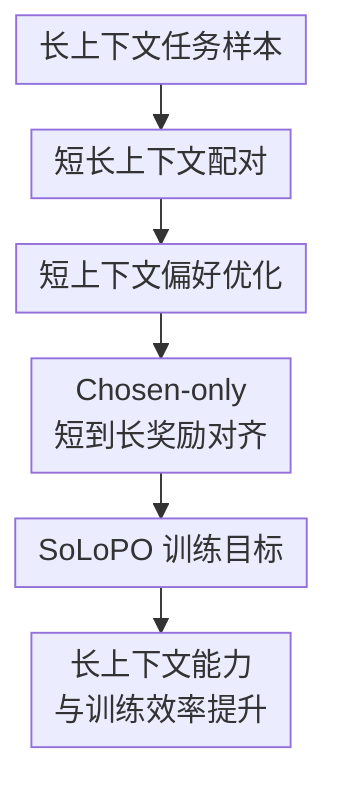

# SoLoPO: Unlocking Long-Context Capabilities in LLMs via Short-to-Long Preference Optimization

**会议**: ICLR2026  
**OpenReview**: [https://openreview.net/forum?id=iiBjaiikJG](https://openreview.net/forum?id=iiBjaiikJG)  
**代码**: https://github.com/shs910/SoLoPO  
**领域**: LLM效率  
**关键词**: 长上下文对齐、偏好优化、短到长迁移、训练效率、奖励对齐  

## 一句话总结
SoLoPO 把长上下文偏好优化拆成“短上下文上的偏好学习”和“短长上下文奖励一致性”，用更短、更干净的数据激活 LLM 的长上下文定位与推理能力，同时显著降低长序列训练的时间和显存压力。

## 研究背景与动机
**领域现状**：很多 LLM 已经把标称上下文窗口扩到 32K、128K 甚至更长，但长窗口并不等于能稳定利用长文档。实际长上下文任务往往要求模型先在大量无关文本里定位任务相关证据，再基于证据回答问题、抽取信息或完成推理。当前主流路线大致有两类：一类通过长上下文 SFT 或偏好优化直接喂长输入，另一类先合成长依赖数据，再用 DPO、SimPO、ORPO 等偏好优化算法对齐模型。

**现有痛点**：直接做长上下文偏好优化代价很高。首先，长文本数据构造不可靠，文本越长，采样出高质量偏好对越难，模型输出也更容易因为无关干扰而出现不稳定错误。其次，训练时每个偏好样本通常要处理 chosen 和 rejected 两条长序列，注意力计算随长度近似平方增长，显存和时间都被长输入吞掉。最后，普通 PO 目标只是在同一个上下文条件下拉开好坏回答，并没有显式告诉模型“长输入里哪些内容等价于短输入里的关键信息”。

**核心矛盾**：长上下文能力不是单一能力。模型既要会定位长文中的任务相关片段，也要会利用这些片段进行回答或推理。传统长 PO 把这两件事揉在一个长输入偏好损失里，既低效，也容易让无关上下文干扰偏好判别；纯短文本训练又缺少把短能力迁移到长输入中的约束。

**本文目标**：作者希望构造一个通用框架，让现有 DPO、SimPO、ORPO 等偏好优化算法能够更高效地服务长上下文对齐。具体来说，它要降低偏好数据采样难度，减少训练中的长文本前向次数，同时保留甚至增强模型在真实长上下文 QA、检索式推理和超长输入泛化上的表现。

**切入角度**：论文从“冗余假设”出发：很多长上下文任务并不需要完整长文，真正决定答案的是任务相关片段 $c_{rel}$，其余 $c_{irr}$ 更多是干扰。若短上下文 $x_{short}=[c_{rel}; I]$ 与长上下文 $x_{long}=[c_{rel}, c_{irr}; I]$ 包含相同任务关键信息，那么理想模型面对同一个好回答 $y$ 时，在两种输入条件下应给出一致的奖励判断。

**核心 idea**：用短上下文构造和优化偏好对，再用短到长奖励对齐（SoLo-RA）把短上下文能力迁移到长上下文场景，从而把“长文中找证据”和“基于证据作答”拆开训练。

## 方法详解
### 整体框架
SoLoPO 的输入不是单独一条长文本，而是一组三元信息：压缩后的短上下文 $x_{short}$、包含同一任务相关信息但混有无关文档的长上下文 $x_{long}$，以及基于短上下文采样得到的偏好回答对 $(y_w, y_l)$。训练时，模型先在 $x_{short}$ 上执行普通偏好优化，学习如何利用干净证据区分好坏回答；再只对 chosen 回答 $y_w$ 做短长奖励一致性约束，让模型在看到 $x_{long}$ 时也愿意给同一个好回答相近的奖励。

这个流程的关键不是简单“短数据替代长数据”，而是显式保留短长对应关系：短上下文承担高质量偏好学习，长上下文只在奖励对齐项中出现，从而把昂贵的长文本计算压到必要部分。

### 关键设计
**1. 短长上下文配对：把长文冗余转成可训练的等价输入**

SoLoPO 首先把长上下文任务写成 $x_{long}=[c_{rel}, c_{irr}; I]$，其中 $I$ 是任务指令，$c_{rel}$ 是回答问题真正需要的证据，$c_{irr}$ 是混入的无关内容。对应的短上下文是 $x_{short}=[c_{rel}; I]$。这一步抓住了许多长上下文 QA 和信息抽取任务的本质：长文很长，但有效信息密度并不高，模型失败往往不是因为不会回答，而是因为没能在干扰中找到正确证据。

作者用压缩率 $\rho$ 描述短长输入的信息比例。对于 QA、信息抽取、多文档推理等任务，通常有 $\rho<100\%$，因此短上下文显著短于长上下文；对于长文翻译这类全文都相关的任务，$\rho=100\%$，SoLoPO 退化为普通 PO，效率优势也会消失。这个设定让方法的适用边界比较清楚：它最适合“长输入中有可定位关键证据”的场景，而不是所有 token 都同等重要的场景。

**2. 短上下文偏好优化：先在低噪声输入上学会用证据作答**

普通长 PO 直接在 $x_{long}$ 上比较 $y_w$ 和 $y_l$，偏好判别会受到无关上下文影响。SoLoPO 改为在 $x_{short}$ 上采样和优化偏好对，因为短上下文保留了任务相关信息，又去掉了大量干扰，模型更容易生成和区分高质量回答。论文的理论分析也基于一个直观假设：在任务相关信息相同的情况下，给定短上下文区分 $y_w \succ y_l$ 不会比给定长上下文更难，即 $p(y_w \succ y_l \mid x_{long}) \le p(y_w \succ y_l \mid x_{short})$。

在统一的 GPO 视角下，普通偏好优化可以写成关于奖励差 $r_\phi(x,y_w)-r_\phi(x,y_l)$ 的凸损失。SoLoPO 证明长上下文偏好损失的上界可以被两部分控制：一部分是在 $x_{short}$ 上的偏好损失，另一部分是同一个回答在 $x_{short}$ 和 $x_{long}$ 下的奖励距离。因此，短上下文 PO 不是只为省算力的启发式替代，而是对应到长 PO 上界中的“证据利用/推理”部分。

**3. Chosen-only 短到长奖励对齐：只把好回答迁移到长上下文**

短上下文 PO 只能保证模型在干净证据上会做选择，还需要一个机制把这种能力接到长输入上。SoLo-RA 做的事情很直接：对于同一个 chosen 回答 $y_w$，让模型在 $x_{short}$ 和 $x_{long}$ 条件下给出的奖励尽量一致，即惩罚 $|r_\phi(x_{short}, y_w)-r_\phi(x_{long}, y_w)|$。如果模型在长输入下也能给好回答高奖励，就意味着它必须从长文里定位出与短上下文等价的任务相关信息。

论文采用 chosen-only 版本，而不是同时对 chosen 和 rejected 做对齐。原因很实际：rejected 回答可能本来就是“不知道”“没有答案”一类没有利用证据的输出，把这种坏回答也强行对齐到长上下文，可能反而提高它在长输入下的概率，伤害长上下文能力。chosen-only SoLo-RA 只让好回答跨短长输入保持一致，既减少了一次 rejected 长文本前向，也避免把坏模式迁移到长场景。

**4. 通用 PO 接口：把 SoLoPO 嵌入 DPO、SimPO 和 ORPO**

SoLoPO 不是一个只为 DPO 写死的目标，而是把“短上下文原始 PO 损失 + 短长奖励距离”作为外壳套到不同偏好优化算法上。对 DPO，奖励可视为 $\beta\log \frac{\pi_\theta(y|x)}{\pi_{ref}(y|x)}$ 的形式；对 SimPO，奖励是按回答长度归一的 $\frac{\beta}{|y|}\log\pi_\theta(y|x)$；对 ORPO，则使用 odds ratio 风格的 $\log\frac{\pi_\theta(y|x)}{1-\pi_\theta(y|x)}$。短上下文 PO 部分沿用原算法，SoLo-RA 部分只替换成相应算法的奖励距离。

这个设计让 SoLoPO 的贡献更像一个“长上下文偏好优化框架”，而不是单一损失函数。只要一个 PO 算法能写出合适的凸函数 $f(\cdot)$ 和对应上界函数 $s(\cdot)$，理论上就可以构造短长奖励对齐项。论文在 DPO、SimPO、ORPO 上都验证了这一点，也解释了为什么 SoLoPO 可以在不同偏好优化范式中稳定带来增益。

### 一个完整示例
假设训练样本来自 MuSiQue 多跳问答：问题问“拥有某份校报的学院成立于哪一年？”。短上下文 $x_{short}$ 只包含两段支持证据，一段说明校报归属于 Houston Baptist University，另一段说明该大学成立于 1960 年；长上下文 $x_{long}$ 则把这两段证据混入若干无关文档，长度从约 1K token 扩到约 8K token。

在数据构造时，模型先基于 $x_{short}$ 采样 32 个 CoT 回答。如果某个回答能沿着“校报所属机构 → 机构成立年份”的链条给出 1960，就被选为 $y_w$；如果另一个回答说“文中没有给出成立日期”或推理链断掉，就被选为 $y_l$。短上下文 PO 让模型在干净证据上偏好 $y_w$ 而不是 $y_l$。

随后 SoLo-RA 把 $y_w$ 同时放到 $x_{short}$ 和 $x_{long}$ 下计算奖励。如果模型在长上下文下因为干扰文档太多而不给 $y_w$ 高奖励，奖励距离就会变大，训练会推动模型在长文中重新定位出那两段关键证据。这样一来，模型学到的不是记住 MuSiQue 的答案，而是“在长上下文里找到与短上下文等价的证据，再执行同样的推理”。

### 损失函数 / 训练策略
SoLoPO 的通用目标可以概括为两项之和：

$$
L_{SoLoPO}=L_{PO}(x_{short}, y_w, y_l)+\alpha\,s(|r_\phi(x_{short},y_w)-r_\phi(x_{long},y_w)|).
$$

第一项是原始偏好优化算法在短上下文上的损失，第二项是 chosen-only SoLo-RA，$\alpha$ 控制奖励对齐强度。论文在 Qwen2.5-7B 上设置 SoLo-DPO 的最优 $\alpha=3$，SoLo-SimPO 和 SoLo-ORPO 的最优 $\alpha=1$；在 Llama3.1-8B 上，SoLo-ORPO 更适合 $\alpha=4$。这些值不是理论常数，而是需要按算法和基座模型调节的超参数。

数据构造方面，作者用 MuSiQue 训练集和 RULER 的方式合成短长上下文：短上下文平均约 1.1K token，长上下文平均约 7.5K token。每个短上下文以温度 0.85 采样 32 个 CoT 输出，再用 sub-EM 指标依据标准答案挑 chosen/rejected，最终合成 5000 条训练样本。训练实现基于 LLaMAFactory、FlashAttention 2、DeepSpeed ZeRO stage 3 和 bf16，主模型包括 Qwen2.5-7B-Instruct 与 Llama3.1-8B-Instruct。

效率来自前向结构的变化。普通 PO 需要处理 $(y_w,x_{long})$ 和 $(y_l,x_{long})$ 两条长序列；SoLoPO 则在短上下文上处理 chosen/rejected，在长上下文上只处理 chosen。若 $x_{long}$ 长度为 $N$、$x_{short}$ 长度为 $\rho N$，忽略参考模型并按注意力计算近似平方增长，可得到普通 PO 的计算量约为 $2N^2$，SoLoPO 约为 $(2\rho^2+1)N^2$。当 $\rho<1/\sqrt{2}$ 时，SoLoPO 就具备计算优势。

## 实验关键数据

### 主实验
论文的主实验覆盖 LongBenchV1 QA、RULER QA、LongBenchV2、Open LLM Leaderboard 和 NIAH-Plus。最核心的结果是：SoLoPO 在多种 PO 算法上都能提升长上下文表现，而且短上下文能力基本不掉。

| 模型/方法 | LongBenchV1 QA Avg. | RULER QA Avg. | 备注 |
|--------|------|------|------|
| Qwen2.5-7B-Instruct | 34.4 | 44.0 | 未做长上下文对齐的基座指令模型 |
| LongPO-Qwen2.5-7B(reimp) | 43.7 | 52.2 | 非解耦短到长 DPO 基线 |
| Long-DPO | 46.9 | 62.2 | 原始 DPO 用长上下文偏好对训练 |
| SoLo-DPO | 47.8 | 62.8 | LongBenchV1 +0.9，RULER +0.6 |
| Long-SimPO | 44.6 | 57.5 | 原始 SimPO 长上下文训练 |
| SoLo-SimPO | 48.4 | 63.9 | LongBenchV1 +3.8，RULER +6.4 |
| Long-ORPO | 45.3 | 55.1 | 原始 ORPO 长上下文训练 |
| SoLo-ORPO | 49.5 | 65.1 | LongBenchV1 +4.2，RULER +10.0 |

在 Qwen2.5-7B 上，SoLoPO 对 ORPO 的增益尤其明显：LongBenchV1 QA 平均从 45.3 提到 49.5，RULER QA 平均从 55.1 提到 65.1。DPO 的增益相对较小，但仍优于 Long-DPO，并且在 LongBenchV2 上 SoLo-DPO 的整体分数达到 35.2，超过 LongPO(pub) 的 33.3。

| 模型/方法 | LongBenchV2 Overall | <32K | 32K-128K | >128K | Open LLM Leaderboard Avg. |
|--------|------|------|------|------|------|
| Qwen2.5-7B-Instruct | 29.3 | 36.9 | 24.6 | 26.1 | 48.56 |
| LongPO(pub) | 33.3 | 40.5 | 30.0 | 27.8 | 47.86 |
| Long-ORPO | 26.6 | 33.8 | 22.3 | 23.3 | 48.58 |
| SoLo-ORPO | 33.2 | 39.7 | 28.8 | 30.9 | 48.77 |
| Long-DPO | 29.7 | 35.9 | 25.6 | 27.6 | 49.01 |
| SoLo-DPO | 35.2 | 39.3 | 31.8 | 35.0 | 48.12 |
| Long-SimPO | 25.4 | 33.0 | 20.2 | 23.3 | 48.64 |
| SoLo-SimPO | 31.0 | 37.5 | 25.7 | 30.6 | 48.97 |

LongBenchV2 的结果说明 SoLoPO 不只是在训练长度附近有效。Qwen2.5-7B 配合 YaRN 评估时，SoLo-DPO 在超过 128K 的样本上达到 35.0，而 Long-DPO 为 27.6；SoLo-ORPO 在超过 128K 的样本上也从 Long-ORPO 的 23.3 提到 30.9。Open LLM Leaderboard 平均分基本维持在基座附近，说明长上下文对齐没有明显牺牲短任务能力。

### 消融实验
论文围绕 SoLo-RA 的形式、解耦是否必要、奖励对齐系数和训练效率做了多组分析。最关键的消融是 NIAH-Plus，因为它直接考察模型在长上下文中定位证据的能力。

| 配置 | NIAH-Plus S-Doc QA | NIAH-Plus M-Doc QA | Avg. | 说明 |
|------|---------|---------|------|------|
| Qwen2.5-7B-Instruct | 35.66 | 52.63 | 44.14 | 基座模型 |
| DPO expand-long | 55.98 | 68.02 | 62.00 | 非解耦，把短偏好对扩到长上下文 |
| SoLo-DPO | 59.35 | 71.76 | 65.56 | 比 expand-long 平均 +3.56 |
| SimPO expand-long | 51.81 | 53.61 | 52.71 | 非解耦 SimPO |
| SoLo-SimPO | 60.85 | 72.05 | 66.45 | 比 expand-long 平均 +13.74 |
| ORPO expand-long | 59.60 | 69.92 | 64.76 | 非解耦 ORPO |
| SoLo-ORPO | 61.64 | 71.46 | 66.55 | 比 expand-long 平均 +1.79 |

这组结果支持论文的核心解释：单纯把短偏好对塞进长上下文训练不如显式奖励对齐。SoLo-RA 让模型在长输入下也给好回答相近奖励，更直接地训练了“从长文中定位短证据”的能力。

| 训练长度/方法 | Vanilla ORPO Runtime | SoLo-ORPO Runtime | 效率变化 | 备注 |
|------|------|------|------|------|
| 4K long context | 72.52 min | 66.63 min | 约 -8% | 长度较短时优势有限 |
| 8K long context | 145.11 min | 83.62 min | 约 -42% | 短上下文固定 1K |
| 12K long context | 235.98 min | 144.21 min | 约 -39% | Vanilla 需要更重的 2-stage forward |
| 16K long context | OOM | 179.20 min | SoLo 可训练 | Vanilla 在该设置下不可行 |
| 19K long context | OOM | 205.98 min | SoLo 可训练 | 显存上限明显提高 |

效率实验说明 SoLoPO 的收益随长上下文长度增加而更明显。在相同配置下，论文还报告 SoLoPO 让最大可训练长度从 9K 提升到 19K，约 2.1 倍；DPO 和 ORPO 在 9K 长度上的运行时间分别减少 52% 和 26%。

### 关键发现
- SoLoPO 的提升并不依赖某一个偏好优化算法：DPO、SimPO、ORPO 都能受益，只是幅度不同，其中 ORPO 在 Qwen2.5-7B 上的 RULER 增益最大。
- chosen-only SoLo-RA 优于同时对 chosen/rejected 做对齐，因为 rejected 回答常常没有利用证据，把它也迁移到长上下文会带来反向信号。
- 解耦训练比 expand-long 非解耦训练更强，尤其在 NIAH-Plus 多文档检索场景中，说明 SoLo-RA 的确更像是在训练上下文知识定位，而不只是增加长文本曝光。
- 当短上下文固定为 1K、长上下文从 4K 增至 16K 时，SoLoPO 的训练效率优势快速扩大；但在压缩率接近 100% 的任务上，这种优势会自然缩小。

## 亮点与洞察
- SoLoPO 最巧妙的地方是把长上下文对齐拆成两个可解释能力：短上下文 PO 对应“利用证据作答”，SoLo-RA 对应“在长文中定位等价证据”。这个拆法比“直接多喂长文本”更精准，也更符合长 QA 的真实困难。
- 理论上界不是装饰性推导。它把长上下文 PO 损失关联到短上下文 PO 和短长奖励距离，因此方法设计、公式和实验消融之间能互相对上。
- chosen-only 是一个很实用的训练细节。很多 rejected 回答本质上是无效或逃避式输出，强行对齐 rejected 会把坏答案也迁移到长上下文；只对齐 chosen 同时提升效果和效率。
- 数据构造策略简单但有代表性。通过 MuSiQue 支持文档加随机干扰文档，作者能控制短长上下文共享同一答案证据，使 SoLo-RA 的“等价输入”假设在实验里比较干净。
- 这套思路可以迁移到其他有“短证据—长环境”结构的任务，例如长文事实一致性、检索增强回答、长文信息抽取和多文档 agent 记忆压缩。关键是要能构造出与长输入任务等价的短输入，而不是盲目截断。

## 局限与展望
- 方法依赖任务相关信息可被压缩这一前提。对于长文翻译、全文风格改写、逐段摘要等高压缩率或全文相关任务，$x_{short}$ 与 $x_{long}$ 差异很小，SoLoPO 的效率优势和理论直觉都会减弱。
- 当前训练数据主要来自 MuSiQue 合成的 QA 场景，长上下文平均约 7.5K token，虽然评估扩展到 LongBenchV2 和 NIAH-Plus，但真实业务长文、跨领域多文档和更复杂任务上的鲁棒性仍需进一步验证。
- $\alpha$ 需要手动调参，而且不同 PO 算法、不同模型规模的最优值不一致。若将 SoLoPO 用到更大模型或更多任务，自动选择奖励对齐强度会很重要。
- SoLoPO 仍然需要处理 chosen 的长上下文前向，不能完全摆脱长序列训练成本。对于百万 token 级上下文，可能还要结合 KV 压缩、稀疏注意力、数据剪枝或序列并行。
- 论文没有直接解决长输出生成问题。作者在展望中提到长 CoT、长故事生成和文本润色也可能存在“长输出与短输出任务等价”的结构，但这需要新的理论和实验设计。

## 相关工作与启发
- **vs LongPO**: LongPO 也利用短到长思想，但主要围绕 DPO，并通过把 $\pi_{ref}(y|x_{long})$ 替换成 $\pi_{ref}(y|x_{short})$ 来做约束。SoLoPO 更通用，把长 PO 分解成短 PO 与奖励对齐，可套到 DPO、SimPO、ORPO，并且在 LongBenchV2 上能超过 LongPO 的公开 checkpoint。
- **vs LOGO**: LOGO 针对长上下文偏好优化引入更多负样本和改造 SimPO 目标，重点是长文本偏好建模本身。SoLoPO 的区别在于显式利用短长等价输入，减少长文本处理，并把能力拆成定位与推理两个部分。
- **vs LongCE / LongPPL**: LongCE 通过识别长文本关键 token 并提高 loss 权重来增强长上下文 SFT，但需要额外前向来找关键 token。SoLoPO 不做 token 级显著性检测，而是用短上下文作为任务相关信息的显式代理，训练目标更偏偏好对齐。
- **vs 长上下文数据增强**: LongAlign、LongReward、LongFaith 等方法强调合成更长、更真实的 instruction-following 数据。SoLoPO 可以看作互补方向：它不只问“如何造长数据”，还问“长数据和短证据之间应该怎样被目标函数连接”。
- **启发**: 对很多长上下文任务来说，训练目标应该显式建模“等价信息在不同上下文长度下的一致性”。这比单纯扩大窗口或堆长样本更可控，也可能成为长上下文 RAG、记忆压缩和上下文忠实性对齐的通用设计模式。

## 评分
- 新颖性: ⭐⭐⭐⭐⭐ 从长上下文 PO 上界推出短 PO + 短长奖励对齐，概念清楚且能泛化到多种 PO 算法。
- 实验充分度: ⭐⭐⭐⭐ 覆盖多基座、多 PO 算法、多长上下文 benchmark 和效率实验，但训练数据仍集中在 MuSiQue QA 合成场景。
- 写作质量: ⭐⭐⭐⭐ 理论、方法和实验链条完整，附录细节充分；不过公式推导较密，对只关心工程复现的读者略有门槛。
- 价值: ⭐⭐⭐⭐⭐ 对长上下文对齐很有实用价值，尤其适合想在有限显存下提升长文 QA/检索推理能力的团队。

<!-- RELATED:START -->

## 相关论文

- [\[ICML 2025\] Long-Short Alignment for Effective Long-Context Modeling in LLMs](../../ICML2025/llm_efficiency/long-short_alignment_for_effective_long-context_modeling_in_llms.md)
- [\[ICLR 2026\] AutoSP: Unlocking Long-Context LLM Training Via Compiler-Based Sequence Parallelism](autosp_unlocking_long-context_llm_training_via_compiler-based_sequence_paralleli.md)
- [\[ACL 2026\] BOSCH: Black-Box Binary Optimization for Short-Context Attention-Head Selection in LLMs](../../ACL2026/llm_efficiency/bosch_black-box_binary_optimization_for_short-context_attention-head_selection_i.md)
- [\[ICLR 2026\] Beyond Real: Imaginary Extension of Rotary Position Embeddings for Long-Context LLMs](beyond_real_imaginary_extension_of_rotary_position_embeddings_for_long-context_l.md)
- [\[ICLR 2026\] Short Window Attention Enables Long-Term Memorization](short_window_attention_enables_long-term_memorization.md)

<!-- RELATED:END -->
