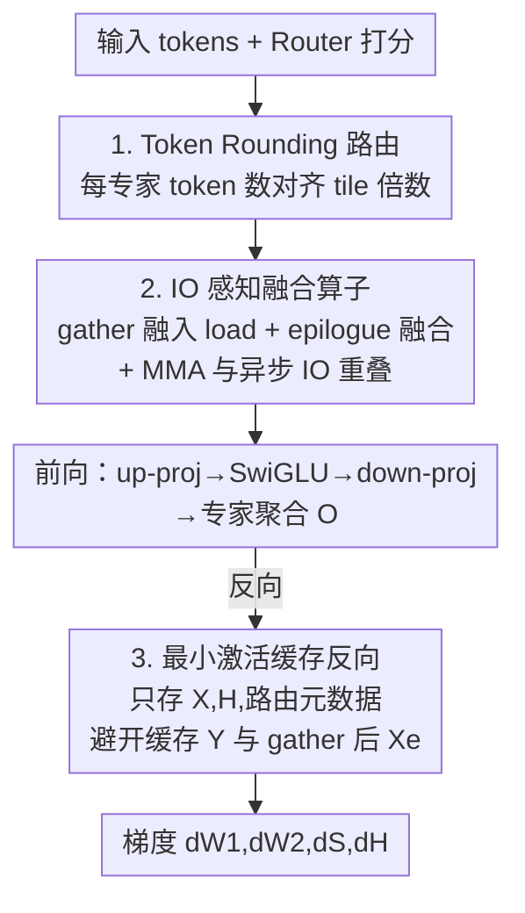

# SonicMoE: Accelerating MoE with IO and Tile-aware Optimizations

**会议**: ICLR 2026  
**OpenReview**: [https://openreview.net/forum?id=KzTJ1raEgB](https://openreview.net/forum?id=KzTJ1raEgB)  
**代码**: https://github.com/Dao-AILab/sonic-moe  
**领域**: LLM效率  
**关键词**: MoE 训练加速、GPU 算子、激活内存、Grouped GEMM、tile 量化

## 一句话总结
针对"细粒度 + 高稀疏"MoE 在硬件上变得越来越内存受限的问题，SonicMoE 用「重写反向计算图把激活缓存压到最小 + IO 与计算重叠的融合算子 + 把每专家 token 数对齐 tile 的 token rounding 路由」三招，在 Hopper 上把 7B 细粒度 MoE 的算子吞吐相对 ScatterMoE 提升 1.86×、激活内存降 45%，高稀疏下还额外拿到 1.16× 加速。

## 研究背景与动机

**领域现状**：MoE 已经是把语言模型规模做大而不显著增加 FLOPs 的事实标准架构。近期的趋势是两个方向同时走极端——更高的**专家粒度**（granularity，专家中间维 $n$ 越来越小、单专家越来越"瘦"）和更高的**稀疏度**（sparsity，激活专家数 $K$ 不变但总专家数 $E$ 越来越多）。DeepSeek V3、Qwen3-MoE、gpt-oss-120b、Kimi K2 都印证了细粒度 + 高稀疏在等 FLOPs 下能换更好的模型质量。

**现有痛点**：MoE 的 scaling law 说"每 FLOP 质量"会随粒度和稀疏度提升，但**降 FLOPs 不等于硬件利用率高**。细粒度让每个专家需要从不同位置 gather token、再 scatter 回原位，动态 IO 访问暴增；具体表现为三个硬件不友好：(1) 激活内存随激活专家数线性增长，细粒度模型反向需要缓存的激活越来越大；(2) 算术强度（FLOPs/IO 字节）随粒度升、稀疏增而下降，算子从计算受限滑向**内存带宽受限**；(3) 高稀疏下每专家拿到的 token 数变小，Grouped GEMM 的 **tile 量化效应**（不整除 tile 就 padding）浪费的算力变得不可忽视。现有 SOTA 算子如 ScatterMoE、MoMoE 并不是为这些高 IO 成本设计的，吞吐会明显退化。

**核心矛盾**：算术强度的解析式（忽略 $H$ 的写回）是

$$\text{Arithmetic Intensity} = \frac{3}{2 + \tfrac{2G}{d} + \tfrac{3}{T\rho}}$$

其中 $G = d/n$ 是粒度、$\rho = K/E$ 是激活比。对固定模型尺寸（固定 $d$），**增大粒度 $G$ 或减小激活比 $\rho$ 都会让算术强度下降**——这正是细粒度和高稀疏带来内存受限的数学根源。要重新拿回吞吐，就必须同时把"反向要缓存的激活"、"算子里的 IO 访问/延迟"和"padding 浪费的 FLOPs"三件事都按住。

**本文目标**：在保持与原始 MoE 数学等价、不增加 FLOPs 的前提下，分别解决 (a) 激活内存随粒度线性膨胀、(b) 内存带宽受限导致算子吞吐低、(c) 稀疏下 tile 量化浪费算力三个子问题。

**核心 idea**：硬件与模型架构协同设计——反向**重写计算图**避开缓存 $O(TKd)$ 大小的激活；算子层面用 gather/epilogue 融合 + MMA 与异步 IO 重叠把内存延迟藏进计算；路由层面用 **token rounding** 把每专家 token 数对齐到 Grouped GEMM 的 tile 倍数，从源头消除 padding。

## 方法详解

### 整体框架
SonicMoE 把一整个 MoE 层的前向 + 反向拆成 8 个算子（前向：up-proj、down-proj、专家聚合；反向：down-proj 激活梯度 $dH$、up-proj 激活梯度 $d\tilde X$、聚合 $dX$、权重梯度 $dW_1$/$dW_2$），并沿"路由 → 前向算子 → 反向算子"这条训练管线，在三个不同环节各插入一项优化，三项彼此正交、可叠加。

读者可以这样理解整条流：token 先经 **Token Rounding 路由**决定去哪些专家、且每专家的 token 数被对齐成 tile 倍数；随后进入**前向 Grouped GEMM 算子**，这里把 gather 融进 HBM load、把 SwiGLU 等逐元素操作融进 epilogue，并让 MMA 与异步 IO 重叠以藏住带宽延迟；反向则走一条**重写过的计算图**，只缓存最小集合（$X$、$H$、路由元数据），避开缓存 $Y$ 和 gather 后的 $X_e$ 这类随粒度线性膨胀的大激活。三段对应下面三个关键设计，序号与下图自上而下一致。

### 关键设计

**1. Token Rounding 路由：把每专家 token 数对齐 tile，从源头掐掉 padding 浪费**

针对的是"高稀疏下 tile 量化浪费 FLOPs"这个痛点。Grouped GEMM 按 tile（如 $M_{tile}=128$）切分计算，只要每专家收到的 token 数 $f_e$ 不是 tile 的整数倍，就要 padding 到下一个 tile，稀疏到每专家平均只剩几百 token 时，这部分浪费能占到两位数百分比。Token Rounding（TR）是一个 drop-in 的两步排序路由：先算出 vanilla top-K token-choice（TC）结果，再对每个专家把它收到的 token 按 router 分数排序（类似 expert-choice 的排序）；中间对权重矩阵做处理，让 TC 选中的 token 永远优先于 EC 候选，保证任何丢弃/补充只发生在每专家的**最后一个 tile**。`round_and_sparsify` 子程序按就近取整决定是丢还是补——当 $\lceil f_e\rceil_{M_{tile}} - f_e < f_e - \lfloor f_e\rfloor_{M_{tile}}$ 时补 EC token，否则丢到下一个 tile。

它的关键性质是：**每专家相对 TC 路由的最大偏差被严格控制在一个 tile 以内**，且期望 token 总数不变。这意味着既彻底消除了 Grouped GEMM 的 padding 浪费，又只对原始 token-to-expert 分配做了极小扰动；实验里当平均每专家 token 数 $\bar T_e/M_{tile}\ge 2$ 时它非常稳定，能作为 TC 的有效替代而几乎不掉下游精度。和 Rectify-Router 这类丢/重路由方法的区别在于：TR 是明确围绕 Grouped GEMM 的 **tile 结构**做对齐，而不是泛泛地丢 token；和只优化 padding 访存流量的 TMA-adaptive FP8 Grouped GEMM 相比，TR 真正省掉的是 padding **计算**出来的 FLOPs。

**2. IO 感知的融合算子：用 gather/epilogue 融合 + MMA-IO 重叠把内存带宽延迟藏进计算**

针对的是"细粒度让算子内存带宽受限、IO 成本随粒度线性增长"的痛点。细粒度 MoE 的表达力来自每个 token 专家选择的多样性，代价就是 IO 访问随粒度线性放大，要重新拿回吞吐只能两条腿走：减少 IO 访问、把 IO 延迟和计算重叠。SonicMoE 在高效的 varlen-M / varlen-K Grouped GEMM 上做了两类融合：**gather 融合**把"从 HBM/GMEM 加载到 SMEM"和 token gather 合到一起，省掉很多 baseline 必须单独跑的 gather 阶段（这在细粒度训练里是巨大的 IO 开销）；**epilogue 融合**把 SwiGLU/dSwiGLU 等逐元素操作融进前向 up-proj、反向 down-proj 激活梯度算子的 epilogue，并在反向 $dH$ 算子的 epilogue 里一并算出 $dH$ 与 $dS=\langle dA, A'\rangle$，省掉 ScatterMoE 那种把 down-proj、$dS$、dSwiGLU 拆成多个 kernel 的额外读写。

更关键的是 **MMA 与异步 IO 重叠**。在 Hopper 上 GEMM 走 producer-consumer 异步范式，SonicMoE 用 **Ping-Pong 调度**让一个 warpgroup 做 IO、另一个用较小 tile 做 GEMM，做完互换角色，从而在 epilogue 很重（如 $dH$ kernel 要 load $H$ 并做多次激活/归约）时仍维持高 Tensor Core 吞吐；同时用异步 TMA 在 $dH$ epilogue 里专门开一条流水线异步 load $H$。在 Blackwell 上则利用 TMEM（每 SM 的片上累加器内存）做两段式累加流水：一段做 UMMA 累加、另一段并发跑 epilogue。正因为把 IO 藏进了计算，SonicMoE 才能在 7B 细粒度模型上相对 ScatterMoE 的 BF16 算子拿到 1.86× 吞吐，前向相对高度优化的 DeepGEMM 提升 43%。

**3. 最小激活缓存的反向算法：重写计算图，让激活内存不再随粒度膨胀**

针对的是"激活内存随粒度线性增长"的痛点。MoE 前向 + 反向的总 FLOPs 是 $(6+12)TnKd$，固定 $T,d$ 时要保持 FLOPs 不变就得让 $nK$ 恒定——即增大粒度（减小 $n$）必须按比例增大 $K$，于是任何 $O(TKd)$ 大小的激活一旦被缓存，激活内存就会随粒度线性涨。ScatterMoE 等现有算子正是栽在这里。SonicMoE 的做法是在**保持与原始 MoE 数学等价**的前提下重写反向计算图：down-proj 输出 $Y$ 和 gather 后的 $X_e$ 这两个 $TKd$ 量级的大激活都**不缓存**——对 $X$ 和 $dO$，把 gather 操作和 HBM load 融合，从而不必在 HBM 里物化它们；对 $Y$，论文找到一条不经过 $Y$、$dY$ 就能算出 $dS$ 和 $dH$ 的替代路径（附录 D），且不增加 FLOPs。

结果是每层只需缓存 $X$、$H$ 和路由元数据，总量约 $2Td + 4TKn$ 字节。作者论证这是"不做 GEMM 重计算的前提下反向所需的最小激活内存"，并且**与专家粒度无关**——这正是图 1 里 SonicMoE 激活内存随粒度增大保持恒定、而 ScatterMoE/MoMoE 一路上涨的原因，7B 细粒度配置下激活内存降 45%，到 120B 时相对 MoMoE 每层省 3 GiB 以上。

### 损失函数 / 训练策略
SonicMoE 不改训练目标，是纯系统/算子层的加速，对模型数学等价。主要代码用 CuTe-DSL 写、配 PyTorch 接口；token rounding 是 drop-in 路由替换，默认按就近取整规则，实验显示对取整子程序的具体选择鲁棒。

## 实验关键数据

### 主实验

激活内存与吞吐（H100，7B 细粒度 MoE，$n=256$）：

| 维度 | 对比基线 | SonicMoE 表现 |
|------|----------|---------------|
| 激活内存/层 | ScatterMoE | 降 45%（相对 MoMoE 更多；120B 时每层省 >3 GiB） |
| 算子计算吞吐 | ScatterMoE BF16 算子 | 1.86× 提升 |
| 前向相对加速 | DeepGEMM（高度优化） | +43% |
| 反向相对加速 | ScatterMoE / MoMoE | +83% / +115% |
| 前向吞吐占上界 | cuBLAS BMM 上界 | 平均 88%（max 91%，min 86%） |

跨硬件与端到端：B300 上相对 DeepGEMM++ 前向/反向加速 28.7% / 22.1%（OLMoE-sized 7B），且粒度从 2 增到 8 时加速从 20.9%/22.1% 扩大到 35.2%/30.9%；端到端用 lm-engine + FSDP-2，**SonicMoE 在 64 张 H100 上达 213 B tokens/天，逼近 ScatterMoE 在 96 张 H100 上的 225 B tokens/天**——少用三分之一卡拿到相近吞吐。

### 消融 / 分析实验

Token rounding 的质量与效率（多组 0.5B–1.8B、40B–100B token 训练）：

| 配置 | 行为 | 关键结果 |
|------|------|----------|
| TC top-K | vanilla 路由 | 基线困惑度 / 下游精度 |
| **TR（token rounding）** | 对齐 tile 倍数 | 困惑度与下游 11 任务平均精度与 TC **持平或更优**（如 1.8B：TR train ppl 13.34 vs TC 13.51，Avg 53.5 vs 52.8） |
| EC / EC(aux router) | expert-choice 系 | 验证困惑度明显更差（如 1.8B：EC val 19.82 vs TR 13.10） |
| 高稀疏吞吐 | $E$ 增大、$K$ 固定 | TR 比 TC 最多 +16% TFLOPS（1.16× 算子加速） |

### 关键发现
- **三项优化各管一痛点、可叠加**：内存算法专治激活内存随粒度膨胀、IO 算子专治带宽受限、token rounding 专治稀疏 padding 浪费；三者正交，所以总加速是叠出来的而非互斥。
- **细粒度越极端，SonicMoE 优势越大**：B300 上粒度 $d/n$ 从 2 升到 8，相对 DeepGEMM++ 的加速反而从 ~21% 扩大到 ~31–35%，正好对应算术强度公式里粒度升带来的内存受限加剧。
- **token rounding 不掉点反提质**：把每专家 token 数对齐 tile 只引入"最多一个 tile"的扰动，多组实验里下游平均精度与 TC 持平甚至略高，说明 tile 对齐换来的吞吐是"白赚"的。
- **token rounding 的稳定区间**：当 $\bar T_e/M_{tile}\ge 2$（平均每专家 token 数至少两个 tile）时 TR 稳定；过于极端稀疏时这一前提需要注意。

## 亮点与洞察
- **用算术强度公式把"为什么变慢"讲成数学**：$3/(2+2G/d+3/(T\rho))$ 一式点明粒度升、稀疏增都压低算术强度，把三项工程优化锚在同一个理论根因上，动机非常硬。
- **反向计算图重写是"零成本"省内存**：不靠激活重计算（不加 FLOPs）、保持数学等价，单纯换一条算 $dS$/$dH$ 的路径就让激活内存与粒度脱钩——这种"换等价路径省内存"的思路可迁移到其它带 gather/scatter 的稀疏算子。
- **token rounding 把硬件 tile 结构反向塞进算法**：路由本是模型侧决策，作者却让它感知 GPU 的 tile 量化，且用"偏差 ≤ 1 tile"的约束保证安全——算法与硬件协同设计的漂亮范例。
- **"少卡拿相近吞吐"的端到端说服力**：64 卡 ≈ 96 卡的吞吐，直接翻译成训练成本，比单算子 TFLOPS 数字更打动实际训练者。

## 局限与展望
- **强绑定特定 GPU 架构**：Ping-Pong 调度、TMA、TMEM 两段式累加分别吃 Hopper / Blackwell 的硬件特性，迁到其它架构（如 AMD）需要重写，普适性受限。
- **token rounding 在极端稀疏下的边界**：$\bar T_e/M_{tile} < 2$ 时稳定性论文未充分展开，超大 $E$、超小每专家 token 的场景仍需谨慎。
- **数学等价路径的可读性成本**：避开缓存 $Y$ 的替代反向路径（附录 D）增加了实现复杂度，复现门槛高于"直接缓存"的朴素实现。
- **评测以系统指标为主**：模型质量验证集中在中小规模（≤1.8B、≤100B token），更大规模下 token rounding 对最终模型质量的长期影响仍待观察。

## 相关工作与启发
- **vs ScatterMoE**: 同为 MoE 训练算子，ScatterMoE 缓存随粒度线性增长的激活、且 gather 与 GEMM 分离；SonicMoE 重写反向图把激活压到最小、把 gather 融进 load，所以激活内存降 45%、吞吐 1.86×。
- **vs MoMoE / DeepGEMM**: 都没专门处理高 IO 成本与 tile 量化，SonicMoE 用 MMA-IO 重叠 + token rounding 在细粒度/高稀疏区间拉开差距（反向相对 MoMoE +115%）。
- **vs Rectify-Router（丢/重路由）**: 二者都动 token 分配，但 Rectify-Router 不针对 Grouped GEMM 的 tile 结构；TR 专门对齐 tile 并保证偏差 ≤ 1 tile，省的是 padding 计算的 FLOPs。
- **vs TMA-adaptive FP8 Grouped GEMM**: 它优化 padding 相关的访存流量，但没解决非对齐 tile 在 GEMM 计算上浪费的 FLOPs；TR 正是补上这块。

## 评分
- 新颖性: ⭐⭐⭐⭐⭐ 反向计算图重写 + token rounding 的 tile 感知路由都是新角度，且锚在算术强度理论上。
- 实验充分度: ⭐⭐⭐⭐⭐ 1.4B–120B 多尺度、H100/B300 双硬件、算子吞吐 + 激活内存 + 端到端 + 下游精度全覆盖。
- 写作质量: ⭐⭐⭐⭐ 系统细节扎实，但反向等价路径等关键推导放在附录，正文略需对照才能完全跟上。
- 价值: ⭐⭐⭐⭐⭐ 直击当下细粒度/高稀疏 MoE 训练的真实瓶颈，开源算子可直接降训练成本。

<!-- RELATED:START -->

## 相关论文

- [\[ICML 2026\] STAR: Rethinking MoE Routing as Structure-Aware Subspace Learning](../../ICML2026/llm_efficiency/star_rethinking_moe_routing_as_structure-aware_subspace_learning.md)
- [\[ACL 2025\] Accelerating Speculative Decoding via Efficient Context-Aware Draft Generation](../../ACL2025/llm_efficiency/accelerating_speculative_decoding_via_efficient_context-aware_draft_generation.md)
- [\[NeurIPS 2025\] MoESD: Unveil Speculative Decoding's Potential for Accelerating Sparse MoE](../../NeurIPS2025/llm_efficiency/moesd_unveil_speculative_decodings_potential_for_accelerating_sparse_moe.md)
- [\[ICLR 2026\] OPPO: Accelerating PPO-based RLHF via Pipeline Overlap](oppo_accelerating_ppo-based_rlhf_via_pipeline_overlap.md)
- [\[ACL 2026\] Alloc-MoE: Budget-Aware Expert Activation Allocation for Efficient Mixture-of-Experts Inference](../../ACL2026/llm_efficiency/alloc-moe_budget-aware_expert_activation_allocation_for_efficient_mixture-of-exp.md)

<!-- RELATED:END -->
