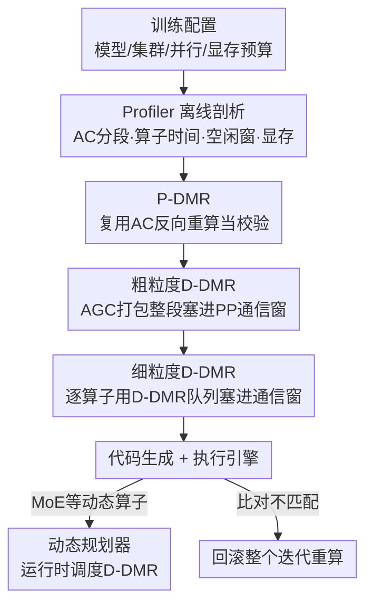

# SpareTrain: Fault-Tolerant LLM Training via Low-Cost Dual Modular Redundancy

**会议**: ICLR 2026  
**OpenReview**: [https://openreview.net/forum?id=kDeS8jpeiZ](https://openreview.net/forum?id=kDeS8jpeiZ)  
**代码**: 无  
**领域**: LLM效率 / 容错训练系统  
**关键词**: 静默数据损坏, 双模冗余, 激活检查点, GPU空闲利用, 分布式训练

## 一句话总结
SpareTrain 把"检测静默数据损坏最彻底但最贵"的双模冗余（DMR）做进 LLM 训练系统：它一方面复用激活检查点反向重算天然产生的冗余、一方面把校验计算塞进 GPU 因通信而空闲的时间窗里，在不削弱检测能力的前提下，把 DMR 的训练吞吐损失从近 100% 压到相对无保护训练只有 3–14% 的开销。

## 研究背景与动机

**领域现状**：LLM 训练动辄上千张 GPU、跑几个月，硬件可靠性成了大问题。其中最棘手的是**静默数据损坏（Silent Data Corruption, SDC）**——这类错误绕过 ECC/CRC 等硬件机制不报错，悄悄把某个数值算错并随训练传播。研究表明即便单次梯度噪声看起来微不足道，长期累积也会让参数发散、收敛到次优模型，小幅错误同样可能不可逆地损害模型质量。

**现有痛点**：检测 SDC 的软件方法是一条"覆盖度 vs 开销"的光谱。**双模冗余（DMR）**把每个算子算两遍再比对结果，在"两次执行同时出同样错的概率可忽略"假设下能做到**完全检测**，且对线性/非线性算子通用——这是唯一能给任意训练负载提供强保证的方法。但它的代价是计算量翻倍（约 100% 开销），所以业界虽然提过类 DMR 手段，却从没真正做到全覆盖部署。其他更轻的方法（ABFT 校验和、梯度离群点检测、训练小网络当检测器、只盯某些层）要么在 FP16/BF16/FP8 低精度下因数值精度不够产生漏报，要么只有选择性覆盖、概率性保证，达不到生产环境的可靠性要求。

**核心矛盾**：DMR 的检测能力和它的计算开销直接挂钩——想要完全检测就得把每个算子重算一遍，这看起来是不可避免的 2× 成本。

**本文目标**：在**不牺牲 SDC 检测能力**的前提下，把 DMR 带来的训练吞吐损失降到最低。

**切入角度**：作者观察到大规模 LLM 训练有两个"免费午餐"可以喂给 DMR 的校验执行——（1）为省显存而广泛使用的**激活检查点（Activation Checkpointing, AC）**本身就会在反向时重算一遍前向算子，这部分重算天然就是一次"第二遍执行"；（2）分布式训练里 GPU 因通信和流水线气泡而**大量空闲**（两个代表模型实测空闲占比 68% 和 77%），校验执行可以塞进这些空窗里被"隐藏"掉。

**核心 idea**：用 **Piggyback-DMR（搭便车，复用 AC 重算）** 和 **Deferred-DMR（延迟执行，藏进通信空窗）** 两条互补策略替代朴素 DMR 的"立即重算"，再用一个三阶段规划器把每个算子最优地分配到这两条策略上。

## 方法详解

### 整体框架

SpareTrain 是一个端到端的容错训练系统，目标是"完整 DMR + 最小开销"。它的核心是一份 **DMR plan**：把训练里每个算子分到四个集合之一——`P-DMR`（搭 AC 重算的便车）、`D-DMR_inter`（延迟到跨节点通信窗校验）、`D-DMR_intra`（延迟到节点内通信窗校验）、`Naïve-DMR`（实在塞不下就老老实实立即重算一遍）；对延迟类还要决定具体塞进哪个空闲窗口。

系统分**离线**和**在线**两段。离线阶段，Profiler 先跑几个迭代采集 AC 分段方式、每个算子的执行时间与显存占用、GPU 空闲窗口的时刻与时长、各设备显存使用模式；静态规划器据此生成 DMR plan 并改写训练代码。在线阶段，执行引擎跑改写后的代码，一旦任何设备在 DMR 比对中发现不匹配，就**回滚整个迭代重算**；对于无法离线确定的算子（如 MoE 层），交给**动态规划器**在运行时按计算/通信情况临机决定。

DMR 规划本身是三阶段流水：Phase 1 先把 AC 重算的算子分给 P-DMR；Phase 2 做粗粒度 D-DMR，把一段连续算子打包成一个段塞进跨节点通信窗；Phase 3 做细粒度 D-DMR，逐算子地塞进剩余的节点内/节点间通信窗；没被分走的算子自然回落到 Naïve-DMR。

### 关键设计

**1. Piggyback-DMR：把激活检查点的反向重算白嫖成校验执行**

朴素 DMR 的浪费在于"每个算子都额外算一遍"。但 AC 已经在做这件事了：开启 AC 后，一个段（如 F1–F4）只保存输入检查点（A0），其余中间激活全丢掉、反向时重算。P-DMR 的洞察是——**这次反向重算本身就可以当作 DMR 的"第二遍执行"**：前向是主执行（primary），反向重算是校验执行（checker），把两者输出比对就完成了整段的 DMR 覆盖。

唯一的额外成本是：AC 段里**最后一个算子**的输出在反向时通常不会被重算（因为它的输出一般已被保留），所以 P-DMR 需要为每段额外补跑一次最后那个算子（图中的 F8 或 F4）。也就是说，朴素 DMR 是"段内每个算子 +1 遍"，P-DMR 是"整段只 +1 个算子"，开销大幅下降；而且段尾算子的输出本就存在前向里，留着比对几乎不增加显存。少数情况下 P-DMR 反而更贵：当段尾算子需要昂贵通信来收集输入操作数时，朴素 DMR 两遍背靠背执行、通信只收集一次即可复用，而 P-DMR 因两遍在时间上被拉开必须重放通信。设额外开销，朴素 DMR 为 $2\times A + B$、P-DMR 为 $B_c + B$，当通信 $B_c > 2\times A$ 时规划器会改选朴素 DMR。

**2. Deferred-DMR + AGC：把校验执行延迟、打包后藏进 GPU 通信空窗**

LLM 训练的 GPU 因 DP/PP/TP/EP 各种并行带来的通信和 PP 气泡而大量空闲。D-DMR 不像朴素 DMR 那样主执行后立刻重算，而是把校验执行**延迟**到后面的空闲窗口里执行，从而把它的延迟"藏"掉；代价是要把输入/输出张量一直留到校验时，带来显存开销，因此要在性能和显存间权衡。D-DMR 只利用通信导致的空闲（PP 气泡因稀疏且分布不均难以利用），并区分 `D-DMR_inter`（盖在跨节点通信如 PP 上）和 `D-DMR_intra`（盖在节点内通信如 TP/EP 上）。

为了压住延迟带来的显存膨胀，作者提出 **Activation–Gradient Checkpointing（AGC）**：把计算图里若干相连算子打包成一个段一起延迟，这样**只需保存段的边界张量**（输入/输出）就能重放整段并校验。图示里逐算子延迟要保留 14 个张量，打成一个 AGC 段后只需 8 个。Phase 2 据此为每个 transformer block 选**一个** AGC 段分给 D-DMR_inter，调度进对应反向阶段后的 PP 通信窗。选段要同时满足两个约束：**显存余量**（该阶段到后续 PP 通信期间峰值之外的可用预算）和**时间余量**（该 block 可用的跨节点通信窗时长）。选择分四步——枚举所有候选段 → 滤掉超显存的 → 滤掉超时间余量的 → 在剩下的里选 **gain 最大**的，gain 定义为"段重放节省的校验时间减去额外成本（如已被 P-DMR 保护的算子、段内额外通信）"。

**3. 细粒度 D-DMR：用 D-DMR 队列把剩余算子逐个塞进空窗，超预算就降级**

Phase 1、2 没覆盖到的算子由 Phase 3 逐算子处理，目标是把它们塞进尚未用到的节点内通信窗、或 Phase 2 之后仍有富余的 PP 通信窗。机制是一个 **D-DMR 队列**：静态规划器按执行顺序扫描算子，到达一个未用的通信窗（调度点）时——Step 1 试探性地把上一个调度点以来未分配的算子全部入队，检查队列是否超显存预算；Step 2 不超就保持延迟，超了就**把运行时间最短的算子降级（demote）到 Naïve-DMR**直到满足预算；Step 3 从队列里选最贴合当前窗口大小的子集分给 `D-DMR_intra`（或 `inter`），再走向下一个调度点。直观上：短算子降级损失小、长算子优先留在延迟队列里被通信窗吃掉收益大，这样在显存约束下把空窗利用率拉满。

**4. 动态规划器：给 MoE 模型在运行时补做细粒度调度**

非 MoE 模型算子固定，三个阶段全由静态规划器离线完成。但 MoE 的专家层（EP）是迭代相关、离线无法精确预判的动态算子，因此 Phase 3 改由**动态规划器**在运行时执行。它在执行未分配算子的主执行时把输入/输出入队；遇到静态窗口（如 TP）就从队列选最贴合的子集发射，遇到动态窗口（如 EP）就一个个出队执行直到窗口关闭或队列空。为防队列无限增长，它持续监控显存，一旦逼近上限就立即出队执行校验（回落 Naïve-DMR）以守住显存约束。动态规划器效率不及静态，但解决了 MoE 的不确定性。

### 一个例子：细粒度 D-DMR 队列怎么调度

设显存预算等于 3 个算子的输入/输出张量大小，算子 A–F 初始全未分配、两个通信窗 W1/W2 全空。扫到第一个调度点 W1 时，队列为 {A, B}，大小 2 ≤ 3 不超预算，保持延迟，并把最贴合 W1 的子集 {B} 分给 W1，W1 后队列剩 {A}。继续扫到第二个调度点 W2 时，新入队后队列变成 {A, C, D, E, F}，大小 5 > 3 超预算，于是把运行时间最短的 C、E **降级到 Naïve-DMR**，队列回到 {A, D, F}，再把最贴合 W2 的子集 {A, D} 分给 W2，W2 后剩 {F}。整个过程把能藏进通信窗的算子尽量延迟，藏不下的才退回立即重算。

## 实验关键数据

实现基于 PyTorch 2.9 与 TorchTitan 框架，混合精度训练并开启 `torch.compile`。硬件为最多 4 个节点、每节点 8 张 H200（141GB），节点间 InfiniBand + GPUDirect RDMA，节点内 NVSwitch 900GB/s；并通过限容模拟 80GB/94GB（对应 H100 两款）来评估不同显存预算。模型：稠密 Llama-3-70B、Mistral-Large(123B)，MoE 用 Llama-4-Scout(109B)。对比三者：No-DMR（无保护）、Naïve-Only（全算子朴素 DMR）、SpareTrain。

### 主实验：吞吐对比（吞吐相对 Naïve-Only 的提升 / 相对 No-DMR 的开销）

| 模型 | 显存 | vs Naïve-Only 提升 | vs No-DMR 开销 |
|------|------|--------------------|----------------|
| Llama-3-70B | 80/94/141GB | +32% / +31% / +33% | 3.3% / 13.8% / 10.9% |
| Mistral-Large | 80/94/141GB | +26% / +21% / +23% | 6.1% / 11.0% / 9.8% |
| Llama-4-Scout (MoE) | 94/141GB | +11% / +14% | 9.8% / 8.1% |

总体上 SpareTrain 把 DMR 保护训练的吞吐提升约 30%，等价于"完整 DMR 只需约 10% 的减速"。80GB 下 Llama-3-70B 开销反而最小（仅 3.3%），因为显存紧张逼出更高 PP 度（PP=3 而非 PP=2），通信窗更大、能更激进地用 D-DMR_inter。MoE 模型整体差距更小，因为它通信占比高、DMR 相对开销本就更低；其 80GB 配置因 OOM 被排除。

### 消融实验：三阶段规划逐步开启的吞吐提升(%)

| 配置 | Mistral-Large (80G, PP=4) | Llama-4-Scout (141G, PP=4) |
|------|---------------------------|----------------------------|
| Phase 1（仅 P-DMR） | 12.9 / 10.8 / 17.0 | 4.7 / 8.3 / 9.3 |
| Phase 1+2（+粗粒度 D-DMR） | 22.5 / 22.5 / 24.1 | 12.0 / 9.9 / 12.0 |
| Phase 1+2+3（+细粒度 D-DMR） | 23.1 / 26.1 / 28.8 | 13.7 / 12.0 / 16.5 |

（每格三个数对应 batch size 16/32/64；MoE 的 Phase 3 由动态规划器完成。）

### 关键发现
- **三个阶段都有实质贡献**：从 Phase 1 到 1+2 提升明显跳一档（P-DMR 之外，粗粒度 AGC 把大段塞进 PP 窗收益大），再加 Phase 3 细粒度调度继续抬升——说明 P-DMR 和 D-DMR 都关键，且 D-DMR 内部的粗/细粒度规划都不可少。
- **显存预算决定收益形态**：显存越紧 → PP 度越高 → 通信窗越大 → D-DMR_inter 越能发力，所以 80GB 反而可能比 141GB 开销更低，这与"显存越多越好"的直觉相反。
- **MoE 的相对开销天然更低**：通信占运行时比重高（实测空闲 77%），DMR 计算在总时间里占比小，所以保护它"更便宜"，但也因此 SpareTrain 相对提升幅度小一些。

## 亮点与洞察
- **把"省显存的副作用"反向变成"免费校验"**：AC 的反向重算原本只是为省显存付出的算力代价，P-DMR 把这次重算重新解释成 DMR 的第二遍执行，几乎零额外成本就拿到段级覆盖——这是非常漂亮的"废物利用"。
- **AGC 是 AC 思想向反向传播的延伸**：把"只存边界、其余重放"从前向激活推广到反向的激活+梯度，用边界张量数（14→8）直接量化显存收益，让"延迟校验"在显存上可负担。
- **完整检测 + 仅约 10% 开销**，第一次让"全覆盖 DMR"在大规模 LLM 训练里从理论变得可部署，这对动辄几个月、上千卡的训练任务的可靠性意义重大。
- **空窗利用 + 队列降级**的调度范式可迁移：任何"有冗余/校验计算要做、但主算路上有规律性空闲"的系统（如推理服务的影子校验、安全关键推理的冗余执行）都能借鉴这套"延迟入队—超预算降级—贴合窗口分配"的做法。

## 局限与展望
- **依赖空闲时间存在**：D-DMR 的收益建立在"通信/气泡造成大量 GPU 空闲"之上。若用计算-通信重叠优化（如 asyncTP，论文在附录单独评估）把空闲压得很干净，可用窗口变少，D-DMR 的空间会被压缩。
- **PP 气泡未被利用**：作者明说 PP 气泡因稀疏、分布不均难以利用而被放弃，这部分空闲被浪费；更细的气泡填充策略可能进一步降开销。
- **MoE 靠动态规划、效率次于静态**：MoE 的迭代相关性使 Phase 3 只能运行时决策，效率不及离线规划，且需保守地按 profiling 峰值估显存余量，可能偏保守。
- **回滚成本未量化**：检测到不匹配就回滚整个迭代重算；SDC 真实发生频率虽低，但论文聚焦"检测开销"，对"回滚频率×重算代价"的端到端可靠性收益没有展开。
- **显存开销是核心副作用**：延迟校验天然要留张量，虽用 AGC/降级缓解，但在显存极紧（如 80GB MoE 直接 OOM）场景仍受限。

## 相关工作与启发
- **vs 朴素 DMR**：两者检测能力相同（完全覆盖），但朴素 DMR 每个算子立即重算、近 100% 开销；SpareTrain 通过复用 AC 重算 + 藏进空窗，把开销压到相对无保护训练仅 3–14%，本质是"同样的两遍执行，但第二遍要么白嫖、要么藏在空闲里"。
- **vs ABFT（算法级容错）**：ABFT 用校验和给 GEMM 这类线性核做低开销检测/纠错，但在 FP16/BF16/FP8 低精度下数值精度受限会漏报，且只覆盖线性算子；SpareTrain 走 DMR 路线，对任意线性/非线性算子通用、给强保证。
- **vs 近似/选择性检测（梯度离群点、训练检测器小网络、只查注意力等特定层）**：那些方法开销更低（如某工作仅 7% 端到端开销），但覆盖是选择性的、保证是概率性的，不适合需要强可靠性的生产环境；SpareTrain 的卖点正是"完全检测"这条硬保证。

## 评分
- 新颖性: ⭐⭐⭐⭐⭐ 把 AC 重算和 GPU 空闲两个"现成冗余"系统性地喂给 DMR，视角独到且落地完整。
- 实验充分度: ⭐⭐⭐⭐ 覆盖稠密/MoE 三模型、三档显存、多 batch size，三阶段消融清晰；缺真实 SDC 注入与回滚端到端可靠性评估。
- 写作质量: ⭐⭐⭐⭐ 策略动机、例子图解（AGC 选段、队列调度）讲得很清楚，规划流程层次分明。
- 价值: ⭐⭐⭐⭐⭐ 让全覆盖 DMR 在大规模 LLM 训练里首次变得可部署，直击长周期训练的可靠性痛点。

<!-- RELATED:START -->

## 相关论文

- [\[ICLR 2026\] PARD: Accelerating LLM Inference with Low-Cost Parallel Draft Model Adaptation](pard_accelerating_llm_inference_with_lowcost_parallel_draft_model_adaptation.md)
- [\[ICLR 2026\] AutoSP: Unlocking Long-Context LLM Training Via Compiler-Based Sequence Parallelism](autosp_unlocking_long-context_llm_training_via_compiler-based_sequence_paralleli.md)
- [\[ICLR 2026\] Revisiting Parameter Server in LLM Post-Training](revisiting_parameter_server_in_llm_post-training.md)
- [\[ICLR 2026\] Prima.cpp: Fast 30-70B LLM Inference on Heterogeneous and Low-Resource Home Clusters](primacpp_fast_30-70b_llm_inference_on_heterogeneous_and_low-resource_home_cluste.md)
- [\[ICLR 2026\] CR-Net: Scaling Parameter-Efficient Training with Cross-Layer Low-Rank Structure](cr-net_scaling_parameter-efficient_training_with_cross-layer_low-rank_structure.md)

<!-- RELATED:END -->
