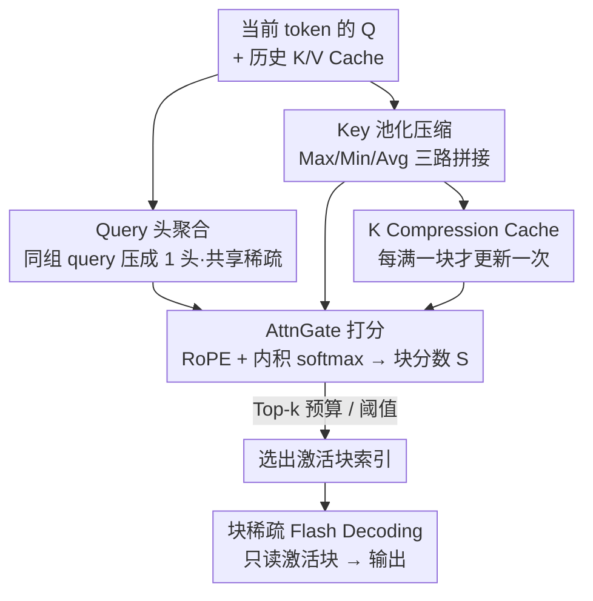

# Sparse Attention Adaptation for Long Reasoning

**会议**: ICLR 2026  
**OpenReview**: [https://openreview.net/forum?id=c5BOcHM6J8](https://openreview.net/forum?id=c5BOcHM6J8)  
**代码**: 待确认  
**领域**: LLM效率 / 稀疏注意力 / 推理加速  
**关键词**: 稀疏注意力, 长链推理, 自蒸馏门控, KV Cache, 解码加速

## 一句话总结
本文提出 SeerAttention-R——一个专为推理模型「长解码」阶段设计的稀疏注意力框架，通过一个轻量、可插拔的自蒸馏注意力门控（AttnGate）学出每一步该激活哪些 KV 块，仅用 0.4B token 训练门控、不动原模型权重，就能在 AIME 等基准上以 4K token 预算保持近乎无损的推理精度，并配套 TileLang 块稀疏解码 kernel 在 H100 上相比 FlashAttention-3 取得最高约 9× 的加速。

## 研究背景与动机

**领域现状**：以 OpenAI o1、DeepSeek-R1、Qwen3 为代表的推理模型靠「测试时扩展」（test-time scaling）提升能力——推理时生成更长的思维链，先想清楚再给答案。经验上生成越长、推理越强：同规模下 Qwen3-14B 平均生成更长、也比 DeepSeek-R1-Distill-Qwen-14B 更强；越难的题（AIME24）需要的 token 也远多于简单题（MATH-500）。

**现有痛点**：长解码带来严重的效率问题。自回归解码下，越靠后的 token 要 attend 越长的上下文，KV cache 的算力和显存需求随之增大——单 token 的生成成本随序列长度线性增长，而整段生成的总成本则是二次增长。稀疏注意力是缓解长序列效率问题的自然思路，但它过去主要在通用语言建模、尤其是 prefill 阶段被研究，针对「需要超长解码」的推理模型几乎没人专门做。

**核心矛盾**：推理模型的注意力到底稀不稀疏？如果稀疏，能不能在解码阶段廉价、准确地把这份稀疏性识别出来。作者用「oracle 稀疏」实验（直接拿真值挑 top-k 块）证明：推理模型的解码注意力同样是内在稀疏的，只激活一小部分重要 token 就足以维持推理能力。真正的难点不在「有没有稀疏」，而在「如何在解码时高效且准确地识别并利用这份稀疏」。

**本文目标**：把作者前作 SeerAttention（面向 prefill 的稀疏注意力）改造到推理模型的长解码场景，要求：(1) 适配逐 token 的自回归解码；(2) 不微调原模型权重、可插拔；(3) 能用大块尺寸（64/128）以降低稀疏调度开销、对硬件友好；(4) 配套真正能跑出加速的解码 kernel。

**核心 idea**：保留 SeerAttention「用自蒸馏门控学注意力稀疏」的内核，去掉 Query 的序列维 pooling 以适配解码，并让门控的稀疏决策按 GQA 分组共享——用一个学出来的轻量门控代替 Quest 那类训练无关的启发式估计，从而在大块尺寸下依然准确地预测「这一步该读哪些 KV 块」。

## 方法详解

### 整体框架

SeerAttention-R 的核心是给预训练 Transformer 的每个注意力层挂一个**可学习的注意力门控 AttnGate**：解码每一步，当前 Query 和被压缩过的历史 Key 经过门控，算出每个 KV「块」的重要性分数，据此选出少量要激活的块，再走块稀疏的 Flash Decoding 只在这些块上做注意力。原模型权重全程冻结，只训练门控本身。

相比面向 prefill 的 SeerAttention，这里有三处关键改造：① **Query 不再做序列维 pooling**——prefill 时一次进一整段、可以按块压缩 Q，但解码是逐 token 进来的，Q 维度上无可压缩，于是门控直接吃当前 token 的 Q；② Q 分支用一个线性层把同一 GQA 组内的多个 query head **聚合成一个头**，让一组共享同一套稀疏选择；③ K 分支沿用 pooling 压缩历史 Key。门控输出每块分数后，用「token 预算 Top-k」或「阈值」两种方式二值化成块掩码。

门控的计算可写成（$g$ 为 GQA 组大小，$d$、$d_{gate}$ 分别是原模型与门控的每头隐维）：

$$Q_{gate} = \mathrm{RoPE}\big(W^q_{gate}\,\mathrm{reshape}(Q_{nope}, [\dots, g\cdot d])\big)$$

$$K_{gate} = \mathrm{RoPE}\big(W^k_{gate}\,\mathrm{concat}[P_{max}(K_{nope}), P_{min}(K_{nope}), P_{avg}(K_{nope})]\big)$$

$$S = \mathrm{softmax}\big(Q_{gate} K_{gate}^{\top} / \sqrt{d_{gate}}\big)$$

其中 $P_{max}/P_{min}/P_{avg}$ 是序列维上的最大/最小/平均 pooling，$S$ 即每块的重要性分数。整条 pipeline 如下：

门控怎么学？训练阶段冻结原模型，让 AttnGate **自蒸馏**去模仿原模型真实注意力的块级分布（详见关键设计 3）。整套方法既不改原权重、又不需要全量微调，是真正的「轻量后训练插件」。

### 关键设计

**1. 去 Query Pooling + GQA 组内共享稀疏：让门控适配逐 token 解码且对硬件友好**

SeerAttention 原本在 prefill 阶段对 Q、K 都按块做序列维 pooling，但解码是逐 token 产出，Q 维度上根本没有「一段序列」可压。作者据此**移除 Q 的序列维 pooling**，让门控直接用当前 token 的 Q 去和压缩后的历史 K 比对，自然契合自回归过程。在此基础上，针对现代 LLM 普遍采用的 GQA，作者在 Q 分支加一个线性层把**同一组内的多个 query head 聚合成单头**：例如 32 个 query 头、8 个 KV 头（组大小 $g=4$）时，准备 8 套形状 $[d_{gate}, 4\times d]$ 的线性权重，每套作用在一组 query 上，最终门控只输出 8 个（即 KV 头数）头的决策，使一组内的 query 共享同一份稀疏选择。这一改造的动机很实在——NSA、SAAP 等工作发现「组内统一稀疏选择」既能提效又不掉点甚至更好，因为块稀疏 kernel 本就以 KV 头为粒度调度，组内共享让访存与计算更规整。

**2. K 的三路 Pooling 压缩 + 门控内重做 RoPE：用极小开销保住选块所需的信息**

历史 Key 必须被压成「块级」表示门控才能廉价打分，但单纯一种 pooling 会丢信息。作者用 **Max、Min、Avg 三种 pooling 的组合**：pooling 的 kernel 和 stride 都等于块尺寸（即非重叠的 chunk 级池化），三路输出拼接后再过线性层。直觉是 Max/Min 能抓住块内的离群极值（这些往往是决定注意力的关键），Avg 则保住整体分布不被极值带偏。位置编码上，门控沿用 SeerAttention 的做法：输入用 **pre-RoPE 的 Q/K**，在门控内部重新施加 RoPE；由于 K 分支已沿序列维压缩，位置索引取每块首 token 的位置。作者实验发现门控内带 RoPE 比不带能稳定地更准——位置信息对「哪个块重要」的判断同样关键。

**3. 自蒸馏门控训练：用原模型自己的注意力当真值，0.4B token 学出选块能力**

门控不靠人工启发式，而是**自蒸馏**——用原模型自身产生的注意力分布当监督信号。具体地，prefill 版用 2D maxpooling 的注意力图当真值，而解码版只做**列向 1D maxpooling**（对应解码门控不在序列维压缩这一事实）；为配合 GQA 组内共享，列池化后的注意力图还要在每个 query 子组内再做一次 maxpool，得到 KV 头粒度的真值，最后归一化到和为 1，用 **KL 散度损失**训练门控。直接显式算出完整注意力图 $\mathrm{softmax}(QK^{\top}/\sqrt{d})$ 再池化会因二次复杂度爆显存，作者因此改写了 FlashAttention-2 的 kernel，复用块级 rowmax 等中间结果，在前向里**顺手生成真值**和注意力输出，大幅提升蒸馏效率。整个训练只调门控、原权重冻结，因而极轻：OpenR1-MATH-220k 里 0.4B token、全局 batch 16、800 步即可，学习率可以开到 1e-3（因为只训门控）。

**4. K Compression Cache + 块稀疏 Flash Decoding Kernel：把「估计开销」和「稀疏收益」都落到实处**

光会选块还不够，要真正跑出加速。作者引入 **K Compression Cache**：缓存门控里 K 经过 pooling+线性后的压缩表示，门控就不必为历史 token 重算 K 分支。它**每生成满一个块（如 64 个）token 才更新一次**——当序列长度还不是块尺寸整数倍、新条目尚不准确时，就**始终激活最后一个块**来兜底避免精度损失。块尺寸取 64 时，这份压缩缓存只占原 KV cache 的约 1/128（<1%），开销极小，还顺带打开了把大 KV cache offload 到 CPU、按需取回激活块的可能。解码侧则配套一个**块稀疏 Flash Decoding kernel**：沿 GQA 的 flash decoding 网格调度，用 `(batch, heads_kv, num_split)` 三维启动；kernel 只遍历门控给出的激活块索引、跳过无效项，并按 `max_selected_blocks`（而非总块数）沿 `num_split` 切分以均衡各 SM 负载；H100 上把 query 组数 pad 到 64 以用上 wgmma 指令，用 TileLang 实现自动 tiling、warp specialization、swizzling 等优化，另提供同调度的 Triton 版做对比。

### 损失函数 / 训练策略
门控以 **KL 散度**对齐原模型的块级注意力真值（列向 1D maxpool + 组内 maxpool + 归一化）。仅训练 AttnGate、冻结原模型；数据为 OpenR1-MATH-220k，序列打包到最长 32k，用可变长 Flash-Attention 训练 kernel 同时生成真值。全局 batch 16、800 步，AMD MI300x，DeepSpeed ZeRO-2，AdamW，学习率 1e-3 + cosine decay。推理二值化提供两种：**token 预算 Top-k**（先把 token 预算除以块尺寸换成块预算，再 Top-k 选块，免去门控里的 softmax，便于和别的方法公平比）和**阈值法**（分数超阈值即选，更自适应、不同头可自动推断不同稀疏率）。

## 实验关键数据

评测在四个推理模型（Qwen3-4B/8B/14B、DeepSeek-R1-Distill-Qwen-14B）和四个基准（AIME24、AIME25、MATH-500、GPQA-Diamond）上进行，最大输出长度统一固定为 32,768 token，主对比对象是 Full Attention 与训练无关的稀疏方法 **Quest**（为公平对比，把 Quest 也设为块尺寸 64、全层稀疏）。

### 主实验

| 设置 | 任务 | 达到近乎无损所需 token 预算 | 备注 |
|------|------|------|------|
| Oracle 稀疏（精度上界） | AIME24/25 等 | 约 2k | 直接用真值选 top-k 块，不提供加速 |
| **SeerAttention-R** | AIME24 | 约 4k | 仅是真值的近似，预算略高于 oracle 属预期 |
| **SeerAttention-R** | MATH-500 / GPQA | 约 2k | 比 AIME 更易、预算更低 |
| Quest（同配置） | AIME24 | 8k 仍未无损 | 大块尺寸下启发式失准 |
| Quest（同配置） | MATH-500 / GPQA | 约 8k 才接近 dense | 明显落后 |

SeerAttention-R 在**所有模型 × 所有基准 × 所有预算**上一致优于 Quest。一个关键趋势：**模型越大，对稀疏带来的信息损失越容忍**——14B 模型在 AIME25 等难基准上更容易把最后那点 gap 补到 dense 水平；这一效应在 Quest 上尤其明显（大模型时低预算下的精度差显著收窄）。作者据此推断：随着推理模型继续扩大，稀疏注意力的可行性会越来越高。

### Kernel 加速

| 配置 | 稀疏率 | 相对 FA3 加速 |
|------|--------|------|
| batch 16, seqlen ≥ 32k（TileLang） | 0.9 | 近理论上界，最高约 8.6–9× |
| batch 4, seqlen 32k（TileLang） | 0.9 | 约 6× |
| TileLang vs Triton（同调度） | 0.9 | TileLang 再快约 1.7× |

解码 kernel 主要是 I/O-bound，因此序列越长、batch 越大、KV cache 越能打满带宽时加速越接近理论上界。

### 关键发现
- **稀疏性确实存在且无损门槛低**：oracle 实验显示，块尺寸 32/64 下 token 预算到 2k 即可在所有任务上无损；只有最大块尺寸 128 + 1k 预算时 AIME24/25 才有可忽略的退化。这直接支撑了「默认块尺寸取 64」的选择。
- **学习 > 启发式，尤其在大块尺寸下**：Quest 在块尺寸 64、全层稀疏的「困难配置」下即便 8k 预算也难无损，而 SeerAttention-R 4k 即可；LServe 曾用「分层分页」这种系统手段绕开 Quest 大块掉点的问题，而本文用一个学出来的门控就直接允许大块尺寸，简化了系统设计。
- **门控内带位置编码更优**：消融发现门控里重做 RoPE 比不带 RoPE 稳定更准。
- **规模越大越好**：稀疏注意力对越大的推理模型越友好，暗示该方法对未来更大模型更有价值。

## 亮点与洞察
- **「学一个门控去模仿真注意力」而非「手工估计上界」**：Quest 用块内分数上界来近似选块，是训练无关的启发式；SeerAttention-R 直接让门控自蒸馏拟合原模型真实的块级注意力分布，因而在大块尺寸下仍准。把「选哪些块」这个离散决策变成可学习的软分布 + KL 蒸馏，是核心的范式差异。
- **大块尺寸是隐藏红利**：很多稀疏方法被迫用小块（如 Quest 默认 16）来保精度，而小块意味着更碎的索引、更多调度开销；本文用可学门控把块做大到 64/128 还不掉点，等于同时拿到了「精度」和「硬件效率」，这是别的方法要靠分层分页等系统 trick 才能逼近的。
- **K Compression Cache 的「每块更新一次 + 末块兜底」很巧**：用 <1% 的额外显存换门控对历史 K 的免重算，还顺势打开 KV offload 的口子；用「最后一块始终激活」来掩盖压缩缓存尚未更新的窗口，是个低成本的正确性补丁。
- **训练真值的 kernel 级生成**：直接算全注意力图再池化会爆显存，作者改写 FlashAttention-2 在前向里复用 rowmax 顺手吐出真值，把蒸馏成本压到可接受——这个工程细节让「0.4B token 训完」成为可能，可迁移到其他需要注意力图监督的蒸馏任务。

## 局限与展望
- **目前只验证了数学/科学推理基准**（AIME、MATH-500、GPQA-Diamond），训练数据也是 OpenR1-MATH。门控的稀疏模式是否能泛化到代码、长文档问答、agent 等其他长链推理场景，文中未充分展开。
- **需要每个模型单独蒸馏一个门控**：虽然轻量（0.4B token），但仍是「按模型/按层」训练，不是零成本即插即用；换一个新模型就得再训。
- **小模型上的 gap 仍在**：14B 能把精度补到近 dense，但 4B/8B 在难基准上低预算时仍有差距，说明方法对模型规模有一定依赖。
- **加速受 I/O-bound 性质制约**：序列短、batch 小时加速有限，收益集中在长序列大 batch 场景；KV offload 到 CPU 的设想文中只是可能性，未给端到端实测。

## 相关工作与启发
- **vs Quest（训练无关启发式）**：Quest 在解码时按块估计注意力分数上界来选 KV 块、且默认前两层保持 dense、用小块尺寸 16 保精度；本文用自蒸馏门控学出选块决策，支持全层稀疏 + 大块尺寸 64，精度一致更好，揭示「learned > heuristic」尤其在大块下成立。
- **vs SeerAttention（前作，面向 prefill）**：前作为 prefill 设计、对 Q/K 都按块 pooling；本文去掉 Q 的序列维 pooling 以适配逐 token 解码，并加入 GQA 组内共享稀疏与解码专用的 K Compression Cache 和块稀疏 flash decoding kernel。
- **vs NSA / MoBA / MiniCPM4（训练内置稀疏）**：这类方法在预训练时就把动态稀疏模块训进模型，需要改权重、成本高；SeerAttention-R 走「后训练学稀疏、不动原权重」的折中路线，部署门槛更低。
- **vs LServe（系统侧分层分页）**：LServe 用虚拟逻辑页解耦稀疏选择粒度与物理页粒度来缓解 Quest 大块掉点；本文从算法侧用可学门控直接允许大块，反而简化了系统设计。

## 评分
- 新颖性: ⭐⭐⭐⭐ 把自蒸馏门控从 prefill 迁到解码、并配合 GQA 组共享与大块尺寸，思路清晰且解决了 Quest 大块掉点的真实痛点。
- 实验充分度: ⭐⭐⭐⭐ 四模型四基准 + oracle 上界 + 跨 batch/seqlen/稀疏率的 kernel 评测，较系统；但局限在数学推理域。
- 写作质量: ⭐⭐⭐⭐ 动机—方法—实验链条顺畅，门控公式与训练真值生成讲得清楚。
- 价值: ⭐⭐⭐⭐⭐ 即插即用、几乎无损、9× kernel 加速，对推理模型长解码部署有直接落地价值。

<!-- RELATED:START -->

## 相关论文

- [\[ICLR 2026\] Tactic: Adaptive Sparse Attention with Clustering and Distribution Fitting for Long-Context LLMs](tactic_adaptive_sparse_attention_with_clustering_and_distribution_fitting_for_lo.md)
- [\[ICLR 2026\] vAttention: Verified Sparse Attention via Sampling](vattention_verified_sparse_attention_via_sampling.md)
- [\[ICLR 2026\] InfLLM-V2: Dense-Sparse Switchable Attention for Seamless Short-to-Long Adaptation](infllm-v2_dense-sparse_switchable_attention_for_seamless_short-to-long_adaptatio.md)
- [\[ICLR 2026\] Retrospective Sparse Attention for Efficient Long-Context Generation](retrospective_sparse_attention_for_efficient_long-context_generation.md)
- [\[ICLR 2026\] RESA: Bringing Back What Sparse Attention Ignores with Residual Estimation](resa_bringing_back_what_sparse_attention_ignores_with_residual_estimation.md)

<!-- RELATED:END -->
