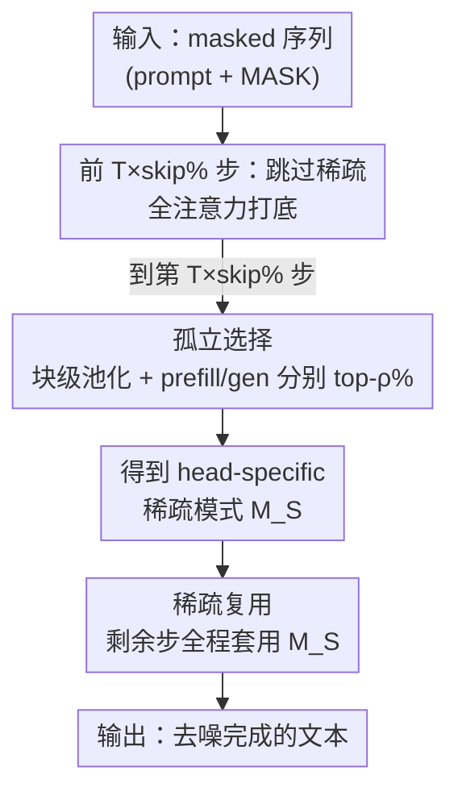

# SparseD: Sparse Attention for Diffusion Language Models

**会议**: ICLR 2026  
**OpenReview**: [https://openreview.net/forum?id=dwbrZtYP04](https://openreview.net/forum?id=dwbrZtYP04)  
**代码**: https://github.com/INV-WZQ/SparseD  
**领域**: LLM效率 / 扩散语言模型 / 稀疏注意力  
**关键词**: 扩散语言模型, 稀疏注意力, 推理加速, 长上下文, 无损加速

## 一句话总结
针对扩散语言模型（DLM）双向注意力随上下文长度二次膨胀、推理慢的问题，SparseD 通过"早期步用全注意力 + 一次性预计算 head-specific 稀疏模式并跨步复用 + prefill/generation 孤立选择"三招，在 64k 上下文、1024 步去噪下相对 FlashAttention 最高获得 1.50× 无损加速。

## 研究背景与动机
**领域现状**：扩散语言模型（DLM，如 LLaDA、Dream）不同于自回归模型（AR）从左到右逐 token 生成，而是把整段序列并行去噪、双向生成，被视为 AR 之外一条有潜力的路线。但 DLM 要在 $T$ 个去噪步里对所有 token 反复跑双向注意力，而注意力对序列长度 $l$ 是 $O(l^2)$ 复杂度，导致长上下文下推理延迟很高。

**现有痛点**：在 AR 上，稀疏注意力是成熟的提速手段——只保留少数重要的 query–key 对（即高注意力分数），AR 的注意力呈现明显且**固定**的稀疏模式（如 sink attention、sliding-window），直接套用即可。但作者实测发现，AR 那套稀疏模式搬到 DLM 上几乎失效：Slide Window 和 StreamingLLM 在 RULER-4k 上掉到 40 左右（原模型 90+）。

**核心矛盾**：DLM 的注意力有自己独特的三条性质，和 AR 不兼容。作者通过可视化注意力图总结出：(1) **跨 head 差异大**——同一层不同 head 分别是列状、滑窗、上滑窗下列状等，没有统一的固定模式可套；(2) **跨去噪步高度相似**——同一个 head 的注意力分数在不同去噪步之间几乎不变；(3) **早期步至关重要**——在前几步就上稀疏注意力会严重损害生成质量。AR 的固定模式抓不住第 (1) 点的 head-specific 结构，又会在第 (3) 点的早期步上造成质量崩塌。

**本文目标**：设计一个**专为 DLM** 的稀疏注意力，既要降低长上下文延迟，又要保住原模型精度（无损加速），同时还不能因为"每步重算稀疏模式"而把省下的时间又吃回去。

**切入角度**：把上面三条观察直接当成方法的三块基石——既然模式跨步相似，那就**只算一次、跨步复用**；既然早期步敏感，那就**早期步用全注意力**；既然跨 head 差异大，那就**为每个 head 单独算 head-specific 模式**。

**核心 idea**：用"早期全注意力打底 + 中段一次性预计算 head-specific 稀疏模式 + 后续全程复用"替代 AR 的固定稀疏模式与逐步重算，在不掉精度的前提下摊薄长序列、多步去噪的注意力开销。

## 方法详解

### 整体框架
SparseD 把整个去噪过程沿时间轴切成两段。**前 $T\times \text{skip}\%$ 步**（默认 skip=20%）老老实实用全注意力（FlashAttention 加速），保护对生成最关键的早期阶段。**到第 $T\times\text{skip}\%$ 步这一刻**，它跑一次完整注意力分数，做块级平均池化后为每个 head、分别为 prefill 和 generation token 选出 top-$\rho\%$ 的重要块，拼成一张 head-specific 的稀疏模式 $M_S$。**剩下的 $T\times(1-\text{skip}\%)$ 步**全部直接复用这张 $M_S$ 跑稀疏注意力（FlexAttention 支持自定义稀疏模式），不再重算。整条流水线只在一个时间点付出"预计算稀疏模式"的代价，之后步数越多、上下文越长，这笔成本被摊得越薄。

### 关键设计

**1. 跳过稀疏：把全注意力留给最敏感的早期去噪步**

这一招针对"早期步至关重要"这条观察。作者做了一个对照实验（Figure 2）：把去噪过程分成 Full→Sparse（前 $x$ 步全注意力、后面稀疏）和 Sparse→Full（反过来）两种配置，发现一旦在早期步上稀疏注意力，loss 立刻大幅跳升；而把稀疏延后到中后段，额外损失只是微增。这说明早期步对生成质量极其敏感、不能动。SparseD 的做法很直接：前 $T\times\text{skip}\%$ 步一律用全注意力，到第 $T\times\text{skip}\%$ 步才开始算并切换到稀疏。消融里去掉这一步（即从头稀疏），RULER-4k 从 90.89 掉到 87.91（-3.07%），是三个组件里掉点最狠的，印证了它对"防早期崩塌"的关键作用。

**2. 孤立选择：为每个 head 单独建模，并让 prefill 与 generation token 都拿到名额**

这一招同时回应"跨 head 差异大"和一个更隐蔽的偏置问题。因为跨 head 模式各异，固定的滑窗/sink 模式抓不住，所以 SparseD 对**每个 head** 单独计算注意力分数、按 $S=\bigcup_i \text{Top}_{\rho\%}\{(i,j)\}$ 选重要 query–key 对，形成 head-specific 稀疏模式。但还有个坑：generation token 的注意力分数在早期步偏低、要到后期才升上来，而 SparseD 偏偏是在早期就把模式定下来并一路复用——如果统一选 top-$\rho\%$，名额会几乎被高分的 prefill token 占满，generation token 被冷落。为此作者把选择**隔离**开：对 prefill 和 generation token 各自按同一比例 $\rho\%$ 选 top 块，即 $S_i = S_i^{\text{pre}} \cup S_i^{\text{gen}}$，保证两边都有足够注意力。为了硬件友好，选择以**块**为单位：先对注意力图做平均池化 $A'=\text{avgpool}(A,\text{block\_size})$，再在 $A'$ 上选块；并且把 $Q$ 切成小块逐块算 $A'$，避免一次算出完整 $A(Q,K)$ 的显存爆炸。消融里去掉孤立选择，精度从 90.89 降到 90.53（-0.36%），且几乎不增延迟。

**3. 稀疏复用：一次预计算，跨步全程套用**

这一招把"跨去噪步高度相似"这条观察变现成实打实的加速。作者用 Jaccard 相似度量化了复用阶段（第 $T\times\text{skip}\%$ 步之后）选中块的稳定性：把第 $T\times\text{skip}\%$ 步选出的 top-$\rho$ 块和后续每一步的"真值"top-$\rho$ 块比，所有 head 平均相似度超过 90%，说明早期定下的稀疏模式在后续步里基本不变。基于此，SparseD 只在第 $T\times\text{skip}\%$ 步算一次稀疏模式 $M_S$，剩下所有步直接拿它跑 $A(Q,K,M_S)\cdot V$，不再重算。这一步是加速的主引擎：消融里若改成"每步都重算稀疏模式"，延迟从 1695s 暴涨到 30020s（+1671%）而精度几乎不变（90.82 vs 90.89），充分说明"复用而非重算"才是 SparseD 能真正提速的关键，也是步数越多加速比越高（128 步 1.23×→1024 步 1.50×）的原因。

### 损失函数 / 训练策略
SparseD 是**训练无关（training-free）的推理期方法**，不引入任何训练或微调，直接作用在已有 DLM 的推理流程上。关键超参：短上下文任务 block_size=32、$\rho$=50%；长上下文 RULER 用 block_size=128、$\rho$=30%；统一 skip=20%。早期全注意力段用 FlashAttention，切到稀疏后用支持自定义模式的 FlexAttention。

## 实验关键数据

### 主实验
在 LLaDA-1.5 与 Dream-7B-Instruct 上跨 MMLU / GSM8K / HumanEval / RULER-4k / RULER-8k 评测（A800 80G）。SparseD 几乎完全保住原模型精度，而 AR 的稀疏方法大幅崩塌、cache 类方法在长上下文掉点明显。

| 模型 / 方法 | MMLU | GSM8K | HE | RULER-4k | RULER-8k | Avg. |
|------|------|------|------|------|------|------|
| Dream-7B-Instruct | 66.42 | 80.74 | 53.05 | 90.13 | 71.79 | 72.42 |
| + Slide Window | 63.45 | 70.20 | 34.76 | 41.46 | 34.36 | 48.84 |
| + StreamingLLM | 64.19 | 72.86 | 33.54 | 43.94 | 36.36 | 50.17 |
| + dKV-Cache | 66.32 | 80.67 | 54.88 | 81.41 | 55.08 | 67.67 |
| + Fast-dLLM | 65.51 | 78.17 | 48.78 | 81.68 | 55.64 | 65.95 |
| **+ SparseD** | 66.34 | 80.29 | 53.05 | 89.76 | 72.47 | **72.38** |
| LLaDA-1.5 | 64.24 | 80.38 | 40.85 | 90.45 | 60.73 | 67.33 |
| + Slide Window | 63.72 | 57.77 | 27.44 | 39.20 | 36.32 | 44.89 |
| + StreamingLLM | 63.52 | 52.01 | 37.20 | 40.39 | 36.62 | 45.94 |
| **+ SparseD** | 64.14 | 79.80 | 40.85 | 90.89 | 62.44 | **67.62** |

精度上，SparseD 在 Dream 上仅掉 0.04%，在 LLaDA-1.5 上反而 +0.29%（接近无损）。延迟上（T=128，RULER 单样本），4k/8k 与 FlashAttention 持平，超过 16k 后优势拉开：64k 时对 Dream / LLaDA-1.5 分别 1.23× / 1.25×；当去噪步增到 1024，加速比升到 1.50× / 1.48×——因为稀疏模式只预计算一次，步数越多越能摊薄成本。相比之下，dKV-Cache、Fast-dLLM 在 RULER-8k 上对 Dream 掉约 16%，对 LLaDA-1.5 分别掉 5.3% 和 14.6%。

### 消融实验
在 LLaDA-1.5 上逐个剔除组件（精度=RULER-4k，延迟=64k 样本）。

| 配置 | RULER (%) | Latency (s) | 说明 |
|------|---------|-------------|------|
| FlashAttention | 90.45 | 2127 | 原模型基线 |
| SparseD | 90.89 | 1695 | 完整模型 |
| − Skipping Sparse | 87.91 (-3.07%) | 1552 | 从头稀疏，精度掉最多 |
| − Sparse Reusing | 90.82 (-0.07%) | 30020 (+1671%) | 每步重算，延迟暴涨 |
| − Isolated Selection | 90.53 (-0.36%) | 1687 | 不分 prefill/gen，掉点且几乎不省时 |

### 关键发现
- **跳过稀疏管精度、稀疏复用管速度**：去掉跳过稀疏精度掉得最多（-3.07%），去掉稀疏复用延迟翻近 18 倍（+1671%）——两块组件分别守住"质量"和"效率"两条命脉，缺一不可。
- **预计算开销可控**：块级选择把稀疏模式存储与显存压得很低，64k 下 $M_S$ 仅占 246MB；若不做块级选择，16k 起就直接 OOM。
- **加速随步数与长度增长**：稀疏模式一次算好后全程复用，所以上下文越长（>16k）、去噪步越多（→1024），加速比越高，最高 1.50×。
- **AR 稀疏模式确实不适配 DLM**：StreamingLLM 的 sink 注意力在 DLM 上严重掉点，印证 DLM 注意力是 head-specific、无统一固定模式。

## 亮点与洞察
- **"观察驱动设计"的范式很干净**：三条经验观察（跨 head 异质、跨步相似、早期敏感）一一对应三块组件（孤立选择、稀疏复用、跳过稀疏），方法的每个动作都有可视化/实验支撑，不是拍脑袋堆 trick。
- **把"时间维相似性"变成加速杠杆**：AR 的稀疏是空间维固定模式，DLM 这里巧在发现**时间维**（去噪步之间）的稀疏模式高度稳定，于是"算一次、复用全程"，步数越多越赚——这是 DLM 特有、AR 没有的便宜。
- **孤立选择是个容易被忽略但很关键的细节**：在早期定模式 + generation token 早期分数偏低的组合下，统一 top-k 会系统性冷落 generation token，分桶选择这一小改动直接修了这个偏置，思路可迁移到任何"早期定模式、后期复用"的稀疏/缓存方法。
- **训练无关、即插即用**：不需重训，直接挂在现成 DLM 推理上，工程落地成本低。

## 局限与展望
- **加速比相对温和**：最高 1.50×，且只在长上下文（>16k）+ 多步去噪下才明显；4k/8k 短上下文与 FlashAttention 基本持平，提速空间有限。
- **skip / $\rho$ / block_size 需按任务调**：短上下文用 $\rho$=50%、长上下文 $\rho$=30%，说明稀疏比例对任务敏感，缺乏自适应机制，换数据集可能要重调。
- **依赖三条观察的普适性**：方法的根基是在 LLaDA / Dream 上观察到的注意力性质，对未来架构差异较大的 DLM 是否仍成立（尤其"早期步敏感""跨步相似"）需要进一步验证。
- **早期全注意力仍是 $O(l^2)$**：skip 段没有省，长序列下这部分依然是开销来源，未来或可对早期步也做更温和的近似。

## 相关工作与启发
- **vs Slide Window / StreamingLLM（AR 稀疏）**：它们用固定空间模式（滑窗 + sink），抓不住 DLM 的 head-specific 结构，且对早期步无保护，导致 DLM 上精度崩塌；SparseD 用 head-specific 动态模式 + 早期全注意力，做到无损。
- **vs dKV-Cache / Fast-dLLM（DLM cache 类加速）**：它们靠缓存 KV / 块级缓存提速，短上下文不错但长上下文精度明显下滑（RULER-8k 掉 5%~16%）；SparseD 不走 cache 路线而走稀疏注意力，长上下文精度几乎无损，是互补的另一条加速路径。

## 评分
- 新颖性: ⭐⭐⭐⭐ 首次系统刻画 DLM 注意力的三条独特性质，并据此设计专属稀疏注意力，填补 DLM 稀疏注意力空白。
- 实验充分度: ⭐⭐⭐⭐ 两个主流 DLM、四类基准、长短上下文 + 多步数全覆盖，消融清晰量化了每个组件。
- 写作质量: ⭐⭐⭐⭐ 观察→方法→实验逻辑闭环，图表支撑充分，叙述清楚。
- 价值: ⭐⭐⭐⭐ 训练无关、即插即用，为长上下文 DLM 落地提供了一条无损加速路径。

<!-- RELATED:START -->

## 相关论文

- [\[ICLR 2026\] Understanding and Improving Length Generalization in Hierarchical Sparse Attention Models](understanding_and_improving_length_generalization_in_hierarchical_sparse_attenti.md)
- [\[ICLR 2026\] Diffusion Language Models Know the Answer Before Decoding](diffusion_language_model_knows_the_answer_before_it_decodes.md)
- [\[ICLR 2026\] Attention Is All You Need for KV Cache in Diffusion LLMs](attention_is_all_you_need_for_kv_cache_in_diffusion_llms.md)
- [\[ICLR 2026\] UltraLLaDA: Scaling the Context Length to 128K for Diffusion Large Language Models](ultrallada_scaling_the_context_length_to_128k_for_diffusion_large_language_model.md)
- [\[ICLR 2026\] Sparse Attention Adaptation for Long Reasoning](sparse_attention_adaptation_for_long_reasoning.md)

<!-- RELATED:END -->
