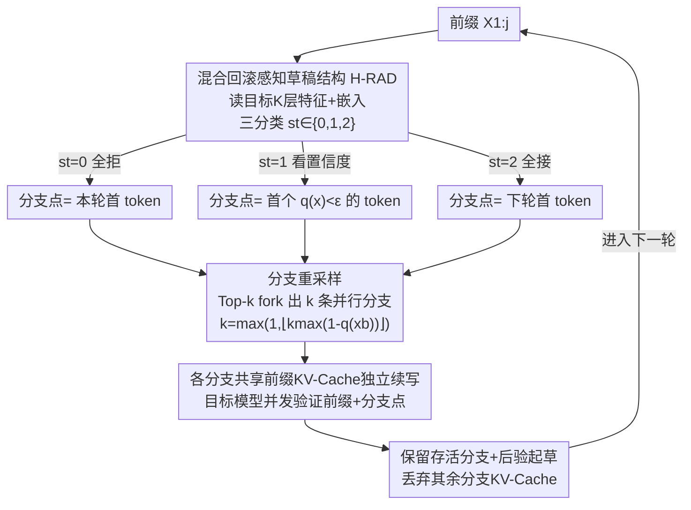

# SpecBranch: Speculative Decoding via Hybrid Drafting and Rollback-Aware Branch Parallelism

**会议**: ICLR 2026  
**OpenReview**: [https://openreview.net/forum?id=BrnlCSqO6n](https://openreview.net/forum?id=BrnlCSqO6n)  
**代码**: https://github.com/Sylvan820/Specbranch  
**领域**: LLM效率  
**关键词**: 投机解码, 分支并行, 回滚感知, 自适应草稿长度, 推理加速

## 一句话总结
SpecBranch 借鉴 CPU 分支预测思想，让草稿模型在目标模型验证的同时并行生成多条"投机分支"以对冲拒绝，并用一个融合显式目标特征与隐式置信度的轻量三分类器（H-RAD）自适应决定草稿长度与分支点，在弱对齐模型上把回滚率从 66–90% 压到 40% 以下，相比自回归解码取得 1.8×∼4.5× 的端到端加速且保持采样分布无损。

## 研究背景与动机

**领域现状**：投机解码（Speculative Decoding, SD）是当前加速 LLM 自回归推理的主流范式——用一个小草稿模型 $M_q$ 提前生成 $\gamma$ 个候选 token，再让大目标模型 $M_p$ 一次前向并行验证。它把"逐 token 串行生成"换成"批量并行验证"，让计算量与序列长度解耦。

**现有痛点**：标准 SD 仍是**串行的**——草稿模型和目标模型严格交替工作：草稿模型产出候选时目标模型空闲，目标模型验证时草稿模型又空闲。这种相互等待形成"流水线气泡"（pipeline bubbles），两个模型谁都没把硬件喂满。PEARL 等并行 SD 方法试图让草稿生成与目标验证重叠（验证阶段继续起草、起草阶段预验证首 token），但引入了一个新的致命问题：一旦某个中间 token 被拒，后续所有 token 连带作废（global invalidation），并行流水线直接退化回串行执行。

**核心矛盾**：并行化与 token 回滚之间存在内在权衡。被接受的草稿长度近似服从**截断几何分布** $P(X=k)=(1-\alpha)\alpha^k\,\mathbb{I}(k<\gamma)+\alpha^\gamma\mathbb{I}(k=\gamma)$，其中 $\alpha=\mathbb{E}(\beta)$ 是期望接受率。$\gamma$ 越长本可以并行越多，但拒绝发生的概率 $1-\alpha^\gamma$ 也越高，回滚惩罚随之放大；尤其当草稿与目标参数严重失配（如 68M 配 13B，$\alpha\le 0.5$）时，回滚直接吃掉并行收益。PEARL 的两个具体缺陷是：① **预验证回滚**——只验证首 token，对中段拒绝毫无感知，直到并行验证结束才发现，已经白算了一堆"注定要死"的 token；② **后验证回滚**——草稿长度是静态的，不感知拒绝，让目标模型沦为处理无效分支的瓶颈。

**本文目标**：在保持并行的同时，把回滚造成的浪费压下去——具体拆成"如何自适应决定草稿长度/分支点"和"如何在验证期并行对冲拒绝"两个子问题。

**切入角度**：作者从现代处理器的**分支预测**机制取得灵感。CPU 在不确定的分支处会预测性地执行多条路径，错了再丢弃；同理，SD 在草稿模型"信心不足"的 token 处也可以预先 fork 出多条候选分支并行起草，提前对冲很可能发生的拒绝。

**核心 idea**：用"回滚感知的分支并行"替代"静态串行起草"——在不确定点 fork 出自适应数量的并行投机分支来对冲拒绝，并用融合隐式置信度与显式目标特征的混合预测器动态控制草稿长度。

## 方法详解

### 整体框架

SpecBranch 把每一轮解码拆成**草稿阶段（draft stage）**和**分支阶段（branch stage）**两段流水线，核心是两个模块协同：**H-RAD**（混合回滚感知草稿结构）负责"在哪断、断多长"，**Branch Resampling**（分支重采样）负责"断点处 fork 几条分支、怎么并行验证"。

一轮的数据流是这样转的：给定前缀，H-RAD 先读取目标模型最后 $K$ 层的隐状态加上新 token 嵌入，输出一个三分类信号 $s_t\in\{0,1,2\}$，判定这一轮草稿应当"全拒 / 看置信度断 / 全接"，从而确定**分支点** $x_b$。在分支点处，Branch Resampling 用 Top-$k$ 从草稿分布里 fork 出 $k$ 条并行分支，各分支共享前缀 KV-Cache 独立续写；与此同时，目标模型**并发**验证上一轮的前缀 token。验证完成后选出存活的那条分支、丢弃其余分支及其 KV-Cache，并用"后验起草"（posterior drafting）基于最新特征为下一轮重新选 token，解决草稿与验证之间的时序错配。整个过程让草稿生成与目标验证真正重叠，填掉了原本的流水线气泡，同时因为只在不确定点 fork、靠 H-RAD 提前掐死注定失败的路径，把回滚浪费降到最低。

### 关键设计

**1. 并行-回滚理论分析与分支并行架构：把"该不该并行"算清楚再动手**

作者没有直接堆并行，而是先用理论模型量化"理想并行"和"带回滚的并行"分别能加速多少，从而看清权衡的边界。在 $\gamma$ 个 token 全接的理想情况下，并行 SD 的单 token 时延为 $T_{\text{PSD}}=\max(\gamma t, ct)/\gamma$（$t$ 为草稿单 token 时间，$c=T_p/T_q$ 为速度比），当 $\gamma\approx c$ 且 $c\gg1$ 时相对标准 SD 取得最优 2× 加速。但一旦考虑回滚（Theorem 1），时延变为

$$T_{\text{PSDr}}=\frac{2\cdot\max(\gamma t, ct)}{(1+\alpha^\gamma)\cdot\frac{\alpha(1-\alpha^\gamma)}{1-\alpha}}$$

这条公式揭示了关键结论：最小时延出现在 $\gamma\le c$ 区间，$\gamma$ 太小并行资源浪费、太大则回滚累积导致收益递减，且这个权衡是 $\alpha$ 相关的——对齐好的模型（$\alpha\to1$）可以放心拉长 $\gamma$，失配模型（$\alpha\le0.5$）则被回滚惩罚主导。这套分析直接给出了后续两个模块的设计动机：草稿长度必须随上下文自适应（而非静态配置），并行必须配上回滚对冲。在此之上，作者提出**分支重采样**机制来"预先对冲很可能发生的拒绝"，且证明它能保持原始采样分布无损。

**2. H-RAD：把 $\gamma$-类长度预测降维成"全拒/看置信度/全接"三分类**

直接回归或对草稿长度 $\gamma$ 做多分类，准确率都很低——显式方法（如 AdaEAGLE 用目标特征预测长度）在接受长度变长时判别力骤降（T-SNE 上各类簇混在一起），隐式方法（用置信度/熵卡阈值早停）则要逐任务调阈值、还有逐 token 预测的误差累积。H-RAD 的巧思在于发现了一个**双峰现象**：目标模型多层特征对"全接受"和"全拒绝"两种极端情况有很强的可分性，而中间的模糊情况恰好可以交给隐式置信度处理。于是它把 $\gamma$-类难题降成 3 类：取目标模型最后 $K$ 层隐状态拼上新 token 嵌入 $z_t=\text{Concat}(f_{t-1}, e_t)$，过一个轻量 MLP 得到 $s_t=\arg\max(\text{Softmax}(\text{MLP}(z_t)))\in\{0,1,2\}$，再据此选混合策略

$$H_t=\begin{cases}\varnothing & s_t=0\ (\text{硬信号：全拒})\\ \{x\in X_{1:\gamma}\mid q(x)>\epsilon\} & s_t=1\ (\text{软信号：看置信度})\\ X_{1:\gamma} & s_t=2\ (\text{硬信号：全接})\end{cases}$$

也就是用"全接/全拒"当**硬信号**（直接拍板），中间态当**软信号**（用草稿置信度 $q(x)$ 卡阈值 $\epsilon$ 待定）。按经验分布，大多数 token 被硬信号一次解决，只有一小部分走软信号。这样既补上了显式方法的预测准确率（多层特征比单层上下文更丰富），又压住了隐式方法的误差累积。H-RAD 只是个三层 MLP，离线训练 20 epoch、单卡 A100 上 5 分钟收敛，**不需要训练草稿模型**，且跨任务泛化只掉 5%。

**3. 分支重采样：在不确定点 fork 自适应数量的并行分支对冲拒绝**

确定分支点 $x_b$ 后，SpecBranch 不是只赌一条路，而是用 Top-$k$ 从草稿置信分布 $q(x_b)$ 里 fork 出 $k$ 条并行分支 $B=\text{TopK}(q(x_b),k)$，且分支数**自适应地随置信度反向缩放**：

$$k=\max\big(1,\ \lfloor k_{\max}\cdot(1-q(x_b))\rfloor\big)$$

$x_b$ 置信度越低（接受率越低）就 fork 越多分支来对冲——这正是"分支预测"的精髓。每条分支 $x_b^i$ 复用前缀 $X_{1:b-1}$ 的共享 KV-Cache 独立续写以避免冗余计算；每条分支的最大草稿长度受速度比 $c$ 约束，保证起草和验证同时进行、消除气泡。与此同时目标模型并发验证上一轮前缀：若有 token 被拒就丢掉后续、回到草稿阶段；若前缀全接，则只需用分支验证 $V=\text{Match}(\{q(x_b^i)\},\{p(x_b^i)\})$ 选出存活分支、丢弃其余分支及其 KV-Cache。和"每个 token 都 fork"的树状方法（KV-Cache 爆炸增长、还要复杂的 tree-attention）不同，SpecBranch 只在 H-RAD 标记的不确定点分支，开销可控。最后还有一个**后验起草**补丁解决时序错配：分支阶段时上一轮 token 尚未验证，H-RAD 拿不到可靠的目标特征，于是改为等并行验证完成后、用当前轮最新的 $(f_{t-1}, e_t)$ 再喂给 H-RAD 选出下一轮要保留的 token，保证决策基于最新上下文。

### 损失函数 / 训练策略
H-RAD 的训练只针对那个轻量三层 MLP：把式 (4) 的特征向量 $z_t$ 与对应的三分类标签 $s_t$ 配对，ReLU 激活，离线训练 20 epoch、batch size 32，单张 A100 上 5 分钟收敛，完全不碰草稿模型本身，因此无需在线微调。整个 SpecBranch 是 training-free（指不训练草稿模型），且保持与目标 LLM 一致的采样分布（无损）。

## 实验关键数据

### 主实验
评测覆盖弱对齐配置（LLaMA 68M&7B、Vicuna 68M&13B）和对齐较好配置（Deepseek-Coder 1.3B&33B、LLaMA-3.1 8B&70B），任务含 HumanEval、GSM8K、CNN/DM 与 Spec-Bench 六子任务。基线为 4 个 training-free 方法：SpS（标准 SD）、AdaEDL、Lookahead、PEARL。指标含平均接受长度 $M$、墙钟加速比、吞吐（tokens/s）和新提出的回滚率 $\text{RB}=\#\text{Rollback tokens}/\#\text{Total tokens}$。

| 模型配置 | 方法 | HumanEval 加速 | GSM8K 加速 | CNN/DM 加速 | 平均加速 |
|----------|------|------|------|------|------|
| LLaMA 68M&7B | PEARL | 1.69× | 1.86× | 1.66× | 1.74× |
| LLaMA 68M&7B | **SpecBranch** | **2.04×** | **2.12×** | **1.87×** | **2.01×** |
| Vicuna 68M&13B | PEARL | 2.02× | 1.61× | 1.68× | 1.77× |
| Vicuna 68M&13B | **SpecBranch** | **2.47×** | **1.95×** | **1.89×** | **2.10×** |
| Deepseek 1.3B&33B | PEARL | 3.39× | 2.78× | 2.63× | 2.93× |
| Deepseek 1.3B&33B | **SpecBranch** | **3.71×** | **3.02×** | **2.97×** | **3.23×** |
| LLaMA-3.1 8B&70B | PEARL | 3.75× | 3.35× | 3.04× | 3.38× |
| LLaMA-3.1 8B&70B | **SpecBranch** | **4.02×** | **3.67×** | **3.37×** | **3.69×** |

SpecBranch 在所有配置下均超过最强基线 PEARL，整体相对自回归解码取得 1.8×∼4.5× 加速。在 Spec-Bench 六子任务上 LLaMA-3.1 配置最高在翻译任务达到 4.51×。

**回滚率对比（HumanEval）**：SpecBranch 把回滚率压到约 39.6%，而 SpS 76.6%、Lookahead 81.4%、PEARL 高达 90.3%——验证了 H-RAD 提前掐死"注定失败"草稿路径的能力。

### 消融实验

| 配置 | 现象 | 说明 |
|------|------|------|
| Full SpecBranch | 完整最优 | H-RAD + 分支重采样协同 |
| w/o branch（去分支重采样） | 对齐好的模型掉点更多 | LLaMA-3.1 8B&70B 上分支重采样贡献更大 |
| w/o H-RAD（去混合预测器） | 弱对齐模型掉点更多 | Vicuna 68M&13B 上 H-RAD 把加速从 1.72× 提到 1.95× |

### 关键发现
- **两个组件作用互补、按模型容量分工**：对失配模型对（Vicuna 68M-13B）回滚是主要瓶颈，H-RAD 贡献最大（去掉它加速从 1.95× 跌到 1.72×）；对对齐好的模型对（LLaMA-3.1 8B-70B），并行度才是关键，分支重采样贡献更大。这正好印证了 Theorem 1 中"权衡随 $\alpha$ 变化"的结论。
- **H-RAD 对阈值不敏感**：随置信阈值 $\epsilon$ 从 0.1 增到更大，纯隐式方法吞吐从 64 掉到 49 tokens/s，而 H-RAD 只从 72 降到 67 tokens/s，显著更稳。
- **特征层数 $K$ 收益递减**：$K$ 从 4 增到 32，吞吐只多 1–2 tokens/s 却带来 8× 显存开销，故选 $K=4$ 平衡速度与显存。

## 亮点与洞察
- **跨学科类比落地得很干净**：把 CPU 分支预测"在不确定处预执行多路、错了再丢"的思想精确映射到 SD——不确定点 = 低置信 token，预执行 = Top-$k$ fork 分支，错了再丢 = 验证后丢弃落选分支，且分支数随置信度反向缩放，类比不是噱头而是真用上了。
- **"降维分类"是最巧的一招**：发现"全接/全拒易分、中间态难分"的双峰现象后，把难做的 $\gamma$-类长度预测拆成"两个易分的硬信号 + 一个交给置信度的软信号"，硬软结合既补显式准确率又压隐式误差累积——这种"用结构先验把难任务降维"的思路可迁移到很多预测型早停问题。
- **回滚率作为新指标很有价值**：以往只看接受长度和加速比，但并行 SD 的真正浪费在回滚。显式量化 RB 让"为什么 PEARL 在弱对齐下退化"一目了然（PEARL 回滚率高达 90%）。
- **几乎零成本**：H-RAD 只是个 5 分钟训完的三层 MLP、不训练草稿模型、保持采样分布无损，工程上极易接入。

## 局限与展望
- H-RAD 仍保留了隐式方法的置信阈值 $\epsilon$，虽然敏感度大幅降低但并未完全摆脱超参（软信号那一类仍依赖 $\epsilon$）。
- 论文主打 training-free（不训草稿模型），但 H-RAD 本身仍需离线训练 MLP 并采集"特征-三分类标签"数据，换新目标模型/新任务时需要重训（跨任务泛化掉 5%）。
- 分支并行会带来额外的并发分支显存/计算开销（每条分支独立续写），在显存受限或 batch 较大时的实际收益论文讨论不多；多分支并发对调度和实现复杂度也有要求。
- 作者指出分支并行与 H-RAD 都是模块化设计，与 EAGLE 这类基于训练草稿头的方法正交，可快速适配——这是个明确的后续方向，但论文未给出与 EAGLE 结合的实测。

## 相关工作与启发
- **vs PEARL**：同为并行 SD，PEARL 用静态草稿长度 + 只预验证首 token，对中段拒绝无感知导致回滚率极高（90%）、一旦拒绝就退化串行；SpecBranch 用 H-RAD 动态感知回滚、在不确定点 fork 分支对冲，回滚率降到 40% 以下，是首个带混合草稿结构的并行框架。
- **vs AdaEAGLE（显式动态起草）**：AdaEAGLE 直接用单层目标特征回归草稿长度，但长度变长时判别力骤降、准确率低；SpecBranch 用多层特征 + 三分类降维 + 隐式置信度兜底，准确率更高。
- **vs AdaEDL / Kangaroo（隐式早停）**：隐式方法逐 token 卡置信/熵阈值，要逐任务调阈值且误差累积；H-RAD 把大部分 token 交给硬信号一次解决，仅少量走软信号，更稳更准。
- **vs SpecInfer 等树状方法**：树状方法每个 token 都 fork、KV-Cache 爆炸增长还要复杂 tree-attention；SpecBranch 只在 H-RAD 标记的不确定点分支，开销可控、无需树注意力验证。

## 评分
- 新颖性: ⭐⭐⭐⭐⭐ 首个"回滚感知 + 混合草稿结构"的并行 SD 框架，分支预测类比与三分类降维都很巧。
- 实验充分度: ⭐⭐⭐⭐⭐ 覆盖弱/强对齐四种模型配置、多基准、组件消融 + 阈值/层数敏感性 + 回滚率分析，比较完整。
- 写作质量: ⭐⭐⭐⭐ 理论分析与方法动机衔接清晰，但图 4 的 case 标注和符号略密集，初读门槛偏高。
- 价值: ⭐⭐⭐⭐⭐ training-free、无损、易接入，对弱对齐/资源受限部署场景的加速很实用。

<!-- RELATED:START -->

## 相关论文

- [\[ICLR 2026\] Overcoming Joint Intractability with Lossless Hierarchical Speculative Decoding](overcoming_joint_intractability_with_lossless_hierarchical_speculative_decoding.md)
- [\[ICLR 2026\] LycheeDecode: Accelerating Long-Context LLM Inference via Hybrid-Head Sparse Decoding](lycheedecode_accelerating_long-context_llm_inference_via_hybrid-head_sparse_deco.md)
- [\[CVPR 2026\] ParallelVLM: Lossless Video-LLM Acceleration with Visual Alignment Aware Parallel Speculative Decoding](../../CVPR2026/llm_efficiency/parallelvlm_lossless_video-llm_acceleration_with_visual_alignment_aware_parallel.md)
- [\[ICLR 2026\] Not-a-Bandit: Provably No-Regret Drafter Selection in Speculative Decoding for LLMs](not-a-bandit_provably_no-regret_drafter_selection_in_speculative_decoding_for_ll.md)
- [\[ICLR 2026\] Self-Speculative Decoding Accelerates Lossless Inference in Any-Order and Any-Subset Autoregressive Models](self-speculative_decoding_accelerates_lossless_inference_in_any-order_and_any-su.md)

<!-- RELATED:END -->
