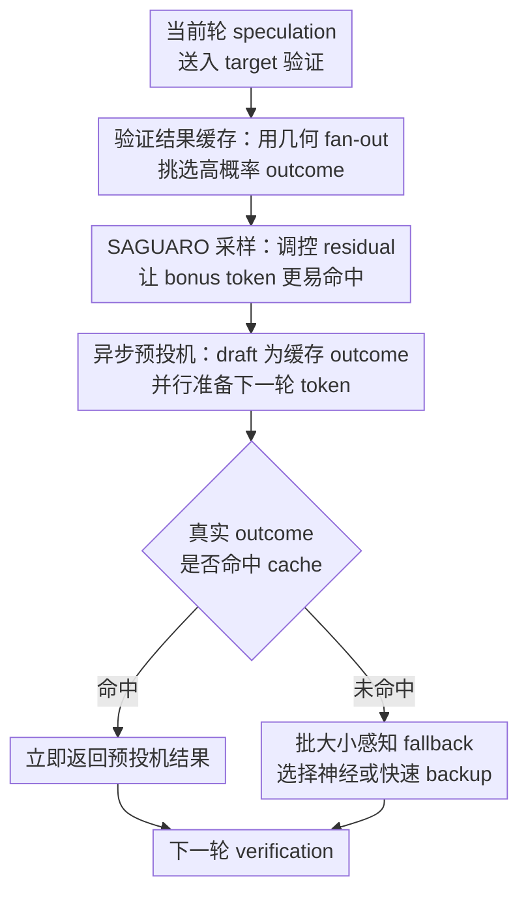

# Speculative Speculative Decoding

**会议**: ICLR 2026  
**OpenReview**: [https://openreview.net/forum?id=aL1Wnml9Ef](https://openreview.net/forum?id=aL1Wnml9Ef)  
**代码**: https://github.com/tanishqkumar/ssd  
**领域**: LLM效率  
**关键词**: 投机解码, LLM推理加速, 异步推理, 缓存命中, 吞吐延迟权衡  

## 一句话总结

本文提出 Speculative Speculative Decoding，把普通投机解码中“先 draft、再 verify、再继续 draft”的串行依赖改成异步预投机：验证还在跑时，draft 模型提前猜测可能的验证结果并为这些结果准备下一轮候选，最终的 SAGUARO 算法在 Llama-3.1-70B 等设置上比强投机解码基线平均快约 30%，相对自回归解码最高接近 $5\times$。

## 研究背景与动机

**领域现状**：LLM 解码的核心瓶颈来自自回归生成。目标模型每次只产出一个 token，下一步又依赖上一步结果，即使 GPU 有大量并行算力，也很难直接把单序列低延迟做下去。投机解码（speculative decoding, SD）是当前很常用的工程解法：用一个更小更快的 draft 模型先猜接下来 $K$ 个 token，再让大目标模型一次 forward 并行验证这些 token，验证算法保证最终采样分布仍然等同于目标模型。

**现有痛点**：普通投机解码虽然减少了目标模型调用次数，但它本身仍然有一个新的串行链条：draft 模型必须等上一轮 verification 结束，知道接受了几个 token、bonus token 是什么之后，才能开始下一轮 speculation。于是 verifier 在等 draft，draft 又在等 verifier，二者不能真正重叠起来。对低 batch、低延迟场景来说，这个空等时间尤其显眼。

**核心矛盾**：SD 的关键矛盾不是“draft 模型还不够快”这么简单，而是“下一轮 draft 的输入依赖上一轮 verification outcome”。这个 outcome 包含两部分：接受了多少 draft token，以及拒绝点或全接受后的 bonus token。若不能提前知道这两个量，draft 就无法提前算下一轮；若只能猜一种结果，又很容易 miss，miss 后再临时 draft 会把异步优势吃掉。

**本文目标**：论文希望把 drafting 与 verification 的顺序依赖进一步拆开，在 verifier 处理当前候选时，让 draft 模型利用独立硬件并行准备下一轮候选；同时保持投机解码的 lossless 性质，也就是不改变目标模型的输出分布。为此需要解决三个子问题：如何高概率猜中 verification outcome，如何在 cache hit rate 和 acceptance rate 之间取到合适平衡，以及 cache miss 时如何不把整个 batch 拖慢。

**切入角度**：作者把这个问题类比为 CPU 的 speculative execution：当某个分支结果还没回来时，提前执行最可能的分支；如果猜中就直接用，猜错就回退。LLM 推理里也可以类似地把“可能的验证结果”当作分支，把每个分支对应的下一轮 speculation 预先算好。这个角度有希望，是因为 draft 模型相对便宜，而且可以放在和 target 不同的 GPU 上并行工作。

**核心 idea**：用“猜验证结果并缓存其下一轮 speculation”代替“验证结束后才开始 draft”，从而隐藏 draft 延迟；SAGUARO 则进一步用几何 fan-out、cache-aware sampling 和 batch-aware fallback 把这个异步框架调到可用。

## 方法详解

### 整体框架

本文先提出 Speculative Speculative Decoding（SSD）这个通用框架，再给出一个优化实例 SAGUARO。整体流程中，target 模型仍然只验证一条当前 speculation，因此不会增加 verifier 侧的 target compute；额外工作主要发生在独立 draft 设备上，它在 target verification 期间预测多个可能的 verification outcome，并为每个 outcome 预先生成下一轮 $K$ 个 draft token。

一次 SSD 迭代可以这样理解：第 $T$ 轮，target 正在验证上一轮送来的 token 序列 $s^{T-1}$；与此同时，draft 端枚举若干候选 outcome $v^T=(k,t^*)$，其中 $k$ 表示接受前 $k$ 个 token，$t^*$ 是 bonus token。draft 为这些 outcome 都准备好下一轮 speculation，形成 speculation cache $S_T$。当 target 真的返回 outcome 后，如果 $v^T \in S_T$，下一轮 token 立刻可用；否则进入 fallback。

这个框架保持 lossless 的原因很关键：SSD 缓存的只是“下一轮要送去验证的 draft token”，最终接受与拒绝仍然由 target 按普通 speculative decoding 的规则完成。如果缓存猜错，fallback 退化为普通投机解码或更保守的备份 speculator，因此不会改变目标分布，只改变等待时间和额外 draft compute。

### 关键设计

**1. 验证结果缓存：把 outcome 预测写成受预算约束的 fan-out 分配**

SSD 首先要回答一个现实问题：verification outcome 的空间太大。若 speculative lookahead 为 $K$，词表大小为 $V$，那么 outcome 近似有 $(K+1)V$ 种，因为每个接受长度 $k\in[0,K]$ 都可能对应一个 bonus token。draft 设备在 target forward 期间能完成的预投机数量有限，记作预算 $B$，所以 SAGUARO 不可能平均地猜所有 token，而要决定每个接受长度位置分多少 bonus-token 猜测，即 fan-out $F_k$。

作者把 cache hit 最大化写成约束优化：在 $\sum_{k=0}^{K}F_k\le B$ 下选择 $F_k$，让真实 outcome 落进 cache 的概率最大。由于接受长度本身近似服从几何分布，越靠后的 $k$ 通常概率越低；但 $k=K$ 的“全接受”又有特殊 bonus-token 分布。论文在 power-law cache miss 假设下推出 SAGUARO 的 cache shape：对 $k<K$，最优 $F_k$ 近似满足 $F_k=F_0\cdot a_p^{k/(1+r)}$，而 $F_K=F_0\cdot a_p^{K/(1+r)}\cdot(1-a_p)^{-1/(1+r)}$。这里 $a_p$ 是 primary speculator 的 acceptance rate，$r$ 描述 cache miss 随 fan-out 增大而下降的幂律指数。

直观上，这个设计避免了 uniform fan-out 的浪费：如果某个接受长度本来就很少出现，就不应在那里猜很多 bonus token；如果某个长度很常见，就应该多放 cache 槽位。实验里，几何 fan-out 在较高 temperature 下尤其有用，因为采样随机性变强后 uniform 策略更容易把预算花错位置，而几何分配能维持更高 cache hit rate。

**2. SAGUARO 采样：故意重塑 draft 分布来提高 bonus token 命中率**

普通投机解码中，被拒绝后的 bonus token 来自 residual distribution：$r(\cdot)\propto\max(p_{target}(\cdot)-p_{draft}(\cdot),0)$。这带来一个不太直观的难点：最像 draft 的 token 不一定最容易成为 residual bonus token，因为如果 $p_{draft}(t)$ 已经很高，$p_{target}(t)-p_{draft}(t)$ 反而可能不大。SSD 的 cache 又通常基于 draft logits 选择 top tokens，所以“draft 最可能 token”和“residual 最可能 token”之间会错位。

SAGUARO 的做法是让采样分布主动为 cache 服务。给定 draft logits $z$、fan-out $F$ 和下调常数 $C\in[0,1]$，它把 top-$F$ draft tokens 的概率乘以 $C$，其他 token 保持原权重：$\sigma_{F,C}(z)_t\propto C\exp(z_t)$ 若 $t\in top_F(z)$，否则 $\sigma_{F,C}(z)_t\propto \exp(z_t)$。这样做会降低 cache tokens 在 draft 分布中的概率，从而把 residual mass 推向这些 cache tokens，提高 bonus token 落入 cache 的概率。

这个设计的代价也很明确：如果把 draft 分布改得离 target 太远，acceptance rate 会下降；但如果完全不改，cache hit rate 又可能不足。SAGUARO 用 $C$ 作为旋钮，在 acceptance rate 和 cache hit rate 之间调节。论文的理论结果说明 $C\to0$ 时 cache hit rate 单调提高，实验也展示了 $C$ 从 1 降低时命中率上升、接受率下降的 trade-off。这里的巧妙点在于，作者不是被动预测 residual，而是通过改变 draft sampling 来让 residual 更可预测。

**3. 批大小感知 fallback：cache miss 时按 batch regime 选择备份 speculator**

异步预投机一定会有 cache miss，尤其是在温度较高、batch size 较大或 cache 预算有限时。cache miss 的处理方式决定 SSD 是否真的比 SD 快：如果 miss 后总是用同一个神经 draft 模型 just-in-time 重新生成，那么 batch 中只要有一个样本 miss，整批都要等这个 backup speculator，batch 越大越容易被拖住。

SAGUARO 因此把 fallback 策略做成 batch-aware。低 batch 时，cache miss 不太频繁，使用质量更高但更慢的 primary neural speculator 作为 backup 仍然划算，因为它能带来更高 $E_{miss}$，也就是 miss 后仍然一次生成较多 token。高 batch 时，至少一个样本 miss 的概率迅速接近 1，延迟项被 backup latency $T_b$ 主导；这时宁愿用极快但质量低的 backup，例如论文实现中的随机 token 策略，未来也可以换成 n-gram 这类非神经 speculator。

论文用 batch 版本的速度公式解释了这个切换点：batch size 为 $b$ 时，所有样本同时 cache hit 的概率是 $p_{hit}^b$，因此延迟期望从单样本的 $p_{hit}$ 变成 $p_{hit}^b$ 控制。随着 $b$ 增大，$p_{hit}^b\to0$，系统几乎每轮都要走 miss 路径；此时最优策略自然从“慢但准”切到“快但粗”。实验中 Figure 6 也验证了这一点：小 batch 神经 backup 更有优势，大 batch fast backup 更快。

**4. 系统侧异步执行：把额外 compute 放到 draft 设备而不是 verifier 设备**

SSD 与 token-tree speculative decoding 的一个根本差别是，它没有让 target model 验证更大的树。target 仍然每轮验证一条 speculation，因此昂贵的 verifier compute 基本不变；额外开销集中在 draft 侧，draft 需要为 $B(K+1)F$ 级别的分支准备下一轮 token，并缓存 token 与 logits。论文实现把 target 放在 $4\times$H100 上，draft 放在单独 $1\times$H100 上，通过 NCCL 每轮交换 outcome、token 和 logits。

这个系统选择让 SSD 更像“用额外便宜设备换低延迟”的工程策略。draft 端为了同时解码很多分支，需要自定义 sparse attention mask，让每个分支只看已验证前缀和自己的 fork path；同时因为命中分支落在碎片化 KV cache 位置，还需要在每轮后做 page table reconciliation 和 rollback。也就是说，SAGUARO 的收益不是免费的：它用更多 draft FLOPs、数百 MB 级别的 speculation cache 和更复杂的调度逻辑，换来隐藏 draft latency、推进 throughput-latency Pareto frontier 的能力。

### 一个完整示例

假设当前 round 的 draft 给 target 送去了 $K=3$ 个 token：`[a, b, c]`。普通 SD 必须等 target 返回结果后才能继续：如果 target 接受了 `[a,b]` 并采样 bonus token `x`，下一轮 draft 输入就是原前缀加 `[a,b,x]`；如果只接受 `[a]` 并采样 `y`，输入又变成原前缀加 `[a,y]`。这两个未来在 verification 完成前都不确定。

SSD 在 target 验证 `[a,b,c]` 的同时，提前枚举若干 outcome。例如 SAGUARO 的 fan-out 分配可能给 $k=0$ 放 4 个候选 bonus token，给 $k=1$ 放 3 个，给 $k=2$ 放 2 个，给 $k=3$ 放 3 个。draft 分别以这些 outcome 为条件生成下一轮 $K$ 个 token，并把它们放进 cache：`(2,x) -> [d,e,f]`，`(1,y) -> [g,h,i]`，等等。

当 target 真正返回 `(2,x)` 时，speculator 不需要再临时跑 draft，直接查 cache 得到 `[d,e,f]` 送给 target 进入下一轮验证。若 target 返回了一个没有准备的 `(0,z)`，则 cache miss，系统按 batch size 选择 fallback：低 batch 可以让 neural draft 现场补一条高质量 speculation，高 batch 则用极快 backup 避免整批等待太久。无论命中还是 miss，下一轮 token 仍会被 target 正式验证，所以输出分布仍是目标模型分布。

### 损失函数 / 训练策略

本文不是训练一个新模型，而是设计推理算法与系统实现，因此没有传统意义上的训练损失。需要调的主要是推理时超参数：speculative lookahead $K$、cache 预算 $B$、fan-out 形状 $F_k$、SAGUARO sampling 的 downweight 常数 $C$、以及 batch-size-dependent fallback 的切换点 $b^*$。

理论分析给出这些超参数的方向性约束。速度公式为 $speedup_{SSD}=\frac{p_{hit}E_{hit}+(1-p_{hit})E_{miss}}{p_{hit}\max(1,T_p)+(1-p_{hit})(1+T_b)}$，其中 $T_p,T_b$ 是 primary 和 backup speculator 相对 verifier 的时间，$E_{hit},E_{miss}$ 是 hit/miss 时每轮生成 token 数。这个式子直接说明：提高 $p_{hit}$、降低 $T_b$、或提升 $E_{hit}$ 都能加速，但三者会互相牵制。

实现上，SAGUARO 使用独立 draft GPU 异步执行，target 与 draft 每轮通信一次。target 发送上一轮接受长度、bonus token、序列长度、block table 和温度等信息；draft 返回 cache-hit bitmap、$K$ 个 speculative tokens 以及验证需要的 $K$ 步 logits。实验设置中，Llama-3.1-70B target 使用 TP=4 的 H100，draft 常用 Llama-3.2-1B；Qwen-3 32B 则搭配 Qwen3-0.6B draft。

## 实验关键数据

### 主实验

论文在 HumanEval、UltraFeedback、Alpaca、GSM8k 四类数据上评测 decode throughput，生成长度为 512 tokens，主要报告不含 prefill 的解码速度。Llama-3.1-70B/1B 设置中，SSD 对普通 SD 的加速约为 $1.55\times$ 到 $1.60\times$，平均吞吐从 161.8 tok/s 提升到 255.8 tok/s。

| 模型 / draft | 数据集 | AR tok/s | SD tok/s | SSD tok/s | SSD / SD | SSD / AR |
|--------|--------|----------|----------|-----------|----------|----------|
| Llama-3.1-70B / 1B | HumanEval | 54.7 | 176 | 283 | 1.60× | 5.17× |
| Llama-3.1-70B / 1B | UltraFeedback | 54.7 | 138 | 215 | 1.55× | 3.93× |
| Llama-3.1-70B / 1B | Alpaca | 54.7 | 145 | 224 | 1.55× | 4.10× |
| Llama-3.1-70B / 1B | GSM8k | 54.7 | 188 | 301 | 1.60× | 5.50× |
| Llama-3.1-70B / 1B | Average | 54.7 | 161.8 | 255.8 | 1.58× | 4.68× |
| Qwen-3 32B / 0.6B | Average | 88.8 | 136.8 | 203.8 | 1.49× | 2.29× |

论文还把 SAGUARO 与开源推理引擎中的强基线比较，包括 SGLang / vLLM 的 autoregressive、standalone SD 和 EAGLE-3。Figure 7 显示，SSD 不只是单点 latency 更低，还在 batch size 1 到 16 的范围内推进 throughput-latency Pareto frontier，尤其低 batch 时优势最大。

### 消融实验

严格说，论文的“消融”更多是组件分析而非传统训练消融：分别研究 cache topology、sampling 和 fallback 对速度与 cache hit 的影响。核心结论是：uniform fan-out 虽然已经能超过普通 SD，但几何 fan-out 在高温采样下更稳；SAGUARO sampling 可以提高 cache hit，但需要用 $C$ 控制 acceptance rate 损失；fallback 的最优选择随 batch size 改变。

| 分析项 | 对比配置 | 观察指标 | 主要结论 |
|--------|----------|----------|----------|
| cache topology | SSD uniform fan-out vs SSD geometric fan-out | decode speed / cache hit rate | 几何 fan-out 在 $T=0.7$ 和 $T=1.0$ 下优势更明显，cache hit rate 和端到端速度都更高 |
| sampling scheme | 不同 $C$ 的 SAGUARO sampling | cache hit rate / acceptance rate | 降低 $C$ 会提高 cache hit rate，但会压低 acceptance rate，需要按端到端速度选折中点 |
| fallback strategy | fast backup vs neural backup | tok/s/seq 随 batch size 变化 | 小 batch 使用神经 backup 更合适，大 batch 中 fast backup 避免全批等待，表现更好 |
| draft compute scaling | batch size 16 下增加 draft GPUs | decode tok/s/seq | 增大 fan-out 预算可继续提高 cache hit 和速度，但最终会受 compute bound 限制 |

### 关键发现

- SSD 的主要收益来自隐藏 draft latency，而不是让 target 一次验证更多 token；这解释了为什么它能与 EAGLE、token-tree 等方法组合，而不是简单替代它们。
- cache hit rate 是 SSD 成败的核心变量。只准备“全接受”这一种 outcome 的异步方法过于脆弱，而 SAGUARO 把接受长度和 bonus token 都纳入 cache，使异步预投机更一般。
- 采样温度越高，bonus token 越难预测，uniform cache 越容易掉队；几何 fan-out 和 SAGUARO sampling 都是在高随机性场景下提升命中的关键。
- 大 batch 场景下，miss 几乎不可避免，fallback latency 会成为瓶颈；这说明推理加速算法不能只看单请求路径，也要考虑 batch 中最慢样本拖住整批的系统效应。

## 亮点与洞察

- 把投机解码本身再“投机化”是很自然但不容易做对的 idea。论文没有停留在“验证时顺便 draft”这个口号，而是精确定义了 verification outcome、speculation cache、cache hit/miss，并给出了速度公式。
- 几何 fan-out 是一个很干净的设计。它把“接受长度服从几何式衰减”这个 speculative decoding 的结构性质转化为 cache 预算分配，而不是靠经验平均撒点。
- SAGUARO sampling 的洞察很有意思：为了让 residual bonus token 更可预测，可以主动降低 cached tokens 在 draft 分布里的概率。它牺牲一点 acceptance rate 来买 cache hit rate，说明推理算法里“最接近 target 的 draft”不一定总是端到端最快。
- 系统设计上，SSD 把额外负担放在独立 draft 设备，而不是 target verifier 上，这与大模型服务中的 prefill/decode disaggregation 思路相近。对服务系统来说，这类异构资源调度可能比单模型算法更有实际空间。
- 这篇论文也提醒我们，LLM 推理优化的目标不是单一的 FLOPs 最小化。SD 和 SSD 都是在用额外 compute 换 latency，但 SSD 进一步展示了只要 compute 放在正确位置、与关键路径重叠，就可能同时改善 latency 和 per-device throughput。

## 局限与展望

- SAGUARO 需要额外 draft GPU，并且 draft 端要承担大量分支预解码。对于已经 GPU 紧张、或者吞吐而非延迟主导的离线生成/RL 数据生产场景，这种用 compute 换 latency 的方法不一定划算。
- 实现复杂度较高。自定义 sparse attention mask、KV cache 分支、page table rollback、NCCL 同步与 continuous batching 都会增加工程维护成本，也可能让它难以直接塞进现有推理引擎。
- 论文主要展示单节点 H100 环境下的结果，跨节点部署、网络带宽较弱、draft endpoint 被多个 target 服务共享时，通信和调度开销可能改变收益曲线。
- SAGUARO sampling 改变 draft 分布后会影响 acceptance rate，$C$ 需要经验选择。不同模型族、不同 temperature、不同任务的最优折中可能差异很大，自动调参仍是开放问题。
- 与 EAGLE-3、token-tree speculative decoding 的组合只是讨论和附录分析，真正的 joint design 还没系统展开。未来可以把“outcome cache”与“tree verification”联合优化，甚至让 cache topology 随在线统计自适应更新。

## 相关工作与启发

- **vs 普通 speculative decoding**: 普通 SD 用小 draft 模型减少 target forward 次数，但 draft 和 verify 仍然串行。SSD 保留同样的 lossless verification 规则，却让 draft 在 verifier 工作时提前准备多个未来分支，主要收益来自隐藏 draft latency。
- **vs AMUSD / PEARL**: 这些并行投机解码方法也尝试在 verification 期间准备下一轮，但通常只覆盖“全部 token 被接受”等特殊 outcome。SAGUARO 把 outcome 定义成 $(k,t^*)$，覆盖不同接受长度和 bonus token，因此更一般。
- **vs SwiftSpec / SpecBranch**: SwiftSpec 和 SpecBranch 也有异步或分支并行思想，但 fallback 在高 temperature 或大 batch 下容易成为瓶颈。SAGUARO 明确分析了 batch size 对 miss latency 的影响，并给出 fast backup / neural backup 的切换原则。
- **vs tree-based speculative decoding / EAGLE**: tree-based 方法通过让 target 验证更大的 token tree 提高接受 token 数，EAGLE 则提升 draft 质量；SSD 的方向不同，它主要并行化 draft 与 verification 的时间依赖。二者可组合，但组合后 attention mask、target activation 条件和 cache 预算会更复杂。
- **启发**: 对 LLM serving 来说，一个值得继续探索的方向是“把不确定未来显式缓存起来”。只要未来分支的概率结构可估计、额外 compute 不落在关键路径上，就可以用类似 speculative execution 的思路优化 agent、多轮工具调用、结构化解码等更复杂的生成流程。

## 评分

- 新颖性: ⭐⭐⭐⭐⭐ 把 speculative decoding 的同步瓶颈抽象成 verification outcome 预测，并给出完整异步框架和优化算法，idea 很 sharp。
- 实验充分度: ⭐⭐⭐⭐ 覆盖 Llama 与 Qwen、多个数据集、batch size、temperature 和开源引擎基线；但跨节点和真实线上流量场景还需要更多验证。
- 写作质量: ⭐⭐⭐⭐⭐ 论文从 framework、理论速度式、三个关键挑战到系统实现层层展开，读者能清楚看到每个设计为什么必要。
- 价值: ⭐⭐⭐⭐⭐ 对低延迟 LLM serving 很有实际价值，也为“用额外异步 draft compute 换关键路径延迟”提供了可复用设计范式。

<!-- RELATED:START -->

## 相关论文

- [\[ICLR 2026\] Learning To Draft: Adaptive Speculative Decoding with Reinforcement Learning](learning_to_draft_adaptive_speculative_decoding_with_reinforcement_learning.md)
- [\[ICLR 2026\] SpecBranch: Speculative Decoding via Hybrid Drafting and Rollback-Aware Branch Parallelism](specbranch_speculative_decoding_via_hybrid_drafting_and_rollback-aware_branch_pa.md)
- [\[ICLR 2026\] Not-a-Bandit: Provably No-Regret Drafter Selection in Speculative Decoding for LLMs](not-a-bandit_provably_no-regret_drafter_selection_in_speculative_decoding_for_ll.md)
- [\[ICLR 2026\] Overcoming Joint Intractability with Lossless Hierarchical Speculative Decoding](overcoming_joint_intractability_with_lossless_hierarchical_speculative_decoding.md)
- [\[ICLR 2026\] Training-Free Loosely Speculative Decoding: Accepting Semantically Correct Drafts Beyond Exact Match](training-free_loosely_speculative_decoding_accepting_semantically_correct_drafts.md)

<!-- RELATED:END -->
