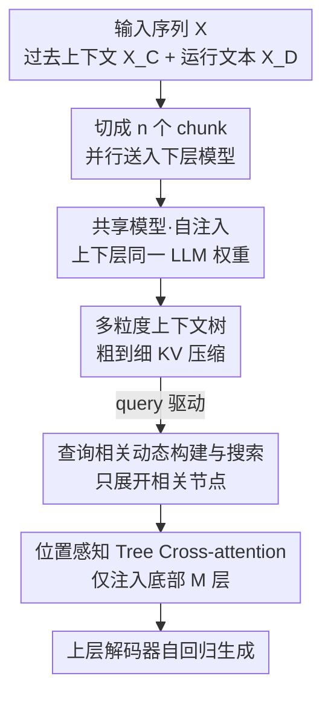

# Stacked From One: Multi-Scale Self-Injection for Context Window Extension

**会议**: ICLR 2026  
**OpenReview**: [https://openreview.net/forum?id=lh3Aa1u7kU](https://openreview.net/forum?id=lh3Aa1u7kU)  
**代码**: https://github.com/Clement25/SharedLLM  
**领域**: LLM效率  
**关键词**: 上下文窗口扩展, 长上下文压缩, KV共享, 上下文树, 自注入

## 一句话总结
SHAREDLLM 把同一个短上下文 LLM 拆成「下层压缩器 + 上层解码器」两份堆叠模型，下层把长输入压成粗到细的多粒度上下文树并只在最底部几层把 KV「自注入」给上层，于是仅用 8K 序列训练就能外推到 128K，速度比流式快 2 倍、比 encoder-decoder 快 3 倍，且性能持平或更优。

## 研究背景与动机
**领域现状**：把 LLM 的上下文窗口从几 K 扩到 128K，目前主流有三条路。一是在长语料上继续预训练并配合 RoPE 插值类位置编码（PI、YaRN），靠「train short, test long」做外推；二是 prompt 压缩，用语义 token 替换长 prompt；三是改造 transformer 做流式处理（StreamingLLM、Activation Beacon），维持一个常数大小的滑动窗口记忆。

**现有痛点**：第一条路代价高得离谱——YaRN 要做到 128K，得在 64K 长度上预训练，数据获取和算力成本都难以承受。Prompt 压缩只能加速推理，并不能真正扩展窗口，适用场景也窄。流式方法虽然把内存压成常数，但它们的专用注意力模式往往和 FlashAttention 这类高性能实现不兼容，输入越长反而越慢。还有一类 encoder-decoder 思路（CEPE）把过去上下文喂给一个独立 encoder（如 24 层 RoBERTa），但 encoder 与 decoder 的隐空间不一致，必须额外加一个 warmup 阶段对齐，训练链路又长又重。

**核心矛盾**：扩展上下文窗口本质是在「效率」和「性能」之间拉扯。要省内存就得压缩或流式，但压缩/流式要么丢信息、要么破坏注意力的硬件友好性；要保性能就得喂全量 token，又回到二次复杂度。已有方法没能同时拿下两端。

**本文目标**：在不做昂贵长序列预训练、不引入异构编码器的前提下，既把长输入压到可控内存，又保住下游长上下文任务的性能，还要跑得快。

**切入角度**：作者观察到一个被忽视的事实——如果压缩器和解码器干脆用同一个 LLM 的权重初始化，两者隐空间天然一致，就不再需要 warmup 对齐；再加上长文本里「任务相关信息分布不均」（摘要看主题句、找密钥看细节），可以用一棵树做粗到细的多粒度压缩，让模型按 query 自适应地决定哪里该细、哪里粗一笔带过。

**核心 idea**：把一个短上下文 LLM「堆成两份」——下层当压缩器把长上下文编成多粒度上下文树、上层当解码器，二者只在最底部 $M$ 层通过共享 KV 做「自注入（self-injection）」，用极少可训练参数实现长上下文外推。

## 方法详解

### 整体框架
SHAREDLLM 要解决的是「怎么把超长上下文塞进一个短窗口 LLM 还不掉性能」。它的做法是把输入序列 $X$ 切成两段 $X=\text{concat}([X_C; X_D])$：过去上下文 $X_C$ 交给**下层模型**（压缩器），当前运行文本 $X_D$（如问题）交给**上层模型**（解码器）。下层把 $X_C$ 再切成 $n$ 个不重叠 chunk $\{C_i\}$，每个 chunk 并行地编成一棵**上下文树**，按 query 动态展开相关节点、对保留节点的 KV 做层级下采样，得到高度压缩的多粒度 KV。这些 KV 只在上层的最底部 $M$ 层经由 cross-attention 注入，上层据此自回归生成。整套流程把自注意力复杂度从 $O(T^2)$ 降到 $O(n\cdot(T/n)^2 + T_D\cdot|S'|)$，其中 $|S'|$ 是压缩后的 KV 长度。

### 关键设计

**1. 自注入：上下层共用同一个 LLM，只在底部 M 层交换 KV**

最直击痛点的设计是「自注入（self-injection）」——下层压缩器就是目标 LLM 的前 $M$ 个浅层，上层解码器是同一个 LLM 的全层版本，两者从同一个现成 checkpoint 初始化。这一刀解决的是 CEPE 那种 encoder-decoder 架构的隐空间错位问题：因为权重同源，下层产出的 KV 和上层的隐空间本就在同一个语义坐标系里，无需任何 warmup 对齐阶段就能直接微调，训练成本大幅下降。

更关键的是信息只在**最底部 $M$ 层**注入（语言建模设 $M=4$，SFT 设 $M=16$）。下层只跑前 $M$ 层就停，省掉了完整 forward 的漫长前传；上层也只在底部 $M$ 层插入 cross-attention，绕过了冗余的层间投影。这条「浅层压缩 + 浅层注入」的短路径让 SHAREDLLM 既不像 CEPE 要把 chunk 过完 24 层 RoBERTa，也不像流式方法破坏注意力实现，从而拿到 2× / 3× 的提速。消融里把注入层从「连续底部」换成「连续顶部」或「交错」，性能都明显变差，且底部方案前传/反传路径最短、效率最高。

**2. 多粒度上下文树：用一棵二叉树做粗到细的 KV 压缩**

针对「长文本里任务相关信息分布不均」这个观察，作者为每个 chunk 建一棵二叉**上下文树**。根节点装整个 chunk，非叶节点 $\{x_{u+1},...,x_{u+l}\}$ 按式 $C_{\text{left}}=\{x_{u+k}\}_{k=1}^{b},\ C_{\text{right}}=\{x_{u+k}\}_{k=b+1}^{l}$ 一分为二，切点 $b=\lfloor l/2-\epsilon\rfloor$，其中 $\epsilon\sim N(0,\sigma^2)$ 是随机扰动。这个噪声有两重作用：训练时充当结构化数据增强，防止模型过拟合到固定切分位置；同时降低硬切语义边界（如把一个实体名拦腰斩断）的风险，逼模型学到对边界鲁棒的表示。测试时 $\epsilon$ 固定为 0 做确定性切分。

树建好后对每个保留节点取出全 $M$ 层 KV $S=\{K,V\}\in\mathbb{R}^{M\times l\times d}$，沿长度维做均匀下采样（用分数步长选择保证等距保留，不引入额外池化参数）得到 $S'=\{K',V'\}$，单节点压缩率 $\alpha=l/l'$。妙处在于**层级递减的压缩率**：第 $w$ 层用统一压缩率 $\alpha_w$，且自上而下逐层衰减 $\alpha_w=2\alpha_{w+1}$。这就造出粗到细的语义分布——高层节点子序列长、压得狠，只保留粗粒度信息；底层节点压得轻，保留细粒度细节。整棵树的全局压缩率 $\beta=\frac{|C|}{\sum_w l'_w n_w}$（$n_w$ 是第 $w$ 层保留节点数），实验表明 $\beta$ 可高达 8 而性能不崩。

**3. 查询相关的动态树构建与搜索：只为相关节点花算力**

如果对每个 chunk 都建满整棵静态树，GPU 内存和时间都浪费在与 query 无关的节点上。于是作者改成**查询驱动的动态树**：从根开始做深度优先的「边切边选」，每个节点先按式 (1) 切成左右子序列，再用一个非参数策略 $\pi((\vec{x}_{\text{left}},\vec{x}_{\text{right}}),\vec{y})\to\text{left or right}$ 决定继续展开哪个孩子，未选中的兄弟节点标记为「保留」、不再展开（根节点恒被选中）。

策略 $\pi$ 是任务相关的。语言建模（非 SFT）时没有显式 query，固定选右分支 $\pi\equiv\text{right}$ 来模拟有用的 $\Lambda$ 形注意力模式；指令跟随（SFT）时 query 显式可得，则选与 query 语义相似度更高的节点：$\pi=\arg\max_{\phi\in\{\text{left},\text{right}\}}\text{sim}(\vec{h}_{\vec{x}_\phi},\vec{h}_{\vec{y}})$，相似度取末位 token 隐向量的余弦相似度，$\vec{h}_{\vec{x}_\phi}$ 由下层一层自注意力前传得到、$\vec{h}_{\vec{y}}$ 由上层得到。一路递归到叶节点，左右孩子都标「保留」。这样只对真正相关的路径做细粒度展开，无关节点停在粗粒度，省下大量内存和时间。消融显示，去掉这个 query-aware 机制在 query 驱动任务上掉点最多，是三项辅助设计里最关键的一个。

**4. 位置感知的 Tree Cross-attention：把打乱的 chunk KV 重新按时序对齐**

下层并行处理各 chunk，产出的 KV 序列其实是「打乱」的，若直接喂给上层，会丢失原文的全局时序。作者在 cross-attention 里给 query $Q$ 和压缩后的 key $K$ 赋 chunk 级位置索引：$P_Q$ 全取最大值 $n$（因为 $Q$ 来自排在所有上下文之后的 $X_D$），$P_K$ 则按 chunk 顺序给每个 chunk 的压缩 KV 块依次赋 $0,1,...,n-1$，再按这些块索引施加 RoPE，让 cross-attention 自然尊重 query 与各压缩 chunk 之间的相对距离。最终输出以残差方式融入上层自注意力状态：$O=\text{cross\_attn}(Q,\text{concat}([K'_1;...;K'_n]),\text{concat}([V'_1;...;V'_n]))$。消融里去掉 chunk 位置索引（w/o chunk pid）性能下降，印证了「解码器必须知道 chunk 时序」这一点。

### 损失函数 / 训练策略
训练用标准语言建模损失 $L=-\sum_{x_t\in X_{\text{tar}}}\log P(x_t\mid X_C; x_{<t})$。语言建模数据里 $X_{\text{tar}}=X_D$（除首 token 外的全部运行文本）；指令跟随数据里 $X_D$ 含指令 $X_{\text{inst}}$ 与标注回复 $X_{\text{res}}$，此时设 $X_{\text{tar}}=X_{\text{res}}$，即只对回复 token 计损失、指令文本被 mask。cross-attention 层全程可训，语言建模阶段额外训练上层顶部 $N-M$ 个自注意力层做 post-injection 聚合以加速收敛。数据用 RedPajama 采样 20B（1%）token 截断到 8192，8× A800 训练。

## 实验关键数据

### 主实验
语言建模困惑度（continual pretraining 设置，LLaMA-2 基座，越低越好）：

| 数据集 | 长度 | SHAREDLLM | CEPE | YaRN |
|--------|------|-----------|------|------|
| Arxiv | 32K | **2.46** | 2.51 | 2.58 |
| Arxiv | 128K | **2.91** | 2.97 | OOM |
| PG19 | 128K | **5.96** | 6.10 | OOM |
| ProofPile | 128K | 2.40 | **2.39** | OOM |

仅在 8K 训练却能在 128K 不发生困惑度爆炸，外推能力强；除 ProofPile-128K 外几乎全面优于 CEPE，且无需 CEPE 的额外预训练 + warmup。

长上下文理解（SFT，LongBench 14 任务 + InfBench 三任务，LLaMA-2 基座）：

| 方法 | MD-QA | Summ. | Math.F | Ret.N |
|------|-------|-------|--------|-------|
| Activation Beacon | 28.44 | 25.15 | 12.14 | 80.58 |
| LongAlpaca-16K | 28.10 | 27.80 | 6.23 | 4.87 |
| SHAREDLLM | **30.93** | **25.76** | **13.82** | **82.79** |

五大类任务上持平或超过强基线，在极长输入的数值检索（Ret.N）等任务优势明显。

### 消融实验

| 配置 | arxiv (ppl↓) | MD-QA (F1↑) | 说明 |
|------|-------------|-------------|------|
| Default（底部注入） | 2.46 | 30.93 | 完整模型 |
| Continuous Top | 2.61 | 28.66 | 改成顶部注入 |
| Interleaving | 2.57 | 29.15 | 交错注入 |
| w/o query-aware | — | 29.27 | 去掉 query 相关展开 |
| w/o noise | 2.51 | 30.08 | 去掉切分噪声 |
| w/o chunk pid | 2.49 | 29.81 | 去掉 chunk 位置索引 |

### 关键发现
- **底部注入最优**：连续底部注入既性能最好，又因前传/反传路径最短而效率最高，顶部/交错都更差。
- **query-aware 贡献最大**：在 query 驱动任务上去掉它掉点最多，是三项辅助设计里最关键的。
- **效率优势显著**：内存近常数，推理速度比流式（Activation Beacon）快约 2×、比 encoder-decoder（CEPE）快约 3×；YaRN 因 $O(L^2)$ 复杂度在 128K 直接 OOM。
- **超参敏感区**：树高 < 3 或压缩率 < 8 时趋势不稳定——树太矮则欠分割只剩粗信息、丢细节，树太高则过分割叶子只剩琐碎细节、丢全局视角；压缩率取 8 是性能与效率的甜点。

## 亮点与洞察
- **「自注入」是最优雅的一笔**：同一个 LLM 既当压缩器又当解码器，用权重同源直接消除了 encoder-decoder 的隐空间对齐难题，省掉 warmup，这是它比 CEPE 训练更省、推理更快的根因。
- **多粒度树 + 层级递减压缩率**把「信息分布不均」这个直觉变成了可计算的结构：高层粗、底层细，再叠加 query 驱动的动态展开，等于让模型按需分配压缩预算。
- **只在底部 M 层交换 KV** 是兼顾效率与硬件友好的关键——既缩短计算路径，又不引入像流式方法那样和 FlashAttention 不兼容的专用注意力。
- 这套「同模型堆叠 + 浅层 KV 注入」的思路可迁移到其他需要长输入的场景（检索增强、长文档摘要），核心可复用 trick 是「用同源权重避免跨模块对齐」。

## 局限与展望
- 训练集因版权问题剔除了 books3 子集，作者在附录单独分析其影响，但这意味着主结果的语料覆盖与早期工作不完全可比。
- 性能对树高和压缩率较敏感（树高 < 3、压缩率 < 8 时不稳定），需要按任务调参才能稳定到甜点区。
- 策略 $\pi$ 在语言建模时简单固定选右分支来模拟 $\Lambda$ 形模式，这是个较粗的启发式，对非 $\Lambda$ 形注意力分布的任务未必最优。
- 部分基线按其默认设置做了中间截断，可能反而降低了任务难度、抬高其分数，横向比较需带这个 caveat（原文亦指出）。

## 相关工作与启发
- **vs CEPE（encoder-decoder）**：CEPE 用独立的 RoBERTa encoder，chunk 要过完 24 层 + 层间线性投影，隐空间还要 warmup 对齐；SHAREDLLM 用同源浅层做压缩、无需对齐，故训练更省、推理快约 3×。
- **vs Activation Beacon / StreamingLLM（流式）**：流式维持常数滑动窗口但专用注意力与 FlashAttention 不兼容，输入越长越慢；SHAREDLLM 用标准注意力 + 浅层注入，速度约 2× 且性能更优。
- **vs YaRN / PI（位置编码外推）**：它们靠 RoPE 重缩放做外推，但仍是 $O(L^2)$ 全注意力，128K 直接 OOM；SHAREDLLM 靠层级压缩把 KV 长度压到 $|S'|$，避免内存爆炸。

## 评分
- 新颖性: ⭐⭐⭐⭐ 「自注入 + 多粒度上下文树」组合点子巧，把权重同源用到了刀刃上。
- 实验充分度: ⭐⭐⭐⭐⭐ 覆盖语言建模/理解/效率/消融，多基座（LLaMA-2/3、Mistral）多基线对比扎实。
- 写作质量: ⭐⭐⭐⭐ 方法叙述清晰、动机问题驱动，个别符号与图示偏密。
- 价值: ⭐⭐⭐⭐ 仅 8K 训练外推到 128K 且 2×/3× 提速，对低成本长上下文落地很实用。

<!-- RELATED:START -->

## 相关论文

- [\[ICLR 2026\] Short Window Attention Enables Long-Term Memorization](short_window_attention_enables_long-term_memorization.md)
- [\[ICLR 2026\] Cartridges: Lightweight and General-Purpose Long Context Representations via Self-Study](cartridges_lightweight_and_general-purpose_long_context_representations_via_self.md)
- [\[ICLR 2026\] Smooth Reading: Bridging the Gap of Recurrent LLM to Self-Attention LLM on Long-Context Understanding](smooth_reading_bridging_the_gap_of_recurrent_llm_to_self-attention_llm_on_long-c.md)
- [\[ICLR 2026\] One-Prompt Strikes Back: Sparse Mixture of Experts for Prompt-based Continual Learning](one-prompt_strikes_back_sparse_mixture_of_experts_for_prompt-based_continual_lea.md)
- [\[ICLR 2026\] MemAgent: Reshaping Long-Context LLM with Multi-Conv RL-based Memory Agent](memagent_reshaping_long-context_llm_with_multi-conv_rl-based_memory_agent.md)

<!-- RELATED:END -->
