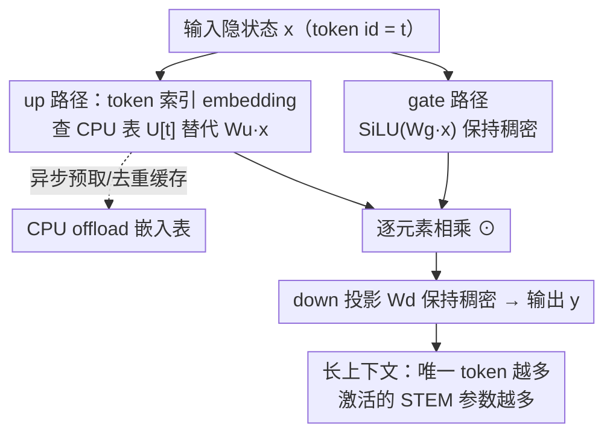

# STEM: Scaling Transformers with Embedding Modules

**会议**: ICLR 2026  
**OpenReview**: [https://openreview.net/forum?id=gufRimweSQ](https://openreview.net/forum?id=gufRimweSQ)  
**代码**: 无  
**领域**: LLM效率  
**关键词**: 静态稀疏, token 索引, FFN, 参数记忆, CPU offload

## 一句话总结
STEM 把 SwiGLU FFN 里的 up-projection 矩阵换成一张「按 token id 查表」的 layer-local embedding 表，用静态稀疏替代 MoE 的动态路由，从而在去掉约三分之一 FFN 参数、降低每 token FLOPs 的同时，训练更稳、知识容量更大，在 350M / 1B 规模上把下游平均分提升约 3–4%。

## 研究背景与动机
**领域现状**：要在不成比例增加单 token 算力的前提下吃到「参数越多越好」的 scaling law 红利，主流手段是稀疏计算，尤其是 Mixture-of-Experts（MoE）——每个 token 只激活一小撮专家，参数总量上去了但激活 FLOPs 基本不变。近期工作进一步主张「更细粒度」的稀疏（大量 micro-expert），认为它表达力更强、知识存储更多、效率指标更好。

**现有痛点**：细粒度稀疏在优化和系统两侧都有硬伤。优化侧：路由高度不均匀，很多专家长期欠训练，容易触发 loss spike、训练不稳；为了缓解要加 load-balancing 辅助损失，但这个辅助目标调不好又会干扰主目标。系统侧：专家越多，all-to-all 消息越多、单条消息越小，带宽利用率掉、通信开销涨；子网络太小还会让稠密矩阵 kernel 占用率不足、端到端反而变慢。

**核心矛盾**：要同时拿到（a）稳定优化、（b）专家被广泛利用（每个 micro-expert 都学到有用表征）、（c）专家检索延迟与通信开销可忽略——而动态路由的本质让这三者很难兼得，因为路由既带来不确定性（不稳、不均），又带来运行时调度和跨设备通信。

**切入角度**：作者把目光转向**静态稀疏**——计算路径在编译期就定死（无运行时路由延迟），从而可以预取、可以 CPU offload、不需要跨节点通信。其中一种已被验证有效的静态做法是「token-indexed 路由」（按 token id 固定映射到专家，如 Hash Layer）。但天真地按 token 选专家缺乏上下文自适应性，会削弱表达力、即使参数更多质量也可能变差，所以**「把稀疏化加在 FFN 的哪个分量上」是成败关键**。

**核心 idea**：只把 SwiGLU FFN 的 **up-projection** 换成「按 token id 从 layer-local 表里查出的向量」，而 gate 投影和 down 投影保持稠密、跨 token 共享——用静态 token 索引替代动态路由，把容量与「每 token FLOPs」和「跨设备通信」彻底解耦。

## 方法详解

### 整体框架
回顾标准 SwiGLU FFN：$y_\ell = W^d_\ell\big(\mathrm{SiLU}(W^g_\ell x_\ell)\odot(W^u_\ell x_\ell)\big)$，其中 gate、up、down 三个投影都是稠密矩阵，每个 token 都要把它们全部乘一遍。STEM 的改动只有一处——把 up-projection 的输出 $W^u_\ell x_\ell$ 换成一张 embedding 表 $U_\ell\in\mathbb{R}^{V\times d_{ff}}$ 中、当前 token id $t$ 对应的那一行 $U_\ell[t]$：

$$y_\ell = W^d_\ell\Big(\mathrm{SiLU}(W^g_\ell x_\ell)\odot U_\ell[t]\Big).$$

这一个替换牵动三条收益线：（1）up-projection 的矩阵乘没了，每 token FLOPs 和参数访问都降；（2）embedding 表与 matmul 权重物理分离，可以整张丢到 CPU 内存、再按 batch 里出现的 token **异步预取**回 GPU，省下约三分之一 FFN 显存；（3）查表是静态的、无路由 logic，因此没有 MoE 的 all-to-all 通信。默认配置是**只替换三分之一的 FFN 层**（均匀间隔交错放置），其余层保持稠密。

### 关键设计

**1. 只替换 up-projection 的静态 token 索引模块**

这是 STEM 的全部技术核心，直接针对「细粒度稀疏不稳又难调」的痛点。作者没有引入任何路由器和辅助损失，而是把 up-projection 这个稠密矩阵换成「按 token id 直接查行」的 layer-local embedding 表 $U_\ell[t]\in\mathbb{R}^{d_{ff}}$，gate 和 down 原封不动。为什么必须是 up 而不是 gate？消融给出了清晰解释：在 SwiGLU 里，gate $\sigma(W^g x)$ 需要依赖当前隐状态 $x$ 来对 $\phi(W^u x)$ 做**上下文相关**的调制；如果把 gate 换成 token 索引向量 $\sigma(e_t)$，gate 就几乎与输入无关了，非线性的选择作用被学出来的 embedding「吸收」掉，模型反而比稠密 baseline 还差。把 STEM 加在 up 上，则保留了 gate 路径完整的上下文信息——这正是「静态稀疏 + 上下文自适应」能共存的关键点。因为映射是静态的，编译期就知道每个 token 取哪一行，于是天然支持预取、offload，且无路由延迟、无 load-balancing 不稳。

**2. CPU offload + 异步预取 + 去重缓存的系统设计**

光替换还不够，作者把「embedding 表和 matmul 权重物理解耦」这件事做成了系统收益。这些表是 token 索引、layer-local 的，不像 MoE 专家子网那样必须常驻 GPU，因此可以整张放在 CPU 内存，按需把当前 batch 用到的行预取回 GPU——省出来的显存大约是 FFN 参数的三分之一。预取成本还能进一步压：对一个 batch 内重复出现的 token **去重**（只取唯一 token 的行），再用省下的显存把高频 token 的 embedding 缓存住。关键的 scaling 性质是：模型 embedding size 增大时，计算成本是二次增长，而预取成本只线性增长——所以模型越大，CPU-offload 版 STEM 越划算。对比 MoE：MoE 的参数流量随 batch size 和路由多样性膨胀（大 batch 会点亮更多专家、稀疏红利迅速被侵蚀），而 STEM 的参数流量主要随「见过的唯一 token 数」增长，可预测得多。

**3. 大角度展开的 embedding 几何带来更大知识容量**

这是 STEM「为什么不只更快、还更准」的解释。沿用「FFN 是 key-value 记忆」的视角：up-projection 的每一行是 key、down-projection 的每一列是 value，gate 提供上下文相关的乘性调制做选择性读取；预激活 $h=\phi(W^u x)$ 相当于在记忆槽上做一次软寻址。STEM 用「token 索引的地址向量」直接替代了学出来的仿射寻址。作者测量这些地址向量两两之间的余弦相似度，发现分布高度集中在 0 附近（P95 的 $|\cos|$ 仅约 0.026–0.033），即向量之间近似两两正交、**角度展开很大**。大角度展开降低了记忆槽之间的 cross-talk / 干扰，等价于在固定宽度下提供了更多可区分的存储「slot」，因此在知识密集型任务上提升尤其明显。这个几何特性还顺带解释了训练为何稳定——表征干扰小，收敛更顺。

**4. 上下文长度自适应的测试期容量扩展**

STEM 用的是 token 索引、细粒度稀疏，所以一次前向里**被触及的不同参数量随窗口内唯一 token 数增长**。除了注意力里共享的 Q/K/V/O 和 gate/down 投影，STEM 模块每个 token id、每层只取一个向量；重复 token 复用同一向量，新 token 才激活新向量。形式化地，单条序列激活的 STEM 专属参数为

$$\mathrm{Params}^{\mathrm{STEM}}_{\mathrm{act}}(L)=|S|\,d_{ff}\,L_{\mathrm{uniq}},$$

其中 $S$ 是放了 STEM 的层集合、$L_{\mathrm{uniq}}$ 是序列里唯一 token 数。自然文本里 $L_{\mathrm{uniq}}$ 随长度次线性增长（Heaps 定律），于是上下文越长、被激活的参数越多，却不增加每 token FLOPs——稠密的 gate/down 保证上下文混合，STEM 路径以极低开销补充容量。这带来了「测试期容量扩展」且延迟可预测：激活参数随上下文持续增长、不像 MoE 那样很快饱和，因此长上下文任务收益随长度增强（NIAH 上对稠密的领先从 8.4% 扩大到 13%）。

### 损失函数 / 训练策略
STEM 不需要任何 load-balancing 辅助损失（这正是相对 MoE 的简化点），直接用标准语言建模目标 + AdamW + cosine schedule 训练。训练时 STEM embedding 的梯度需传回 CPU 做 optimizer 更新，所以训练阶段通信量大致翻倍（相对推理）。作者还给了一个混合变体 **STEM†**：保留 up-projection、再用 token 向量做加性调制 $W^u_\ell x_\ell + U_\ell[t]$，但实验显示它多花参数和 FLOPs 却不带来增益，反衬出「纯替换 up」才是更优设计。规模上做了 350M（100B tokens）和 1B（1T tokens）两档，1B 还含 midtrain（100B）与 context-extend（20B，32k 长度、跨文档 mask）三阶段。

## 实验关键数据

### 主实验
控制训练算力（激活 FLOPs）和训练 token 数，与稠密 baseline、以及参数总量对齐的 Hash-MoE 对比。STEM 默认替换三分之一 FFN 层（STEM-1/3）。

| 规模 / 设置 | 模型 | 总参 (B) | 激活参 (B) | 下游平均 | GFLOPs | 训练 ROI |
|------|------|------|------|------|------|------|
| 350M 预训练 | Baseline (稠密) | 0.37 | 0.37 | 49.72 | 0.74 | 1× |
| 350M 预训练 | Hash-MoE (top-1/16) | 1.22 | 0.37 | 50.58 | 0.74 | 1.02× |
| 350M 预训练 | **STEM-1/3** | 1.14 | 0.35 | **50.90** | 0.70 | **1.08×** |
| 350M 预训练 | STEM-1/2 | 1.85 | 0.34 | 54.20 | 0.67 | 1.20× |
| 350M 预训练 | STEM-full | 3.25 | 0.30 | **53.43** | 0.60 | **1.33×** |
| 1B 预训练 | Baseline | 1.50 | 1.50 | 55.82 | 3.00 | 1× |
| 1B 预训练 | **STEM-1/3** | 6.75 | 1.41 | **56.63** | 2.83 | **1.08×** |

1B mid-training 后，STEM 在推理/知识检索上的优势更突出：

| 模型 (1B mid) | 下游平均 | GSM8K | MMLU |
|------|------|------|------|
| Baseline | 57.50 | 44.2 | 29.92 |
| **STEM** | **58.49** | **46.4** | **32.38** |

知识密集型任务收益最大：350M 上 ARC-Challenge 30.55→32.68、OpenBookQA 等大幅提升；1B 上 OpenBookQA 39.84→45.90（约 +6 个点）。

### 消融实验

| 配置 | 350M 下游平均 | 说明 |
|------|------|------|
| STEM-1/3（替换 up） | 50.90 | 默认，最优 |
| STEM (gate-proj) | 49.10 | 改替 gate，反而低于稠密 baseline (49.72) |
| STEM† (up + 加性调制) | 50.60 | 多参多 FLOPs 却无增益 |
| STEM-1/3 → 1/2 → full | 50.90 → 54.20 → 53.43 | 替换比例越高平均分越高，1/2 后收益放缓 |

### 关键发现
- **稀疏化位置是命门**：替 up 一致涨点，替 gate 直接跌破稠密 baseline——因为替 gate 会让 gate 变得与输入无关、失去上下文选择能力。
- **替换比例 vs ROI**：从 1/3 到 1/2 平均分大涨，之后放缓；但替换越多 FLOPs 越省，所以 ROI 仍单调上升（1.08×→1.20×→1.33×）。
- **训练稳定性**：与 Hash-MoE 相比，STEM 训练 loss 没有任何 spike；且训练 token 增多时 STEM 的 loss 曲线会反超另外两种架构，说明容量更大。
- **长上下文**：序列越长，STEM 激活的唯一参数越多，NIAH 上对稠密的领先随长度从 8.4% 扩到 13%。

## 亮点与洞察
- **「换一个矩阵」就把动态稀疏的麻烦全绕开**：不引入路由器、不加辅助损失，仅把 up-projection 换成查表，就同时拿到稳定训练、可 offload、零路由通信——简单到反直觉，却是最大的工程价值。
- **几何视角的解释很扎实**：用「FFN=key-value 记忆」框架把「为什么知识任务涨得多」落到「embedding 大角度展开 → 干扰小 → 有效存储槽更多」，有定量的余弦相似度证据支撑，不是空谈。
- **静态稀疏自带长上下文容量扩展**：唯一 token 随长度次线性增长，于是激活参数随上下文增长而不增 FLOPs，这个「测试期容量扩展」是动态 MoE 给不了的性质，可迁移到 RAG / 长 CoT 场景。
- **可解释 + 可编辑**：每个 token 在每层有独立向量，把 `e_Spain ← e_Germany` 一换，模型对「The capital of Spain is」的 top-k 预测就贴近 Germany 的分布，提供了透明、可逆的事实知识编辑入口。

## 局限与展望
- 作者自己承认：纯 STEM（只替 up）因架构偏置，会损失一部分上下文学习能力，所以才设计了 STEM† 混合变体——但 STEM† 又被证明性价比不划算，说明「补回上下文能力」还没找到免费午餐。
- 评测规模偏小（350M / 1B、最多 1T tokens），是否在更大规模、更强 MoE 基线下仍保持优势未知；对比对象主要是稠密 baseline 和 Hash-MoE，没有和最新的细粒度可学习路由 MoE 正面比质量。
- embedding 表大小是 $V\times d_{ff}$，词表很大时 CPU 内存与预取带宽成为新瓶颈，去重/缓存的收益依赖 token 分布的偏斜程度，对均匀分布数据可能打折。
- 改进方向：把静态 token 索引和少量动态成分结合（比如对低频 token 走稠密、高频走查表），或探索子词以上粒度的索引以增强上下文自适应性。

## 相关工作与启发
- **vs MoE（Switch / fine-grained MoE）**：MoE 用可学习路由动态选专家，带来不稳、load-balance、all-to-all 通信三大开销，且参数流量随 batch 膨胀；STEM 用静态 token 索引彻底去掉路由，参数流量只随唯一 token 数增长，训练更稳、可 CPU offload。代价是上下文自适应性弱一些。
- **vs Hash Layer / token-indexed MoE**：两者都用 token id 固定映射、无路由损失，但 Hash Layer 是把整块 FFN 专家按 hash 选；STEM 只替换 up-projection 这一个分量、保留 gate/down 的上下文路径，因此既稳（无 loss spike）又不丢上下文，平均分和稳定性都优于 Hash-MoE。
- **vs FFN 即 key-value memory（Geva et al. / ROME）**：这些工作把 FFN 解读为可寻址记忆并据此做知识编辑；STEM 把「地址」显式做成 token 索引向量，让记忆寻址从「学出来的隐式仿射」变成「显式可查、可换」，天然继承了可解释性和可编辑性。

## 评分
- 新颖性: ⭐⭐⭐⭐ 「只替 up-projection 的静态 token 索引」简单但切中要害，几何解释和长上下文容量扩展是有新意的观察。
- 实验充分度: ⭐⭐⭐⭐ 两档规模 + 预训练/midtrain/长上下文三阶段 + 位置/比例/几何多角度消融，但规模偏小、缺与强 MoE 的质量正面对比。
- 写作质量: ⭐⭐⭐⭐ 动机—方法—分析—实验链条清晰，公式和几何论证到位。
- 价值: ⭐⭐⭐⭐ 给「细粒度稀疏」提供了一条更易训练、易部署的静态替代路线，工程落地友好。

<!-- RELATED:START -->

## 相关论文

- [\[ICLR 2026\] Extending the Context of Pretrained LLMs by Dropping Their Positional Embedding](extending_the_context_of_pretrained_llms_by_dropping_their_positional_embedding.md)
- [\[ICLR 2026\] MeSH: Memory-as-State-Highways for Recursive Transformers](mesh_memory-as-state-highways_for_recursive_transformers.md)
- [\[ICLR 2026\] Scaling Attention via Feature Sparsity](scaling_attention_via_feature_sparsity.md)
- [\[ICLR 2026\] Scaling Up, Speeding Up: A Benchmark of Speculative Decoding for Efficient LLM Test-Time Scaling](scaling_up_speeding_up_a_benchmark_of_speculative_decoding_for_efficient_llm_tes.md)
- [\[ICLR 2026\] Reconstructing KV Caches with Cross-Layer Fusion for Enhanced Transformers](reconstructing_kv_caches_with_cross-layer_fusion_for_enhanced_transformers.md)

<!-- RELATED:END -->
