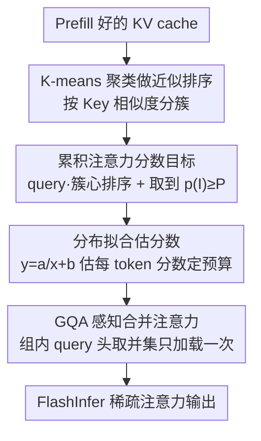

# Tactic: Adaptive Sparse Attention with Clustering and Distribution Fitting for Long-Context LLMs

**会议**: ICLR 2026  
**OpenReview**: [https://openreview.net/forum?id=tJod11fK1A](https://openreview.net/forum?id=tJod11fK1A)  
**代码**: 无  
**领域**: LLM效率  
**关键词**: 稀疏注意力, 长上下文, KV cache, 累积注意力分数, K-means聚类

## 一句话总结
Tactic 不再给稀疏注意力定一个固定 token 预算，而是定一个"累积注意力分数"目标 $P$，按注意力分数从高到低取 token 直到累积分数达到 $P$ 为止；为了能在解码时高效逼近这个选择，它用 K-means 聚类做近似排序、用分布拟合估计每个 token 的分数，最终在保持接近全注意力精度的同时实现最高 7.29× 的解码注意力加速、1.58× 端到端加速。

## 研究背景与动机
**领域现状**：长上下文 LLM 推理的最大瓶颈是 KV cache——上下文越长，每解码一个 token 都要重新加载越来越大的 KV cache，这部分能占自回归解码总延迟的 50% 以上。为缓解这个问题，主流的稀疏注意力方法（Quest、StreamingLLM、H2O、PyramidKV、Ada-KV 等）会在一个**固定 token 预算**下，只挑选一小部分 Key/Value 来近似全注意力。

**现有痛点**：固定预算的根本问题是注意力的稀疏程度并不是恒定的。作者通过实测（Fig. 2）展示了三个层面的剧烈波动：① **注意力头之间**——有的头（retrieval head）分数分布很均匀、要看很多 token，有的头（streaming head）被几个高分 token 主导、只需极少 token；② **层之间**——比如 layer 0 要比深层多得多的 token 才能达到相同累积分数；③ **同一个 query 之间**——例如生成 "The Answer is..." 时，"Answer" 几乎只看局部、而 "is" 需要广阔上下文。固定预算在 streaming head 上浪费 token、在 retrieval head 上又精度不够。

**核心矛盾**：那些试图改进的方法（PyramidKV、Ada-KV）虽然给不同层/头分配不同预算，但它们依赖校准数据或预设规则做**静态分配**，无法适应随 query 和上下文实时变化的稀疏度；而 MagicPig 虽然是动态选择，却**不提供对近似误差的理论保证**。换句话说，"预算"这个度量本身就和"逼近全注意力的质量"不直接挂钩。

**本文目标**：找到一个既能自适应稀疏度变化、又有误差保证、还无需校准的 token 选择准则，并让它在解码时能被高效计算。

**切入角度**：作者观察到一个关键事实（Fig. 4）——Value 向量的范数 $\|v_i\|$ 在不同 token/层/头之间高度集中、几乎一致。这意味着只要选中的 token 的**累积注意力分数** $p(I)=\sum_{i\in I}s_i$ 达到某阈值，稀疏注意力和全注意力的输出差距就有一个紧致上界 $\epsilon(I)\le 2(1-p(I))\max_i\|v_i\|$。于是用"累积分数"代替"token 数量"作为目标，天然自适应又带误差保证。

**核心 idea**：用"累积注意力分数达标 $p(I)\ge P$"替代"固定 token 预算"，并用聚类 + 分布拟合在解码时高效逼近这个最小 token 集合。

## 方法详解

### 整体框架
Tactic 是一个**免训练、免校准的后处理**稀疏注意力机制，输入是已经 prefill 好的 KV cache，输出是每步解码的注意力结果。它把"选哪些 token"这件事拆成三个阶段：prefill 阶段一次性把所有 Key 向量按相似度聚成簇；解码阶段先用当前 query 和簇心的点积给簇排序、把 token 近似排成有序列表，再用一条轻量曲线拟合排序后的分数分布、累加直到达到目标累积分数 $P$ 来确定到底取多少个 token；最后做 GQA 感知的合并，把被选中的 token 喂给 FlashInfer 做真正的注意力计算。整个过程只需加载簇心加上约 2.5% 的采样 token，因此开销极低。

### 关键设计

**1. 累积注意力分数目标：把"选多少"变成"选到够"**

这是 Tactic 的灵魂，直接针对固定预算无法自适应稀疏度的痛点。作者不再问"该取几个 token"，而是定义累积注意力分数

$$p(I)=\sum_{i\in I}s_i=\frac{\sum_{i\in I}\exp(qk_i^\top/\sqrt{d})}{\sum_{i=1}^{n}\exp(qk_i^\top/\sqrt{d})}$$

然后从分数最高的 token 开始往下取，直到 $p(I)\ge P$（$P$ 通常接近 1.0，如 0.9）。它的两大好处都很实在：其一是**自适应**——稀疏度低的头/层/query 自然需要更多 token 才能凑够 $P$，稀疏度高的只要几个，完全不用校准数据；其二是**有理论保证**——因为 Value 范数高度集中（Fig. 4），注意力误差被卡在 $\epsilon(I)\le 2(1-p(I))\max_i\|v_i\|$，只要 $P$ 接近 1，这个上界就很紧。相比之下 Quest 这类固定预算方法的误差 $\epsilon(I)$ 方差很大（Fig. 3），因为它对不同头/层一视同仁地取相同数量。

**2. K-means 聚类做近似排序：按 Key 相似度而非位置分组**

要按分数降序取 token，就得先排序；但对全部 token 逐个算分数再排序代价太高，所以得分组近似。先前工作（Quest）按**位置连续性**分组，假设相邻 token 注意力模式相似。Tactic 指出这个假设不成立——注意力靠的是 Query-Key 交互而非 token 位置，作者用簇内平方和 WCSS 实测（Tab. 1）发现聚类分组在各种序列长度下都比连续分组更紧凑（如 16384 长度：173 vs 195 越小越好，原文为准）。于是 Tactic 在 prefill 阶段对 Key 向量做一次性 K-means 聚类（平均簇大小 16），解码时用当前 query 和各簇心做点积给簇排序、展开成部分有序的 token 列表。作者特意选点积而非欧氏距离做相似度，因为点积直接对应注意力分数、更准。现代注意力 kernel 本就能高效处理非连续 KV 访问，所以放弃位置连续性没有额外代价。

**3. 分布拟合估计分数：用一条曲线追踪累积和并自我纠错**

光有近似排序还不够——要实时追踪累积分数何时达标，就得知道每个 token 的具体分数，但簇心点积因 softmax 非线性并不能准确反映单 token 分数。Tactic 的洞察是：部分排序后的注意力分数分布在不同头/层/上下文下都呈现一致的长尾形态（Fig. 6），少数 token 很高然后平滑衰减，整体贴合 $y=a/x+b$。于是它用这条轻量逆函数拟合 $\exp(QK^\top/\sqrt{d})$ 随排序位置 $x$ 的分布：只取曲线中段两小段（如 10% 和 60% 处）的平均值来解出参数 $a,b$；而最前面 1–2% 的 token 是离群点且分数极高、估错会严重影响累积分数，所以对它们**直接精确计算**。更妙的是聚类和分布拟合构成一个**自我纠错的反馈回环**：如果初始聚类不理想、分数衰减就更平缓，拟合过程会检测到这种"变平"并自动增大 token 预算；即便曲线切点选得不完美，由于选择是按优先级进行的，估计误差主要落在低价值的尾部、高价值 token 几乎不受影响。这让整个方法对超参和初始化都很鲁棒。

**4. GQA 感知的并集稀疏注意力：把多头的加载合并成一次**

现代模型用 GQA 让多个 query 头共享一个 KV 头。已有方法按"每个头"独立选 token、各自读 KV cache，造成重复加载。Tactic 对同组的所有 query 头**取被选 token 的并集**、只加载一次，再把每个请求拆成子请求（每个子请求处理一个 KV 头及其对应 query 头，序列长度由该 KV 头选中的 token 决定），借助 FlashInfer 的请求级负载均衡来处理头间不平衡。这一步纯粹是工程上的访存优化，但效果显著——实测取并集带来最高 1.65× 的注意力加速。

### 损失函数 / 训练策略
Tactic 是**完全免训练、免校准**的推理期方法，没有任何损失函数或微调。关键超参：平均簇大小取 16，K-means 用 10 次迭代、单次随机初始化（不用 K-Means++ 或多次初始化，实测对质量提升甚微却增加开销）；对新生成的 token 做全注意力，每隔固定步数（如 2048 步）更新一次聚类，以平衡精度与效率。

## 实验关键数据

### 主实验
在 RULER 基准上对比 Llama-3.1-8B-Instruct（取选中 token 数对齐各 baseline 预算，单位为各长度准确率，越高越好）：

| 方法 | 配置 | 16K | 32K | 64K | 96K | Avg. |
|------|------|-----|-----|-----|-----|------|
| Full（全注意力） | — | 91.3 | 86.0 | 85.2 | 85.0 | 86.8 |
| **Tactic** | 90% | 90.3 | 84.9 | 82.8 | 80.5 | **84.6** |
| Quest | 90% | 85.8 | 81.9 | 79.8 | 70.5 | 79.5 |
| MagicPig | 90% | 79.8 | 76.9 | 71.3 | 70.7 | 74.7 |
| PyramidKV | 90% | 73.1 | 76.2 | 74.2 | 68.6 | 73.0 |
| Ada-SnapKV | 90% | 72.7 | 76.4 | 74.3 | 68.7 | 73.0 |
| **Tactic** | 75% | 90.9 | 85.5 | 83.4 | 78.9 | **84.7** |
| MagicPig | 75% | 78.6 | 76.8 | 70.4 | 70.1 | 74.0 |
| Quest | 75% | 70.0 | 71.5 | 69.7 | 65.7 | 69.2 |

在 90% 阈值下 Tactic 平均 84.6，已经非常接近全注意力的 86.8，而其余 baseline 普遍掉到 73–80。在输出对齐方面，PG19 上 Tactic 相对全注意力的 KL 散度（Fig. 7）在所有 baseline 中最低；作为投机解码的 draft model，其 token 接受率（Fig. 8）超过 95%（正文亦有 ">90%" 表述，以原文为准），远超其他方法。

### 消融实验

| 配置 | 现象 | 说明 |
|------|------|------|
| Full Tactic | 高精度 + 选 token 少 | 完整模型 |
| Tactic-topK | 精度明显下降 | 保留聚类但把预算**均匀**分给各头 → 验证累积分数自适应的价值 |
| Position-cluster | 精度相当但**选 token 显著更多** | 用位置连续分组替代 K-means → 验证相似度聚类的效率价值 |
| w/o Union（GQA 不取并集） | 注意力慢最高 1.65× | 验证 GQA 并集的访存收益 |

token 数与达标率（Tab. 3，Llama-3.1-8B）显示 Tactic 选的 token 数和"聚类最优"oracle 很接近，说明分布拟合估计准确：如 90% 阈值下聚类最优需 1723 个、Tactic 选 1975 个、实际达成分数 91%、成功率 86%。

### 关键发现
- **累积分数自适应是精度的主来源**：Tactic-topK（去掉自适应、改均匀分配）精度明显下降，说明真正起作用的不是聚类本身，而是"按累积分数动态决定预算"。
- **相似度聚类换来的是效率而非精度**：Position-cluster 精度相当，但要选明显更多 token——说明 K-means 的价值在于用更少 token 达到同样近似质量。
- **逆函数 $y=a/x+b$ 是最省 token 的拟合形式**：线性/指数/二次等非常数函数精度相当，但逆函数始终选最少 token。
- **开销可控**：prefill 阶段聚类时间始终低于 prefill 总时间的 7%（直到 256K），解码阶段排序与拟合开销都很低，最终解码注意力最高 7.29× 加速、端到端最高 1.58×。

## 亮点与洞察
- **把"选多少"换成"选到够"**：用累积注意力分数代替固定预算，是一个度量层面的范式转换——它让 token 数成为结果而非输入，天然适配稀疏度波动，还附带一个干净的误差上界，比一堆启发式预算分配优雅得多。
- **Value 范数集中这个观察很关键**：正是因为 $\|v_i\|$ 高度一致，累积分数才能直接换算成输出误差界；这个看似不起眼的实测现象（Fig. 4）撑起了整个方法的理论保证。
- **聚类与拟合互为纠错的设计很巧**：两个近似步骤不是简单串联，而是一个会自动加预算、把误差挤到低价值尾部的反馈回环——这种"用粗糙近似 + 优先级保护高价值项"的思路可迁移到其他需要 top-k 但又要控误差的场景（如检索、MoE 路由）。
- **GQA 取并集的工程优化即插即用**：与算法解耦，任何按头选 token 的稀疏注意力方法都能借这招减少重复加载。

## 局限与展望
- **聚类是 prefill 期的二次成本**：聚类时间随序列长度二次增长，虽然占比稳定在 7% 以内，但在超长上下文下绝对耗时仍不小；解码期还需每隔固定步数重新聚类。
- **依赖分布假设**：方法建立在"排序后分数贴合 $y=a/x+b$ 长尾"和"Value 范数高度一致"两个经验观察上，在分布显著偏离这两个假设的模型/任务上误差界与精度可能退化。
- **理论保证的前提**：$\epsilon(I)\le 2(1-p(I))\max_i\|v_i\|$ 中 $\max_i\|v_i\|$ 若存在个别大范数离群 Value，上界会变松。
- **改进方向**：聚类的增量更新（避免周期性全量重聚类）、把分布拟合扩展到更自适应的函数族、与量化/页式 KV 管理结合进一步压访存。

## 相关工作与启发
- **vs Quest**: Quest 按位置分页、固定预算、对所有头一视同仁；Tactic 按 Key 相似度聚类、用累积分数动态定预算。区别在于 Quest 的近似误差方差大（Fig. 3）且无法适应 query 级稀疏波动，Tactic 在 RULER 90% 配置上把平均分从 79.5 拉到 84.6。
- **vs PyramidKV / Ada-KV**: 它们也想给不同层/头不同预算，但靠校准数据/预设规则**静态**分配，无法适应运行时随 query 变化的稀疏度；Tactic 免校准、运行时自适应。
- **vs MagicPig**: MagicPig 用 LSH 采样做动态选择，方向相近，但不提供对近似误差 $\epsilon(I)$ 的保证；Tactic 通过累积分数 + Value 范数集中性给出显式误差上界，KL 散度与接受率都更优。

## 评分
- 新颖性: ⭐⭐⭐⭐⭐ 把固定预算换成有误差保证的累积分数目标，是稀疏注意力度量层面的范式转换
- 实验充分度: ⭐⭐⭐⭐ 覆盖 PG19/LongBench/RULER 多模型多长度，含 oracle 对照与多组消融，但代码未开源
- 写作质量: ⭐⭐⭐⭐⭐ 动机层层推进、理论与观察结合紧密、图表支撑充分
- 价值: ⭐⭐⭐⭐⭐ 免训练免校准、即插即用、端到端 1.58× 加速，对精度敏感的长上下文服务很实用

<!-- RELATED:START -->

## 相关论文

- [\[ICLR 2026\] Sparse Attention Adaptation for Long Reasoning](sparse_attention_adaptation_for_long_reasoning.md)
- [\[ICLR 2026\] Retrospective Sparse Attention for Efficient Long-Context Generation](retrospective_sparse_attention_for_efficient_long-context_generation.md)
- [\[ICLR 2026\] vAttention: Verified Sparse Attention via Sampling](vattention_verified_sparse_attention_via_sampling.md)
- [\[ICLR 2026\] Understanding and Improving Length Generalization in Hierarchical Sparse Attention Models](understanding_and_improving_length_generalization_in_hierarchical_sparse_attenti.md)
- [\[ICLR 2026\] Let's (not) just put things in Context: Test-time Training for Long-context LLMs](lets_not_just_put_things_in_context_test-time_training_for_long-context_llms.md)

<!-- RELATED:END -->
