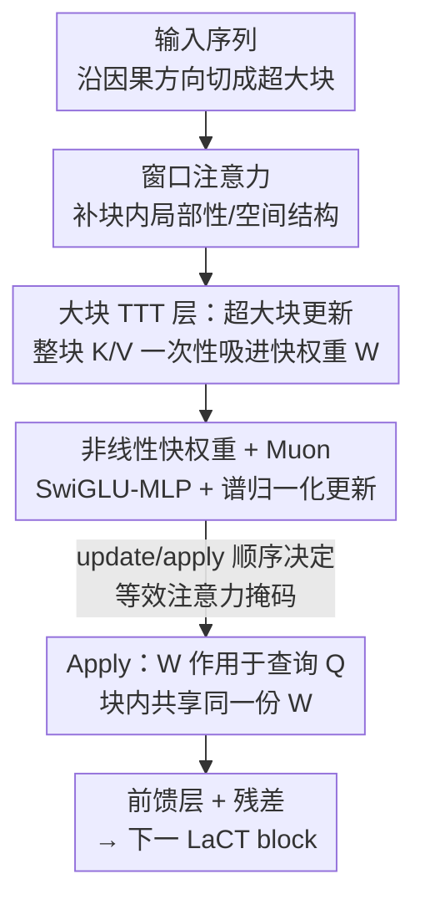

# Test-Time Training Done Right

**会议**: ICLR 2026  
**OpenReview**: [https://openreview.net/forum?id=Tb9qAxT3xv](https://openreview.net/forum?id=Tb9qAxT3xv)  
**代码**: 已开源（项目页 https://tianyuanzhang.com/projects/ttt-done-right/ ）  
**领域**: LLM效率 / 长上下文建模 / 测试时训练  
**关键词**: Test-Time Training, 大块更新, 快权重, 长上下文, 线性复杂度

## 一句话总结
本文指出现有 Test-Time Training（TTT）之所以在长序列上跑不动，是因为它们坚持用极小的在线 mini-batch（每 16~64 个 token 更新一次快权重），导致现代 GPU 利用率常年低于 5%；作者反其道而行，提出 **LaCT（Large-Chunk Test-Time Training）**，把更新粒度放大到 2K~1M token 的超大块，配合窗口注意力补足块内局部性，用几十行纯 PyTorch 就把 GPU 利用率拉到 70%，并在新视角合成、语言建模、自回归视频扩散三类模态上验证了可扩展到 14B 参数、56K~1M token 上下文。

## 研究背景与动机
**领域现状**：softmax 注意力虽是各类序列建模的事实标准，但其计算量随序列长度二次增长，长上下文场景代价高昂。Test-Time Training 是近来兴起的次二次方案——它把 RNN 的循环状态扩展成一个在推理时被在线自监督更新的小子网络，这部分被更新的参数叫"快权重"（fast weight），用来把过往 token 的 KV 关联压进一个固定大小的神经记忆里。

**现有痛点**：尽管社区在快权重的在线目标、优化器、结构上做了大量探索，TTT 始终没能在长上下文上展现潜力。根因是 TTT 层的硬件利用率极低（现代 GPU 上常低于 5% 峰值 FLOPS）。这又源于一个被默认为"对 in-context learning 更有效"的做法——用极小的 mini-batch，每个 token 或每 16~64 个 token 就更新一次快权重。小批量意味着差的并行度与低计算密度，尤其在快权重是大型非线性网络时，几乎不可能达到非平凡（>10%）的 FLOPs 利用率，往往还得写易错的定制 CUDA kernel 才能勉强提速。

**核心矛盾**：小 mini-batch 还隐含了一个假设——数据存在细粒度的块内因果依赖，因此它只适合一维有序序列，对集合、图像/视频这类 N 维网格数据天生不友好。于是"想要表达力强的非线性大状态"与"想要高硬件利用率"之间形成了死结：状态越大、越非线性，越没法塞进 SRAM 让各 SM 独立演化，kernel 越难写、利用率越低。

**本文目标**：在不写定制 kernel 的前提下，同时拿到 (1) 高 GPU 利用率、(2) 可放大的非线性状态容量、(3) 对 N 维数据的通用性。

**切入角度**：作者注意到计算-访存比 $r = \frac{2h^2 b}{2h^2 + 4hb} \le \min(h/2, b)$（$h$ 是快权重维度，$b$ 是块大小）——只要块大小 $b$ 太小，操作就被访存带宽卡死、算力用不上。既然小块是病根，那就把块开到极大。

**核心 idea**：用极大的更新块（2K~1M token）取代极小的 mini-batch，把"每隔几个 token 更新一次"变成"每隔成千上万个 token 才更新一次"，从而把矩阵乘做成真正的大矩阵乘，纯 PyTorch 即可把利用率拉满；块内丢失的局部顺序，则交给一层窗口注意力补回来。

## 方法详解

### 整体框架
LaCT 把序列沿因果方向（如时间）切成若干**超大块**，每个 LaCT block 由三类层堆叠而成：**窗口注意力层**负责块内的局部依赖与空间结构，**大块 TTT 层**负责把历史上下文压进快权重 $W$ 并把最新的 $W$ 应用到当前查询，**前馈层**做通道混合。三者都带残差连接。TTT 层内部是一对解耦的操作：先对整块的 $\{k_i\}, \{v_i\}$ 算一次"update"把上下文吸进 $W$，再用"apply"让块内所有 query 共享这份更新后的 $W$ 算输出。信息流有两条——实线沿模型深度流动，虚线沿时间把快权重 $W$ 从一块传到下一块。

### 关键设计

**1. 超大块更新：把 mini-batch 从 16 token 开到 1M，让矩阵乘吃满算力**

这是全文的命门。传统 TTT 每 16~64 token 更新一次快权重，对应公式 (1) 的逐 token 梯度下降；LaCT 改成对整块求和损失的一次梯度，更新公式变为 $g = \nabla_W \sum_{i=1}^{b} \eta_i\, L(f_W(k_i), v_i)$，再 $W \leftarrow \text{weight-update}(W, g)$，块大小 $b$ 从 2048 一路开到 1M（不同任务不同）。块越大，单次 update 里的矩阵乘 $h\times h$ 快权重乘以 $b\times h$ 输入就越接近大矩阵乘，计算-访存比 $r$ 随 $b$ 增大趋向上界，从根本上摆脱访存瓶颈。效果是：在 A100 上 GPU 利用率从 <5% 提到 70%，且全程只需几十行纯 PyTorch、无需定制 kernel。更关键的副产物是状态容量可放大——LaCT 的"状态/参数"比 $\ge 40\%$，比此前方法的 0.1%~5% 高一个量级，因为大块更新摊薄了昂贵的 update 成本，省下的预算可以堆更大的非线性快权重。

**2. 非线性快权重 + Muon 优化器：让大状态既稳又准**

小块时代不敢用大非线性状态，是因为它塞不进 SRAM；大块解放了这个约束，于是作者把快权重做成无 bias 的 SwiGLU-MLP（三个矩阵 $W_1, W_2, W_3$）：$f_W(x) = W_2[\,\text{SiLU}(W_1 x) \circ (W_3 x)\,]$，损失用简单的点积 $L(f_W(k_i), v_i) = -f_W(k_i)^\top v_i$。但反复累积梯度会让快权重幅值爆炸或记忆衰减，于是引入两道处理：一是 **L2 快权重归一化**，$\text{weight-update}(W, g) = \text{L2-Normalize}(W - g)$，作者把它类比成"把序列维当作虚拟深度"后的 post-LayerNorm，用来约束残差路径上的激活尺度，从而省掉了以往方法都要的显式 weight-decay 项；二是 **Muon 更新规则**，$\text{weight-update}(W, g) = \text{L2-Normalize}(W - \text{Muon}(g))$，其中 Muon 用 Newton-Schulz 迭代近似把梯度的谱归一化为 $\text{Muon}(g) \simeq UV^\top$（$g = USV^\top$ 是 SVD）。Muon 让逐 token 学习率 $\eta_i$ 只反映块内 token 的相对重要性、不再背负绝对尺度，数值更稳。实验里 Muon 变体一致优于动量变体。正因为更新只是普通 PyTorch 张量运算，这类复杂优化器才得以"即插即用"，而小块定制 kernel 路线几乎无法集成。

**3. 窗口注意力：把大块丢掉的局部顺序补回来，并给 TTT 腾出容量**

大块更新有个天然代价——块内 token 被当作**无序集合**，顺序和空间局部性全丢了。可视频是网格序列、图像集合是网格的集合、文本是一维序列，这些模态的块内结构恰恰很重要。作者因此在 TTT 层旁并入局部窗口注意力（按需用因果或双向），专门处理块内结构与局部性。这是一种分工：二次复杂度的窗口注意力管"局部"，线性复杂度的 TTT 管"非局部的长程上下文"，从而让 TTT 那块固定大小的快权重不必浪费在局部依赖上，专注建模长程关联。在语言建模与视频生成里，窗口注意力还能与 TTT 层"层内融合"——共享同一套 QKV、把两路输出相加，进一步省参省算。

**4. update/apply 顺序解耦：一套机制套出多种注意力掩码，统一处理 N 维数据**

由于 update 和 apply 是解耦的，块大小可自适应、两个操作的先后也可调，这等价于自注意力里换不同的 mask。当块大小等于整条序列、先 apply 再 update，等效于全注意力；交替 update/apply 得到块级因果掩码；交换两者顺序得到"移位块级因果掩码"——它保证块内不泄露未来信息，是语言建模搭全因果掩码的关键；只在部分块上 update、对所有块 apply，则等效于跨步块级因果掩码。正是这套"掩码可编程"的能力，让同一个 LaCT 框架能对齐不同数据的内部结构：新视角合成用单轮跨步块级因果（用所有输入视角 token 更新一次、再 apply 到输入和新视角）；语言建模用移位块级因果 + 滑窗注意力补块内因果；自回归视频扩散用跨步块级因果，只在干净帧上更新快权重，确保每步去噪只看到此前已清晰的帧。

### 损失函数 / 训练策略
TTT 层内的在线自监督目标是点积损失 $L(f_W(k_i), v_i) = -f_W(k_i)^\top v_i$，逐 token 学习率 $\eta_i$ 通常由输入 token 预测得到。在自回归视频扩散里采用 teacher-forcing：把噪声块与干净块交错排列 $S = [X_1^{noise}, X_1, X_2^{noise}, X_2, \dots]$，噪声块由 $X_i^{noise} = X_i(1 - t_i) + \epsilon t_i$ 加噪生成，配合跨步块级因果掩码只在干净块更新快权重。长序列训练靠**上下文并行（CP）**——把一个块内的 token 切片分到多卡，逻辑上等同 DDP（只不过"参数"是快权重、"数据"是块内 token），通过分布式 all-reduce-sum 实现，实测吞吐开销仅 1%~3%。

## 实验关键数据

### 主实验
作者在三类模态上验证 LaCT。新视角合成最能体现其复杂度优势（A100、48 张 512×512 输入图 ≈ 196K token）：

| 方法 | 状态大小 | Prefill 复杂度 | 解码复杂度 | 参数量 | Prefill 耗时 | 渲染 FPS |
|------|---------|---------------|-----------|--------|-------------|----------|
| Full attention | $O(n)$ | $O(n^2)$ | $O(n)$ | 284M | 16.1 s | 2.3 |
| Perceiver Attention | $O(1)$ | $O(n^2)$ | $O(1)$ | 287M | 16.8 s | 34.4 |
| **Ours (LaCT)** | $O(1)$ | $O(n)$ | $O(1)$ | 312M | **1.4 s** | **38.7** |

LaCT 在质量接近全注意力的同时，prefill 速度快了约一个量级（16.1s → 1.4s），并在高分辨率场景数据上超过 LongLRM（受限于 32 视角）与稀疏视角下的 3D Gaussian Splatting，可扩展到 128 输入视角（共 1M token）。

不同任务的配置规模如下：

| 任务 | 数据结构 | 块大小 | 状态大小 | 模型规模 | 最大长度 |
|------|---------|--------|---------|---------|---------|
| 新视角合成 | 图像集合 | 整条序列 | $6d^2$ | 0.3B | 1M |
| 自回归视频扩散 | 图像序列 | 三帧 | $3d^2 / 0.75d^2$ | 1.3B / 14B | 56160 |
| 语言建模 | 一维序列 | 2K / 4K token | $0.75d^2$ | 0.7B / 3B | 32768 |

### 消融实验

| 配置 / 对比 | 关键发现 | 说明 |
|------|---------|------|
| 块大小（GPU 吞吐） | <5% → 70% 利用率 | 大块是利用率飙升的唯一来源 |
| Muon vs Momentum 更新 | Muon 一致更优 | 760M/3B 上验证损失更低、检索更准 |
| LaCT vs GLA / DeltaNet（均加同款 SWA） | 大 token index 处损失更低 | 长上下文利用能力更强、S-NIAH 检索准确率更高 |
| 视频窗口大小（4 帧 vs 6 帧） | 一致优于纯 SWA | 改进在不同窗口大小、更长视频上都成立 |

### 关键发现
- **大块是利用率的唯一钥匙**：把更新粒度从 16~64 token 开到数千~百万 token，GPU 利用率从 <5% 直接跳到 70%，且无需任何定制 kernel——这说明此前 TTT 的瓶颈是工程范式（小批量）而非算法本身。
- **状态容量可扩展才是性能来源**：高利用率解放了非线性快权重的放大空间（状态/参数比 $\ge 40\%$），更大的状态带来更低的验证损失，二者强相关。
- **Muon 在大块设定下尤其值钱**：它把绝对尺度归一化掉，使学习率只表达块内相对重要性，数值更稳、效果更好，而这类优化器只有在纯 PyTorch 大块路线下才好集成。
- **新视角合成是绝佳试验台**：它同时考验空间压缩、稠密检索与基本物理推理，又能以非生成方式低成本快速迭代，作者把这里学到的洞见迁移到了语言和视频任务。

## 亮点与洞察
- **"反直觉地放大"是核心洞察**：整个社区默认小 mini-batch 对 in-context learning 更好，本文用计算-访存比 $r \le \min(h/2, b)$ 一针见血地指出小块才是硬件利用率低的元凶，然后把这个被嫌弃的方向推到极致——这种"把大家避之不及的设定开到极大反而赢"的思路非常可复用。
- **几十行纯 PyTorch 打败定制 kernel**：把复杂度从 kernel 工程转移回算法设计本身，让研究者能自由尝试 SwiGLU 非线性快权重、Muon 优化器等以前"写不动 kernel 就用不了"的组件，实质上扩大了可探索的设计空间。
- **update/apply 顺序 = 可编程注意力掩码**：用一个解耦机制套出全注意力、块级因果、移位块级因果、跨步块级因果四种掩码，从而把一维序列、集合、N 维网格统一进同一框架——这套"掩码语言"是把 TTT 推广到多模态的关键桥梁。
- **NVS 当作记忆/压缩的 benchmark**：把新视角合成重新定位成"在线记忆与压缩能力"的测试台，是个很巧的评测视角迁移。

## 局限与展望
- **块内无序是结构性妥协**：大块把块内 token 当无序集合，必须靠窗口注意力外挂补回局部性，本质上是"先丢再补"；对那些块内长程局部依赖很强、窗口又开不大的数据，这个补偿可能不充分。
- **块大小是新的关键超参**：文本没有天然块结构，块大小（2048/4096）变成需要手调的超参，论文未深入讨论其跨任务/跨长度的敏感性与自动选择策略。
- **评测仍以 PSNR/验证损失/检索为主**：视频部分主要报告去噪损失，VBench 等生成质量评测放在附录，端到端生成质量的全面性有待更系统的呈现。
- **可改进方向**：块内顺序信息能否用更轻量的相对位置编码而非整层窗口注意力来补？块大小能否随内容自适应（如按场景复杂度动态切块）？这些都是顺着本文框架自然延伸的问题。

## 相关工作与启发
- **vs 原始 TTT（Sun et al., 2024）**：原始 TTT 坚持逐 token / 小批量更新、靠定制 kernel 把快权重锁在 SRAM，导致状态小、利用率低；本文反向用超大块更新，纯 PyTorch 即可高利用率，并能放大非线性状态与集成 Muon，本质是把 TTT 的工程范式换掉。
- **vs InfiniAttention（Munkhdalai et al., 2024）**：它同样在块级引入循环、用 delta rule（线性回归式更新），但表达力受限；本文用更通用的 TTT 框架推导出表达力更强的更新规则，展示了显著增益。
- **vs Block-Recurrent Transformer**：它用 memory token 作循环状态、靠注意力做块级更新；本文新视角合成里的 Perceiver-style register baseline 与之相近，而 LaCT 在速度和质量上都明显胜出（相近状态大小下）。
- **vs GLA / DeltaNet / Mamba2**：这些线性注意力靠结合律实现序列维并行，本文则指出非线性 TTT 的序列维并行只能在块内做，从而进一步论证"必须用极大块"；在公平加同款 SWA 后，LaCT 在长上下文损失与检索上一致更优。

## 评分
- 新颖性: ⭐⭐⭐⭐⭐ 用"反直觉地放大更新块"一举解开 TTT 利用率/状态容量/多模态三重死结，视角独到
- 实验充分度: ⭐⭐⭐⭐⭐ 横跨 NVS、语言、视频三类模态，规模从 0.3B 到 14B、长度从 32K 到 1M，验证扎实
- 写作质量: ⭐⭐⭐⭐ 动机推导清晰、掩码可视化到位；部分生成质量评测下放附录略影响完整性
- 价值: ⭐⭐⭐⭐⭐ 用几十行 PyTorch 让大状态非线性 TTT 真正可扩展，显著降低长上下文架构探索门槛

<!-- RELATED:START -->

## 相关论文

- [\[ICLR 2026\] MesaNet: Sequence Modeling by Locally Optimal Test-Time Training](mesanet_sequence_modeling_by_locally_optimal_test-time_training.md)
- [\[ICLR 2026\] Let's (not) just put things in Context: Test-time Training for Long-context LLMs](lets_not_just_put_things_in_context_test-time_training_for_long-context_llms.md)
- [\[ICLR 2026\] RACE Attention: A Strictly Linear-Time Attention Layer for Training on Outrageously Large Contexts](race_attention_a_strictly_linear-time_attention_layer_for_training_on_outrageous.md)
- [\[ICLR 2026\] Local Linear Attention: An Optimal Interpolation of Linear and Softmax Attention for Test-Time Regression](local_linear_attention_an_optimal_interpolation_of_linear_and_softmax_attention_.md)
- [\[ICLR 2026\] Scaling Up, Speeding Up: A Benchmark of Speculative Decoding for Efficient LLM Test-Time Scaling](scaling_up_speeding_up_a_benchmark_of_speculative_decoding_for_efficient_llm_tes.md)

<!-- RELATED:END -->
