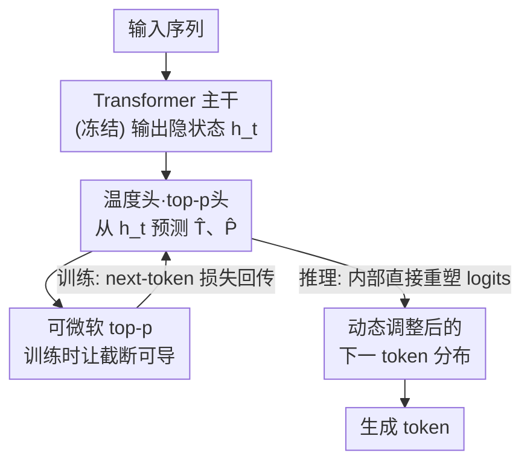

# The End of Manual Decoding: Towards Truly End-to-End Language Models

**会议**: ICLR 2026  
**OpenReview**: [https://openreview.net/forum?id=cPTgQDMD5p](https://openreview.net/forum?id=cPTgQDMD5p)  
**代码**: https://github.com/Zacks917/AutoDeco  
**领域**: LLM效率  
**关键词**: 自适应解码, 温度预测, top-p, 端到端, 可微采样

## 一句话总结
本文提出 AutoDeco，在标准 Transformer 上挂两个轻量预测头，让模型在每一步解码时自己预测当前 token 该用的温度和 top-p，把原本靠手工调参的解码过程变成可微、可端到端训练的一部分，在 8 个 benchmark 上不仅稳超默认采样，还逼平了"在测试集上作弊调参"得到的 oracle 上界，几乎零额外延迟。

## 研究背景与动机

**领域现状**：今天的 LLM 号称"端到端"，但实际生成文本的质量高度依赖一个非常手工的环节——解码超参数（temperature、top-p、top-k）的选择。这些参数必须针对每个任务做人工扫描和后处理筛选，连 DeepSeek 这样的商业 API 都要为不同应用场景显式推荐不同的温度设置。

**现有痛点**：这个手工流程有两层麻烦。第一层是显而易见的人力和算力成本——找一组最优配置要做大量 sweep。第二层更深：一组**静态**配置本身就是次优的，因为同一段生成内部所需的随机性是剧烈变化的。比如做推理时，模型在探索初始思路阶段需要高创造性（高温度），而在给出最终答案时需要高精确性（低温度），但静态参数没法在生成途中切换。

**核心矛盾**：解码本质上是一个**逐 token、依赖上下文**的动态决策，但现有范式强行用"一刀切"的固定超参去套，注定无法贴合每个位置的真实需求。更要命的是，标准 top-p 采样里的"硬截断"（只保留累积概率超过阈值的最小 token 集合）是**不可微**操作，这把梯度从损失回传到解码参数的路径直接切断了，导致没法把解码参数纳入端到端训练。

**本文目标**：让模型**自己学会**控制解码策略——在每一步同时预测出该用的温度和 top-p，而不是靠人喂固定值。要实现这点需要解决两个子问题：(1) 没有 token 级"最优温度/top-p"的 ground-truth 标签，怎么训练这两个头？(2) 怎么把预测塞进推理流程而不增加延迟？

**切入角度**：作者观察到，既然解码参数最终影响的是下一个 token 的概率分布，而这个分布又直接进入交叉熵损失，那只要把"温度缩放 + top-p 截断"这条链路改造成**全可微**的，就能用最终的 next-token 损失反向传播，间接学出"什么时候该高温、什么时候该低温"。

**核心 idea**：用两个轻量 MLP 头从隐状态直接预测 token 级的温度 $\hat{T}$ 和 top-p $\hat{P}$，并发明一个可微的"软 top-p"机制让整条解码链路可端到端训练，从而把超参选择内化进模型的前向传播。

## 方法详解

### 整体框架

AutoDeco 的目标是把"解码"从模型外部的手工后处理，变成模型内部、随前向传播一起完成的参数化过程。它在标准 Transformer 的最后一层隐状态 $h_t$ 之上，并联两个轻量预测头：温度头预测 $\hat{T}_t$，top-p 头预测 $\hat{P}_t$，二者和原本的 `lm_head` 一起在同一次前向里算完，再用预测出的参数当场把 logits 重新缩放、过滤，得到动态调整后的最终分布。整个过程对用户来说几乎无感——只需"改一行代码"就能把普通模型换成自调节解码的版本。

训练侧的难点是没有标签，作者的解法是让**整条解码链路可微**，从而直接拿 next-token 交叉熵损失去训这两个头；推理侧的难点是延迟，解法是把两个头做成 2 层 MLP、并入标准前向，额外开销只有 1-2%。

### 关键设计

**1. 双预测头与微依赖：让模型逐 token 自报采样参数**

针对"静态超参没法贴合每个位置"的痛点，AutoDeco 给每一步生成都配上一组专属参数。两个头都是简单的 2 层 MLP，输入是基座模型当前的隐状态 $h_t$。温度头直接从隐状态预测：$\hat{T}_t = \text{temp\_head}(h_t)$。关键的巧思在 top-p 头——它不只看隐状态，还把**刚刚预测出来的温度**也当输入：$\hat{P}_t = \text{top-p\_head}(h_t, \hat{T}_t)$。这条"微依赖"（在 Figure 1 里画成虚线箭头）让两个参数之间能产生更细腻的耦合：模型可以在已知"这一步打算用多高温度"的前提下，再决定该保留多大的候选核，而不是两个参数各自为政。因为头极轻、又复用了主干算好的隐状态，所以预测它们的代价相比庞大的 Transformer 层几乎可以忽略。

**2. 可微"软 top-p"：把不可导的硬截断改造成能回传梯度的链路**

这是整篇方法的命门。传统 top-p 对阈值外的 token 直接赋零概率，这个硬截断不可导，梯度到此为止。作者改成**软截断**：阈值外的 token 不是被砍掉，而是按它离阈值多远做可微的权重衰减——越远衰减越狠、概率越趋近零，但全程光滑可导。具体分三步：先用预测温度算初始分布 $p = \text{softmax}(l / \hat{T})$；再对排序后的累积概率 $c$ 生成软 mask $m^{(\text{sorted})} = \exp(-\alpha \cdot \text{ReLU}(c - \hat{P}))$，其中 $\alpha$ 控制衰减陡度——对核内 token（$c < \hat{P}$）ReLU 为零、mask 恒为 1，对核外 token 则随 $c$ 超出 $\hat{P}$ 的程度平滑衰减到零；最后把 mask 还原到原词表顺序乘回 $p$ 并重新归一化：

$$\tilde{p} = \frac{p \odot m}{\sum (p \odot m) + \epsilon}$$

得到的 $\tilde{p}$ 是完全可微的最终分布。因为整条链路可导，标准交叉熵损失的梯度就能**同时**回传更新温度头和 top-p 头，让模型通过直接优化最终任务目标，自己学出上下文相关的最优解码策略。注意软 top-p **只在训练时用**，推理时仍走标准的硬采样。

**3. 数据去偏：Easy-Token 掩码 + Dynamic Fine-Tuning 防止温度头学歪**

本文不从头预训练，而是冻结基座、只训这两个头，训练数据是各基座模型在 DeepMath-103K 上拒绝采样得到的轨迹。但直接在 SFT 数据上训会引入两类偏差，作者各开一个去偏操作。其一是 **Easy-Token 掩码**：很多 token 基座贪心预测就已经对了，这些"简单 token"会把最优温度 $\hat{T}_t^*$ 逼向接近零，使温度头变得过度保守；于是随机把这类位置中很大一部分（如 60%）的训练损失掩掉，强迫模型从更有信息量的难 token 上学。其二是 **Dynamic Fine-Tuning**：朴素微调会让温度头对不确定 token 预测出异常大的值，于是引入 DFT 重新加权损失，把注意力放到"模型本就有合理先验"的 token 上，教头在**校准过的不确定性**下才谨慎地调高温度，而不是被离群信号带偏。整套训练只需约 400 步的轻量微调，就能适配 Qwen、Llama、GPT、DeepSeek 等多个模型家族。

### 损失函数 / 训练策略
训练目标就是生成 token 的标准交叉熵损失，没有引入任何额外的解码参数监督——这正是"端到端"的含义：梯度经由可微软 top-p 同时流向温度头和 top-p 头。理论上这两个头可以从预训练阶段就一起训，但本文选择冻结基座、只训头，配合上面两个去偏操作，约 400 步即可收敛。与最接近的工作 Adaptive Decoding（用 RL 训、且只预测温度）不同，AutoDeco 既同时控温度和 top-p，又用全可微管线直接从 next-token 损失训练，无需 RL。

## 实验关键数据

### 主实验

在 5 个模型家族、8 个 benchmark 上评测，主指标是 Pass@1（每题过采样 128 个样本估计，最大生成长度 32768）。数学推理（in-domain）结果：

| 模型 | 方法 | AIME | BRUMO25 | HMMT25 | BeyondAIME | 平均 |
|------|------|------|---------|---------|------------|------|
| Llama-Nemotron-8B | Greedy | 55.00 | 60.00 | 26.67 | 37.00 | 44.67 |
| Llama-Nemotron-8B | Default Sampling | 51.24 | 60.68 | 30.89 | 32.65 | 43.86 |
| Llama-Nemotron-8B | **AutoDeco** | 56.07 | 63.23 | 34.37 | 34.51 | **47.05** |
| R1-Distill-Qwen-7B | Default Sampling | 43.62 | 51.38 | 22.50 | 24.87 | 35.59 |
| R1-Distill-Qwen-7B | **AutoDeco** | 47.57 | 53.93 | 24.46 | 26.98 | **38.24** |
| Qwen3-235B-Thinking | Default Sampling | 80.76 | 82.40 | 63.41 | 50.05 | 69.16 |
| Qwen3-235B-Thinking | **AutoDeco** | 82.79 | 84.14 | 66.07 | 51.88 | **71.22** |

通用任务（out-of-domain，模型只在数学上训过）也全面领先，体现强零样本泛化：

| 模型 | 方法 | GPQA-D | MMLU-Pro | LiveCodeBench | IFEval | 平均 |
|------|------|--------|----------|---------------|--------|------|
| R1-Distill-Qwen-7B | Default Sampling | 47.41 | 47.65 | 15.40 | 32.35 | 35.70 |
| R1-Distill-Qwen-7B | **AutoDeco** | 48.91 | 50.75 | 15.46 | 33.90 | **37.26** |
| OpenAI-GPT-OSS-20B | Default Sampling | 65.67 | 68.00 | 70.15 | 30.68 | 58.63 |
| OpenAI-GPT-OSS-20B | **AutoDeco** | 66.48 | 69.12 | 71.25 | 30.84 | **59.42** |

关键对比是与 **Expert-Guided Tuning（oracle）**：作者在测试集上做细粒度搜索先定最优温度、再定最优 top-p，这相当于"作弊调参"得到的静态解码实际上界。结果 AutoDeco 单次前向的表现和这个 oracle 几乎一致，所有模型和数据集上差距都 < 1 分——而 oracle 在真实场景里根本不可达，因此可以认为 AutoDeco 实际上优于任何可行的专家调参。

### 消融实验

在 R1-Distill-Qwen-7B / AIME 上拆开两个头单独评测：

| 配置 | 相对 Default 的增益 | 说明 |
|------|---------------------|------|
| 仅温度头 | 约 +3~3.5 分 | 单头就大幅超静态解码 |
| 仅 top-p 头 | 约 +3~3.5 分 | 单头同样有效 |
| 完整 AutoDeco（双头） | 最高 | 两头互补，联合最优 |

效率开销（R1-Distill-Qwen-7B，1k token）：FLOPs 与基线几乎相同，显存仅增加约 4 MB，延迟在各种 prompt 长度下稳定只增 0.29-0.6 s/k token，平均相对增幅仅 **1.7%**。

### 关键发现
- **单头即强**：温度头或 top-p 头任意一个单独用，就能比默认采样涨约 3-3.5 分——说明解码上的大幅提升不需要复杂架构，一个轻量头足矣；双头互补再拿到最优。
- **泛化是"元技能"**：只在数学上训，却在 QA / 代码 / 指令遵循上拿到同量级（如 R1-Distill-Qwen-7B 上通用任务也涨 2.8 分）的提升，说明模型学到的是"如何生成"的通用元技能（平衡探索与利用），而非"生成什么"的任务知识。
- **Pass@k 不掉反增**：在 GPT-OSS-20B 上，从 pass@1 到 pass@64，绝对增益保持一致，相对错误率削减从 3.2% 放大到 30%——任务越容易，方法的相对收益越大，且没有牺牲多样性。
- **自适应确定性/随机性**：在 Default 不如 Greedy 的任务上，AutoDeco 会自学预测更低温度去贴近 Greedy；反之在随机性有利时调高温度——它学会了按需切换确定性与随机性。

## 亮点与洞察
- **把不可微的采样改成可微的训练时代理（软 top-p），推理时再切回硬采样**：用 $\exp(-\alpha \cdot \text{ReLU}(c-\hat{P}))$ 这一个表达式同时实现"阈值判定 + 平滑衰减"，是整套端到端训练能跑通的关键，这种"训练用软、推理用硬"的思路可迁移到其他含硬截断/排序的不可微模块。
- **"1 行代码"的 drop-in 部署**：两个 2 层 MLP 头、1-2% 延迟、4 MB 显存，让自适应解码变成现有模型的即插即用增强，工程上极友好。
- **emergent 的自然语言控解码**：仅靠端到端优化，模型意外学会理解"请降低输出多样性"这类 meta 指令——收到后立刻把平均预测温度和 top-p 分别降 0.11 和 0.09，开启了用自然语言交互式操控解码风格的新范式。
- **温度/top-p 的微依赖**：top-p 头把刚预测的温度当输入，这个细节让两个参数协同而非独立，是个值得借鉴的耦合设计。

## 局限与展望
- **冻结基座的天花板**：作者承认基于冻结基座只训头，会带来 prompt 控制不够精确、数据偏差等问题；未来计划把基座和 AutoDeco 联合训练以获得更细粒度的控制。
- **训练域偏窄**：训练数据集中在数学（DeepMath-103K 拒绝采样轨迹），虽然泛化好，但对创意写作、长开放式生成等"高随机性"场景的最优性验证相对有限。
- **依赖去偏 trick**：Easy-Token 掩码比例（如 60%）和 Dynamic Fine-Tuning 都是经验性操作，论文未充分给出这些超参的敏感性分析。
- **软 top-p 的 $\alpha$**：衰减陡度 $\alpha=30$ 是固定选的，训练时软分布与推理时硬采样之间的 train-test gap 有多大、对结果影响如何，可进一步分析（⚠️ 以原文为准）。

## 相关工作与启发
- **vs Adaptive Decoding（Dhuliawala et al., 2024）**: 它同样引入可学习的解码头，但只预测温度、且用 RL 训练。本文区别有二——同时控温度和 top-p，并用全可微管线直接从 next-token 损失端到端训，避开 RL 的不稳定与样本低效。
- **vs 静态截断采样（Top-K / Nucleus top-p）**: 这些方法把超参写死成全局常数，无法逐位置自适应；AutoDeco 让模型每步自己出参数，本质是从"固定超参"到"动态自调节"的范式转变。
- **vs Contrastive / Speculative Decoding 等 model-based 解码**: 它们用外部/辅助模型修正分布，但仍在固定算法框架下、且"引导模型的选择"本身又成了新超参；AutoDeco 不引入外部模型，直接让主模型内化对自身随机性的控制，且与 speculative decoding（如 MTP）完全兼容。

## 评分
- 新颖性: ⭐⭐⭐⭐⭐ 把"手工解码"问题重新定义为可端到端学习的对象，软 top-p 与双头微依赖都是干净有效的新设计。
- 实验充分度: ⭐⭐⭐⭐⭐ 5 个模型家族、8 个 benchmark、in/out-of-domain + Pass@k + 效率 + oracle 对比一应俱全。
- 写作质量: ⭐⭐⭐⭐ 动机层层递进、方法清晰；个别去偏 trick 的细节略简。
- 价值: ⭐⭐⭐⭐⭐ 几乎零成本、即插即用、还逼平 oracle，对实际部署极具吸引力，并开出自然语言控解码的新方向。

<!-- RELATED:START -->

## 相关论文

- [\[ACL 2025\] Sliding Windows Are Not the End: Exploring Full Ranking with Long-Context Large Language Models](../../ACL2025/llm_efficiency/sliding_windows_full_ranking.md)
- [\[ICLR 2026\] Diffusion Language Models Know the Answer Before Decoding](diffusion_language_model_knows_the_answer_before_it_decodes.md)
- [\[ICLR 2026\] Hierarchy Decoding: A Training-free Parallel Decoding Strategy for Diffusion Large Language Models](hierarchy_decoding_a_training-free_parallel_decoding_strategy_for_diffusion_larg.md)
- [\[ICLR 2026\] Equilibrium Language Models](equilibrium_language_models.md)
- [\[ICLR 2026\] Learning to Parallel: Accelerating Diffusion Large Language Models via Learnable Parallel Decoding](learning_to_parallel_accelerating_diffusion_large_language_models_via_learnable_.md)

<!-- RELATED:END -->
