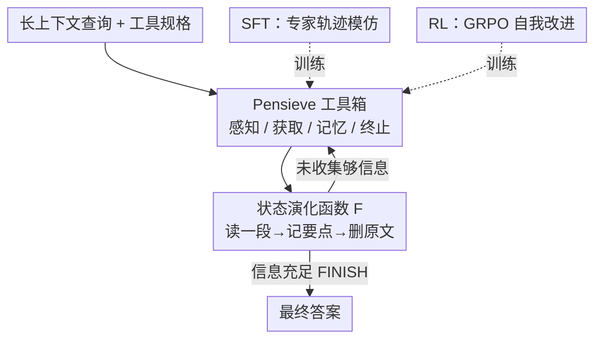

# The Pensieve Paradigm: Stateful Language Models Mastering Their Own Context

**会议**: ICLR 2026  
**OpenReview**: [https://openreview.net/forum?id=GymjF88oGQ](https://openreview.net/forum?id=GymjF88oGQ)  
**领域**: LLM效率  
**关键词**: 长上下文, 自主上下文工程, 记忆管理, 工具调用, 状态化推理

## 一句话总结
本文提出 StateLM——一类被赋予"自己动手编辑上下文"能力的基础模型：它通过一套记忆工具（删除上下文、建索引、做笔记）在多轮推理中读一段、记要点、删原文，把上下文长度维持成"锯齿状"而非单调累积，从而在长文档 QA、对话记忆、深度检索三类任务上只用 1/4 的活跃上下文就大幅超过标准 LLM。

## 研究背景与动机
**领域现状**：当前 LLM 本质是无状态、自回归的"被动预测器"，只能在外部给定的上下文窗口里做序列补全。为了让它处理长任务，业界发明了"上下文工程"（Context Engineering）——用人写的脚本去检索、拼接、塞入相关信息，典型如 RAG、MemGPT、MemAgent、Context-Folding、ReSum 等。

**现有痛点**：这些方法都把"管理记忆"的权力留在人（开发者）手里，模型只是被动执行一个**预先写死**的流程。RAG 把检索到的 chunk 硬塞进 prompt，模型没有选择权；MemAgent 在固定步点更新记忆；Context-Folding/ReSum 即便用 RL 训练，也只是教模型去**适配**人设计好的"分支-折叠"或"周期摘要"套路。上下文管理的根本逻辑被硬编码进了训练目标或工具定义里。

**核心矛盾**：交互状态是**单调增长**的——$s_{t+1} = s_t \,\|\,(a_t, o_t)$，每一轮的思考和原始工具输出都会被永久保留并喂回模型。在长任务里这会持续吞噬固定的上下文预算，最终上下文耗尽、性能崩塌。模型有了"冥想盆"（Pensieve，即成熟的数据库与检索系统），却始终没拿到那根能操作它的"魔杖"。

**本文目标**：把魔杖交到模型手里——让模型自己决定哪些信息重要、哪些是噪声、该怎么组织自己的推理状态，从而摆脱固定窗口的"建筑牢笼"。

**切入角度**：作者用《哈利·波特》的冥想盆做类比：邓布利多用魔杖把记忆抽取、存储、组织起来，拥有完整的能动性。对应到 AI，作者把交互状态从"只能 append 的日志"改造成"可被模型主动修改的可变对象"，关键是引入一个 `deleteContext` 删除动作 + 一个持久外部笔记本。

**核心 idea**：用"模型自主的上下文工程"（self-context engineering）取代"人写脚本的上下文工程"——给模型一套通用记忆工具箱并训练它策略性地使用，让推理变成一个**有状态、可管理**的过程。

## 方法详解

### 整体框架
StateLM 把通用的"工具增强 agent 推理循环"扩展为一个**可自我修改交互历史**的状态化循环。形式上，原本交互状态只能单调拼接 $s_{t+1}=s_t\,\|\,(a_t,o_t)$，StateLM 把它替换为一个状态演化函数：

$$s_{t+1} = F(s_t, a_t, o_t)$$

其中 $F$ 既能追加新交互，也能根据上下文管理动作**修改/删除历史元素**。每一轮模型采样一个动作 $a_t \sim \pi_\theta(\cdot \mid s_t)$，动作由一段自然语言"思考"（thought）+ 一个工具调用（act）组成，环境返回观察 $o_t = E(s_t, a_t)$。

支撑这套机制的核心是 **Pensieve 范式**：一个持久外部记忆 + 显式上下文剪枝操作。它含两个部件——(i) 一个跨整个 episode 存放精炼笔记的**外部笔记本**；(ii) 一个能从上下文中移除选定历史交互的**删除动作**。模型的典型工作流是：读一段 → 把关键信息写进持久笔记 → 立刻删掉原始文本，于是活跃上下文呈"锯齿状"反复涨落而非一路堆高，始终保持紧凑、无噪声的状态。

### 关键设计

**1. Pensieve 工具箱（Spellbook）：把上下文管理拆成一套可组合的"咒语"**

针对"模型无法操作记忆"的根本痛点，作者给模型配了一套**通用记忆工具**，按职责分四类：① 上下文感知——`analyzeText`（返回输入长度）、`checkBudget`（报告剩余预算/轮次）；② 信息获取——`buildIndex`（建可检索索引）、`searchEngine`（检索相关片段）、`readChunk`（载入选定文本块）；③ 记忆管理——`note`/`updateNote`（写/更新关键知识到外部笔记本）、`readNote`（把笔记取回上下文）、`deleteContext`（从上下文移除指定消息）；④ 终止——`finish`（结束并输出答案）。

这套工具箱的精髓在于它是**通用而非任务专用**的：模型不是被教去执行"先折叠再摘要"这种固定套路，而是自己决定何时该感知预算、何时该检索、何时该把原文删掉只留笔记。正因为工具是正交的原子操作，同一个模型不需任务专属微调就能在长文档 QA、对话记忆、深度检索三种场景里自适应地组合出不同的工具使用模式。

**2. deleteContext + 外部笔记本：让上下文从"只增日志"变成"可剪枝状态"**

这是把单调累积 $s_{t+1}=s_t\,\|\,(a_t,o_t)$ 改成 $s_{t+1}=F(s_t,a_t,o_t)$ 的关键落点。除标准推理和工具调用外，StateLM 可以发出上下文管理动作 $a_t = \text{note}(\cdot)$ 和 $a_t = \text{deleteContext}(\text{msg})$，其中 $\text{msg}$ 指向某条历史助手动作 $a_i$ 或环境观察 $o_i$。执行删除后，对应元素在后续轮次对模型不再可见（在 prompt 里被替换成 stub），而写进笔记的信息**持久保留**、随时可 `readNote` 取回。

它有效的原因是把"原始噪声"和"精炼信号"做了物理分离：原始长文本一旦提炼成笔记就被丢弃，不再占用固定上下文预算，于是模型在 1M、2M 这种远超窗口上限的输入上仍能持续推理。作者还发现一个实用细节——在纯扫描（无搜索）场景下，删除时**只剪掉助手消息的工具调用段、保留 thought**，能让行为更贴合扫描式工具集、稳定带来更高准确率。

**3. 两阶段训练（SFT 模仿 + RL 自我改进）：把"会用工具"变成"用得好"**

光有工具箱不够，小模型即便给了系统提示也学不会守住预算（见实验 5.2）。作者用两阶段训练把能力固化进权重。**第一阶段 SFT**：用 Claude Opus 4.1 当教师，放进 StateLM 推理环境跑出 3.3K 条完整专家轨迹，再经一条后处理管线净化——结果型拒绝采样（只留答对的）、过程型拒绝采样（丢掉没及时剪枝、或该顺序阅读却跳读的）、训练样本构造（把一条轨迹按状态 $s_i$ 递归展开成多个样本，用 token 级 mask 只对当前这一步助手回合算交叉熵，因为更早的回合可能在后续生成里被改/删）、以及动作平衡（对 `deleteContext`/`readChunk` 这类高频低复杂度动作下采样，避免策略偏科）。最终得到 35.7K 训练样本。

**第二阶段 RL** 用 GRPO 式目标做自我改进，并针对 StateLM 做了三处适配：**轨迹快照**——每当发生一次上下文编辑动作就采一个 state snapshot，之后上下文演化并打 mask，下一个样本从新状态继续，一条轨迹由此产出一串带 loss mask 的快照；**受控批量**——每条轨迹均匀采样固定数量 $k$ 个快照、每个快照对目标贡献相等，$k$ 作为控制方差和算力、抑制"长轨迹偏置"的旋钮；**任务感知奖励**——给终止轨迹打标量奖励

$$R(q,a,T_{\text{last}}) = \begin{cases} +1, & \text{答对、格式合规、正常 finish} \\ -0.5, & \text{答错、格式合规、正常 finish} \\ -1, & \text{格式不合规或未完成} \end{cases}$$

超过最大上下文窗口或轮次上限的轨迹被判为"未完成"，优势用组内基线估计。一个有意思的发现是：继续多跑 SFT epoch 反而会掉点，而 RL 不会——说明模型确实能从自己的轨迹里探索出更优策略。

### 一个完整示例
以"对一段长文档提问"为例走一遍 StateLM 的锯齿循环（对应论文 Figure 2）：第 1 轮 `ANALYZE_TEXT()` 先看输入多长；第 2 轮发现文档过长，`BUILD_INDEX()` 建索引；第 3 轮 `SEARCH_ENGINE(keywords)` 检索相关片段；第 4 轮 `READ_CHUNK(chunk_id)` 把某段读进来；第 5 轮判断"这段很重要"，`UPDATE_NOTE(key, content, summary)` 写进笔记本；第 6 轮"该清场了"，`DELETE_CONTEXT(msg_id)` 把刚读的原文删成 stub——此时上下文长度从峰值跌回去（锯齿的一个齿）；中间穿插 `CHECK_BUDGET()` 看还剩多少空间/轮次、`READ_NOTE(key)` 把之前的笔记取回；如此读-记-删反复，直到第 10 轮 `FINISH(final_answer)` 判定信息够了，输出答案。整个过程里活跃上下文始终被压在窗口上限之下。

## 实验关键数据

### 主实验
三个 Qwen3 instruct 变体（4B/8B/14B）做底座，SFT 后记为 StateLM、再 RL 记为 StateLM-RL。核心对比：StateLM 只用 **32K** 上下文，Qwen3 基线用 YaRN 扩到 128K。

| 模型 | 上下文 | NovelQA | ∞Bench | Chat Memory | BrowseComp+ |
|------|--------|---------|--------|-------------|-------------|
| Qwen3-4B | 128K | 65.17 | 59.97 | 39.53 | 2.89 |
| StateLM-4B | 32K | 79.57 | 67.25 | 59.33 | 35.33 |
| Qwen3-8B | 128K | 65.87 | 66.81 | 45.40 | 5.56 |
| StateLM-8B | 32K | 83.84 | 70.16 | 58.93 | 46.22 |
| StateLM-8B-RL | 32K | 84.15 | 73.07 | 59.73 | 46.44 |
| Qwen3-14B | 128K | 77.94 | 74.96 | 54.07 | 5.46 |
| StateLM-14B | 32K | 84.15 | 77.44 | 64.40 | 51.33 |
| StateLM-14B-RL | 32K | 84.85 | 78.46 | 64.47 | **52.67** |

最戏剧性的是深度检索任务 BrowseComp-Plus（平均输入 552K）：标准 Qwen3 各尺度都卡在 ~5%，而 StateLM 系列冲到 35%~52%，平均提升 **40+ 个点**。长文档 QA 上 StateLM-8B 比 Qwen3-8B 在 NovelQA 上绝对提升 >10 个点、Chat Memory 上 +13 个点，且只用了 1/4 的活跃上下文。

另有 Needle-in-a-Haystack（NIAH，去掉搜索工具）测记忆管理极限：标准 Qwen3 在超过 128K 后迅速崩到接近 0（1M 仅 3.33%），而 StateLM-14B 在 2M 上下文下仍有 83.89%。

### 消融与分析

| 配置 | 关键发现 | 说明 |
|------|---------|------|
| SFT vs +RL | StateLM-8B-RL 在 ∞Bench 上再 +3 点 | RL 能在好 SFT 模型上继续提升，而多跑 SFT epoch 反而掉点 |
| 按证据位置拆分 | 128–256K 区间 StateLM 比基线高 23/24 点（4B/8B） | 证据越靠后、优势越大，正是单调累积最吃亏的地方 |
| 按问题类型拆分 | Multi-Hop 提升最大，span/user-preference 偏弱 | 弱项源于关键词检索对隐式/非直接查询的局限 |
| Qwen3-Agentic（仅给系统提示+工具） | 最大的 14B 也只能答对 ~30%，远低于训练版 | 小模型常因守不住预算而上下文溢出，证明"刻意训练"必要 |

### 关键发现
- **删除原文是性能而非负担**：把上下文压成锯齿状不仅省预算，反而因为去掉了噪声让推理更准，证据越靠后增益越明显。
- **工具使用随任务自适应**：StateLM-14B 的统计显示，输入越长主要增加的是**搜索**次数而非记忆更新（BrowseComp+ 搜索均值 6.6 vs NovelQA 1.8），记忆操作始终保持低频高效（4~5 次/题），不像固定工作流那样每步都更新。
- **自主范式 > 预定义工作流**：在同等模型规模和上下文预算下，StateLM 一致优于 MemAgent、ReadAgent 等把流程写死的 agentic 记忆方法。

## 亮点与洞察
- **`deleteContext` 这一个动作是范式转折点**：它把"上下文"从只读日志变成模型能主动剪枝的可变状态，是"模型自己当上下文工程师"的物理抓手——巧妙之处在于配合外部笔记本做了"噪声/信号分离"，删的是原文、留的是提炼。
- **"锯齿状上下文"是个很有画面感的核心隐喻**：传统模型单调累积撞墙，StateLM 反复涨落维持紧凑，一张 profile 图就讲清了整个方法的价值主张。
- **训练里"早回合被 mask、只对当前步算 loss"很关键**：因为历史会被后续删改，不 mask 就会在已失效的上下文上学习；这个 token 级 mask 思路可迁移到任何"会编辑自己历史"的 agent 训练。
- **一个模型打通三类记忆任务**：长文档 QA、多轮对话记忆、深度检索此前各有专门方法，本文用统一工具箱 + 通用训练同时解决，泛化性是最大卖点。

## 局限与展望
- **依赖关键词检索的读法有盲区**：作者承认在 "span"（跨度信息）和 "user-preference"（用户偏好）这类隐式/非直接查询上较弱，因为 `searchEngine` 基于关键词，对语义模糊的目标命中率低。
- **小模型必须刻意训练**：纯靠系统提示 + 工具的 Qwen3-Agentic 守不住预算、频繁溢出，说明这套能力对小模型不是"开箱即用"，迁移成本不低。
- **教师与裁判依赖强模型**：SFT 轨迹由 Claude Opus 4.1 生成、对话/检索任务用 LLM-as-judge，数据质量和评测都绑定在强外部模型上。
- **改进思路**：可把检索从关键词升级为稠密/语义检索以补 span/偏好类弱项；或探索让删除/笔记动作本身也接受更细粒度的过程奖励，而非只靠最终 outcome reward。

## 相关工作与启发
- **vs RAG**：RAG 由人设计的管线检索 chunk 硬塞进 prompt，模型无能动性、被动接受；本文让模型自己决定检索/阅读/删除，把控制权从开发者交给模型。
- **vs MemGPT / MemOS**：它们提供类操作系统的记忆分层来 page in/out 信息，但调度逻辑仍是人设计的；StateLM 不预设调度，模型策略性地自主调用工具。
- **vs Context-Folding / ReSum**：同样用 RL 训练记忆管理，但模型被训练去**适配**固定的"分支-折叠"或"周期摘要"套路，逻辑硬编码在训练目标里；StateLM 给的是通用工具箱，让模型自己架构推理循环，而非执行死板套路。
- **vs MemAgent / ReadAgent**：在同等规模和上下文预算下，本文一致超过这些把更新点/读法写死的方法，体现自管理范式的优势。

## 评分
- 新颖性: ⭐⭐⭐⭐⭐ 把"上下文工程"的主体从人转移到模型，`deleteContext` + 锯齿状上下文是干净有力的新范式
- 实验充分度: ⭐⭐⭐⭐⭐ 三尺度 × 三类任务 + NIAH 到 2M + 工具使用统计 + Agentic 对照，覆盖很全
- 写作质量: ⭐⭐⭐⭐⭐ 冥想盆隐喻贯穿全文，动机-方法-实验逻辑清晰，图示直观
- 价值: ⭐⭐⭐⭐⭐ 用统一模型打通长文档/对话/检索三类记忆任务，对长上下文 agent 落地有直接启发

<!-- RELATED:START -->

## 相关论文

- [\[ICLR 2026\] Extending the Context of Pretrained LLMs by Dropping Their Positional Embedding](extending_the_context_of_pretrained_llms_by_dropping_their_positional_embedding.md)
- [\[ICML 2026\] RePo: Language Models with Context Re-Positioning](../../ICML2026/llm_efficiency/repo_language_models_with_context_re-positioning.md)
- [\[ICLR 2026\] UltraLLaDA: Scaling the Context Length to 128K for Diffusion Large Language Models](ultrallada_scaling_the_context_length_to_128k_for_diffusion_large_language_model.md)
- [\[ICLR 2026\] Equilibrium Language Models](equilibrium_language_models.md)
- [\[ICLR 2026\] Developmental Federated Tuning: A Cognitive-Inspired Paradigm for Efficient LLM Adaptation](developmental_federated_tuning_a_cognitive-inspired_paradigm_for_efficient_llm_a.md)

<!-- RELATED:END -->
