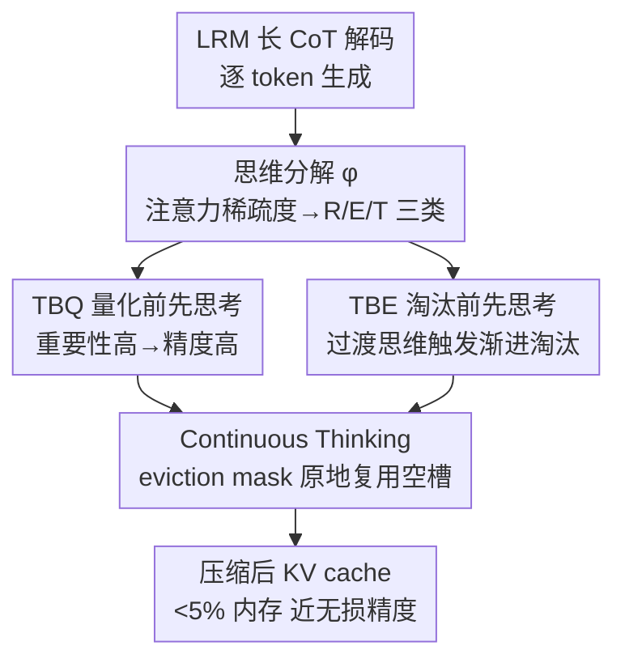

# ThinKV: Thought-Adaptive KV Cache Compression for Efficient Reasoning Models

**会议**: ICLR 2026  
**OpenReview**: [https://openreview.net/forum?id=M3CeHnZKNC](https://openreview.net/forum?id=M3CeHnZKNC)  
**代码**: 无  
**领域**: LLM效率 / LLM推理  
**关键词**: KV Cache压缩, 推理模型, 混合量化-淘汰, 注意力稀疏, PagedAttention

## 一句话总结
ThinKV 观察到推理模型长 CoT 里的注意力稀疏度能把 token 分成"推理/执行/过渡"三类思维，于是按思维重要性给 token 分配量化精度、并在推理轨迹变化时渐进淘汰低价值思维段，再配一个扩展 PagedAttention 的 kernel 原地复用被淘汰的内存槽，最终用不到 5% 的 KV cache 实现近乎无损精度，吞吐量最高比 SOTA 高 5.8 倍。

## 研究背景与动机

**领域现状**：大推理模型（LRM，如 DeepSeek-R1、GPT-OSS）靠生成几千 token 的长思维链（CoT）来探索和验证解法，把竞争力从"长输入"推到了"长输出"。但解码阶段是内存受限的，长 CoT 让 KV cache 飞速膨胀——一个 GPT-OSS-20B 生成约 32K token、batch 32 时光 KV cache 就要 50GB，加上 40GB 权重直接超出 A100 的 80GB。KV cache 压缩因此成了关键。

**现有痛点**：现有压缩方法大多是为长输入的 prefill 阶段设计的（量化、淘汰、低秩、混合），搬到 LRM 的长输出场景就水土不服。少数面向解码阶段的方法要么用贪心的"最近优先"淘汰，要么对所有 token 做均匀量化，都忽略了推理动态，导致 LRM 精度明显掉点。即便是最近开始捕捉推理动态的工作（RaaS、LazyEviction、R-KV、PM-KVQ），也都停留在 **token 级**做决策，看不到推理的整体语义结构，容易误删推理关键 token、或者因为高估了不重要 token 而压不下去。

**核心矛盾**：压缩有两条路——量化（降低每个 token 的比特数）和淘汰（直接丢弃 token）——但单独用任何一条都触到天花板。论文用 $\text{Mem}(KV) \propto (I + bL_{gen}) \times a\beta$ 刻画内存（$a$、$b$ 分别是量化、淘汰带来的内存系数）：纯量化把 $a$ 压小时，激进量化反而会**膨胀生成长度** $L_{gen}$，把省下的内存吃回去还掉精度；纯淘汰把 $b$ 压小不会膨胀长度，但 $b \to 0$ 时精度崩溃。

**本文目标**：能不能跳出 token 级启发式，在高压缩比下既保住推理关键信息、又把效率拉满？拆成三步：(1) 怎么免关键词、可泛化地识别思维类型；(2) 怎么按思维重要性分配比特/淘汰；(3) 非连续淘汰造成的内存碎片怎么不靠昂贵的 gather 压实来收拾。

**切入角度**：作者发现注意力分数的**稀疏度**在解码步上呈现三模态分布，恰好对应三类语义不同的思维——这给了一个不依赖关键词表的、可泛化的思维分类信号。

**核心 idea**：把"量化"和"淘汰"按思维类型自适应地**混合**起来（hybrid quantization–eviction），重要思维高精度保留、轨迹改变型思维渐进淘汰，并用算法-系统协同设计消掉系统侧开销。

## 方法详解

### 整体框架

ThinKV 是一个"思维自适应"的混合压缩框架，整条链路是：解码时先把每个 token 按注意力稀疏度归入 R/E/T 三类思维（Thought Decomposition），然后两个引擎并行作用——TBQ 按思维重要性给新 token 分配量化精度，TBE 在出现"过渡思维"时把前面的思维段渐进淘汰；最后由 Continuous Thinking（CT）这个扩展 PagedAttention 的 kernel 把被淘汰的内存槽原地回收复用，避免昂贵的 gather 压实。三类思维的含义是：**R（reasoning）** 系统性思考、**E（execution）** 计算或代码生成、**T（transition）** 不确定与回溯。重要性层级是 $R > E > T$，稀疏度层级则相反 $T > R > E$。

### 关键设计

**1. 思维分解 φ：用注意力稀疏度免关键词地把 CoT 切成 R/E/T 三类**

前面说 token 级方法看不到推理的语义结构，根因是没有一个可靠又通用的"思维类型"标签。已有工作用关键词表近似分类函数 $\phi: \{y_0,\dots,y_{n-1}\} \to T$，但模型一旦生成词形变体或表外 token 就失效。ThinKV 的关键观察是：归一化注意力分数 $\text{softmax}(qK^\top)$ 的稀疏度（以行最大值的 1% 为阈值统计零比例）在解码步上呈**三模态分布**（Observation 1a），三个模态正好对应三类思维，且 T 思维稀疏度最高、R 次之、E 最低（Observation 1b）。

具体做法分两段：**离线标定**用核密度估计（KDE）从 100 条校准 prompt 估出每条的稀疏度分布，挑出恰好呈现 $|T|$ 个模态的最优层子集 $L^*$（实测 $|L^*|=4$），在相邻模态间取局部极小值作为 $|T|-1$ 个阈值 $\Theta=\{\theta_1,\dots\}$，再跨 prompt 和层求平均。**解码时**对当前 token 在 $L^*$ 上平均稀疏度、和 $\Theta$ 比较即可定类。由于一个思维段通常跨 100–300 token，作者设刷新周期 $\tau=128$ 步，只在间隔处更新类别，把分类开销压到几乎可忽略（Table 5 显示 Thought Refresh 只占 3.8% 时间、0.7% 调用率）。这把"思维识别"从脆弱的关键词匹配换成了模型自带的、随分布漂移的稀疏度信号。

**2. TBQ（Think Before You Quantize）：按思维重要性分配比特，而不是一刀切**

针对"均匀量化把所有 token 当同等重要"的痛点，TBQ 用反事实重要性给思维类型排序后再分精度。重要性 $\rho$ 来自对每个思维段 $Y_i$ 做"有无该段时最终答案分布的 KL 散度"（50 次 rollout 平均），得到清晰层级 $R>E>T$，于是定义 $\rho(R)=2,\rho(E)=1,\rho(T)=0$。可用比特集 $B=\{2,4,8\}$（2-bit 用 ternary、4-bit 用 NVFP4、8-bit 用 FP8），构造映射 $\psi: T \to B$ 满足"重要性越高精度越高"，把 R/E/T 分别映到 8/4/2-bit。

实践上有个反直觉的优化：作者发现 R token 即使量到 4-bit 也几乎不掉精度，所以正式实验里直接采用 **R4E4T2**（R、E 都 4-bit，T 才 2-bit），平均精度约 3.4 bit，比 8-bit 方案更省还不损精度。键按通道、值按 token 量化，每组 $g=16$ 共享一个 FP8 (E4M3) 缩放因子，并用一个大小为 $g$ 的全精度缓冲区 $B_{buf}$ 暂存 token 直到凑满一组再整组量化。这样精度预算就花在了刀刃上——真正承载推理的 token 高精度，回溯类的 T token 低精度，对应 Table 1 里相比 KIVI（均匀 2-bit）和 PM-KVQ 的明显精度优势。

**3. TBE（Think Before You Evict）：在推理轨迹改变时，整段渐进淘汰而非逐 token 抠**

这一步要解决"高压缩比下淘汰会误删关键 token"和"逐 token 淘汰太频繁、开销大"。TBE 的洞察来自 Observation 3：每出现一个过渡思维（T），所有先前思维段的影响力就系统性下降——也就是说 **T 思维标志着推理轨迹的改变**，此前的细节不再那么需要保留。于是 TBE 以思维段为粒度做**前摄式渐进淘汰**：维护一个降序保留率 schedule $R=\{64,32,16,8,4\}$（每段 128 token，最少保 4 个）。

淘汰策略 $\pi$ 分两种情形：**情形一**，一旦生成轨迹改变型思维 $c_t$，就把之前每个思维段退到 $R$ 里的下一档保留率 $|S^{\ell*}_i(c_j)| = \min(|S^\ell_i(c_j)|, R_n)$（$n$ 是该段已被选中淘汰的次数，也即此前发生了几次轨迹改变），随着过渡不断出现，老段被一档档收缩到最小保留值；**情形二**，若没有 $c_t$ 但缓存已超预算 $k$，就找最旧且最不重要的段往下退一档直到达标。被保留的是哪些 token？对每段的 post-RoPE 键嵌入做 K-means 聚类（$K=\min(|S^\ell_i(c_j)|, R)$），保留簇心对应的键和它们的值。这种"趁机会成批淘汰"而非"等缓存撑满再逐 token 挤"的策略，把淘汰频率压得极低——Table 5 显示 ThinKV 每层只有 4.59% 的解码步在淘汰，而 R-KV 高达 82.93%。

**4. Continuous Thinking（CT）：扩展 PagedAttention，原地复用被淘汰的内存槽，干掉 gather 压实**

非连续淘汰会在缓存里留下"内存空洞"造成内部碎片，常规做法是 gather 压实，但作者实测（§5.1）这个开销极重：顺序 gather 让 TPOT 最高慢 37 倍，重叠 gather 在大 batch 下又会和后续层的注意力争抢 HBM 带宽、把注意力时间拖慢约 35%。CT 的思路是**根本不压实**：它给 PagedAttention 的块表新增四个字段——思维类型、思维段起始索引、segment mask（标记块内各段位置的位向量）、eviction mask（标记被 TBE 淘汰位置的位向量）。

TBE 选中要淘汰的 token 时并不立即移除，只在 eviction mask 里"软标记"；等同类型的新 token 到来时，CT 用 eviction mask 找到这些可回收的槽位**原地覆写**，把新段起始索引追加进块表项、更新 segment mask。因为注意力是置换不变的（§C.3），token 不需要在计算时重排，PagedAttention 的注意力 kernel 本身一行不改，就能无缝接入现有服务框架。这就是 ThinKV 大 batch 吞吐暴涨的系统侧来源：Table 5 里 ThinKV 的 Gather Time 是 0，而 R-KV 的 gather 吃掉 22.45% 时间。

### 一个完整示例

以 Figure 6 的走查为例（参数 $\tau=g=\text{block size}=4$、保留 schedule 简化为 $R=\{2\}$）：一段 CoT 的 token A–P 按思维分类填进逻辑块，块表记录每块的思维类型、已填数、起始索引、segment mask（如 `1111` 表示四个位置都属同一段）和 eviction mask（初始全 0）。TBQ 把 R 段的 token 用 16-bit 暂存到 $B_{buf}$、凑满后整组量化（图中 A–D 从 16-bit 转 4-bit）；当解码推进到出现过渡思维时，TBE 触发，把某个 R 段从 4 个 token 退到只保留 2 个（K-means 选簇心），被淘汰的两个位置在 eviction mask 上从 `0000` 变成 `1100`。这些槽不立刻清空——直到新的同类型 token 到来，CT 直接覆写进这两个被标记的物理槽，块表追加新的起始索引、segment mask 更新为如 `0101`。整个过程没有任何 token 搬移或 gather，物理块始终紧凑可用。

## 实验关键数据

模型覆盖 DeepSeek-R1-Distill-Llama (8B/70B)、R1-Distill-Qwen-14B、GPT-OSS (20B/120B)、QwQ-32B、AceReason-14B、MobileLLM-R1；数据集涵盖数学（MATH-500、AIME、GSM8K）和代码（LiveCodeBench）。硬件为单卡 A100-80GB 与 GH200，最大生成长度 32K，每题采 8 个回答算 pass@1。

### 主实验

vs 量化基线（Table 1，k=1024）：

| 模型 | 方法 | 比特 | AIME | LiveCodeBench |
|------|------|------|------|---------------|
| R1-Qwen-14B | Baseline | 16-16 | 53.33 | 47.90 |
| R1-Qwen-14B | KIVI | 2-2 | 40.00 | 34.56 |
| R1-Qwen-14B | PM-KVQ | 3.2 | 43.33 | 41.97 |
| R1-Qwen-14B | **ThinKV** | 3.5 | **50.00** | **45.84** |
| QwQ-32B | Baseline | 16-16 | 73.33 | 55.45 |
| QwQ-32B | KIVI | 2-2 | 60.56 | 40.75 |
| QwQ-32B | PM-KVQ | 3.5 | 67.86 | 46.68 |
| QwQ-32B | **ThinKV** | 3.4 | **70.28** | **50.47** |

吞吐量（Table 2，R1-Llama-8B，32K 连续生成）：

| 方法 | 预算 | 内存占比 | A100 Tok/s | GH200 Tok/s |
|------|------|----------|-----------|-------------|
| FullKV | – | 100% | 297.5 | 453.9 |
| R-KV (seq) | 1024 | 5.48% | 1450.5 | 2425.8 |
| R-KV (ovl) | 1024 | 5.48% | 2320.9 | 4311.3 |
| **ThinKV** | 1024 | **2.51%** | **8412.2** | **10578.5** |

ThinKV 在 AIME/LiveCodeBench 上用 1024 token 预算（<3.67% FullKV 内存）就达到有竞争力的精度，而其他方法要 >12% 才追平；R1-Llama-8B 和 AceReason-14B 在 AIME 上仅用约 1.3% KV cache 就把掉点控制在 <4%。吞吐量比 R-KV(seq) 高 5.8×、比 R-KV(ovl) 高 3.6×（主要来自支持高达 3× 的更大 batch）。Table 3 还显示 2048 预算下 batch 从 13 拉到 290，相比 FullKV 吞吐提升 15.8×。

### 消融实验

ThinKV 各组件（Table 4，GPT-OSS-20B / LiveCodeBench，iso-batch=8）：

| 配置 | 精度/淘汰预算 | 准确率 | 归一吞吐 | 归一延迟 |
|------|--------------|--------|---------|---------|
| FullKV | – | 77.8 | 1.0× | 1.0× |
| 仅 TBQ | 3.5 | 77.8 | 1.1× | 0.98× |
| 仅 TBE | 512 | 62.5 | 1.78× | 0.36× |
| 仅 TBE | 1024 | 76.9 | 1.48× | 0.38× |
| 仅 TBE | 2048 | 77.8 | 1.27× | 0.44× |
| **ThinKV (TBQ+TBE)** | 3.8 / 1024 | 76.4 | **1.51×** | **0.42×** |

### 关键发现
- **TBQ 单用会被生成长度膨胀反噬**：仅 TBQ 虽保住精度，但纯量化让生成长度最多膨胀 5.1×（Figure 10d），把压缩收益几乎抵消，吞吐只提升 1.1×。混合后 TBE 的淘汰部分正则化了这种长度膨胀，这是"为什么要混合"的实证依据。
- **思维级 vs token 级**：ThinKV 在各预算下对 Top-10 注意力 token 的召回率都贴近 FullKV，而依赖 token 级启发式的 R-KV、LazyEviction 明显更低（Figure 10a）——说明保住推理关键 token 正是精度优势来源。
- **淘汰频率天差地别**：ThinKV 每层只 4.59% 的解码步在淘汰、gather 时间为 0；R-KV 因为等缓存撑满逐 token 挤，淘汰调用率 82.93%、gather 吃掉 22.45% 时间（Table 5）。
- **精度配置**：R4E4T2 在高精度与高压缩间最优；R token 量到 4-bit 不掉精度是关键 enabler。

## 亮点与洞察
- **把"压缩单位"从 token 抬到"思维段"**：这是全文最"啊哈"的地方——别人都在 token 级抠，ThinKV 发现注意力稀疏度能免费给出语义级的思维标签，于是量化和淘汰都能按段做决策，既准又省开销。
- **用过渡思维当淘汰触发器**：把"什么时候该忘掉旧细节"绑定到模型自己的回溯行为（T 思维 = 轨迹改变），这是个很巧的语义信号，比"缓存满了才淘汰"自然得多。
- **算法-系统协同**：CT 用一个 eviction mask + 原地覆写就绕开了 gather 压实这个隐形大坑，且因注意力置换不变性保持 PagedAttention kernel 不变——这套"软标记+延迟覆写"的思路可迁移到任何做非连续淘汰的 KV 管理。
- **反直觉发现**：激进量化会膨胀生成长度反噬内存，提醒大家压缩 LRM 不能只看"每 token 省了多少比特"，必须把 $L_{gen}$ 的变化算进总账。

## 局限与展望
- **依赖离线标定**：稀疏度阈值 $\Theta$ 和最优层 $L^*$ 来自 100 条 s1K 校准 prompt，跨任务/跨模型分布漂移时阈值是否仍稳健、需不需要重标定，论文未充分讨论。
- **$|T|=3$ 是简化假设**：作者也承认有些层呈现多于三个稀疏区或边界模糊（§E.4），固定三类是工程取舍；更细的思维划分可能进一步提升压缩-精度前沿。
- **outlier T 思维的处理**：存在重要性异常高的 T 思维（对应回溯），误删会让模型无限循环——当前靠保留 schedule 的最小保留值兜底，但缺乏显式的 outlier 识别机制，极端情况下仍有风险。
- **kernel 工程门槛高**：CT 深度依赖对 PagedAttention/Triton 的定制，迁移到非 vLLM 体系或新硬件需要重新实现。

## 相关工作与启发
- **vs KIVI / PM-KVQ（量化）**: 它们对所有 token 均匀量化或一律渐进降精度，忽略 token 重要性差异；ThinKV 按思维类型分配精度（TBQ），在相近平均比特下精度显著更高（Table 1）。
- **vs H2O / R-KV / LazyEviction / RaaS（淘汰）**: 它们在 token 级做"最近优先"或基于注意力活跃度的淘汰，且非连续淘汰要靠 gather 压实；ThinKV 在思维段级前摄淘汰、用 CT 原地复用空槽，淘汰频率和系统开销都低一个量级（Table 5）。
- **vs 纯单策略**: 纯量化膨胀生成长度、纯淘汰高压缩比下崩精度；ThinKV 用混合方案追踪 Pareto 前沿，在极高压缩比下仍保精度（Figure 2）。

## 评分
- 新颖性: ⭐⭐⭐⭐⭐ 把注意力稀疏度→思维分类作为压缩信号，量化+淘汰双自适应混合，是 LRM KV 压缩里少见的语义级视角。
- 实验充分度: ⭐⭐⭐⭐⭐ 8 个模型 × 数学/代码多基准 × 量化与淘汰双向对比 + 系统级吞吐/延迟 + 细致组件消融。
- 写作质量: ⭐⭐⭐⭐ 动机-观察-方法链条清晰，但图表信息密度极高、部分细节藏在附录，初读门槛偏高。
- 价值: ⭐⭐⭐⭐⭐ <5% KV cache 近无损 + 最高 5.8× 吞吐，对长 CoT 推理模型的实际部署有直接落地价值。

<!-- RELATED:START -->

## 相关论文

- [\[ICLR 2026\] IceCache: Memory-Efficient KV-cache Management for Long-Sequence LLMs](icecache_memory-efficient_kv-cache_management_for_long-sequence_llms.md)
- [\[ICLR 2026\] MoL: Adaptive Mixture-of-Length Reasoning for Efficient Question Answering with Context](mol_adaptive_mixture-of-length_reasoning_for_efficient_question_answering_with_c.md)
- [\[ICLR 2026\] LouisKV: Efficient KV Cache Retrieval for Long Input-Output Sequences](louiskv_efficient_kv_cache_retrieval_for_long_input-output_sequences.md)
- [\[ICLR 2026\] DiffAdapt: Difficulty-Adaptive Reasoning for Token-Efficient LLM Inference](diffadapt_difficulty-adaptive_reasoning_for_token-efficient_llm_inference.md)
- [\[ICLR 2026\] ReST-KV: Robust KV Cache Eviction with Layer-wise Output Reconstruction and Spatial-Temporal Smoothing](rest-kv_robust_kv_cache_eviction_with_layer-wise_output_reconstruction_and_spati.md)

<!-- RELATED:END -->
