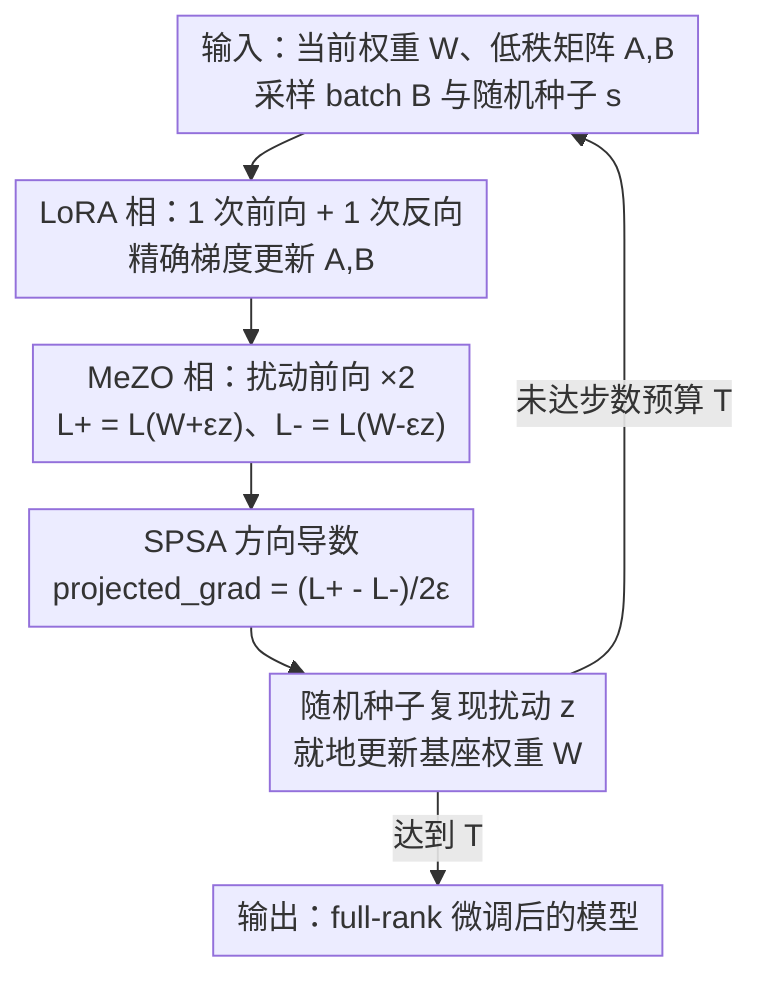

# Three Forward, One Backward: Memory-Efficient Full-Rank Fine-Tuning of Large Models via Extra Forward Passes

**会议**: ICLR 2026  
**OpenReview**: [https://openreview.net/forum?id=373rsDQsq4](https://openreview.net/forum?id=373rsDQsq4)  
**代码**: https://github.com/workelaina/LMAO  
**领域**: LLM效率  
**关键词**: 内存高效微调, 零阶优化, 低秩适配, full-rank 更新, 交替优化

## 一句话总结
针对 LoRA「只能在低秩子空间更新、表达力受限」与 MeZO「纯零阶估计方差大、收敛慢」各自的硬伤，本文提出 LMAO：在每步迭代里交替做一次 LoRA 的前向+反向（更新低秩矩阵 $A,B$）和两次扰动前向的零阶估计（更新基座权重 $W$），用「三次前向、一次反向」把一次更新拼成 **full-rank**，在 LoRA / MeZO 级别的显存下逼近全参数微调（FT）的性能。

## 研究背景与动机
**领域现状**：大模型微调的显存瓶颈极其突出——反向传播带来的梯度、优化器状态可达推理显存的 12 倍以上。主流省显存路线有两条：一是参数高效微调（PEFT），以 LoRA 为代表，只训练注入到权重里的低秩矩阵 $W_0+\frac{\alpha}{r}BA$；二是零阶优化，以 MeZO 为代表，靠纯前向传播的 SPSA 估计梯度，彻底不做反向，显存几乎与推理持平。

**现有痛点**：两条路各有一个绕不开的结构性问题。LoRA 把更新限制在秩为 $r\ll\min(m,n)$ 的子空间里，更新方向天然是低秩的，表达力受限，性能始终差全参数微调一截（特征损失，feature loss）。MeZO 虽然省到极致，但 SPSA 用随机扰动估计梯度，估计本身方差极大、还带偏，导致收敛慢、最终精度在很多任务上明显落后。

**核心矛盾**：「更新的秩（表达力）」和「显存/是否做反向」之间存在权衡——想要 full-rank 的更新就得对全部权重 $W$ 算梯度（贵），想省显存就只能退到低秩子空间或纯零阶噪声估计。单独任何一条路都没法同时拿到「full-rank 更新」和「推理级显存」。

**本文目标**：在严格显存约束下做到**全秩（full-rank）的权重更新**，把性能拉到接近 FT，同时显存不超过 LoRA / MeZO。

**切入角度**：作者注意到 LoRA 与 MeZO 的能力恰好互补——LoRA 的反向梯度精确但被锁在低秩子空间；MeZO 的零阶更新作用在**全参数** $W$ 上、是全秩的，只是噪声大。如果让两者**交替**作用、各管一块参数，低秩矩阵 $A,B$ 由精确梯度更新、基座权重 $W$ 由零阶更新，二者叠加起来的有效更新就跨越了完整的参数空间，即 full-rank。

**核心 idea**：用「LoRA 精确反向更新低秩分量」+「MeZO 零阶前向更新基座权重」交替进行，以三次前向、一次反向把每步迭代拼成一次全秩更新（LMAO）。

## 方法详解

### 整体框架
LMAO（Low-rank and Memory-efficient Zeroth-Order Alternating Optimization）把一次训练迭代拆成两个交替的相位，作用在两套互不重叠的参数上：低秩适配矩阵 $A,B$ 和基座权重 $W$。**LoRA 相**走一遍标准的前向+反向，用 AdamW/SGD 这类一阶优化器精确更新 $A,B$；**MeZO 相**接着对 $W$ 做零阶优化，用两次带正负扰动的前向算出 SPSA 的方向导数来更新 $W$，全程不对 $W$ 反向。一步迭代合计**三次前向（1 次 LoRA + 2 次扰动）、一次反向（仅 LoRA）**。关键在于：$A,B$ 的更新是低秩的，但 $W$ 的零阶更新是作用在全部权重上的全秩更新，两者叠加让每步的全局权重更新保持 full-rank，从而缓解纯低秩/纯零阶方法的特征损失。

### 关键设计

**1. 交替优化框架：把低秩反向与全秩零阶拼成一次 full-rank 更新**

这一条直接对准「LoRA 锁在低秩子空间、MeZO 噪声大」这对痛点。LMAO 不让任何一方单独决定整步更新，而是把参数切成两块分工：低秩矩阵 $[B,A]$ 由精确一阶梯度更新

$$[B_{t+1}, A_{t+1}] = [B_t, A_t] - \eta_{BA}\nabla_{BA}\mathcal{L}(W_t; A_t, B_t),$$

基座权重 $W$ 由零阶估计更新

$$W_{t+1} = W_t - \eta_W \hat{\nabla}_W \mathcal{L}(W_t; A_{t+1}, B_{t+1}; M).$$

之所以有效，是因为 $A,B$ 的更新虽然低秩，但 $W$ 这一项的零阶梯度作用在**全部 $m\times n$ 个权重**上、本身是全秩的；二者交替叠加后，每步对模型的有效更新就跨越了完整参数空间，避免了 LoRA 那种被秩 $r$ 卡死的特征损失。与「先 LoRA 训完再零阶微调」这类两阶段拼接不同，LMAO 是**逐迭代交替**——第 $t$ 步先用更新后的 $A_{t+1},B_{t+1}$ 再去算 $W$ 的零阶梯度，让两路在每一步互相校正，而不是各跑各的。

**2. 三前向一反向：用 SPSA 把 W 的更新做成「免反向」的全秩项**

MeZO 相是把 $W$ 拉成全秩的关键，也是显存能压住的关键。它不对 $W$ 求解析梯度，而是用 SPSA：采一个高斯方向 $z\sim\mathcal{N}(0,I)$，对 $W$ 做正负扰动各跑一次前向，得到 $\mathcal{L}^+=\mathcal{L}(W+\varepsilon z)$ 与 $\mathcal{L}^-=\mathcal{L}(W-\varepsilon z)$，再用方向导数近似真实梯度：

$$\hat{\nabla}_W \mathcal{L} = \frac{\mathcal{L}(W+\varepsilon z) - \mathcal{L}(W-\varepsilon z)}{2\varepsilon}\, z \approx zz^{\top}\nabla_W\mathcal{L}.$$

加上 LoRA 相那一次「前向+反向」，整步合计三次前向一次反向。这样设计的好处是：$W$ 这条最贵、参数量最大的更新完全靠前向完成，不引入任何针对 $W$ 的反向图和优化器状态，全秩更新的「全」由它扛、显存的「省」也由它保证。论文给出了该估计的无偏性（$\mathbb{E}_z[\hat{\nabla}_W\mathcal{L}(W;A,B;M)]=\hat{\nabla}_W\mathcal{L}(W;A,B)$）以及二阶矩的放大关系 $\mathbb{E}_z[\|\hat{\nabla}_W\mathcal{L}\|_F^2]=\frac{mn+N-1}{N}\,\mathbb{E}[\|\hat{\nabla}_W\mathcal{L}\|_F^2]$，量化了零阶估计相对真实梯度的方差代价。

**3. 随机种子复现扰动：把扰动 z 从「存」变成「现算」，零额外显存**

朴素零阶方法要把和参数同形状的扰动 $z$ 显式存下来（用于先加扰动、再复原），这等于凭空多出一份与模型同样大的张量，显存代价不可接受。LMAO 沿用 MeZO 的随机种子 trick：扰动不存，只存一个随机种子 $s$；每次需要 $z$ 时（加正扰动、加负扰动、最后按 $z$ 更新 $W$）都用同一个 $s$ 重置随机数发生器、逐元素**就地**重采样同样的 $z$。于是整个零阶相是在原地（in-place）改 $W$，不修改模型结构、不额外开辟扰动缓冲区。这正是峰值显存能与纯 LoRA / 纯 MeZO 持平、而不是「两套机制相加」的根本原因——附加显存被随机种子换成了重复计算。

### 损失函数 / 训练策略
优化目标就是把权重和低秩矩阵放进同一个损失里联合最小化：$\min_{W,A,B}\mathcal{L}(W;A,B)$，但优化方式按上面两相交替执行（Algorithm 1）。理论侧在 Lipschitz 光滑（Assumption 4.1）和期望光滑（Assumption 4.2）假设下，给出了交替方案的下降引理与收敛速率：用 SGD 时满足

$$\min_{0\le t\le T-1}\mathbb{E}\big[\|\nabla\mathcal{L}(W_t;A_{t+1},B_{t+1})\|_F^2\big]\le \frac{6\big(1+\tfrac{L_{BA}}{L_{\max}}\big)^2\big(\mathcal{L}(W_0;A_0,B_0)-\mathcal{L}^*\big)}{\eta_{\max}T},$$

即 $\mathcal{O}(1/T)$ 的收敛率，其中步长上界依赖参数规模 $mn$、SPSA 采样数 $N$ 及光滑常数。两个关键超参是低秩秩 $r$ 和缩放系数 $\alpha$，实验显示方法对二者都不敏感，实践中可优先取较小的 $r$。

## 实验关键数据

### 主实验
模型覆盖 RoBERTa-large（350M，掩码语言模型）和 OPT 系列（1.3B/2.7B/6.7B，自回归），数据集取自 GLUE / SuperGLUE，统一训练 1K 步。

RoBERTa-large（k=16 少样本，准确率 %）：

| 任务 | Zero-shot | MeZO | MeZO(LoRA) | FT | FT(LoRA) | LMAO |
|------|-----------|------|------------|------|----------|------|
| SST-2 | 79.0 | 90.5 | 91.4 | 91.9 | 91.4 | **92.8** |
| SST-5 | 35.5 | 45.5 | 43.0 | 47.5 | 46.7 | **48.4** |
| SNLI | 50.2 | 68.5 | 69.7 | 77.5 | 74.9 | **77.9** |
| MNLI | 48.8 | 58.7 | 64.0 | **70.0** | 67.7 | 69.7 |
| RTE | 51.4 | 64.0 | 64.9 | 66.4 | 66.1 | **67.3** |
| TREC | 32.0 | 76.9 | 73.1 | 85.0 | 82.7 | **87.0** |

在 k=16 下 LMAO 六个任务全面超过 LoRA，多数任务甚至超过全参数 FT；k=512 时与 FT 的差距进一步收窄到 <1%（个别 ≤2%）。

OPT-1.3B（SuperGLUE，1000 样本）：

| 方法 | SST-2 | RTE | CB | BoolQ | WSC | WIC | MultiRC | COPA | ReCoRD |
|------|-------|-----|----|----|-----|-----|---------|------|--------|
| MeZO | 58.1 | 53.2 | 46.4 | 55.6 | 49.0 | 57.9 | 49.0 | 74.0 | 71.4 |
| LoRA | 92.2 | **61.1** | 67.9 | 61.4 | 53.2 | 58.4 | 56.3 | 74.7 | 72.0 |
| LMAO | **92.4** | 59.4 | **69.0** | **62.0** | **54.8** | **58.9** | **56.7** | **76.7** | **72.1** |

LMAO 在 9 个任务中 8 个超过 LoRA，仅 RTE 略逊于 LoRA。

### 消融实验
在 OPT-1.3B 上对两个相位各做剥离（精度+显存同时看）：

| 配置 | 说明 | 结论 |
|------|------|------|
| LMAO（完整） | LoRA 相 + MeZO 相交替 | 各任务精度均显著最高 |
| w/o LoRA | 冻结低秩块，只跑零阶更新 $W$ | 精度明显下降 |
| w/o MeZO | 冻结零阶项，只更新低秩 $A,B$（退化为类 LoRA） | 精度明显下降 |

峰值显存（GB，OPT-1.3B）：

| 方法 | SST-2 | CB | BoolQ | COPA |
|------|-------|------|-------|------|
| MeZO | 7.90 | 10.99 | 8.75 | 7.70 |
| LoRA | 12.62 | 65.05 | 38.48 | 8.31 |
| LMAO | 12.62 | 65.05 | **23.08** | 8.31 |

### 关键发现
- 两个相位缺一不可：单独的低秩块或单独的零阶项精度都明显低于完整 LMAO，说明增益来自二者**交替叠加成全秩更新**，而非某一路单独起作用。
- 「集成两套机制却不加显存」是核心卖点：LMAO 峰值显存从不超过 LoRA 或 MeZO，BoolQ 上甚至（23.08 vs LoRA 的 38.48 GB）更省——零阶相靠随机种子就地更新、不引入额外反向图与中间状态。
- 对超参 $r,\alpha$ 不敏感，实践可取小 $r$ 把可训练参数压到最少，仍保持性能。

## 亮点与洞察
- **「分参数、分优化器」的互补拼装**：把模型参数切成低秩块和基座权重两块，分别交给「精确但低秩」的反向和「全秩但有噪声」的零阶，让两者的优点对冲掉各自的缺点——这种「按参数分工而非按阶段分工」的思路很可迁移。
- **用计算换显存的极致**：随机种子 trick 把「存一份和模型同形的扰动」换成「需要时按种子重算」，使得叠加零阶机制几乎零显存开销，这是 LMAO 显存能和单一方法持平的关键工程点。
- **全秩 ≠ 全反向**：本文最「啊哈」之处在于揭示——要得到全秩更新并不需要对全部权重做反向，零阶前向就能在全参数空间给出（带噪的）全秩方向，反向只留给少量低秩参数。
- 理论与算法咬合得很紧：交替方案配了下降引理和 $\mathcal{O}(1/T)$ 收敛率，零阶估计还给了无偏性和方差放大系数，不是纯经验拼装。

## 局限与展望
- 作者承认在**大数据集或长序列**上训练效率偏低（每步要三次前向），提出可用 component training 等手段缓解，留作未来工作。
- 每步三次前向相比 LoRA 的一次前向一次反向，**wall-clock 时间更长**，是用算力换显存；论文主要论证显存与精度，对训练吞吐/总时长的对比着墨较少。
- 零阶项的方差随参数规模 $mn$ 增大而放大（见二阶矩公式），在更大模型（如 OPT-6.7B 之外）上方差控制是否依然稳健，正文给的规模有限。
- 消融用图示呈现、未给逐任务精确数值，剥离后的具体掉点幅度只能定性判断。

## 相关工作与启发
- **vs LoRA**：LoRA 单纯在秩 $r$ 子空间更新、一次前向一次反向，表达力被秩卡死；LMAO 在 LoRA 之上额外用零阶前向更新基座权重 $W$，把更新升到全秩，显存不增、精度普遍反超 LoRA。
- **vs MeZO**：MeZO 全靠零阶前向、彻底无反向，但方差大收敛慢；LMAO 保留 MeZO 的零阶相和随机种子省显存机制，但给低秩矩阵加回精确反向，等于给纯零阶补上一条低噪声的精确更新通道，收敛与精度都更好。
- **vs MeZO 的各类改进（稀疏化 / 方差缩减 / 低秩结构 / Hessian 信息）**：这些工作多在零阶框架内部降方差；LMAO 走的是另一条路——不在零阶内部修补，而是引入一条互补的一阶低秩通道与之交替，靠结构互补而非估计器改良来提升。

## 评分
- 新颖性: ⭐⭐⭐⭐ 「LoRA 反向 + MeZO 零阶交替成 full-rank」的组合简洁且切中两者要害，思路新。
- 实验充分度: ⭐⭐⭐⭐ 覆盖 RoBERTa-large 与 OPT 多尺度、含精度/显存/超参敏感性，但消融仅给图、缺逐任务数值。
- 写作质量: ⭐⭐⭐⭐ 算法与理论叙述清晰，图 1 直观对比 LoRA 与 LMAO 的前向/反向流。
- 价值: ⭐⭐⭐⭐ 在严格显存约束下逼近 FT，对资源受限场景的大模型微调有实用价值。

<!-- RELATED:START -->

## 相关论文

- [\[ICLR 2026\] FLoRG: Federated Fine-tuning with Low-rank Gram Matrices and Procrustes Alignment](florg_federated_fine-tuning_with_low-rank_gram_matrices_and_procrustes_alignment.md)
- [\[ICLR 2026\] Difficulty–Diversity Collaborative Filtering for Data-Efficient LLM Fine-Tuning](difficultydiversity_collaborative_filtering_for_data-efficient_llm_fine-tuning.md)
- [\[ICML 2026\] TuneAhead: Predicting Fine-tuning Performance Before Full Training Begins](../../ICML2026/llm_efficiency/tuneahead_predicting_fine-tuning_performance_before_full_training_begins.md)
- [\[ICLR 2026\] On-the-Fly Adaptation to Quantization: Configuration-Aware LoRA for Efficient Fine-Tuning of Quantized LLMs](on-the-fly_adaptation_to_quantization_configuration-aware_lora_for_efficient_fin.md)
- [\[ICLR 2026\] Neuron-Aware Data Selection in Instruction Tuning for Large Language Models](neuron-aware_data_selection_in_instruction_tuning_for_large_language_models.md)

<!-- RELATED:END -->
