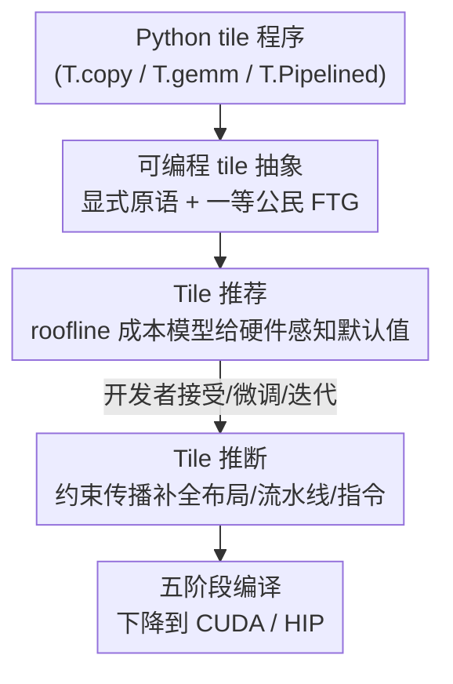

# TileLang：在现代神经网络算子中架起可编程性与性能的桥梁

**会议**: ICLR 2026  
**OpenReview**: [https://openreview.net/forum?id=Jb1WkNSfUB](https://openreview.net/forum?id=Jb1WkNSfUB)  
**代码**: https://github.com/tile-ai/tilelang (有)  
**领域**: LLM效率  
**关键词**: GPU算子, 编译器DSL, Tile抽象, 数据流图, 自动调度

## 一句话总结
TileLang 提出一个以「tile」为一等公民的可编程 GPU 算子语言，把内存放置、数据搬运、并行划分等底层旋钮显式暴露给开发者，再用统一的融合 tile 级数据流图（FTG）配合「tile 推荐 + tile 推断」两阶段自动补全，用不到 70 行 Python 写出接近手写 CUDA 性能的算子，相比 Triton 在 H100 上平均加速 3.02×、AMD 上 2.65×。

## 研究背景与动机
**领域现状**：现代神经网络（尤其是 MHA、MLA、GQA、Linear Attention 这类访存受限的注意力变体）越来越依赖与硬件协同设计的高性能算子。目前主流写算子的路子有两条：要么用 Triton 这类高层 Python DSL 图省事，要么手写几百行 CUDA 榨干性能。

**现有痛点**：这两条路是一个尖锐的取舍。Triton 把流水线调度、共享内存复用、tile 复用这些关键性能旋钮藏在不透明的优化 pass 里，开发者无法直接控制——论文里 MLA 的 Triton 实现只要 130 行，但性能只有手写 CUDA（约 500 行）的 14.2%。反过来手写 CUDA 性能够了，但开发成本高、不可移植、难维护。

**核心矛盾**：可编程性（productivity）和性能（peak hardware utilization）之间存在结构性冲突。根因在于现有编译器要么不给底层控制权，要么给了但要靠人手动管理，缺少一个「既能让人精确控制硬件资源、又能把高层程序高效下降到 GPU」的中间抽象层。

**本文目标**：拆成两个子问题——(1) 编程模型要让开发者对数据搬运和计算有精确控制，能直接和硬件资源交互；(2) 编译器要把这些高层程序高效下降到 GPU，自动完成映射而不增加编程复杂度。

**切入角度**：作者观察到「tile」（张量的一个超矩形切片）正好是性能与可移植性之间的甜点粒度——它足够细，能表达内存层级、warp 划分、流水线；又足够粗，能形成稳定可移植的 API。于是把 tile 提升为一等公民的 IR 构造，而非像以往系统那样只是「人工管理的共享内存 buffer」。

**核心 idea**：用「显式 tile 原语 + 统一 FTG 数据流图」让开发者掌控硬件，再用「tile 推荐给硬件感知默认值 + tile 推断用约束传播自动补全」把剩下的底层配置交给系统，从而同时拿到可编程性和接近峰值的性能。

## 方法详解

### 整体框架
TileLang 是一个 Pythonic DSL：开发者用 tile 算子（`T.copy` / `T.gemm` / `T.reduce`）和调度原语（`T.Parallel` / `T.Pipelined` / `T.annotate_layout`）描述计算，并可选地标注 tile 大小、内存放置（`T.alloc_shared` / `T.alloc_fragment`）、warp 划分等。这些程序被统一表示成**融合 tile 级数据流图（FTG）**——节点是 tile 算子、边是数据依赖。FTG 是「开发者控制」与「系统自动化」之间的分工界面：开发者负责组合算子并给出部分标注，系统则在 FTG 上跑两阶段优化把剩下的填满。

整条管线分两阶段：**tile 推荐**先分析 FTG 和部分标注，给出 tile 形状、内存放置、warp 划分的硬件感知默认值（高质量起点，可接受、可微调）；**tile 推断**再以推荐结果为上下文，沿 FTG 传播形状与布局约束，自动补全剩余配置（内存布局、软件流水线、张量化），并保证上下游 buffer 形状/布局/内存分配一致。补全后的 IR 经五阶段编译流程（Python AST → TileLang AST → FTG → TVM/FTG 优化 pass → 下降到 CUDA/HIP）生成最终算子。

### 关键设计

**1. 可编程 tile 抽象与统一 FTG：把底层旋钮显式交到开发者手里**

针对 Triton「优化 pass 不透明、关键性能路径无法控制」的痛点，TileLang 把 tile 提升为一等 IR 构造，而不是像以往系统那样只是人工管理的共享内存 buffer。开发者能把每个 tile buffer 显式映射到目标加速器内存层级的具体一层：`T.alloc_shared` 放进低延迟、软件管理的共享内存，`T.alloc_fragment` 把累加器 tile 放进寄存器文件（单周期延迟，对性能关键的 reduction 不可或缺）。除了放置，还能用 `T.copy` 编排数据搬运、`T.annotate_layout` / `T.use_swizzle` 定义自定义内存布局、`T.Parallel` / `T.Pipelined` 微调并行与流水线策略。

这套原语之所以有效，是因为 tile 在 IR 里有了「索引、搬运、复用、流水线」的显式语义，对编译器可见，从而支持系统化的分析与变换。所有这些 tile 算子组合起来就是一张 FTG——节点是算子、边是数据依赖，它把内存搬运和并行性显式化，成为后续推荐和推断的统一作用对象。这也是 TileLang 与 Triton 的根本区别：不只是表层语法不同，底层 IR 就允许在 tile 粒度做有原则的优化。

**2. Tile 推荐：用 roofline 成本模型给出可交互的硬件感知默认值**

光给控制权还不够——面对 tile 大小、内存放置、warp 划分、流水线级数、张量化等六个维度的巨大搜索空间，开发者很难手动定到好配置。Tile 推荐用一个**静态 roofline 成本模型**评估候选配置：每个配置下的 FTG 被下降成显式编码每个 tile 计算/访存模式的 IR，再静态估计执行时间

$$\text{Time} = \max_{i,j}\left(\frac{\text{MemoryTraffic}_i}{\text{Bandwidth}_i},\ \frac{\text{Computation}_j}{\text{Performance}_j}\right) + t_{\text{intrinsic}}$$

其中 $i$ 索引内存层级（HBM / L2 / L1），$j$ 索引计算单元类型（Tensor Core / CUDA Core / SFU），$t_{\text{intrinsic}}$ 计入 kernel 启动延迟、循环序言/收尾等固有开销。roofline 假设计算与访存完美重叠，给出一个紧的上界，无需运行时 profiling 就能快速评估。

模型据此对三类旋钮分别产出**带排名的候选清单**：tile 形状（强制是设备原生 tensor-core fragment 的倍数、且满足寄存器/共享内存上限，每个候选标注算术强度、访存量、roofline 利用率）、内存放置（枚举操作数到寄存器/共享内存的合法绑定，标出超容量项与预估流水线停顿）、warp 划分（均匀覆盖输出 tile 并匹配 SM 拓扑，给出预估 occupancy）。关键是这是**人在回路**的：开发者可以直接采纳 top 选项、钉住备选稍后基准测试、或手动覆盖，既省去大量调优又保留完整设计控制权。

**3. Tile 推断：约束传播自动补全布局、流水线与指令**

放置和划分定了「张量放哪、计算怎么切」之后，剩下「多维索引怎么映射到物理地址、怎么排流水线、选哪条指令」仍需补全——手动做既繁琐又容易不一致。Tile 推断把这一步建模成沿 FTG 迭代的**约束传播算法**，逐步精化布局映射 $L$ 直到收敛，分三块：

*布局推断*把多维索引转成物理地址，统一建模为线性地址表达式 $\sum_i y_i s_i$（$y_i$ 是第 $i$ 维索引、$s_i$ 是步长），并引入基于 `IterVar` 的可组合 Layout 代数，使转置等变换可写成 `lambda i, j: (j, i)` 这样的代数映射；它用分层贪心策略处理三种情形——对 Tensor Core GEMM 这类硬件敏感算子做**严格推断**（swizzled 共享内存布局 + MMA 对齐的寄存器分配），对 reduction 这类结构对齐算子做**通用推断**（传播布局、保证线程绑定与寄存器复用一致），对剩余无约束布局做**自由推断**（连通分量切子图、每个子图选寄存器用量最低的划分，并用成本模型定线程绑定与向量化长度以最大化合并访存、最小化 bank 冲突）。

*流水线推断*从串行程序自动推出流水线调度，把 `copy` 与 `gemm` 重叠，仅向用户暴露一个 `num_stages` 参数，并在 Hopper 上施加 warp specialization 利用异步拷贝指令、必要处插入同步屏障。*指令推断*则通过统一的 `T.call_extern` 接口对接 NVIDIA cute、AMD ck 等 tile 库（如 `tl::gemm_ss`），根据输入形状和数据类型自动选高效指令（如 `mma`、`dp4a`），在简化开发的同时保证跨平台性能可移植。

### 一个完整示例：FlashMLA 的两阶段优化
以 MLA 为例走一遍。**阶段 1 推荐**：FTG 里第一个 `T.gemm` 算子暴露可调参数，推荐器把 Q、KV tile 放进共享内存、S 放进寄存器，并对 S 按列用 `policy=FullCol` 做 warp 划分；成本模型分析 FTG 估计访存量，把搜索导向数据搬运最小的配置。**阶段 2 推断**：一旦第一个 `T.gemm` 的输出 S（位置/形状/划分）和第二个 `T.gemm` 的输入 S_cast 在第一步被固定，推断就自动确定中间 `T.copy` 的 tile 放置与划分方式（如 all-gather 或 scatter），保证一致而无需人工；接着推导内存布局、自动排流水线和选指令。最终开发者只写了 tile 配置、launch grid、buffer 放置、swizzle 布局、warp 协作这几个关键决策（约 70 行），其余底层细节全由编译器补全。

## 实验关键数据

### 主实验
在 NVIDIA H100（80GB, CUDA 12.8）与 AMD MI300X（192GB, ROCm 6.2.0）上评测 9 个代表算子，对比 PyTorch Inductor、Triton、ThunderKittens（TK）以及高度优化库（CUTLASS / Marlin / FlashAttention-V3 / AITER / BSA）。整体相对 Triton：H100 加速 1.08×–10.58×（平均 3.02×）、AMD 1.01×–11.56×（平均 2.65×）；代码量相比手写实现最多减少 85.5%。

| 算子 (H100) | vs Triton | vs PyTorch | 备注 |
|--------|------|------|------|
| GEMM FP16 | 1.08–1.43× | 1.18–1.40× | vs TK 0.99–1.11×，代码减 77% |
| WINT4AFP16 | 最高 1.55× | 1.35–3.81× | 超过专用 Marlin 且代码更简 |
| Conv2d | 1.10–1.97× | 1.24–1.79× | 靠指令推断映射到 TMA im2col |
| MHA | 1.08–1.58× | — | 匹配 FlashAttention-V3（0.98×），66 行 vs TK 185 行 |
| FlashMLA | 4.06–10.59× | — | 匹配专用 FlashMLA，代码减 6.86× |
| Chunk Gated Delta Net | 1.10–1.45× | 15.88–70.35× | 代码减 39% |
| Vertical Slash Sparse Attn | 1.16–1.97× | 108.55–280.41× | 融合成单 kernel，代码减半 |
| Attention Sinks | 1.13–1.30× | 14.21–25.57× | 与标准 MHA 仅差几行 |

MLA 上的性能-代码权衡最具代表性：TileLang 相对 PyTorch 达 841×（H100），介于手写 FlashMLA（1040×）与 Triton（151×）之间，但代码量远小于两者。

### 消融实验
以 FlashMLA 为例，从手工启发式调度（TL-Heuristic）出发逐步开启三个组件，相对 Triton 基线测加速：

| 配置 | H100 加速 | MI300X 加速 | 说明 |
|------|---------|-----------|------|
| TL-Heuristic | 1× 基线 | 1× 基线 | 纯手工调度 |
| +Tile（成本模型导向 tiling） | 1.31× | out of smem→可行 | 改善计算/访存比与缓存利用 |
| +Alloc（成本模型导向放置） | — | 6.56×（主力） | 选高效 buffer 位置、减寄存器溢出 |
| +Partition（warp 划分） | +4.34×（主力） | — | 改善 warp 内负载均衡 |

### 关键发现
- **架构相关的主导优化不同**：H100 上 warp 划分（+Partition）贡献最大（额外 4.34×），而 MI300X 上内存放置（+Alloc）才是主力（6.56×）——这正说明「硬件感知默认值」不能跨平台照搬，TileLang 的成本模型+推断按平台给出不同建议很有必要。
- **可编程性的杠杆很高**：block-sparse MHA 只需在标准 MHA 代码上加两行；attention-sink 变体与标准 MHA 仅差几行，说明 FTG 抽象让多种注意力 pattern 复用同一套写法。
- **接近专用库而代码极简**：在 MHA / MLA / GEMM 上都能逼近 FlashAttention-V3 / FlashMLA / CUTLASS 等手写库的延迟，但代码量是其零头。

## 亮点与洞察
- **把 tile 做成一等 IR 构造而非共享内存 buffer**，是这篇最关键的「啊哈」点：正因为 tile 的搬运/复用/流水线语义对编译器可见，才同时撑得起「开发者显式控制」和「系统约束传播自动补全」两件看似矛盾的事。
- **FTG 作为「人机分工界面」**的设计很干净：标注是可选的，全自动和提示引导两种用法共用一条管线，开发者想管多细就管多细。
- **roofline 静态成本模型 + 人在回路推荐**这一组合可迁移：任何需要在大调优空间里给「带排名默认值」又要保留专家覆盖权的编译系统（如其他加速器 DSL、稀疏算子库）都能借鉴这种「成本模型缩小空间、人确认、推断补全」的三段式。

## 局限与展望
- 作者承认：tile 粒度之下的极细硬件行为无法通过稳定可移植的 API 捕获，这部分权衡留在了 tile 层之下，意味着对最极致的手工优化仍有差距。
- 系统建在 TVM 后端之上（核心贡献在 TVM 之上的 tile 抽象/FTG/优化 pass），底层代码生成依赖 TVM，可移植性和后端支持范围一定程度上受 TVM 约束。
- 评测集中在 H100 与 MI300X 两类主流 GPU 和注意力/GEMM 类算子；对更长尾的算子、更老或更新的架构、训练（反向）场景的覆盖未充分展开。
- roofline 成本模型假设计算与访存完美重叠，给的是上界估计，在重叠不理想的工况下排名可能与实测有偏差。

## 相关工作与启发
- **vs Triton**：Triton 提供高层 Python DSL 但把关键性能路径（tile 复用、流水线调度）藏在不透明 pass 里；TileLang 把这些旋钮显式暴露并配以自动推断，既更可控又通常更快、代码还更少。
- **vs ThunderKittens / CUTLASS**：后者靠人工或模板化设计，TK 还只支持 NVIDIA；TileLang 用统一 tile 编程模型覆盖 NVIDIA + AMD，代码量是模板法的零头（MHA 66 行 vs TK 185 行）。
- **vs Gluon / Helion / Tilus / Mojo 等新 DSL**：它们或建在 Triton 之上暴露部分底层、或以 thread-block 粒度建模；TileLang 的差异在于以 tile 为核心 IR 构造 + FTG 上的成本模型驱动推荐与约束传播推断，在 tile 粒度做有原则的端到端优化。
- **vs 编译器中心方案（PyTorch / MLIR / Welder / XLA）**：这些走整图调度/多面体编译路线，TileLang 则把布局与底层配置自动化的同时仍给用户细粒度控制，定位在「可编程语言」而非纯编译器。

## 评分
- 新颖性: ⭐⭐⭐⭐⭐ 把 tile 提升为一等 IR 构造 + FTG 上推荐/推断两阶段，是对「可编程性 vs 性能」老问题的新解法。
- 实验充分度: ⭐⭐⭐⭐⭐ 跨 NVIDIA/AMD 两架构、9 个算子、对比 PyTorch/Triton/TK 及多个专用库，含逐组件消融。
- 写作质量: ⭐⭐⭐⭐ FlashMLA 贯穿全文做 running example，图文对照清晰；部分图（FTG 推断）细节偏密。
- 价值: ⭐⭐⭐⭐⭐ 开源、能用 <70 行写出接近手写 CUDA 的算子，对 LLM 推理/训练算子开发有直接生产力价值。

<!-- RELATED:START -->

## 相关论文

- [\[ICLR 2026\] FlashDLM: Accelerating Diffusion Language Model Inference via Efficient KV Caching and Guided Diffusion](flashdlm_accelerating_diffusion_language_model_inference_via_efficient_kv_cachin.md)
- [\[ICLR 2026\] Understanding and Improving Length Generalization in Hierarchical Sparse Attention Models](understanding_and_improving_length_generalization_in_hierarchical_sparse_attenti.md)
- [\[ICLR 2026\] Universal Model Routing for Efficient LLM Inference](universal_model_routing_for_efficient_llm_inference.md)
- [\[ICLR 2026\] Fast-dLLM v2: Efficient Block-Diffusion LLM](fast-dllm_v2_efficient_block-diffusion_llm.md)
- [\[ICLR 2026\] Smooth Reading: Bridging the Gap of Recurrent LLM to Self-Attention LLM on Long-Context Understanding](smooth_reading_bridging_the_gap_of_recurrent_llm_to_self-attention_llm_on_long-c.md)

<!-- RELATED:END -->
