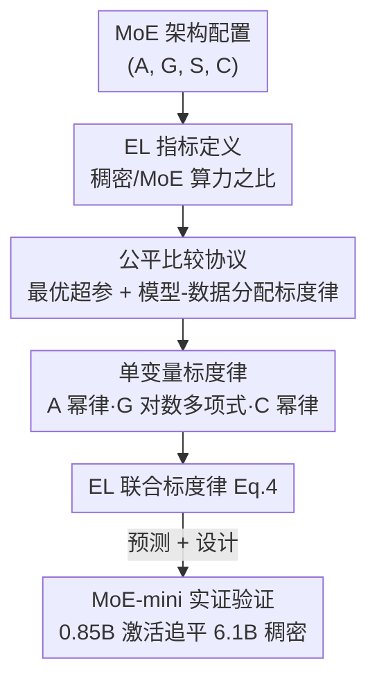

# Towards Greater Leverage: Scaling Laws for Efficient Mixture-of-Experts Language Models

**会议**: ICLR 2026  
**OpenReview**: [https://openreview.net/forum?id=7r2lkhDGUj](https://openreview.net/forum?id=7r2lkhDGUj)  
**领域**: LLM效率  
**关键词**: MoE, 标度律, 效率杠杆, 激活率, 专家粒度  

## 一句话总结
本文提出"效率杠杆"（Efficiency Leverage, EL）这一指标来量化 MoE 相对稠密模型省了多少算力，通过训练 300+ 个最大 28B 的 MoE 模型拟合出一条以激活率、专家粒度、算力预算为自变量的统一标度律，并据此设计出仅 0.85B 激活参数的 MoE-mini，用 7 倍更少算力追平 6.1B 稠密模型。

## 研究背景与动机

**领域现状**：MoE 已经成为高效扩展 LLM 的主流架构，它通过稀疏激活把"总参数量"和"计算开销（FLOPs）"解耦——比如 DeepSeekMoE 总参数 16B、每 token 只激活 2.8B，却能匹敌 7B 稠密模型，参数效率约 2.5 倍。

**现有痛点**：这种解耦带来一个棘手问题——**给定一套 MoE 配置（激活率、专家粒度等），预训练前根本没法预测它的"有效容量"**。总参数量和激活参数量单拎出来都不是可靠的性能代理：你既不知道这套配置能打过多大的稠密模型，也无法在烧钱训练前设定合理预期。

**核心矛盾**：标度律本是预测语言模型性能的利器，但它在 MoE 上的应用是碎片化的。已有工作大多孤立地研究单个架构因素（稀疏度 *或* 粒度），从没回答**这些因素如何共同决定 MoE 相对稠密模型的真实算力优势**。loss-centric 的传统标度律预测的是"loss 会是多少"，而实践者真正想知道的是"这套 MoE 比稠密模型高效多少倍"。

**本文目标**：建立一个能在训练前就预测任意 MoE 配置算力优势的框架，并用它指导高效模型设计。

**切入角度**：与其预测绝对 loss（数据集相关、难以解释），不如直接定义一个**比值型指标**——稠密模型要花多少倍算力才能追平这个 MoE。这个角度直接、可迁移，且天然适合架构选型。

**核心 idea**：定义效率杠杆 EL = 稠密模型所需算力 / MoE 所需算力，把 EL 拆解为激活率（幂律主导项）、专家粒度（对数多项式调制项）、算力预算（幂律放大项）三者的函数，拟合出一条统一标度律。

## 方法详解

### 整体框架

本文要解决的是"训练前预测 MoE 配置的算力优势"。整体走一条**三阶段**路线：先建立**公平的训练条件**（否则不同架构的对比不可信），再**逐维度隔离**激活率/粒度/共享率对 EL 的影响并拟合单变量标度律，最后把它们**合成为一条联合标度律 Eq.4**，用来预测任意配置的 EL，并以此反向设计 MoE-mini 做实证验证。

整个流程的核心是 EL 这把"尺子"：对架构 $X$，其最优 loss 随算力的曲线建模为幂律 $L_X(C) = \alpha_X C^{\beta_X} + b_X$；把 MoE 在自身预算 $C_{\text{MoE}}$ 下达到的 loss 作为目标 loss $L^\star$，反解稠密曲线求出追平所需的 $C_{\text{Dense}}$，于是

$$\text{EL}(X_{\text{MoE}} \mid X_{\text{Dense}}; C_{\text{MoE}}) = \frac{C_{\text{Dense}}}{C_{\text{MoE}}}.$$

EL=5 就意味着这套 MoE 抵得上一个用 5 倍算力训练的稠密模型。

### 关键设计

**1. 效率杠杆 EL：把"省了多少算力"做成可比的标量**

针对"无法预测 MoE 有效容量"这个痛点，本文不去预测绝对 loss，而是定义一个比值指标 EL。形式上它是**稠密与 MoE 达到同一目标 loss 所需算力预算之比**。为了让 EL 只依赖架构本身，作者把目标 loss 取为 MoE 在自身预算下达到的 loss $L^\star = L_{X_{\text{MoE}}}(C_{\text{MoE}})$，于是 EL 化简为 $C_{\text{Dense}}/C_{\text{MoE}}$。

这样设计的好处是双重的：其一，绝对 loss 是数据集相关、难以横向解读的，而 EL 是无量纲倍数，天然可比、可迁移；其二，当 $A=1$（即退化为稠密）时 EL=1，满足"稠密等价"边界，保证整个标度律有物理意义的锚点。EL 把"架构选型"从"拟合多条复杂 loss 曲线"简化成"直接比较倍数"。

**2. 公平比较协议：先用标度律校准超参与数据分配，再谈架构对比**

如果不同 MoE 架构各自用了次优的学习率/批大小/数据量，那比出来的 EL 是噪声。为此作者在正式实验前先拟合两条前置标度律。**最优超参标度律**：通过大规模超参搜索得到最优学习率 $\eta_{\text{opt}}$ 与批大小 $B_{\text{opt}}$ 随算力 $C$ 的关系，并发现 MoE 与稠密的关键差异——大算力下 MoE 更偏好**显著更大的批大小**和**略低的学习率**，这源于 MoE 的稀疏反向传播：一个 batch 里只有一部分 token 的梯度会更新某个专家。**最优模型-数据分配标度律**：固定 FLOPs 预算 $C$ 在模型规模 $M$ 与数据量 $D$（$C = M \cdot D$）之间分配，发现两者指数都接近 0.5（与 Chinchilla 一致），但**同等预算下最优 MoE 比最优稠密模型更小、却吃更多数据**，说明 MoE 单参数容量更高、特别适合"数据多但算力受限"的场景。每个待测架构都用这两条律设到近最优点，再训练超过最优 token 数 3 倍（模拟真实的 overtrained 状态），保证比较公平。

**3. 三条单变量标度律：把激活率、粒度、算力对 EL 的影响分别拟合出来**

在公平条件下，作者用 IsoFLOPs 实验逐个隔离架构维度，拟合出三条单变量律。**激活率 $A$（主导项，幂律）**：降低激活率（增大稀疏度）持续带来效率增益，且无明显拐点（一路测到 1/128≈0.8%）。拟合形式为
$$\log \text{EL}_{C,G}(\hat A) = a_A \log \hat A, \qquad \frac{1}{\hat A} = \frac{1}{A + (1/A_{\text{start}} - 1/A_{\text{max}})^{-1}} + \frac{1}{A_{\text{max}}},$$
其中 $\hat A$ 是 $A$ 的饱和变换；指数 $a_A$ 随 $A$ 减小而增大（稀疏边际收益递减），也随算力 $C$ 增大而增大。**专家粒度 $G$（调制项，对数多项式）**：$G = 2d_{\text{model}}/d_{\text{expert}}$，loss 随 $G$ 呈 U 形，存在最优点（标准 load-balancing 下约为 8–12），拟合为
$$\log \text{EL}_{C,A}(G) = a_G + b_G\big(\log G\,(\log G + c_G)\big),$$
其中 $a_G$ 是 $G=1$ 时的基准 EL，$b_G$ 控制曲率（架构对粒度的敏感度），$c_G$ 决定最优粒度位置；关键的是这条曲线**跨算力预算高度一致**，即粒度的影响独立于算力。**算力预算 $C$（放大项，幂律）**：固定 $A$、$G$ 时 EL 随算力增长，$\log \text{EL}_{A,G}(C) = a_C \log C + c_C$，意味着算力越大、MoE 的效率优势越被放大。至于共享专家率 $S$（U 形、最优为"一个共享专家"）与层排布等，影响是次要的、有稳健的近最优默认值，故不进入主标度律。

**4. EL 联合标度律：一个公式吃下三种效应**

最后把三条单变量律合成一条统一公式：
$$\text{EL}(A, G, C) = \hat A^{\,\alpha + \gamma(\log G)^2 + \beta \log G}, \qquad \alpha = a + d\log C.$$
这里指数项里 $\alpha$ 捕捉"激活率幂律 × 算力放大"——$a$ 是参考算力下的基准指数，正常数 $d$ 量化算力 $C$ 对 EL 的放大；$\beta,\gamma$ 用 $\log G$ 的二次型建模粒度的非线性调制，直接对应前面观察到的 U 形最优粒度。用 Huber loss + BFGS 拟合，并刻意只用 EL<6 的点训练、把高杠杆点留作验证集，结果 $R^2 = 0.9858$，训练集 RMSE 0.2169（200 点）、验证集 0.5275（24 点），残差近似零均值正态——说明这条律不仅拟合好，对训练范围外的高杠杆点还有很强的**外推**能力。据此预测：在 1e22 FLOPs 下，激活率 3.1%、粒度 12 的配置 EL 可超过 7×。

### 损失函数 / 训练策略
本文不改训练目标，沿用标准的下一 token 预测 + 标准 load-balancing 辅助损失（粒度最优区间 8–12 正是在该负载均衡设置下测得的；作者指出路由质量是关键，差的负载均衡会把最优粒度推向更粗）。计算开销统一以非嵌入 FLOPs/token 即模型规模 $M$ 衡量，$C = M \cdot D$。

## 实验关键数据

### 主实验：MoE-mini vs Dense-6.1B
按标度律预测设计 MoE-mini（总 17.5B、激活 0.85B、$G=12$、$A=3.4\%$），与 Dense-6.1B 在**同一份 1T 高质量 token** 上对训。MoE-mini 激活参数只有对手约 13%，训练/推理成本 7 倍更省。

| 模型 | General/Reasoning | Professional | Language | Code | Math | 总平均 |
|------|------|------|------|------|------|------|
| Dense-6.1B | 55.8 | 44.0 | 69.2 | 36.9 | 32.9 | 44.0 |
| MoE-mini (A0.8B) | 56.2 | 44.7 | 71.6 | 39.8 | 34.7 | **45.5** |

MoE-mini 总平均 45.5 反超 Dense-6.1B 的 44.0，在代码、数学、语言理解上优势尤为明显；最终训练 loss 也更低（末 100B token 时两者 loss 差仅约 0.01）。这实证确认了标度律预测的 >7× 效率杠杆。

### 消融/分析：三个架构维度对 EL 的影响

| 架构维度 | 对 loss/EL 的关系 | 关键结论 |
|------|------|------|
| 激活率 $A$ | 幂律，EL 随 $A$ 减小单调增 | 主导项，测到 0.8% 仍无拐点，大算力下增益放大 |
| 专家粒度 $G$ | U 形（对数多项式） | 存在最优区间 ≈8–12，跨算力一致，独立于预算 |
| 共享率 $S$ | U 形 | 小而非零最优；大规模下"一个共享专家"最高效 |
| 算力 $C$ | 幂律，EL 随 $C$ 增大 | 算力越大 MoE 优势越被放大 |

### 关键发现
- **激活率是效率第一驱动力**：越稀疏越高效且无观测到的拐点，颠覆"激活太少会塌"的直觉（至少在测试范围内）。
- **粒度有甜区且与算力解耦**：8–12 是稳定最优，意味着可以一次定好粒度、不必随规模反复调。
- **效率优势随算力放大**：EL 不是常数而是随预算增长，解释了为什么 MoE 在大规模预训练里越来越香。
- **共享专家/层排布是二阶因素**：有稳健默认值（一个共享专家、早期插几层 dense 缓解路由不均），不必精调。

## 亮点与洞察
- **把"省多少算力"做成可拟合的标量 EL**：相比 loss-centric 标度律，EL 直接给出"抵几倍稠密"的倍数，把架构选型从拟合多条曲线降维成比大小，工程上极实用。
- **故意留高杠杆点做验证集**：用 EL<6 训练、EL≥6 验证，正面检验外推能力（这是标度律论文最容易被质疑的点），$R^2=0.9858$ 很有说服力。
- **先校准再比较的实验纪律**：前置拟合超参与数据分配标度律，保证每个架构都在近最优点对比，避免"输在调参而非架构"的常见陷阱——这套协议本身可迁移到任何架构对比研究。
- **"小而强"的落地范式**：0.85B 激活打平 6.1B 稠密，给数据多、算力紧的团队一条明确的设计配方（低激活率 + 粒度 12 + 一个共享专家）。

## 局限与展望
- **只算理论 FLOPs**：忽略通信、显存、kernel 效率、并行等真实 wall-clock 开销，给出的是效率理论上界，离实际墙钟收益还有距离。
- **假设各架构因素独立**：为可解析而逐维度研究再合成，可能漏掉因素间的交互效应。
- **统一超参律不分稀疏度**：对所有 MoE 用同一条超参标度律，未来可做"稀疏度感知"的超参律进一步榨效率。
- **聚焦算力预算而非其分配**：尚未建立 MoE 版的 Chinchilla（模型大小 × 数据量）效率律来指导这一权衡。
- 自己的观察：激活率"无拐点"结论受限于测试下界 0.8% 与负载均衡设置，更极端稀疏或更强路由下是否仍成立存疑；下游 benchmark 总平均仅差 1.5 分，"反超"幅度不大，结论更稳妥的表述是"持平偏优"。

## 相关工作与启发
- **vs 孤立研究稀疏度/粒度的标度律（Clark et al. 2022; Ludziejewski et al. 2024）**：他们各自只看单个架构因素，本文把激活率、粒度、算力统一进一条联合律并显式建模三者交互，且粒度定义改用 $2d_{\text{model}}/d_{\text{expert}}$ 以对齐 DeepSeek/Moonshot 等近期模型，观测到的标度现象因此不同。
- **vs loss-centric 标度律（Kaplan et al. 2020; Hoffmann et al. 2022 Chinchilla）**：传统律预测"loss 是多少"，本文预测"比稠密高效多少倍"，对架构设计更可操作；但本文坦承尚缺 MoE 版的模型-数据分配 Chinchilla 律，二者互补。
- **vs DeepSeekMoE 等具体高效 MoE 实践**：它们给出优秀的单点配置，本文给出连续可预测的设计空间地图（1e22 FLOPs 下的 EL 等高线），让"为什么这套配置好"有了定量依据。

## 评分
- 新颖性: ⭐⭐⭐⭐⭐ 把 MoE 效率重构为可预测的 EL 指标并拟合统一标度律，视角新且实用。
- 实验充分度: ⭐⭐⭐⭐⭐ 训练 300+ 模型、680k H800-小时，留高杠杆点做外推验证，并用 MoE-mini 端到端落地。
- 写作质量: ⭐⭐⭐⭐ 三阶段方法论清晰，公式与图配合好；部分推导细节下放附录。
- 价值: ⭐⭐⭐⭐⭐ 给高效 MoE 设计提供了可直接套用的配方与预测工具，工程指导意义强。

<!-- RELATED:START -->

## 相关论文

- [\[ICLR 2026\] Scaling Laws Meet Model Architecture: Toward Inference-Efficient LLMs](scaling_laws_meet_model_architecture_toward_inference-efficient_llms.md)
- [\[ICLR 2026\] UltraLLaDA: Scaling the Context Length to 128K for Diffusion Large Language Models](ultrallada_scaling_the_context_length_to_128k_for_diffusion_large_language_model.md)
- [\[ICLR 2026\] xLSTM Scaling Laws: Competitive Performance with Linear Time-Complexity](xlstm_scaling_laws_competitive_performance_with_linear_time-complexity.md)
- [\[ICLR 2026\] Fast Catch-Up, Late Switching: Optimal Batch Size Scheduling via Functional Scaling Laws](fast_catch-up_late_switching_optimal_batch_size_scheduling_via_functional_scalin.md)
- [\[ICLR 2026\] Mixture-of-Experts Can Surpass Dense LLMs Under Strictly Equal Resource](mixture-of-experts_can_surpass_dense_llms_under_strictly_equal_resource.md)

<!-- RELATED:END -->
