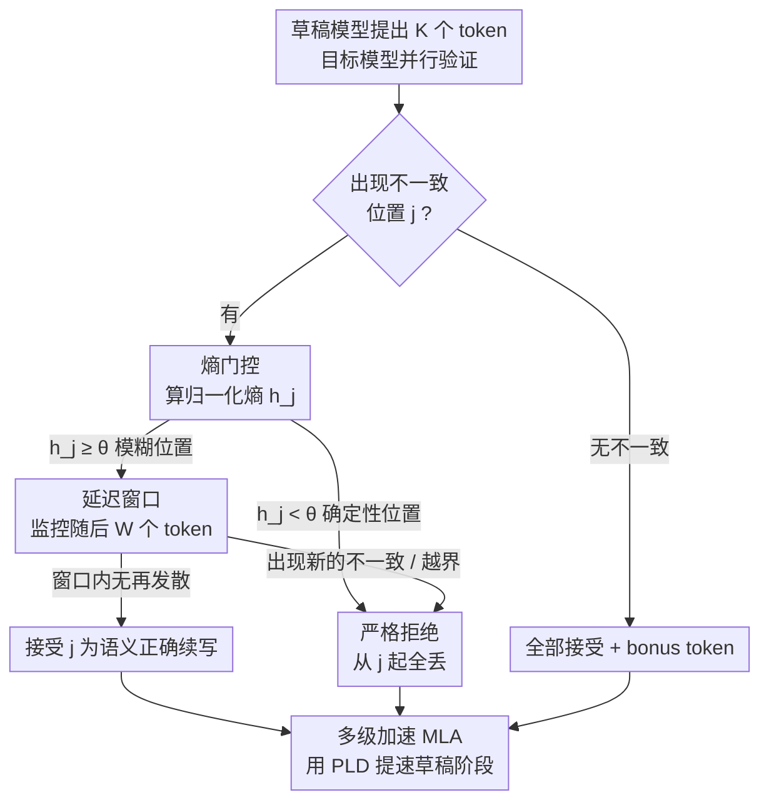

# Training-Free Loosely Speculative Decoding: Accepting Semantically Correct Drafts Beyond Exact Match

**会议**: ICLR 2026  
**OpenReview**: [https://openreview.net/forum?id=JjoTg34YiU](https://openreview.net/forum?id=JjoTg34YiU)  
**代码**: https://github.com/AMD-AGI/FLy  
**领域**: LLM效率  
**关键词**: 投机解码, 宽松验证, 熵门控, 自纠正, 训练无关

## 一句话总结
针对标准投机解码"精确匹配"会误杀语义正确草稿的问题，FLy 用目标模型自身的熵和"自纠正"行为，无需任何训练就放行措辞不同但语义等价的 token，在保持 ≥99% 精度的同时把 Llama-3.1-70B 平均加速 2.81×、405B 加速 5.07×，且在分布外任务上比训练式的 EAGLE-3 快 1.62×。

## 研究背景与动机

**领域现状**：投机解码（Speculative Decoding, SPD）是当前给大模型推理提速的主流手段——让一个轻量草稿模型一次性顺序提出多个候选 token，再由大目标模型并行验证、接受其中与自己预测一致的部分。它在数学上能保证不改变目标模型的输出分布，又能显著提升吞吐。

**现有痛点**：标准 SPD 的验证规则是"精确匹配"——草稿 token 只有与目标模型在该位置的 argmax 完全相同才被接受，一旦不同就从该位置起把后面全部丢弃。这条死板规则会误杀大量"措辞不同但语义完全正确"的续写。已有研究（Bachmann et al., 2025）发现，即便是高质量草稿（如人写文本），在这套规则下接受率也很低。随着草稿模型越来越强，这种"一字不差才放行"的瓶颈越来越明显。

**核心矛盾**：要放宽验证，就得有办法判断"草稿与目标不一致"到底是真错还是只是换了个说法。代表性的宽松方案 JudgeDecoding 训练了一个辅助分类器来判断草稿 token 在上下文里是否有效，效果不错，但需要精心标注的训练数据，且这个有监督分类器在跨域（OOD）时泛化很差——一旦换了任务分布就容易判错。于是"宽松"与"鲁棒/低成本"之间形成了矛盾。

**本文目标**：在不训练任何额外模块、不收集任何数据的前提下，让验证器学会接受语义正确的不一致草稿，并且天然对分布漂移鲁棒。

**切入角度**：作者观察到一个关键性质——当 LLM 被喂入一个**真正错误**的 token 时，它在后续生成中往往会表现出"自纠正"（self-corrective）行为试图把话拉回来；而当面对的只是**措辞不同但语义等价**的 token 时，它会顺势继续往下写、不再发散。这个性质完全来自目标模型自己，不需要外部裁判。

**核心 idea**：用目标模型自身的"熵 + 后续是否自纠正"来替代外部分类器，做一个两级判定——熵门控先区分"该位置是否允许多个合理候选"，延迟窗口再观察目标模型在随后几步是否继续发散，从而无训练地放行语义正确的草稿。

## 方法详解

### 整体框架

FLy 只改 SPD 的**验证策略**，不动草稿/目标模型本身，因此是即插即用、模型无关的。一轮 SPD 里，草稿模型提出 $K$ 个 token，目标模型一次前向并行打分；标准 SPD 在第一个不一致位置就截断。FLy 的做法是：在每个不一致位置 $j$ 上，先用**熵门控**判断这个位置是不是"本来就有多个合理候选"，若是确定性位置（如算术里的某个数字）就按老规矩拒绝；若是模糊位置就进入**延迟窗口**，再往后看 $W$ 个 token，用"目标模型是否继续发散"来最终裁定接受还是拒绝。由于放行了更多语义正确 token，平均接受长度 $\tau$ 大幅上升，反过来又让草稿阶段成为新的瓶颈，于是 FLy 再叠加一个**多级加速（MLA）**，用无参数的 PLD 把草稿生成也加速掉。

整个判定是"逐不一致位置串行过滤、取最早被拒位置"的流水线，pipeline 清晰，框架图如下：

### 关键设计

**1. 熵门控：先用目标模型的不确定性筛掉"非黑即白"的位置**

直接对所有不一致都做"宽松放行"是危险的——像算术里某一位数字这种位置，只有唯一正确答案，放行错的 token 会直接污染结果。熵门控就是用来挡住这类位置的。对每个不一致位置 $j$，FLy 用目标模型在该位置已有的 logits（softmax 后的分布 $p_{M_T,j}$）算一个归一化熵：

$$h_j = \frac{-\sum_{v\in V} p_{M_T,j}(v)\log p_{M_T,j}(v)}{\log |V|} \in [0,1]$$

$h_j$ 大说明此位置有多个 token 几乎可以互换（如同义代词、可替换措辞），$h_j$ 小说明目标模型强烈偏好它的 top-1（如算术数字）。门控以阈值 $\theta$ 二分：$h_j < \theta$ 记为 `Strict`，回退到标准 SPD、从 $j$ 起全部拒绝；$h_j \ge \theta$ 记为 `Defer`，把"拒不拒"的决定推迟给延迟窗口。这一步的关键在于它**只读已经算好的 logits、不增加任何前向**，所以开销可忽略（实测每轮仅 0.45–0.57ms），却能把"换个说法也合理"和"只能有唯一答案"两类位置干净分开，避免在确定性位置上误放行而破坏精度。

**2. 延迟窗口：用目标模型自己的"自纠正"行为裁定语义对错**

熵高只说明"此处允许多个候选"，但具体这个草稿 token 是不是真的语义正确，还得验证。FLy 的判据是论文最核心的观察：喂入语义错误 token 时目标模型会试图纠正、从而在随后生成里再次发散；喂入语义等价 token 时它会顺势继续、不再发散。于是在 `Defer` 的不一致位置 $j$，FLy 向后看一个长度 $W$ 的窗口，统计窗口内的不一致数 $N_W(j)=\sum_{i=j+1}^{j+W}(1-\Delta_i)$，裁定规则为：

$$\text{DeferDecide}(j)=\begin{cases}\text{Accept}, & h_j\ge\theta,\; N_W(j)=0,\; j+W\le K\\ \text{Reject}, & \text{否则}\end{cases}$$

也就是：若往后 $W$ 个 token 都不再发散（$N_W(j)=0$），说明目标模型认可了这个续写、第一个不一致 token 被判为语义正确而接受；若窗口内又冒出新的不一致，说明模型在"纠错"、于是回溯拒绝位置 $j$ 及其之后。还有一个边界情形：$j+W>K$ 时窗口长度不够，FLy 保守地直接拒绝该位置（只丢掉末尾少量 token，代价极小），以稳住精度、保持实现简单。整轮最终接受数 $s_{\text{FLy}}=\min\{s_{\text{gate}}, s_{\text{defer}}\}$ 取最早被拒位置决定，多轮平均得到平均接受长度 $\tau$。这套机制不需要任何外部裁判模型，判据完全长在目标模型身上，因此天然不受训练数据分布的限制。

**3. 多级加速（MLA）：把放长草稿带来的草稿端开销也压下去**

放行更多语义正确 token 让 $\tau$ 大幅变长，意味着草稿每轮要提出更多 token（$K$ 更大），草稿模型自回归生成的成本随之上升，反而盖过了被压缩的目标验证成本，成为新的端到端瓶颈（Table 1 显示草稿耗时数倍于目标验证）。标准 SPD 只加速目标模型，对此无能为力。MLA 的思路是：对草稿阶段**再套一层投机加速**。为了不破坏 FLy 的"无训练、跨域泛化"特性，作者特意选了无参数、即插即用的 Prompt Lookup Decoding（PLD，一种基于 n-gram 检索的极快草稿方法）来给草稿提速，避免引入需要训练的小模型带来的额外偏置。MLA 与验证策略正交，专门解决"草稿端变成瓶颈"这一在本方法下被放大的问题——这正是 FLy 因为能安全提出超长草稿序列而独有的副作用，在标准 SPD 里瓶颈通常在目标验证侧、并不需要它。

### 一个完整示例

以论文 Figure 2 的例子走一遍：prompt 问"什么是过拟合现象"。草稿模型续写到某处给出 token `it`，目标模型 argmax 是 `,`（标点）——出现不一致。先看熵门控：此处目标模型有多个合理续法（标点或代词都通），$h_j \ge \theta$，记 `Defer`，进入窗口。延迟窗口监控随后 $W=6$ 个 token，发现草稿与目标重新对齐、不再发散，于是判定 `it` 是语义正确的续写、**接受**。换一种情形：若某不一致位置后目标模型立刻又冒出第二个不一致（模型在纠错），则该位置被回溯拒绝。最终 FLy 放行的语义有效续写明显多于标准 SPD（后者在第一个不一致就截停），$\tau$ 从个位数升到十几。

## 实验关键数据

模型：草稿用 Llama-3.1-8B-Instruct，目标用 Llama-3.1-70B / 405B-Instruct；对比 EAGLE-2/3（训练式）和 SpS、REST、TokenRecycling（训练无关）。默认 $W=6$、$\theta=0.3$、$K=15$（70B）/ $25$（405B），跑在 AMD MI355X 上。

### 主实验（OOD 加速比，T=0，部分摘录）

| 目标模型 | 方法 | 训练 | ACP-prog | NIAH-multi | MGSM(均) | Mean Speedup | Mean τ |
|----------|------|------|----------|-----------|----------|--------------|--------|
| Llama-3.3-70B | EAGLE-3 | ✓ | 1.52× | 2.15× | ~1.5× | 1.56× | 2.50 |
| Llama-3.3-70B | **FLy** | ✗ | 1.88× | 3.34× | ~2.5× | **2.53×** | **11.35** |
| Llama-3.1-70B | SpS | ✗ | 1.69× | 3.33× | ~1.7× | 2.04× | 10.91 |
| Llama-3.1-70B | **FLy** | ✗ | 2.02× | 3.57× | ~2.7× | **2.74×** | **12.41** |
| Llama-3.1-405B | **FLy** | ✗ | 2.72× | 4.07× | ~5× | **4.80×** | 17.13 |

在 OOD 上，训练式 EAGLE-3 严重退化（ID 3.83× → OOD 1.56×），FLy 用 Llama-3.3-70B 反超 EAGLE-3 达 1.62×（T=0）/ 1.77×（T=1）；优势随模型变大而扩大，405B 上达 4.80×。

### ID 加速比（T=0，部分摘录）

| 目标模型 | 方法 | 训练 | GSM8K | HumanEval | MBPP | Mean Speedup | Mean τ |
|----------|------|------|-------|-----------|------|--------------|--------|
| Llama-3-70B | EAGLE-2 | ✓ | 2.54× | 2.56× | 2.61× | 2.57× | 3.96 |
| Llama-3-70B | **FLy** | ✗ | 2.94× | 2.60× | 2.53× | **2.69×** | **11.87** |
| Llama-3.3-70B | EAGLE-3 | ✓ | 3.72× | 3.97× | 3.80× | 3.83× | 5.61 |
| Llama-3.1-405B | **FLy** | ✗ | 4.61× | 5.15× | 6.26× | **5.34×** | 17.14 |

ID 上 FLy 70B 平均 2.88×（含 SpS/REST 对比组），超过训练式 EAGLE-2 1.05×；略逊于重度优化的 EAGLE-3，但对一个免训练即插即用方法属合理。405B 上 5.34× 大幅领先所有 baseline，且 405B 规模下 EAGLE-3 这类训练式方法常因训练成本过高而没有官方模型可用。精度方面，FLy 在各数据集/规模上 recovery 均 >99%，与训练式宽松方法 JudgeDecoding 持平。

### 消融实验

| 配置 | Speedup | τ | Recovery(%) | 说明 |
|------|---------|---|-------------|------|
| W=0（窗口禁用） | 3.42× | 15.59 | 93.7 | 全放行，最快但掉精度 |
| W=4 | 2.91× | 13.27 | 97.9 | 略快、略掉精度 |
| **W=6（默认）** | 2.86× | 12.61 | 100 | 完美恢复 |
| W=8 | 2.61× | 11.96 | 100 | 过严，τ 和加速都降 |
| θ=0（门控禁用） | 2.98× | 12.76 | 97.7 | 全 defer，伤精度 |
| **θ=0.3（默认）** | 2.86× | 12.61 | 100 | 强加速 + 完美恢复 |
| θ=1 | 1.64× | 9.89 | 100 | 全拒绝，退化为标准 SPD |
| w/o MLA | 2.69× | — | — | 仅加速目标 |
| **w/ MLA** | 2.86× | — | — | 草稿端再提速 |

### 关键发现
- **窗口与门控各管一头**：$W$ 控"接受得有多激进"，$W=0$ 最快但 recovery 仅 93.7%，$W=6$ 把 recovery 拉回 100% 且只损失少量加速；$\theta$ 控"哪些位置允许宽松"，$\theta=1$ 时方法退化回标准 SPD（τ 9.89），说明两级机制各自不可或缺。
- **K 有甜点**：τ 随 $K$ 单调增（K=25 时 τ=18.56），但加速比先升后降——因为未被接受的 $K-\tau$ 个草稿 token 成本会反噬；故 70B 用 K=15、验证更贵的 405B 用 K=25。
- **MLA 确有增量**：2.69×→2.86×，验证"把草稿阶段也加速"在 τ 变长后是真瓶颈。
- **草稿大小非单调**：1B→8B 中 τ 单调增，但 8B 综合最优（加速 2.86×、recovery 100%），因更大草稿自身算力成本也上升。
- **跨模型即插即用**：Qwen2.5-Coder-0.5B 配 Mistral-Large、DeepSeek-R1-Distill 系列互配等三组异构组合都达 1.85×–3.54× 加速且 recovery >99%，无需重训。

## 亮点与洞察
- **把"裁判"从外部模型搬回目标模型自身**：JudgeDecoding 需要训练分类器，FLy 用"熵 + 自纠正"两个完全来自目标模型的信号替代，既省掉数据/训练，又因为不依赖任何训练分布而天然抗 OOD——这是它在 OOD 上反超 EAGLE-3 的根本原因。
- **零额外前向**：熵直接从已有 logits 算出，判定逻辑几乎不增加计算（每轮 <0.6ms），这让"宽松验证"几乎白拿。
- **发现并修补了宽松验证的副作用**：放行越多 → τ 越长 → 草稿端越成瓶颈，作者没有止步于验证策略，而是顺势补了 MLA（且坚持用无参 PLD 不破坏免训练特性），把这条因果链闭环。
- **可迁移思路**："用模型后续是否自纠正来反推前面输出对错"这一信号，可迁移到草稿质量评估、幻觉检测、自一致性校验等需要"无监督判对错"的场景。

## 局限与展望
- **保守边界规则**：$j+W>K$ 时直接拒绝，意味着窗口越大、末尾越多位置无法享受宽松放行；窗口与 $K$ 的耦合限制了极长草稿下的收益上限。
- **"自纠正"假设的边界**：方法成立的前提是"喂错 token → 目标模型会发散纠错"。对那些被错误 token 误导后仍能"将错就错"顺畅续写的情形（模型本身不够强或上下文歧义大），延迟窗口可能误判，论文未深入分析这类失败模式。
- **超参虽固定但仍是经验值**：$W=6$、$\theta=0.3$ 在全实验通用且无需重调是卖点，但这组值的最优性更多由 HumanEval 等少数数据集上的消融支撑，跨任务是否始终最优缺乏理论保证。
- **精度"≥99%"非严格无损**：作为宽松 SPD，输出与原目标模型不再逐 token 相同，对要求严格分布一致的场景需谨慎。

## 相关工作与启发
- **vs 标准 SPD（SpS 等）**：标准 SPD 精确匹配、可证明无损分布，但误杀语义正确草稿、τ 低；FLy 牺牲严格无损（换来 ≥99% recovery），用熵门控+延迟窗口把 τ 从个位数拉到十几，加速显著更高。
- **vs JudgeDecoding（训练式宽松 SPD）**：两者都想放行语义正确草稿，JudgeDecoding 训练外部分类器、需标注数据且 OOD 脆弱（去掉代码训练样本后 HumanEval recovery 从 99.4% 掉到 92.3%）；FLy 免训练、判据长在目标模型上，OOD 鲁棒且即插即用。
- **vs EAGLE-2/3（训练式 SPD）**：EAGLE 系列训练辅助预测器，ID 上加速很强（EAGLE-3 ID 3.83×）但 OOD 严重退化（1.56×），且 405B 规模训练成本过高常无官方模型；FLy ID 略逊 EAGLE-3、却在 OOD 反超 1.62×，并能无成本支撑 405B。
- **vs 其他多级加速（基于量化/小模型的 mini-draft）**：以往多级加速依赖参数化 mini-draft；FLy 的 MLA 刻意选无参 PLD，保持训练无关与跨域泛化。

## 评分
- 新颖性: ⭐⭐⭐⭐⭐ 用目标模型自身"熵+自纠正"无训练实现宽松验证，视角新颖且直击 OOD 痛点
- 实验充分度: ⭐⭐⭐⭐⭐ ID/OOD、70B/405B、三组跨模型、全套超参消融齐备
- 写作质量: ⭐⭐⭐⭐ 机制与公式清晰，图示直观；个别记号（边界情形）需对照原文
- 价值: ⭐⭐⭐⭐⭐ 即插即用、模型无关、OOD 鲁棒，对大规模模型推理提速实用性强

<!-- RELATED:START -->

## 相关论文

- [\[ICLR 2026\] Beyond Fixed: Training-Free Variable-Length Denoising for Diffusion Large Language Models](beyond_fixed_training-free_variable-length_denoising_for_diffusion_large_languag.md)
- [\[ICLR 2026\] Hierarchy Decoding: A Training-free Parallel Decoding Strategy for Diffusion Large Language Models](hierarchy_decoding_a_training-free_parallel_decoding_strategy_for_diffusion_larg.md)
- [\[ICLR 2026\] RepSpec: Structural Re-parameterized Draft Model Training for Speculative Decoding](repspec_structural_re-parameterized_draft_model_training_for_speculative_decodin.md)
- [\[ICLR 2026\] SpecBranch: Speculative Decoding via Hybrid Drafting and Rollback-Aware Branch Parallelism](specbranch_speculative_decoding_via_hybrid_drafting_and_rollback-aware_branch_pa.md)
- [\[ICLR 2026\] Command-V: Training-Free Representation Finetuning Transfer](command-v_training-free_representation_finetuning_transfer.md)

<!-- RELATED:END -->
